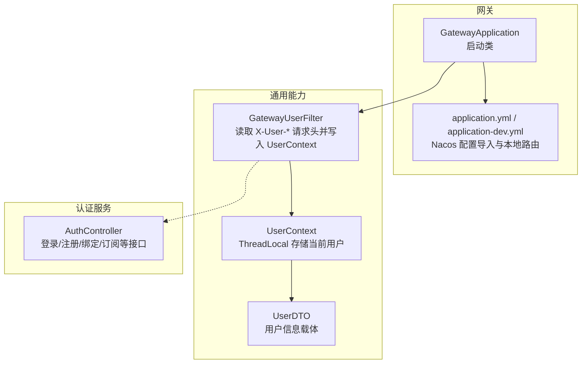
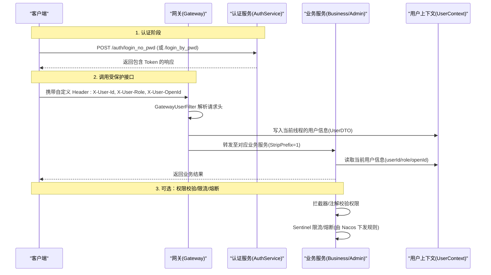
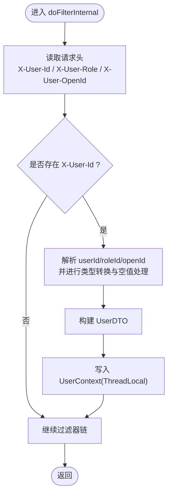
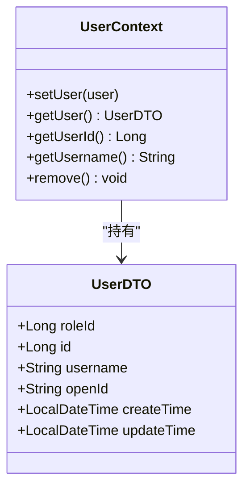
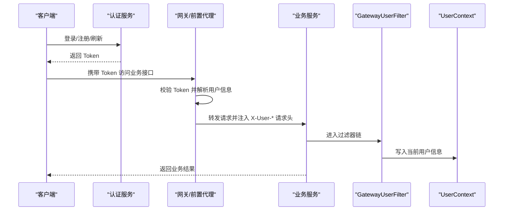
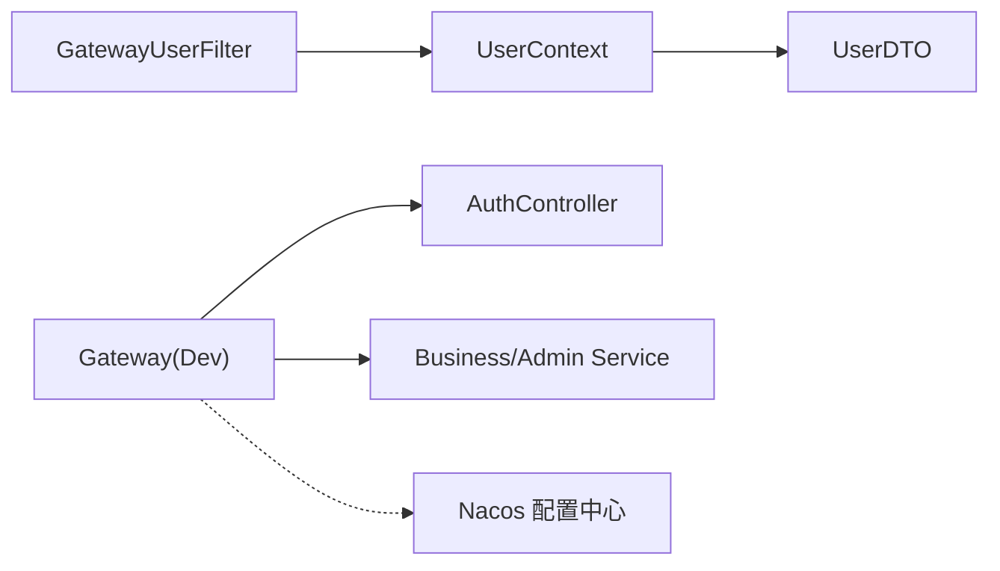

# 网关用户过滤器

<cite>
**本文引用的文件**   
- [GatewayUserFilter.java](file://class_times_record_back/common/src/main/java/com/shiroko/filter/GatewayUserFilter.java)
- [UserContext.java](file://class_times_record_back/common/src/main/java/com/shiroko/context/UserContext.java)
- [UserDTO.java](file://class_times_record_back/common/src/main/java/com/shiroko/repository/dto/UserDTO.java)
- [AuthController.java](file://class_times_record_back/auth-service/src/main/java/com/shiroko/controller/AuthController.java)
- [application.yml](file://class_times_record_back/gateway/src/main/resources/application.yml)
- [application-dev.yml](file://class_times_record_back/gateway/src/main/resources/application-dev.yml)
- [GatewayApplication.java](file://class_times_record_back/gateway/src/main/java/com/shiroko/gateway/GatewayApplication.java)
</cite>

## 目录
1. [简介](#简介)
2. [项目结构](#项目结构)
3. [核心组件](#核心组件)
4. [架构总览](#架构总览)
5. [详细组件分析](#详细组件分析)
6. [依赖关系分析](#依赖关系分析)
7. [性能与稳定性](#性能与稳定性)
8. [故障排查指南](#故障排查指南)
9. [结论](#结论)
10. [附录：配置与协议、部署测试](#附录配置与协议部署测试)

## 简介
本文件围绕“网关用户过滤器”在微服务架构中的作用进行系统化说明，重点覆盖以下方面：
- 请求路由前的用户信息预处理：从请求头解析用户标识并注入上下文。
- 跨服务用户身份传递：通过统一请求头在网关到业务服务之间透传用户信息。
- 网关层安全检查机制：结合认证服务完成登录鉴权与令牌刷新，后续由业务侧拦截器/注解进行权限校验。
- 过滤器链执行顺序、请求对象包装与解包、用户信息的序列化与反序列化。
- 与认证服务的交互方式、用户权限预验证、请求限流与熔断保护（基于 Nacos + Sentinel）。
- 网关配置示例、用户信息传递协议定义、故障排查方法以及完整的部署和测试指南。

## 项目结构
本项目采用多模块微服务架构，网关位于 gateway 模块，通用能力（如用户上下文、过滤器）沉淀于 common 模块，认证逻辑集中在 auth-service。

图示来源
- [GatewayApplication.java:1-17](file://class_times_record_back/gateway/src/main/java/com/shiroko/gateway/GatewayApplication.java#L1-L17)
- [application.yml:1-19](file://class_times_record_back/gateway/src/main/resources/application.yml#L1-L19)
- [application-dev.yml:1-38](file://class_times_record_back/gateway/src/main/resources/application-dev.yml#L1-L38)
- [GatewayUserFilter.java:1-56](file://class_times_record_back/common/src/main/java/com/shiroko/filter/GatewayUserFilter.java#L1-L56)
- [UserContext.java:1-37](file://class_times_record_back/common/src/main/java/com/shiroko/context/UserContext.java#L1-L37)
- [UserDTO.java:1-30](file://class_times_record_back/common/src/main/java/com/shiroko/repository/dto/UserDTO.java#L1-L30)
- [AuthController.java:1-197](file://class_times_record_back/auth-service/src/main/java/com/shiroko/controller/AuthController.java#L1-L197)

章节来源
- [GatewayApplication.java:1-17](file://class_times_record_back/gateway/src/main/java/com/shiroko/gateway/GatewayApplication.java#L1-L17)
- [application.yml:1-19](file://class_times_record_back/gateway/src/main/resources/application.yml#L1-L19)
- [application-dev.yml:1-38](file://class_times_record_back/gateway/src/main/resources/application-dev.yml#L1-L38)

## 核心组件
- 网关用户过滤器 GatewayUserFilter
  - 职责：在请求进入业务服务前，从请求头中读取用户标识与角色，构造用户信息并写入线程上下文，供后续业务处理使用。
  - 关键点：仅在有用户标识时设置上下文；对 openId 空串做特殊处理；日志脱敏打印。
- 用户上下文 UserContext
  - 职责：提供 ThreadLocal 存取当前用户信息，暴露便捷方法获取 userId、username 等。
- 用户数据模型 UserDTO
  - 职责：承载用户基本信息（id、roleId、openId 等），作为上下文中的值对象。
- 认证服务 AuthController
  - 职责：提供登录、注册、绑定、订阅消息授权等接口，返回包含 Token 的响应，供客户端后续携带访问受保护资源。

章节来源
- [GatewayUserFilter.java:1-56](file://class_times_record_back/common/src/main/java/com/shiroko/filter/GatewayUserFilter.java#L1-L56)
- [UserContext.java:1-37](file://class_times_record_back/common/src/main/java/com/shiroko/context/UserContext.java#L1-L37)
- [UserDTO.java:1-30](file://class_times_record_back/common/src/main/java/com/shiroko/repository/dto/UserDTO.java#L1-L30)
- [AuthController.java:1-197](file://class_times_record_back/auth-service/src/main/java/com/shiroko/controller/AuthController.java#L1-L197)

## 架构总览
下图展示了从客户端发起请求到业务服务处理的完整链路，包括认证流程、网关过滤、上下文传递与后续权限校验。

图示来源
- [AuthController.java:58-66](file://class_times_record_back/auth-service/src/main/java/com/shiroko/controller/AuthController.java#L58-L66)
- [GatewayUserFilter.java:30-54](file://class_times_record_back/common/src/main/java/com/shiroko/filter/GatewayUserFilter.java#L30-L54)
- [UserContext.java:15-35](file://class_times_record_back/common/src/main/java/com/shiroko/context/UserContext.java#L15-L35)
- [application-dev.yml:14-31](file://class_times_record_back/gateway/src/main/resources/application-dev.yml#L14-L31)

## 详细组件分析

### 组件一：GatewayUserFilter（网关用户过滤器）
- 功能要点
  - 优先级：通过 @Order 设置为较高优先级，确保在大多数其他过滤器之前执行。
  - 请求头解析：读取 X-User-Id、X-User-Role、X-User-OpenId。
  - 上下文注入：将解析出的用户信息封装为 UserDTO 并写入 UserContext。
  - 安全与健壮性：对 openId 空串视为无值；对用户 ID/角色进行类型转换；记录调试日志并对敏感信息进行脱敏。
- 执行时机
  - 在 Spring Web MVC 过滤器链中执行，适用于 Servlet 容器环境下的业务服务内部过滤器场景。
- 注意事项
  - 该过滤器运行在业务服务侧，而非 Spring Cloud Gateway 的 WebFlux 过滤器链。若需要在网关层（WebFlux）实现相同能力，应使用 GlobalFilter。
  - 需确保上游（网关或前置代理）正确注入上述请求头。

图示来源
- [GatewayUserFilter.java:30-54](file://class_times_record_back/common/src/main/java/com/shiroko/filter/GatewayUserFilter.java#L30-L54)

章节来源
- [GatewayUserFilter.java:1-56](file://class_times_record_back/common/src/main/java/com/shiroko/filter/GatewayUserFilter.java#L1-L56)

### 组件二：UserContext（用户上下文）
- 设计模式
  - 使用 ThreadLocal 保存当前线程的用户信息，避免显式参数传递，简化业务代码。
- 关键方法
  - setUser/getUser/remove：设置、获取、清理当前用户。
  - getUserId/getUsername：便捷获取常用字段。
- 生命周期管理
  - 建议在请求结束时清理 ThreadLocal，防止线程复用导致的数据污染。

图示来源
- [UserContext.java:12-36](file://class_times_record_back/common/src/main/java/com/shiroko/context/UserContext.java#L12-L36)
- [UserDTO.java:17-29](file://class_times_record_back/common/src/main/java/com/shiroko/repository/dto/UserDTO.java#L17-L29)

章节来源
- [UserContext.java:1-37](file://class_times_record_back/common/src/main/java/com/shiroko/context/UserContext.java#L1-L37)
- [UserDTO.java:1-30](file://class_times_record_back/common/src/main/java/com/shiroko/repository/dto/UserDTO.java#L1-L30)

### 组件三：认证服务（AuthController）
- 主要能力
  - 微信登录、密码登录、Token 续期、注册、绑定学生、订阅消息授权等。
- 与网关用户过滤器的协作
  - 客户端先调用认证服务获取 Token；随后在访问受保护接口时，由网关或前置代理将用户信息以请求头形式注入，再由业务服务内的 GatewayUserFilter 解析并写入上下文。
- 典型流程
  - 登录成功后，客户端保存 Token；后续请求携带 Token 访问业务接口；网关/前置代理根据 Token 解析出用户信息并注入 X-User-* 请求头。

图示来源
- [AuthController.java:58-81](file://class_times_record_back/auth-service/src/main/java/com/shiroko/controller/AuthController.java#L58-L81)
- [GatewayUserFilter.java:30-54](file://class_times_record_back/common/src/main/java/com/shiroko/filter/GatewayUserFilter.java#L30-L54)
- [UserContext.java:15-35](file://class_times_record_back/common/src/main/java/com/shiroko/context/UserContext.java#L15-L35)

章节来源
- [AuthController.java:1-197](file://class_times_record_back/auth-service/src/main/java/com/shiroko/controller/AuthController.java#L1-L197)

## 依赖关系分析
- 组件耦合
  - GatewayUserFilter 依赖 UserContext 与 UserDTO，形成“过滤器 -> 上下文 -> 数据模型”的内聚组合。
  - 认证服务与网关/前置代理存在隐式契约：Token 格式、用户信息映射策略、请求头命名规范。
- 外部依赖
  - 网关通过 Nacos 动态导入配置（Sentinel、日志等），便于运行时调整限流与熔断策略。
  - 开发环境使用 application-dev.yml 直连后端服务，便于本地联调。

图示来源
- [application.yml:1-19](file://class_times_record_back/gateway/src/main/resources/application.yml#L1-L19)
- [application-dev.yml:14-31](file://class_times_record_back/gateway/src/main/resources/application-dev.yml#L14-L31)
- [GatewayUserFilter.java:30-54](file://class_times_record_back/common/src/main/java/com/shiroko/filter/GatewayUserFilter.java#L30-L54)
- [UserContext.java:15-35](file://class_times_record_back/common/src/main/java/com/shiroko/context/UserContext.java#L15-L35)
- [UserDTO.java:17-29](file://class_times_record_back/common/src/main/java/com/shiroko/repository/dto/UserDTO.java#L17-L29)
- [AuthController.java:58-81](file://class_times_record_back/auth-service/src/main/java/com/shiroko/controller/AuthController.java#L58-L81)

章节来源
- [application.yml:1-19](file://class_times_record_back/gateway/src/main/resources/application.yml#L1-L19)
- [application-dev.yml:1-38](file://class_times_record_back/gateway/src/main/resources/application-dev.yml#L1-L38)

## 性能与稳定性
- 过滤器开销
  - 仅进行少量字符串读取与对象赋值，CPU 与内存开销极低。
- 上下文管理
  - ThreadLocal 读写为 O(1)，但需注意请求结束时的清理，避免线程池复用导致的数据泄漏。
- 限流与熔断
  - 通过 Nacos 导入 Sentinel 配置，可在网关或业务服务层实施限流与熔断，提升系统韧性。
- 可观测性
  - 开发环境下开启 DEBUG 日志，便于追踪请求转发与过滤器执行情况。

[本节为通用指导，不直接分析具体文件]

## 故障排查指南
- 常见问题
  - 未注入用户信息：检查上游是否注入 X-User-Id/X-User-Role/X-User-OpenId。
  - 用户信息为空：确认认证流程成功且 Token 有效；检查网关/前置代理是否正确解析 Token 并注入请求头。
  - 线程上下文污染：确认请求结束后调用 UserContext.remove() 清理。
- 定位步骤
  - 查看过滤器日志输出（已对 openId 脱敏），确认解析结果。
  - 在业务服务中打印 UserContext 内容，验证上下文是否正确注入。
  - 检查 Nacos 下发的 Sentinel 规则是否误杀流量。
- 相关日志级别
  - 开发环境已启用 reactor.netty.http.client、org.springframework.cloud.gateway、com.shiroko.gateway 的 DEBUG 日志。

章节来源
- [GatewayUserFilter.java:45-51](file://class_times_record_back/common/src/main/java/com/shiroko/filter/GatewayUserFilter.java#L45-L51)
- [application-dev.yml:33-38](file://class_times_record_back/gateway/src/main/resources/application-dev.yml#L33-L38)

## 结论
GatewayUserFilter 在微服务架构中承担“用户信息预处理与上下文注入”的关键职责，配合认证服务与网关/前置代理，实现了跨服务用户身份的可靠传递。通过 Nacos + Sentinel 的动态配置能力，系统具备良好的限流与熔断弹性。为确保稳定与安全，建议完善请求头契约、强化上下文清理与可观测性建设。

[本节为总结性内容，不直接分析具体文件]

## 附录：配置与协议、部署测试

### 网关配置示例
- 生产/通用配置
  - 通过 spring.config.import 从 Nacos 导入 cr-gateway.yaml、common-sentinel.yaml、logback-spring.xml。
  - Nacos 地址、命名空间、分组等信息在 application.yml 中配置。
- 开发环境路由
  - application-dev.yml 定义了本地直连路由（/auth/**、/biz/**、/admin/**），并 StripPrefix=1。
  - 可通过 VM options 指定 -Dspring.profiles.active=dev 激活开发配置。

章节来源
- [application.yml:1-19](file://class_times_record_back/gateway/src/main/resources/application.yml#L1-L19)
- [application-dev.yml:1-38](file://class_times_record_back/gateway/src/main/resources/application-dev.yml#L1-L38)

### 用户信息传递协议定义
- 请求头约定
  - X-User-Id：用户唯一标识（Long 字符串形式）。
  - X-User-Role：用户角色标识（Long 字符串形式，可为空）。
  - X-User-OpenId：微信 OpenId（字符串，空串视为无值）。
- 行为约定
  - 当 X-User-Id 缺失时，过滤器不设置用户上下文。
  - 当 X-User-OpenId 为空串时，视为 null。
- 适用范围
  - 该协议用于网关/前置代理向业务服务传递用户信息；认证服务负责签发 Token 与用户信息解析。

章节来源
- [GatewayUserFilter.java:36-51](file://class_times_record_back/common/src/main/java/com/shiroko/filter/GatewayUserFilter.java#L36-L51)
- [UserDTO.java:20-29](file://class_times_record_back/common/src/main/java/com/shiroko/repository/dto/UserDTO.java#L20-L29)

### 与认证服务的交互方式
- 登录/注册/刷新
  - 客户端调用认证服务接口获取 Token。
- 访问受保护资源
  - 客户端携带 Token 访问业务接口；网关/前置代理校验 Token 并注入 X-User-* 请求头。
- 订阅消息授权
  - 认证服务提供无需登录的订阅消息授权接口，便于小程序端完成授权后再访问受限功能。

章节来源
- [AuthController.java:58-81](file://class_times_record_back/auth-service/src/main/java/com/shiroko/controller/AuthController.java#L58-L81)
- [AuthController.java:158-196](file://class_times_record_back/auth-service/src/main/java/com/shiroko/controller/AuthController.java#L158-L196)

### 限流与熔断保护
- 动态配置
  - 通过 Nacos 导入 common-sentinel.yaml，支持运行时调整限流阈值与熔断策略。
- 作用域
  - 可在网关层或业务服务层应用限流与熔断规则，保护下游服务免受突发流量冲击。

章节来源
- [application.yml:5-8](file://class_times_record_back/gateway/src/main/resources/application.yml#L5-L8)

### 部署与测试指南
- 启动入口
  - 网关启动类：GatewayApplication。
- 本地开发
  - 使用 application-dev.yml 直连后端服务，便于快速联调。
  - 通过 VM options 指定 -Dspring.profiles.active=dev。
- 集成测试
  - 先调用认证服务完成登录，获取 Token。
  - 再调用业务接口，确保网关/前置代理正确注入 X-User-* 请求头。
  - 在业务服务中读取 UserContext 验证用户信息。
- 可观测性
  - 开发环境开启 DEBUG 日志，关注网关转发与过滤器执行路径。

章节来源
- [GatewayApplication.java:12-16](file://class_times_record_back/gateway/src/main/java/com/shiroko/gateway/GatewayApplication.java#L12-L16)
- [application-dev.yml:14-31](file://class_times_record_back/gateway/src/main/resources/application-dev.yml#L14-L31)
- [application-dev.yml:33-38](file://class_times_record_back/gateway/src/main/resources/application-dev.yml#L33-L38)