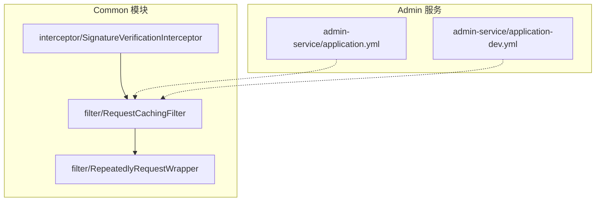
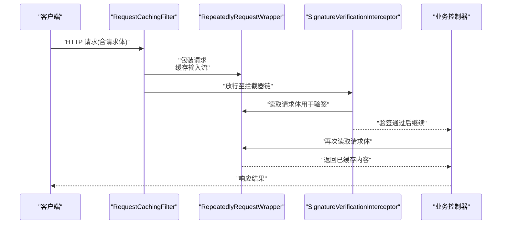
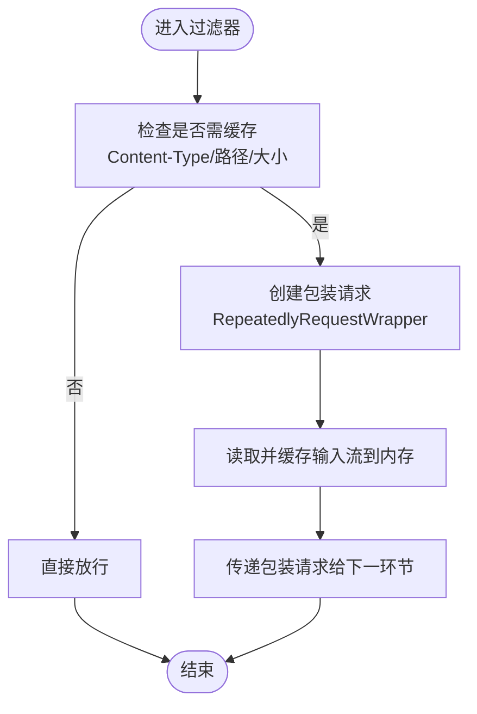
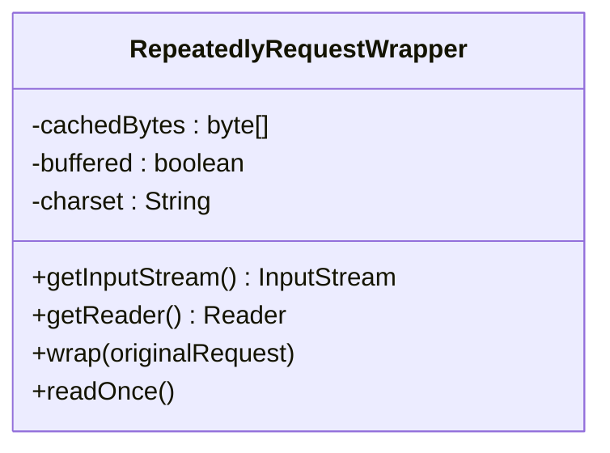
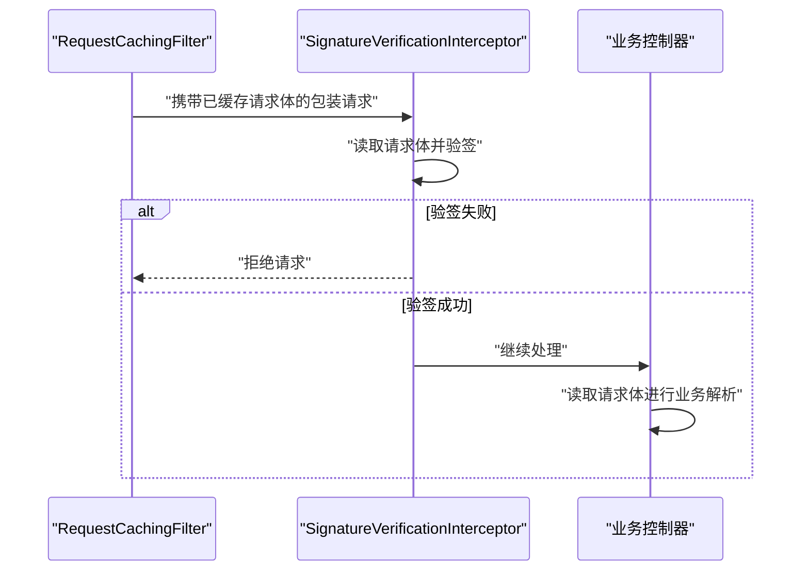
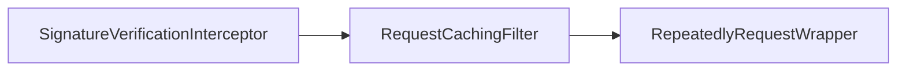

# 请求缓存过滤器

<cite>
**本文引用的文件**   
- [RequestCachingFilter.java](file://class_times_record_back/common/src/main/java/com/shiroko/filter/RequestCachingFilter.java)
- [RepeatedlyRequestWrapper.java](file://class_times_record_back/common/src/main/java/com/shiroko/filter/RepeatedlyRequestWrapper.java)
- [SignatureVerificationInterceptor.java](file://class_times_record_back/common/src/main/java/com/shiroko/interceptor/SignatureVerificationInterceptor.java)
- [application.yml](file://class_times_record_back/admin-service/src/main/resources/application.yml)
- [application-dev.yml](file://class_times_record_back/admin-service/src/main/resources/application-dev.yml)
</cite>

## 目录
1. [简介](#简介)
2. [项目结构](#项目结构)
3. [核心组件](#核心组件)
4. [架构总览](#架构总览)
5. [详细组件分析](#详细组件分析)
6. [依赖关系分析](#依赖关系分析)
7. [性能考量](#性能考量)
8. [故障排查指南](#故障排查指南)
9. [结论](#结论)
10. [附录](#附录)

## 简介
本文件围绕“请求缓存过滤器”的实现与使用进行系统化说明，重点覆盖以下方面：
- RequestCachingFilter 的实现原理：请求体缓存、内存管理策略、重复读取支持。
- RepeatedlyRequestWrapper 的工作原理：输入流复制与恢复、缓存数据生命周期管理。
- 与签名验证拦截器的协作关系：在鉴权链路中的位置与数据共享方式。
- 性能影响分析与内存泄漏防护措施。
- 缓存配置选项、大请求体处理方案、调试与监控方法。
- 典型使用场景与最佳实践。

## 项目结构
本项目采用多模块微服务架构，请求缓存相关代码位于 common 模块的 filter 与 interceptor 包中，并在业务服务（如 admin-service）通过配置文件启用或调整行为。

图表来源
- [RequestCachingFilter.java](file://class_times_record_back/common/src/main/java/com/shiroko/filter/RequestCachingFilter.java)
- [RepeatedlyRequestWrapper.java](file://class_times_record_back/common/src/main/java/com/shiroko/filter/RepeatedlyRequestWrapper.java)
- [SignatureVerificationInterceptor.java](file://class_times_record_back/common/src/main/java/com/shiroko/interceptor/SignatureVerificationInterceptor.java)
- [application.yml](file://class_times_record_back/admin-service/src/main/resources/application.yml)
- [application-dev.yml](file://class_times_record_back/admin-service/src/main/resources/application-dev.yml)

章节来源
- [RequestCachingFilter.java](file://class_times_record_back/common/src/main/java/com/shiroko/filter/RequestCachingFilter.java)
- [RepeatedlyRequestWrapper.java](file://class_times_record_back/common/src/main/java/com/shiroko/filter/RepeatedlyRequestWrapper.java)
- [SignatureVerificationInterceptor.java](file://class_times_record_back/common/src/main/java/com/shiroko/interceptor/SignatureVerificationInterceptor.java)
- [application.yml](file://class_times_record_back/admin-service/src/main/resources/application.yml)
- [application-dev.yml](file://class_times_record_back/admin-service/src/main/resources/application-dev.yml)

## 核心组件
- RequestCachingFilter：在 Servlet 过滤器链中捕获并缓存请求体，提供可重复读取能力，供后续拦截器或控制器多次消费。
- RepeatedlyRequestWrapper：对 HttpServletRequest 进行包装，重写 getInputStream/getReader，将原始字节缓冲到内存，实现多次读取。
- SignatureVerificationInterceptor：在处理器映射阶段执行签名校验，通常依赖已缓存的请求体进行验签。

章节来源
- [RequestCachingFilter.java](file://class_times_record_back/common/src/main/java/com/shiroko/filter/RequestCachingFilter.java)
- [RepeatedlyRequestWrapper.java](file://class_times_record_back/common/src/main/java/com/shiroko/filter/RepeatedlyRequestWrapper.java)
- [SignatureVerificationInterceptor.java](file://class_times_record_back/common/src/main/java/com/shiroko/interceptor/SignatureVerificationInterceptor.java)

## 架构总览
下图展示了从客户端发起请求到签名校验的完整调用链，以及请求体在过滤器与拦截器之间的流转过程。

图表来源
- [RequestCachingFilter.java](file://class_times_record_back/common/src/main/java/com/shiroko/filter/RequestCachingFilter.java)
- [RepeatedlyRequestWrapper.java](file://class_times_record_back/common/src/main/java/com/shiroko/filter/RepeatedlyRequestWrapper.java)
- [SignatureVerificationInterceptor.java](file://class_times_record_back/common/src/main/java/com/shiroko/interceptor/SignatureVerificationInterceptor.java)

## 详细组件分析

### RequestCachingFilter 实现原理
- 职责定位
  - 在过滤器链早期介入，决定是否缓存请求体。
  - 为后续拦截器与控制器提供可重复读取的请求体。
- 关键流程
  - 判断是否满足缓存条件（例如 Content-Type、路径白名单、大小阈值等）。
  - 若满足，则创建 RepeatedlyRequestWrapper 包装原始请求，并将输入流内容写入内部缓冲区。
  - 将包装后的请求传递给下一个过滤器或拦截器。
- 内存管理与边界控制
  - 设置最大缓存大小，超过阈值时跳过缓存以避免 OOM。
  - 针对非 JSON 或二进制大对象，可按策略忽略缓存。
  - 确保在异常分支也能释放资源，避免内存泄漏。
- 与拦截器协作
  - 为签名验证拦截器提供稳定的请求体来源，保证验签与业务逻辑均可读取同一份数据。

图表来源
- [RequestCachingFilter.java](file://class_times_record_back/common/src/main/java/com/shiroko/filter/RequestCachingFilter.java)

章节来源
- [RequestCachingFilter.java](file://class_times_record_back/common/src/main/java/com/shiroko/filter/RequestCachingFilter.java)

### RepeatedlyRequestWrapper 工作原理
- 设计目标
  - 解决 InputStream/Reader 只能顺序读取一次的问题。
  - 在内存中保存一份原始字节副本，支持多次 getInputStream/getReader。
- 核心机制
  - 首次读取时，将底层输入流全部读入内部字节数组或缓冲区。
  - 后续每次读取均基于该缓冲区构造新的 InputStream/Reader。
  - 提供 reset 语义，使多次读取保持一致性。
- 生命周期管理
  - 缓存数据随请求生命周期存在，请求结束后由容器回收。
  - 建议配合过滤器在 finally 块中显式清理引用，降低长连接或异常路径下的泄漏风险。
- 输入流复制与恢复
  - 复制发生在第一次读取时；恢复通过重新封装新流实现。
  - 注意编码问题，getReader 时应指定正确的字符集。

图表来源
- [RepeatedlyRequestWrapper.java](file://class_times_record_back/common/src/main/java/com/shiroko/filter/RepeatedlyRequestWrapper.java)

章节来源
- [RepeatedlyRequestWrapper.java](file://class_times_record_back/common/src/main/java/com/shiroko/filter/RepeatedlyRequestWrapper.java)

### 与签名验证拦截器的协作关系
- 协作模式
  - 过滤器先行缓存请求体，拦截器随后读取同一份数据进行验签。
  - 控制器再读取请求体进行业务解析，无需重复 IO。
- 数据一致性
  - 由于请求体已被缓存，验签与业务解析面对的是相同的数据快照，避免时序不一致导致的验签失败。
- 错误处理
  - 验签失败应快速失败，不触发不必要的业务处理。
  - 过滤器应在异常路径确保包装请求被正确释放。

图表来源
- [SignatureVerificationInterceptor.java](file://class_times_record_back/common/src/main/java/com/shiroko/interceptor/SignatureVerificationInterceptor.java)
- [RequestCachingFilter.java](file://class_times_record_back/common/src/main/java/com/shiroko/filter/RequestCachingFilter.java)

章节来源
- [SignatureVerificationInterceptor.java](file://class_times_record_back/common/src/main/java/com/shiroko/interceptor/SignatureVerificationInterceptor.java)
- [RequestCachingFilter.java](file://class_times_record_back/common/src/main/java/com/shiroko/filter/RequestCachingFilter.java)

## 依赖关系分析
- 组件耦合
  - RequestCachingFilter 依赖 RepeatedlyRequestWrapper 完成请求体缓存。
  - SignatureVerificationInterceptor 依赖过滤器提供的缓存能力，形成“先缓存后验签”的固定顺序。
- 外部依赖
  - 依赖 Servlet API 的 HttpServletRequest/Response 与 Filter/Interceptor 扩展点。
- 潜在循环依赖
  - 过滤器与拦截器之间无直接相互导入，仅通过请求上下文协作，避免循环依赖。

图表来源
- [RequestCachingFilter.java](file://class_times_record_back/common/src/main/java/com/shiroko/filter/RequestCachingFilter.java)
- [RepeatedlyRequestWrapper.java](file://class_times_record_back/common/src/main/java/com/shiroko/filter/RepeatedlyRequestWrapper.java)
- [SignatureVerificationInterceptor.java](file://class_times_record_back/common/src/main/java/com/shiroko/interceptor/SignatureVerificationInterceptor.java)

章节来源
- [RequestCachingFilter.java](file://class_times_record_back/common/src/main/java/com/shiroko/filter/RequestCachingFilter.java)
- [RepeatedlyRequestWrapper.java](file://class_times_record_back/common/src/main/java/com/shiroko/filter/RepeatedlyRequestWrapper.java)
- [SignatureVerificationInterceptor.java](file://class_times_record_back/common/src/main/java/com/shiroko/interceptor/SignatureVerificationInterceptor.java)

## 性能考量
- 内存占用
  - 请求体全量缓存会占用堆内存，需结合业务峰值与 JVM 堆大小评估阈值。
  - 对大请求体（如文件上传、大 JSON）建议跳过缓存或限制大小。
- CPU 开销
  - 复制输入流会产生额外 CPU 消耗，尤其在高频小请求场景下需权衡。
- 吞吐与延迟
  - 过滤与拦截增加一层处理，但避免了多次 IO，整体可能提升端到端性能。
- 调优建议
  - 合理设置最大缓存大小与白名单路径。
  - 对特定接口禁用缓存，减少不必要开销。
  - 监控堆使用率与 GC 频率，动态调整阈值。

[本节为通用指导，不涉及具体文件分析]

## 故障排查指南
- 常见问题
  - 请求体无法重复读取：确认过滤器已生效且未提前消费输入流。
  - 验签失败：检查缓存内容与业务解析内容一致，关注字符集与格式化差异。
  - 内存溢出：检查是否对大请求体启用了缓存，适当降低阈值或关闭缓存。
- 诊断步骤
  - 开启调试日志，记录进入过滤器、缓存大小、是否跳过缓存的原因。
  - 对比验签前后请求体哈希值，定位篡改或序列化差异。
  - 观察线程池与连接复用情况，排除连接泄漏导致的内存增长。
- 修复建议
  - 在过滤器异常分支显式清理包装请求引用。
  - 对非 JSON 类型或超大请求体走快速失败路径。
  - 为验签失败添加明确错误码与提示，便于前端重试或修正。

章节来源
- [RequestCachingFilter.java](file://class_times_record_back/common/src/main/java/com/shiroko/filter/RequestCachingFilter.java)
- [RepeatedlyRequestWrapper.java](file://class_times_record_back/common/src/main/java/com/shiroko/filter/RepeatedlyRequestWrapper.java)
- [SignatureVerificationInterceptor.java](file://class_times_record_back/common/src/main/java/com/shiroko/interceptor/SignatureVerificationInterceptor.java)

## 结论
请求缓存过滤器通过统一的请求体缓存机制，显著提升了签名验证与业务处理的效率与一致性。配合合理的内存阈值与路径白名单，可在保障安全性的同时避免内存压力。建议在上线前进行压测与监控，持续优化阈值与策略。

[本节为总结性内容，不涉及具体文件分析]

## 附录

### 缓存配置选项
- 常见开关
  - 是否启用请求体缓存。
  - 最大缓存大小（字节）。
  - 路径白名单/黑名单。
  - 支持的 Content-Type 列表。
- 配置位置
  - 应用级配置通常在 application.yml 或环境专属配置文件中定义。
- 示例参考
  - [application.yml](file://class_times_record_back/admin-service/src/main/resources/application.yml)
  - [application-dev.yml](file://class_times_record_back/admin-service/src/main/resources/application-dev.yml)

章节来源
- [application.yml](file://class_times_record_back/admin-service/src/main/resources/application.yml)
- [application-dev.yml](file://class_times_record_back/admin-service/src/main/resources/application-dev.yml)

### 大请求体处理方案
- 跳过缓存：对大于阈值的请求体直接放行，避免内存压力。
- 分片上传：前端按分片上传，服务端逐片验签与合并。
- 流式处理：对不需要重复读取的场景，尽量保持流式处理，避免全量缓存。
- 限流与熔断：对大请求体接口实施限流与熔断，保护系统稳定性。

[本节为通用指导，不涉及具体文件分析]

### 调试与监控方法
- 日志
  - 记录进入过滤器的请求标识、Content-Type、大小、是否缓存及原因。
  - 记录验签结果与耗时。
- 指标
  - 暴露缓存命中率、平均缓存大小、拒绝数量等指标。
- 工具
  - 使用 APM 工具追踪请求链路，定位瓶颈。
  - 使用 JMX 或监控平台观察堆使用与 GC 情况。

[本节为通用指导，不涉及具体文件分析]

### 使用场景与最佳实践
- 典型场景
  - 统一签名校验：所有需要防篡改的接口启用缓存与验签。
  - 审计与回放：缓存请求体用于审计日志与问题回放。
- 最佳实践
  - 仅在必要接口启用缓存，缩小影响面。
  - 严格限制最大缓存大小，防止 OOM。
  - 对验签失败的请求快速失败，减少无效处理。
  - 定期复盘阈值与策略，结合线上指标动态调整。

[本节为通用指导，不涉及具体文件分析]