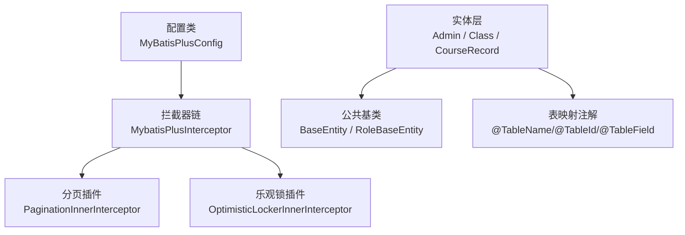
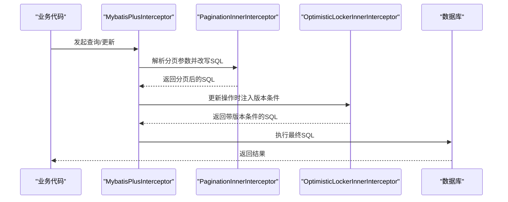
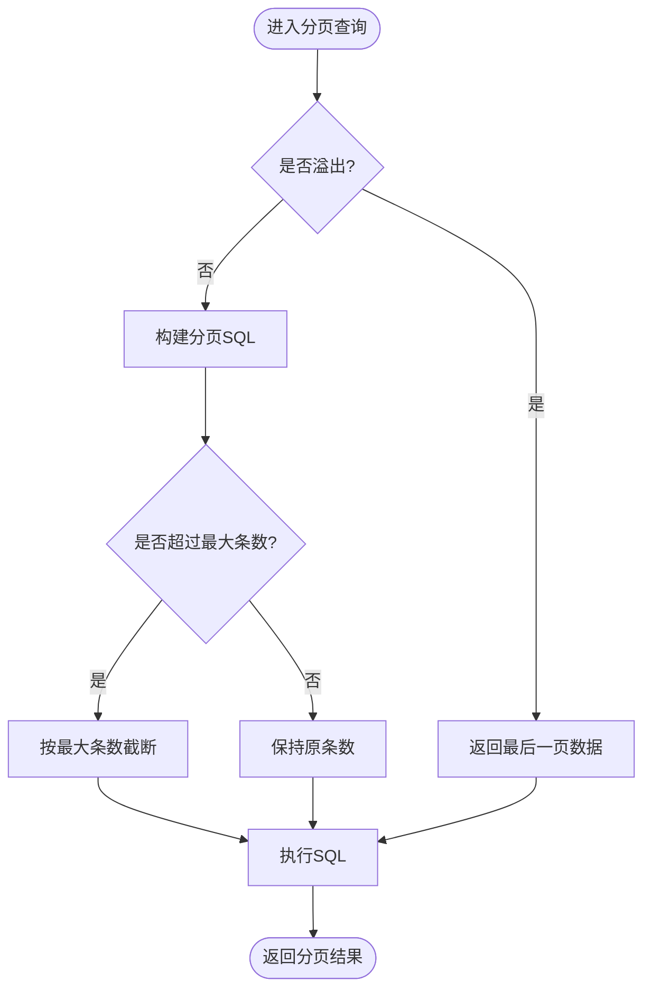
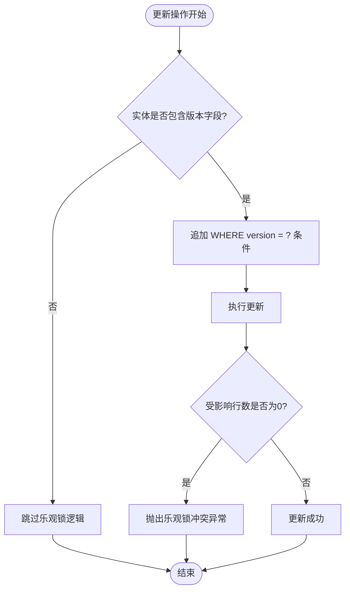
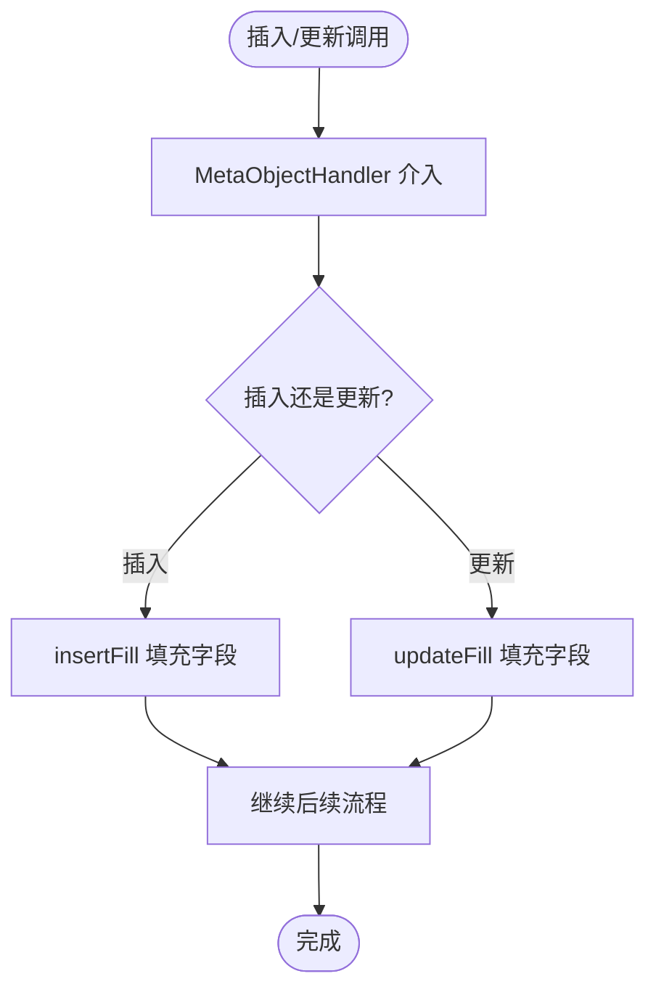
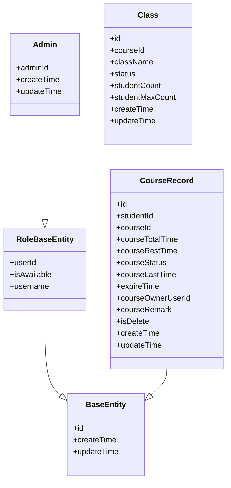
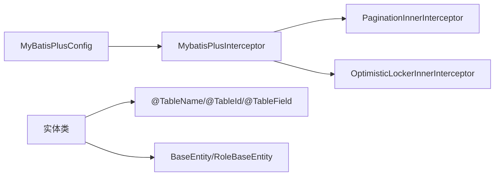

# MyBatis-Plus配置

<cite>
**本文引用的文件**   
- [MyBatisPlusConfig.java](file://class_times_record_back/common/src/main/java/com/shiroko/config/MyBatisPlusConfig.java)
- [BaseEntity.java](file://class_times_record_back/common/src/main/java/com/shiroko/repository/entity/common/BaseEntity.java)
- [RoleBaseEntity.java](file://class_times_record_back/common/src/main/java/com/shiroko/repository/entity/common/RoleBaseEntity.java)
- [Admin.java](file://class_times_record_back/common/src/main/java/com/shiroko/repository/entity/Admin.java)
- [Class.java](file://class_times_record_back/common/src/main/java/com/shiroko/repository/entity/Class.java)
- [CourseRecord.java](file://class_times_record_back/common/src/main/java/com/shiroko/repository/entity/CourseRecord.java)
</cite>

## 目录
1. [简介](#简介)
2. [项目结构](#项目结构)
3. [核心组件](#核心组件)
4. [架构总览](#架构总览)
5. [详细组件分析](#详细组件分析)
6. [依赖关系分析](#依赖关系分析)
7. [性能与调优建议](#性能与调优建议)
8. [故障排查指南](#故障排查指南)
9. [结论](#结论)
10. [附录：集成清单与最佳实践](#附录集成清单与最佳实践)

## 简介
本文件面向后端开发者，系统化梳理项目中 MyBatis-Plus 的配置与使用方式，重点覆盖以下主题：
- 分页插件 PaginationInnerInterceptor 的配置、溢出处理策略与最大条数限制
- 乐观锁插件 OptimisticLockerInnerInterceptor 的实现原理与使用方法
- 字段自动填充 MetaObjectHandler 的配置与自定义实现方式（含示例路径）
- 实体类注解配合使用要点
- 性能调优建议与常见问题排查

## 项目结构
本项目将 MyBatis-Plus 的核心配置集中在 common 模块的 config 包中，并通过 Spring 容器注入为 Bean。实体模型位于 repository.entity 包下，部分实体继承公共基类以复用通用字段。

图表来源
- [MyBatisPlusConfig.java:21-42](file://class_times_record_back/common/src/main/java/com/shiroko/config/MyBatisPlusConfig.java#L21-L42)
- [BaseEntity.java:14-17](file://class_times_record_back/common/src/main/java/com/shiroko/repository/entity/common/BaseEntity.java#L14-L17)
- [RoleBaseEntity.java:25-46](file://class_times_record_back/common/src/main/java/com/shiroko/repository/entity/common/RoleBaseEntity.java#L25-L46)
- [Admin.java:22-33](file://class_times_record_back/common/src/main/java/com/shiroko/repository/entity/Admin.java#L22-L33)
- [Class.java:20-27](file://class_times_record_back/common/src/main/java/com/shiroko/repository/entity/Class.java#L20-L27)
- [CourseRecord.java:22-31](file://class_times_record_back/common/src/main/java/com/shiroko/repository/entity/CourseRecord.java#L22-L31)

章节来源
- [MyBatisPlusConfig.java:21-42](file://class_times_record_back/common/src/main/java/com/shiroko/config/MyBatisPlusConfig.java#L21-L42)
- [BaseEntity.java:14-17](file://class_times_record_back/common/src/main/java/com/shiroko/repository/entity/common/BaseEntity.java#L14-L17)
- [RoleBaseEntity.java:25-46](file://class_times_record_back/common/src/main/java/com/shiroko/repository/entity/common/RoleBaseEntity.java#L25-L46)
- [Admin.java:22-33](file://class_times_record_back/common/src/main/java/com/shiroko/repository/entity/Admin.java#L22-L33)
- [Class.java:20-27](file://class_times_record_back/common/src/main/java/com/shiroko/repository/entity/Class.java#L20-L27)
- [CourseRecord.java:22-31](file://class_times_record_back/common/src/main/java/com/shiroko/repository/entity/CourseRecord.java#L22-L31)

## 核心组件
- 拦截器装配：通过 @Configuration 标注的配置类创建 MybatisPlusInterceptor Bean，并将分页与乐观锁插件加入拦截器链。
- 分页插件：基于 DbType 适配数据库方言，支持溢出处理与单页最大条数限制。
- 乐观锁插件：在更新时校验版本字段，避免并发覆盖写。
- 字段自动填充：提供 MetaObjectHandler 的启用位置与实现思路（当前为注释示例）。

章节来源
- [MyBatisPlusConfig.java:24-42](file://class_times_record_back/common/src/main/java/com/shiroko/config/MyBatisPlusConfig.java#L24-L42)

## 架构总览
下图展示了请求进入后，MyBatis-Plus 拦截器链对 SQL 的处理顺序与职责分工。

图表来源
- [MyBatisPlusConfig.java:26-42](file://class_times_record_back/common/src/main/java/com/shiroko/config/MyBatisPlusConfig.java#L26-L42)

## 详细组件分析

### 分页插件 PaginationInnerInterceptor
- 作用：根据传入的分页参数生成对应数据库方言的分页 SQL。
- 关键配置项
  - 溢出处理 setOverflow(true/false)：当请求页码大于总页数时的行为控制。
  - 最大条数限制 setMaxLimit(长整型)：防止恶意或异常的大分页请求。
- 使用方式：在 Service 层使用分页 API 即可生效；无需额外改动 Mapper。

图表来源
- [MyBatisPlusConfig.java:30-37](file://class_times_record_back/common/src/main/java/com/shiroko/config/MyBatisPlusConfig.java#L30-L37)

章节来源
- [MyBatisPlusConfig.java:30-37](file://class_times_record_back/common/src/main/java/com/shiroko/config/MyBatisPlusConfig.java#L30-L37)

### 乐观锁插件 OptimisticLockerInnerInterceptor
- 作用：在更新操作中自动追加版本条件，若版本号不一致则拒绝更新，避免并发覆盖。
- 使用前提：实体类需包含版本字段并使用相应注解标记（例如 @Version）。
- 触发时机：仅对更新操作生效；插入不受影响。

图表来源
- [MyBatisPlusConfig.java:39-41](file://class_times_record_back/common/src/main/java/com/shiroko/config/MyBatisPlusConfig.java#L39-L41)

章节来源
- [MyBatisPlusConfig.java:39-41](file://class_times_record_back/common/src/main/java/com/shiroko/config/MyBatisPlusConfig.java#L39-L41)

### 字段自动填充 MetaObjectHandler
- 作用：在插入/更新前自动填充指定字段（如创建时间、更新时间等），减少样板代码。
- 启用方式：在配置类中注册 MetaObjectHandler Bean。
- 常见实现点
  - insertFill：插入时填充默认值
  - updateFill：更新时刷新修改时间
- 实体配合：在需要自动填充的字段上添加对应的 fill 策略注解。

图表来源
- [MyBatisPlusConfig.java:45-64](file://class_times_record_back/common/src/main/java/com/shiroko/config/MyBatisPlusConfig.java#L45-L64)

章节来源
- [MyBatisPlusConfig.java:45-64](file://class_times_record_back/common/src/main/java/com/shiroko/config/MyBatisPlusConfig.java#L45-L64)

### 实体类注解与继承体系
- 表映射：@TableName 指定表名；@TableId 指定主键及自增策略；@TableField 指定列名或排除字段。
- 继承体系：BaseEntity 作为基础抽象类，RoleBaseEntity 扩展角色相关通用字段；具体实体可继承这些基类复用字段。
- 时间字段：实体中包含 createTime/updateTime 等时间字段，便于审计与追踪。

图表来源
- [BaseEntity.java:14-17](file://class_times_record_back/common/src/main/java/com/shiroko/repository/entity/common/BaseEntity.java#L14-L17)
- [RoleBaseEntity.java:25-46](file://class_times_record_back/common/src/main/java/com/shiroko/repository/entity/common/RoleBaseEntity.java#L25-L46)
- [Admin.java:22-41](file://class_times_record_back/common/src/main/java/com/shiroko/repository/entity/Admin.java#L22-L41)
- [Class.java:20-66](file://class_times_record_back/common/src/main/java/com/shiroko/repository/entity/Class.java#L20-L66)
- [CourseRecord.java:22-110](file://class_times_record_back/common/src/main/java/com/shiroko/repository/entity/CourseRecord.java#L22-L110)

章节来源
- [BaseEntity.java:14-17](file://class_times_record_back/common/src/main/java/com/shiroko/repository/entity/common/BaseEntity.java#L14-L17)
- [RoleBaseEntity.java:25-46](file://class_times_record_back/common/src/main/java/com/shiroko/repository/entity/common/RoleBaseEntity.java#L25-L46)
- [Admin.java:22-41](file://class_times_record_back/common/src/main/java/com/shiroko/repository/entity/Admin.java#L22-L41)
- [Class.java:20-66](file://class_times_record_back/common/src/main/java/com/shiroko/repository/entity/Class.java#L20-L66)
- [CourseRecord.java:22-110](file://class_times_record_back/common/src/main/java/com/shiroko/repository/entity/CourseRecord.java#L22-L110)

## 依赖关系分析
- 配置类依赖 MyBatis-Plus 提供的拦截器与插件类，并在 Spring 容器中注册为 Bean。
- 实体类依赖 MyBatis-Plus 注解进行元数据描述，与数据库表结构保持一致。
- 公共基类用于统一字段定义，降低重复代码。

图表来源
- [MyBatisPlusConfig.java:21-42](file://class_times_record_back/common/src/main/java/com/shiroko/config/MyBatisPlusConfig.java#L21-L42)
- [BaseEntity.java:14-17](file://class_times_record_back/common/src/main/java/com/shiroko/repository/entity/common/BaseEntity.java#L14-L17)
- [RoleBaseEntity.java:25-46](file://class_times_record_back/common/src/main/java/com/shiroko/repository/entity/common/RoleBaseEntity.java#L25-L46)

章节来源
- [MyBatisPlusConfig.java:21-42](file://class_times_record_back/common/src/main/java/com/shiroko/config/MyBatisPlusConfig.java#L21-L42)
- [BaseEntity.java:14-17](file://class_times_record_back/common/src/main/java/com/shiroko/repository/entity/common/BaseEntity.java#L14-L17)
- [RoleBaseEntity.java:25-46](file://class_times_record_back/common/src/main/java/com/shiroko/repository/entity/common/RoleBaseEntity.java#L25-L46)

## 性能与调优建议
- 合理设置分页最大条数：结合业务场景设定合理的 MaxLimit，避免一次性拉取过多数据导致内存与网络压力。
- 溢出处理策略：开启溢出处理可减少前端越界访问带来的异常分支，提升稳定性。
- 索引优化：为常用查询条件与排序字段建立合适索引，确保分页扫描范围可控。
- 避免 N+1 查询：批量查询时使用 IN 或 JOIN，减少往返次数。
- 乐观锁粒度：仅在必要字段上使用乐观锁，避免频繁冲突导致的重试开销。
- 监控与告警：关注慢查询日志与分页接口耗时，及时定位热点 SQL。

[本节为通用指导，不直接分析具体文件]

## 故障排查指南
- 分页无效
  - 检查是否正确注册 MybatisPlusInterceptor 并将 PaginationInnerInterceptor 加入拦截器链。
  - 确认 DbType 与实际数据库一致。
- 乐观锁冲突
  - 检查实体是否包含版本字段且被正确注解。
  - 查看更新失败时的错误信息，确认是否因版本不一致导致。
- 自动填充未生效
  - 确认已注册 MetaObjectHandler Bean。
  - 检查实体字段是否配置了对应的 fill 策略。
- 字段映射异常
  - 核对 @TableField 与数据库列名是否一致。
  - 检查 @TableId 的主键策略是否符合预期。

章节来源
- [MyBatisPlusConfig.java:24-42](file://class_times_record_back/common/src/main/java/com/shiroko/config/MyBatisPlusConfig.java#L24-L42)
- [MyBatisPlusConfig.java:45-64](file://class_times_record_back/common/src/main/java/com/shiroko/config/MyBatisPlusConfig.java#L45-L64)

## 结论
本项目通过集中式配置将 MyBatis-Plus 的分页与乐观锁能力接入到统一的拦截器链中，具备良好的可扩展性与可维护性。配合实体注解与公共基类，能够高效地支撑业务 CRUD 与审计需求。建议在上线前完善自动填充实现，并结合业务指标持续优化分页与索引策略。

[本节为总结性内容，不直接分析具体文件]

## 附录：集成清单与最佳实践
- 配置清单
  - 注册 MybatisPlusInterceptor Bean
  - 添加 PaginationInnerInterceptor 并配置溢出与最大条数
  - 可选：添加 OptimisticLockerInnerInterceptor
  - 可选：注册 MetaObjectHandler 实现自动填充
- 实体注解清单
  - @TableName：表名映射
  - @TableId：主键与生成策略
  - @TableField：列名映射与填充策略
- 最佳实践
  - 统一分页入口与参数校验
  - 明确乐观锁适用范围与重试策略
  - 规范时间字段命名与填充策略
  - 定期审查慢查询与分页性能

[本节为通用指导，不直接分析具体文件]