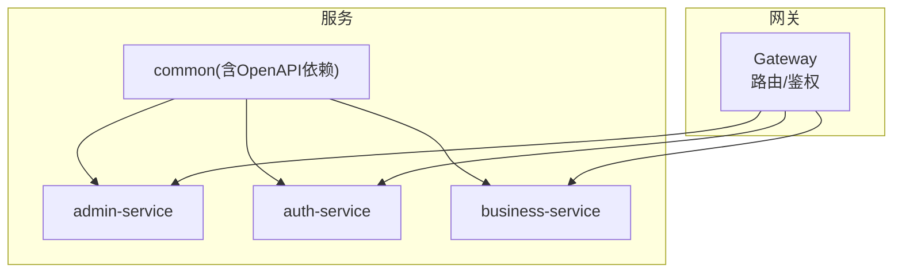
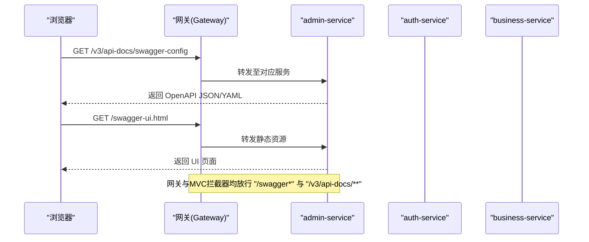
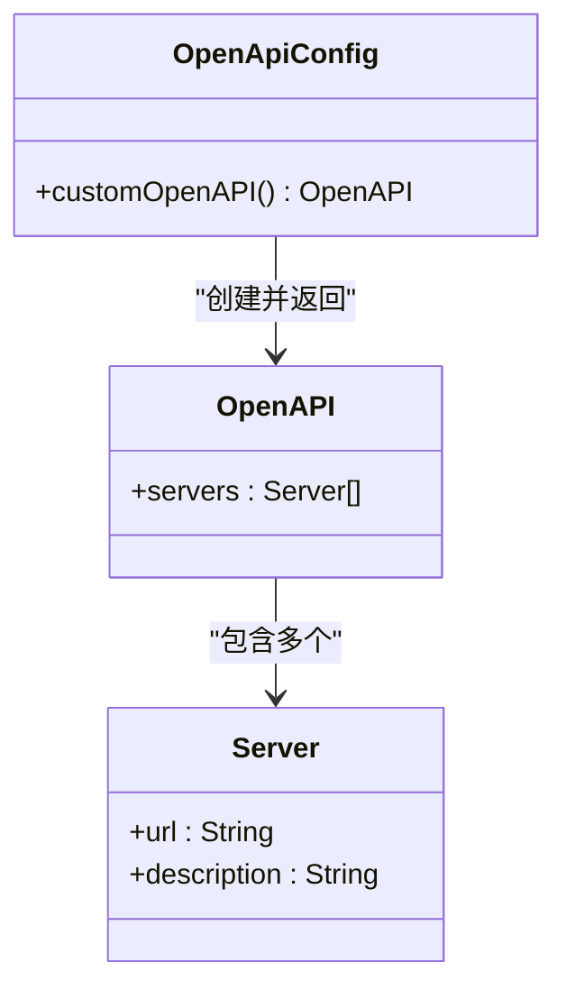
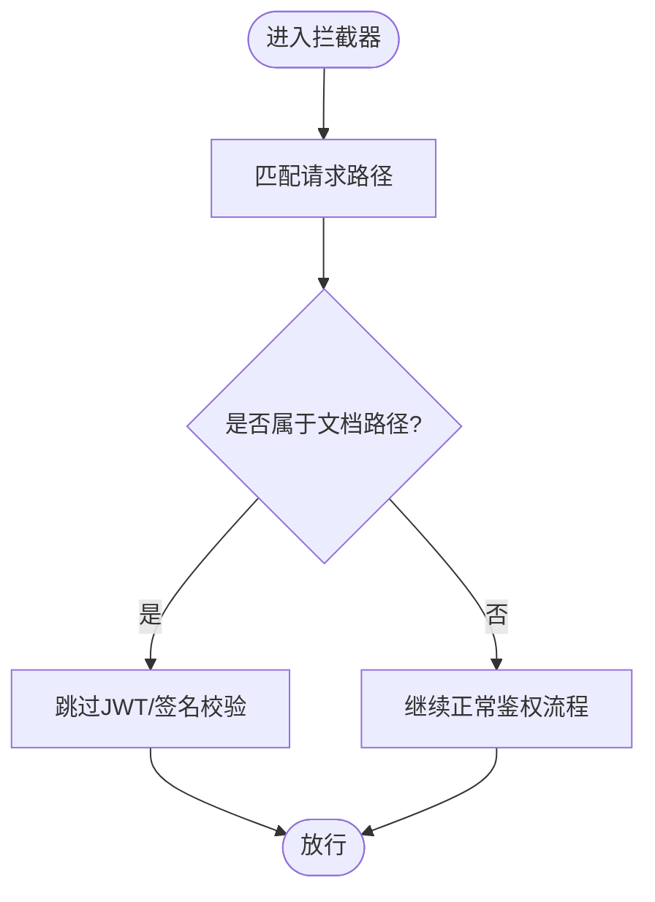
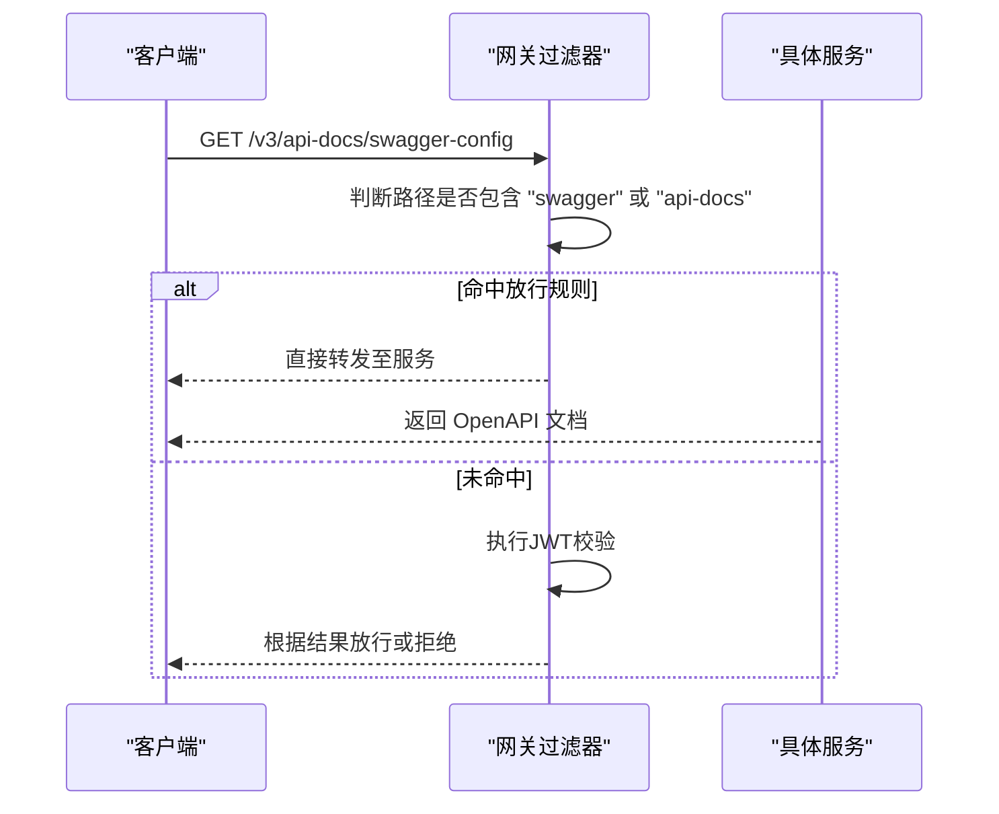
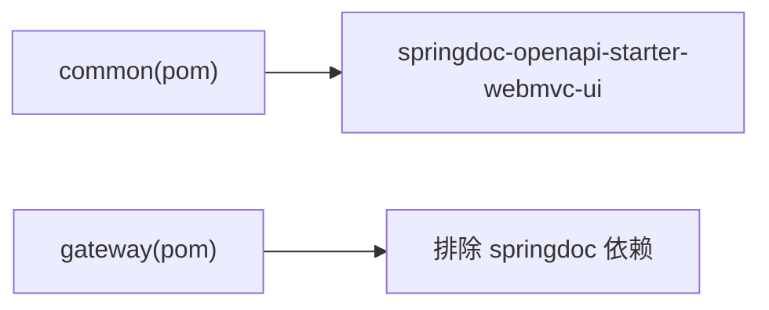

# OpenAPI文档配置

<cite>
**本文引用的文件**   
- [OpenApiConfig.java](file://class_times_record_back/common/src/main/java/com/shiroko/config/OpenApiConfig.java)
- [AdminWebConfig.java](file://class_times_record_back/admin-service/src/main/java/com/shiroko/config/AdminWebConfig.java)
- [AuthWebConfig.java](file://class_times_record_back/auth-service/src/main/java/com/shiroko/config/AuthWebConfig.java)
- [BusinessWebConfig.java](file://class_times_record_back/business-service/src/main/java/com/shiroko/config/BusinessWebConfig.java)
- [JwtAuthFilter.java](file://class_times_record_back/gateway/src/main/java/com/shiroko/gateway/filter/JwtAuthFilter.java)
- [pom.xml（common）](file://class_times_record_back/common/pom.xml)
- [pom.xml（gateway）](file://class_times_record_back/gateway/pom.xml)
</cite>

## 目录
1. [简介](#简介)
2. [项目结构](#项目结构)
3. [核心组件](#核心组件)
4. [架构总览](#架构总览)
5. [详细组件分析](#详细组件分析)
6. [依赖关系分析](#依赖关系分析)
7. [性能与可用性考虑](#性能与可用性考虑)
8. [故障排查指南](#故障排查指南)
9. [结论](#结论)
10. [附录：注解与最佳实践](#附录注解与最佳实践)

## 简介
本文件面向后端开发者，系统化说明本项目中基于 SpringDoc OpenAPI 的 API 文档集成方案。内容涵盖：
- 全局 OpenAPI 配置与环境服务器列表
- 网关与服务端的放行策略、安全认证对文档访问的影响
- 文档页面路径与访问方式
- 版本管理、多环境配置思路
- 常用 Swagger 注解使用建议
- 文档导出、在线调试与接口测试方法
- 文档维护与更新规范

## 项目结构
本项目为微服务架构，包含 admin-service、auth-service、business-service 与 gateway。OpenAPI 能力由 common 模块引入 springdoc-openapi-starter-webmvc-ui，并在各业务服务中通过 MVC 拦截器放行文档相关路径；网关层对文档路径进行透传放行。

**图示来源** 
- [pom.xml（common）:90-93](file://class_times_record_back/common/pom.xml#L90-L93)
- [pom.xml（gateway）:20-34](file://class_times_record_back/gateway/pom.xml#L20-L34)
- [AdminWebConfig.java:23-40](file://class_times_record_back/admin-service/src/main/java/com/shiroko/config/AdminWebConfig.java#L23-L40)
- [AuthWebConfig.java:23-38](file://class_times_record_back/auth-service/src/main/java/com/shiroko/config/AuthWebConfig.java#L23-L38)
- [BusinessWebConfig.java:24-39](file://class_times_record_back/business-service/src/main/java/com/shiroko/config/BusinessWebConfig.java#L24-L39)

**章节来源**
- [pom.xml（common）:90-93](file://class_times_record_back/common/pom.xml#L90-L93)
- [pom.xml（gateway）:20-34](file://class_times_record_back/gateway/pom.xml#L20-L34)
- [AdminWebConfig.java:23-40](file://class_times_record_back/admin-service/src/main/java/com/shiroko/config/AdminWebConfig.java#L23-L40)
- [AuthWebConfig.java:23-38](file://class_times_record_back/auth-service/src/main/java/com/shiroko/config/AuthWebConfig.java#L23-L38)
- [BusinessWebConfig.java:24-39](file://class_times_record_back/business-service/src/main/java/com/shiroko/config/BusinessWebConfig.java#L24-L39)

## 核心组件
- OpenAPI 全局配置：定义服务描述、服务器地址等元数据
- 服务端 MVC 拦截器：放行 /v3/api-docs/**、/swagger-ui.html、/swagger-ui/** 等路径，避免被 JWT/签名校验拦截
- 网关过滤器：对 swagger 与 api-docs 路径放行，确保从网关入口可访问文档

**章节来源**
- [OpenApiConfig.java:15-22](file://class_times_record_back/common/src/main/java/com/shiroko/config/OpenApiConfig.java#L15-L22)
- [AdminWebConfig.java:23-40](file://class_times_record_back/admin-service/src/main/java/com/shiroko/config/AdminWebConfig.java#L23-L40)
- [AuthWebConfig.java:23-38](file://class_times_record_back/auth-service/src/main/java/com/shiroko/config/AuthWebConfig.java#L23-L38)
- [BusinessWebConfig.java:24-39](file://class_times_record_back/business-service/src/main/java/com/shiroko/config/BusinessWebConfig.java#L24-L39)
- [JwtAuthFilter.java:59-59](file://class_times_record_back/gateway/src/main/java/com/shiroko/gateway/filter/JwtAuthFilter.java#L59-L59)

## 架构总览
下图展示从浏览器访问 OpenAPI 文档到各服务的请求链路，以及网关与服务端拦截器的放行策略。

**图示来源** 
- [AdminWebConfig.java:36-39](file://class_times_record_back/admin-service/src/main/java/com/shiroko/config/AdminWebConfig.java#L36-L39)
- [AuthWebConfig.java:33-36](file://class_times_record_back/auth-service/src/main/java/com/shiroko/config/AuthWebConfig.java#L33-L36)
- [BusinessWebConfig.java:33-36](file://class_times_record_back/business-service/src/main/java/com/shiroko/config/BusinessWebConfig.java#L33-L36)
- [JwtAuthFilter.java:59-59](file://class_times_record_back/gateway/src/main/java/com/shiroko/gateway/filter/JwtAuthFilter.java#L59-L59)

## 详细组件分析

### OpenAPI 全局配置
- 作用：集中声明 OpenAPI 元数据，如服务器列表、标题、版本等
- 当前实现：在 common 模块提供 OpenAPI Bean，并添加生产与测试环境的 Server 地址
- 扩展建议：
  - 增加 title、description、version 等基础信息
  - 按服务维度拆分配置类，便于独立控制
  - 结合环境变量或 Nacos 动态注入不同环境的 server.url

**图示来源** 
- [OpenApiConfig.java:15-22](file://class_times_record_back/common/src/main/java/com/shiroko/config/OpenApiConfig.java#L15-L22)

**章节来源**
- [OpenApiConfig.java:15-22](file://class_times_record_back/common/src/main/java/com/shiroko/config/OpenApiConfig.java#L15-L22)

### 服务端 MVC 拦截器放行策略
- 目标：确保 OpenAPI 文档与 UI 不被 JWT/签名拦截器阻断
- 统一放行路径：
  - /v3/api-docs/**
  - /v3/api-docs.yaml
  - /swagger-ui.html
  - /swagger-ui/**
- 各服务均已将上述路径加入 excludePathPatterns

**图示来源** 
- [AdminWebConfig.java:23-40](file://class_times_record_back/admin-service/src/main/java/com/shiroko/config/AdminWebConfig.java#L23-L40)
- [AuthWebConfig.java:23-38](file://class_times_record_back/auth-service/src/main/java/com/shiroko/config/AuthWebConfig.java#L23-L38)
- [BusinessWebConfig.java:24-39](file://class_times_record_back/business-service/src/main/java/com/shiroko/config/BusinessWebConfig.java#L24-L39)

**章节来源**
- [AdminWebConfig.java:23-40](file://class_times_record_back/admin-service/src/main/java/com/shiroko/config/AdminWebConfig.java#L23-L40)
- [AuthWebConfig.java:23-38](file://class_times_record_back/auth-service/src/main/java/com/shiroko/config/AuthWebConfig.java#L23-L38)
- [BusinessWebConfig.java:24-39](file://class_times_record_back/business-service/src/main/java/com/shiroko/config/BusinessWebConfig.java#L24-L39)

### 网关层放行策略
- 目标：从网关入口访问文档时，不触发 JWT 校验
- 实现要点：当路径包含 "swagger" 或 "api-docs" 时直接放行

**图示来源** 
- [JwtAuthFilter.java:59-59](file://class_times_record_back/gateway/src/main/java/com/shiroko/gateway/filter/JwtAuthFilter.java#L59-L59)

**章节来源**
- [JwtAuthFilter.java:59-59](file://class_times_record_back/gateway/src/main/java/com/shiroko/gateway/filter/JwtAuthFilter.java#L59-L59)

## 依赖关系分析
- common 模块引入 springdoc-openapi-starter-webmvc-ui，为所有 Web 服务提供 OpenAPI 能力
- gateway 模块显式排除 springdoc 依赖，避免与 WebFlux Gateway 冲突

**图示来源** 
- [pom.xml（common）:90-93](file://class_times_record_back/common/pom.xml#L90-L93)
- [pom.xml（gateway）:20-34](file://class_times_record_back/gateway/pom.xml#L20-L34)

**章节来源**
- [pom.xml（common）:90-93](file://class_times_record_back/common/pom.xml#L90-L93)
- [pom.xml（gateway）:20-34](file://class_times_record_back/gateway/pom.xml#L20-L34)

## 性能与可用性考虑
- 文档生成开销：OpenAPI 扫描会在启动时解析控制器与方法注解，建议在开发环境启用，生产环境按需关闭或限制扫描范围
- 缓存策略：可在网关或服务端对 /v3/api-docs/* 响应设置合理缓存头，减少重复扫描与传输成本
- 安全边界：仅在内网或受控域名暴露文档页面；对外发布时建议移除 UI 或增加鉴权

[本节为通用建议，无需代码引用]

## 故障排查指南
- 现象：访问 /swagger-ui.html 或 /v3/api-docs/** 返回 401/403
  - 检查点：
    - 网关 JwtAuthFilter 是否放行包含 "swagger" 或 "api-docs" 的路径
    - 各服务 MVC 拦截器是否将上述路径加入 excludePathPatterns
- 现象：UI 能打开但无法调用接口
  - 检查点：
    - 确认 UI 配置的服务器地址与实际运行一致（参考 OpenAPI 中的 Server 列表）
    - 若通过网关访问，确认网关已正确转发且未附加额外鉴权逻辑
- 现象：文档缺失部分接口
  - 检查点：
    - 控制器包扫描路径是否正确
    - 是否存在条件化注册（@ConditionalOnProperty 等）导致接口未加载

**章节来源**
- [JwtAuthFilter.java:59-59](file://class_times_record_back/gateway/src/main/java/com/shiroko/gateway/filter/JwtAuthFilter.java#L59-L59)
- [AdminWebConfig.java:36-39](file://class_times_record_back/admin-service/src/main/java/com/shiroko/config/AdminWebConfig.java#L36-L39)
- [AuthWebConfig.java:33-36](file://class_times_record_back/auth-service/src/main/java/com/shiroko/config/AuthWebConfig.java#L33-L36)
- [BusinessWebConfig.java:33-36](file://class_times_record_back/business-service/src/main/java/com/shiroko/config/BusinessWebConfig.java#L33-L36)

## 结论
本项目通过 common 模块统一引入 SpringDoc，在各服务中通过 MVC 拦截器放行文档路径，并在网关层对文档路径进行透传放行，形成“网关放行 + 服务放行”的双重保障。配合 OpenAPI 全局配置，可实现多环境服务器地址管理与统一的文档体验。后续可按需增强分组、安全认证、国际化与导出能力。

[本节为总结性内容，无需代码引用]

## 附录：注解与最佳实践

### 常用注解速查
- @Operation：描述接口基本信息（摘要、详情、标签、响应码等）
- @Parameter：描述参数（路径、查询、头部、Cookie），支持必填、示例值、格式
- @RequestBody/@ResponseBody：描述请求体与响应体结构
- @Schema：用于 DTO/VO 字段级描述（类型、枚举、默认值、示例）
- @Tag：为接口分组命名与排序
- @SecurityRequirement/@SecurityScheme：声明接口所需的安全方案（如 JWT）

[本节为概念性说明，无需代码引用]

### 文档分组与版本管理
- 分组：使用 @Tag 或 OpenAPI 配置中的 group 机制，按业务域划分（如“机构管理”、“课程记录”）
- 版本：在 OpenAPI 配置中设置 version 字段；如需多版本共存，可通过不同的 group 或路径前缀隔离

[本节为概念性说明，无需代码引用]

### 安全认证配置
- 推荐做法：
  - 在 OpenAPI 中声明 securitySchemes（如 bearer JWT）
  - 在接口或全局使用 @SecurityRequirement 引用该方案
  - 网关与服务端保持放行策略一致，确保文档页可发起带 Token 的请求
- 注意：生产环境建议对文档页面增加鉴权或仅内网开放

[本节为概念性说明，无需代码引用]

### 文档页面定制
- 可通过 OpenAPI 配置设置 title、description、contact、license 等元信息
- 如需深度定制 UI，可替换为第三方 UI 或自行封装前端页面

[本节为概念性说明，无需代码引用]

### 文档导出与在线调试
- 导出：
  - 访问 /v3/api-docs 获取 JSON 文档
  - 访问 /v3/api-docs.yaml 获取 YAML 文档
- 在线调试：
  - 访问 /swagger-ui.html 打开 UI，选择环境与接口后直接发起请求
- 接口测试：
  - 在 UI 中填写必要参数与 Header（如 Authorization），点击发送即可验证

[本节为概念性说明，无需代码引用]

### 多环境配置建议
- 使用 OpenAPI 的 servers 列表区分 dev/test/prod 环境
- 结合环境变量或配置中心动态注入 server.url
- 网关层面按环境路由到不同文档服务实例

[本节为概念性说明，无需代码引用]

### 文档维护与更新规范
- 新增/修改接口必须同步更新注解描述
- 变更公共模型时，优先使用 @Schema 完善字段说明
- 定期清理废弃接口与过时注解
- 在 CI 中加入文档构建与校验步骤，确保文档与代码一致性

[本节为概念性说明，无需代码引用]