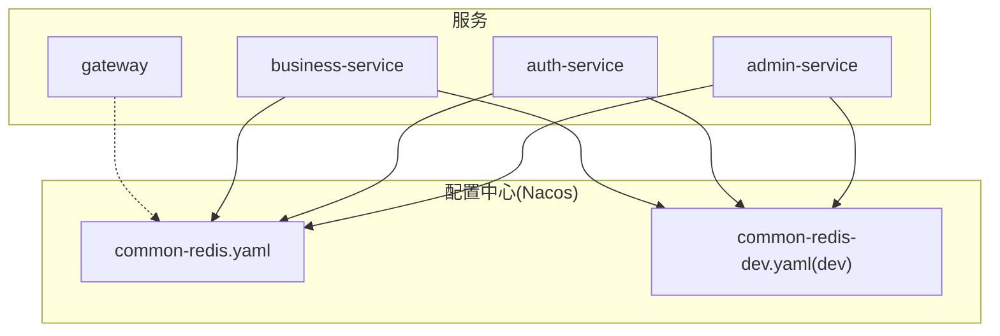
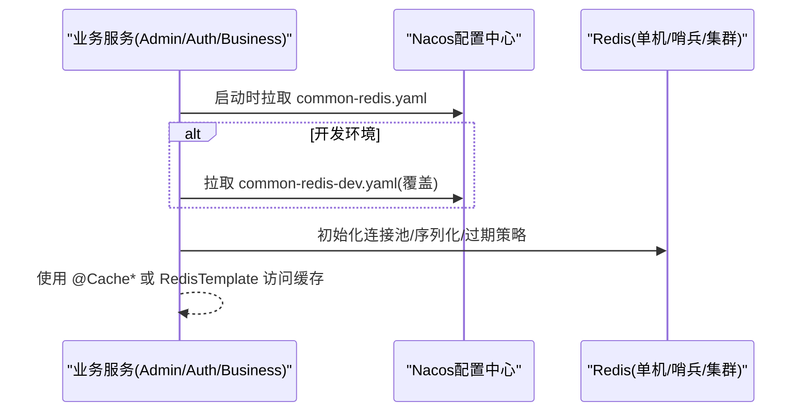
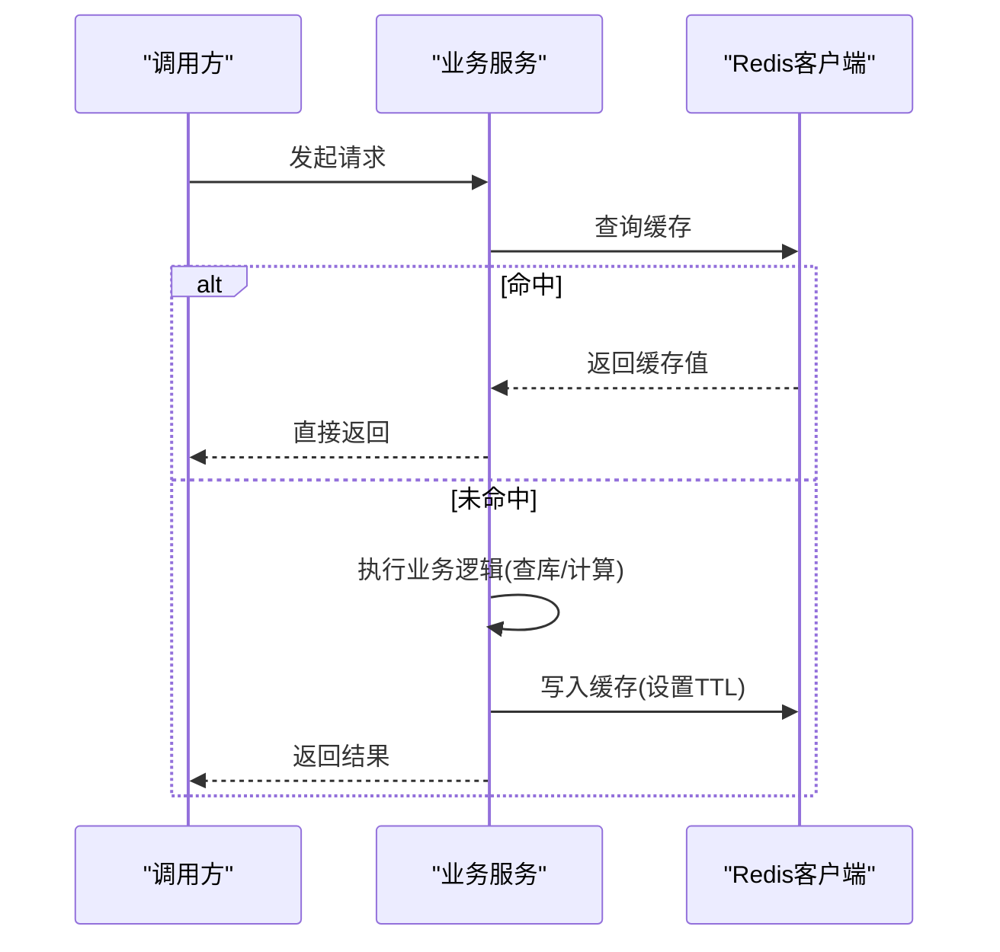
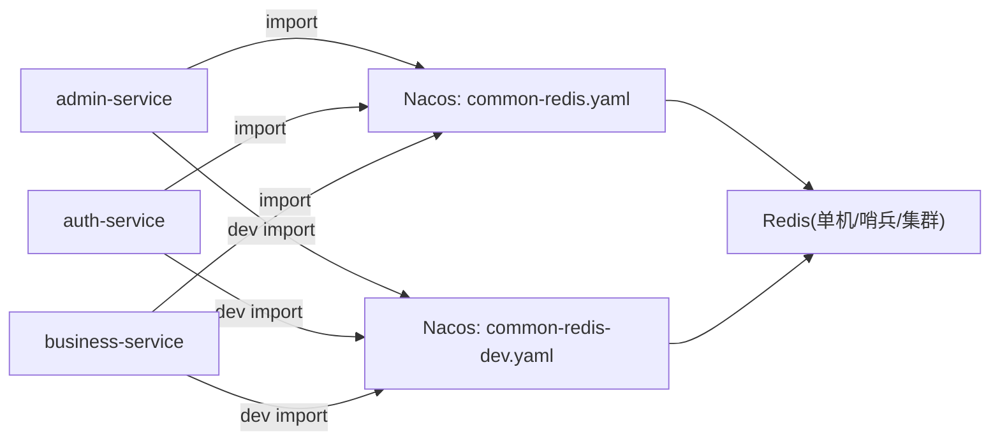
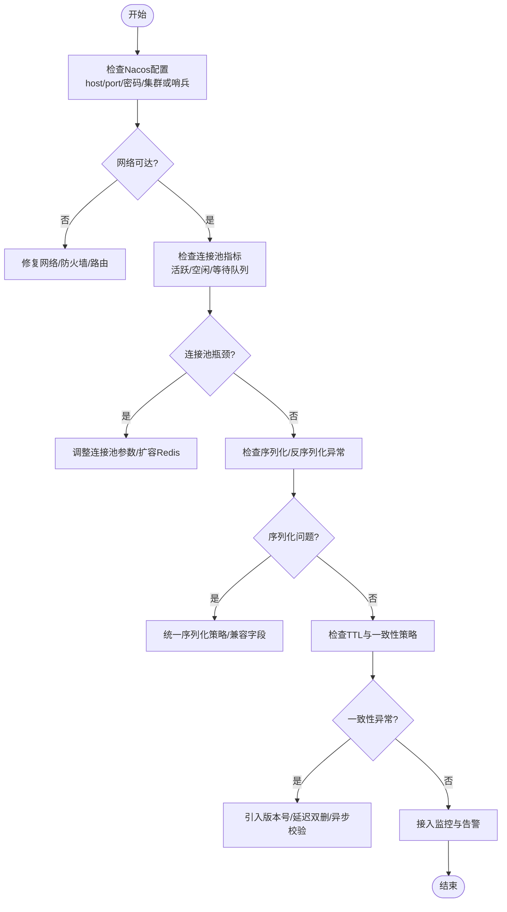

# Redis缓存配置

<cite>
**本文引用的文件**   
- [admin-service/application.yml](file://class_times_record_back/admin-service/src/main/resources/application.yml)
- [admin-service/application-dev.yml](file://class_times_record_back/admin-service/src/main/resources/application-dev.yml)
- [auth-service/application.yml](file://class_times_record_back/auth-service/src/main/resources/application.yml)
- [auth-service/application-dev.yml](file://class_times_record_back/auth-service/src/main/resources/application-dev.yml)
- [business-service/application.yml](file://class_times_record_back/business-service/src/main/resources/application.yml)
- [business-service/application-dev.yml](file://class_times_record_back/business-service/src/main/resources/application-dev.yml)
- [gateway/application.yml](file://class_times_record_back/gateway/src/main/resources/application.yml)
- [gateway/application-dev.yml](file://class_times_record_back/gateway/src/main/resources/application-dev.yml)
</cite>

## 目录
1. [简介](#简介)
2. [项目结构](#项目结构)
3. [核心组件](#核心组件)
4. [架构总览](#架构总览)
5. [详细组件分析](#详细组件分析)
6. [依赖分析](#依赖分析)
7. [性能考虑](#性能考虑)
8. [故障排查指南](#故障排查指南)
9. [结论](#结论)
10. [附录](#附录)

## 简介
本文件面向后端服务（admin-service、auth-service、business-service）的Redis缓存集成与配置，聚焦以下主题：
- 连接池配置、序列化策略、过期时间管理等核心配置项
- 缓存注解的使用方法与自定义缓存策略
- Redis集群模式、哨兵模式、密码认证等高级特性
- 缓存穿透、雪崩、击穿的解决方案
- 性能监控与故障排查
- 开发者最佳实践

说明：本项目通过Spring Cloud Nacos集中管理配置，各服务在application.yml中统一导入common-redis.yaml；开发环境通过application-dev.yml额外导入common-redis-dev.yaml以覆盖远程连接参数。

## 项目结构
- 配置来源
  - 所有业务服务均通过spring.config.import引入Nacos中的公共配置：common-redis.yaml（生产/通用）、common-redis-dev.yaml（仅dev覆盖）。
  - gateway不涉及Redis，但同样采用Nacos导入方式。
- 关键入口
  - application.yml：声明应用名、Nacos地址、命名空间、分组，并导入公共配置。
  - application-dev.yml：开发环境覆盖Redis连接信息，开启虚拟线程等调试能力。

图表来源
- [admin-service/application.yml:1-23](file://class_times_record_back/admin-service/src/main/resources/application.yml#L1-L23)
- [auth-service/application.yml:1-24](file://class_times_record_back/auth-service/src/main/resources/application.yml#L1-L24)
- [business-service/application.yml:1-24](file://class_times_record_back/business-service/src/main/resources/application.yml#L1-L24)
- [gateway/application.yml:1-19](file://class_times_record_back/gateway/src/main/resources/application.yml#L1-L19)
- [admin-service/application-dev.yml:1-33](file://class_times_record_back/admin-service/src/main/resources/application-dev.yml#L1-L33)
- [auth-service/application-dev.yml:1-39](file://class_times_record_back/auth-service/src/main/resources/application-dev.yml#L1-L39)
- [business-service/application-dev.yml:1-34](file://class_times_record_back/business-service/src/main/resources/application-dev.yml#L1-L34)

章节来源
- [admin-service/application.yml:1-23](file://class_times_record_back/admin-service/src/main/resources/application.yml#L1-L23)
- [auth-service/application.yml:1-24](file://class_times_record_back/auth-service/src/main/resources/application.yml#L1-L24)
- [business-service/application.yml:1-24](file://class_times_record_back/business-service/src/main/resources/application.yml#L1-L24)
- [gateway/application.yml:1-19](file://class_times_record_back/gateway/src/main/resources/application.yml#L1-L19)
- [admin-service/application-dev.yml:1-33](file://class_times_record_back/admin-service/src/main/resources/application-dev.yml#L1-L33)
- [auth-service/application-dev.yml:1-39](file://class_times_record_back/auth-service/src/main/resources/application-dev.yml#L1-L39)
- [business-service/application-dev.yml:1-34](file://class_times_record_back/business-service/src/main/resources/application-dev.yml#L1-L34)

## 核心组件
- 配置加载顺序
  - 基础配置：application.yml 导入 common-redis.yaml
  - 开发覆盖：application-dev.yml 导入 common-redis-dev.yaml（覆盖远程连接参数）
- 关键配置项（由Nacos提供）
  - 连接与高可用：host/port、数据库索引、密码、连接池大小、超时、SSL、集群/哨兵拓扑
  - 序列化：key/value序列化器、默认过期策略
  - 缓存注解：@Cacheable/@CacheEvict/@CachePut 等开关与默认行为
  - 监控与诊断：指标暴露、慢查询日志、连接池监控
- 注意
  - 具体键值请查阅Nacos中的common-redis.yaml与common-redis-dev.yaml；本文基于配置文件导入关系进行说明。

章节来源
- [admin-service/application.yml:1-23](file://class_times_record_back/admin-service/src/main/resources/application.yml#L1-L23)
- [auth-service/application.yml:1-24](file://class_times_record_back/auth-service/src/main/resources/application.yml#L1-L24)
- [business-service/application.yml:1-24](file://class_times_record_back/business-service/src/main/resources/application.yml#L1-L24)
- [admin-service/application-dev.yml:1-33](file://class_times_record_back/admin-service/src/main/resources/application-dev.yml#L1-L33)
- [auth-service/application-dev.yml:1-39](file://class_times_record_back/auth-service/src/main/resources/application-dev.yml#L1-L39)
- [business-service/application-dev.yml:1-34](file://class_times_record_back/business-service/src/main/resources/application-dev.yml#L1-L34)

## 架构总览
下图展示“服务—Nacos—Redis”的配置与运行时关系。

图表来源
- [admin-service/application.yml:1-23](file://class_times_record_back/admin-service/src/main/resources/application.yml#L1-L23)
- [auth-service/application.yml:1-24](file://class_times_record_back/auth-service/src/main/resources/application.yml#L1-L24)
- [business-service/application.yml:1-24](file://class_times_record_back/business-service/src/main/resources/application.yml#L1-L24)
- [admin-service/application-dev.yml:1-33](file://class_times_record_back/admin-service/src/main/resources/application-dev.yml#L1-L33)
- [auth-service/application-dev.yml:1-39](file://class_times_record_back/auth-service/src/main/resources/application-dev.yml#L1-L39)
- [business-service/application-dev.yml:1-34](file://class_times_record_back/business-service/src/main/resources/application-dev.yml#L1-L34)

## 详细组件分析

### 配置加载与覆盖机制
- 基础导入
  - 各服务在application.yml中统一导入common-redis.yaml，确保生产/通用配置一致。
- 开发覆盖
  - application-dev.yml再次导入common-redis-dev.yaml，用于覆盖远程连接参数，便于本地联调。
- 建议
  - 将敏感信息（如密码）放入Nacos并启用加密存储；不同环境通过profile区分。

章节来源
- [admin-service/application.yml:1-23](file://class_times_record_back/admin-service/src/main/resources/application.yml#L1-L23)
- [auth-service/application.yml:1-24](file://class_times_record_back/auth-service/src/main/resources/application.yml#L1-L24)
- [business-service/application.yml:1-24](file://class_times_record_back/business-service/src/main/resources/application.yml#L1-L24)
- [admin-service/application-dev.yml:1-33](file://class_times_record_back/admin-service/src/main/resources/application-dev.yml#L1-L33)
- [auth-service/application-dev.yml:1-39](file://class_times_record_back/auth-service/src/main/resources/application-dev.yml#L1-L39)
- [business-service/application-dev.yml:1-34](file://class_times_record_back/business-service/src/main/resources/application-dev.yml#L1-L34)

### 连接池配置
- 关注点
  - 最大连接数、最小空闲、获取连接超时、空闲回收、心跳检测等
  - 与业务QPS、CPU核数、网络延迟相匹配
- 推荐做法
  - 根据峰值QPS估算并发连接需求，避免过大导致Redis端资源争用
  - 为不同业务域划分独立Redis实例或DB，隔离热点数据

章节来源
- [admin-service/application.yml:1-23](file://class_times_record_back/admin-service/src/main/resources/application.yml#L1-L23)
- [auth-service/application.yml:1-24](file://class_times_record_back/auth-service/src/main/resources/application.yml#L1-L24)
- [business-service/application.yml:1-24](file://class_times_record_back/business-service/src/main/resources/application.yml#L1-L24)

### 序列化策略
- 关注点
  - key/value序列化器选择（如JSON、Kryo、Protobuf）
  - 跨语言/跨版本兼容性
  - 大对象序列化开销
- 推荐做法
  - 优先使用稳定、可读性强的JSON序列化
  - 对热点小对象可评估二进制序列化以提升吞吐
  - 统一前缀与命名规范，避免冲突

章节来源
- [admin-service/application.yml:1-23](file://class_times_record_back/admin-service/src/main/resources/application.yml#L1-L23)
- [auth-service/application.yml:1-24](file://class_times_record_back/auth-service/src/main/resources/application.yml#L1-L24)
- [business-service/application.yml:1-24](file://class_times_record_back/business-service/src/main/resources/application.yml#L1-L24)

### 过期时间管理
- 关注点
  - 全局默认TTL与按Key粒度TTL
  - 热点数据长TTL+主动刷新 vs 短TTL+强一致
- 推荐做法
  - 设置合理默认TTL，结合业务更新频率调整
  - 对热点读多写少数据采用“逻辑过期+异步刷新”

章节来源
- [admin-service/application.yml:1-23](file://class_times_record_back/admin-service/src/main/resources/application.yml#L1-L23)
- [auth-service/application.yml:1-24](file://class_times_record_back/auth-service/src/main/resources/application.yml#L1-L24)
- [business-service/application.yml:1-24](file://class_times_record_back/business-service/src/main/resources/application.yml#L1-L24)

### 缓存注解与自定义策略
- 常用注解
  - @Cacheable：命中则返回缓存，未命中执行方法并回填
  - @CacheEvict：删除缓存
  - @CachePut：更新缓存
- 自定义策略
  - 自定义Key生成器：统一命名空间、维度组合
  - 条件缓存：基于请求参数或上下文决定是否缓存
  - 异常回退：缓存不可用时降级到直连DB
- 建议
  - 明确缓存失效边界，避免脏读
  - 对高频写入场景谨慎使用注解式缓存，必要时改用编程式操作

章节来源
- [admin-service/application.yml:1-23](file://class_times_record_back/admin-service/src/main/resources/application.yml#L1-L23)
- [auth-service/application.yml:1-24](file://class_times_record_back/auth-service/src/main/resources/application.yml#L1-L24)
- [business-service/application.yml:1-24](file://class_times_record_back/business-service/src/main/resources/application.yml#L1-L24)

### 高级特性：集群、哨兵、密码认证
- 集群模式
  - 适用场景：水平扩展、高可用
  - 关注点：槽分配、节点故障转移、客户端重定向
- 哨兵模式
  - 适用场景：主从切换、自动故障发现
  - 关注点：哨兵节点数量、选举超时、读写分离
- 密码认证
  - 安全要求：禁止明文密码、启用TLS、最小权限原则
- 建议
  - 生产优先集群或哨兵+TLS
  - 通过Nacos统一管理拓扑与凭据，避免硬编码

章节来源
- [admin-service/application.yml:1-23](file://class_times_record_back/admin-service/src/main/resources/application.yml#L1-L23)
- [auth-service/application.yml:1-24](file://class_times_record_back/auth-service/src/main/resources/application.yml#L1-L24)
- [business-service/application.yml:1-24](file://class_times_record_back/business-service/src/main/resources/application.yml#L1-L24)

### 典型流程：带缓存的读取

图表来源
- [admin-service/application.yml:1-23](file://class_times_record_back/admin-service/src/main/resources/application.yml#L1-L23)
- [auth-service/application.yml:1-24](file://class_times_record_back/auth-service/src/main/resources/application.yml#L1-L24)
- [business-service/application.yml:1-24](file://class_times_record_back/business-service/src/main/resources/application.yml#L1-L24)

## 依赖分析
- 配置依赖
  - 三个业务服务均依赖Nacos提供的common-redis.yaml；开发环境再依赖common-redis-dev.yaml覆盖。
- 运行依赖
  - 服务启动后通过Redis客户端连接Redis（单机/哨兵/集群），受连接池与序列化配置影响。

图表来源
- [admin-service/application.yml:1-23](file://class_times_record_back/admin-service/src/main/resources/application.yml#L1-L23)
- [auth-service/application.yml:1-24](file://class_times_record_back/auth-service/src/main/resources/application.yml#L1-L24)
- [business-service/application.yml:1-24](file://class_times_record_back/business-service/src/main/resources/application.yml#L1-L24)
- [admin-service/application-dev.yml:1-33](file://class_times_record_back/admin-service/src/main/resources/application-dev.yml#L1-L33)
- [auth-service/application-dev.yml:1-39](file://class_times_record_back/auth-service/src/main/resources/application-dev.yml#L1-L39)
- [business-service/application-dev.yml:1-34](file://class_times_record_back/business-service/src/main/resources/application-dev.yml#L1-L34)

章节来源
- [admin-service/application.yml:1-23](file://class_times_record_back/admin-service/src/main/resources/application.yml#L1-L23)
- [auth-service/application.yml:1-24](file://class_times_record_back/auth-service/src/main/resources/application.yml#L1-L24)
- [business-service/application.yml:1-24](file://class_times_record_back/business-service/src/main/resources/application.yml#L1-L24)
- [admin-service/application-dev.yml:1-33](file://class_times_record_back/admin-service/src/main/resources/application-dev.yml#L1-L33)
- [auth-service/application-dev.yml:1-39](file://class_times_record_back/auth-service/src/main/resources/application-dev.yml#L1-L39)
- [business-service/application-dev.yml:1-34](file://class_times_record_back/business-service/src/main/resources/application-dev.yml#L1-L34)

## 性能考虑
- 连接池
  - 根据并发量与RT目标设定maxTotal/maxIdle/minIdle，避免频繁创建销毁
- 序列化
  - 控制对象体积，避免超大对象；热点路径尽量使用轻量结构
- 过期策略
  - 热点数据适当延长TTL，配合后台刷新降低抖动
- 网络
  - 就近部署、同机房直连，减少跨机房延迟
- 监控
  - 暴露连接池与Redis客户端指标，观察命中率、延迟、错误率

[本节为通用指导，不直接分析具体文件]

## 故障排查指南
- 常见问题定位
  - 无法连接：检查Nacos中host/port/密码/SSL/集群或哨兵拓扑是否正确
  - 连接耗尽：查看连接池指标，评估是否需扩容或优化热点
  - 序列化异常：核对前后端/多语言一致性，确认字段兼容
  - 缓存不一致：检查TTL与更新链路，必要时引入版本号或双写校验
- 快速自检清单
  - 确认当前生效的Nacos配置（common-redis.yaml/dev）
  - 验证服务间网络连通性与端口可达
  - 查看Redis服务端日志与慢查询
  - 对比生产与开发环境的差异点

章节来源
- [admin-service/application.yml:1-23](file://class_times_record_back/admin-service/src/main/resources/application.yml#L1-L23)
- [auth-service/application.yml:1-24](file://class_times_record_back/auth-service/src/main/resources/application.yml#L1-L24)
- [business-service/application.yml:1-24](file://class_times_record_back/business-service/src/main/resources/application.yml#L1-L24)
- [admin-service/application-dev.yml:1-33](file://class_times_record_back/admin-service/src/main/resources/application-dev.yml#L1-L33)
- [auth-service/application-dev.yml:1-39](file://class_times_record_back/auth-service/src/main/resources/application-dev.yml#L1-L39)
- [business-service/application-dev.yml:1-34](file://class_times_record_back/business-service/src/main/resources/application-dev.yml#L1-L34)

## 结论
- 本项目通过Nacos集中管理Redis配置，具备良好可扩展性与环境隔离能力
- 建议在生产环境启用集群或哨兵+TLS，完善连接池与序列化策略，建立完善的监控与告警体系
- 针对穿透、雪崩、击穿问题，应结合业务特征制定差异化方案，并在压测中验证

[本节为总结性内容，不直接分析具体文件]

## 附录

### 常见问题的处理流程图

[本图为概念性流程，不直接映射具体源码文件]