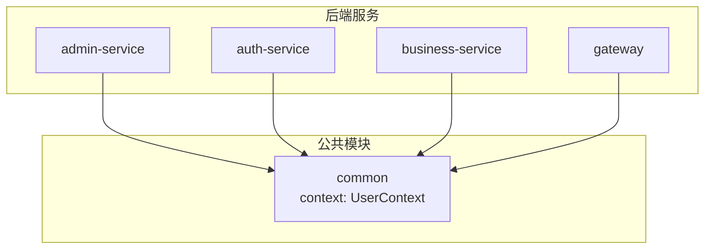
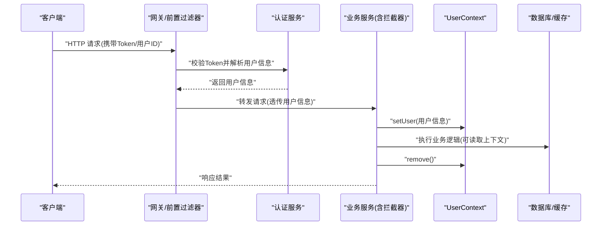
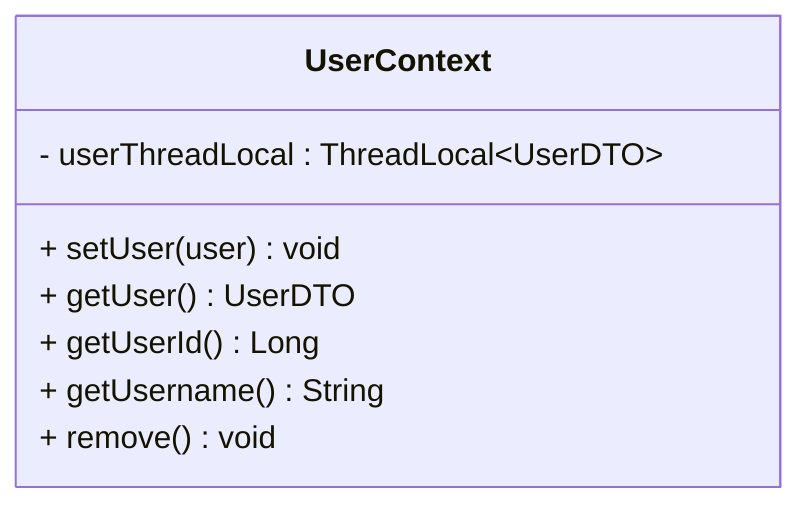
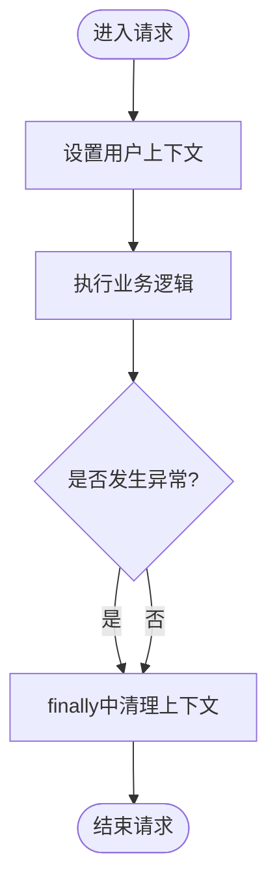
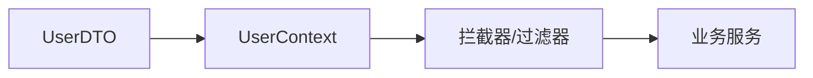

# 用户上下文管理

<cite>
**本文引用的文件**   
- [UserContext.java](file://class_times_record_back/common/src/main/java/com/shiroko/context/UserContext.java)
</cite>

## 目录
1. [简介](#简介)
2. [项目结构](#项目结构)
3. [核心组件](#核心组件)
4. [架构总览](#架构总览)
5. [详细组件分析](#详细组件分析)
6. [依赖分析](#依赖分析)
7. [性能考虑](#性能考虑)
8. [故障排查指南](#故障排查指南)
9. [结论](#结论)
10. [附录](#附录)

## 简介
本文件聚焦于“用户上下文管理”的设计与实现，围绕 UserContext 的线程本地存储（ThreadLocal）机制、用户信息的存储结构与获取方式、生命周期清理策略展开。同时结合微服务场景，给出 HTTP 请求头传递与 RPC 调用传递的用户上下文传播方案，并补充权限信息管理与数据权限控制的最佳实践与常见问题解决方案，帮助开发者快速、安全地在业务中接入和使用用户上下文。

## 项目结构
本项目采用多模块后端架构，common 模块提供跨服务共享的基础能力，其中包含用户上下文的核心实现。当前文档重点分析与用户上下文相关的代码位置：
- common 模块下的 context 包：存放用户上下文相关类

图表来源
- [UserContext.java](file://class_times_record_back/common/src/main/java/com/shiroko/context/UserContext.java)

章节来源
- [UserContext.java:1-37](file://class_times_record_back/common/src/main/java/com/shiroko/context/UserContext.java#L1-L37)

## 核心组件
- 用户上下文容器：UserContext
  - 职责：在当前线程范围内存取用户信息，提供便捷方法读取用户标识与用户名，并提供清理接口避免内存泄漏。
  - 关键特性：
    - 基于 ThreadLocal 保证线程隔离
    - 提供 set/get/remove 等基础操作
    - 暴露 getUserId()/getUsername() 便捷访问

章节来源
- [UserContext.java:12-36](file://class_times_record_back/common/src/main/java/com/shiroko/context/UserContext.java#L12-L36)

## 架构总览
下图展示在典型 Web 请求链路中，用户上下文从网关/认证服务注入到业务服务的流程，以及在线程结束时清理的关键点。

图表来源
- [UserContext.java:12-36](file://class_times_record_back/common/src/main/java/com/shiroko/context/UserContext.java#L12-L36)

## 详细组件分析

### UserContext 设计与实现
- 设计模式
  - 线程本地存储（ThreadLocal）：为每个线程维护独立的上下文副本，避免并发污染。
  - 门面式工具类：对外暴露静态方法，简化使用方接入成本。
- 数据结构
  - 内部持有 ThreadLocal<UserDTO>，将完整用户对象绑定到当前线程。
- 线程安全性
  - ThreadLocal 天然具备线程隔离性；但需确保在请求结束或任务完成后及时 remove，防止线程池复用导致的数据泄露。
- 生命周期管理
  - 建议在请求入口设置，在出口统一清理；若使用异步线程，需在子线程显式传递并清理。

图表来源
- [UserContext.java:12-36](file://class_times_record_back/common/src/main/java/com/shiroko/context/UserContext.java#L12-L36)

章节来源
- [UserContext.java:12-36](file://class_times_record_back/common/src/main/java/com/shiroko/context/UserContext.java#L12-L36)

### 用户信息存储结构与获取方式
- 存储结构
  - 以 UserDTO 作为上下文载体，封装用户标识、用户名等必要字段。
- 获取方式
  - 通过 UserContext.getUser() 获取完整对象
  - 通过 UserContext.getUserId()/getUsername() 直接获取常用字段

章节来源
- [UserContext.java:19-31](file://class_times_record_back/common/src/main/java/com/shiroko/context/UserContext.java#L19-L31)

### 清理机制与最佳实践
- 清理时机
  - 同步请求：在请求处理完成后立即调用 remove()。
  - 异步任务：在子任务执行前后分别设置和清理上下文。
- 常见陷阱
  - 忘记清理导致线程池复用时的上下文污染
  - 在异步回调中未正确传递上下文
  - 在过滤器/拦截器中未做异常兜底清理

图表来源
- [UserContext.java:33-35](file://class_times_record_back/common/src/main/java/com/shiroko/context/UserContext.java#L33-L35)

章节来源
- [UserContext.java:33-35](file://class_times_record_back/common/src/main/java/com/shiroko/context/UserContext.java#L33-L35)

### 微服务中的上下文传递方案
- HTTP 请求头传递
  - 网关/认证服务解析 Token 后，将用户标识、用户名等写入请求头（如 X-User-Id、X-User-Name）。
  - 下游服务在入口拦截器中读取请求头并调用 UserContext.setUser() 完成注入。
- RPC 调用传递
  - 在发起端从 UserContext 取出用户信息，放入 RPC 请求的扩展参数或 Header。
  - 在接收端从 RPC 上下文提取用户信息并注入到 UserContext。
- 注意事项
  - 仅传递最小必要字段，避免敏感信息泄露
  - 对传递值进行合法性校验与长度限制
  - 在异步/多线程场景中显式传递上下文

[本节为通用方案说明，不直接分析具体文件，故无章节来源]

### 权限信息与数据权限控制建议
- 角色与权限
  - 可在 UserDTO 中扩展角色列表与权限集合，便于在业务层快速判断。
- 数据权限
  - 基于用户上下文中的机构/部门/租户等维度，在服务层或查询层自动附加过滤条件。
- 注解与切面
  - 可结合自定义注解与 AOP 切面对受保护接口进行统一的鉴权与数据权限校验。

[本节为通用方案说明，不直接分析具体文件，故无章节来源]

## 依赖分析
- 直接依赖
  - UserContext 依赖 UserDTO 作为上下文载体
- 间接依赖
  - 上层服务通过拦截器/过滤器完成上下文的注入与清理
  - 业务服务在需要时读取上下文，无需关心其来源

图表来源
- [UserContext.java:12-36](file://class_times_record_back/common/src/main/java/com/shiroko/context/UserContext.java#L12-L36)

章节来源
- [UserContext.java:12-36](file://class_times_record_back/common/src/main/java/com/shiroko/context/UserContext.java#L12-L36)

## 性能考虑
- ThreadLocal 开销极低，适合高频读写的轻量级上下文
- 避免在上下文中存放大对象或长生命周期对象
- 务必在 finally 块中清理，防止线程池复用导致的内存泄漏
- 在异步场景下谨慎传递上下文，必要时复制最小必要字段

[本节为通用指导，不直接分析具体文件，故无章节来源]

## 故障排查指南
- 现象：同一线程多次请求出现用户错乱
  - 排查：确认是否在请求入口处设置了正确的用户上下文，并在出口清理
- 现象：异步任务中无法获取用户信息
  - 排查：确认是否在子线程中显式传递了上下文
- 现象：内存持续增长
  - 排查：检查是否存在未调用的 remove()，特别是在异常分支中

章节来源
- [UserContext.java:33-35](file://class_times_record_back/common/src/main/java/com/shiroko/context/UserContext.java#L33-L35)

## 结论
UserContext 以简洁的 ThreadLocal 实现提供了线程安全的用户上下文管理能力。配合网关/认证服务与拦截器/过滤器，可实现跨服务的一致用户身份传递。遵循最小化传递、严格清理与异常兜底的原则，可有效避免上下文污染与内存泄漏问题，提升系统的安全性与稳定性。

[本节为总结性内容，不直接分析具体文件，故无章节来源]

## 附录
- 使用清单
  - 在请求入口设置上下文
  - 在业务逻辑中按需读取上下文
  - 在请求出口清理上下文
  - 在异步任务中显式传递与清理上下文
- 参考路径
  - 用户上下文实现：[UserContext.java](file://class_times_record_back/common/src/main/java/com/shiroko/context/UserContext.java)