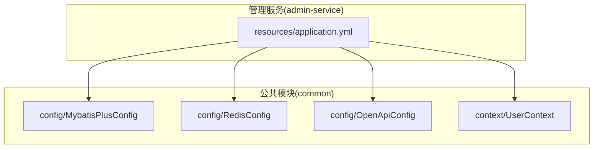
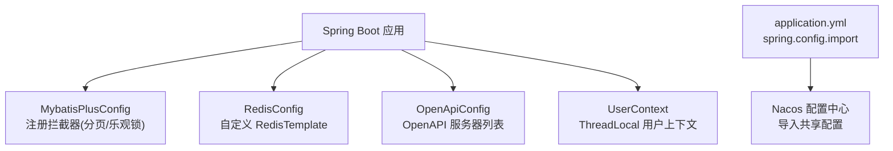
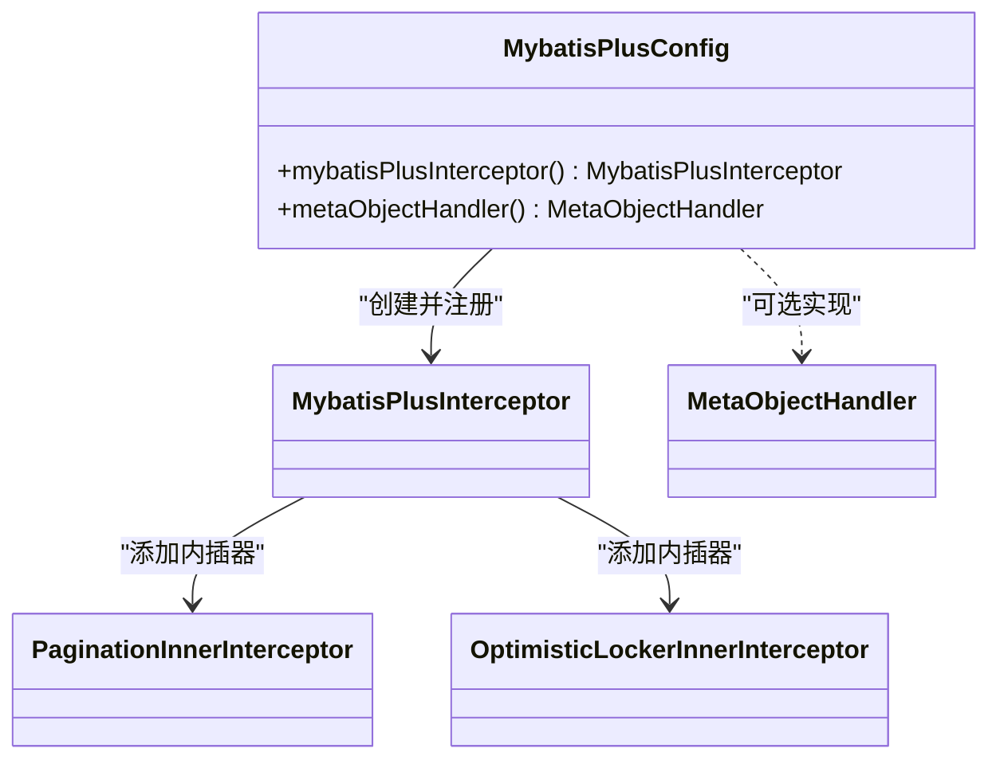
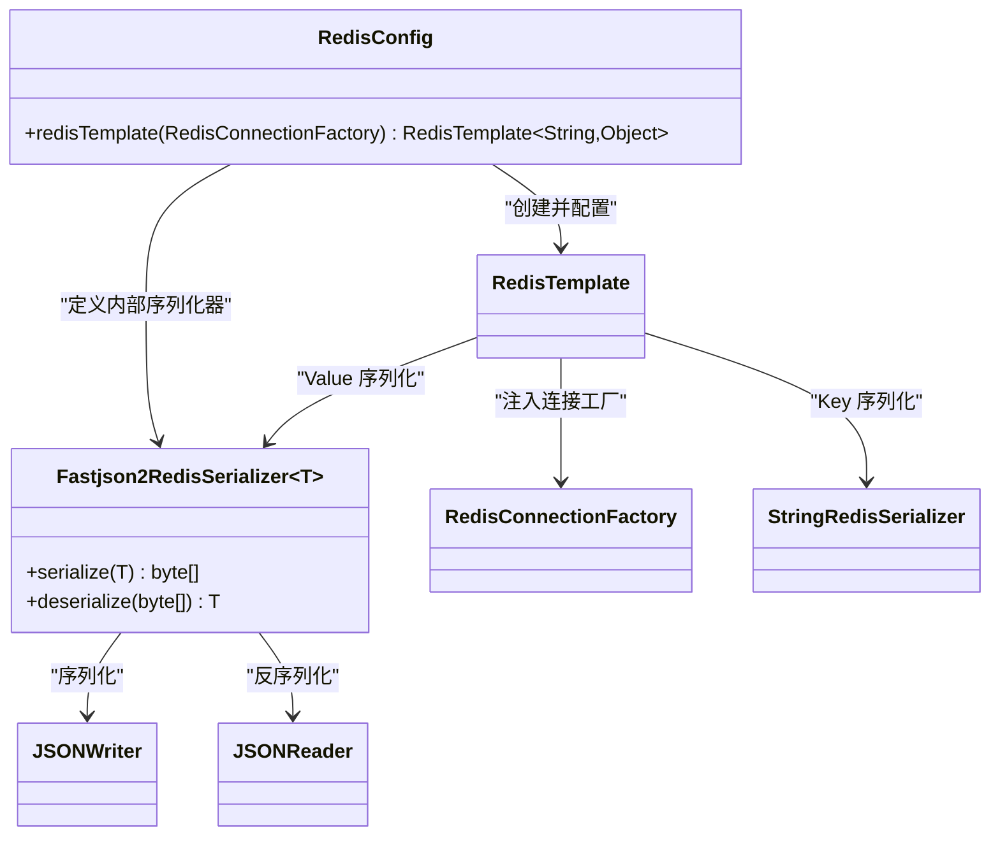
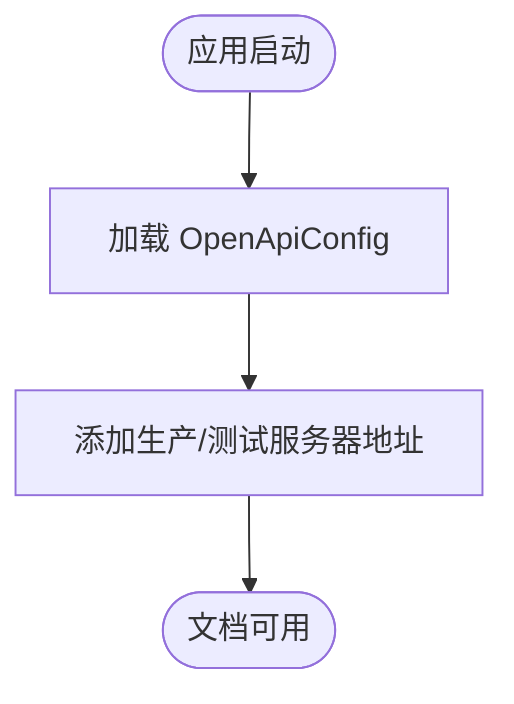
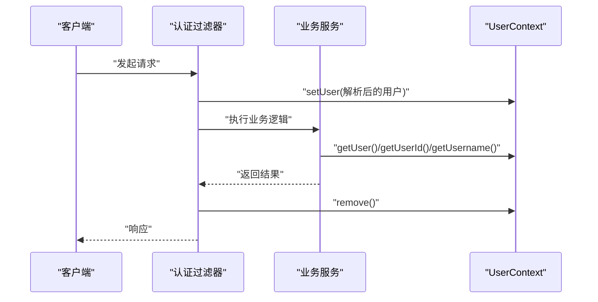
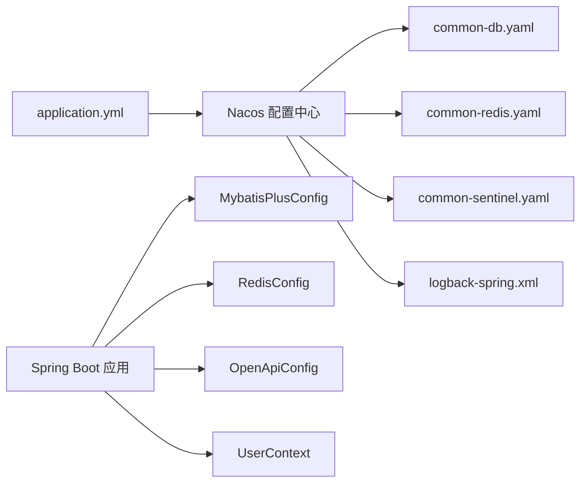

# 配置组件

<cite>
**本文引用的文件**   
- [MybatisPlusConfig.java](file://class_times_record_back/common/src/main/java/com/shiroko/config/MybatisPlusConfig.java)
- [RedisConfig.java](file://class_times_record_back/common/src/main/java/com/shiroko/config/RedisConfig.java)
- [OpenApiConfig.java](file://class_times_record_back/common/src/main/java/com/shiroko/config/OpenApiConfig.java)
- [UserContext.java](file://class_times_record_back/common/src/main/java/com/shiroko/context/UserContext.java)
- [application.yml](file://class_times_record_back/admin-service/src/main/resources/application.yml)
</cite>

## 目录
1. [简介](#简介)
2. [项目结构](#项目结构)
3. [核心组件](#核心组件)
4. [架构总览](#架构总览)
5. [详细组件分析](#详细组件分析)
6. [依赖关系分析](#依赖关系分析)
7. [性能考虑](#性能考虑)
8. [故障排查指南](#故障排查指南)
9. [结论](#结论)
10. [附录](#附录)

## 简介
本文件面向开发者，系统化梳理课程记录系统后端“配置组件”的设计与实现，覆盖以下重点：
- MyBatis-Plus 配置（分页插件、乐观锁等）
- Redis 缓存配置（序列化策略、连接池参数来源）
- OpenAPI 文档配置（多环境服务器地址）
- UserContext 用户上下文管理（线程级用户信息存取）
- 配置加载顺序、环境变量支持、优先级说明
- 热更新机制与监控方法
- 配置示例与调优建议

## 项目结构
本项目采用多模块微服务架构。配置类集中在 common 模块的 config 包中，各业务服务通过 Spring Boot 配置文件引入 Nacos 共享配置。关键路径如下：
- 通用配置：common/src/main/java/com/shiroko/config
- 用户上下文：common/src/main/java/com/shiroko/context
- 服务配置入口：admin-service/src/main/resources/application.yml（其他服务类似）

图表来源
- [MybatisPlusConfig.java:1-65](file://class_times_record_back/common/src/main/java/com/shiroko/config/MybatisPlusConfig.java#L1-L65)
- [RedisConfig.java:1-90](file://class_times_record_back/common/src/main/java/com/shiroko/config/RedisConfig.java#L1-L90)
- [OpenApiConfig.java:1-24](file://class_times_record_back/common/src/main/java/com/shiroko/config/OpenApiConfig.java#L1-L24)
- [UserContext.java:1-37](file://class_times_record_back/common/src/main/java/com/shiroko/context/UserContext.java#L1-L37)
- [application.yml:1-23](file://class_times_record_back/admin-service/src/main/resources/application.yml#L1-L23)

章节来源
- [application.yml:1-23](file://class_times_record_back/admin-service/src/main/resources/application.yml#L1-L23)

## 核心组件
- MyBatis-Plus 配置：注册拦截器，启用分页与乐观锁；提供字段自动填充的可选实现（已注释）。
- Redis 配置：自定义 RedisTemplate，Key 使用 String 序列化，Value 使用 Fastjson2 序列化；连接池由 Lettuce 默认配置项控制。
- OpenAPI 配置：声明生产与测试环境的服务器地址。
- 用户上下文：基于 ThreadLocal 的轻量用户信息容器，提供设置、获取、清理能力。

章节来源
- [MybatisPlusConfig.java:21-42](file://class_times_record_back/common/src/main/java/com/shiroko/config/MybatisPlusConfig.java#L21-L42)
- [RedisConfig.java:25-54](file://class_times_record_back/common/src/main/java/com/shiroko/config/RedisConfig.java#L25-L54)
- [OpenApiConfig.java:15-23](file://class_times_record_back/common/src/main/java/com/shiroko/config/OpenApiConfig.java#L15-L23)
- [UserContext.java:12-36](file://class_times_record_back/common/src/main/java/com/shiroko/context/UserContext.java#L12-L36)

## 架构总览
下图展示配置组件在应用启动时的装配关系与数据流向。

图表来源
- [MybatisPlusConfig.java:21-42](file://class_times_record_back/common/src/main/java/com/shiroko/config/MybatisPlusConfig.java#L21-L42)
- [RedisConfig.java:25-54](file://class_times_record_back/common/src/main/java/com/shiroko/config/RedisConfig.java#L25-L54)
- [OpenApiConfig.java:15-23](file://class_times_record_back/common/src/main/java/com/shiroko/config/OpenApiConfig.java#L15-L23)
- [UserContext.java:12-36](file://class_times_record_back/common/src/main/java/com/shiroko/context/UserContext.java#L12-L36)
- [application.yml:1-23](file://class_times_record_back/admin-service/src/main/resources/application.yml#L1-L23)

## 详细组件分析

### MyBatis-Plus 配置
- 功能要点
  - 注册 MybatisPlusInterceptor，添加 PaginationInnerInterceptor 与 OptimisticLockerInnerInterceptor。
  - 分页溢出处理：当请求页码大于总页数时返回最后一页。
  - 单页最大条数限制：防止恶意大分页请求。
  - 字段自动填充：提供 MetaObjectHandler 的参考实现（当前为注释状态），可按需启用。
- 复杂度与影响
  - 拦截器链在 SQL 执行前后生效，对分页与版本并发控制有直接性能与一致性影响。
- 优化建议
  - 根据业务调整 maxLimit，避免过大导致数据库压力。
  - 如需自动填充时间戳，可启用 MetaObjectHandler 并配合实体注解。

图表来源
- [MybatisPlusConfig.java:21-42](file://class_times_record_back/common/src/main/java/com/shiroko/config/MybatisPlusConfig.java#L21-L42)
- [MybatisPlusConfig.java:44-65](file://class_times_record_back/common/src/main/java/com/shiroko/config/MybatisPlusConfig.java#L44-L65)

章节来源
- [MybatisPlusConfig.java:21-42](file://class_times_record_back/common/src/main/java/com/shiroko/config/MybatisPlusConfig.java#L21-L42)
- [MybatisPlusConfig.java:44-65](file://class_times_record_back/common/src/main/java/com/shiroko/config/MybatisPlusConfig.java#L44-L65)

### Redis 缓存配置
- 功能要点
  - 自定义 RedisTemplate：Key/HashKey 使用 String 序列化；Value/HashValue 使用 Fastjson2 序列化。
  - Fastjson2 特性：写入 null 值字段、Map 键按字典序排序，便于签名一致性与反序列化稳定。
  - 连接池参数：由 spring.data.redis.lettuce.pool.* 控制（如 max-active、max-idle、min-idle、connect-timeout 等）。
- 复杂度与影响
  - 自定义序列化会影响跨语言/跨服务的数据可读性；Fastjson2 的自动类型支持需谨慎使用。
- 优化建议
  - 合理设置 Lettuce 连接池大小与超时，避免在高并发下出现连接耗尽或阻塞。
  - 对热点 Key 设置合理的过期时间，结合业务进行容量规划。

图表来源
- [RedisConfig.java:25-54](file://class_times_record_back/common/src/main/java/com/shiroko/config/RedisConfig.java#L25-L54)
- [RedisConfig.java:62-88](file://class_times_record_back/common/src/main/java/com/shiroko/config/RedisConfig.java#L62-L88)

章节来源
- [RedisConfig.java:25-54](file://class_times_record_back/common/src/main/java/com/shiroko/config/RedisConfig.java#L25-L54)
- [RedisConfig.java:62-88](file://class_times_record_back/common/src/main/java/com/shiroko/config/RedisConfig.java#L62-L88)

### OpenAPI 文档配置
- 功能要点
  - 声明多个 Server 地址，包含生产与本地测试环境，便于在线文档调试。
- 优化建议
  - 在多环境部署时，可通过环境变量或 Nacos 动态切换 Server 列表，减少硬编码。

图表来源
- [OpenApiConfig.java:15-23](file://class_times_record_back/common/src/main/java/com/shiroko/config/OpenApiConfig.java#L15-L23)

章节来源
- [OpenApiConfig.java:15-23](file://class_times_record_back/common/src/main/java/com/shiroko/config/OpenApiConfig.java#L15-L23)

### UserContext 用户上下文
- 功能要点
  - 基于 ThreadLocal 存储当前线程的用户对象，提供设置、获取、ID/用户名便捷访问与清理接口。
- 使用建议
  - 在请求入口处设置用户上下文，在过滤器/拦截器中确保 finally 分支调用 remove，避免线程复用导致泄漏。
  - 异步场景需显式传递上下文或使用 MDC/TransmittableThreadLocal 方案。

图表来源
- [UserContext.java:12-36](file://class_times_record_back/common/src/main/java/com/shiroko/context/UserContext.java#L12-L36)

章节来源
- [UserContext.java:12-36](file://class_times_record_back/common/src/main/java/com/shiroko/context/UserContext.java#L12-L36)

## 依赖关系分析
- 配置加载与 Nacos 集成
  - application.yml 通过 spring.config.import 引入 Nacos 中的共享配置（数据库、Redis、Sentinel、日志等），并开启 refresh=true 以支持热更新。
  - Nacos 服务端地址与命名空间通过环境变量注入，便于不同环境隔离。
- 组件耦合
  - 配置类之间无直接依赖，均被 Spring 容器独立装配。
  - UserContext 仅依赖 DTO 模型，保持轻量与高内聚。

图表来源
- [application.yml:1-23](file://class_times_record_back/admin-service/src/main/resources/application.yml#L1-L23)

章节来源
- [application.yml:1-23](file://class_times_record_back/admin-service/src/main/resources/application.yml#L1-L23)

## 性能考虑
- MyBatis-Plus
  - 合理设置分页 maxLimit，避免全表扫描与大结果集传输。
  - 乐观锁适用于冲突概率较低的场景；高并发写需评估失败重试与补偿策略。
- Redis
  - 调整 Lettuce 连接池参数（如 max-active、max-idle、min-idle、connect-timeout、command-timeout）匹配峰值 QPS。
  - 针对热点 Key 设计合适的 TTL 与淘汰策略，避免内存膨胀。
- OpenAPI
  - 在生产环境按需关闭或限制访问，减少不必要的元数据开销。

[本节为通用指导，不直接分析具体文件]

## 故障排查指南
- 分页无效
  - 检查是否注册了 MybatisPlusInterceptor 且添加了 PaginationInnerInterceptor。
- 乐观锁未生效
  - 确认实体类对应字段是否标注版本注解，并确保拦截器已启用。
- Redis 序列化异常
  - 检查 Value 序列化器是否为 Fastjson2，并确保目标类具备无参构造与可序列化字段。
  - 若出现自动类型问题，谨慎使用 SupportAutoType，必要时限定白名单。
- 用户上下文为空
  - 确认在请求入口设置了 UserContext，并在 finally 中清理；异步链路需显式传递上下文。
- 配置未热更新
  - 确认 Nacos 配置项已开启 refresh=true，并检查服务是否正确监听变更事件。

章节来源
- [MybatisPlusConfig.java:21-42](file://class_times_record_back/common/src/main/java/com/shiroko/config/MybatisPlusConfig.java#L21-L42)
- [RedisConfig.java:25-54](file://class_times_record_back/common/src/main/java/com/shiroko/config/RedisConfig.java#L25-L54)
- [UserContext.java:12-36](file://class_times_record_back/common/src/main/java/com/shiroko/context/UserContext.java#L12-L36)
- [application.yml:1-23](file://class_times_record_back/admin-service/src/main/resources/application.yml#L1-L23)

## 结论
本项目的配置组件围绕“可插拔、可观测、可热更”的目标构建：
- 通过 MyBatis-Plus 拦截器统一增强数据访问层能力；
- 通过自定义 RedisTemplate 保障序列化一致性与可控性；
- 通过 OpenAPI 配置简化多环境文档调试；
- 通过 UserContext 提供轻量线程级用户上下文；
- 借助 Nacos 集中管理与热更新，提升运维效率。

[本节为总结性内容，不直接分析具体文件]

## 附录

### 配置加载顺序与环境变量
- 加载顺序
  - Spring Boot 优先加载 application.yml；
  - 通过 spring.config.import 从 Nacos 拉取共享配置；
  - 环境变量（如 NACOS_SERVER_ADDR、NACOS_NAMESPACE）用于覆盖默认值。
- 优先级
  - 环境变量 > Nacos 配置 > 应用内默认值（若有）。

章节来源
- [application.yml:1-23](file://class_times_record_back/admin-service/src/main/resources/application.yml#L1-L23)

### 热更新机制与监控
- 热更新
  - Nacos 配置项开启 refresh=true 后，相关 Bean 将监听变更并刷新。
- 监控建议
  - 关注 Nacos 控制台配置变更历史与推送状态；
  - 在应用侧增加配置变更日志与指标上报（如变更次数、失败率）。

章节来源
- [application.yml:1-23](file://class_times_record_back/admin-service/src/main/resources/application.yml#L1-L23)

### 配置示例与调优清单
- MyBatis-Plus
  - 分页溢出策略与 maxLimit 按业务量级设定；
  - 如需自动填充时间戳，启用 MetaObjectHandler 并配合实体注解。
- Redis
  - 调整 Lettuce 连接池参数与超时；
  - 对热点 Key 设置合理 TTL，避免内存抖动。
- OpenAPI
  - 多环境 Server 地址通过 Nacos 或环境变量管理，避免硬编码。
- UserContext
  - 在过滤器/拦截器中设置与清理上下文；
  - 异步任务中显式传递上下文或使用线程扩展方案。

[本节为通用指导，不直接分析具体文件]