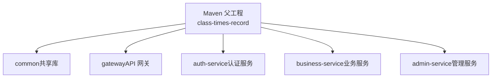
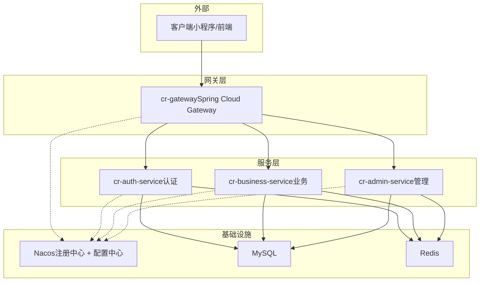
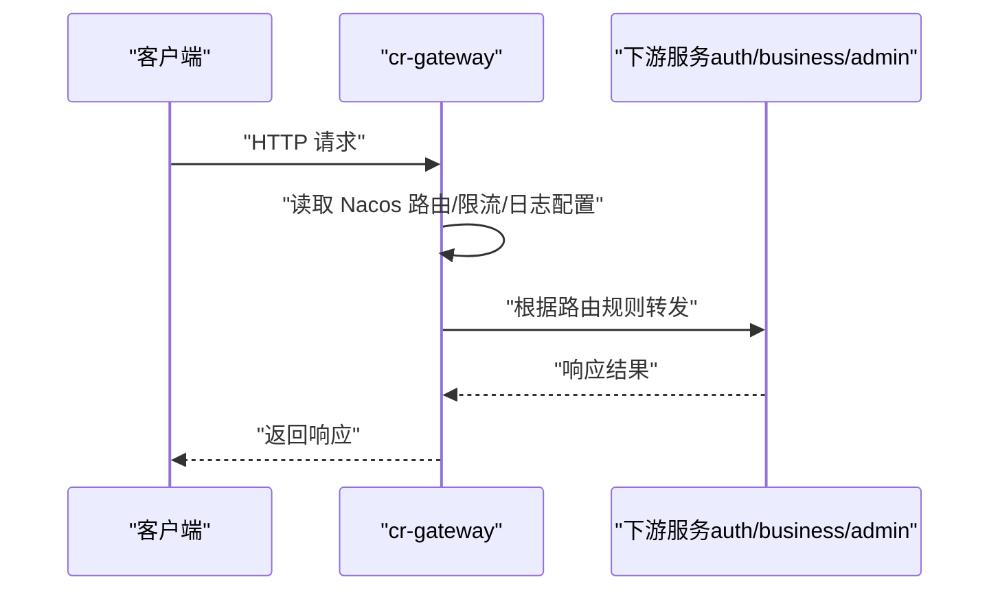
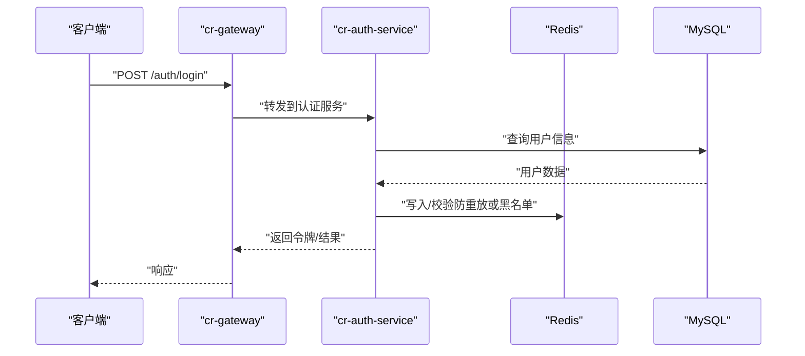
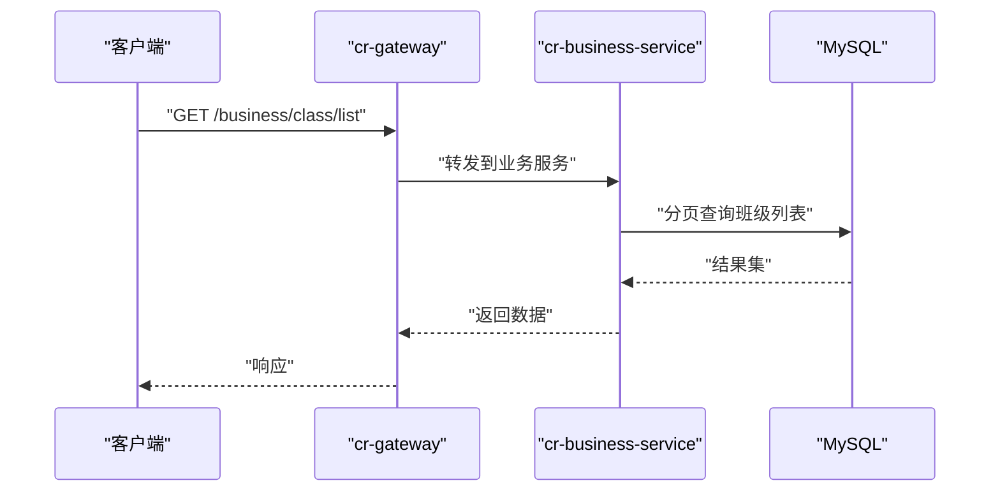
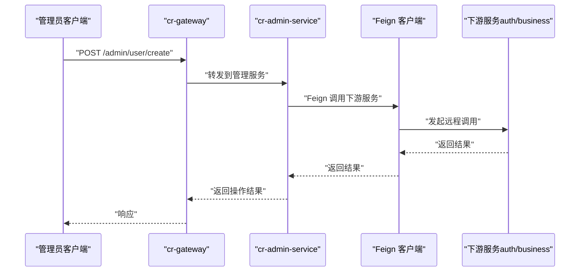
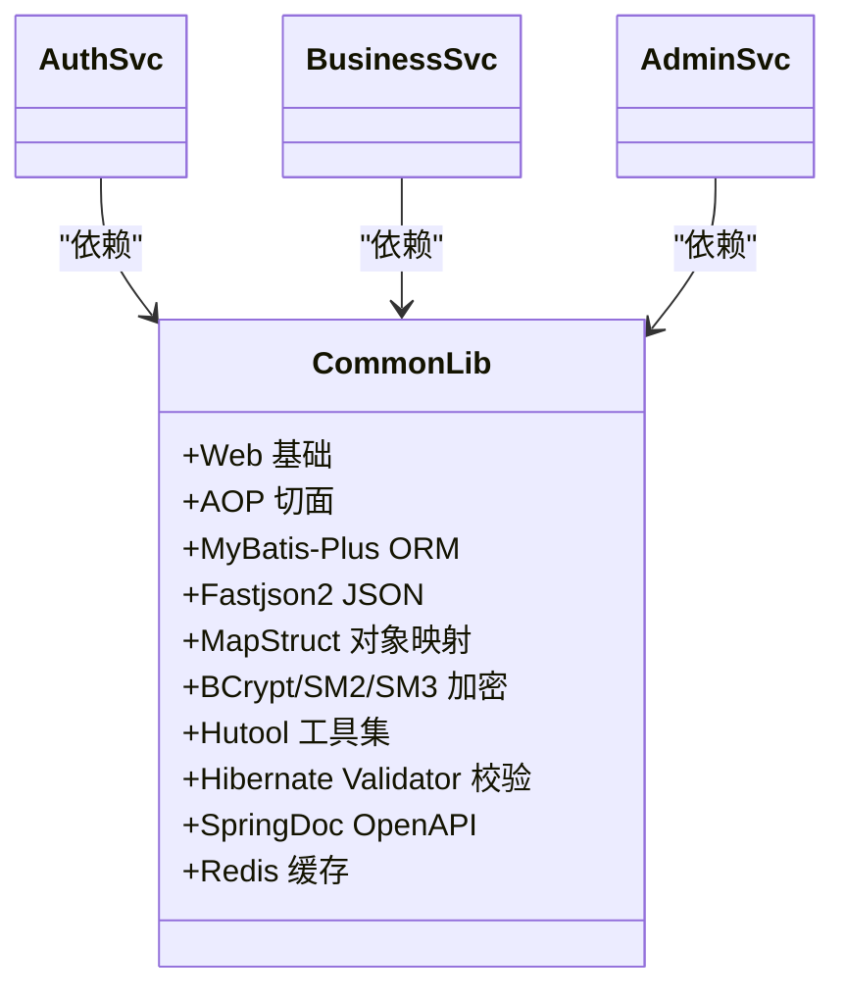
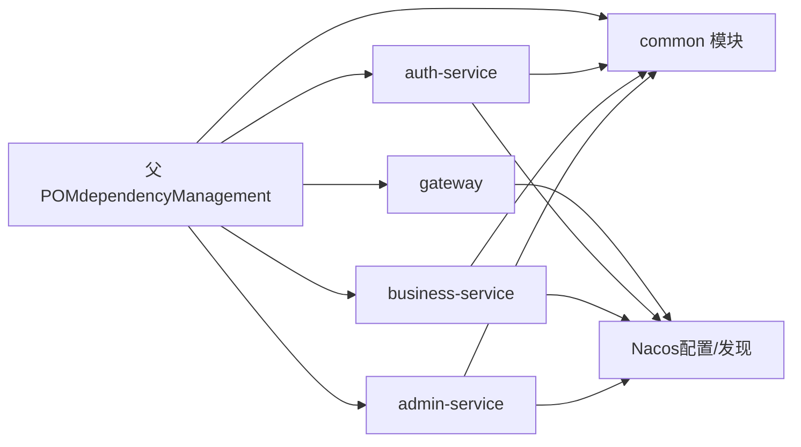

# 后端微服务架构

<cite>
**本文引用的文件**   
- [pom.xml](file://class_times_record_back/pom.xml)
- [README.md](file://class_times_record_back/README.md)
- [GatewayApplication.java](file://class_times_record_back/gateway/src/main/java/com/shiroko/gateway/GatewayApplication.java)
- [application.yml（网关）](file://class_times_record_back/gateway/src/main/resources/application.yml)
- [AuthServiceApplication.java](file://class_times_record_back/auth-service/src/main/java/com/shiroko/AuthServiceApplication.java)
- [application.yml（认证服务）](file://class_times_record_back/auth-service/src/main/resources/application.yml)
- [BusinessServiceApplication.java](file://class_times_record_back/business-service/src/main/java/com/shiroko/BusinessServiceApplication.java)
- [application.yml（业务服务）](file://class_times_record_back/business-service/src/main/resources/application.yml)
- [AdminServiceApplication.java](file://class_times_record_back/admin-service/src/main/java/com/shiroko/AdminServiceApplication.java)
- [application.yml（管理服务）](file://class_times_record_back/admin-service/src/main/resources/application.yml)
- [common/pom.xml](file://class_times_record_back/common/pom.xml)
</cite>

## 目录
1. [引言](#引言)
2. [项目结构](#项目结构)
3. [核心组件](#核心组件)
4. [架构总览](#架构总览)
5. [详细组件分析](#详细组件分析)
6. [依赖分析](#依赖分析)
7. [性能考虑](#性能考虑)
8. [故障排查指南](#故障排查指南)
9. [结论](#结论)
10. [附录](#附录)

## 引言
本文件面向初学者与专家，系统性阐述基于 Spring Cloud Alibaba 的微服务架构设计与实现。项目采用 Maven 多模块组织，包含四个核心服务：API 网关、认证服务、业务服务与管理服务，并通过 Nacos 完成服务发现与配置中心集成。文档覆盖职责划分、通信机制、请求处理流程、时序图与组件关系图，以及扩展与排障建议。

## 项目结构
顶层为 Maven 聚合工程，统一管理与编排各子模块的版本与依赖；common 提供跨服务共享的通用能力；gateway 作为统一入口；auth-service、business-service、admin-service 分别承载认证、业务与管理域能力。

**图表来源** 
- [pom.xml:22-28](file://class_times_record_back/pom.xml#L22-L28)

**章节来源**
- [pom.xml:1-46](file://class_times_record_back/pom.xml#L1-L46)
- [README.md:38-118](file://class_times_record_back/README.md#L38-L118)

## 核心组件
- common：封装实体、DTO/VO、转换器、工具类、通用配置与基础能力（如 Redis、MyBatis-Plus、校验、加密等），供各服务复用。
- gateway：无状态 API 网关，负责路由转发、鉴权前置拦截、限流熔断接入点（通过 Nacos 动态配置）。
- auth-service：提供登录、注册、令牌签发与校验、权限相关接口，支持 Feign 调用其他服务。
- business-service：课程、班级、学生、教师、记录等核心业务领域服务。
- admin-service：系统管理（用户、角色、菜单、日志、仪表盘等）能力，同样具备 Feign 调用能力。

**章节来源**
- [common/pom.xml:1-115](file://class_times_record_back/common/pom.xml#L1-L115)
- [GatewayApplication.java:1-17](file://class_times_record_back/gateway/src/main/java/com/shiroko/gateway/GatewayApplication.java#L1-L17)
- [AuthServiceApplication.java:1-21](file://class_times_record_back/auth-service/src/main/java/com/shiroko/AuthServiceApplication.java#L1-L21)
- [BusinessServiceApplication.java:1-16](file://class_times_record_back/business-service/src/main/java/com/shiroko/BusinessServiceApplication.java#L1-L16)
- [AdminServiceApplication.java:1-21](file://class_times_record_back/admin-service/src/main/java/com/shiroko/AdminServiceApplication.java#L1-L21)

## 架构总览
整体采用“客户端 → API 网关 → 业务服务 → 数据访问”的分层模型，结合 Nacos 的服务发现与配置中心，实现动态路由、集中化配置与运行时刷新。

**图表来源** 
- [application.yml（网关）:1-19](file://class_times_record_back/gateway/src/main/resources/application.yml#L1-L19)
- [application.yml（认证服务）:1-24](file://class_times_record_back/auth-service/src/main/resources/application.yml#L1-L24)
- [application.yml（业务服务）:1-24](file://class_times_record_back/business-service/src/main/resources/application.yml#L1-L24)
- [application.yml（管理服务）:1-23](file://class_times_record_back/admin-service/src/main/resources/application.yml#L1-L23)

## 详细组件分析

### 网关（cr-gateway）
- 启动类排除数据源自动装配，体现网关无数据库直连的定位。
- 通过 Nacos 导入网关专属配置、Sentinel 公共配置与日志配置，支持热更新。
- 对外暴露统一入口，内部按路径规则将请求转发至下游服务。

**图表来源** 
- [GatewayApplication.java:1-17](file://class_times_record_back/gateway/src/main/java/com/shiroko/gateway/GatewayApplication.java#L1-L17)
- [application.yml（网关）:1-19](file://class_times_record_back/gateway/src/main/resources/application.yml#L1-L19)

**章节来源**
- [GatewayApplication.java:1-17](file://class_times_record_back/gateway/src/main/java/com/shiroko/gateway/GatewayApplication.java#L1-L17)
- [application.yml（网关）:1-19](file://class_times_record_back/gateway/src/main/resources/application.yml#L1-L19)

### 认证服务（cr-auth-service）
- 启用服务发现与 Feign 客户端，可被网关或其他服务远程调用。
- 从 Nacos 拉取认证服务配置、数据库、Redis、Sentinel 与日志配置。
- 提供登录、注册、令牌签发与校验等能力，支撑全链路鉴权。

**图表来源** 
- [AuthServiceApplication.java:1-21](file://class_times_record_back/auth-service/src/main/java/com/shiroko/AuthServiceApplication.java#L1-L21)
- [application.yml（认证服务）:1-24](file://class_times_record_back/auth-service/src/main/resources/application.yml#L1-L24)

**章节来源**
- [AuthServiceApplication.java:1-21](file://class_times_record_back/auth-service/src/main/java/com/shiroko/AuthServiceApplication.java#L1-L21)
- [application.yml（认证服务）:1-24](file://class_times_record_back/auth-service/src/main/resources/application.yml#L1-L24)

### 业务服务（cr-business-service）
- 启用服务发现，提供课程、班级、学生、教师、记录等业务接口。
- 从 Nacos 拉取业务服务配置、数据库、Redis、Sentinel 与日志配置。
- 可与认证服务协作进行权限校验与上下文传递。

**图表来源** 
- [BusinessServiceApplication.java:1-16](file://class_times_record_back/business-service/src/main/java/com/shiroko/BusinessServiceApplication.java#L1-L16)
- [application.yml（业务服务）:1-24](file://class_times_record_back/business-service/src/main/resources/application.yml#L1-L24)

**章节来源**
- [BusinessServiceApplication.java:1-16](file://class_times_record_back/business-service/src/main/java/com/shiroko/BusinessServiceApplication.java#L1-L16)
- [application.yml（业务服务）:1-24](file://class_times_record_back/business-service/src/main/resources/application.yml#L1-L24)

### 管理服务（cr-admin-service）
- 启用服务发现与 Feign 客户端，提供系统管理相关接口。
- 从 Nacos 拉取管理服务配置、数据库、Redis、Sentinel 与日志配置。
- 可通过 Feign 调用认证或业务服务以获取必要数据。

**图表来源** 
- [AdminServiceApplication.java:1-21](file://class_times_record_back/admin-service/src/main/java/com/shiroko/AdminServiceApplication.java#L1-L21)
- [application.yml（管理服务）:1-23](file://class_times_record_back/admin-service/src/main/resources/application.yml#L1-L23)

**章节来源**
- [AdminServiceApplication.java:1-21](file://class_times_record_back/admin-service/src/main/java/com/shiroko/AdminServiceApplication.java#L1-L21)
- [application.yml（管理服务）:1-23](file://class_times_record_back/admin-service/src/main/resources/application.yml#L1-L23)

### 通用模块（common）
- 提供 Web、AOP、MyBatis-Plus、JSON、MapStruct、国密算法、Hutool、校验器、OpenAPI、Redis 等依赖，形成稳定的技术底座。
- 通过统一的构建插件与注解处理器，确保编译期代码生成一致性与可维护性。

**图表来源** 
- [common/pom.xml:18-115](file://class_times_record_back/common/pom.xml#L18-L115)

**章节来源**
- [common/pom.xml:1-155](file://class_times_record_back/common/pom.xml#L1-L155)

## 依赖分析
- 版本治理：父 POM 使用 dependencyManagement 统一管理 Spring Cloud、Spring Cloud Alibaba、MyBatis-Plus 等关键依赖版本，避免版本冲突。
- 模块耦合：各服务均依赖 common，降低重复实现；网关不直接依赖业务逻辑，仅做路由与横切能力。
- 外部依赖：Nacos 用于服务发现与配置中心；Redis 用于缓存与防重放；MySQL 作为持久化存储。

**图表来源** 
- [pom.xml:48-104](file://class_times_record_back/pom.xml#L48-L104)

**章节来源**
- [pom.xml:48-104](file://class_times_record_back/pom.xml#L48-L104)

## 性能考虑
- 虚拟线程：JDK 21 虚拟线程提升高并发吞吐，降低线程切换开销。
- 连接池：Redis 默认使用 Lettuce 并引入连接池依赖，优化连接复用。
- 配置热更新：Nacos 配置支持 refresh=true，无需重启即可生效。
- 读写分离与索引：建议在 MySQL 侧对高频查询字段建立合适索引，必要时引入读写分离。
- 缓存策略：热点数据优先走 Redis，注意缓存穿透/雪崩防护与一致性策略。

[本节为通用指导，不直接分析具体文件]

## 故障排查指南
- 网关无法加载配置
  - 检查 Nacos 地址、命名空间与分组是否正确；确认 cr-gateway.yaml 是否存在且可访问。
  - 参考：[application.yml（网关）:1-19](file://class_times_record_back/gateway/src/main/resources/application.yml#L1-L19)
- 服务未注册到 Nacos
  - 确认服务已启用 @EnableDiscoveryClient，且 Nacos server-addr、namespace、group 配置正确。
  - 参考：
    - [AuthServiceApplication.java:1-21](file://class_times_record_back/auth-service/src/main/java/com/shiroko/AuthServiceApplication.java#L1-L21)
    - [application.yml（认证服务）:1-24](file://class_times_record_back/auth-service/src/main/resources/application.yml#L1-L24)
- Feign 调用失败
  - 确认目标服务已注册、网络可达；检查超时、重试与负载均衡策略。
  - 参考：
    - [AdminServiceApplication.java:1-21](file://class_times_record_back/admin-service/src/main/java/com/shiroko/AdminServiceApplication.java#L1-L21)
    - [AuthServiceApplication.java:1-21](file://class_times_record_back/auth-service/src/main/java/com/shiroko/AuthServiceApplication.java#L1-L21)
- 数据库/Redis 连接异常
  - 核对 Nacos 中 common-db.yaml 与 common-redis.yaml 的配置项；检查账号密码、白名单与端口。
  - 参考：
    - [application.yml（认证服务）:1-24](file://class_times_record_back/auth-service/src/main/resources/application.yml#L1-L24)
    - [application.yml（业务服务）:1-24](file://class_times_record_back/business-service/src/main/resources/application.yml#L1-L24)
    - [application.yml（管理服务）:1-23](file://class_times_record_back/admin-service/src/main/resources/application.yml#L1-L23)

**章节来源**
- [application.yml（网关）:1-19](file://class_times_record_back/gateway/src/main/resources/application.yml#L1-L19)
- [application.yml（认证服务）:1-24](file://class_times_record_back/auth-service/src/main/resources/application.yml#L1-L24)
- [application.yml（业务服务）:1-24](file://class_times_record_back/business-service/src/main/resources/application.yml#L1-L24)
- [application.yml（管理服务）:1-23](file://class_times_record_back/admin-service/src/main/resources/application.yml#L1-L23)
- [AuthServiceApplication.java:1-21](file://class_times_record_back/auth-service/src/main/java/com/shiroko/AuthServiceApplication.java#L1-L21)
- [AdminServiceApplication.java:1-21](file://class_times_record_back/admin-service/src/main/java/com/shiroko/AdminServiceApplication.java#L1-L21)

## 结论
本项目以 Spring Cloud Alibaba 为核心，借助 Nacos 实现服务发现与配置中心，配合 Spring Cloud Gateway 完成统一入口与动态路由。common 模块沉淀通用能力，显著降低重复开发成本。通过分层清晰、职责明确的微服务拆分，系统具备良好的可扩展性与可维护性。后续可在链路追踪、灰度发布、弹性伸缩等方面持续演进。

[本节为总结性内容，不直接分析具体文件]

## 附录
- 快速开始与环境要求参见 README。
- 安全设计（三级防护体系、JWT、签名校验、数据加密）详见 README 安全章节。
- CI/CD 流水线与部署说明见 README 对应章节。

**章节来源**
- [README.md:121-165](file://class_times_record_back/README.md#L121-L165)
- [README.md:166-232](file://class_times_record_back/README.md#L166-L232)
- [README.md:253-266](file://class_times_record_back/README.md#L253-L266)