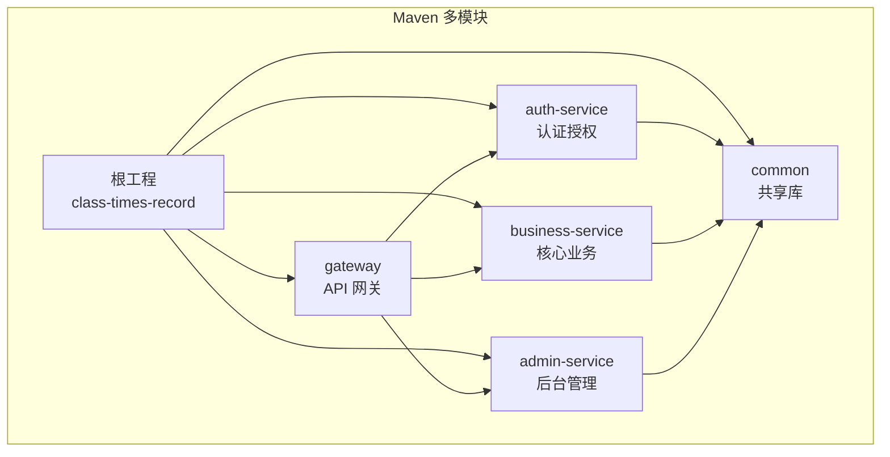
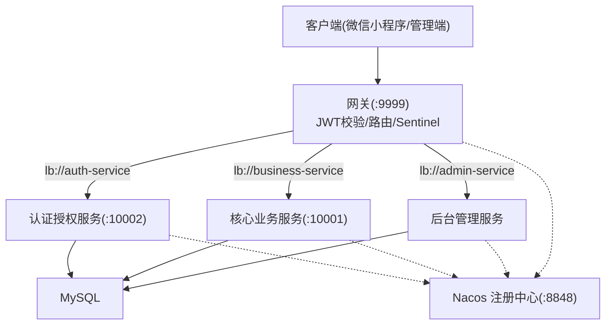
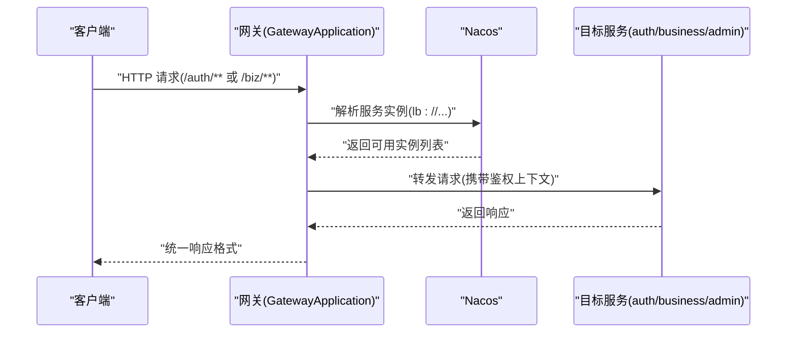
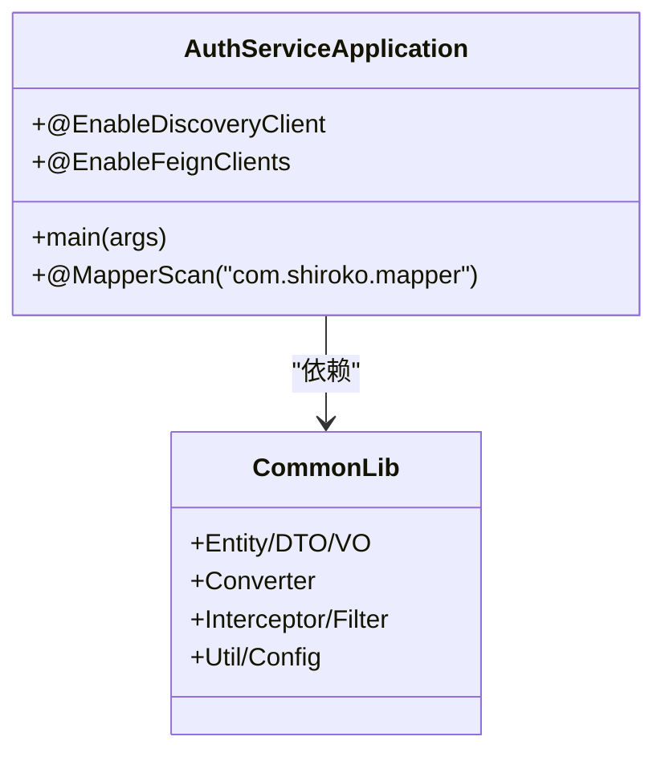
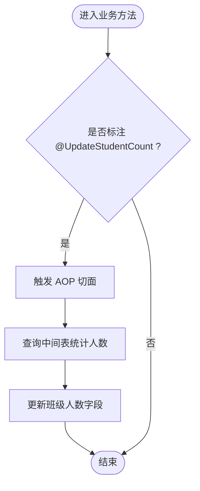
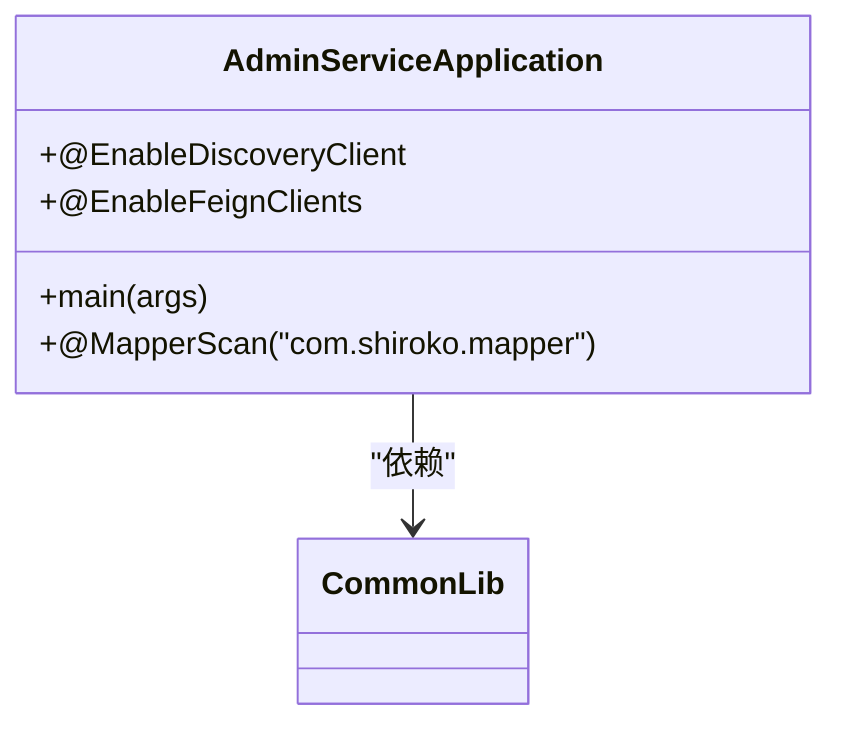
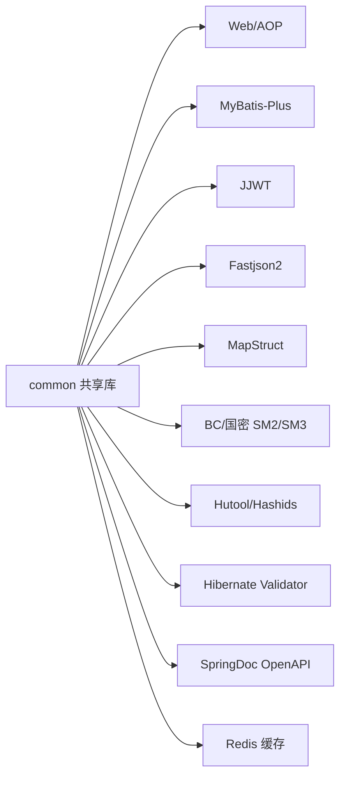
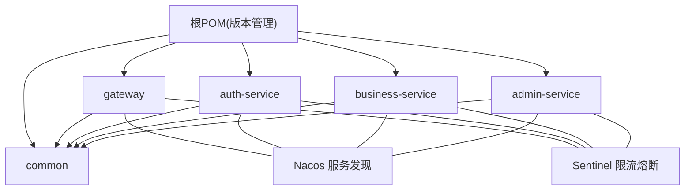
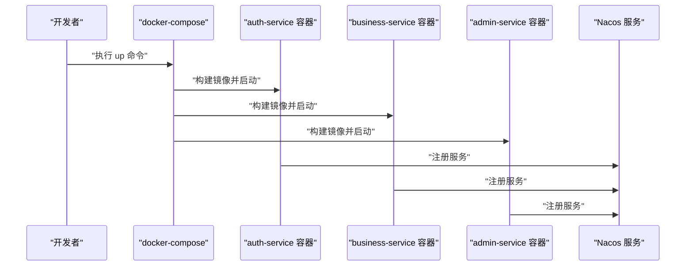

# 整体架构设计

<cite>
**本文引用的文件**   
- [pom.xml](file://class_times_record_back/pom.xml)
- [architecture.md](file://class_times_record_back/docs/architecture.md)
- [docker-compose.yml](file://class_times_record_back/docker-compose.yml)
- [gateway/pom.xml](file://class_times_record_back/gateway/pom.xml)
- [auth-service/pom.xml](file://class_times_record_back/auth-service/pom.xml)
- [business-service/pom.xml](file://class_times_record_back/business-service/pom.xml)
- [admin-service/pom.xml](file://class_times_record_back/admin-service/pom.xml)
- [common/pom.xml](file://class_times_record_back/common/pom.xml)
- [GatewayApplication.java](file://class_times_record_back/gateway/src/main/java/com/shiroko/gateway/GatewayApplication.java)
- [AuthServiceApplication.java](file://class_times_record_back/auth-service/src/main/java/com/shiroko/AuthServiceApplication.java)
- [BusinessServiceApplication.java](file://class_times_record_back/business-service/src/main/java/com/shiroko/BusinessServiceApplication.java)
- [AdminServiceApplication.java](file://class_times_record_back/admin-service/src/main/java/com/shiroko/AdminServiceApplication.java)
</cite>

## 目录
1. [引言](#引言)
2. [项目结构](#项目结构)
3. [核心组件](#核心组件)
4. [架构总览](#架构总览)
5. [详细组件分析](#详细组件分析)
6. [依赖关系分析](#依赖关系分析)
7. [性能与扩展性](#性能与扩展性)
8. [部署与容器化](#部署与容器化)
9. [故障排查指南](#故障排查指南)
10. [结论](#结论)

## 引言
本文件面向初学者与专家，系统性阐述基于 Spring Cloud Alibaba 的微服务整体架构设计与技术选型。重点覆盖：
- 微服务拆分原则与服务边界定义
- Maven 多模块组织结构（common、gateway、auth-service、business-service、admin-service）
- 技术栈版本兼容性与关键能力（Java 21、Spring Boot 4.0.4、Spring Cloud Alibaba 2025.1.0.0）
- 网关鉴权、安全签名、统一异常处理、虚拟线程等机制
- 容器化与编排策略（Docker + docker-compose）
- 面向初学者的概念入门与面向专家的架构决策细节和演进建议

## 项目结构
后端采用 Maven 多模块聚合工程，根 POM 统一管理依赖与构建插件，子模块按职责划分：
- common：共享库（实体、DTO/VO、转换器、通用配置、拦截器/过滤器、工具类、全局异常等）
- gateway：API 网关（路由分发、JWT 校验、Sentinel 限流熔断、CORS）
- auth-service：认证授权域（登录注册、Token、用户/角色/菜单/权限记录）
- business-service：核心业务域（机构、学生、教师、班级、课程、排课、课程记录、课时记录）
- admin-service：后台管理域（系统用户、角色、菜单、操作日志、仪表盘等）

图表来源
- [pom.xml:22-28](file://class_times_record_back/pom.xml#L22-L28)
- [gateway/pom.xml:19-34](file://class_times_record_back/gateway/pom.xml#L19-L34)
- [auth-service/pom.xml:19-24](file://class_times_record_back/auth-service/pom.xml#L19-L24)
- [business-service/pom.xml:19-24](file://class_times_record_back/business-service/pom.xml#L19-L24)
- [admin-service/pom.xml:19-24](file://class_times_record_back/admin-service/pom.xml#L19-L24)

章节来源
- [pom.xml:1-162](file://class_times_record_back/pom.xml#L1-L162)
- [architecture.md:267-296](file://class_times_record_back/docs/architecture.md#L267-L296)

## 核心组件
- 网关层（gateway）
  - 统一入口，负责路由转发、JWT 校验、请求头注入、Sentinel 限流熔断、跨域处理
  - 通过 Nacos 服务发现与负载均衡解析 lb:// 目标服务
- 认证授权服务（auth-service）
  - 提供登录注册、Token 签发与刷新、用户/角色/菜单/权限记录等接口
  - 暴露 /auth/** 路径，供前端与小程序调用
- 核心业务服务（business-service）
  - 承载机构、学生、教师、班级、课程、排课、课程记录、课时记录等业务
  - 暴露 /biz/** 路径
- 后台管理服务（admin-service）
  - 提供系统用户、角色、菜单、操作日志、仪表盘等管理能力
- 共享库（common）
  - 提供 Entity/DTO/VO、MapStruct 转换器、全局异常处理、拦截器/过滤器、工具类、AOP 切面等

章节来源
- [architecture.md:47-57](file://class_times_record_back/docs/architecture.md#L47-L57)
- [architecture.md:267-296](file://class_times_record_back/docs/architecture.md#L267-L296)

## 架构总览
整体采用“网关前置 + 微服务自治”的分层架构。客户端经 HTTPS 访问网关，网关完成鉴权后转发到具体业务服务；服务间通过 Nacos 进行服务发现与负载均衡；数据库使用 MySQL，持久层采用 MyBatis-Plus。

图表来源
- [architecture.md:11-45](file://class_times_record_back/docs/architecture.md#L11-L45)
- [architecture.md:59-65](file://class_times_record_back/docs/architecture.md#L59-L65)

## 详细组件分析

### 网关组件（gateway）
- 功能要点
  - 响应式网关，排除数据源自动配置，避免引入不必要的 Web MVC 依赖
  - 集成 Nacos 服务发现与 Sentinel 网关限流
  - 对外暴露统一端口，内部通过 lb:// 指向各微服务
- 启动类
  - 排除 DataSource 相关自动配置，仅作为网关运行

图表来源
- [GatewayApplication.java:8-16](file://class_times_record_back/gateway/src/main/java/com/shiroko/gateway/GatewayApplication.java#L8-L16)
- [gateway/pom.xml:35-69](file://class_times_record_back/gateway/pom.xml#L35-L69)
- [architecture.md:59-65](file://class_times_record_back/docs/architecture.md#L59-L65)

章节来源
- [GatewayApplication.java:1-17](file://class_times_record_back/gateway/src/main/java/com/shiroko/gateway/GatewayApplication.java#L1-L17)
- [gateway/pom.xml:1-81](file://class_times_record_back/gateway/pom.xml#L1-L81)
- [architecture.md:59-65](file://class_times_record_back/docs/architecture.md#L59-L65)

### 认证授权服务（auth-service）
- 功能要点
  - 提供认证相关接口（登录、注册、Token 刷新等）
  - 启用服务发现与 Feign 客户端，支持跨服务调用
  - 集成 Sentinel 限流熔断
- 启动类
  - 启用 DiscoveryClient 与 FeignClients，扫描 Mapper

图表来源
- [AuthServiceApplication.java:10-15](file://class_times_record_back/auth-service/src/main/java/com/shiroko/AuthServiceApplication.java#L10-L15)
- [auth-service/pom.xml:19-68](file://class_times_record_back/auth-service/pom.xml#L19-L68)

章节来源
- [AuthServiceApplication.java:1-21](file://class_times_record_back/auth-service/src/main/java/com/shiroko/AuthServiceApplication.java#L1-L21)
- [auth-service/pom.xml:1-80](file://class_times_record_back/auth-service/pom.xml#L1-L80)

### 核心业务服务（business-service）
- 功能要点
  - 承载核心业务领域模型与流程
  - 启用 AOP（如班级人数统计）、Nacos 服务发现、Sentinel 限流熔断
- 启动类
  - 启用 DiscoveryClient，扫描 Mapper

图表来源
- [architecture.md:190-215](file://class_times_record_back/docs/architecture.md#L190-L215)
- [business-service/pom.xml:30-34](file://class_times_record_back/business-service/pom.xml#L30-L34)

章节来源
- [BusinessServiceApplication.java:1-16](file://class_times_record_back/business-service/src/main/java/com/shiroko/BusinessServiceApplication.java#L1-L16)
- [business-service/pom.xml:1-75](file://class_times_record_back/business-service/pom.xml#L1-L75)
- [architecture.md:190-215](file://class_times_record_back/docs/architecture.md#L190-L215)

### 后台管理服务（admin-service）
- 功能要点
  - 提供系统用户、角色、菜单、操作日志、仪表盘等管理能力
  - 启用 Feign 客户端与 Sentinel，支持跨服务调用
- 启动类
  - 启用 DiscoveryClient 与 FeignClients，扫描 Mapper

图表来源
- [AdminServiceApplication.java:10-15](file://class_times_record_back/admin-service/src/main/java/com/shiroko/AdminServiceApplication.java#L10-L15)
- [admin-service/pom.xml:19-78](file://class_times_record_back/admin-service/pom.xml#L19-L78)

章节来源
- [AdminServiceApplication.java:1-21](file://class_times_record_back/admin-service/src/main/java/com/shiroko/AdminServiceApplication.java#L1-L21)
- [admin-service/pom.xml:1-95](file://class_times_record_back/admin-service/pom.xml#L1-L95)

### 共享库（common）
- 内容范围
  - 实体、DTO/VO、MapStruct 转换器、全局异常处理器、拦截器/过滤器、工具类、AOP 切面、通用配置
- 依赖要点
  - 包含 Web、AOP、MyBatis-Plus、JJWT、Fastjson2、MapStruct、BCrypt/SM2/SM3、Hutool、Hashids、Hibernate Validator、SpringDoc、Redis 等

图表来源
- [common/pom.xml:18-114](file://class_times_record_back/common/pom.xml#L18-L114)

章节来源
- [common/pom.xml:1-155](file://class_times_record_back/common/pom.xml#L1-L155)

## 依赖关系分析
- 模块依赖
  - 所有业务模块均依赖 common
  - gateway 依赖 common 并排除 spring-boot-starter-web 以避免与响应式网关冲突
  - auth-service、business-service、admin-service 均依赖 common 与各自运行时依赖（Web、AOP、Nacos、Sentinel、Actuator、OpenFeign 等）
- 外部依赖
  - Spring Cloud Alibaba BOM 管理 Nacos、Sentinel 等版本
  - Spring Cloud BOM 管理 Gateway、LoadBalancer、OpenFeign 等版本
  - MyBatis-Plus BOM 管理持久层版本

图表来源
- [pom.xml:48-104](file://class_times_record_back/pom.xml#L48-L104)
- [gateway/pom.xml:45-69](file://class_times_record_back/gateway/pom.xml#L45-L69)
- [auth-service/pom.xml:30-68](file://class_times_record_back/auth-service/pom.xml#L30-L68)
- [business-service/pom.xml:35-63](file://class_times_record_back/business-service/pom.xml#L35-L63)
- [admin-service/pom.xml:30-78](file://class_times_record_back/admin-service/pom.xml#L30-L78)

章节来源
- [pom.xml:1-162](file://class_times_record_back/pom.xml#L1-L162)
- [gateway/pom.xml:1-81](file://class_times_record_back/gateway/pom.xml#L1-L81)
- [auth-service/pom.xml:1-80](file://class_times_record_back/auth-service/pom.xml#L1-L80)
- [business-service/pom.xml:1-75](file://class_times_record_back/business-service/pom.xml#L1-L75)
- [admin-service/pom.xml:1-95](file://class_times_record_back/admin-service/pom.xml#L1-L95)

## 性能与扩展性
- 虚拟线程
  - 应用启用 JDK 21 虚拟线程，适合 I/O 密集型场景（数据库查询、外部 API 调用），每个请求绑定一个虚拟线程，I/O 阻塞时自动挂起释放底层载体线程
- 连接池与线程池
  - 通过环境变量限制 Tomcat 线程池与 HikariCP 连接池大小，降低内存占用
- 限流与熔断
  - 网关与各服务集成 Sentinel，实现流量控制与降级保护
- 主键策略
  - 全局使用雪花算法生成分布式唯一 ID，趋势递增利于索引
- 逻辑删除
  - 通过 MyBatis-Plus 全局配置实现逻辑删除，简化数据一致性处理

章节来源
- [architecture.md:234-249](file://class_times_record_back/docs/architecture.md#L234-L249)
- [docker-compose.yml:10-27](file://class_times_record_back/docker-compose.yml#L10-L27)
- [docker-compose.yml:36-51](file://class_times_record_back/docker-compose.yml#L36-L51)
- [docker-compose.yml:60-75](file://class_times_record_back/docker-compose.yml#L60-L75)

## 部署与容器化
- 服务启动顺序
  - 先启动 Nacos，再启动各微服务；Sentinel Dashboard 可选
- Docker 镜像与端口
  - gateway、auth-service、business-service、admin-service 分别提供独立 Dockerfile，基础镜像为 eclipse-temurin:21-jre-alpine
- docker-compose 编排
  - 通过环境变量注入 Nacos 地址、命名空间、Sentinel 地址与客户端 IP
  - 设置 Tomcat 线程池与 HikariCP 连接池参数，限制资源上限与保留值
  - 使用 host 网络模式便于直接暴露端口

图表来源
- [docker-compose.yml:1-75](file://class_times_record_back/docker-compose.yml#L1-L75)
- [architecture.md:598-606](file://class_times_record_back/docs/architecture.md#L598-L606)

章节来源
- [docker-compose.yml:1-75](file://class_times_record_back/docker-compose.yml#L1-L75)
- [architecture.md:583-606](file://class_times_record_back/docs/architecture.md#L583-L606)

## 故障排查指南
- 常见问题定位
  - 网关无法解析服务：检查 Nacos 地址与命名空间是否正确，确认服务已注册
  - 鉴权失败：检查 JWT 密钥与过期时间配置，确认请求头携带有效 Token
  - 限流触发：查看 Sentinel 控制台规则，调整阈值或增加实例
  - 数据库连接不足：调整 HikariCP 最大连接数与最小空闲数
- 日志与监控
  - Actuator 健康检查用于快速判断服务状态
  - 结合 Sentinel Dashboard 观察限流与熔断指标

章节来源
- [architecture.md:92-147](file://class_times_record_back/docs/architecture.md#L92-L147)
- [architecture.md:619-632](file://class_times_record_back/docs/architecture.md#L619-L632)

## 结论
本项目以 Spring Cloud Alibaba 为核心，构建了清晰的分层与模块化架构：网关统一入口、认证授权与核心业务解耦、后台管理独立域、共享库沉淀通用能力。借助 Java 21 虚拟线程、Sentinel 限流熔断、Nacos 服务发现与 Redis 缓存等能力，系统在可扩展性与稳定性方面具备良好基础。后续可考虑引入配置中心、链路追踪与更完善的 API 版本管理，进一步提升运维效率与可观测性。