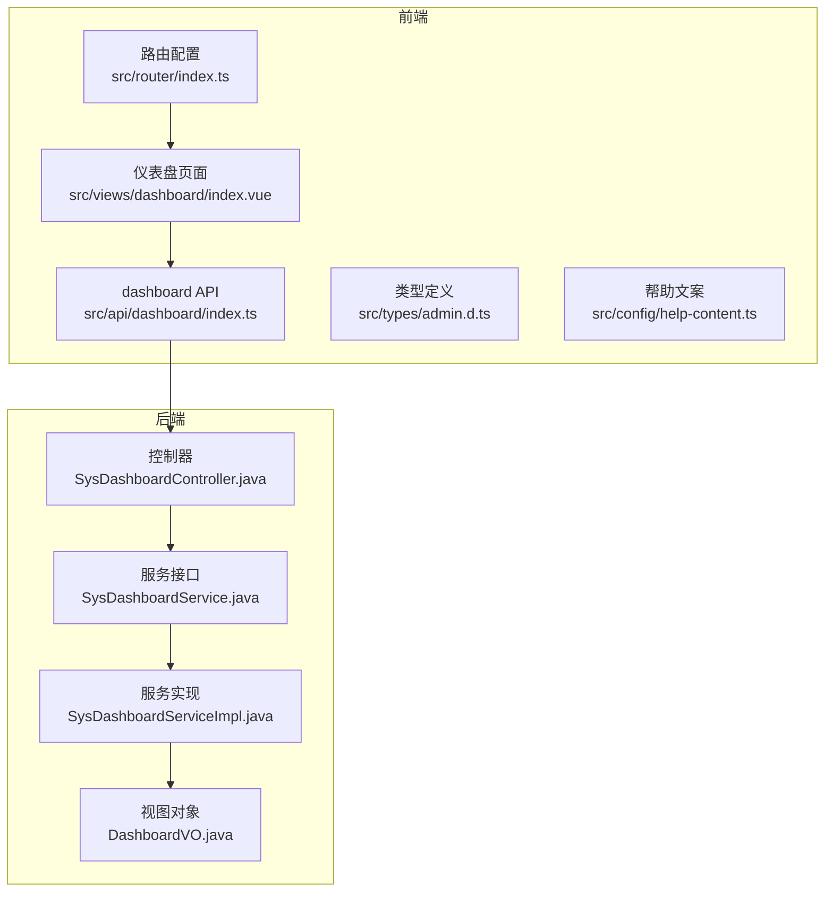
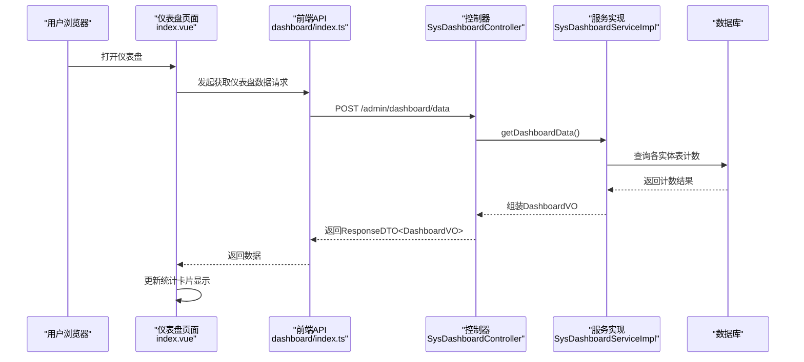
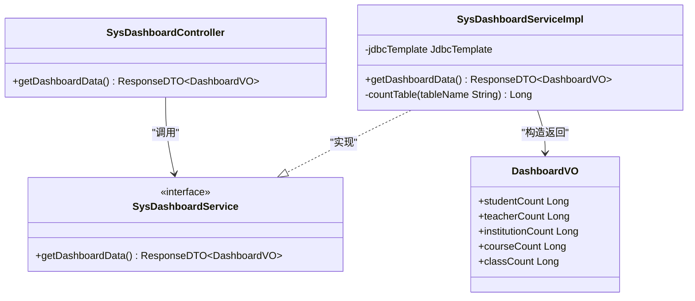
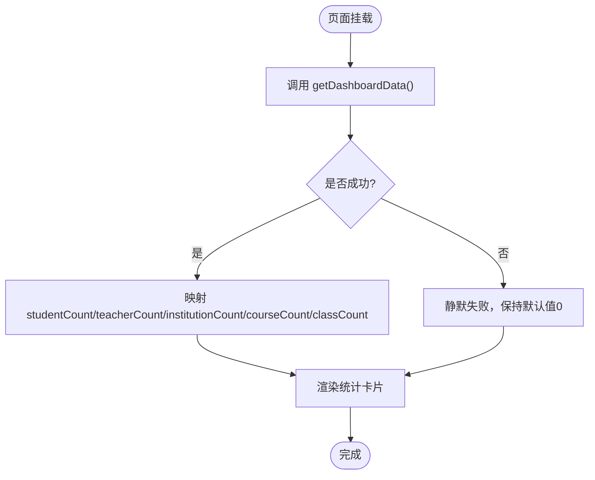
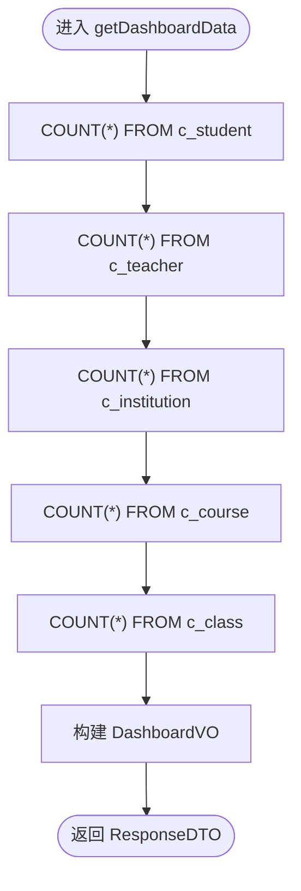
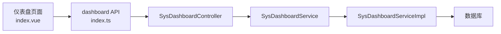

# 仪表盘统计

<cite>
**本文引用的文件**   
- [SysDashboardController.java](file://class_times_record_back/admin-service/src/main/java/com/shiroko/controller/SysDashboardController.java)
- [SysDashboardService.java](file://class_times_record_back/common/src/main/java/com/shiroko/service/SysDashboardService.java)
- [SysDashboardServiceImpl.java](file://class_times_record_back/admin-service/src/main/java/com/shiroko/service/impl/SysDashboardServiceImpl.java)
- [DashboardVO.java](file://class_times_record_back/common/src/main/java/com/shiroko/repository/vo/admin/DashboardVO.java)
- [index.ts（前端仪表盘API）](file://class_record_admin_front/src/api/dashboard/index.ts)
- [index.vue（仪表盘页面）](file://class_record_admin_front/src/views/dashboard/index.vue)
- [admin.d.ts（类型定义）](file://class_record_admin_front/src/types/admin.d.ts)
- [help-content.ts（帮助文案）](file://class_record_admin_front/src/config/help-content.ts)
- [router/index.ts（路由配置）](file://class_record_admin_front/src/router/index.ts)
</cite>

## 目录
1. [简介](#简介)
2. [项目结构](#项目结构)
3. [核心组件](#核心组件)
4. [架构总览](#架构总览)
5. [详细组件分析](#详细组件分析)
6. [依赖关系分析](#依赖关系分析)
7. [性能考虑](#性能考虑)
8. [故障排查指南](#故障排查指南)
9. [结论](#结论)
10. [附录](#附录)

## 简介
本文件围绕“仪表盘统计”能力，系统化说明系统运营数据的统计分析与可视化展示。当前实现聚焦于关键业务指标的实时汇总与卡片化呈现，包括学生总数、教师总数、机构总数、课程总数、班级总数等。文档覆盖后端接口与服务逻辑、前端数据绑定与渲染流程、数据结构约定、扩展新指标的方法、以及面向大数据量场景的性能优化建议。

## 项目结构
仪表盘功能横跨前后端：
- 后端提供统一的数据聚合接口，返回各维度计数指标。
- 前端在仪表盘页面发起请求，将响应数据映射到统计卡片进行展示。

图表来源
- [SysDashboardController.java:1-23](file://class_times_record_back/admin-service/src/main/java/com/shiroko/controller/SysDashboardController.java#L1-L23)
- [SysDashboardService.java:1-10](file://class_times_record_back/common/src/main/java/com/shiroko/service/SysDashboardService.java#L1-L10)
- [SysDashboardServiceImpl.java:1-35](file://class_times_record_back/admin-service/src/main/java/com/shiroko/service/impl/SysDashboardServiceImpl.java#L1-L35)
- [DashboardVO.java:1-22](file://class_times_record_back/common/src/main/java/com/shiroko/repository/vo/admin/DashboardVO.java#L1-L22)
- [index.ts（前端仪表盘API）:1-6](file://class_record_admin_front/src/api/dashboard/index.ts#L1-L6)
- [index.vue（仪表盘页面）:1-106](file://class_record_admin_front/src/views/dashboard/index.vue#L1-L106)
- [admin.d.ts（类型定义）](file://class_record_admin_front/src/types/admin.d.ts)
- [help-content.ts（帮助文案）:1-1](file://class_record_admin_front/src/config/help-content.ts#L1-L1)
- [router/index.ts（路由配置）](file://class_record_admin_front/src/router/index.ts)

章节来源
- [SysDashboardController.java:1-23](file://class_times_record_back/admin-service/src/main/java/com/shiroko/controller/SysDashboardController.java#L1-L23)
- [SysDashboardServiceImpl.java:1-35](file://class_times_record_back/admin-service/src/main/java/com/shiroko/service/impl/SysDashboardServiceImpl.java#L1-L35)
- [DashboardVO.java:1-22](file://class_times_record_back/common/src/main/java/com/shiroko/repository/vo/admin/DashboardVO.java#L1-L22)
- [index.ts（前端仪表盘API）:1-6](file://class_record_admin_front/src/api/dashboard/index.ts#L1-L6)
- [index.vue（仪表盘页面）:1-106](file://class_record_admin_front/src/views/dashboard/index.vue#L1-L106)
- [help-content.ts（帮助文案）:1-1](file://class_record_admin_front/src/config/help-content.ts#L1-L1)
- [router/index.ts（路由配置）](file://class_record_admin_front/src/router/index.ts)

## 核心组件
- 控制器层：暴露统一的仪表盘数据获取接口，负责参数校验与结果封装。
- 服务层：聚合多表计数指标，构造统一的视图对象返回给前端。
- 视图对象：承载仪表盘所需的核心字段，如学生数、教师数、机构数、课程数、班级数。
- 前端API：封装HTTP调用，统一请求路径与错误处理。
- 前端页面：加载数据并渲染为统计卡片，支持骨架屏与错误静默降级。

章节来源
- [SysDashboardController.java:1-23](file://class_times_record_back/admin-service/src/main/java/com/shiroko/controller/SysDashboardController.java#L1-L23)
- [SysDashboardService.java:1-10](file://class_times_record_back/common/src/main/java/com/shiroko/service/SysDashboardService.java#L1-L10)
- [SysDashboardServiceImpl.java:1-35](file://class_times_record_back/admin-service/src/main/java/com/shiroko/service/impl/SysDashboardServiceImpl.java#L1-L35)
- [DashboardVO.java:1-22](file://class_times_record_back/common/src/main/java/com/shiroko/repository/vo/admin/DashboardVO.java#L1-L22)
- [index.ts（前端仪表盘API）:1-6](file://class_record_admin_front/src/api/dashboard/index.ts#L1-L6)
- [index.vue（仪表盘页面）:1-106](file://class_record_admin_front/src/views/dashboard/index.vue#L1-L106)

## 架构总览
下图展示了从前端页面到后端服务的完整调用链路，以及数据对象的流转过程。

图表来源
- [SysDashboardController.java:1-23](file://class_times_record_back/admin-service/src/main/java/com/shiroko/controller/SysDashboardController.java#L1-L23)
- [SysDashboardServiceImpl.java:1-35](file://class_times_record_back/admin-service/src/main/java/com/shiroko/service/impl/SysDashboardServiceImpl.java#L1-L35)
- [index.ts（前端仪表盘API）:1-6](file://class_record_admin_front/src/api/dashboard/index.ts#L1-L6)
- [index.vue（仪表盘页面）:1-106](file://class_record_admin_front/src/views/dashboard/index.vue#L1-L106)

## 详细组件分析

### 后端接口与服务
- 控制器暴露POST /dashboard/data，委托服务层完成数据聚合。
- 服务实现通过JdbcTemplate对核心实体表执行COUNT(*)，并将异常兜底为0，保证接口可用性。
- 视图对象包含五个核心字段，分别对应学生、教师、机构、课程、班级的数量。

图表来源
- [SysDashboardController.java:1-23](file://class_times_record_back/admin-service/src/main/java/com/shiroko/controller/SysDashboardController.java#L1-L23)
- [SysDashboardService.java:1-10](file://class_times_record_back/common/src/main/java/com/shiroko/service/SysDashboardService.java#L1-L10)
- [SysDashboardServiceImpl.java:1-35](file://class_times_record_back/admin-service/src/main/java/com/shiroko/service/impl/SysDashboardServiceImpl.java#L1-L35)
- [DashboardVO.java:1-22](file://class_times_record_back/common/src/main/java/com/shiroko/repository/vo/admin/DashboardVO.java#L1-L22)

章节来源
- [SysDashboardController.java:1-23](file://class_times_record_back/admin-service/src/main/java/com/shiroko/controller/SysDashboardController.java#L1-L23)
- [SysDashboardServiceImpl.java:1-35](file://class_times_record_back/admin-service/src/main/java/com/shiroko/service/impl/SysDashboardServiceImpl.java#L1-L35)
- [DashboardVO.java:1-22](file://class_times_record_back/common/src/main/java/com/shiroko/repository/vo/admin/DashboardVO.java#L1-L22)

### 前端集成与数据绑定
- 前端API统一封装了请求路径与方法，便于集中管理。
- 仪表盘页面在挂载时发起请求，成功后将响应字段映射至统计卡片数组，失败则静默降级并显示0值。
- 页面使用Element Plus布局与图标库，结合骨架屏提升加载体验。
- 类型定义中声明了DashboardResponse结构，确保TS编译期类型安全。

图表来源
- [index.ts（前端仪表盘API）:1-6](file://class_record_admin_front/src/api/dashboard/index.ts#L1-L6)
- [index.vue（仪表盘页面）:1-106](file://class_record_admin_front/src/views/dashboard/index.vue#L1-L106)
- [admin.d.ts（类型定义）](file://class_record_admin_front/src/types/admin.d.ts)

章节来源
- [index.ts（前端仪表盘API）:1-6](file://class_record_admin_front/src/api/dashboard/index.ts#L1-L6)
- [index.vue（仪表盘页面）:1-106](file://class_record_admin_front/src/views/dashboard/index.vue#L1-L106)
- [admin.d.ts（类型定义）](file://class_record_admin_front/src/types/admin.d.ts)

### 数据统计逻辑与聚合算法
- 统计口径：对核心实体表执行COUNT(*)，得到各实体的总量。
- 容错策略：若某表不可用或查询异常，返回0，避免影响整体接口可用性。
- 可扩展性：新增指标只需在服务实现中添加新的表名计数逻辑，并在视图对象中补充字段。

图表来源
- [SysDashboardServiceImpl.java:1-35](file://class_times_record_back/admin-service/src/main/java/com/shiroko/service/impl/SysDashboardServiceImpl.java#L1-L35)

章节来源
- [SysDashboardServiceImpl.java:1-35](file://class_times_record_back/admin-service/src/main/java/com/shiroko/service/impl/SysDashboardServiceImpl.java#L1-L35)

### 图表数据格式与ECharts集成方式
- 当前仪表盘以统计卡片为主，未直接引入ECharts。如需趋势图或分布图，可在现有DashboardVO基础上扩展时间序列或分组字段。
- 推荐的数据格式：
  - 单指标时间序列：{ labels: string[], values: number[] }
  - 分类占比：{ categories: string[], values: number[] }
- 前端绑定步骤：
  - 在页面中初始化ECharts实例；
  - 监听窗口resize事件，调用setOption动态更新；
  - 将后端返回的数组字段映射到series.data与xAxis.data。
- 交互效果：
  - 启用tooltip、legend、dataZoom等基础交互；
  - 针对移动端适配缩放与触摸操作。

[本节为通用指导，不直接分析具体文件]

### 定时任务与缓存策略
- 当前实现为实时查询，无内置定时预计算与缓存。
- 建议方案：
  - 定时任务：按分钟/小时粒度预计算热点指标，写入Redis或专用统计表；
  - 缓存策略：设置合理TTL，结合版本号或时间戳失效；
  - 异步刷新：在后台任务完成后推送更新信号，前端按需拉取增量。
- 注意：
  - 高并发下避免频繁全表扫描；
  - 对大表增加必要索引，必要时采用物化视图或汇总表。

[本节为通用指导，不直接分析具体文件]

### 仪表盘配置示例与扩展方法
- 新增统计维度：
  - 后端：在DashboardVO中新增字段，在ServiceImpl中追加计数逻辑；
  - 前端：在统计卡片数组中新增项，并在请求成功后赋值；
  - 类型：在类型定义文件中同步新增字段。
- 自定义报表：
  - 在后端新增独立接口，返回更复杂的聚合数据；
  - 在前端新增页面或弹窗，复用现有API封装与样式规范。

章节来源
- [DashboardVO.java:1-22](file://class_times_record_back/common/src/main/java/com/shiroko/repository/vo/admin/DashboardVO.java#L1-L22)
- [SysDashboardServiceImpl.java:1-35](file://class_times_record_back/admin-service/src/main/java/com/shiroko/service/impl/SysDashboardServiceImpl.java#L1-L35)
- [index.vue（仪表盘页面）:1-106](file://class_record_admin_front/src/views/dashboard/index.vue#L1-L106)
- [admin.d.ts（类型定义）](file://class_record_admin_front/src/types/admin.d.ts)

## 依赖关系分析
- 控制器依赖服务接口，服务实现依赖JdbcTemplate访问数据库。
- 前端API依赖统一的HTTP工具，页面依赖Element Plus组件与图标库。
- 路由配置将仪表盘作为默认首页之一，便于登录后快速跳转。

图表来源
- [SysDashboardController.java:1-23](file://class_times_record_back/admin-service/src/main/java/com/shiroko/controller/SysDashboardController.java#L1-L23)
- [SysDashboardServiceImpl.java:1-35](file://class_times_record_back/admin-service/src/main/java/com/shiroko/service/impl/SysDashboardServiceImpl.java#L1-L35)
- [index.ts（前端仪表盘API）:1-6](file://class_record_admin_front/src/api/dashboard/index.ts#L1-L6)
- [index.vue（仪表盘页面）:1-106](file://class_record_admin_front/src/views/dashboard/index.vue#L1-L106)

章节来源
- [SysDashboardController.java:1-23](file://class_times_record_back/admin-service/src/main/java/com/shiroko/controller/SysDashboardController.java#L1-L23)
- [SysDashboardServiceImpl.java:1-35](file://class_times_record_back/admin-service/src/main/java/com/shiroko/service/impl/SysDashboardServiceImpl.java#L1-L35)
- [index.ts（前端仪表盘API）:1-6](file://class_record_admin_front/src/api/dashboard/index.ts#L1-L6)
- [index.vue（仪表盘页面）:1-106](file://class_record_admin_front/src/views/dashboard/index.vue#L1-L106)

## 性能考虑
- 查询优化：
  - 为大表添加合适的索引，减少COUNT(*)开销；
  - 对高频指标建立汇总表或物化视图，降低实时计算压力。
- 缓存与预计算：
  - 引入Redis缓存热点指标，设置合理过期时间；
  - 定时任务周期性刷新缓存，保障数据时效性与一致性。
- 异步与限流：
  - 对非关键指标采用异步计算与延迟加载；
  - 在网关或服务层增加限流与熔断保护，防止雪崩。
- 前端优化：
  - 使用骨架屏与错误降级提升用户体验；
  - 对图表数据进行降采样与分页加载，减少首屏渲染压力。

[本节为通用指导，不直接分析具体文件]

## 故障排查指南
- 接口返回空或0值：
  - 检查数据库连接与表是否存在；
  - 查看服务实现中的异常兜底逻辑，确认是否捕获异常并返回0。
- 前端无法渲染：
  - 确认API路径与后端一致；
  - 检查类型定义与响应字段是否匹配。
- 页面卡顿或白屏：
  - 评估数据量与渲染复杂度，考虑分页或懒加载；
  - 检查是否有重复请求或未释放的资源。

章节来源
- [SysDashboardServiceImpl.java:1-35](file://class_times_record_back/admin-service/src/main/java/com/shiroko/service/impl/SysDashboardServiceImpl.java#L1-L35)
- [index.vue（仪表盘页面）:1-106](file://class_record_admin_front/src/views/dashboard/index.vue#L1-L106)

## 结论
当前仪表盘实现了核心运营指标的实时汇总与直观展示，具备较好的可维护性与扩展性。后续可通过引入缓存、预计算与图表增强，进一步提升性能与可视化能力。建议在扩展新指标时遵循统一的接口契约与类型定义，确保前后端协同稳定。

## 附录
- 帮助文案与路由：
  - 仪表盘帮助内容定义了概览卡片与用途说明；
  - 路由配置将仪表盘设为默认首页之一，提升访问效率。

章节来源
- [help-content.ts（帮助文案）:1-1](file://class_record_admin_front/src/config/help-content.ts#L1-L1)
- [router/index.ts（路由配置）](file://class_record_admin_front/src/router/index.ts)