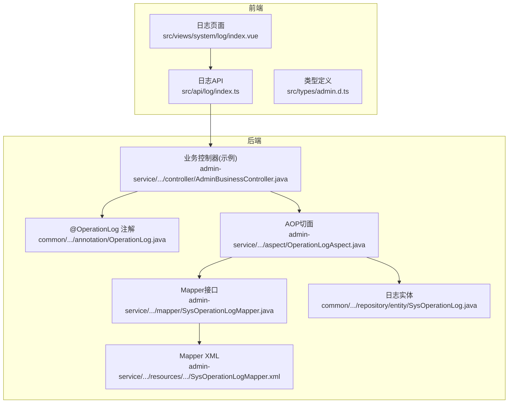
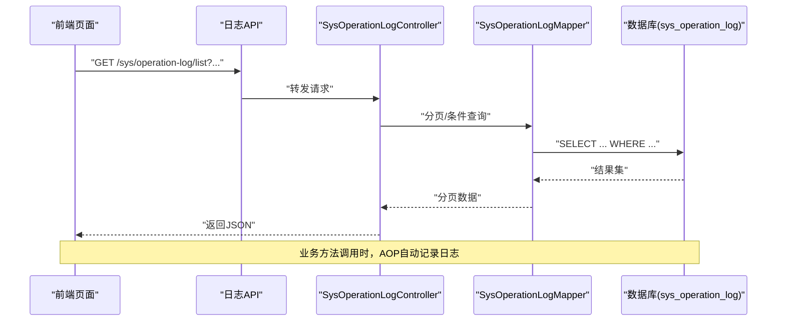
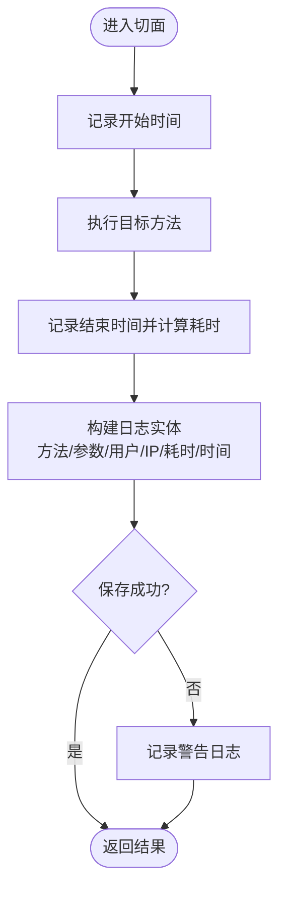
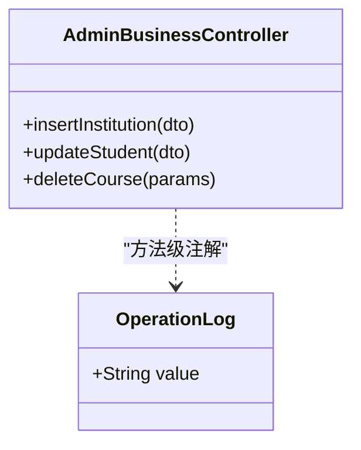
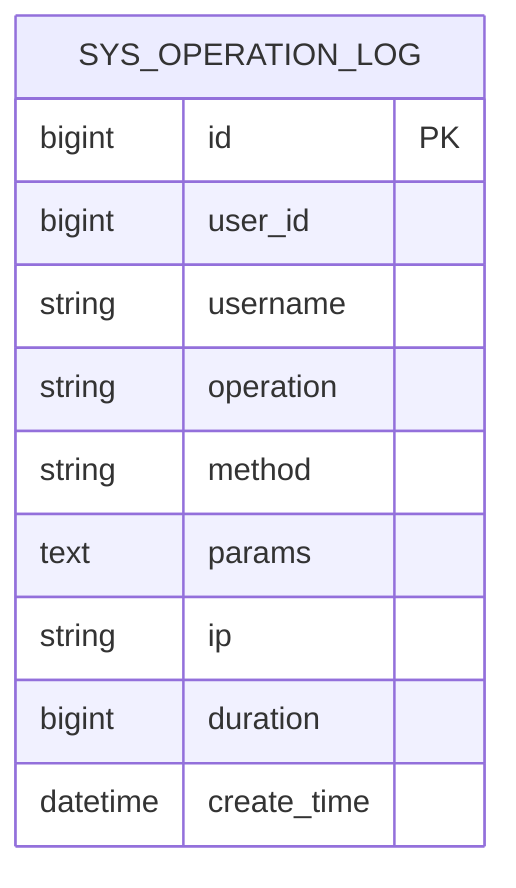
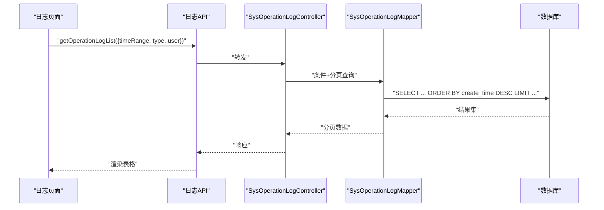
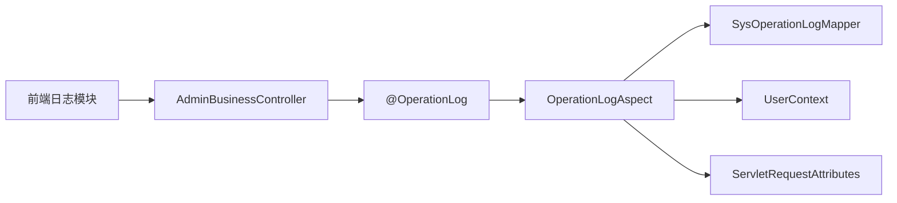

# 操作日志审计

<cite>
**本文引用的文件**
- [OperationLogAspect.java](file://class_times_record_back/admin-service/src/main/java/com/shiroko/aspect/OperationLogAspect.java)
- [OperationLog.java](file://class_times_record_back/common/src/main/java/com/shiroko/annotation/OperationLog.java)
- [SysOperationLog.java](file://class_times_record_back/common/src/main/java/com/shiroko/repository/entity/SysOperationLog.java)
- [AdminBusinessController.java](file://class_times_record_back/admin-service/src/main/java/com/shiroko/controller/AdminBusinessController.java)
- [SysOperationLogMapper.java](file://class_times_record_back/admin-service/src/main/java/com/shiroko/mapper/SysOperationLogMapper.java)
- [SysOperationLogMapper.xml](file://class_times_record_back/admin-service/src/main/resources/com/shiroko/mapper/SysOperationLogMapper.xml)
- [index.ts（前端日志API）](file://class_record_admin_front/src/api/log/index.ts)
- [index.vue（日志管理页面）](file://class_record_admin_front/src/views/system/log/index.vue)
- [admin.d.ts（前端类型定义）](file://class_record_admin_front/src/types/admin.d.ts)
- [CLAUDE.md（表命名约定）](file://CLAUDE.md)
</cite>

## 目录
1. [简介](#简介)
2. [项目结构](#项目结构)
3. [核心组件](#核心组件)
4. [架构总览](#架构总览)
5. [详细组件分析](#详细组件分析)
6. [依赖关系分析](#依赖关系分析)
7. [性能与存储优化](#性能与存储优化)
8. [故障排查指南](#故障排查指南)
9. [结论](#结论)
10. [附录](#附录)

## 简介
本文件围绕“操作日志审计”能力，系统性说明基于AOP的自动日志记录机制、日志实体设计与存储策略、查询与分析功能、清理归档机制以及自定义注解使用方式。目标是帮助开发者快速理解并扩展该能力，满足关键操作监控、安全审计与性能分析等需求。

## 项目结构
后端采用多模块结构，操作日志相关代码主要分布在：
- 通用层 common：包含注解、实体、枚举、工具等共享内容
- 管理服务 admin-service：包含切面、控制器、映射器及测试
- 前端管理端 class_record_admin_front：提供日志查询、删除、清空等界面与接口调用

图表来源
- [OperationLogAspect.java:1-87](file://class_times_record_back/admin-service/src/main/java/com/shiroko/aspect/OperationLogAspect.java#L1-L87)
- [OperationLog.java:1-13](file://class_times_record_back/common/src/main/java/com/shiroko/annotation/OperationLog.java#L1-L13)
- [SysOperationLog.java:1-38](file://class_times_record_back/common/src/main/java/com/shiroko/repository/entity/SysOperationLog.java#L1-L38)
- [AdminBusinessController.java:85-95](file://class_times_record_back/admin-service/src/main/java/com/shiroko/controller/AdminBusinessController.java#L85-L95)
- [SysOperationLogMapper.java:1-20](file://class_times_record_back/admin-service/src/main/java/com/shiroko/mapper/SysOperationLogMapper.java#L1-L20)
- [SysOperationLogMapper.xml:1-20](file://class_times_record_back/admin-service/src/main/resources/com/shiroko/mapper/SysOperationLogMapper.xml#L1-L20)
- [index.ts（前端日志API）:1-12](file://class_record_admin_front/src/api/log/index.ts#L1-L12)
- [index.vue（日志管理页面）:1-80](file://class_record_admin_front/src/views/system/log/index.vue#L1-L80)
- [admin.d.ts（前端类型定义）:50-210](file://class_record_admin_front/src/types/admin.d.ts#L50-L210)

章节来源
- [CLAUDE.md:75-120](file://CLAUDE.md#L75-L120)

## 核心组件
- AOP切面 OperationLogAspect：在标注了 @OperationLog 的方法执行前后进行拦截，采集方法名、参数、耗时、用户信息、IP等，并持久化到数据库。
- 注解 OperationLog：用于声明式标记需要审计的业务方法，value描述操作名称。
- 实体 SysOperationLog：对应 sys_operation_log 表，包含用户ID、用户名、操作描述、方法签名、请求参数、IP、耗时、创建时间等字段。
- Mapper SysOperationLogMapper：继承 MyBatis-Plus BaseMapper，提供基础CRUD；XML中可补充复杂查询。
- 控制器 AdminBusinessController：作为示例，多处方法标注 @OperationLog，触发自动日志记录。
- 前端日志模块：提供列表查询、单条删除、批量清空等操作。

章节来源
- [OperationLogAspect.java:28-85](file://class_times_record_back/admin-service/src/main/java/com/shiroko/aspect/OperationLogAspect.java#L28-L85)
- [OperationLog.java:8-12](file://class_times_record_back/common/src/main/java/com/shiroko/annotation/OperationLog.java#L8-L12)
- [SysOperationLog.java:12-37](file://class_times_record_back/common/src/main/java/com/shiroko/repository/entity/SysOperationLog.java#L12-L37)
- [SysOperationLogMapper.java:1-20](file://class_times_record_back/admin-service/src/main/java/com/shiroko/mapper/SysOperationLogMapper.java#L1-L20)
- [AdminBusinessController.java:85-95](file://class_times_record_back/admin-service/src/main/java/com/shiroko/controller/AdminBusinessController.java#L85-L95)
- [index.ts（前端日志API）:1-12](file://class_record_admin_front/src/api/log/index.ts#L1-L12)
- [index.vue（日志管理页面）:1-80](file://class_record_admin_front/src/views/system/log/index.vue#L1-L80)

## 架构总览
下图展示了从前端发起日志查询到后端返回数据的完整流程，以及业务方法被AOP拦截写入日志的流程。

图表来源
- [index.vue（日志管理页面）:20-40](file://class_record_admin_front/src/views/system/log/index.vue#L20-L40)
- [index.ts（前端日志API）:1-12](file://class_record_admin_front/src/api/log/index.ts#L1-L12)
- [SysOperationLogMapper.java:1-20](file://class_times_record_back/admin-service/src/main/java/com/shiroko/mapper/SysOperationLogMapper.java#L1-L20)
- [SysOperationLogMapper.xml:1-20](file://class_times_record_back/admin-service/src/main/resources/com/shiroko/mapper/SysOperationLogMapper.xml#L1-L20)

## 详细组件分析

### AOP切面：自动日志记录机制
- 切入点：@Around("@annotation(operationLog)")，仅对标注了 @OperationLog 的方法生效。
- 执行时序：
  - 记录开始时间
  - 执行目标方法 point.proceed()
  - 计算耗时 duration
  - 捕获异常：保存日志失败不影响主流程，仅告警
- 数据采集：
  - 方法签名：类名.方法名
  - 请求参数：取第一个参数并转字符串，超过阈值截断
  - 用户信息：从上下文获取 userId、username
  - 客户端IP：优先 X-Forwarded-For，其次 X-Real-IP，最后 remoteAddr
  - 耗时与创建时间
- 持久化：通过 SysOperationLogMapper.insert 写入 sys_operation_log

图表来源
- [OperationLogAspect.java:28-85](file://class_times_record_back/admin-service/src/main/java/com/shiroko/aspect/OperationLogAspect.java#L28-L85)

章节来源
- [OperationLogAspect.java:28-85](file://class_times_record_back/admin-service/src/main/java/com/shiroko/aspect/OperationLogAspect.java#L28-L85)

### 注解：@OperationLog
- 作用范围：方法级别
- 语义：value 为操作描述，便于审计展示
- 使用位置：典型在增删改等关键业务方法上

图表来源
- [OperationLog.java:8-12](file://class_times_record_back/common/src/main/java/com/shiroko/annotation/OperationLog.java#L8-L12)
- [AdminBusinessController.java:85-95](file://class_times_record_back/admin-service/src/main/java/com/shiroko/controller/AdminBusinessController.java#L85-L95)

章节来源
- [OperationLog.java:8-12](file://class_times_record_back/common/src/main/java/com/shiroko/annotation/OperationLog.java#L8-L12)
- [AdminBusinessController.java:85-95](file://class_times_record_back/admin-service/src/main/java/com/shiroko/controller/AdminBusinessController.java#L85-L95)

### 实体与表设计：sys_operation_log
- 字段说明：
  - id：自增主键
  - userId：操作用户ID
  - username：用户名
  - operation：操作描述（来自注解value）
  - method：方法签名
  - params：请求参数（已做长度截断）
  - ip：客户端IP
  - duration：耗时（毫秒）
  - createTime：创建时间
- 表命名约定：系统表以 sys_ 前缀，符合仓库规范

图表来源
- [SysOperationLog.java:12-37](file://class_times_record_back/common/src/main/java/com/shiroko/repository/entity/SysOperationLog.java#L12-L37)
- [CLAUDE.md:75-120](file://CLAUDE.md#L75-L120)

章节来源
- [SysOperationLog.java:12-37](file://class_times_record_back/common/src/main/java/com/shiroko/repository/entity/SysOperationLog.java#L12-L37)
- [CLAUDE.md:75-120](file://CLAUDE.md#L75-L120)

### 查询与分析：前端日志管理
- 列表查询：支持按时间范围、操作类型、用户等条件筛选（由前端传参，后端根据Mapper实现）
- 删除与清空：支持单条删除与全部清空，便于存储空间管理
- 类型定义：前端类型文件中定义了 SysOperationLogResponse、GetOperationLogListRequest/Response 等

图表来源
- [index.vue（日志管理页面）:20-40](file://class_record_admin_front/src/views/system/log/index.vue#L20-L40)
- [index.ts（前端日志API）:1-12](file://class_record_admin_front/src/api/log/index.ts#L1-L12)
- [SysOperationLogMapper.java:1-20](file://class_times_record_back/admin-service/src/main/java/com/shiroko/mapper/SysOperationLogMapper.java#L1-L20)
- [SysOperationLogMapper.xml:1-20](file://class_times_record_back/admin-service/src/main/resources/com/shiroko/mapper/SysOperationLogMapper.xml#L1-L20)
- [admin.d.ts（前端类型定义）:197-210](file://class_record_admin_front/src/types/admin.d.ts#L197-L210)

章节来源
- [index.vue（日志管理页面）:20-40](file://class_record_admin_front/src/views/system/log/index.vue#L20-L40)
- [index.ts（前端日志API）:1-12](file://class_record_admin_front/src/api/log/index.ts#L1-L12)
- [admin.d.ts（前端类型定义）:52-210](file://class_record_admin_front/src/types/admin.d.ts#L52-L210)

### 清理与归档机制
- 单条删除：通过 deleteOperationLog(id) 删除指定日志
- 批量清空：clearOperationLogs() 清空所有日志
- 建议策略：
  - 保留周期：生产环境建议保留90天，合规要求可按需调整
  - 归档方案：将历史数据迁移至冷存储或独立库，定期任务执行
  - 空间治理：结合索引与分区，避免全表扫描导致性能问题

章节来源
- [index.ts（前端日志API）:6-12](file://class_record_admin_front/src/api/log/index.ts#L6-L12)
- [index.vue（日志管理页面）:61-73](file://class_record_admin_front/src/views/system/log/index.vue#L61-L73)

## 依赖关系分析
- 切面依赖：
  - 注解 @OperationLog：决定哪些方法需要记录
  - UserContext：获取当前用户信息
  - SysOperationLogMapper：持久化日志
  - ServletRequestAttributes：获取HTTP请求上下文（IP等）
- 控制器与切面：
  - 业务方法标注 @OperationLog 后，由切面统一处理，无需侵入业务逻辑
- 前端与后端：
  - 前端通过日志API访问后端控制器，完成查询、删除、清空等操作

图表来源
- [OperationLogAspect.java:1-27](file://class_times_record_back/admin-service/src/main/java/com/shiroko/aspect/OperationLogAspect.java#L1-L27)
- [OperationLog.java:8-12](file://class_times_record_back/common/src/main/java/com/shiroko/annotation/OperationLog.java#L8-L12)
- [SysOperationLogMapper.java:1-20](file://class_times_record_back/admin-service/src/main/java/com/shiroko/mapper/SysOperationLogMapper.java#L1-L20)
- [AdminBusinessController.java:85-95](file://class_times_record_back/admin-service/src/main/java/com/shiroko/controller/AdminBusinessController.java#L85-L95)
- [index.ts（前端日志API）:1-12](file://class_record_admin_front/src/api/log/index.ts#L1-L12)

章节来源
- [OperationLogAspect.java:1-27](file://class_times_record_back/admin-service/src/main/java/com/shiroko/aspect/OperationLogAspect.java#L1-L27)
- [SysOperationLogMapper.java:1-20](file://class_times_record_back/admin-service/src/main/java/com/shiroko/mapper/SysOperationLogMapper.java#L1-L20)
- [AdminBusinessController.java:85-95](file://class_times_record_back/admin-service/src/main/java/com/shiroko/controller/AdminBusinessController.java#L85-L95)
- [index.ts（前端日志API）:1-12](file://class_record_admin_front/src/api/log/index.ts#L1-L12)

## 性能与存储优化
- 参数截断：请求参数超过阈值时截断，避免大对象写入影响性能与存储
- 异步落盘：可将日志写入改为异步队列，降低主流程延迟
- 索引建议：
  - 复合索引：user_id + create_time（高频按用户和时间范围查询）
  - 索引：create_time（时间范围排序与分页）
  - 可选索引：operation（按操作类型筛选）
- 分区策略：按月份或季度对 sys_operation_log 进行表分区，提升查询与维护效率
- 冷热分离：热数据保留短期，历史数据归档至低成本存储

[本节为通用指导，不直接分析具体文件]

## 故障排查指南
- 日志未记录：
  - 确认方法是否标注 @OperationLog
  - 检查切面是否启用（Spring AOP配置）
  - 查看切面异常告警日志（保存失败不影响主流程）
- IP为空或不正确：
  - 检查网关/反向代理是否正确传递 X-Forwarded-For/X-Real-IP
- 参数过长：
  - 确认参数截断阈值是否符合预期
- 查询缓慢：
  - 检查是否存在合适的索引
  - 评估是否需要分页与时间范围限制
  - 考虑分区与归档

章节来源
- [OperationLogAspect.java:36-43](file://class_times_record_back/admin-service/src/main/java/com/shiroko/aspect/OperationLogAspect.java#L36-L43)
- [OperationLogAspect.java:67-79](file://class_times_record_back/admin-service/src/main/java/com/shiroko/aspect/OperationLogAspect.java#L67-L79)

## 结论
本项目通过AOP切面实现了非侵入式的操作日志审计，覆盖关键业务方法，具备参数捕获、耗时统计、用户与IP记录等能力。配合前端日志管理模块，可实现时间范围筛选、操作分类与用户行为追踪。建议在生产环境引入索引优化、分区与归档策略，并结合异步落盘进一步提升性能与稳定性。

[本节为总结性内容，不直接分析具体文件]

## 附录

### 自定义日志记录示例（使用 @OperationLog）
- 在需要审计的控制器方法上添加 @OperationLog("操作描述")
- 示例参考路径：
  - [AdminBusinessController.java:85-95](file://class_times_record_back/admin-service/src/main/java/com/shiroko/controller/AdminBusinessController.java#L85-L95)
  - [AdminBusinessController.java:100-115](file://class_times_record_back/admin-service/src/main/java/com/shiroko/controller/AdminBusinessController.java#L100-L115)
  - [AdminBusinessController.java:120-135](file://class_times_record_back/admin-service/src/main/java/com/shiroko/controller/AdminBusinessController.java#L120-L135)
  - [AdminBusinessController.java:140-155](file://class_times_record_back/admin-service/src/main/java/com/shiroko/controller/AdminBusinessController.java#L140-L155)
  - [AdminBusinessController.java:160-175](file://class_times_record_back/admin-service/src/main/java/com/shiroko/controller/AdminBusinessController.java#L160-L175)
  - [AdminBusinessController.java:183-192](file://class_times_record_back/admin-service/src/main/java/com/shiroko/controller/AdminBusinessController.java#L183-L192)
  - [AdminBusinessController.java:197-200](file://class_times_record_back/admin-service/src/main/java/com/shiroko/controller/AdminBusinessController.java#L197-L200)
  - [AdminBusinessController.java:205-220](file://class_times_record_back/admin-service/src/main/java/com/shiroko/controller/AdminBusinessController.java#L205-L220)
  - [AdminBusinessController.java:225-228](file://class_times_record_back/admin-service/src/main/java/com/shiroko/controller/AdminBusinessController.java#L225-L228)
  - [AdminBusinessController.java:238-253](file://class_times_record_back/admin-service/src/main/java/com/shiroko/controller/AdminBusinessController.java#L238-L253)

章节来源
- [AdminBusinessController.java:85-95](file://class_times_record_back/admin-service/src/main/java/com/shiroko/controller/AdminBusinessController.java#L85-L95)
- [AdminBusinessController.java:100-115](file://class_times_record_back/admin-service/src/main/java/com/shiroko/controller/AdminBusinessController.java#L100-L115)
- [AdminBusinessController.java:120-135](file://class_times_record_back/admin-service/src/main/java/com/shiroko/controller/AdminBusinessController.java#L120-L135)
- [AdminBusinessController.java:140-155](file://class_times_record_back/admin-service/src/main/java/com/shiroko/controller/AdminBusinessController.java#L140-L155)
- [AdminBusinessController.java:160-175](file://class_times_record_back/admin-service/src/main/java/com/shiroko/controller/AdminBusinessController.java#L160-L175)
- [AdminBusinessController.java:183-192](file://class_times_record_back/admin-service/src/main/java/com/shiroko/controller/AdminBusinessController.java#L183-L192)
- [AdminBusinessController.java:197-200](file://class_times_record_back/admin-service/src/main/java/com/shiroko/controller/AdminBusinessController.java#L197-L200)
- [AdminBusinessController.java:205-220](file://class_times_record_back/admin-service/src/main/java/com/shiroko/controller/AdminBusinessController.java#L205-L220)
- [AdminBusinessController.java:225-228](file://class_times_record_back/admin-service/src/main/java/com/shiroko/controller/AdminBusinessController.java#L225-L228)
- [AdminBusinessController.java:238-253](file://class_times_record_back/admin-service/src/main/java/com/shiroko/controller/AdminBusinessController.java#L238-L253)

### 日志分析最佳实践
- 关键操作监控：对新增、更新、删除等敏感操作强制标注 @OperationLog
- 安全审计：结合用户ID、IP、时间范围进行异常行为检测
- 性能分析：关注 duration 字段，定位慢操作并进行优化
- 报表与告警：基于日志数据进行趋势分析与阈值告警

[本节为通用指导，不直接分析具体文件]