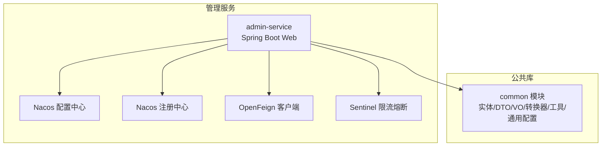
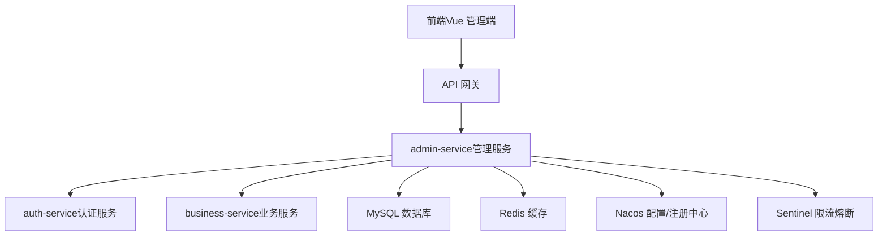
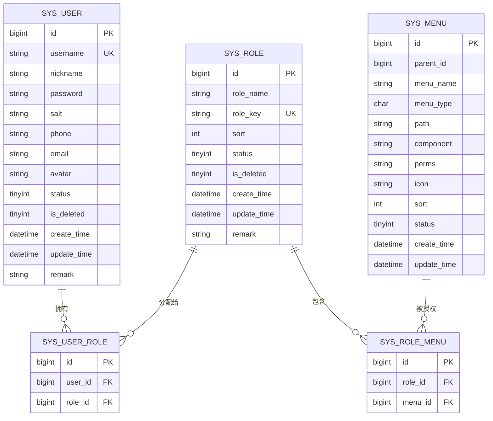
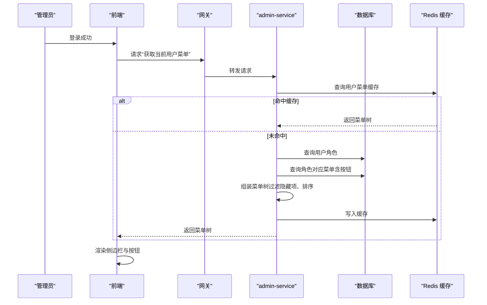
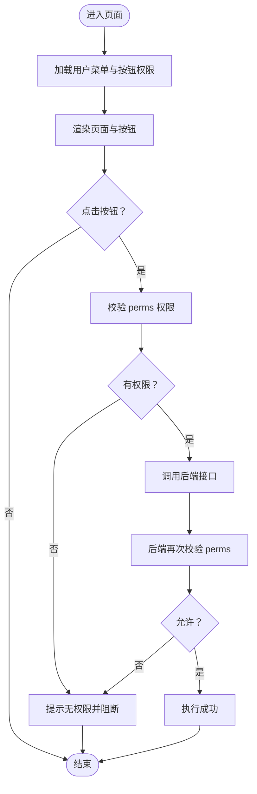
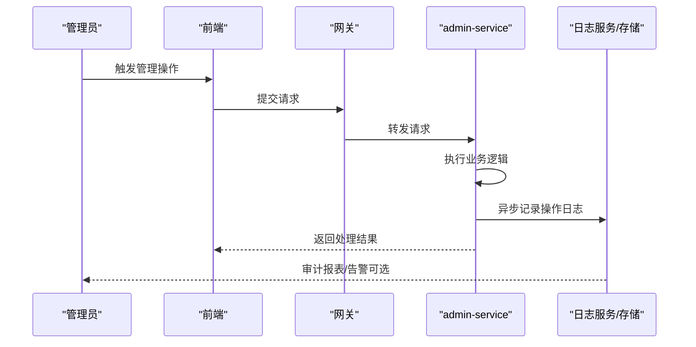
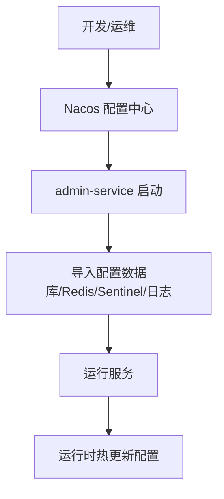
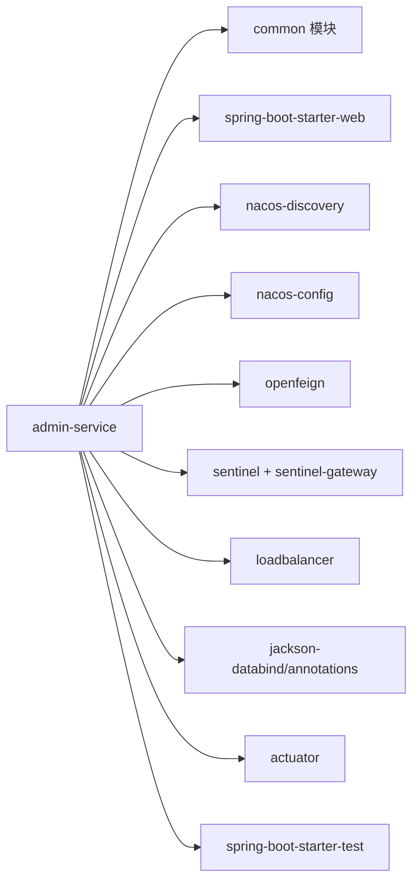

# 管理服务 (admin-service)

<cite>
**本文引用的文件**
- [pom.xml](file://class_times_record_back/admin-service/pom.xml)
- [application.yml](file://class_times_record_back/admin-service/src/main/resources/application.yml)
- [class_times_record.sql](file://class_times_record_back/docs/class_times_record.sql)
</cite>

## 目录
1. [简介](#简介)
2. [项目结构](#项目结构)
3. [核心组件](#核心组件)
4. [架构总览](#架构总览)
5. [详细组件分析](#详细组件分析)
6. [依赖分析](#依赖分析)
7. [性能考虑](#性能考虑)
8. [故障排查指南](#故障排查指南)
9. [结论](#结论)
10. [附录](#附录)

## 简介
本文件面向“管理服务（admin-service）”的管理能力，围绕系统用户管理、角色权限管理、菜单权限控制、操作日志审计与系统配置管理等核心功能进行系统化说明。重点阐述 RBAC 权限模型在系统中的落地方案，包括用户-角色-权限的多对多关系设计；解释动态菜单生成与按钮级权限控制的实现机制；介绍操作日志的记录与分析思路；并提供权限控制流程图与管理界面交互示例，为管理员提供配置指南，为开发者提供扩展规范。

## 项目结构
admin-service 作为后台管理微服务，采用 Spring Boot + Nacos + OpenFeign + Sentinel 的微服务技术栈，通过 common 模块共享实体、DTO/VO、转换器、通用配置与工具类。服务启动时从 Nacos 拉取应用配置、数据库连接、Redis 缓存、Sentinel 限流与日志配置等。

图表来源
- [pom.xml:1-95](file://class_times_record_back/admin-service/pom.xml#L1-L95)
- [application.yml:1-23](file://class_times_record_back/admin-service/src/main/resources/application.yml#L1-L23)

章节来源
- [pom.xml:1-95](file://class_times_record_back/admin-service/pom.xml#L1-L95)
- [application.yml:1-23](file://class_times_record_back/admin-service/src/main/resources/application.yml#L1-L23)

## 核心组件
- 用户管理：基于 sys_user 表，支持账号、昵称、联系方式、头像、状态、逻辑删除与备注等字段维护。
- 角色管理：基于 sys_role 表，支持角色名称、角色键（唯一）、排序、状态、逻辑删除与备注。
- 菜单与权限：基于 sys_menu 表，支持目录/菜单/按钮三种类型，包含路由地址、组件路径、权限标识、图标、排序与显示状态。
- 关联关系：sys_user_role 维护用户-角色多对多；sys_role_menu 维护角色-菜单多对多。
- 操作日志：结合 common 模块的切面与拦截器能力，记录关键操作的上下文信息，便于审计与回溯。
- 系统配置：通过 Nacos 集中管理数据库、Redis、Sentinel、日志等配置项，支持热更新。

章节来源
- [class_times_record.sql:319-406](file://class_times_record_back/docs/class_times_record.sql#L319-L406)

## 架构总览
下图展示 admin-service 在整体微服务中的位置与交互：前端调用网关进入 admin-service，服务通过 OpenFeign 访问其他业务服务，使用 Redis 做缓存，使用 Nacos 获取配置并注册服务，使用 Sentinel 进行流量治理。

图表来源
- [pom.xml:1-95](file://class_times_record_back/admin-service/pom.xml#L1-L95)
- [application.yml:1-23](file://class_times_record_back/admin-service/src/main/resources/application.yml#L1-L23)

## 详细组件分析

### RBAC 权限模型与数据模型
RBAC 的核心是“用户-角色-权限”的多对多关系。在本系统中：
- 用户与角色：sys_user 与 sys_role 通过 sys_user_role 建立多对多关系。
- 角色与菜单（含按钮）：sys_role 与 sys_menu 通过 sys_role_menu 建立多对多关系。
- 菜单类型：M（目录）、C（菜单）、F（按钮/权限点），其中 F 类型用于按钮级权限控制。

图表来源
- [class_times_record.sql:319-406](file://class_times_record_back/docs/class_times_record.sql#L319-L406)

章节来源
- [class_times_record.sql:319-406](file://class_times_record_back/docs/class_times_record.sql#L319-L406)

### 动态菜单生成流程
动态菜单由后端根据当前登录用户的角色集合，聚合其可访问的菜单树（含目录、菜单、按钮），返回给前端渲染。典型流程如下：

图表来源
- [class_times_record.sql:319-406](file://class_times_record_back/docs/class_times_record.sql#L319-L406)

章节来源
- [class_times_record.sql:319-406](file://class_times_record_back/docs/class_times_record.sql#L319-L406)

### 按钮级权限控制流程
按钮级权限以菜单的 perms 标识为核心，前后端协同控制：
- 后端：接口层校验当前用户是否具备相应 perms，拒绝无权限访问。
- 前端：根据用户菜单树中的按钮权限集合，控制按钮显隐或禁用。

图表来源
- [class_times_record.sql:319-406](file://class_times_record_back/docs/class_times_record.sql#L319-L406)

章节来源
- [class_times_record.sql:319-406](file://class_times_record_back/docs/class_times_record.sql#L319-L406)

### 操作日志审计
操作日志旨在记录关键管理行为的上下文，便于审计与问题定位。建议覆盖以下维度：
- 事件分类：用户管理、角色管理、菜单管理、配置变更等。
- 上下文信息：操作人、IP、UA、请求路径、参数摘要、结果状态、耗时。
- 存储策略：按时间分片存储，保留周期策略化，支持检索与导出。
- 性能优化：异步落盘、批量写入、热点字段索引。

[本节为概念性流程，不直接映射具体源码文件]

### 系统配置管理
- 配置来源：Nacos 配置中心，按命名空间与分组隔离环境。
- 配置项：数据库连接、Redis 连接、Sentinel 规则、日志级别等。
- 热更新：通过 refresh=true 实现运行时刷新，无需重启服务。
- 最佳实践：敏感信息加密、版本化管理、灰度发布。

图表来源
- [application.yml:1-23](file://class_times_record_back/admin-service/src/main/resources/application.yml#L1-L23)

章节来源
- [application.yml:1-23](file://class_times_record_back/admin-service/src/main/resources/application.yml#L1-L23)

## 依赖分析
admin-service 的依赖主要来源于 common 模块与 Spring Cloud 生态组件，包括 Web、Nacos 发现与配置、OpenFeign、Sentinel、LoadBalancer、Jackson、Actuator 与测试套件。

图表来源
- [pom.xml:1-95](file://class_times_record_back/admin-service/pom.xml#L1-L95)

章节来源
- [pom.xml:1-95](file://class_times_record_back/admin-service/pom.xml#L1-L95)

## 性能考虑
- 菜单与权限缓存：将用户菜单树与按钮权限集缓存至 Redis，降低重复查询压力。
- 接口幂等与防重放：结合 nonce 与签名校验，避免重复提交。
- 日志异步化：操作日志采用异步写入，减少主链路延迟。
- 限流与熔断：通过 Sentinel 对关键接口进行限流与降级保护。
- 数据库索引：针对高频查询字段（如用户名、角色键、菜单父级）建立合适索引。

[本节为通用性能建议，不直接分析具体源码文件]

## 故障排查指南
- 配置加载失败：检查 Nacos 地址、命名空间与分组是否正确，确认配置文件存在且格式合法。
- 菜单为空：核对用户是否已分配角色，角色是否绑定菜单，菜单是否设置为可见。
- 按钮不可用：确认 perms 标识是否与菜单定义一致，前端权限集合是否同步更新。
- 日志缺失：检查日志配置与异步队列是否正常，确认日志存储可用。
- 限流触发：查看 Sentinel 控制台，调整阈值或扩容实例。

章节来源
- [application.yml:1-23](file://class_times_record_back/admin-service/src/main/resources/application.yml#L1-L23)

## 结论
admin-service 以 RBAC 为核心，通过 sys_user、sys_role、sys_menu 及其关联表构建灵活的权限体系，配合动态菜单与按钮级权限控制，满足复杂管理场景。借助 Nacos 统一配置、Redis 缓存与 Sentinel 治理，系统在可扩展性与稳定性方面具备良好的基础。建议在后续迭代中完善操作日志审计与权限变更追踪，进一步提升可观测性与合规性。

## 附录

### 管理员配置指南
- 创建角色：在角色管理中新增角色，设置角色键与排序。
- 分配菜单：为角色勾选所需菜单与按钮，注意区分目录/菜单/按钮类型。
- 分配用户：为用户分配一个或多个角色，确保最小权限原则。
- 配置系统：在 Nacos 中维护数据库、Redis、Sentinel 与日志配置，启用热更新。

### 开发者扩展规范
- 新增菜单：在菜单表中添加条目，设置 menu_type、path、component、perms 与排序。
- 新增按钮权限：为现有菜单增加 F 类型子项，定义唯一 perms 标识。
- 接口鉴权：在后端接口处校验 perms，拒绝无权限访问。
- 前端集成：根据用户菜单树渲染按钮，并在点击前进行权限判断。
- 日志埋点：在关键业务方法上记录操作日志，包含必要上下文。