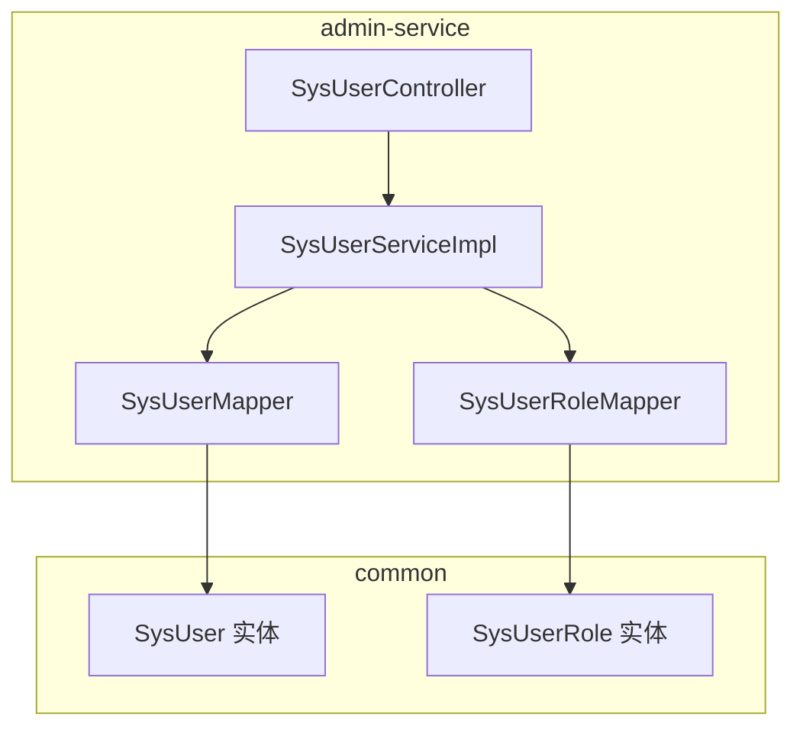
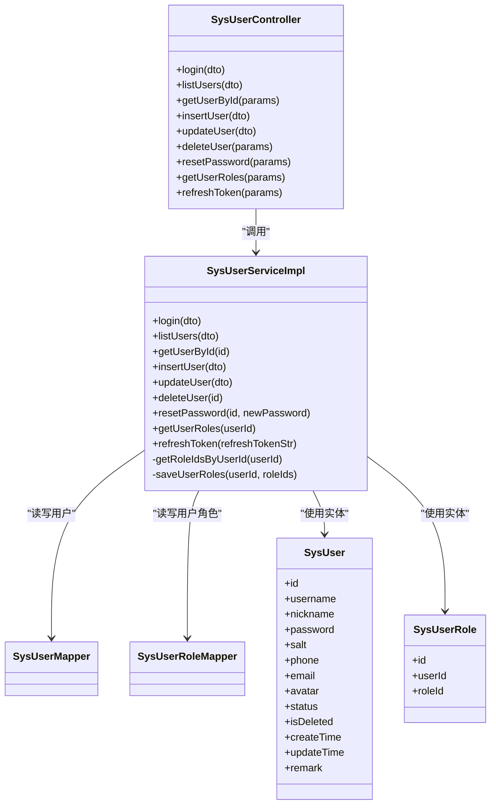
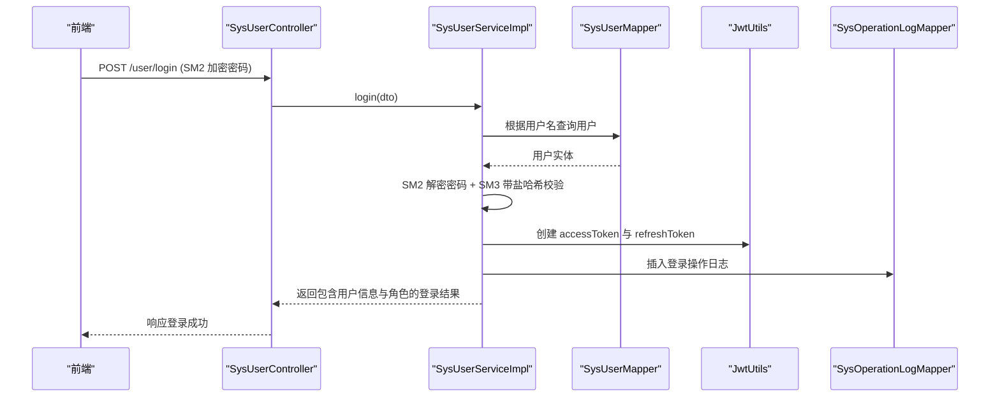
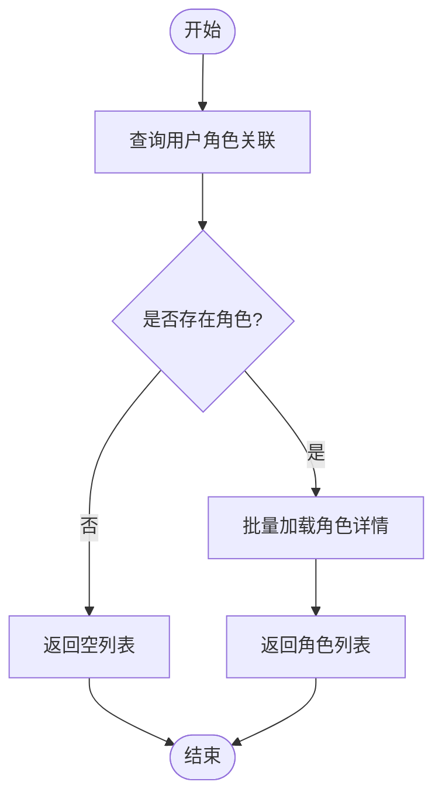
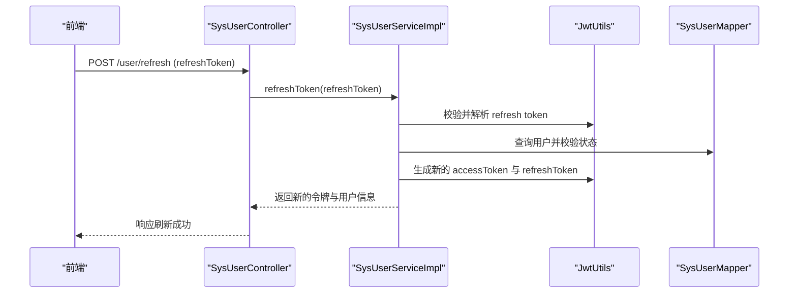
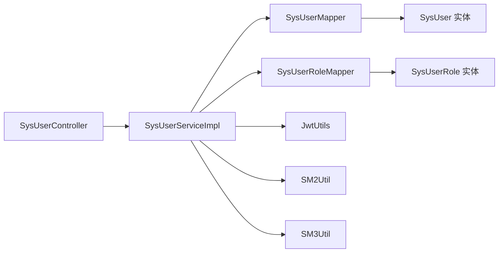

# 系统用户管理

<cite>
**本文引用的文件**
- [SysUser.java](file://class_times_record_back/common/src/main/java/com/shiroko/repository/entity/SysUser.java)
- [SysUserRole.java](file://class_times_record_back/common/src/main/java/com/shiroko/repository/entity/SysUserRole.java)
- [SysUserController.java](file://class_times_record_back/admin-service/src/main/java/com/shiroko/controller/SysUserController.java)
- [SysUserServiceImpl.java](file://class_times_record_back/admin-service/src/main/java/com/shiroko/service/impl/SysUserServiceImpl.java)
- [SysUserMapper.java](file://class_times_record_back/admin-service/src/main/java/com/shiroko/mapper/SysUserMapper.java)
- [SysUserRoleMapper.java](file://class_times_record_back/admin-service/src/main/java/com/shiroko/mapper/SysUserRoleMapper.java)
</cite>

## 目录
1. [简介](#简介)
2. [项目结构](#项目结构)
3. [核心组件](#核心组件)
4. [架构总览](#架构总览)
5. [详细组件分析](#详细组件分析)
6. [依赖关系分析](#依赖关系分析)
7. [性能考虑](#性能考虑)
8. [故障排查指南](#故障排查指南)
9. [结论](#结论)
10. [附录](#附录)

## 简介
本文件面向管理员用户的完整生命周期管理，覆盖用户注册、登录认证、信息维护、状态管理等核心能力；详细说明用户实体设计（sys_user 表结构与字段含义）、登录流程实现机制（密码加密验证、Token 生成与刷新、会话管理）、用户权限继承机制（用户与角色关联）；并提供用户管理的 CRUD 操作示例、批量操作方法建议以及数据导入导出思路。同时给出安全策略配置指南，包括密码策略、账户锁定等安全措施建议。

## 项目结构
后端采用分层架构：Controller 暴露 REST API，Service 承载业务逻辑，Mapper 对接数据库。用户管理相关代码主要分布在 admin-service 模块的 controller、service、mapper 层，以及 common 模块中的实体定义。

图表来源
- [SysUserController.java:1-79](file://class_times_record_back/admin-service/src/main/java/com/shiroko/controller/SysUserController.java#L1-L79)
- [SysUserServiceImpl.java:1-294](file://class_times_record_back/admin-service/src/main/java/com/shiroko/service/impl/SysUserServiceImpl.java#L1-L294)
- [SysUserMapper.java:1-8](file://class_times_record_back/admin-service/src/main/java/com/shiroko/mapper/SysUserMapper.java#L1-L8)
- [SysUserRoleMapper.java:1-8](file://class_times_record_back/admin-service/src/main/java/com/shiroko/mapper/SysUserRoleMapper.java#L1-L8)
- [SysUser.java:1-50](file://class_times_record_back/common/src/main/java/com/shiroko/repository/entity/SysUser.java#L1-L50)
- [SysUserRole.java:1-28](file://class_times_record_back/common/src/main/java/com/shiroko/repository/entity/SysUserRole.java#L1-L28)

章节来源
- [SysUserController.java:1-79](file://class_times_record_back/admin-service/src/main/java/com/shiroko/controller/SysUserController.java#L1-L79)
- [SysUserServiceImpl.java:1-294](file://class_times_record_back/admin-service/src/main/java/com/shiroko/service/impl/SysUserServiceImpl.java#L1-L294)
- [SysUserMapper.java:1-8](file://class_times_record_back/admin-service/src/main/java/com/shiroko/mapper/SysUserMapper.java#L1-L8)
- [SysUserRoleMapper.java:1-8](file://class_times_record_back/admin-service/src/main/java/com/shiroko/mapper/SysUserRoleMapper.java#L1-L8)
- [SysUser.java:1-50](file://class_times_record_back/common/src/main/java/com/shiroko/repository/entity/SysUser.java#L1-L50)
- [SysUserRole.java:1-28](file://class_times_record_back/common/src/main/java/com/shiroko/repository/entity/SysUserRole.java#L1-L28)

## 核心组件
- 控制器层：提供用户登录、列表查询、按 ID 获取、新增、更新、删除、重置密码、获取角色、刷新 Token 等接口。
- 服务层：实现登录校验（SM2 解密 + SM3 带盐哈希）、分页查询、CRUD、角色分配与读取、Token 刷新、操作日志记录等。
- 数据访问层：基于 MyBatis-Plus 的 BaseMapper，提供基础 CRUD 与分页查询能力。
- 实体模型：用户主表 sys_user 与用户角色关联表 sys_user_role。

章节来源
- [SysUserController.java:1-79](file://class_times_record_back/admin-service/src/main/java/com/shiroko/controller/SysUserController.java#L1-L79)
- [SysUserServiceImpl.java:1-294](file://class_times_record_back/admin-service/src/main/java/com/shiroko/service/impl/SysUserServiceImpl.java#L1-L294)
- [SysUserMapper.java:1-8](file://class_times_record_back/admin-service/src/main/java/com/shiroko/mapper/SysUserMapper.java#L1-L8)
- [SysUserRoleMapper.java:1-8](file://class_times_record_back/admin-service/src/main/java/com/shiroko/mapper/SysUserRoleMapper.java#L1-L8)
- [SysUser.java:1-50](file://class_times_record_back/common/src/main/java/com/shiroko/repository/entity/SysUser.java#L1-L50)
- [SysUserRole.java:1-28](file://class_times_record_back/common/src/main/java/com/shiroko/repository/entity/SysUserRole.java#L1-L28)

## 架构总览
下图展示了用户管理在控制层与服务层的交互关系，以及与数据实体的映射。

图表来源
- [SysUserController.java:1-79](file://class_times_record_back/admin-service/src/main/java/com/shiroko/controller/SysUserController.java#L1-L79)
- [SysUserServiceImpl.java:1-294](file://class_times_record_back/admin-service/src/main/java/com/shiroko/service/impl/SysUserServiceImpl.java#L1-L294)
- [SysUserMapper.java:1-8](file://class_times_record_back/admin-service/src/main/java/com/shiroko/mapper/SysUserMapper.java#L1-L8)
- [SysUserRoleMapper.java:1-8](file://class_times_record_back/admin-service/src/main/java/com/shiroko/mapper/SysUserRoleMapper.java#L1-L8)
- [SysUser.java:1-50](file://class_times_record_back/common/src/main/java/com/shiroko/repository/entity/SysUser.java#L1-L50)
- [SysUserRole.java:1-28](file://class_times_record_back/common/src/main/java/com/shiroko/repository/entity/SysUserRole.java#L1-L28)

## 详细组件分析

### 用户实体设计与表结构
- 用户主表 sys_user
  - id：自增主键
  - username：用户名（唯一性校验在服务层进行）
  - nickname：昵称
  - password：存储 SM3 带盐哈希值
  - salt：随机盐值
  - phone：手机号
  - email：邮箱
  - avatar：头像地址
  - status：状态（1 启用，其他禁用）
  - isDeleted：逻辑删除标记
  - createTime / updateTime：时间戳
  - remark：备注
- 用户角色关联表 sys_user_role
  - id：自增主键
  - user_id：用户 ID
  - role_id：角色 ID

章节来源
- [SysUser.java:1-50](file://class_times_record_back/common/src/main/java/com/shiroko/repository/entity/SysUser.java#L1-L50)
- [SysUserRole.java:1-28](file://class_times_record_back/common/src/main/java/com/shiroko/repository/entity/SysUserRole.java#L1-L28)

### 登录认证流程（含密码加密与 Token 管理）
- 前端通过 SM2 公钥对密码加密后提交。
- 服务端使用配置的 SM2 私钥解密明文密码。
- 使用 SM3 对用户输入密码与用户盐值进行哈希比对。
- 校验通过后生成 access token 与 refresh token，并返回用户信息与角色 ID 集合。
- 登录成功后记录操作日志。
- 支持通过 refresh token 刷新 access token。

图表来源
- [SysUserController.java:30-34](file://class_times_record_back/admin-service/src/main/java/com/shiroko/controller/SysUserController.java#L30-L34)
- [SysUserServiceImpl.java:53-88](file://class_times_record_back/admin-service/src/main/java/com/shiroko/service/impl/SysUserServiceImpl.java#L53-L88)

章节来源
- [SysUserController.java:30-34](file://class_times_record_back/admin-service/src/main/java/com/shiroko/controller/SysUserController.java#L30-L34)
- [SysUserServiceImpl.java:53-88](file://class_times_record_back/admin-service/src/main/java/com/shiroko/service/impl/SysUserServiceImpl.java#L53-L88)

### 用户信息查询与分页
- 支持按用户名、手机号模糊匹配，按状态精确过滤，默认按创建时间倒序。
- 返回分页数据，包含 list、total、currentPage、pageSize。
- 每条用户记录附带角色 ID 列表。

章节来源
- [SysUserController.java:36-39](file://class_times_record_back/admin-service/src/main/java/com/shiroko/controller/SysUserController.java#L36-L39)
- [SysUserServiceImpl.java:91-121](file://class_times_record_back/admin-service/src/main/java/com/shiroko/service/impl/SysUserServiceImpl.java#L91-L121)

### 用户新增与更新（含角色分配）
- 新增时检查用户名唯一性，使用 SM2 解密 + SM3 带盐哈希存储密码，并生成新盐值。
- 新增后可批量分配角色。
- 更新时仅更新非空字段，若传入角色列表则先清空再重新分配。
- 返回对象中包含当前角色 ID 列表。

章节来源
- [SysUserController.java:46-54](file://class_times_record_back/admin-service/src/main/java/com/shiroko/controller/SysUserController.java#L46-L54)
- [SysUserServiceImpl.java:135-209](file://class_times_record_back/admin-service/src/main/java/com/shiroko/service/impl/SysUserServiceImpl.java#L135-L209)

### 用户删除与密码重置
- 删除为物理删除（基于 Mapper deleteById）。
- 重置密码使用 SM2 解密新密码，再生成新盐值并以 SM3 带盐哈希存储。

章节来源
- [SysUserController.java:56-67](file://class_times_record_back/admin-service/src/main/java/com/shiroko/controller/SysUserController.java#L56-L67)
- [SysUserServiceImpl.java:211-234](file://class_times_record_back/admin-service/src/main/java/com/shiroko/service/impl/SysUserServiceImpl.java#L211-L234)

### 用户角色与权限继承
- 用户与角色多对多通过 sys_user_role 关联。
- 获取用户角色时，先查用户角色关联，再批量查询角色详情。
- 登录与刷新 Token 时均会回填用户角色 ID 列表，便于前端权限渲染。

图表来源
- [SysUserServiceImpl.java:237-247](file://class_times_record_back/admin-service/src/main/java/com/shiroko/service/impl/SysUserServiceImpl.java#L237-L247)
- [SysUserRole.java:1-28](file://class_times_record_back/common/src/main/java/com/shiroko/repository/entity/SysUserRole.java#L1-L28)

章节来源
- [SysUserController.java:69-72](file://class_times_record_back/admin-service/src/main/java/com/shiroko/controller/SysUserController.java#L69-L72)
- [SysUserServiceImpl.java:237-247](file://class_times_record_back/admin-service/src/main/java/com/shiroko/service/impl/SysUserServiceImpl.java#L237-L247)

### Token 刷新流程
- 校验 refresh token 有效性并解析用户信息。
- 再次校验用户存在且处于启用状态。
- 生成新的 access token 与 refresh token，并返回用户信息与角色列表。

图表来源
- [SysUserController.java:74-77](file://class_times_record_back/admin-service/src/main/java/com/shiroko/controller/SysUserController.java#L74-L77)
- [SysUserServiceImpl.java:250-276](file://class_times_record_back/admin-service/src/main/java/com/shiroko/service/impl/SysUserServiceImpl.java#L250-L276)

章节来源
- [SysUserController.java:74-77](file://class_times_record_back/admin-service/src/main/java/com/shiroko/controller/SysUserController.java#L74-L77)
- [SysUserServiceImpl.java:250-276](file://class_times_record_back/admin-service/src/main/java/com/shiroko/service/impl/SysUserServiceImpl.java#L250-L276)

### 用户管理 CRUD 操作示例（API 参考）
- 登录：POST /user/login
- 列表查询：POST /user/list
- 按 ID 获取：POST /user/get_by_id
- 新增用户：POST /user/insert
- 更新用户：POST /user/update
- 删除用户：POST /user/delete
- 重置密码：POST /user/reset_password
- 获取用户角色：POST /user/get_roles
- 刷新 Token：POST /user/refresh

章节来源
- [SysUserController.java:30-77](file://class_times_record_back/admin-service/src/main/java/com/shiroko/controller/SysUserController.java#L30-L77)

### 批量操作与数据导入导出（建议方案）
- 批量分配角色：在服务层增加批量写入方法，循环或批量插入 sys_user_role。
- 批量启用/禁用：扩展更新接口，支持传入用户 ID 列表与目标状态，事务内批量更新。
- 数据导入：提供 CSV/Excel 模板下载，服务端解析并逐条校验（用户名唯一、状态合法），失败行记录错误明细。
- 数据导出：按查询条件导出用户列表（可包含角色名称），避免导出敏感字段（如密码、盐）。

[本节为通用建议，不直接分析具体文件]

## 依赖关系分析
- 控制器依赖服务层，服务层依赖 Mapper 与工具类（JWT、SM2/SM3）。
- 实体与 Mapper 一一对应，遵循 MyBatis-Plus 约定。
- 角色查询涉及用户角色关联表与角色表（角色实体由服务层注入的 RoleMapper 提供）。

图表来源
- [SysUserController.java:1-79](file://class_times_record_back/admin-service/src/main/java/com/shiroko/controller/SysUserController.java#L1-L79)
- [SysUserServiceImpl.java:1-294](file://class_times_record_back/admin-service/src/main/java/com/shiroko/service/impl/SysUserServiceImpl.java#L1-L294)
- [SysUserMapper.java:1-8](file://class_times_record_back/admin-service/src/main/java/com/shiroko/mapper/SysUserMapper.java#L1-L8)
- [SysUserRoleMapper.java:1-8](file://class_times_record_back/admin-service/src/main/java/com/shiroko/mapper/SysUserRoleMapper.java#L1-L8)
- [SysUser.java:1-50](file://class_times_record_back/common/src/main/java/com/shiroko/repository/entity/SysUser.java#L1-L50)
- [SysUserRole.java:1-28](file://class_times_record_back/common/src/main/java/com/shiroko/repository/entity/SysUserRole.java#L1-L28)

章节来源
- [SysUserController.java:1-79](file://class_times_record_back/admin-service/src/main/java/com/shiroko/controller/SysUserController.java#L1-L79)
- [SysUserServiceImpl.java:1-294](file://class_times_record_back/admin-service/src/main/java/com/shiroko/service/impl/SysUserServiceImpl.java#L1-L294)
- [SysUserMapper.java:1-8](file://class_times_record_back/admin-service/src/main/java/com/shiroko/mapper/SysUserMapper.java#L1-L8)
- [SysUserRoleMapper.java:1-8](file://class_times_record_back/admin-service/src/main/java/com/shiroko/mapper/SysUserRoleMapper.java#L1-L8)
- [SysUser.java:1-50](file://class_times_record_back/common/src/main/java/com/shiroko/repository/entity/SysUser.java#L1-L50)
- [SysUserRole.java:1-28](file://class_times_record_back/common/src/main/java/com/shiroko/repository/entity/SysUserRole.java#L1-L28)

## 性能考虑
- 分页查询：使用 Page 对象与 LambdaQueryWrapper 组合条件，避免全表扫描。
- 角色加载：批量查询角色详情，减少 N+1 查询开销。
- 密码校验：SM2 解密与 SM3 哈希计算成本可控，建议在网关或前置层做限流与防重放。
- 日志记录：登录日志异步写入可降低主流程延迟（当前同步插入，可根据规模优化）。

[本节为通用指导，不直接分析具体文件]

## 故障排查指南
- 登录失败
  - 用户名不存在或账号被禁用：检查用户状态字段与用户名是否正确。
  - 密码错误：确认前端是否使用正确的 SM2 公钥加密，服务端私钥配置是否一致。
- 刷新 Token 失败
  - Refresh Token 无效或过期：检查客户端是否保存了有效的 refresh token，服务端是否校验通过。
  - 账号被禁用：即使 Token 有效，也会拒绝刷新。
- 角色为空
  - 用户未分配角色：检查 sys_user_role 是否有对应记录。
- 删除失败
  - 用户不存在：确认传入 ID 有效。

章节来源
- [SysUserServiceImpl.java:53-88](file://class_times_record_back/admin-service/src/main/java/com/shiroko/service/impl/SysUserServiceImpl.java#L53-L88)
- [SysUserServiceImpl.java:250-276](file://class_times_record_back/admin-service/src/main/java/com/shiroko/service/impl/SysUserServiceImpl.java#L250-L276)
- [SysUserServiceImpl.java:211-234](file://class_times_record_back/admin-service/src/main/java/com/shiroko/service/impl/SysUserServiceImpl.java#L211-L234)

## 结论
本系统用户管理模块以清晰的三层架构实现了管理员用户的注册、登录、维护与权限继承。登录流程采用 SM2 加解密与 SM3 带盐哈希保障传输与存储安全，结合 Token 机制完成无状态鉴权。通过用户-角色关联实现灵活的权限继承。后续可在批量操作、导入导出、审计与风控方面进一步增强。

[本节为总结，不直接分析具体文件]

## 附录

### 安全策略配置指南（建议）
- 密码策略
  - 最小长度、复杂度要求（大小写字母、数字、特殊字符）。
  - 历史密码不可重用限制。
  - 定期强制更换周期。
- 账户锁定机制
  - 连续失败次数阈值（如 5 次）后临时锁定，锁定时间与冷却策略可配置。
  - 解锁方式：自动解锁或管理员手动解锁。
- 传输安全
  - 强制 HTTPS，前端使用 SM2 公钥加密密码，服务端使用对应私钥解密。
- 令牌安全
  - access token 短时效，refresh token 长时效但需安全存储与轮换。
  - 服务端校验用户状态后再签发新令牌。
- 审计与风控
  - 登录、重置密码等关键操作记录操作日志。
  - 异常登录检测（异地、频繁失败）触发告警或二次验证。

[本节为通用建议，不直接分析具体文件]