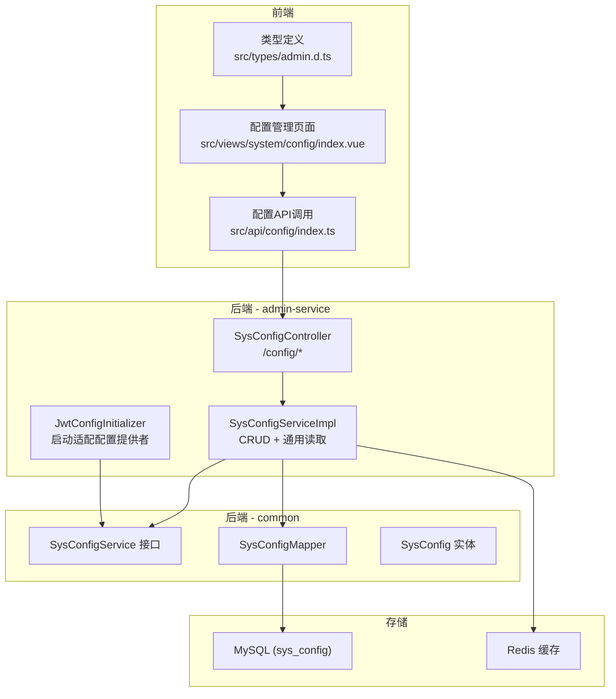
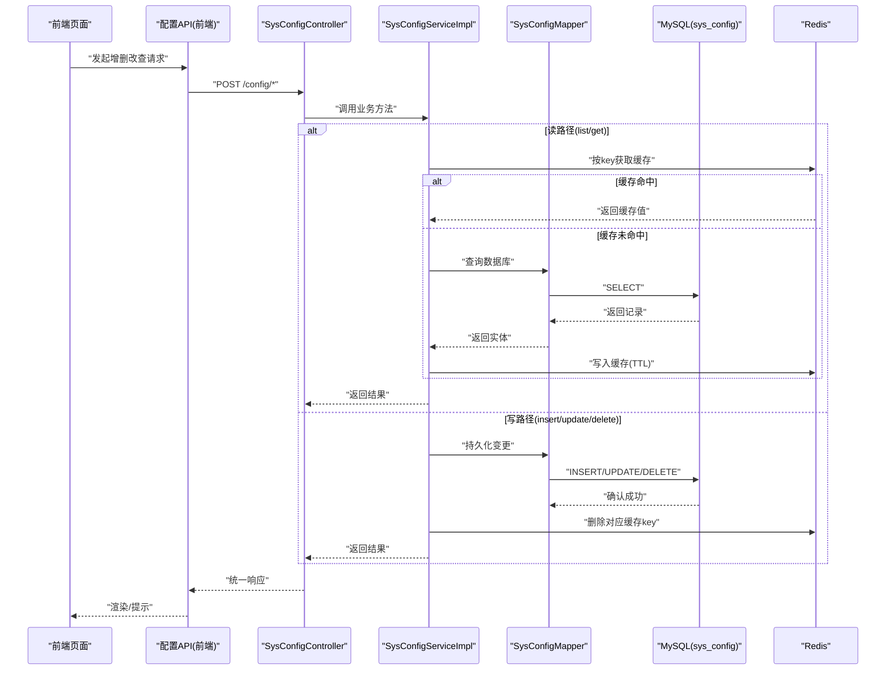
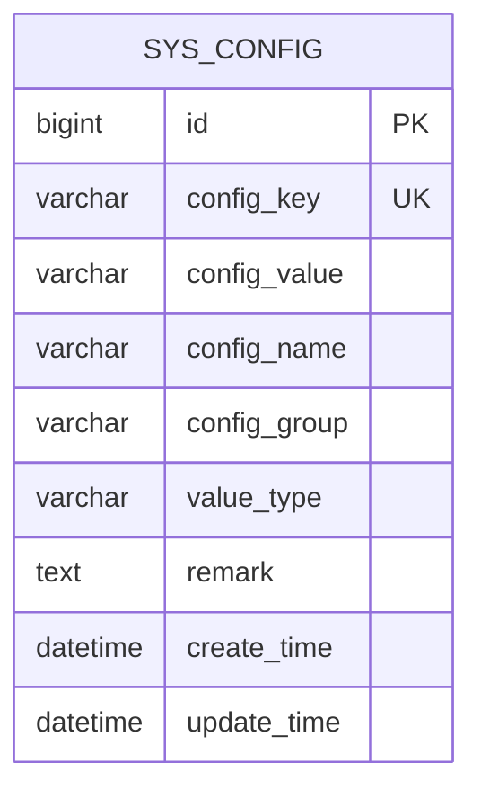
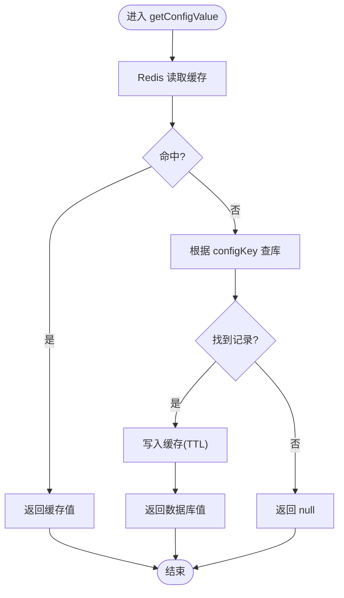
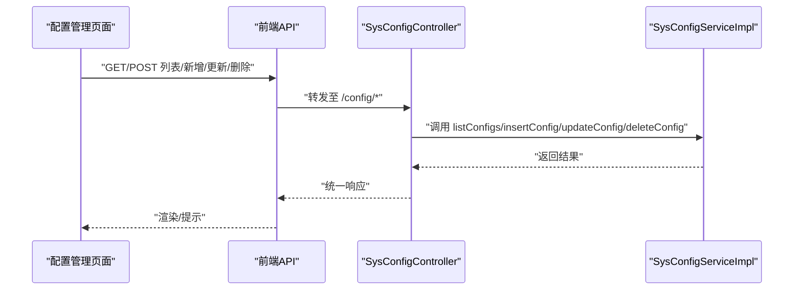
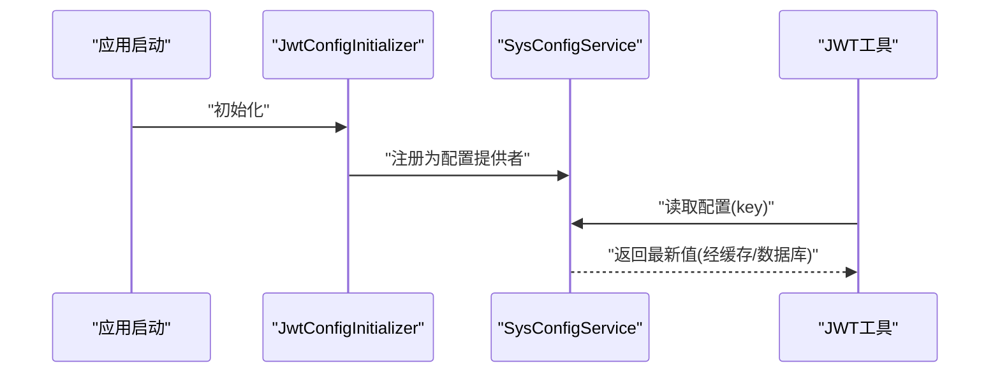
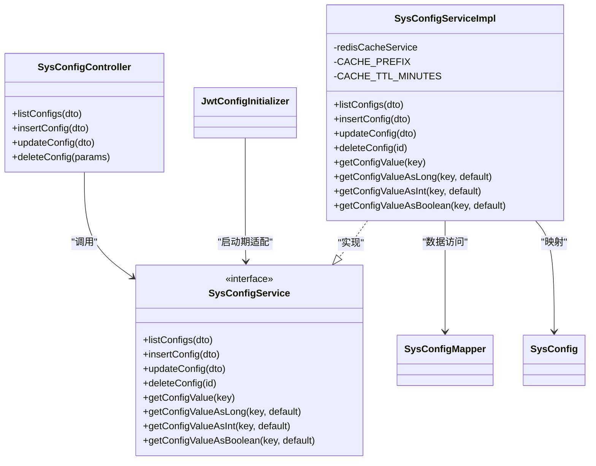
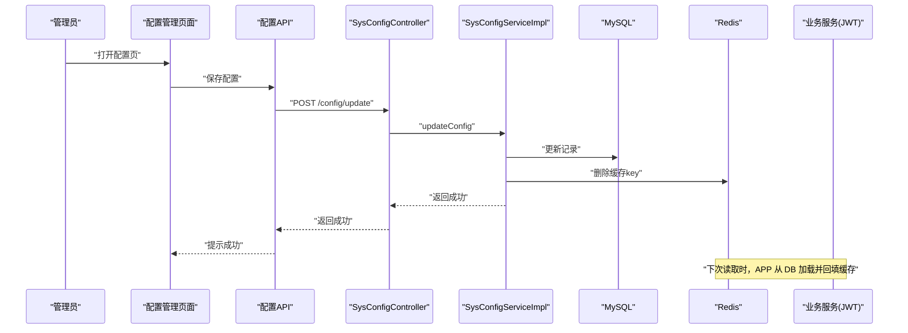

# 系统配置管理

<cite>
**本文引用的文件**   
- [SysConfig.java](file://class_times_record_back/common/src/main/java/com/shiroko/repository/entity/SysConfig.java)
- [SysConfigMapper.java](file://class_times_record_back/common/src/main/java/com/shiroko/mapper/SysConfigMapper.java)
- [SysConfigService.java](file://class_times_record_back/common/src/main/java/com/shiroko/service/SysConfigService.java)
- [SysConfigServiceImpl.java](file://class_times_record_back/admin-service/src/main/java/com/shiroko/service/impl/SysConfigServiceImpl.java)
- [SysConfigController.java](file://class_times_record_back/admin-service/src/main/java/com/shiroko/controller/SysConfigController.java)
- [JwtConfigInitializer.java](file://class_times_record_back/admin-service/src/main/java/com/shiroko/config/JwtConfigInitializer.java)
- [index.ts（前端配置API）](file://class_record_admin_front/src/api/config/index.ts)
- [index.vue（前端配置页面）](file://class_record_admin_front/src/views/system/config/index.vue)
- [admin.d.ts（前端类型定义）](file://class_record_admin_front/src/types/admin.d.ts)
- [class_times_record.sql](file://class_times_record_back/docs/class_times_record.sql)
</cite>

## 目录
1. [简介](#简介)
2. [项目结构](#项目结构)
3. [核心组件](#核心组件)
4. [架构总览](#架构总览)
5. [详细组件分析](#详细组件分析)
6. [依赖关系分析](#依赖关系分析)
7. [性能与缓存策略](#性能与缓存策略)
8. [配置读取优先级与默认值](#配置读取优先级与默认值)
9. [变更通知与热更新机制](#变更通知与热更新机制)
10. [完整操作流程示例](#完整操作流程示例)
11. [安全策略与版本回滚](#安全策略与版本回滚)
12. [故障排查指南](#故障排查指南)
13. [结论](#结论)

## 简介
本文件系统化阐述“系统配置管理”的完整实现，覆盖配置项管理、分组、动态读取、缓存同步、热更新、变更通知、安全与回滚等关键能力。重点说明：
- 配置实体设计与数据库表结构
- Redis 缓存同步与失效策略
- 读路径的 Cache-Aside 模式与默认值处理
- 管理端 CRUD 接口与前端交互流程
- 运行时对 JWT 等敏感配置的动态生效方式
- 可扩展的安全与版本化方案建议

## 项目结构
后端采用多模块微服务架构，配置管理相关代码分布在 common 与 admin-service 两个模块中；前端在 class_record_admin_front 提供配置管理界面。

图表来源
- [SysConfigController.java:1-77](file://class_times_record_back/admin-service/src/main/java/com/shiroko/controller/SysConfigController.java#L1-L77)
- [SysConfigServiceImpl.java:1-232](file://class_times_record_back/admin-service/src/main/java/com/shiroko/service/impl/SysConfigServiceImpl.java#L1-L232)
- [SysConfigService.java:1-92](file://class_times_record_back/common/src/main/java/com/shiroko/service/SysConfigService.java#L1-L92)
- [SysConfigMapper.java:1-16](file://class_times_record_back/common/src/main/java/com/shiroko/mapper/SysConfigMapper.java#L1-L16)
- [SysConfig.java:1-55](file://class_times_record_back/common/src/main/java/com/shiroko/repository/entity/SysConfig.java#L1-L55)
- [JwtConfigInitializer.java:1-40](file://class_times_record_back/admin-service/src/main/java/com/shiroko/config/JwtConfigInitializer.java#L1-L40)
- [index.ts（前端配置API）:1-40](file://class_record_admin_front/src/api/config/index.ts#L1-L40)
- [index.vue（前端配置页面）:1-180](file://class_record_admin_front/src/views/system/config/index.vue#L1-L180)
- [admin.d.ts（前端类型定义）:200-230](file://class_record_admin_front/src/types/admin.d.ts#L200-L230)

章节来源
- [SysConfigController.java:1-77](file://class_times_record_back/admin-service/src/main/java/com/shiroko/controller/SysConfigController.java#L1-L77)
- [SysConfigServiceImpl.java:1-232](file://class_times_record_back/admin-service/src/main/java/com/shiroko/service/impl/SysConfigServiceImpl.java#L1-L232)
- [SysConfigService.java:1-92](file://class_times_record_back/common/src/main/java/com/shiroko/service/SysConfigService.java#L1-L92)
- [SysConfigMapper.java:1-16](file://class_times_record_back/common/src/main/java/com/shiroko/mapper/SysConfigMapper.java#L1-L16)
- [SysConfig.java:1-55](file://class_times_record_back/common/src/main/java/com/shiroko/repository/entity/SysConfig.java#L1-L55)
- [JwtConfigInitializer.java:1-40](file://class_times_record_back/admin-service/src/main/java/com/shiroko/config/JwtConfigInitializer.java#L1-L40)
- [index.ts（前端配置API）:1-40](file://class_record_admin_front/src/api/config/index.ts#L1-L40)
- [index.vue（前端配置页面）:1-180](file://class_record_admin_front/src/views/system/config/index.vue#L1-L180)
- [admin.d.ts（前端类型定义）:200-230](file://class_record_admin_front/src/types/admin.d.ts#L200-L230)

## 核心组件
- 配置实体 SysConfig：描述 sys_config 表的字段语义，包括键、值、名称、分组、类型、备注与时间戳。
- Mapper SysConfigMapper：基于 MyBatis-Plus 的基础数据访问接口。
- Service 接口与实现：对外暴露管理端 CRUD 与通用读取方法；读路径采用 Cache-Aside 模式，写路径更新后主动清除对应缓存 key。
- Controller：提供 /config/list、/config/insert、/config/update、/config/delete 四个管理端接口。
- 前端 API 与页面：封装请求、渲染表格、编辑与删除操作。
- 启动期适配 JwtConfigInitializer：将配置服务包装为 JWT 工具所需的配置提供者，使 JWT 过期等参数可动态生效。

章节来源
- [SysConfig.java:1-55](file://class_times_record_back/common/src/main/java/com/shiroko/repository/entity/SysConfig.java#L1-L55)
- [SysConfigMapper.java:1-16](file://class_times_record_back/common/src/main/java/com/shiroko/mapper/SysConfigMapper.java#L1-L16)
- [SysConfigService.java:1-92](file://class_times_record_back/common/src/main/java/com/shiroko/service/SysConfigService.java#L1-L92)
- [SysConfigServiceImpl.java:1-232](file://class_times_record_back/admin-service/src/main/java/com/shiroko/service/impl/SysConfigServiceImpl.java#L1-L232)
- [SysConfigController.java:1-77](file://class_times_record_back/admin-service/src/main/java/com/shiroko/controller/SysConfigController.java#L1-L77)
- [JwtConfigInitializer.java:1-40](file://class_times_record_back/admin-service/src/main/java/com/shiroko/config/JwtConfigInitializer.java#L1-L40)
- [index.ts（前端配置API）:1-40](file://class_record_admin_front/src/api/config/index.ts#L1-L40)
- [index.vue（前端配置页面）:1-180](file://class_record_admin_front/src/views/system/config/index.vue#L1-L180)
- [admin.d.ts（前端类型定义）:200-230](file://class_record_admin_front/src/types/admin.d.ts#L200-L230)

## 架构总览
下图展示了从前端到后端再到存储层的端到端调用链路，以及缓存与数据库的读写协同。

图表来源
- [SysConfigController.java:1-77](file://class_times_record_back/admin-service/src/main/java/com/shiroko/controller/SysConfigController.java#L1-L77)
- [SysConfigServiceImpl.java:1-232](file://class_times_record_back/admin-service/src/main/java/com/shiroko/service/impl/SysConfigServiceImpl.java#L1-L232)
- [SysConfigMapper.java:1-16](file://class_times_record_back/common/src/main/java/com/shiroko/mapper/SysConfigMapper.java#L1-L16)
- [SysConfig.java:1-55](file://class_times_record_back/common/src/main/java/com/shiroko/repository/entity/SysConfig.java#L1-L55)

## 详细组件分析

### 配置实体与数据模型
- 实体字段：id、configKey、configValue、configName、configGroup、valueType、remark、createTime、updateTime。
- 分组能力：通过 configGroup 进行逻辑分组（如 jwt、auth、cache），便于管理与检索。
- 类型能力：valueType 标识值类型（STRING/INTEGER/LONG/BOOLEAN），配合解析方法使用。

图表来源
- [SysConfig.java:1-55](file://class_times_record_back/common/src/main/java/com/shiroko/repository/entity/SysConfig.java#L1-L55)
- [class_times_record.sql:1-497](file://class_times_record_back/docs/class_times_record.sql#L1-L497)

章节来源
- [SysConfig.java:1-55](file://class_times_record_back/common/src/main/java/com/shiroko/repository/entity/SysConfig.java#L1-L55)
- [class_times_record.sql:1-497](file://class_times_record_back/docs/class_times_record.sql#L1-L497)

### 服务层与缓存策略
- 读路径（Cache-Aside）：优先从 Redis 读取，未命中则查库并回填缓存，TTL 固定分钟数。
- 写路径：更新/新增/删除后，立即删除对应缓存 key，确保下次读取加载最新值。
- 通用读取：提供字符串、Long、Integer、Boolean 四种类型读取方法，缺失或解析失败时返回默认值。

图表来源
- [SysConfigServiceImpl.java:159-177](file://class_times_record_back/admin-service/src/main/java/com/shiroko/service/impl/SysConfigServiceImpl.java#L159-L177)

章节来源
- [SysConfigServiceImpl.java:1-232](file://class_times_record_back/admin-service/src/main/java/com/shiroko/service/impl/SysConfigServiceImpl.java#L1-L232)

### 控制器与前端交互
- 管理端接口：list、insert、update、delete，均返回统一响应体。
- 前端 API：封装了列表查询、新增、更新、删除等方法。
- 前端页面：展示表格、支持搜索过滤、编辑与删除操作。

图表来源
- [SysConfigController.java:1-77](file://class_times_record_back/admin-service/src/main/java/com/shiroko/controller/SysConfigController.java#L1-L77)
- [index.ts（前端配置API）:1-40](file://class_record_admin_front/src/api/config/index.ts#L1-L40)
- [index.vue（前端配置页面）:1-180](file://class_record_admin_front/src/views/system/config/index.vue#L1-L180)

章节来源
- [SysConfigController.java:1-77](file://class_times_record_back/admin-service/src/main/java/com/shiroko/controller/SysConfigController.java#L1-L77)
- [index.ts（前端配置API）:1-40](file://class_record_admin_front/src/api/config/index.ts#L1-L40)
- [index.vue（前端配置页面）:1-180](file://class_record_admin_front/src/views/system/config/index.vue#L1-L180)
- [admin.d.ts（前端类型定义）:200-230](file://class_record_admin_front/src/types/admin.d.ts#L200-L230)

### 运行时动态生效（JWT 示例）
- 启动期初始化器将 SysConfigService 适配为 JWT 工具所需的配置提供者，从而在运行期通过配置中心/数据库+缓存的方式动态获取 JWT 过期等参数。
- 当管理员更新配置后，缓存被清理，后续读取将拉取最新值，从而实现“热更新”。

图表来源
- [JwtConfigInitializer.java:1-40](file://class_times_record_back/admin-service/src/main/java/com/shiroko/config/JwtConfigInitializer.java#L1-L40)
- [SysConfigServiceImpl.java:159-177](file://class_times_record_back/admin-service/src/main/java/com/shiroko/service/impl/SysConfigServiceImpl.java#L159-L177)

章节来源
- [JwtConfigInitializer.java:1-40](file://class_times_record_back/admin-service/src/main/java/com/shiroko/config/JwtConfigInitializer.java#L1-L40)
- [SysConfigServiceImpl.java:159-177](file://class_times_record_back/admin-service/src/main/java/com/shiroko/service/impl/SysConfigServiceImpl.java#L159-L177)

## 依赖关系分析
- 耦合关系：Controller 仅依赖 Service 接口；Service 实现依赖 Mapper 与 Redis 缓存服务；实体与 Mapper 位于 common 模块，便于多服务复用。
- 外部依赖：MyBatis-Plus、Redis、统一响应体 DTO。
- 潜在风险：若 Redis 不可用，读路径会回源数据库；需关注缓存穿透与雪崩防护（见“性能与缓存策略”）。

图表来源
- [SysConfigController.java:1-77](file://class_times_record_back/admin-service/src/main/java/com/shiroko/controller/SysConfigController.java#L1-L77)
- [SysConfigService.java:1-92](file://class_times_record_back/common/src/main/java/com/shiroko/service/SysConfigService.java#L1-L92)
- [SysConfigServiceImpl.java:1-232](file://class_times_record_back/admin-service/src/main/java/com/shiroko/service/impl/SysConfigServiceImpl.java#L1-L232)
- [SysConfigMapper.java:1-16](file://class_times_record_back/common/src/main/java/com/shiroko/mapper/SysConfigMapper.java#L1-L16)
- [SysConfig.java:1-55](file://class_times_record_back/common/src/main/java/com/shiroko/repository/entity/SysConfig.java#L1-L55)
- [JwtConfigInitializer.java:1-40](file://class_times_record_back/admin-service/src/main/java/com/shiroko/config/JwtConfigInitializer.java#L1-L40)

章节来源
- [SysConfigController.java:1-77](file://class_times_record_back/admin-service/src/main/java/com/shiroko/controller/SysConfigController.java#L1-L77)
- [SysConfigService.java:1-92](file://class_times_record_back/common/src/main/java/com/shiroko/service/SysConfigService.java#L1-L92)
- [SysConfigServiceImpl.java:1-232](file://class_times_record_back/admin-service/src/main/java/com/shiroko/service/impl/SysConfigServiceImpl.java#L1-L232)
- [SysConfigMapper.java:1-16](file://class_times_record_back/common/src/main/java/com/shiroko/mapper/SysConfigMapper.java#L1-L16)
- [SysConfig.java:1-55](file://class_times_record_back/common/src/main/java/com/shiroko/repository/entity/SysConfig.java#L1-L55)
- [JwtConfigInitializer.java:1-40](file://class_times_record_back/admin-service/src/main/java/com/shiroko/config/JwtConfigInitializer.java#L1-L40)

## 性能与缓存策略
- 读路径：Cache-Aside 模式，命中率决定整体延迟；合理设置 TTL 平衡一致性与性能。
- 写路径：先落库再删缓存，避免脏读；单 key 粒度删除，降低影响面。
- 建议优化：
  - 热点 key 加本地二级缓存（注意一致性窗口）
  - 批量预热常用配置，减少冷启动抖动
  - 监控缓存命中率与异常日志，定位解析失败与超时问题

[本节为通用指导，不直接分析具体文件]

## 配置读取优先级与默认值
- 当前实现：所有服务通过 SysConfigService 读取配置，优先 Redis，未命中回源数据库；不存在或解析失败时返回传入的默认值。
- 环境变量/配置文件合并：当前代码未体现环境变量或本地配置文件的合并逻辑；如需引入，可在 Service 层增加“环境/本地 -> 数据库/缓存”的优先级链，并在读路径中按序尝试。
- 默认值策略：数值型读取方法在缺失或格式错误时返回默认值，保障系统健壮性。

章节来源
- [SysConfigServiceImpl.java:179-214](file://class_times_record_back/admin-service/src/main/java/com/shiroko/service/impl/SysConfigServiceImpl.java#L179-L214)

## 变更通知与热更新机制
- 服务端热更新：写操作后立即删除对应缓存 key，下一次读取自动拉取最新值，达到“近实时”生效。
- 客户端刷新：
  - 管理端页面：可在更新成功后主动刷新列表或弹窗提示。
  - 业务端：当前未实现推送式通知；可通过事件总线/消息队列广播 key 变更，订阅方收到后主动刷新本地缓存或重新拉取。
- 扩展建议：引入配置变更事件（包含 key、group、version），由网关或配置中心统一分发，提升跨服务一致性。

章节来源
- [SysConfigServiceImpl.java:110-133](file://class_times_record_back/admin-service/src/main/java/com/shiroko/service/impl/SysConfigServiceImpl.java#L110-L133)
- [SysConfigServiceImpl.java:140-153](file://class_times_record_back/admin-service/src/main/java/com/shiroko/service/impl/SysConfigServiceImpl.java#L140-L153)
- [index.vue（前端配置页面）:1-180](file://class_record_admin_front/src/views/system/config/index.vue#L1-L180)

## 完整操作流程示例
以下以“修改 JWT 过期时间”为例，展示从创建到生效的端到端步骤（概念流程）：
1. 管理员登录后台，打开“系统配置”页面。
2. 新增或编辑配置项，填写 key、value、分组、类型与备注。
3. 提交后，后端写入数据库并删除对应 Redis 缓存。
4. 业务服务再次读取该 key 时，从数据库加载并回填缓存。
5. 启动期已适配的配置提供者（如 JWT）在下次读取时获得新值，无需重启。

[此图为概念流程示意，不直接映射具体源码文件]

## 安全策略与版本回滚
- 敏感信息加密：
  - 建议在入库前对敏感值进行加密（如国密 SM2/SM4 或 AES），并提供统一的加解密工具类。
  - 读取侧按需解密，避免明文落盘。
- 配置版本管理与回滚：
  - 在 sys_config 上增加 version 字段，每次更新自增；或引入独立的历史快照表，记录 key 的历史值与操作人。
  - 提供“回滚到指定版本”的接口，结合事务保证原子性。
- 审计与权限：
  - 利用现有操作日志注解记录关键变更；结合 RBAC 控制配置编辑权限。
- 一致性保障：
  - 针对高并发场景，可增加分布式锁或版本号校验，防止覆盖更新。

[本节为通用建议，不直接分析具体文件]

## 故障排查指南
- 配置未生效：
  - 检查是否执行了“更新后删除缓存”的逻辑；确认 Redis 连接正常。
  - 观察日志中是否有“解析失败，使用默认值”的告警。
- 缓存不一致：
  - 核对缓存 key 前缀与删除逻辑是否匹配；必要时手动清理缓存验证。
- 读路径性能问题：
  - 评估 TTL 是否过短导致频繁回源；考虑热点 key 的本地缓存与预热。
- 前端显示异常：
  - 检查 API 返回结构与前端类型定义是否一致；确认分页/排序字段。

章节来源
- [SysConfigServiceImpl.java:179-214](file://class_times_record_back/admin-service/src/main/java/com/shiroko/service/impl/SysConfigServiceImpl.java#L179-L214)
- [SysConfigServiceImpl.java:110-133](file://class_times_record_back/admin-service/src/main/java/com/shiroko/service/impl/SysConfigServiceImpl.java#L110-L133)
- [SysConfigServiceImpl.java:140-153](file://class_times_record_back/admin-service/src/main/java/com/shiroko/service/impl/SysConfigServiceImpl.java#L140-L153)
- [index.vue（前端配置页面）:1-180](file://class_record_admin_front/src/views/system/config/index.vue#L1-L180)

## 结论
本系统实现了基于“数据库 + Redis”的动态配置管理能力，具备分组、类型化读取、Cache-Aside 缓存与写后失效的热更新特性，并通过启动期适配使 JWT 等运行时参数可即时生效。在此基础上，建议逐步完善敏感信息加密、版本管理与变更通知机制，进一步提升安全性、可追溯性与实时性。