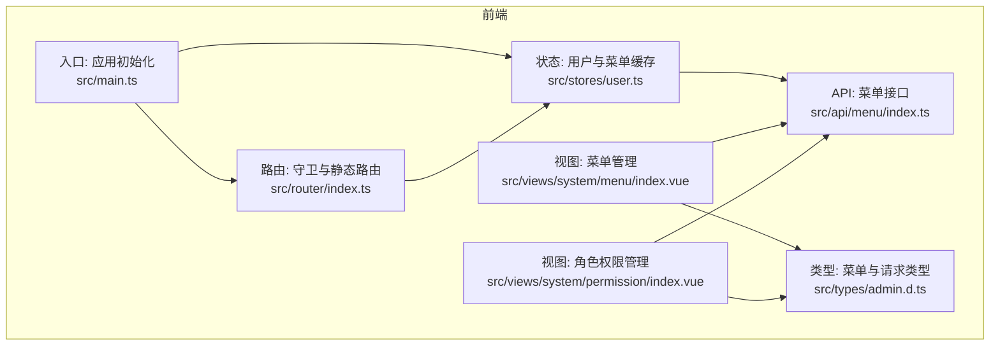
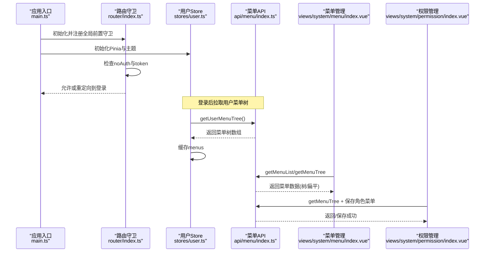
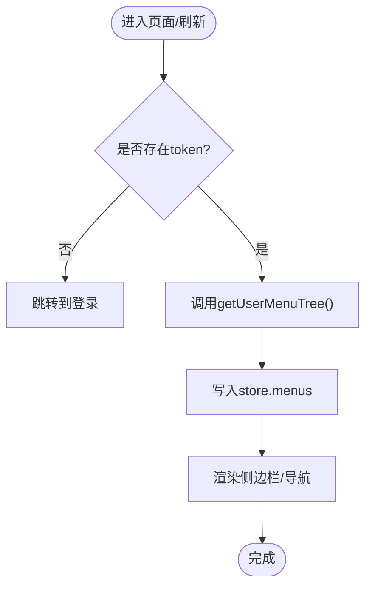
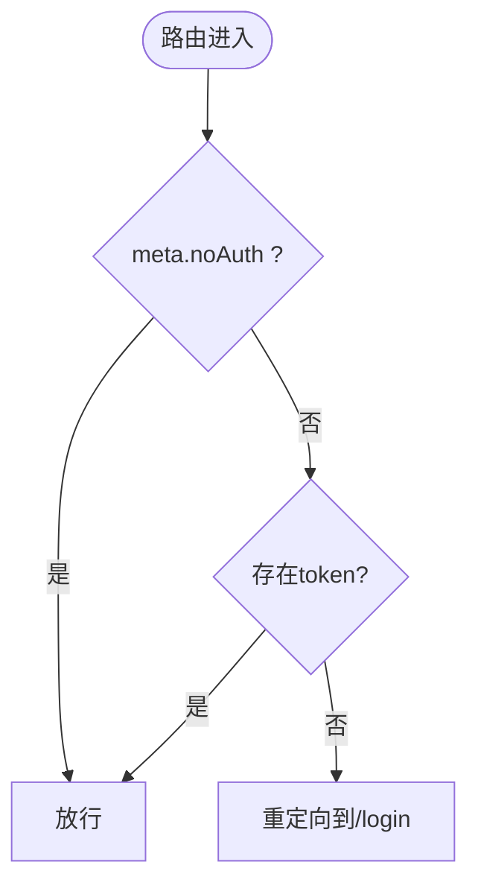
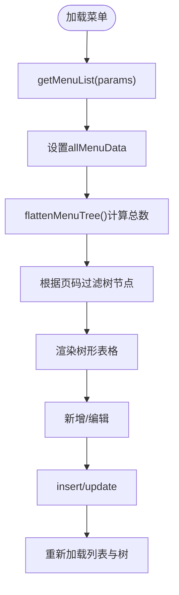
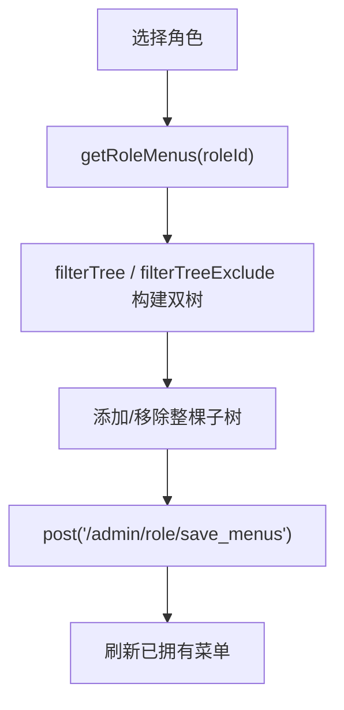
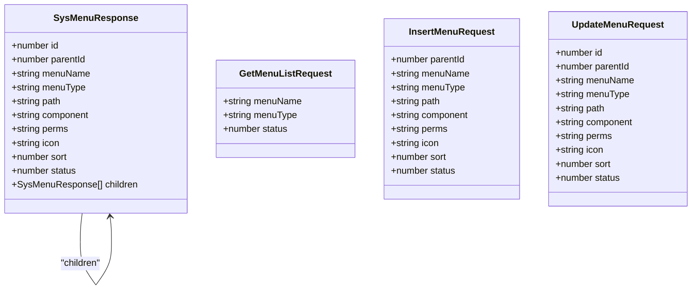
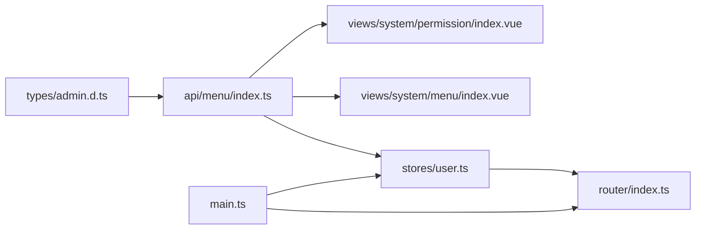

# 菜单权限控制

<cite>
**本文引用的文件**
- [class_record_admin_front/src/api/menu/index.ts](file://class_record_admin_front/src/api/menu/index.ts)
- [class_record_admin_front/src/router/index.ts](file://class_record_admin_front/src/router/index.ts)
- [class_record_admin_front/src/stores/user.ts](file://class_record_admin_front/src/stores/user.ts)
- [class_record_admin_front/src/views/system/menu/index.vue](file://class_record_admin_front/src/views/system/menu/index.vue)
- [class_record_admin_front/src/views/system/permission/index.vue](file://class_record_admin_front/src/views/system/permission/index.vue)
- [class_record_admin_front/src/types/admin.d.ts](file://class_record_admin_front/src/types/admin.d.ts)
- [class_record_admin_front/src/main.ts](file://class_record_admin_front/src/main.ts)
</cite>

## 目录
1. [简介](#简介)
2. [项目结构](#项目结构)
3. [核心组件](#核心组件)
4. [架构总览](#架构总览)
5. [详细组件分析](#详细组件分析)
6. [依赖关系分析](#依赖关系分析)
7. [性能考虑](#性能考虑)
8. [故障排查指南](#故障排查指南)
9. [结论](#结论)
10. [附录：配置与操作步骤示例](#附录配置与操作步骤示例)

## 简介
本文件围绕“动态菜单生成”和“按钮级权限控制”的完整实现机制进行系统化说明，覆盖以下关键点：
- 菜单树形结构设计（父子关系、排序规则、显示条件等）
- 菜单权限加载流程（用户权限验证、菜单过滤、动态路由生成）
- 前端菜单渲染机制（权限指令使用、组件级权限控制）
- 从菜单定义到权限绑定的完整操作步骤
- 最佳实践（权限粒度、性能优化、用户体验优化）

## 项目结构
本项目为前后端分离的管理后台。与菜单权限相关的前端代码主要位于 class_record_admin_front 子项目中，关键位置如下：
- API 层：菜单接口封装
- 状态管理：用户信息、角色、菜单树缓存
- 路由守卫：登录态校验与基础跳转
- 视图层：菜单管理、角色权限分配
- 类型定义：菜单实体与请求参数

图表来源
- [class_record_admin_front/src/api/menu/index.ts](file://class_record_admin_front/src/api/menu/index.ts)
- [class_record_admin_front/src/stores/user.ts](file://class_record_admin_front/src/stores/user.ts)
- [class_record_admin_front/src/router/index.ts](file://class_record_admin_front/src/router/index.ts)
- [class_record_admin_front/src/views/system/menu/index.vue](file://class_record_admin_front/src/views/system/menu/index.vue)
- [class_record_admin_front/src/views/system/permission/index.vue](file://class_record_admin_front/src/views/system/permission/index.vue)
- [class_record_admin_front/src/types/admin.d.ts](file://class_record_admin_front/src/types/admin.d.ts)
- [class_record_admin_front/src/main.ts](file://class_record_admin_front/src/main.ts)

章节来源
- [class_record_admin_front/src/main.ts](file://class_record_admin_front/src/main.ts)
- [class_record_admin_front/src/router/index.ts](file://class_record_admin_front/src/router/index.ts)

## 核心组件
- 菜单数据模型与请求参数
  - 菜单节点包含 id、parentId、menuName、menuType、path、component、perms、icon、sort、status、children 等字段，支持目录(M)、菜单(C)、按钮(F)、外链(L)四种类型。
  - 提供查询、新增、更新、删除以及按用户获取菜单树的接口封装。
- 用户与菜单缓存
  - 在 Pinia store 中维护 token、用户信息、角色列表、菜单树；提供 fetchMenus 方法调用后端接口并缓存结果。
- 路由守卫
  - 基于本地存储的 token 进行登录态判断；对 noAuth 标记的路由放行，否则重定向至登录页。
- 菜单管理界面
  - 提供菜单树展示、分页、搜索、新增/编辑/删除、图标选择、上级菜单选择等功能。
- 角色权限管理界面
  - 以左右双树形式展示“已有权限”和“未拥有权限”，支持整棵子树批量添加/移除，保存时提交当前角色的菜单 ID 集合。

章节来源
- [class_record_admin_front/src/types/admin.d.ts](file://class_record_admin_front/src/types/admin.d.ts)
- [class_record_admin_front/src/api/menu/index.ts](file://class_record_admin_front/src/api/menu/index.ts)
- [class_record_admin_front/src/stores/user.ts](file://class_record_admin_front/src/stores/user.ts)
- [class_record_admin_front/src/router/index.ts](file://class_record_admin_front/src/router/index.ts)
- [class_record_admin_front/src/views/system/menu/index.vue](file://class_record_admin_front/src/views/system/menu/index.vue)
- [class_record_admin_front/src/views/system/permission/index.vue](file://class_record_admin_front/src/views/system/permission/index.vue)

## 架构总览
下图展示了菜单权限在前端的整体交互流程：应用启动后初始化路由与状态，登录后通过用户菜单树接口获取权限数据，结合路由守卫完成访问控制；同时提供菜单管理与角色授权界面用于运营配置。

图表来源
- [class_record_admin_front/src/main.ts](file://class_record_admin_front/src/main.ts)
- [class_record_admin_front/src/router/index.ts](file://class_record_admin_front/src/router/index.ts)
- [class_record_admin_front/src/stores/user.ts](file://class_record_admin_front/src/stores/user.ts)
- [class_record_admin_front/src/api/menu/index.ts](file://class_record_admin_front/src/api/menu/index.ts)
- [class_record_admin_front/src/views/system/menu/index.vue](file://class_record_admin_front/src/views/system/menu/index.vue)
- [class_record_admin_front/src/views/system/permission/index.vue](file://class_record_admin_front/src/views/system/permission/index.vue)

## 详细组件分析

### 菜单数据模型与接口
- 数据结构
  - SysMenuResponse 定义了菜单节点的完整字段，包括父子关系 parentId、类型 menuType、路由 path、组件 component、权限标识 perms、图标 icon、排序 sort、状态 status 及 children 子节点。
- 接口能力
  - 获取菜单列表、获取菜单树、新增/更新/删除菜单、获取用户菜单树。
- 典型用法
  - 菜单管理页面使用列表与树两种视图；权限管理页面使用树进行批量授权。

章节来源
- [class_record_admin_front/src/types/admin.d.ts](file://class_record_admin_front/src/types/admin.d.ts)
- [class_record_admin_front/src/api/menu/index.ts](file://class_record_admin_front/src/api/menu/index.ts)

### 用户与菜单缓存（Pinia Store）
- 职责
  - 维护登录态、用户信息、角色列表、菜单树；提供统一的数据存取与清理方法。
- 关键流程
  - fetchMenus 调用用户菜单树接口，成功后将菜单树写入 menus。
- 扩展点
  - 可在此处集成动态路由注册逻辑（根据 menus 生成路由表）。

图表来源
- [class_record_admin_front/src/stores/user.ts](file://class_record_admin_front/src/stores/user.ts)
- [class_record_admin_front/src/api/menu/index.ts](file://class_record_admin_front/src/api/menu/index.ts)

章节来源
- [class_record_admin_front/src/stores/user.ts](file://class_record_admin_front/src/stores/user.ts)

### 路由守卫与访问控制
- 功能要点
  - 在进入路由前检查 noAuth 标记与本地 token；无 token 且非免认证路由则重定向登录。
- 现状说明
  - 当前守卫仅做登录态校验；动态路由注册与菜单过滤未在路由层直接实现，可在后续扩展。

图表来源
- [class_record_admin_front/src/router/index.ts](file://class_record_admin_front/src/router/index.ts)

章节来源
- [class_record_admin_front/src/router/index.ts](file://class_record_admin_front/src/router/index.ts)

### 菜单管理界面（CRUD 与树形展示）
- 能力概览
  - 支持按名称、类型、状态筛选；树形表格展示；分页；新增/编辑/删除；图标选择器；上级菜单选择（仅目录类型可选）。
- 关键逻辑
  - 扁平化树用于分页统计；根据当前页ID集合过滤树节点以保持层级完整性。
  - 父级选择树中禁用非目录类型节点，保证父子关系约束。

图表来源
- [class_record_admin_front/src/views/system/menu/index.vue](file://class_record_admin_front/src/views/system/menu/index.vue)
- [class_record_admin_front/src/api/menu/index.ts](file://class_record_admin_front/src/api/menu/index.ts)

章节来源
- [class_record_admin_front/src/views/system/menu/index.vue](file://class_record_admin_front/src/views/system/menu/index.vue)

### 角色权限管理界面（双向树授权）
- 能力概览
  - 左侧选择角色，右侧展示“已有权限”和“未拥有权限”两棵树；支持整棵子树批量添加/移除；保存时提交角色ID与菜单ID集合。
- 关键逻辑
  - filterTree/filterTreeExclude 分别保留“已拥有”和“未拥有”的菜单树；collectAllIds 递归收集子节点ID，确保父子一致性。

图表来源
- [class_record_admin_front/src/views/system/permission/index.vue](file://class_record_admin_front/src/views/system/permission/index.vue)

章节来源
- [class_record_admin_front/src/views/system/permission/index.vue](file://class_record_admin_front/src/views/system/permission/index.vue)

### 类图：菜单与类型定义

图表来源
- [class_record_admin_front/src/types/admin.d.ts](file://class_record_admin_front/src/types/admin.d.ts)

## 依赖关系分析
- 模块耦合
  - 菜单管理视图依赖菜单API与类型定义；权限管理视图依赖菜单API与角色API；用户Store依赖菜单API；路由守卫依赖本地存储与路由元信息。
- 外部依赖
  - Element Plus 提供 UI 组件；Pinia 提供状态管理；Vue Router 提供路由与守卫。

图表来源
- [class_record_admin_front/src/types/admin.d.ts](file://class_record_admin_front/src/types/admin.d.ts)
- [class_record_admin_front/src/api/menu/index.ts](file://class_record_admin_front/src/api/menu/index.ts)
- [class_record_admin_front/src/stores/user.ts](file://class_record_admin_front/src/stores/user.ts)
- [class_record_admin_front/src/views/system/menu/index.vue](file://class_record_admin_front/src/views/system/menu/index.vue)
- [class_record_admin_front/src/views/system/permission/index.vue](file://class_record_admin_front/src/views/system/permission/index.vue)
- [class_record_admin_front/src/router/index.ts](file://class_record_admin_front/src/router/index.ts)
- [class_record_admin_front/src/main.ts](file://class_record_admin_front/src/main.ts)

章节来源
- [class_record_admin_front/src/main.ts](file://class_record_admin_front/src/main.ts)
- [class_record_admin_front/src/router/index.ts](file://class_record_admin_front/src/router/index.ts)
- [class_record_admin_front/src/stores/user.ts](file://class_record_admin_front/src/stores/user.ts)
- [class_record_admin_front/src/api/menu/index.ts](file://class_record_admin_front/src/api/menu/index.ts)
- [class_record_admin_front/src/views/system/menu/index.vue](file://class_record_admin_front/src/views/system/menu/index.vue)
- [class_record_admin_front/src/views/system/permission/index.vue](file://class_record_admin_front/src/views/system/permission/index.vue)
- [class_record_admin_front/src/types/admin.d.ts](file://class_record_admin_front/src/types/admin.d.ts)

## 性能考虑
- 菜单树分页与过滤
  - 菜单管理采用“先全量再前端分页+树过滤”的策略，适合中小规模菜单数量；若菜单规模较大，建议改为后端分页与按需展开。
- 树操作复杂度
  - 权限管理的添加/移除涉及递归遍历整棵树，时间复杂度 O(N)。可通过维护 ID 集合与索引降低重复查找成本。
- 网络请求合并
  - 首次加载可并行请求菜单树与角色列表，减少首屏等待时间。
- 渲染优化
  - 大列表使用虚拟滚动；树节点懒加载；避免不必要的深度响应式转换。

[本节为通用指导，不直接分析具体文件]

## 故障排查指南
- 无法看到菜单
  - 确认是否已登录且 token 有效；检查用户菜单树接口是否返回数据；确认菜单状态是否为启用。
- 按钮不可见或不可用
  - 检查对应菜单节点是否配置了 perms 标识；确认当前用户角色是否被分配该菜单；前端组件是否正确根据 perms 控制可见性。
- 权限保存失败
  - 检查角色是否选中；确认 save_menus 接口参数 roleId 与 menuIds 是否正确；查看后端返回的错误信息。
- 路由无法进入
  - 检查路由 meta.noAuth 配置；确认路由路径与组件路径正确；必要时在路由守卫中增加日志输出。

章节来源
- [class_record_admin_front/src/router/index.ts](file://class_record_admin_front/src/router/index.ts)
- [class_record_admin_front/src/stores/user.ts](file://class_record_admin_front/src/stores/user.ts)
- [class_record_admin_front/src/views/system/permission/index.vue](file://class_record_admin_front/src/views/system/permission/index.vue)

## 结论
本项目已具备完善的菜单管理与角色授权能力，并通过用户菜单树接口支撑前端权限控制。当前路由守卫负责登录态校验，菜单树缓存于用户 Store。建议在后续迭代中补充动态路由注册与按钮级权限指令，以实现更细粒度的访问控制与更好的用户体验。

[本节为总结性内容，不直接分析具体文件]

## 附录：配置与操作步骤示例
- 菜单定义步骤
  - 在“菜单管理”中新增目录/菜单/按钮/外链节点，填写名称、类型、路径、组件、权限标识、图标、排序、状态等。
  - 使用上级菜单选择器建立父子关系；仅目录类型可作为父节点。
- 权限绑定步骤
  - 在“菜单权限”中选择目标角色，从“未拥有权限”树中添加所需菜单（支持整棵子树），点击“保存权限”。
- 前端使用建议
  - 在侧边栏渲染时读取用户菜单树，按层级生成导航。
  - 在页面内根据按钮的 perms 标识进行显隐控制（例如自定义 v-permission 指令或在模板中条件渲染）。
- 动态路由生成（建议）
  - 在用户 Store 中根据菜单树生成 Vue Router 路由表，并在路由守卫中动态 addRoute，从而实现“有权限才可见并可访问”。

章节来源
- [class_record_admin_front/src/views/system/menu/index.vue](file://class_record_admin_front/src/views/system/menu/index.vue)
- [class_record_admin_front/src/views/system/permission/index.vue](file://class_record_admin_front/src/views/system/permission/index.vue)
- [class_record_admin_front/src/stores/user.ts](file://class_record_admin_front/src/stores/user.ts)
- [class_record_admin_front/src/router/index.ts](file://class_record_admin_front/src/router/index.ts)