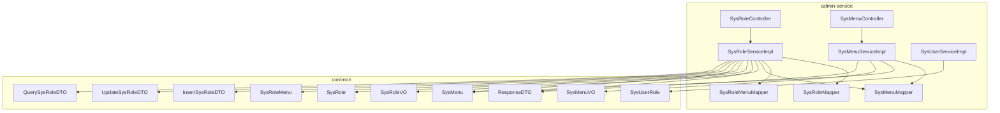
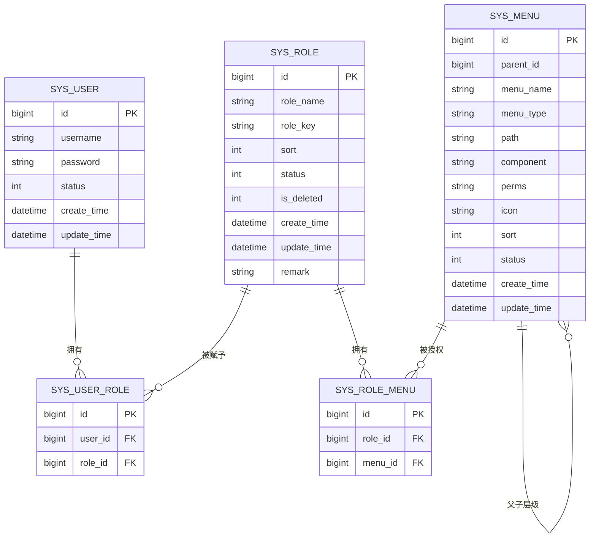
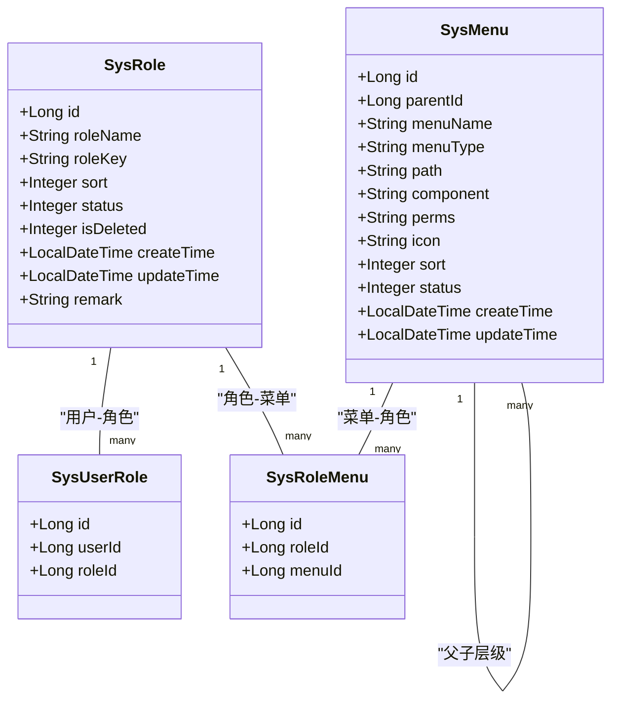
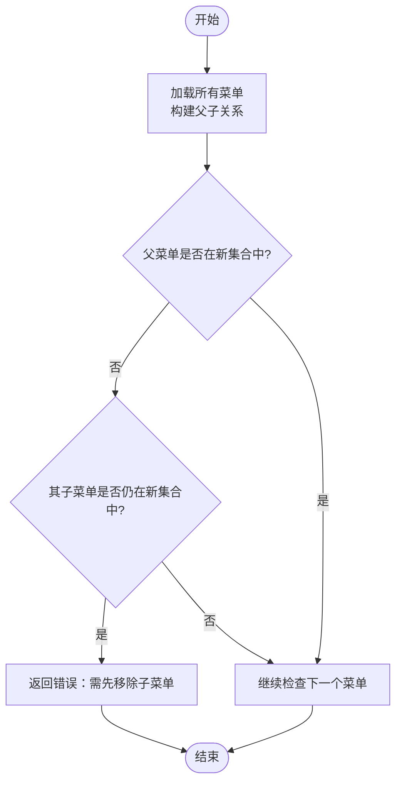
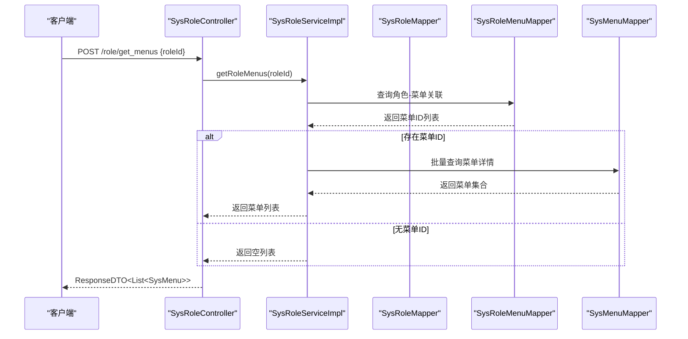
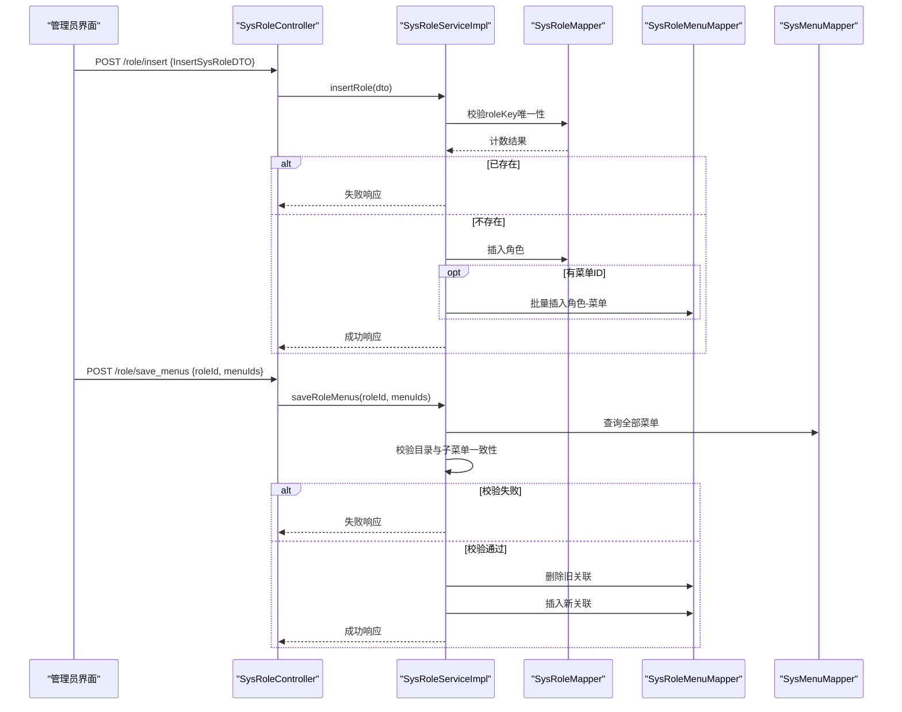
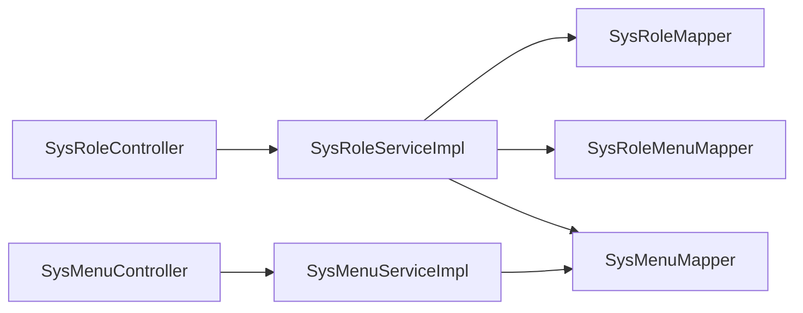

# 角色权限管理

<cite>
**本文引用的文件**
- [SysRole.java](file://class_times_record_back/common/src/main/java/com/shiroko/repository/entity/SysRole.java)
- [SysUserRole.java](file://class_times_record_back/common/src/main/java/com/shiroko/repository/entity/SysUserRole.java)
- [SysMenu.java](file://class_times_record_back/common/src/main/java/com/shiroko/repository/entity/SysMenu.java)
- [SysRoleMenu.java](file://class_times_record_back/common/src/main/java/com/shiroko/repository/entity/SysRoleMenu.java)
- [SysRoleController.java](file://class_times_record_back/admin-service/src/main/java/com/shiroko/controller/SysRoleController.java)
- [SysRoleServiceImpl.java](file://class_times_record_back/admin-service/src/main/java/com/shiroko/service/impl/SysRoleServiceImpl.java)
- [SysMenuController.java](file://class_times_record_back/admin-service/src/main/java/com/shiroko/controller/SysMenuController.java)
- [SysMenuServiceImpl.java](file://class_times_record_back/admin-service/src/main/java/com/shiroko/service/impl/SysMenuServiceImpl.java)
- [SysUserServiceImpl.java](file://class_times_record_back/admin-service/src/main/java/com/shiroko/service/impl/SysUserServiceImpl.java)
- [SysRoleMapper.java](file://class_times_record_back/admin-service/src/main/java/com/shiroko/mapper/SysRoleMapper.java)
- [SysRoleMenuMapper.java](file://class_times_record_back/admin-service/src/main/java/com/shiroko/mapper/SysRoleMenuMapper.java)
- [SysMenuMapper.java](file://class_times_record_back/admin-service/src/main/java/com/shiroko/mapper/SysMenuMapper.java)
- [SysUserRoleMapper.java](file://class_times_record_back/admin-service/src/main/java/com/shiroko/mapper/SysUserRoleMapper.java)
- [SysRoleVO.java](file://class_times_record_back/common/src/main/java/com/shiroko/repository/vo/admin/SysRoleVO.java)
- [SysMenuVO.java](file://class_times_record_back/common/src/main/java/com/shiroko/repository/vo/admin/SysMenuVO.java)
- [InsertSysRoleDTO.java](file://class_times_record_back/common/src/main/java/com/shiroko/repository/dto/admin/InsertSysRoleDTO.java)
- [UpdateSysRoleDTO.java](file://class_times_record_back/common/src/main/java/com/shiroko/repository/dto/admin/UpdateSysRoleDTO.java)
- [QuerySysRoleDTO.java](file://class_times_record_back/common/src/main/java/com/shiroko/repository/dto/admin/QuerySysRoleDTO.java)
- [ResponseDTO.java](file://class_times_record_back/common/src/main/java/com/shiroko/repository/dto/ResponseDTO.java)
- [class_times_record.sql](file://class_times_record_back/docs/class_times_record.sql)
</cite>

## 目录
1. [简介](#简介)
2. [项目结构](#项目结构)
3. [核心组件](#核心组件)
4. [架构总览](#架构总览)
5. [详细组件分析](#详细组件分析)
6. [依赖关系分析](#依赖关系分析)
7. [性能考虑](#性能考虑)
8. [故障排查指南](#故障排查指南)
9. [结论](#结论)
10. [附录](#附录)

## 简介
本文件围绕基于角色的访问控制（RBAC）在系统中的完整实现进行系统化说明，覆盖角色定义、权限分配、用户角色关联、菜单与权限模型、动态权限验证方案以及角色管理的端到端操作流程。文档同时给出数据模型、类图、时序图和流程图等可视化表达，帮助读者快速理解并落地扩展。

## 项目结构
后端采用分层架构：控制器层负责HTTP接口，服务层承载业务逻辑，数据访问层通过MyBatis-Plus的Mapper与数据库交互；通用实体、DTO、VO位于common模块，便于多服务复用。

图表来源
- [SysRoleController.java:1-69](file://class_times_record_back/admin-service/src/main/java/com/shiroko/controller/SysRoleController.java#L1-L69)
- [SysRoleServiceImpl.java:1-241](file://class_times_record_back/admin-service/src/main/java/com/shiroko/service/impl/SysRoleServiceImpl.java#L1-L241)
- [SysMenuController.java](file://class_times_record_back/admin-service/src/main/java/com/shiroko/controller/SysMenuController.java)
- [SysMenuServiceImpl.java](file://class_times_record_back/admin-service/src/main/java/com/shiroko/service/impl/SysMenuServiceImpl.java)
- [SysUserServiceImpl.java](file://class_times_record_back/admin-service/src/main/java/com/shiroko/service/impl/SysUserServiceImpl.java)
- [SysRole.java:1-42](file://class_times_record_back/common/src/main/java/com/shiroko/repository/entity/SysRole.java#L1-L42)
- [SysRoleMenu.java:1-25](file://class_times_record_back/common/src/main/java/com/shiroko/repository/entity/SysRoleMenu.java#L1-L25)
- [SysMenu.java:1-46](file://class_times_record_back/common/src/main/java/com/shiroko/repository/entity/SysMenu.java#L1-L46)
- [SysUserRole.java:1-28](file://class_times_record_back/common/src/main/java/com/shiroko/repository/entity/SysUserRole.java#L1-L28)
- [SysRoleVO.java](file://class_times_record_back/common/src/main/java/com/shiroko/repository/vo/admin/SysRoleVO.java)
- [SysMenuVO.java](file://class_times_record_back/common/src/main/java/com/shiroko/repository/vo/admin/SysMenuVO.java)
- [InsertSysRoleDTO.java](file://class_times_record_back/common/src/main/java/com/shiroko/repository/dto/admin/InsertSysRoleDTO.java)
- [UpdateSysRoleDTO.java](file://class_times_record_back/common/src/main/java/com/shiroko/repository/dto/admin/UpdateSysRoleDTO.java)
- [QuerySysRoleDTO.java](file://class_times_record_back/common/src/main/java/com/shiroko/repository/dto/admin/QuerySysRoleDTO.java)
- [ResponseDTO.java](file://class_times_record_back/common/src/main/java/com/shiroko/repository/dto/ResponseDTO.java)

章节来源
- [SysRoleController.java:1-69](file://class_times_record_back/admin-service/src/main/java/com/shiroko/controller/SysRoleController.java#L1-L69)
- [SysRoleServiceImpl.java:1-241](file://class_times_record_back/admin-service/src/main/java/com/shiroko/service/impl/SysRoleServiceImpl.java#L1-L241)

## 核心组件
- 角色实体 SysRole：表示系统角色，包含角色名、角色标识、排序、状态、软删除标记及审计字段。
- 用户角色关联 SysUserRole：维护用户与角色的多对多关系。
- 菜单实体 SysMenu：表示菜单与权限点，支持父子层级、路径、组件、权限标识perms等。
- 角色菜单关联 SysRoleMenu：维护角色与菜单的多对多关系。
- 控制器与服务：SysRoleController暴露角色管理API，SysRoleServiceImpl实现CRUD、菜单授权校验与批量保存。
- VO/DTO：用于前后端数据传输与分页封装。

章节来源
- [SysRole.java:1-42](file://class_times_record_back/common/src/main/java/com/shiroko/repository/entity/SysRole.java#L1-L42)
- [SysUserRole.java:1-28](file://class_times_record_back/common/src/main/java/com/shiroko/repository/entity/SysUserRole.java#L1-L28)
- [SysMenu.java:1-46](file://class_times_record_back/common/src/main/java/com/shiroko/repository/entity/SysMenu.java#L1-L46)
- [SysRoleMenu.java:1-25](file://class_times_record_back/common/src/main/java/com/shiroko/repository/entity/SysRoleMenu.java#L1-L25)
- [SysRoleController.java:1-69](file://class_times_record_back/admin-service/src/main/java/com/shiroko/controller/SysRoleController.java#L1-L69)
- [SysRoleServiceImpl.java:1-241](file://class_times_record_back/admin-service/src/main/java/com/shiroko/service/impl/SysRoleServiceImpl.java#L1-L241)

## 架构总览
RBAC模型在本项目中体现为“用户-角色-菜单/权限”三层解耦：
- 用户可拥有多个角色（sys_user_role）。
- 角色可拥有多个菜单/权限（sys_role_menu）。
- 菜单/权限具备层级结构与权限标识（sys_menu.perms），用于方法级或资源级鉴权。

图表来源
- [class_times_record.sql:318-404](file://class_times_record_back/docs/class_times_record.sql#L318-L404)

## 详细组件分析

### 角色实体与多对多关系映射
- 角色表 sys_role：主键id、角色名roleName、角色标识roleKey、排序sort、状态status、软删除isDeleted、创建/更新时间、备注remark。
- 用户角色表 sys_user_role：主键id、外键user_id、外键role_id，实现用户与角色的多对多。
- 角色菜单表 sys_role_menu：主键id、外键role_id、外键menu_id，实现角色与菜单的多对多。
- 菜单表 sys_menu：支持parent_id构建层级，menu_type区分目录/菜单/按钮等，perms作为细粒度权限标识。

图表来源
- [SysRole.java:1-42](file://class_times_record_back/common/src/main/java/com/shiroko/repository/entity/SysRole.java#L1-L42)
- [SysUserRole.java:1-28](file://class_times_record_back/common/src/main/java/com/shiroko/repository/entity/SysUserRole.java#L1-L28)
- [SysMenu.java:1-46](file://class_times_record_back/common/src/main/java/com/shiroko/repository/entity/SysMenu.java#L1-L46)
- [SysRoleMenu.java:1-25](file://class_times_record_back/common/src/main/java/com/shiroko/repository/entity/SysRoleMenu.java#L1-L25)
- [class_times_record.sql:318-404](file://class_times_record_back/docs/class_times_record.sql#L318-L404)

章节来源
- [SysRole.java:1-42](file://class_times_record_back/common/src/main/java/com/shiroko/repository/entity/SysRole.java#L1-L42)
- [SysUserRole.java:1-28](file://class_times_record_back/common/src/main/java/com/shiroko/repository/entity/SysUserRole.java#L1-L28)
- [SysMenu.java:1-46](file://class_times_record_back/common/src/main/java/com/shiroko/repository/entity/SysMenu.java#L1-L46)
- [SysRoleMenu.java:1-25](file://class_times_record_back/common/src/main/java/com/shiroko/repository/entity/SysRoleMenu.java#L1-L25)
- [class_times_record.sql:318-404](file://class_times_record_back/docs/class_times_record.sql#L318-L404)

### 权限继承与传递机制
- 菜单层级：通过sys_menu.parent_id形成树形结构，父节点可为目录类型（如M），子节点为具体菜单或按钮。
- 权限聚合：角色通过sys_role_menu获得一组菜单ID；前端渲染时按树形结构展示，后端鉴权时可依据perms进行细粒度控制。
- 当前实现未提供显式的“角色层级”与“角色间权限继承”，如需支持可在sys_role增加parent_id并在服务层实现递归聚合。

图表来源
- [SysRoleServiceImpl.java:189-223](file://class_times_record_back/admin-service/src/main/java/com/shiroko/service/impl/SysRoleServiceImpl.java#L189-L223)
- [SysMenu.java:1-46](file://class_times_record_back/common/src/main/java/com/shiroko/repository/entity/SysMenu.java#L1-L46)

章节来源
- [SysRoleServiceImpl.java:189-223](file://class_times_record_back/admin-service/src/main/java/com/shiroko/service/impl/SysRoleServiceImpl.java#L189-L223)

### 动态权限验证方案（注解式与方法级拦截）
- 资源级权限：利用sys_menu.perms作为资源标识，结合网关/过滤器或AOP拦截器，在请求进入业务前校验用户是否具备对应perms。
- 方法级权限：可通过自定义注解（如@RequirePerms）配合Spring AOP在方法执行前完成权限判定。
- 用户权限获取流程：登录成功后，根据用户ID查询其角色集合（sys_user_role），再根据角色集合查询菜单集合（sys_role_menu + sys_menu），缓存至会话或Redis，供后续鉴权使用。

图表来源
- [SysRoleController.java:54-57](file://class_times_record_back/admin-service/src/main/java/com/shiroko/controller/SysRoleController.java#L54-L57)
- [SysRoleServiceImpl.java:175-186](file://class_times_record_back/admin-service/src/main/java/com/shiroko/service/impl/SysRoleServiceImpl.java#L175-L186)
- [SysRoleMenuMapper.java](file://class_times_record_back/admin-service/src/main/java/com/shiroko/mapper/SysRoleMenuMapper.java)
- [SysMenuMapper.java](file://class_times_record_back/admin-service/src/main/java/com/shiroko/mapper/SysMenuMapper.java)

章节来源
- [SysRoleController.java:54-57](file://class_times_record_back/admin-service/src/main/java/com/shiroko/controller/SysRoleController.java#L54-L57)
- [SysRoleServiceImpl.java:175-186](file://class_times_record_back/admin-service/src/main/java/com/shiroko/service/impl/SysRoleServiceImpl.java#L175-L186)

### 角色管理完整操作流程（从创建到授权）
- 创建角色：调用插入接口，校验roleKey唯一性，写入sys_role，若附带菜单ID则批量写入sys_role_menu。
- 更新角色：支持修改基本信息与重新分配菜单；更新菜单时先清空旧关联再插入新关联。
- 删除角色：删除角色记录并级联清理角色-菜单关联。
- 菜单授权：保存菜单时校验目录菜单与其子菜单的一致性，避免“父删子留”的不一致状态。

图表来源
- [SysRoleController.java:38-67](file://class_times_record_back/admin-service/src/main/java/com/shiroko/controller/SysRoleController.java#L38-L67)
- [SysRoleServiceImpl.java:82-109](file://class_times_record_back/admin-service/src/main/java/com/shiroko/service/impl/SysRoleServiceImpl.java#L82-L109)
- [SysRoleServiceImpl.java:189-223](file://class_times_record_back/admin-service/src/main/java/com/shiroko/service/impl/SysRoleServiceImpl.java#L189-L223)
- [SysRoleMapper.java](file://class_times_record_back/admin-service/src/main/java/com/shiroko/mapper/SysRoleMapper.java)
- [SysRoleMenuMapper.java](file://class_times_record_back/admin-service/src/main/java/com/shiroko/mapper/SysRoleMenuMapper.java)
- [SysMenuMapper.java](file://class_times_record_back/admin-service/src/main/java/com/shiroko/mapper/SysMenuMapper.java)

章节来源
- [SysRoleController.java:38-67](file://class_times_record_back/admin-service/src/main/java/com/shiroko/controller/SysRoleController.java#L38-L67)
- [SysRoleServiceImpl.java:82-109](file://class_times_record_back/admin-service/src/main/java/com/shiroko/service/impl/SysRoleServiceImpl.java#L82-L109)
- [SysRoleServiceImpl.java:189-223](file://class_times_record_back/admin-service/src/main/java/com/shiroko/service/impl/SysRoleServiceImpl.java#L189-L223)

### 用户角色关联与权限聚合
- 用户-角色：通过sys_user_role建立多对多关系，SysUserServiceImpl可据此查询用户角色集合。
- 角色-菜单：通过sys_role_menu建立多对多关系，SysRoleServiceImpl提供按角色查询菜单的方法。
- 权限聚合：将用户角色对应的菜单集合合并去重，得到最终权限集，用于前端菜单渲染与后端鉴权。

章节来源
- [SysUserServiceImpl.java](file://class_times_record_back/admin-service/src/main/java/com/shiroko/service/impl/SysUserServiceImpl.java)
- [SysRoleServiceImpl.java:175-186](file://class_times_record_back/admin-service/src/main/java/com/shiroko/service/impl/SysRoleServiceImpl.java#L175-L186)

## 依赖关系分析
- 控制器依赖服务：SysRoleController依赖SysRoleServiceImpl；SysMenuController依赖SysMenuServiceImpl。
- 服务依赖Mapper：SysRoleServiceImpl依赖SysRoleMapper、SysRoleMenuMapper、SysMenuMapper。
- 实体与VO/DTO：服务层在入参与出参之间进行转换，统一以ResponseDTO包装响应。

图表来源
- [SysRoleController.java:1-69](file://class_times_record_back/admin-service/src/main/java/com/shiroko/controller/SysRoleController.java#L1-L69)
- [SysRoleServiceImpl.java:1-241](file://class_times_record_back/admin-service/src/main/java/com/shiroko/service/impl/SysRoleServiceImpl.java#L1-L241)
- [SysMenuController.java](file://class_times_record_back/admin-service/src/main/java/com/shiroko/controller/SysMenuController.java)
- [SysMenuServiceImpl.java](file://class_times_record_back/admin-service/src/main/java/com/shiroko/service/impl/SysMenuServiceImpl.java)

章节来源
- [SysRoleController.java:1-69](file://class_times_record_back/admin-service/src/main/java/com/shiroko/controller/SysRoleController.java#L1-L69)
- [SysRoleServiceImpl.java:1-241](file://class_times_record_back/admin-service/src/main/java/com/shiroko/service/impl/SysRoleServiceImpl.java#L1-L241)

## 性能考虑
- 批量操作：角色-菜单关联建议采用批量插入替代循环单条插入，减少数据库往返。
- 缓存策略：用户权限集（菜单与perms）应在登录成功后缓存至Redis或本地缓存，降低重复查询开销。
- 索引优化：sys_user_role(user_id)、sys_role_menu(role_id, menu_id)应建立合适索引以提升查询效率。
- 分页查询：角色列表查询已使用分页，确保查询条件合理，避免全表扫描。

[本节为通用指导，不直接分析具体文件]

## 故障排查指南
- 角色标识冲突：插入或更新时若roleKey重复会返回失败，请检查唯一性约束与业务规则。
- 目录与子菜单不一致：保存菜单时若父目录不在新集合而子菜单仍在，将返回错误提示，请先移除子菜单。
- 角色不存在：查询、更新、删除等操作前会校验角色是否存在，避免无效操作。
- 事务回滚：涉及多表写操作的方法均声明事务，异常时将自动回滚，保障数据一致性。

章节来源
- [SysRoleServiceImpl.java:82-109](file://class_times_record_back/admin-service/src/main/java/com/shiroko/service/impl/SysRoleServiceImpl.java#L82-L109)
- [SysRoleServiceImpl.java:112-159](file://class_times_record_back/admin-service/src/main/java/com/shiroko/service/impl/SysRoleServiceImpl.java#L112-L159)
- [SysRoleServiceImpl.java:161-173](file://class_times_record_back/admin-service/src/main/java/com/shiroko/service/impl/SysRoleServiceImpl.java#L161-L173)
- [SysRoleServiceImpl.java:189-223](file://class_times_record_back/admin-service/src/main/java/com/shiroko/service/impl/SysRoleServiceImpl.java#L189-L223)

## 结论
本项目实现了标准的RBAC模型，涵盖角色、用户角色关联、菜单与权限标识、以及角色菜单授权的核心能力。通过清晰的实体设计与服务层校验，保证了数据一致性与业务正确性。建议在现有基础上完善方法级注解鉴权与权限缓存，进一步提升可扩展性与性能。

[本节为总结性内容，不直接分析具体文件]

## 附录

### 数据库表结构参考
- sys_menu：菜单与权限点，含父子层级与perms标识。
- sys_role：角色基础信息。
- sys_role_menu：角色-菜单关联。
- sys_user_role：用户-角色关联。

章节来源
- [class_times_record.sql:318-404](file://class_times_record_back/docs/class_times_record.sql#L318-L404)

### 权限模型扩展指南
- 新增自定义权限类型：在sys_menu.menu_type中扩展类型值，并在前端渲染与后端校验逻辑中适配。
- 支持角色层级与继承：在sys_role增加parent_id，在服务层实现递归聚合父角色权限，注意幂等与循环引用检测。
- 方法级权限注解：定义自定义注解（如@RequirePerms），结合AOP在方法入口校验用户是否具备对应perms。
- 数据隔离：如需租户或组织维度隔离，可在关联表中增加tenant_id或org_id，并在查询条件中追加过滤。

[本节为概念性扩展建议，不直接分析具体文件]