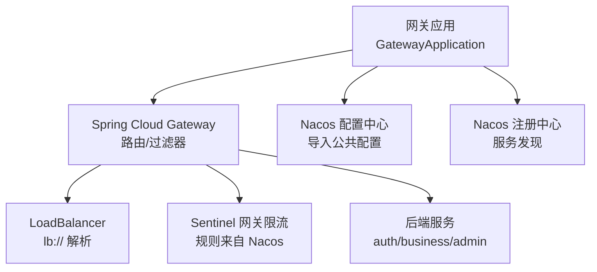
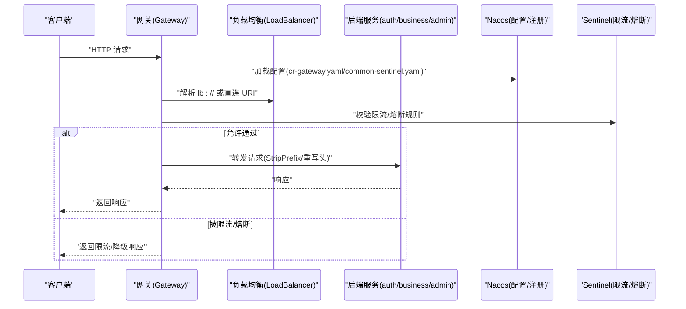
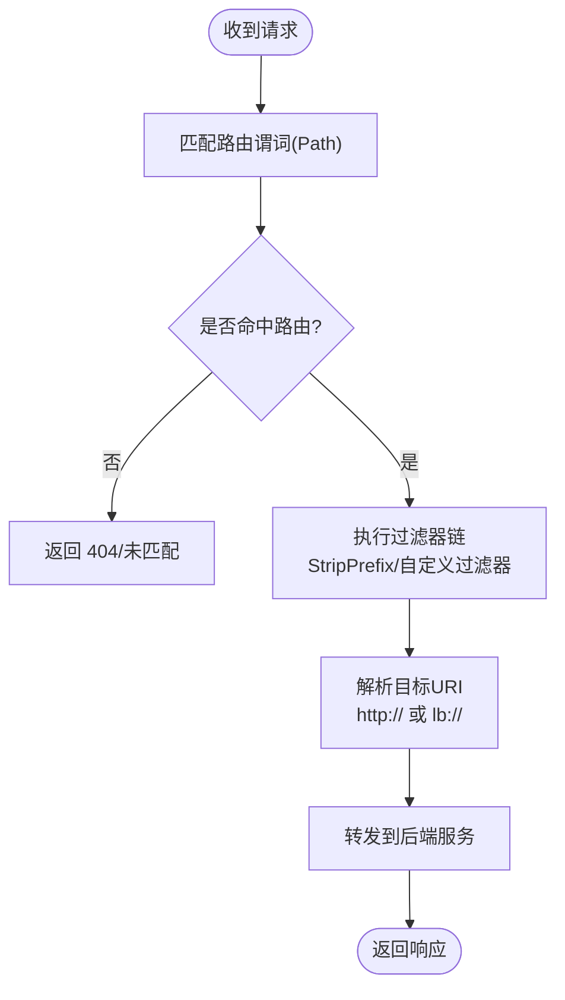
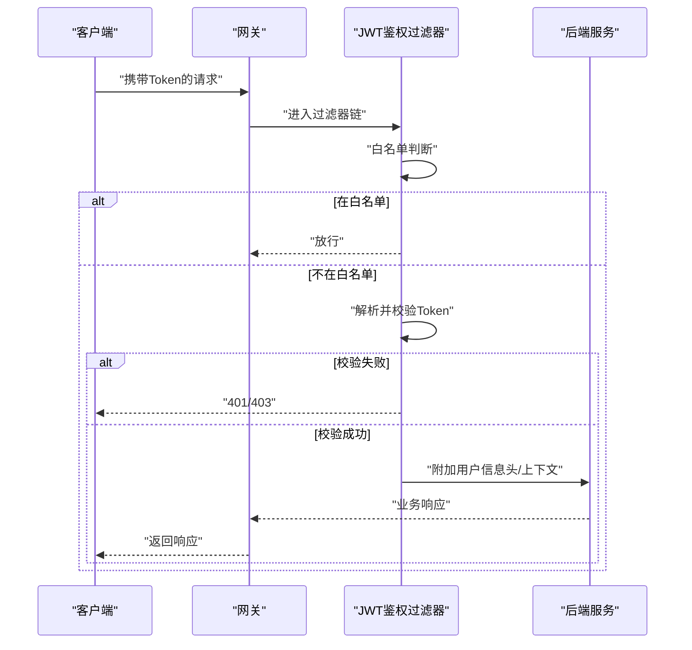
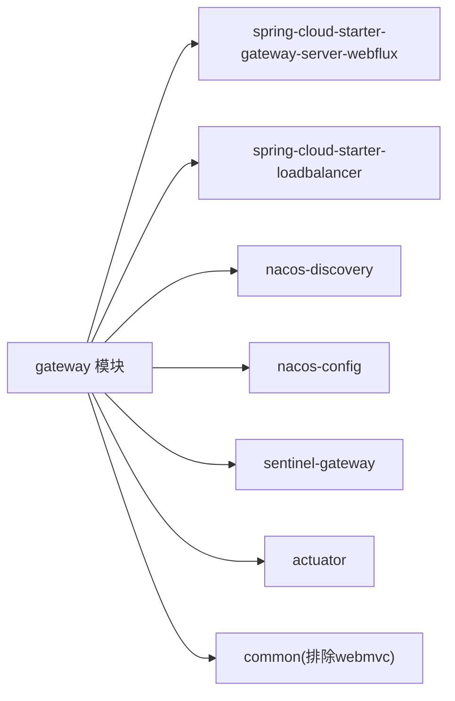

# 网关服务 (gateway)

<cite>
**本文引用的文件**   
- [GatewayApplication.java](file://class_times_record_back/gateway/src/main/java/com/shiroko/gateway/GatewayApplication.java)
- [application.yml](file://class_times_record_back/gateway/src/main/resources/application.yml)
- [application-dev.yml](file://class_times_record_back/gateway/src/main/resources/application-dev.yml)
- [pom.xml](file://class_times_record_back/gateway/pom.xml)
</cite>

## 目录
1. [简介](#简介)
2. [项目结构](#项目结构)
3. [核心组件](#核心组件)
4. [架构总览](#架构总览)
5. [详细组件分析](#详细组件分析)
6. [依赖分析](#依赖分析)
7. [性能考虑](#性能考虑)
8. [故障排查指南](#故障排查指南)
9. [结论](#结论)
10. [附录](#附录)

## 简介
本仓库的网关服务基于 Spring Cloud Gateway（WebFlux）构建，承担统一入口、路由转发、鉴权过滤、限流熔断与可观测性等职责。当前实现已包含：
- 应用启动类与基础配置
- Nacos 注册发现与配置中心集成
- 本地开发环境下的静态路由配置
- 通过 Sentinel 进行网关级限流与熔断能力（由外部配置导入）

后续可在该基础上扩展 JWT 认证过滤器、跨域处理、全局异常与日志等高级特性。

## 项目结构
网关模块为独立 Spring Boot 应用，采用“最小化依赖 + 外部配置”的方式组织：
- 启动类：排除数据源自动装配，避免在网关中引入不必要的 WebMVC 依赖
- 配置文件：通过 spring.config.import 从 Nacos 动态导入公共配置（如 Sentinel、日志）
- 开发环境：使用 application-dev.yml 提供直连后端服务的静态路由，便于本地调试
- 依赖管理：引入 Gateway Server、LoadBalancer、Nacos、Sentinel、Actuator 等关键依赖

图表来源
- [GatewayApplication.java:1-17](file://class_times_record_back/gateway/src/main/java/com/shiroko/gateway/GatewayApplication.java#L1-L17)
- [application.yml:1-19](file://class_times_record_back/gateway/src/main/resources/application.yml#L1-L19)
- [application-dev.yml:1-38](file://class_times_record_back/gateway/src/main/resources/application-dev.yml#L1-L38)
- [pom.xml:1-81](file://class_times_record_back/gateway/pom.xml#L1-L81)

章节来源
- [GatewayApplication.java:1-17](file://class_times_record_back/gateway/src/main/java/com/shiroko/gateway/GatewayApplication.java#L1-L17)
- [application.yml:1-19](file://class_times_record_back/gateway/src/main/resources/application.yml#L1-L19)
- [application-dev.yml:1-38](file://class_times_record_back/gateway/src/main/resources/application-dev.yml#L1-L38)
- [pom.xml:1-81](file://class_times_record_back/gateway/pom.xml#L1-L81)

## 核心组件
- 启动类
  - 作用：初始化 Spring Boot 应用，排除数据源相关自动装配，确保网关以纯响应式模式运行
  - 关键点：仅暴露 main 方法，无业务逻辑
- 配置中心与注册中心
  - 通过 spring.config.import 从 Nacos 导入 cr-gateway.yaml、common-sentinel.yaml、logback-spring.xml
  - 指定 Nacos 地址、命名空间与分组，支持配置刷新
- 开发环境路由
  - 在 application-dev.yml 中定义三条静态路由，分别映射到 auth、business、admin 三个后端服务
  - 使用 StripPrefix=1 去除前缀后转发至目标服务
- 依赖与能力
  - 引入 spring-cloud-starter-gateway-server-webflux、spring-cloud-starter-loadbalancer
  - 引入 Nacos Discovery/Config、Sentinel Gateway、Actuator

章节来源
- [GatewayApplication.java:1-17](file://class_times_record_back/gateway/src/main/java/com/shiroko/gateway/GatewayApplication.java#L1-L17)
- [application.yml:1-19](file://class_times_record_back/gateway/src/main/resources/application.yml#L1-L19)
- [application-dev.yml:1-38](file://class_times_record_back/gateway/src/main/resources/application-dev.yml#L1-L38)
- [pom.xml:1-81](file://class_times_record_back/gateway/pom.xml#L1-L81)

## 架构总览
下图展示了网关在请求链路中的位置与关键交互：客户端请求进入网关，匹配路由并执行过滤器链，最终转发到具体后端服务；同时通过 Nacos 获取配置与服务列表，并通过 Sentinel 实施限流与熔断。

图表来源
- [application.yml:1-19](file://class_times_record_back/gateway/src/main/resources/application.yml#L1-L19)
- [application-dev.yml:1-38](file://class_times_record_back/gateway/src/main/resources/application-dev.yml#L1-L38)
- [pom.xml:1-81](file://class_times_record_back/gateway/pom.xml#L1-L81)

## 详细组件分析

### 路由与转发机制
- 路由定义方式
  - 开发环境：在 application-dev.yml 中以声明式 routes 配置 Path 谓词与 StripPrefix 过滤器
  - 生产环境：建议将路由迁移至 Nacos 的 cr-gateway.yaml，以便热更新
- 转发策略
  - 直连模式：uri 指向 http://host:port，适合本地调试
  - 服务发现模式：使用 lb://service-name，结合 LoadBalancer 与 Nacos 实现动态实例选择
- 路径重写
  - StripPrefix=1 用于去掉 /auth、/biz、/admin 等前缀后再转发

图表来源
- [application-dev.yml:1-38](file://class_times_record_back/gateway/src/main/resources/application-dev.yml#L1-L38)
- [pom.xml:1-81](file://class_times_record_back/gateway/pom.xml#L1-L81)

章节来源
- [application-dev.yml:1-38](file://class_times_record_back/gateway/src/main/resources/application-dev.yml#L1-L38)
- [pom.xml:1-81](file://class_times_record_back/gateway/pom.xml#L1-L81)

### 负载均衡策略
- 组件依赖
  - 引入 spring-cloud-starter-loadbalancer，配合 Nacos 完成服务实例发现
- 策略说明
  - 默认策略为轮询；可通过自定义 LoadBalancer 或配置项调整
- 使用方式
  - 将路由 uri 改为 lb://服务名，网关将基于注册中心实例列表进行负载均衡

章节来源
- [pom.xml:1-81](file://class_times_record_back/gateway/pom.xml#L1-L81)
- [application.yml:1-19](file://class_times_record_back/gateway/src/main/resources/application.yml#L1-L19)

### 认证与授权（JWT 过滤器设计）
当前代码库未包含具体的 JWT 过滤器实现，以下为推荐的设计方案，供后续扩展参考：
- 设计要点
  - 在过滤器链中插入全局鉴权过滤器，优先于业务路由执行
  - 白名单放行：登录、注册、健康检查、Swagger/OpenAPI 等接口无需鉴权
  - Token 验证：解析 Header 中的 Authorization/Bearer Token，校验签名、过期时间、签发者
  - 权限检查：根据用户角色/权限集合判断是否具备访问资源的权限
  - 上下文传递：将用户信息注入到请求头或 Reactor Context，供下游服务使用
- 典型流程

[本节为概念性设计，不直接分析具体源码文件]

### 跨域处理（CORS）
- 建议做法
  - 在全局过滤器中统一设置响应头 Access-Control-Allow-Origin、Allow-Methods、Allow-Headers 等
  - 对预检请求 OPTIONS 直接放行
- 注意事项
  - 避免在生产环境开放 *，应限制允许的域名与方法
  - 注意 Cookie 与凭证场景下的安全策略

[本节为通用实践建议，不直接分析具体源码文件]

### 请求限流与熔断降级（Sentinel）
- 集成方式
  - 引入 spring-cloud-alibaba-sentinel-gateway 与 sentinel starter
  - 通过 Nacos 导入 common-sentinel.yaml，集中管理限流与熔断规则
- 规则维度
  - 按 API 维度（Path/Method）、按资源名、按客户端 IP 等
  - 支持 QPS/线程数阈值、快速失败、预热、匀速排队等策略
- 降级与兜底
  - 可配置全局或局部降级响应，提升用户体验与系统稳定性

章节来源
- [pom.xml:1-81](file://class_times_record_back/gateway/pom.xml#L1-L81)
- [application.yml:1-19](file://class_times_record_back/gateway/src/main/resources/application.yml#L1-L19)

### 可观测性与健康检查
- Actuator
  - 启用健康检查端点，便于编排平台探测存活与就绪状态
- 日志
  - 通过 Nacos 导入 logback-spring.xml，统一日志格式与输出策略
  - 开发环境开启 Gateway 与 Netty 客户端 DEBUG 日志，便于定位问题

章节来源
- [application.yml:1-19](file://class_times_record_back/gateway/src/main/resources/application.yml#L1-L19)
- [application-dev.yml:1-38](file://class_times_record_back/gateway/src/main/resources/application-dev.yml#L1-38)

## 依赖分析
网关模块的关键依赖关系如下：
- 运行时依赖
  - Spring Cloud Gateway Server（响应式）
  - LoadBalancer（服务发现与负载均衡）
  - Nacos Discovery/Config（注册与配置）
  - Sentinel Gateway（限流/熔断）
  - Actuator（健康检查）
- 内部依赖
  - common 模块（排除 WebMVC 以避免与 WebFlux 冲突）

图表来源
- [pom.xml:1-81](file://class_times_record_back/gateway/pom.xml#L1-L81)

章节来源
- [pom.xml:1-81](file://class_times_record_back/gateway/pom.xml#L1-L81)

## 性能考虑
- 网络与连接
  - 合理设置 Netty 连接池与超时参数，避免连接耗尽
  - 启用 HTTP/2（视后端支持情况）
- 路由与过滤器
  - 尽量使用内置过滤器，减少自定义过滤器的复杂计算
  - 将耗时操作（如远程鉴权）异步化或缓存结果
- 限流与熔断
  - 基于热点 API 单独配置更严格的限流阈值
  - 对下游不稳定服务启用熔断与快速失败，保护网关自身
- 监控与调优
  - 利用 Actuator 与日志观察吞吐、延迟与错误率
  - 针对热点路由进行压测与容量规划

[本节为通用指导，不直接分析具体源码文件]

## 故障排查指南
- 常见问题
  - 路由未生效：确认 profile 是否正确激活，Nacos 配置是否导入成功
  - 转发失败：检查 StripPrefix 与后端实际路径是否一致
  - 限流触发：查看 Sentinel 控制台或 Nacos 规则，确认阈值是否过低
  - 跨域报错：核对前端域名是否在允许列表中
- 定位手段
  - 开发环境开启 reactor.netty.http.client 与 gateway 的 DEBUG 日志
  - 使用 curl 或 Postman 复现问题，关注请求头与路径变化
  - 检查 Nacos 命名空间与分组是否与网关配置一致

章节来源
- [application-dev.yml:1-38](file://class_times_record_back/gateway/src/main/resources/application-dev.yml#L1-38)
- [application.yml:1-19](file://class_times_record_back/gateway/src/main/resources/application.yml#L1-19)

## 结论
当前网关服务已具备基础的启动、配置中心接入、开发路由与限流熔断能力。建议在后续迭代中补充：
- JWT 认证与权限校验的全局过滤器
- 统一的跨域处理与全局异常处理
- 完善的监控指标与告警策略
- 将路由与限流规则全面迁移至 Nacos，实现动态治理

[本节为总结性内容，不直接分析具体源码文件]

## 附录

### 配置文件示例（路径与用途）
- 应用主配置
  - 路径：application.yml
  - 用途：应用名称、Nacos 地址、命名空间、配置导入清单
- 开发环境配置
  - 路径：application-dev.yml
  - 用途：本地静态路由、日志级别覆盖
- 依赖清单
  - 路径：pom.xml
  - 用途：网关所需依赖与插件

章节来源
- [application.yml:1-19](file://class_times_record_back/gateway/src/main/resources/application.yml#L1-19)
- [application-dev.yml:1-38](file://class_times_record_back/gateway/src/main/resources/application-dev.yml#L1-38)
- [pom.xml:1-81](file://class_times_record_back/gateway/pom.xml#L1-81)

### 过滤器开发指南（步骤）
- 创建全局过滤器
  - 实现 WebFilter 或 GatewayFilter，注册为 Bean
  - 在过滤器中实现鉴权、改写请求头、埋点统计等逻辑
- 白名单与优先级
  - 维护白名单路径集合，跳过鉴权
  - 设置合适的 order，确保鉴权在业务路由之前执行
- 上下文传递
  - 将用户信息写入请求头或 Reactor Context，供下游服务读取
- 测试与回归
  - 使用单元测试与集成测试覆盖正常与异常路径
  - 在开发环境开启 DEBUG 日志，验证过滤器行为

[本节为通用实践建议，不直接分析具体源码文件]