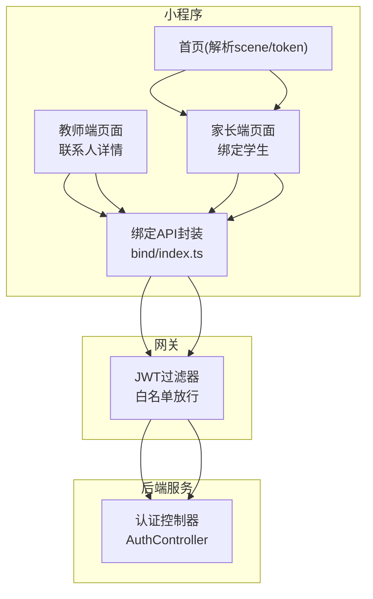
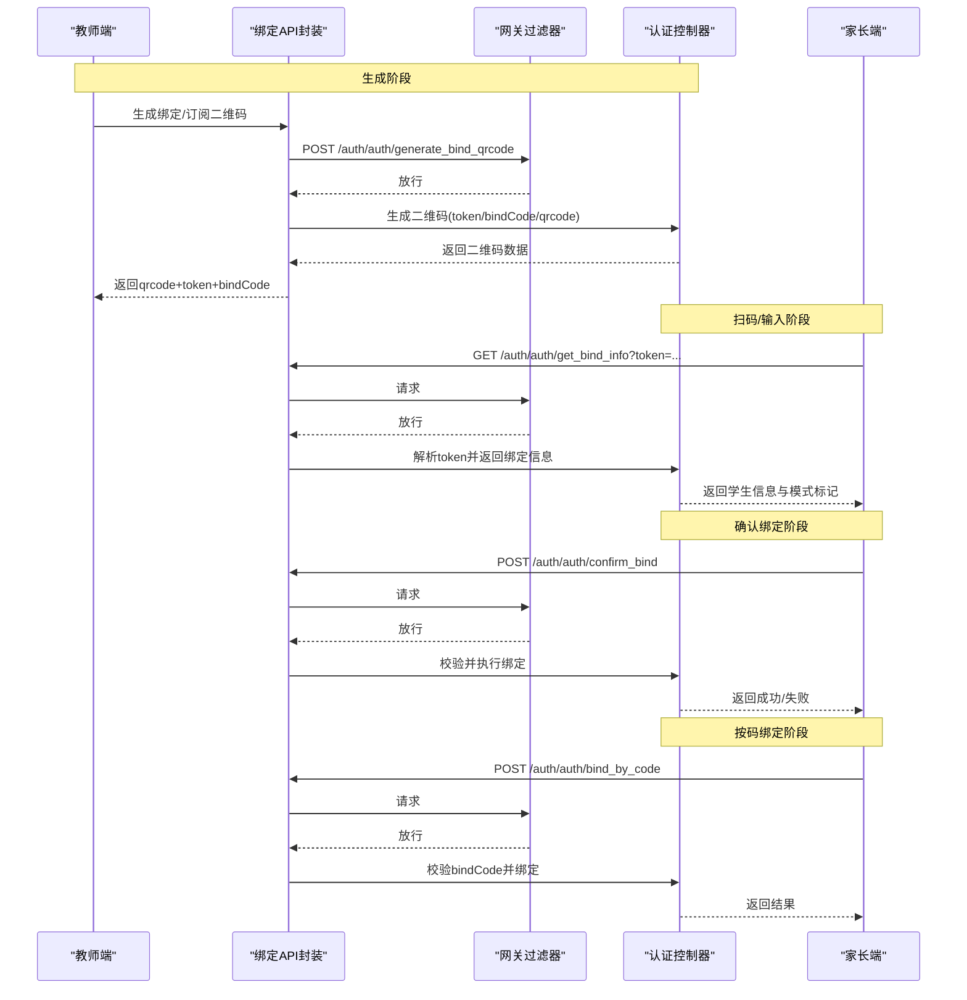
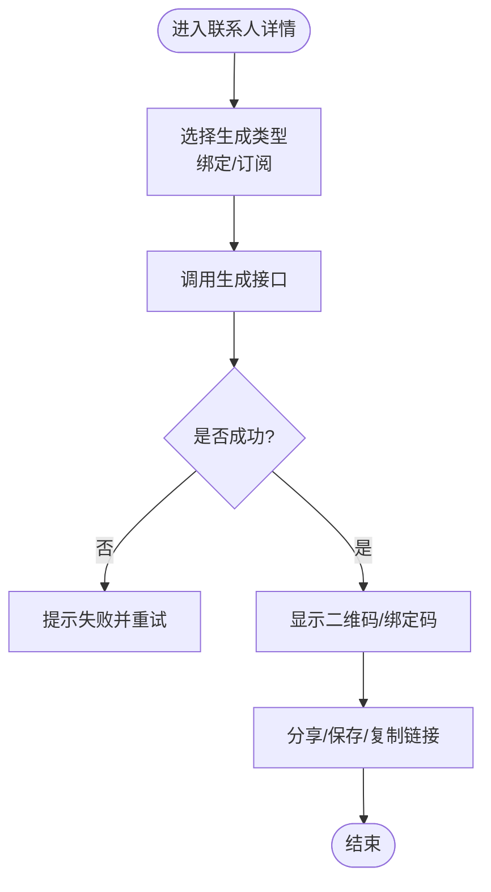
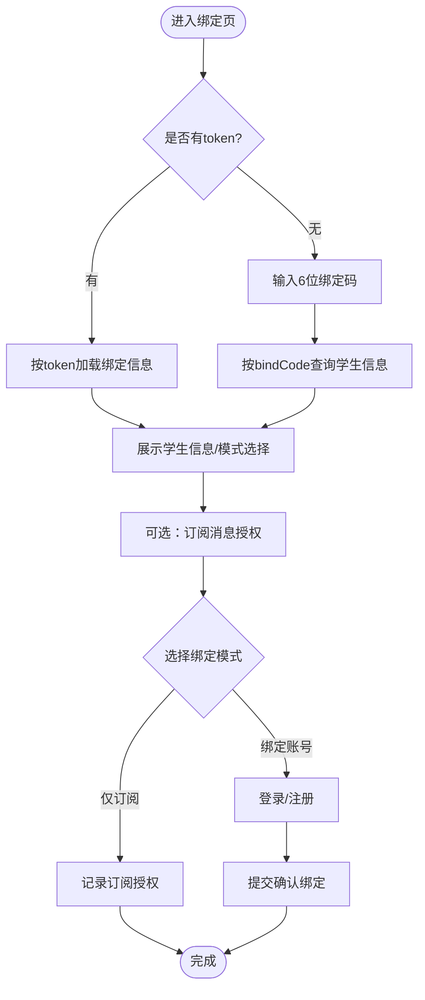
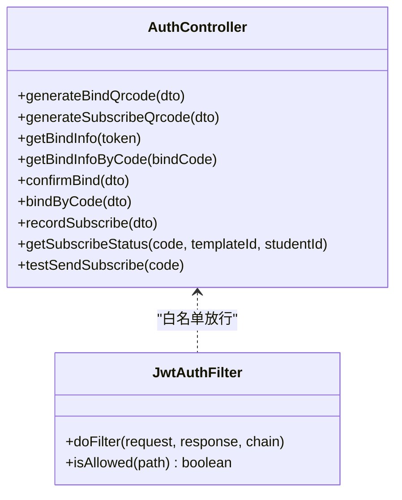
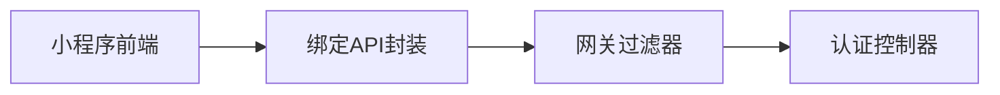

# 二维码绑定功能

<cite>
**本文引用的文件**   
- [AuthController.java](file://class_times_record_back/auth-service/src/main/java/com/shiroko/controller/AuthController.java)
- [JwtAuthFilter.java](file://class_times_record_back/gateway/src/main/java/com/shiroko/gateway/filter/JwtAuthFilter.java)
- [bind/index.ts](file://class_times_record/src/api/bind/index.ts)
- [bind-student/index.js](file://class_times_record/dist/build/mp-weixin/pages/main/parent/bind-student/index.js)
- [contact-detail/index.js](file://class_times_record/dist/build/mp-weixin/pages/main/teacher/contact-detail/index.js)
- [index.js（首页）](file://class_times_record/dist/build/mp-weixin/pages/index/index.js)
</cite>

## 目录
1. [简介](#简介)
2. [项目结构](#项目结构)
3. [核心组件](#核心组件)
4. [架构总览](#架构总览)
5. [详细组件分析](#详细组件分析)
6. [依赖关系分析](#依赖关系分析)
7. [性能与扩展建议](#性能与扩展建议)
8. [故障排查指南](#故障排查指南)
9. [结论](#结论)

## 简介
本文件围绕“家长与学生绑定”的二维码能力，系统化梳理从二维码生成、状态管理、绑定确认到订阅消息授权的全链路流程。文档面向开发者与产品实施人员，既提供端到端流程图与时序图，也给出接口契约、错误处理与扩展优化建议，帮助快速理解并安全扩展该能力。

## 项目结构
- 前端（小程序）：
  - 教师端：在“联系人详情”页生成“绑定二维码”或“仅订阅二维码”，支持分享与复制绑定码。
  - 家长端：通过扫码或输入绑定码进入“绑定学生”页，完成信息展示、订阅授权、账号绑定等动作。
- 后端（认证服务）：
  - 暴露二维码生成、绑定信息查询、绑定确认、按码绑定、订阅记录与查询等接口。
  - 网关层对部分接口放行免鉴权，保障扫码流程顺畅。

**图示来源** 
- [bind/index.ts](file://class_times_record/src/api/bind/index.ts)
- [contact-detail/index.js](file://class_times_record/dist/build/mp-weixin/pages/main/teacher/contact-detail/index.js)
- [bind-student/index.js](file://class_times_record/dist/build/mp-weixin/pages/main/parent/bind-student/index.js)
- [index.js（首页）](file://class_times_record/dist/build/mp-weixin/pages/index/index.js)
- [JwtAuthFilter.java](file://class_times_record_back/gateway/src/main/java/com/shiroko/gateway/filter/JwtAuthFilter.java)
- [AuthController.java](file://class_times_record_back/auth-service/src/main/java/com/shiroko/controller/AuthController.java)

**章节来源**
- [bind/index.ts](file://class_times_record/src/api/bind/index.ts)
- [contact-detail/index.js](file://class_times_record/dist/build/mp-weixin/pages/main/teacher/contact-detail/index.js)
- [bind-student/index.js](file://class_times_record/dist/build/mp-weixin/pages/main/parent/bind-student/index.js)
- [index.js（首页）](file://class_times_record/dist/build/mp-weixin/pages/index/index.js)
- [JwtAuthFilter.java](file://class_times_record_back/gateway/src/main/java/com/shiroko/gateway/filter/JwtAuthFilter.java)
- [AuthController.java](file://class_times_record_back/auth-service/src/main/java/com/shiroko/controller/AuthController.java)

## 核心组件
- 教师端生成器
  - 生成“绑定二维码”与“仅订阅二维码”，返回 qrcode、token、bindCode，支持分享与复制。
- 家长端绑定器
  - 支持扫码直达与手动输入绑定码两种路径；可先预览学生信息再确认绑定；可选“仅订阅”模式。
- 认证服务控制器
  - 提供二维码生成、绑定信息查询、绑定确认、按码绑定、订阅记录与查询、测试发送等接口。
- 网关鉴权过滤
  - 对绑定相关读接口与确认接口进行白名单放行，避免扫码流程被拦截。

**章节来源**
- [contact-detail/index.js](file://class_times_record/dist/build/mp-weixin/pages/main/teacher/contact-detail/index.js)
- [bind-student/index.js](file://class_times_record/dist/build/mp-weixin/pages/main/parent/bind-student/index.js)
- [AuthController.java](file://class_times_record_back/auth-service/src/main/java/com/shiroko/controller/AuthController.java)
- [JwtAuthFilter.java](file://class_times_record_back/gateway/src/main/java/com/shiroko/gateway/filter/JwtAuthFilter.java)

## 架构总览
下图展示了从教师端生成二维码到家长端完成绑定的完整调用链，以及订阅消息授权的并行分支。

**图示来源** 
- [contact-detail/index.js](file://class_times_record/dist/build/mp-weixin/pages/main/teacher/contact-detail/index.js)
- [bind/index.ts](file://class_times_record/src/api/bind/index.ts)
- [bind-student/index.js](file://class_times_record/dist/build/mp-weixin/pages/main/parent/bind-student/index.js)
- [AuthController.java](file://class_times_record_back/auth-service/src/main/java/com/shiroko/controller/AuthController.java)
- [JwtAuthFilter.java](file://class_times_record_back/gateway/src/main/java/com/shiroko/gateway/filter/JwtAuthFilter.java)

## 详细组件分析

### 教师端：二维码生成与分享
- 功能要点
  - 支持生成“绑定二维码”和“仅订阅二维码”。
  - 返回 qrcode（图片）、token（一次性链接参数）、bindCode（6位备用码）。
  - 支持将二维码保存到相册、复制绑定码、直接分享给微信好友。
- 关键交互
  - 调用生成接口获取二维码数据。
  - 根据返回的 token 构造分享路径，使家长点击后直接进入绑定页。
- 异常处理
  - 生成失败时提示用户重试。
  - 保存相册需权限，未授权时引导开启。

**图示来源** 
- [contact-detail/index.js](file://class_times_record/dist/build/mp-weixin/pages/main/teacher/contact-detail/index.js)
- [bind/index.ts](file://class_times_record/src/api/bind/index.ts)

**章节来源**
- [contact-detail/index.js](file://class_times_record/dist/build/mp-weixin/pages/main/teacher/contact-detail/index.js)
- [bind/index.ts](file://class_times_record/src/api/bind/index.ts)

### 家长端：扫码/输入绑定与确认
- 入口与路由
  - 首页解析 scene 或 token 参数，跳转至“绑定学生”页。
- 两种路径
  - 扫码直达：携带 token，自动拉取绑定信息。
  - 手动输入：输入6位 bindCode，先查询学生信息，再确认绑定。
- 绑定模式
  - 仅订阅：不创建/登录账号，仅记录订阅授权。
  - 绑定账号：可选择登录已有账号或注册新账号，完成后建立家长-学生关系。
- 订阅消息
  - 在绑定前后均可触发订阅授权，成功后记录授权次数与状态。

**图示来源** 
- [index.js（首页）](file://class_times_record/dist/build/mp-weixin/pages/index/index.js)
- [bind-student/index.js](file://class_times_record/dist/build/mp-weixin/pages/main/parent/bind-student/index.js)
- [bind/index.ts](file://class_times_record/src/api/bind/index.ts)

**章节来源**
- [index.js（首页）](file://class_times_record/dist/build/mp-weixin/pages/index/index.js)
- [bind-student/index.js](file://class_times_record/dist/build/mp-weixin/pages/main/parent/bind-student/index.js)
- [bind/index.ts](file://class_times_record/src/api/bind/index.ts)

### 后端：认证控制器与网关放行
- 控制器职责
  - 提供二维码生成、绑定信息查询、绑定确认、按码绑定、订阅记录与查询、测试发送等接口。
- 网关放行策略
  - 对绑定相关的读取与确认接口进行白名单放行，确保扫码流程无需登录即可访问。
- 安全与一致性
  - token 作为一次性凭证，用于承载绑定上下文；bindCode 作为6位短码，便于人工输入与传播。
  - 绑定前需校验 token/bindCode 有效性及过期时间（由服务端控制），防止重复使用。

**图示来源** 
- [AuthController.java](file://class_times_record_back/auth-service/src/main/java/com/shiroko/controller/AuthController.java)
- [JwtAuthFilter.java](file://class_times_record_back/gateway/src/main/java/com/shiroko/gateway/filter/JwtAuthFilter.java)

**章节来源**
- [AuthController.java](file://class_times_record_back/auth-service/src/main/java/com/shiroko/controller/AuthController.java)
- [JwtAuthFilter.java](file://class_times_record_back/gateway/src/main/java/com/shiroko/gateway/filter/JwtAuthFilter.java)

## 依赖关系分析
- 前端依赖
  - 教师端与家长端均依赖统一的绑定API封装，统一走 /auth/auth/* 路径。
- 网关依赖
  - 网关过滤器对绑定相关接口进行白名单放行，避免扫码流程被鉴权拦截。
- 后端依赖
  - 认证控制器对外暴露绑定与订阅相关能力，内部可能依赖业务服务与存储层（不在本次范围展开）。

**图示来源** 
- [bind/index.ts](file://class_times_record/src/api/bind/index.ts)
- [JwtAuthFilter.java](file://class_times_record_back/gateway/src/main/java/com/shiroko/gateway/filter/JwtAuthFilter.java)
- [AuthController.java](file://class_times_record_back/auth-service/src/main/java/com/shiroko/controller/AuthController.java)

**章节来源**
- [bind/index.ts](file://class_times_record/src/api/bind/index.ts)
- [JwtAuthFilter.java](file://class_times_record_back/gateway/src/main/java/com/shiroko/gateway/filter/JwtAuthFilter.java)
- [AuthController.java](file://class_times_record_back/auth-service/src/main/java/com/shiroko/controller/AuthController.java)

## 性能与扩展建议
- 二维码生命周期
  - 建议为 token 设置较短有效期（如几分钟），并在服务端维护一次使用标记，防止重放。
  - bindCode 可作为长期有效的辅助通道，但应限制每日生成次数与绑定尝试次数。
- 并发与幂等
  - confirm_bind 与 bind_by_code 需实现幂等保护，避免重复绑定导致冲突。
  - 对同一学生的多家长绑定场景，应在服务端做唯一性约束与冲突提示。
- 缓存与降级
  - get_bind_info 可由短期缓存加速，但需保证与 token 失效一致。
  - 订阅状态查询可结合本地缓存与增量更新，降低频繁请求压力。
- 可扩展点
  - 增加二维码渠道来源追踪（如教师ID、机构ID）。
  - 支持批量生成与导出二维码，便于线下物料打印。
  - 引入风控策略，对异常高频绑定行为进行限流与告警。

[本节为通用指导，不涉及具体文件分析]

## 故障排查指南
- 常见问题
  - 二维码无效或已过期：检查 token 是否过期或被使用过；重新生成二维码。
  - 绑定码无效：确认6位 bindCode 是否正确且未被使用；必要时重新生成。
  - 订阅授权失败：检查微信 code 是否有效、模板 ID 是否正确、授权弹窗是否被拒绝。
- 定位步骤
  - 前端日志：查看生成/查询/确认接口的请求与响应。
  - 网关日志：确认接口是否被放行，是否存在鉴权拦截。
  - 后端日志：核对绑定逻辑、冲突检测与事务回滚情况。
- 恢复建议
  - 若出现重复绑定，优先清理脏数据并提示用户重试。
  - 若订阅次数耗尽，引导用户重新授权或等待重置周期。

[本节为通用指导，不涉及具体文件分析]

## 结论
本方案以“token + bindCode”双通道支撑二维码绑定，兼顾便捷性与安全性。通过网关白名单放行与一次性凭证机制，保障了扫码流程的流畅与抗重放能力。配合订阅消息授权，形成完整的家校通知闭环。建议在后续迭代中完善幂等、限流与审计能力，进一步提升系统的稳定性与可观测性。