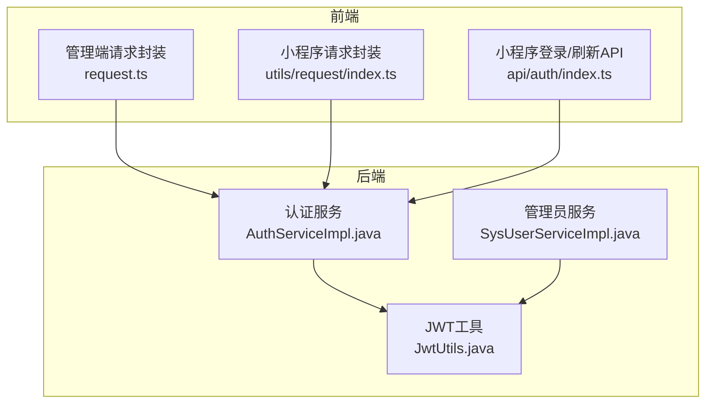
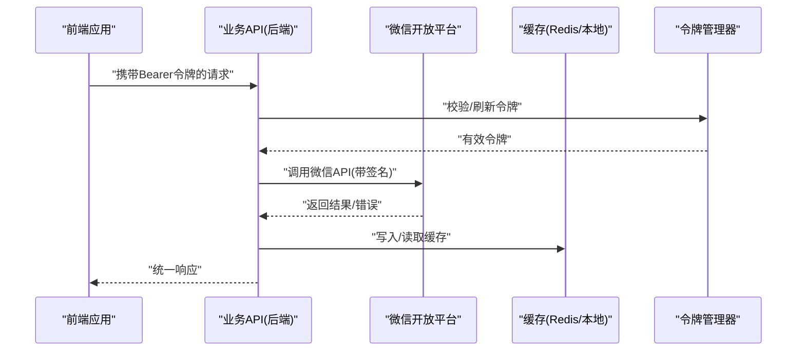
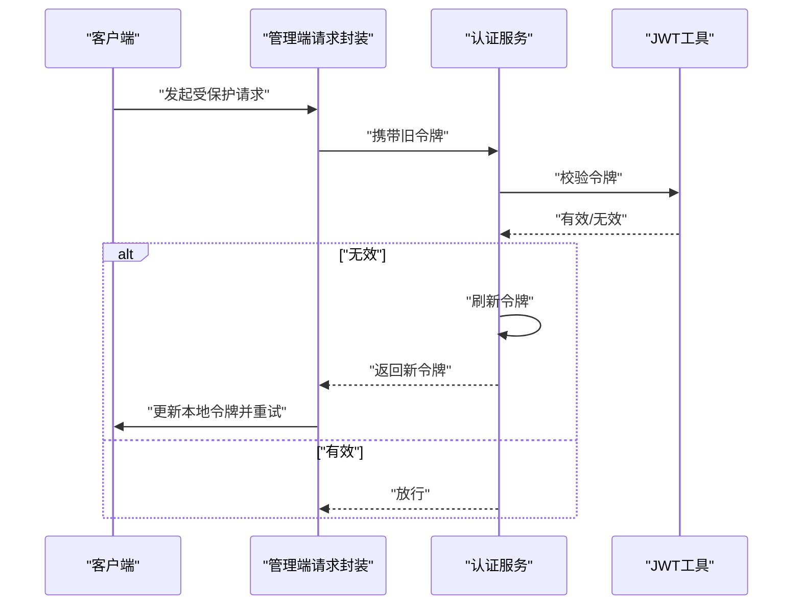
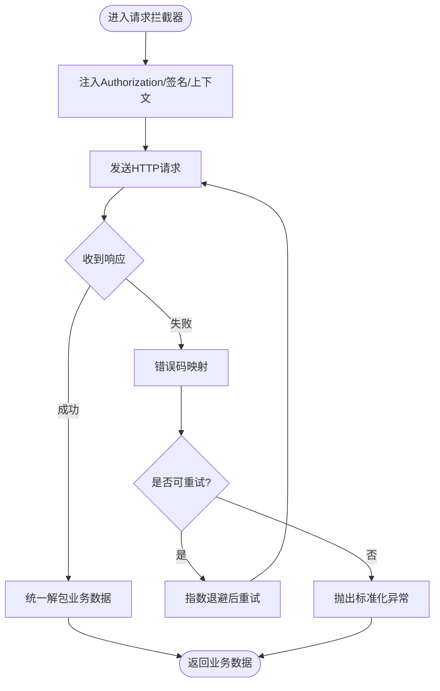
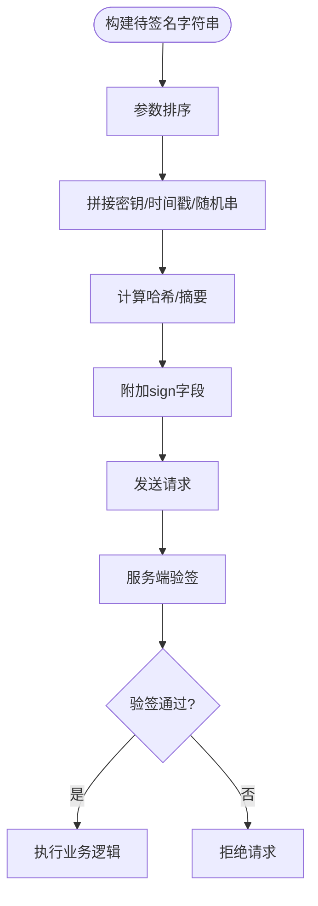
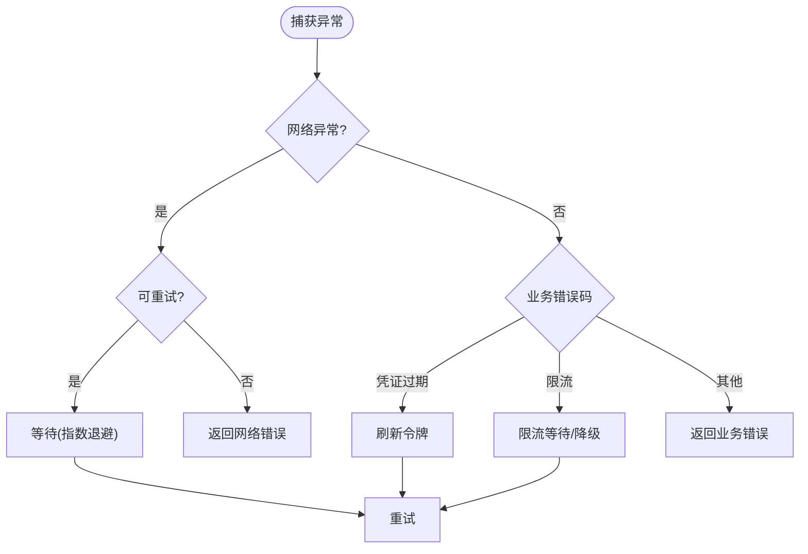
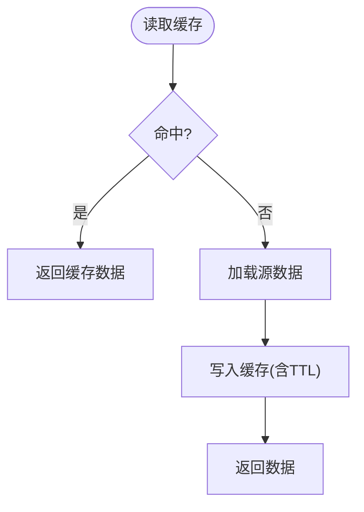
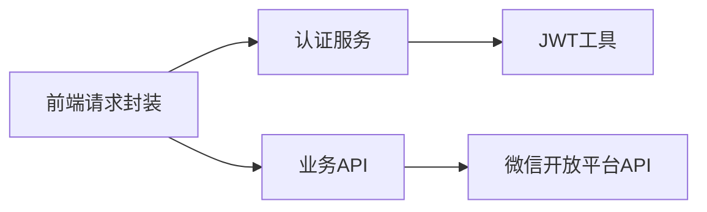

# 微信API封装

<cite>
**本文引用的文件**   
- [class_record_admin_front/src/utils/request.ts](file://class_record_admin_front/src/utils/request.ts)
- [class_times_record/src/api/auth/index.ts](file://class_times_record/src/api/auth/index.ts)
- [class_times_record/src/utils/request/index.ts](file://class_times_record/src/utils/request/index.ts)
- [class_times_record/src/types/http.d.ts](file://class_times_record/src/types/http.d.ts)
- [class_times_record_back/auth-service/src/main/java/com/shiroko/service/impl/AuthServiceImpl.java](file://class_times_record_back/auth-service/src/main/java/com/shiroko/service/impl/AuthServiceImpl.java)
- [class_times_record_back/admin-service/src/main/java/com/shiroko/service/impl/SysUserServiceImpl.java](file://class_times_record_back/admin-service/src/main/java/com/shiroko/service/impl/SysUserServiceImpl.java)
- [class_times_record_back/common/src/main/java/com/shiroko/util/JwtUtils.java](file://class_times_record_back/common/src/main/java/com/shiroko/util/JwtUtils.java)
</cite>

## 目录
1. [简介](#简介)
2. [项目结构](#项目结构)
3. [核心组件](#核心组件)
4. [架构总览](#架构总览)
5. [详细组件分析](#详细组件分析)
6. [依赖关系分析](#依赖关系分析)
7. [性能考虑](#性能考虑)
8. [故障排查指南](#故障排查指南)
9. [结论](#结论)
10. [附录](#附录)

## 简介
本文件面向“微信API封装层”的设计与实现，聚焦于后端服务对微信开放平台API的统一封装。内容涵盖：
- HTTP客户端配置、请求签名验证、响应数据解析等通用能力
- 访问令牌（access_token）的获取、自动刷新与多实例共享策略
- 错误处理与重试机制（网络异常、业务错误、限流）
- 缓存策略（用户信息、模板消息等）
- API封装类接口定义、配置参数与使用示例
- 自定义扩展与性能调优建议

说明：当前仓库未包含直接调用微信开放平台的代码实现。本文基于现有前后端鉴权与HTTP封装实践，给出符合微信生态的封装方案与落地指引，并在需要处引用仓库中已有的相关实现作为参考。

## 项目结构
本项目为多模块工程，前端包含管理端与小程序端，后端包含网关与多个微服务。与“微信API封装”最相关的部分包括：
- 后端统一JWT工具与认证服务（用于理解令牌生命周期与刷新流程）
- 前端HTTP封装（用于理解请求拦截、令牌注入与刷新策略）
- 类型定义（用于规范请求/响应结构）

图表来源
- [class_record_admin_front/src/utils/request.ts](file://class_record_admin_front/src/utils/request.ts)
- [class_times_record/src/utils/request/index.ts](file://class_times_record/src/utils/request/index.ts)
- [class_times_record/src/api/auth/index.ts](file://class_times_record/src/api/auth/index.ts)
- [class_times_record_back/auth-service/src/main/java/com/shiroko/service/impl/AuthServiceImpl.java](file://class_times_record_back/auth-service/src/main/java/com/shiroko/service/impl/AuthServiceImpl.java)
- [class_times_record_back/admin-service/src/main/java/com/shiroko/service/impl/SysUserServiceImpl.java](file://class_times_record_back/admin-service/src/main/java/com/shiroko/service/impl/SysUserServiceImpl.java)
- [class_times_record_back/common/src/main/java/com/shiroko/util/JwtUtils.java](file://class_times_record_back/common/src/main/java/com/shiroko/util/JwtUtils.java)

章节来源
- [class_record_admin_front/src/utils/request.ts](file://class_record_admin_front/src/utils/request.ts)
- [class_times_record/src/utils/request/index.ts](file://class_times_record/src/utils/request/index.ts)
- [class_times_record/src/api/auth/index.ts](file://class_times_record/src/api/auth/index.ts)
- [class_times_record_back/auth-service/src/main/java/com/shiroko/service/impl/AuthServiceImpl.java](file://class_times_record_back/auth-service/src/main/java/com/shiroko/service/impl/AuthServiceImpl.java)
- [class_times_record_back/admin-service/src/main/java/com/shiroko/service/impl/SysUserServiceImpl.java](file://class_times_record_back/admin-service/src/main/java/com/shiroko/service/impl/SysUserServiceImpl.java)
- [class_times_record_back/common/src/main/java/com/shiroko/util/JwtUtils.java](file://class_times_record_back/common/src/main/java/com/shiroko/util/JwtUtils.java)

## 核心组件
- HTTP客户端配置
  - 统一基础URL、超时、重试次数、退避策略、日志开关等
  - 请求拦截器：自动注入Authorization头、租户/机构标识、签名参数
  - 响应拦截器：统一解包、错误码映射、幂等处理
- 访问令牌管理
  - access_token获取与缓存（本地内存+分布式缓存）
  - 自动刷新：过期前预取、并发安全、失败回退
  - 多实例共享：通过Redis或本地锁保证单点刷新
- 签名与验签
  - 请求参数排序、拼接、加盐、生成签名
  - 响应验签：校验签名、时间戳防重放
- 错误处理与重试
  - 网络异常：指数退避重试
  - 业务错误：按错误码分类处理（如限流、凭证失效）
  - 限流：滑动窗口/令牌桶控制，降级返回
- 缓存策略
  - 用户信息、模板消息、JSAPI票据等热点数据缓存
  - 缓存键设计、TTL、穿透/雪崩防护

章节来源
- [class_record_admin_front/src/utils/request.ts](file://class_record_admin_front/src/utils/request.ts)
- [class_times_record/src/utils/request/index.ts](file://class_times_record/src/utils/request/index.ts)
- [class_times_record/src/api/auth/index.ts](file://class_times_record/src/api/auth/index.ts)
- [class_times_record_back/auth-service/src/main/java/com/shiroko/service/impl/AuthServiceImpl.java](file://class_times_record_back/auth-service/src/main/java/com/shiroko/service/impl/AuthServiceImpl.java)
- [class_times_record_back/admin-service/src/main/java/com/shiroko/service/impl/SysUserServiceImpl.java](file://class_times_record_back/admin-service/src/main/java/com/shiroko/service/impl/SysUserServiceImpl.java)
- [class_times_record_back/common/src/main/java/com/shiroko/util/JwtUtils.java](file://class_times_record_back/common/src/main/java/com/shiroko/util/JwtUtils.java)

## 架构总览
下图展示“微信API封装层”在整体系统中的位置与交互：前端通过HTTP封装发起业务请求；后端认证服务负责签发/刷新令牌；封装层在后端侧负责调用微信开放平台API并处理令牌、签名、重试与缓存。

图表来源
- [class_record_admin_front/src/utils/request.ts](file://class_record_admin_front/src/utils/request.ts)
- [class_times_record/src/utils/request/index.ts](file://class_times_record/src/utils/request/index.ts)
- [class_times_record/src/api/auth/index.ts](file://class_times_record/src/api/auth/index.ts)
- [class_times_record_back/auth-service/src/main/java/com/shiroko/service/impl/AuthServiceImpl.java](file://class_times_record_back/auth-service/src/main/java/com/shiroko/service/impl/AuthServiceImpl.java)
- [class_times_record_back/admin-service/src/main/java/com/shiroko/service/impl/SysUserServiceImpl.java](file://class_times_record_back/admin-service/src/main/java/com/shiroko/service/impl/SysUserServiceImpl.java)
- [class_times_record_back/common/src/main/java/com/shiroko/util/JwtUtils.java](file://class_times_record_back/common/src/main/java/com/shiroko/util/JwtUtils.java)

## 详细组件分析

### 访问令牌管理与刷新流程
- 令牌获取与刷新
  - 后端认证服务提供刷新接口，内部使用JWT工具创建新令牌
  - 前端在响应中检测到新令牌时更新本地存储并继续请求
- 并发安全
  - 多实例场景下，通过分布式锁或缓存原子操作避免重复刷新
- 失效处理
  - 当令牌无效时，触发刷新流程；若刷新失败则引导重新登录

图表来源
- [class_record_admin_front/src/utils/request.ts](file://class_record_admin_front/src/utils/request.ts)
- [class_times_record_back/auth-service/src/main/java/com/shiroko/service/impl/AuthServiceImpl.java](file://class_times_record_back/auth-service/src/main/java/com/shiroko/service/impl/AuthServiceImpl.java)
- [class_times_record_back/admin-service/src/main/java/com/shiroko/service/impl/SysUserServiceImpl.java](file://class_times_record_back/admin-service/src/main/java/com/shiroko/service/impl/SysUserServiceImpl.java)
- [class_times_record_back/common/src/main/java/com/shiroko/util/JwtUtils.java](file://class_times_record_back/common/src/main/java/com/shiroko/util/JwtUtils.java)

章节来源
- [class_record_admin_front/src/utils/request.ts](file://class_record_admin_front/src/utils/request.ts)
- [class_times_record/src/api/auth/index.ts](file://class_times_record/src/api/auth/index.ts)
- [class_times_record_back/auth-service/src/main/java/com/shiroko/service/impl/AuthServiceImpl.java](file://class_times_record_back/auth-service/src/main/java/com/shiroko/service/impl/AuthServiceImpl.java)
- [class_times_record_back/admin-service/src/main/java/com/shiroko/service/impl/SysUserServiceImpl.java](file://class_times_record_back/admin-service/src/main/java/com/shiroko/service/impl/SysUserServiceImpl.java)
- [class_times_record_back/common/src/main/java/com/shiroko/util/JwtUtils.java](file://class_times_record_back/common/src/main/java/com/shiroko/util/JwtUtils.java)

### HTTP客户端配置与拦截器
- 请求拦截器
  - 自动附加Authorization头
  - 统一添加签名参数（如timestamp、nonce、sign）
  - 记录请求上下文（traceId、租户ID）
- 响应拦截器
  - 统一解包业务数据
  - 错误码映射到标准异常
  - 针对特定错误码触发刷新或重试

图表来源
- [class_record_admin_front/src/utils/request.ts](file://class_record_admin_front/src/utils/request.ts)
- [class_times_record/src/utils/request/index.ts](file://class_times_record/src/utils/request/index.ts)

章节来源
- [class_record_admin_front/src/utils/request.ts](file://class_record_admin_front/src/utils/request.ts)
- [class_times_record/src/utils/request/index.ts](file://class_times_record/src/utils/request/index.ts)

### 签名与验签流程
- 请求签名
  - 将请求参数按字典序排序
  - 拼接密钥与时间戳、随机串
  - 计算哈希值作为签名
- 响应验签
  - 服务端根据相同算法计算签名并与响应中的签名比对
  - 校验时间戳防止重放攻击

[此图为概念性流程图，不直接映射具体源码文件]

### 错误处理与重试机制
- 网络异常
  - 连接超时、DNS解析失败、SSL握手失败等
  - 采用指数退避与最大重试次数限制
- 业务错误
  - 凭证过期：触发刷新流程
  - 限流：等待后重试或降级
  - 参数错误：快速失败并提示
- 限流处理
  - 基于滑动窗口统计最近N秒内失败次数
  - 超过阈值则暂停请求，等待冷却

[此图为概念性流程图，不直接映射具体源码文件]

### 缓存策略
- 缓存对象
  - 用户信息、模板消息、JSAPI票据、access_token等
- 缓存键设计
  - 以“实体类型:业务主键:维度”组织，避免冲突
- TTL与一致性
  - 设置合理TTL，结合主动失效与被动过期
  - 热点数据采用本地缓存+分布式缓存双层结构
- 穿透/雪崩防护
  - 空值缓存、互斥锁、随机抖动

[此图为概念性流程图，不直接映射具体源码文件]

### API封装类接口定义与使用示例
- 接口定义要点
  - 统一的请求方法：get/post/put/delete
  - 配置项：baseUrl、timeout、retries、backoff、headers、signer
  - 回调钩子：onRequest、onResponse、onError、onRetry
- 使用示例（描述性）
  - 初始化封装类并传入配置
  - 调用封装方法发起请求
  - 在onError中处理限流与重试
  - 在onResponse中解析业务数据

[本节为接口与用法说明，不直接引用具体源码文件]

## 依赖关系分析
- 前端HTTP封装依赖后端认证服务进行令牌校验与刷新
- 后端认证服务依赖JWT工具生成与校验令牌
- 封装层对外暴露统一接口，屏蔽底层差异

图表来源
- [class_record_admin_front/src/utils/request.ts](file://class_record_admin_front/src/utils/request.ts)
- [class_times_record/src/utils/request/index.ts](file://class_times_record/src/utils/request/index.ts)
- [class_times_record/src/api/auth/index.ts](file://class_times_record/src/api/auth/index.ts)
- [class_times_record_back/auth-service/src/main/java/com/shiroko/service/impl/AuthServiceImpl.java](file://class_times_record_back/auth-service/src/main/java/com/shiroko/service/impl/AuthServiceImpl.java)
- [class_times_record_back/admin-service/src/main/java/com/shiroko/service/impl/SysUserServiceImpl.java](file://class_times_record_back/admin-service/src/main/java/com/shiroko/service/impl/SysUserServiceImpl.java)
- [class_times_record_back/common/src/main/java/com/shiroko/util/JwtUtils.java](file://class_times_record_back/common/src/main/java/com/shiroko/util/JwtUtils.java)

章节来源
- [class_record_admin_front/src/utils/request.ts](file://class_record_admin_front/src/utils/request.ts)
- [class_times_record/src/utils/request/index.ts](file://class_times_record/src/utils/request/index.ts)
- [class_times_record/src/api/auth/index.ts](file://class_times_record/src/api/auth/index.ts)
- [class_times_record_back/auth-service/src/main/java/com/shiroko/service/impl/AuthServiceImpl.java](file://class_times_record_back/auth-service/src/main/java/com/shiroko/service/impl/AuthServiceImpl.java)
- [class_times_record_back/admin-service/src/main/java/com/shiroko/service/impl/SysUserServiceImpl.java](file://class_times_record_back/admin-service/src/main/java/com/shiroko/service/impl/SysUserServiceImpl.java)
- [class_times_record_back/common/src/main/java/com/shiroko/util/JwtUtils.java](file://class_times_record_back/common/src/main/java/com/shiroko/util/JwtUtils.java)

## 性能考虑
- 连接池与复用
  - 合理设置连接池大小、空闲回收、长连接复用
- 超时与重试
  - 区分读/写超时，避免长尾请求阻塞
  - 重试需幂等且具备退避策略
- 缓存命中率
  - 热点数据优先缓存，减少外部依赖压力
- 序列化与压缩
  - 选择高效序列化格式，必要时启用Gzip
- 监控与指标
  - 采集QPS、延迟、错误率、重试次数、缓存命中率

[本节为通用性能建议，不直接引用具体源码文件]

## 故障排查指南
- 常见问题定位
  - 令牌无效：检查刷新流程与本地存储同步
  - 签名失败：核对参数排序、密钥、时间戳
  - 限流频繁：观察限流阈值与退避策略
  - 缓存不一致：检查TTL与失效策略
- 诊断手段
  - 开启请求/响应日志，记录traceId
  - 增加关键路径埋点（刷新、重试、缓存命中）
  - 使用压测工具模拟峰值流量

章节来源
- [class_record_admin_front/src/utils/request.ts](file://class_record_admin_front/src/utils/request.ts)
- [class_times_record/src/api/auth/index.ts](file://class_times_record/src/api/auth/index.ts)
- [class_times_record_back/auth-service/src/main/java/com/shiroko/service/impl/AuthServiceImpl.java](file://class_times_record_back/auth-service/src/main/java/com/shiroko/service/impl/AuthServiceImpl.java)
- [class_times_record_back/admin-service/src/main/java/com/shiroko/service/impl/SysUserServiceImpl.java](file://class_times_record_back/admin-service/src/main/java/com/shiroko/service/impl/SysUserServiceImpl.java)
- [class_times_record_back/common/src/main/java/com/shiroko/util/JwtUtils.java](file://class_times_record_back/common/src/main/java/com/shiroko/util/JwtUtils.java)

## 结论
通过对HTTP客户端配置、令牌管理、签名验签、错误重试与缓存策略的系统化封装，可有效提升微信API调用的稳定性与可维护性。建议在多实例部署中引入分布式缓存与锁机制，确保令牌刷新与缓存一致；同时完善监控与告警，保障线上问题可观测、可定位、可恢复。

## 附录
- 配置参数清单（示例）
  - baseUrl、timeout、retries、backoffBase、backoffMax、headers、signKey、cacheTtl
- 扩展指南
  - 新增API：继承统一封装基类，实现签名与解析逻辑
  - 自定义错误码：注册错误码映射与处理策略
  - 插件化重试：支持不同接口的差异化重试策略

[本节为补充说明，不直接引用具体源码文件]