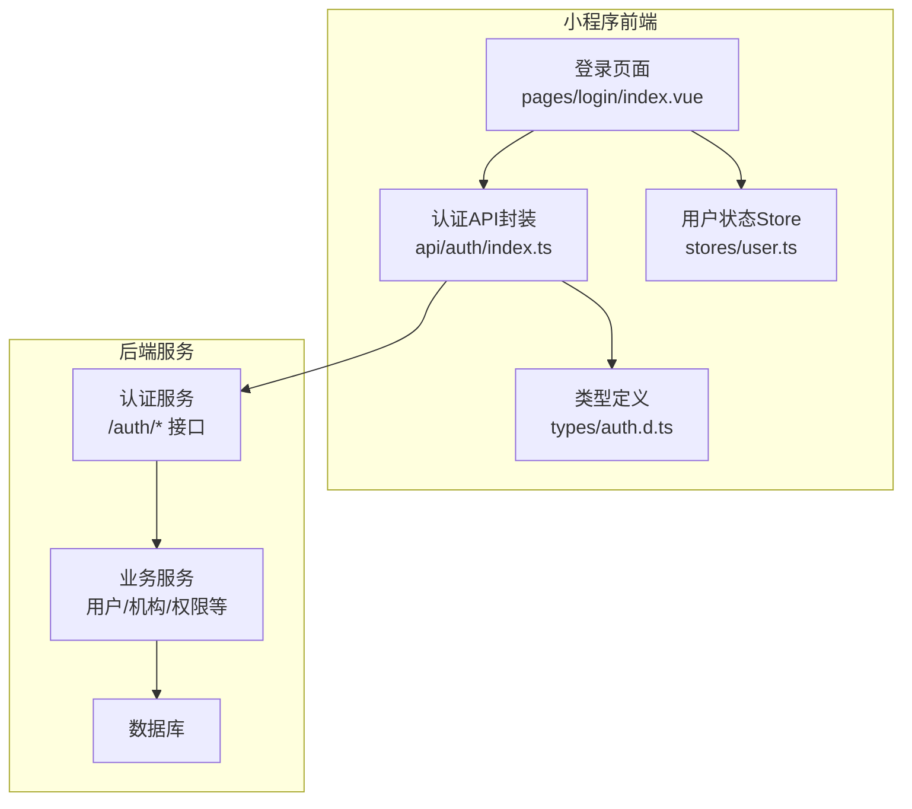
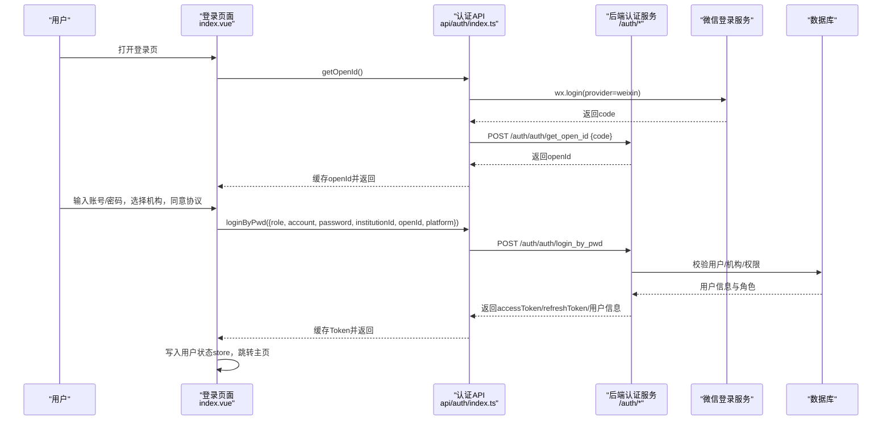
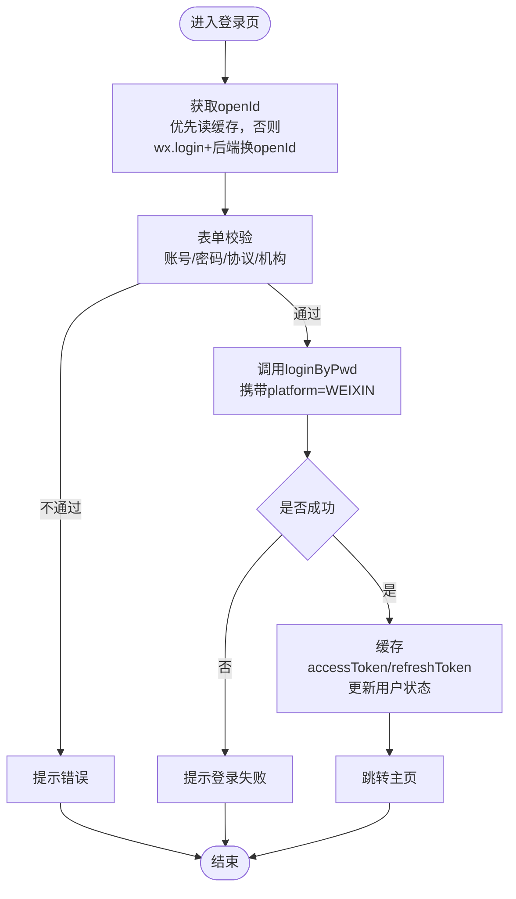
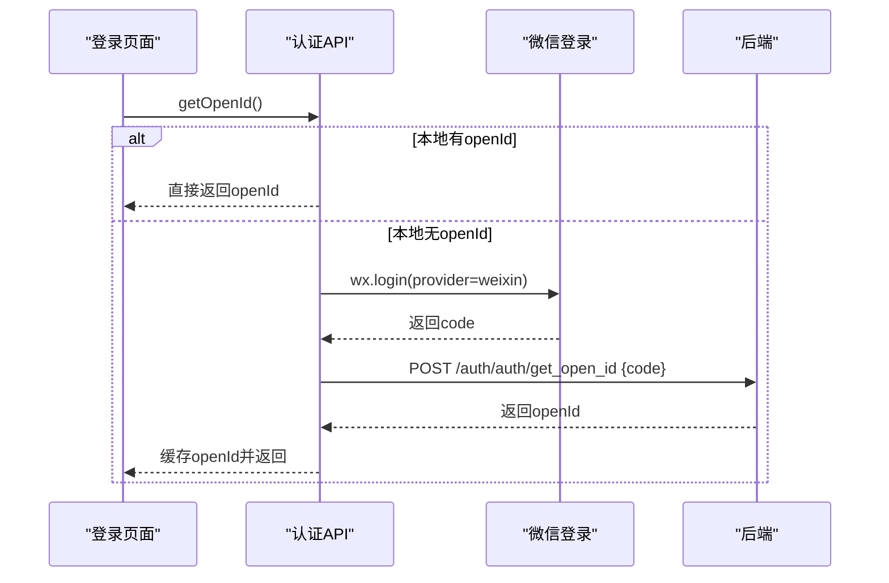
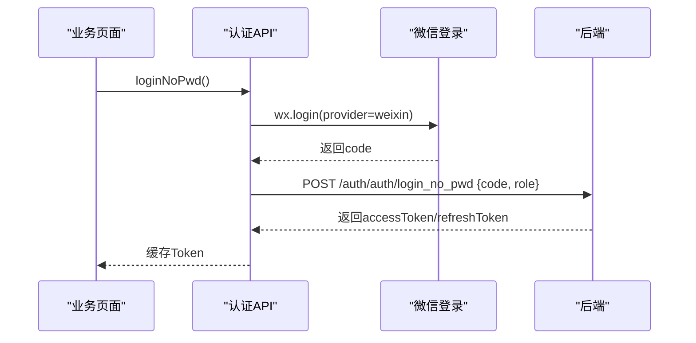
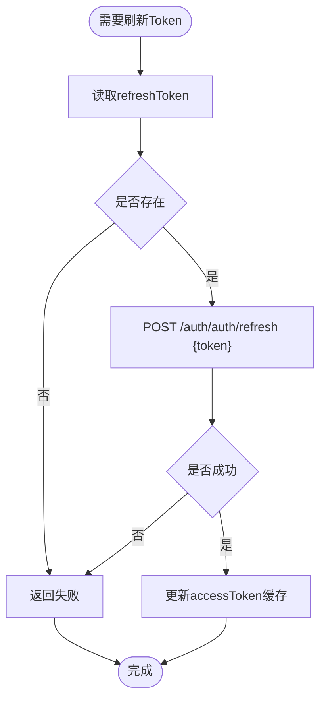
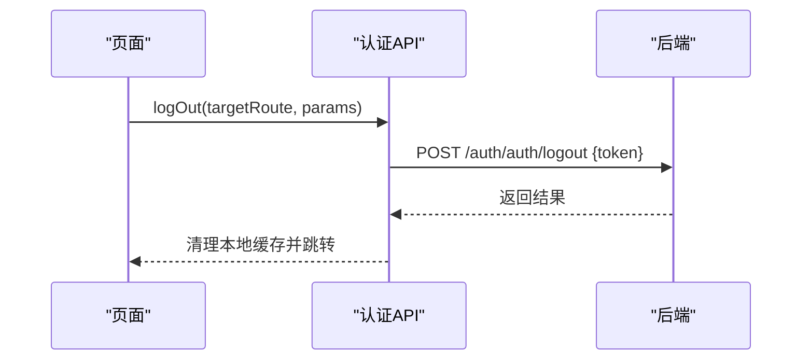
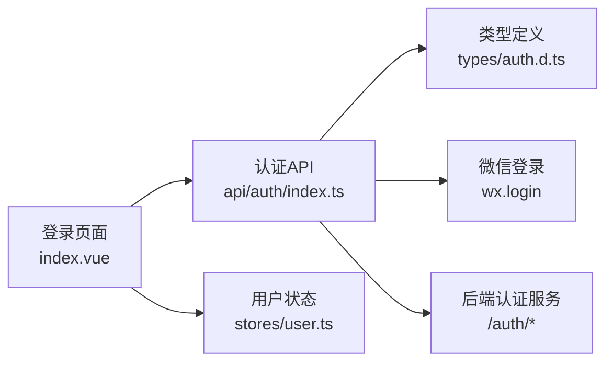

# 微信小程序登录

<cite>
**本文引用的文件**
- [class_times_record/src/pages/login/index.vue](file://class_times_record/src/pages/login/index.vue)
- [class_times_record/src/api/auth/index.ts](file://class_times_record/src/api/auth/index.ts)
- [class_times_record/src/types/auth.d.ts](file://class_times_record/src/types/auth.d.ts)
- [class_times_record/src/stores/user.ts](file://class_times_record/src/stores/user.ts)
</cite>

## 目录
1. [简介](#简介)
2. [项目结构](#项目结构)
3. [核心组件](#核心组件)
4. [架构总览](#架构总览)
5. [详细组件分析](#详细组件分析)
6. [依赖分析](#依赖分析)
7. [性能考虑](#性能考虑)
8. [故障排查指南](#故障排查指南)
9. [结论](#结论)
10. [附录](#附录)

## 简介
本文件面向开发者，系统化梳理并说明本项目中“微信小程序登录”的完整实现与扩展点。内容覆盖：
- 前端通过 wx.login 获取 code、调用后端换取 openId 的流程
- 账号密码登录、免密登录、Token 刷新、退出登录等认证链路
- 用户身份识别（新用户/老用户、机构绑定）在前端的参与方式
- JWT 令牌在小程序侧的生成与验证（由后端负责，前端仅缓存与刷新）
- 微信用户信息缓存策略与同步更新机制
- 登录接口请求参数、响应格式与错误处理
- 扩展与调试建议

## 项目结构
与登录相关的前端代码主要分布在以下位置：
- 登录页面：class_times_record/src/pages/login/index.vue
- 认证 API 封装：class_times_record/src/api/auth/index.ts
- 类型定义：class_times_record/src/types/auth.d.ts
- 用户状态管理：class_times_record/src/stores/user.ts

图表来源
- [class_times_record/src/pages/login/index.vue:1-344](file://class_times_record/src/pages/login/index.vue#L1-L344)
- [class_times_record/src/api/auth/index.ts:1-213](file://class_times_record/src/api/auth/index.ts#L1-L213)
- [class_times_record/src/stores/user.ts:1-28](file://class_times_record/src/stores/user.ts#L1-L28)
- [class_times_record/src/types/auth.d.ts:1-27](file://class_times_record/src/types/auth.d.ts#L1-L27)

章节来源
- [class_times_record/src/pages/login/index.vue:1-344](file://class_times_record/src/pages/login/index.vue#L1-L344)
- [class_times_record/src/api/auth/index.ts:1-213](file://class_times_record/src/api/auth/index.ts#L1-L213)
- [class_times_record/src/stores/user.ts:1-28](file://class_times_record/src/stores/user.ts#L1-L28)
- [class_times_record/src/types/auth.d.ts:1-27](file://class_times_record/src/types/auth.d.ts#L1-L27)

## 核心组件
- 登录页面（index.vue）
  - 负责表单校验、选择/添加机构、获取 openId、发起登录、存储 Token、跳转主页
- 认证 API（api/auth/index.ts）
  - 提供 getOpenId、loginByPwd、loginNoPwd、loginByToken、refreshAccessToken、logOut 等方法
- 用户状态（stores/user.ts）
  - 维护当前用户信息，提供设置与清除方法
- 类型定义（types/auth.d.ts）
  - 定义登录请求/响应、刷新 Token 等数据结构

章节来源
- [class_times_record/src/pages/login/index.vue:131-344](file://class_times_record/src/pages/login/index.vue#L131-L344)
- [class_times_record/src/api/auth/index.ts:1-213](file://class_times_record/src/api/auth/index.ts#L1-L213)
- [class_times_record/src/stores/user.ts:1-28](file://class_times_record/src/stores/user.ts#L1-L28)
- [class_times_record/src/types/auth.d.ts:1-27](file://class_times_record/src/types/auth.d.ts#L1-L27)

## 架构总览
下图展示了小程序登录的关键交互路径：前端获取 code、换取 openId、执行登录、缓存 Token、刷新与登出。

图表来源
- [class_times_record/src/pages/login/index.vue:146-340](file://class_times_record/src/pages/login/index.vue#L146-L340)
- [class_times_record/src/api/auth/index.ts:25-77](file://class_times_record/src/api/auth/index.ts#L25-L77)

## 详细组件分析

### 登录流程（账号密码 + 微信标识）
- 关键步骤
  - 页面加载时尝试获取 openId；若本地无缓存则调用 wx.login 获取 code，再向后端换取 openId 并缓存
  - 用户填写账号、密码、选择或添加机构，勾选协议后提交
  - 调用 loginByPwd 发送平台标识为 WEIXIN，后端完成鉴权并返回 accessToken/refreshToken
  - 前端缓存 Token，更新用户状态，跳转到主页
- 数据流
  - 请求参数包含 role、account、password、institutionId、openId、platform
  - 响应包含 accessToken、refreshToken、user 信息
- 错误处理
  - 表单校验失败提示
  - 网络异常与登录失败统一提示
  - 退出登录时清理本地缓存并通知后端

图表来源
- [class_times_record/src/pages/login/index.vue:276-340](file://class_times_record/src/pages/login/index.vue#L276-L340)
- [class_times_record/src/api/auth/index.ts:59-77](file://class_times_record/src/api/auth/index.ts#L59-L77)

章节来源
- [class_times_record/src/pages/login/index.vue:146-340](file://class_times_record/src/pages/login/index.vue#L146-L340)
- [class_times_record/src/api/auth/index.ts:59-77](file://class_times_record/src/api/auth/index.ts#L59-L77)

### OpenID 获取与缓存
- 逻辑要点
  - 优先读取本地 openId 缓存
  - 若无缓存，调用 wx.login 获取 code，再调用 /auth/auth/get_open_id 换取 openId
  - 成功后将 openId 写入本地缓存
- 使用场景
  - 登录前获取 openId，用于后续登录接口携带
  - 退出登录时清理 openId 缓存

图表来源
- [class_times_record/src/api/auth/index.ts:25-52](file://class_times_record/src/api/auth/index.ts#L25-L52)
- [class_times_record/src/pages/login/index.vue:146-161](file://class_times_record/src/pages/login/index.vue#L146-L161)

章节来源
- [class_times_record/src/api/auth/index.ts:25-52](file://class_times_record/src/api/auth/index.ts#L25-L52)
- [class_times_record/src/pages/login/index.vue:146-161](file://class_times_record/src/pages/login/index.vue#L146-L161)

### 免密登录（基于微信 code）
- 适用场景
  - 已存在用户且无需密码即可自动登录
- 流程
  - 从用户状态中读取角色
  - 调用 wx.login 获取 code
  - 调用 /auth/auth/login_no_pwd 完成登录并缓存 Token

图表来源
- [class_times_record/src/api/auth/index.ts:83-102](file://class_times_record/src/api/auth/index.ts#L83-L102)

章节来源
- [class_times_record/src/api/auth/index.ts:83-102](file://class_times_record/src/api/auth/index.ts#L83-L102)

### Token 刷新机制
- 触发时机
  - 当 accessToken 过期或需要续期时
- 流程
  - 读取本地 refreshToken
  - 调用 /auth/auth/refresh 刷新 accessToken
  - 成功后更新本地 accessToken 缓存
- 注意
  - 若 refreshToken 不存在，直接返回失败

图表来源
- [class_times_record/src/api/auth/index.ts:133-155](file://class_times_record/src/api/auth/index.ts#L133-L155)

章节来源
- [class_times_record/src/api/auth/index.ts:133-155](file://class_times_record/src/api/auth/index.ts#L133-L155)

### 退出登录
- 操作
  - 清空用户状态
  - 调用后端登出接口（携带 token）
  - 清理本地 accessToken、refreshToken、openId
  - 提示并跳转目标路由

图表来源
- [class_times_record/src/api/auth/index.ts:163-188](file://class_times_record/src/api/auth/index.ts#L163-L188)

章节来源
- [class_times_record/src/api/auth/index.ts:163-188](file://class_times_record/src/api/auth/index.ts#L163-L188)

### 用户身份识别与关联（前端视角）
- 新用户注册/老用户登录
  - 该逻辑主要由后端在 /auth/auth/login_by_pwd 中处理，前端仅传递必要参数（如 openId、role、institutionId）
- unionid 关联
  - 前端未直接处理 unionid，通常由后端根据微信开放平台能力进行多端用户合并
- 机构绑定
  - 登录前可选择或添加机构（通过 openId 查询历史机构列表，或通过机构码查询），并将 institutionId 随登录请求一并提交

章节来源
- [class_times_record/src/pages/login/index.vue:146-253](file://class_times_record/src/pages/login/index.vue#L146-L253)
- [class_times_record/src/api/auth/index.ts:59-77](file://class_times_record/src/api/auth/index.ts#L59-L77)

### JWT 令牌管理与验证（前后端协作）
- 后端职责
  - 签发 accessToken/refreshToken，设定有效期与刷新策略
  - 验证 Token 并返回用户上下文
- 前端职责
  - 登录成功后缓存 accessToken/refreshToken
  - 在需要时使用 refreshAccessToken 刷新 accessToken
  - 退出登录时清理本地 Token

章节来源
- [class_times_record/src/api/auth/index.ts:12-19](file://class_times_record/src/api/auth/index.ts#L12-L19)
- [class_times_record/src/api/auth/index.ts:133-155](file://class_times_record/src/api/auth/index.ts#L133-L155)
- [class_times_record/src/api/auth/index.ts:163-188](file://class_times_record/src/api/auth/index.ts#L163-L188)

### 微信用户信息缓存与同步更新
- 缓存策略
  - openId 优先从本地缓存读取，避免重复请求
  - 退出登录时清理 openId 缓存
- 同步更新
  - 若用户信息变更，可在登录后主动拉取最新用户信息并更新 store
  - 前端通过 useUserStore 统一管理用户信息

章节来源
- [class_times_record/src/api/auth/index.ts:25-52](file://class_times_record/src/api/auth/index.ts#L25-L52)
- [class_times_record/src/api/auth/index.ts:163-188](file://class_times_record/src/api/auth/index.ts#L163-L188)
- [class_times_record/src/stores/user.ts:1-28](file://class_times_record/src/stores/user.ts#L1-L28)

## 依赖分析
- 模块耦合
  - 登录页面依赖认证 API 与用户状态 Store
  - 认证 API 依赖网络请求工具与路由/提示工具
  - 类型定义被认证 API 与页面共同引用
- 外部依赖
  - 微信登录能力（wx.login）
  - 后端认证服务（/auth/*）

图表来源
- [class_times_record/src/pages/login/index.vue:131-344](file://class_times_record/src/pages/login/index.vue#L131-L344)
- [class_times_record/src/api/auth/index.ts:1-213](file://class_times_record/src/api/auth/index.ts#L1-L213)
- [class_times_record/src/stores/user.ts:1-28](file://class_times_record/src/stores/user.ts#L1-L28)
- [class_times_record/src/types/auth.d.ts:1-27](file://class_times_record/src/types/auth.d.ts#L1-L27)

章节来源
- [class_times_record/src/pages/login/index.vue:131-344](file://class_times_record/src/pages/login/index.vue#L131-L344)
- [class_times_record/src/api/auth/index.ts:1-213](file://class_times_record/src/api/auth/index.ts#L1-L213)
- [class_times_record/src/stores/user.ts:1-28](file://class_times_record/src/stores/user.ts#L1-L28)
- [class_times_record/src/types/auth.d.ts:1-27](file://class_times_record/src/types/auth.d.ts#L1-L27)

## 性能考虑
- 减少重复请求
  - openId 本地缓存，避免每次登录都重新获取
- 合理刷新策略
  - 仅在必要时刷新 accessToken，避免频繁调用刷新接口
- 用户体验优化
  - 登录过程中显示加载提示，失败时给出明确反馈
  - 退出登录时异步通知后端，先清理本地状态再跳转，提升感知速度

[本节为通用指导，不涉及具体文件分析]

## 故障排查指南
- 常见问题
  - 未勾选协议导致无法登录：检查表单校验逻辑
  - 未选择机构导致登录失败：确保 selectIndex 不为 -1
  - openId 获取失败：检查 wx.login 回调与后端 /auth/auth/get_open_id 接口
  - Token 刷新失败：确认 refreshToken 是否存在且有效
  - 退出登录未生效：检查本地缓存清理与后端登出接口
- 定位建议
  - 在 getOpenId、loginByPwd、refreshAccessToken、logOut 等处增加日志输出
  - 关注网络层错误与后端返回码，结合提示信息进行修复

章节来源
- [class_times_record/src/pages/login/index.vue:276-340](file://class_times_record/src/pages/login/index.vue#L276-L340)
- [class_times_record/src/api/auth/index.ts:25-77](file://class_times_record/src/api/auth/index.ts#L25-L77)
- [class_times_record/src/api/auth/index.ts:133-188](file://class_times_record/src/api/auth/index.ts#L133-L188)

## 结论
本项目的小程序登录方案以“前端轻量、后端集中”为原则：前端负责获取微信标识、组装登录参数、缓存与刷新 Token、管理用户状态；后端承担用户校验、Token 签发与刷新、unionid 关联等核心逻辑。通过清晰的模块划分与统一的 API 封装，登录链路易于理解与维护，同时具备良好的扩展性。

[本节为总结性内容，不涉及具体文件分析]

## 附录

### 登录接口清单（前端调用）
- 获取 openId
  - 接口：POST /auth/auth/get_open_id
  - 请求体：{ code }
  - 响应：包含 openId
- 账号密码登录
  - 接口：POST /auth/auth/login_by_pwd
  - 请求体：{ role, account, password, institutionId, openId, platform }
  - 响应：包含 accessToken、refreshToken、user
- 免密登录
  - 接口：POST /auth/auth/login_no_pwd
  - 请求体：{ code, role }
  - 响应：包含 accessToken、refreshToken
- 刷新 Token
  - 接口：POST /auth/auth/refresh
  - 请求体：{ token }
  - 响应：包含新的 accessToken
- 退出登录
  - 接口：POST /auth/auth/logout
  - 请求体：{ token }
  - 响应：登出结果

章节来源
- [class_times_record/src/api/auth/index.ts:25-77](file://class_times_record/src/api/auth/index.ts#L25-L77)
- [class_times_record/src/api/auth/index.ts:83-102](file://class_times_record/src/api/auth/index.ts#L83-L102)
- [class_times_record/src/api/auth/index.ts:133-155](file://class_times_record/src/api/auth/index.ts#L133-L155)
- [class_times_record/src/api/auth/index.ts:163-188](file://class_times_record/src/api/auth/index.ts#L163-L188)
- [class_times_record/src/types/auth.d.ts:1-27](file://class_times_record/src/types/auth.d.ts#L1-L27)