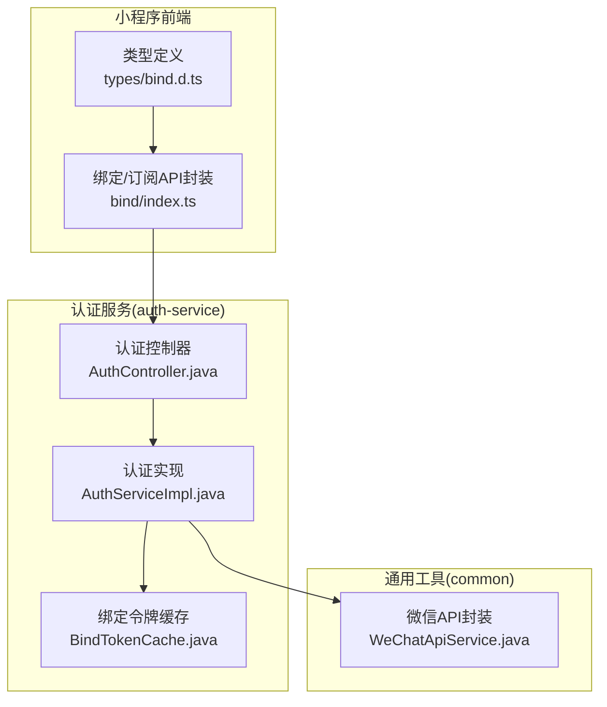
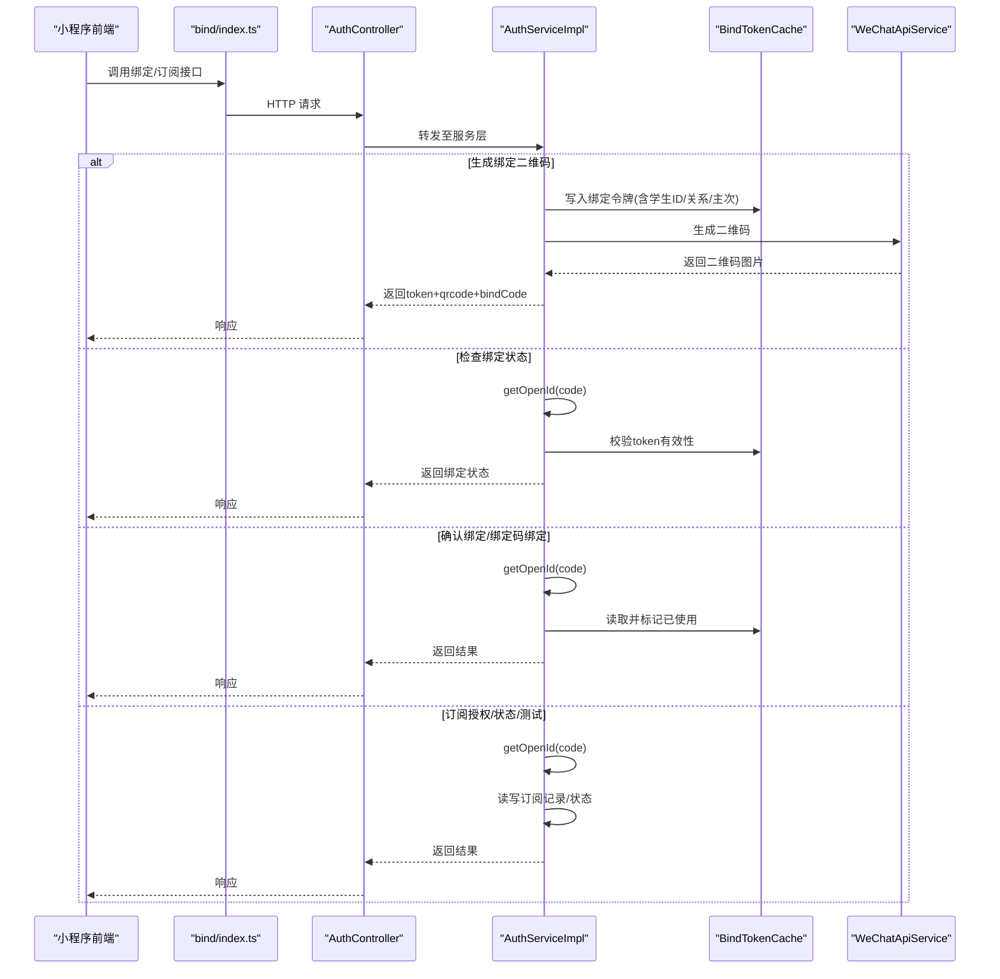
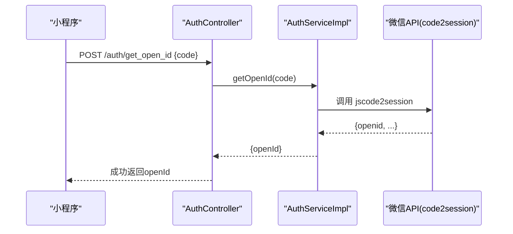
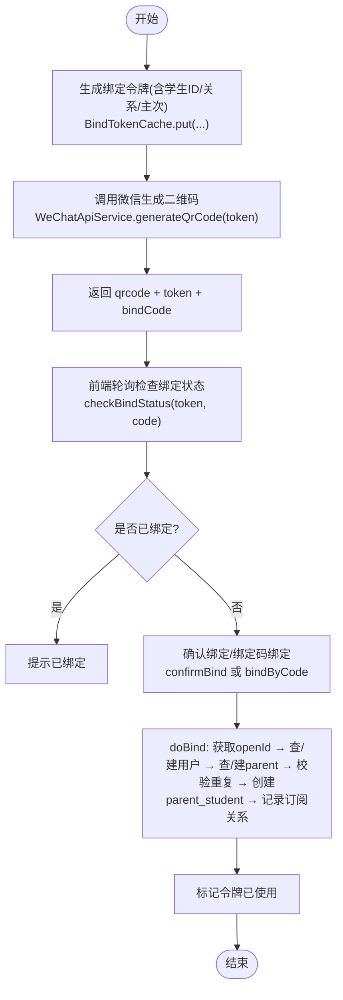
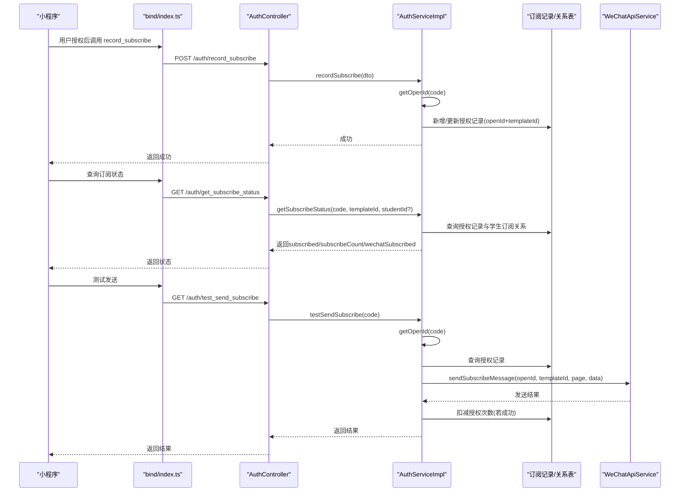
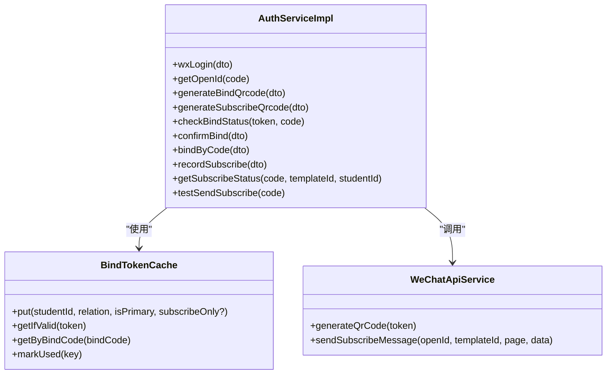
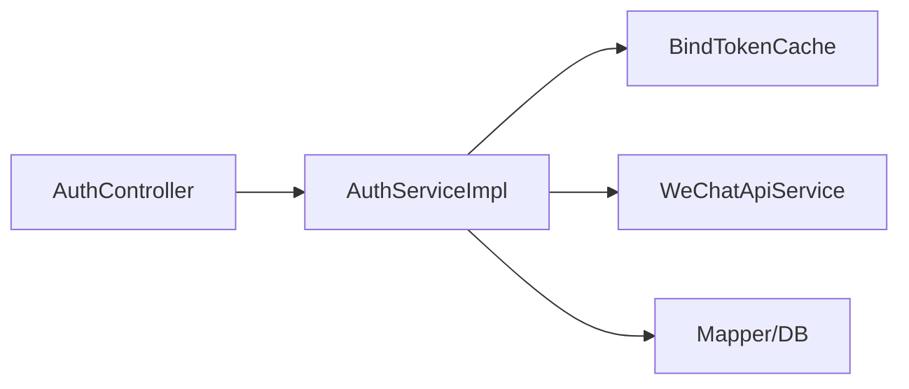

# 微信生态集成

<cite>
**本文引用的文件**   
- [class_times_record/src/api/bind/index.ts](file://class_times_record/src/api/bind/index.ts)
- [class_times_record/src/types/bind.d.ts](file://class_times_record/src/types/bind.d.ts)
- [auth-service/src/main/java/com/shiroko/controller/AuthController.java](file://class_times_record_back/auth-service/src/main/java/com/shiroko/controller/AuthController.java)
- [auth-service/src/main/java/com/shiroko/service/impl/AuthServiceImpl.java](file://class_times_record_back/auth-service/src/main/java/com/shiroko/service/impl/AuthServiceImpl.java)
- [common/src/main/java/com/shiroko/util/WeChatApiService.java](file://class_times_record_back/common/src/main/java/com/shiroko/util/WeChatApiService.java)
- [auth-service/src/main/java/com/shiroko/service/cache/BindTokenCache.java](file://class_times_record_back/auth-service/src/main/java/com/shiroko/service/cache/BindTokenCache.java)
</cite>

## 目录
1. [简介](#简介)
2. [项目结构](#项目结构)
3. [核心组件](#核心组件)
4. [架构总览](#架构总览)
5. [详细组件分析](#详细组件分析)
6. [依赖关系分析](#依赖关系分析)
7. [性能与限流](#性能与限流)
8. [故障排查指南](#故障排查指南)
9. [结论](#结论)
10. [附录](#附录)

## 简介
本文件面向开发者，系统化梳理本项目在微信生态中的集成方案，覆盖以下关键能力：
- 微信小程序登录流程（code2Session、openid 获取、用户平台关联）
- 二维码绑定功能（生成、状态轮询、确认绑定、绑定码直绑）
- 微信订阅消息推送（模板配置、授权记录、测试发送）
- 微信用户信息同步与缓存策略
- 微信 API 调用封装、错误处理与重试建议
- 扩展与调试指南

## 项目结构
围绕微信集成的前后端关键位置如下：
- 前端（uni-app 家长端）
  - 绑定与订阅相关 API 封装：[class_times_record/src/api/bind/index.ts](file://class_times_record/src/api/bind/index.ts)
  - 类型定义：[class_times_record/src/types/bind.d.ts](file://class_times_record/src/types/bind.d.ts)
- 后端（Spring Boot 微服务）
  - 认证控制器（含绑定、订阅接口）：[AuthController.java](file://class_times_record_back/auth-service/src/main/java/com/shiroko/controller/AuthController.java)
  - 认证与服务实现（登录、绑定、订阅等核心逻辑）：[AuthServiceImpl.java](file://class_times_record_back/auth-service/src/main/java/com/shiroko/service/impl/AuthServiceImpl.java)
  - 微信 API 封装（二维码、订阅消息）：[WeChatApiService.java](file://class_times_record_back/common/src/main/java/com/shiroko/util/WeChatApiService.java)
  - 绑定令牌缓存（Redis）：[BindTokenCache.java](file://class_times_record_back/auth-service/src/main/java/com/shiroko/service/cache/BindTokenCache.java)

**图表来源** 
- [class_times_record/src/api/bind/index.ts:1-133](file://class_times_record/src/api/bind/index.ts#L1-L133)
- [class_times_record/src/types/bind.d.ts:1-96](file://class_times_record/src/types/bind.d.ts#L1-L96)
- [auth-service/src/main/java/com/shiroko/controller/AuthController.java:1-197](file://class_times_record_back/auth-service/src/main/java/com/shiroko/controller/AuthController.java#L1-L197)
- [auth-service/src/main/java/com/shiroko/service/impl/AuthServiceImpl.java:1-1238](file://class_times_record_back/auth-service/src/main/java/com/shiroko/service/impl/AuthServiceImpl.java#L1-L1238)
- [common/src/main/java/com/shiroko/util/WeChatApiService.java](file://class_times_record_back/common/src/main/java/com/shiroko/util/WeChatApiService.java)
- [auth-service/src/main/java/com/shiroko/service/cache/BindTokenCache.java](file://class_times_record_back/auth-service/src/main/java/com/shiroko/service/cache/BindTokenCache.java)

**章节来源**
- [class_times_record/src/api/bind/index.ts:1-133](file://class_times_record/src/api/bind/index.ts#L1-L133)
- [class_times_record/src/types/bind.d.ts:1-96](file://class_times_record/src/types/bind.d.ts#L1-L96)
- [auth-service/src/main/java/com/shiroko/controller/AuthController.java:1-197](file://class_times_record_back/auth-service/src/main/java/com/shiroko/controller/AuthController.java#L1-L197)
- [auth-service/src/main/java/com/shiroko/service/impl/AuthServiceImpl.java:1-1238](file://class_times_record_back/auth-service/src/main/java/com/shiroko/service/impl/AuthServiceImpl.java#L1-L1238)
- [common/src/main/java/com/shiroko/util/WeChatApiService.java](file://class_times_record_back/common/src/main/java/com/shiroko/util/WeChatApiService.java)
- [auth-service/src/main/java/com/shiroko/service/cache/BindTokenCache.java](file://class_times_record_back/auth-service/src/main/java/com/shiroko/service/cache/BindTokenCache.java)

## 核心组件
- 认证控制器（AuthController）
  - 提供微信登录、获取 openid、绑定二维码、查询绑定信息、检查绑定状态、确认绑定、绑定码绑定、订阅授权记录、订阅状态查询、测试发送订阅消息等接口。
- 认证实现（AuthServiceImpl）
  - 实现 code2session 获取 openid；维护用户平台关联；完成家长绑定（支持扫码与绑定码两种方式）；管理订阅授权计数与状态；测试发送订阅消息。
- 微信 API 封装（WeChatApiService）
  - 统一封装微信侧二维码生成、订阅消息发送等能力。
- 绑定令牌缓存（BindTokenCache）
  - 基于 Redis 的绑定令牌生命周期管理，包含 token 生成、过期校验、绑定码映射、使用标记等。

**章节来源**
- [auth-service/src/main/java/com/shiroko/controller/AuthController.java:1-197](file://class_times_record_back/auth-service/src/main/java/com/shiroko/controller/AuthController.java#L1-L197)
- [auth-service/src/main/java/com/shiroko/service/impl/AuthServiceImpl.java:1-1238](file://class_times_record_back/auth-service/src/main/java/com/shiroko/service/impl/AuthServiceImpl.java#L1-L1238)
- [common/src/main/java/com/shiroko/util/WeChatApiService.java](file://class_times_record_back/common/src/main/java/com/shiroko/util/WeChatApiService.java)
- [auth-service/src/main/java/com/shiroko/service/cache/BindTokenCache.java](file://class_times_record_back/auth-service/src/main/java/com/shiroko/service/cache/BindTokenCache.java)

## 架构总览
下图展示从前端到后端的微信集成主链路：小程序发起请求 → 认证控制器路由 → 认证实现处理业务 → 调用微信 API 或读写缓存/数据库。

**图表来源** 
- [class_times_record/src/api/bind/index.ts:1-133](file://class_times_record/src/api/bind/index.ts#L1-L133)
- [auth-service/src/main/java/com/shiroko/controller/AuthController.java:1-197](file://class_times_record_back/auth-service/src/main/java/com/shiroko/controller/AuthController.java#L1-L197)
- [auth-service/src/main/java/com/shiroko/service/impl/AuthServiceImpl.java:1-1238](file://class_times_record_back/auth-service/src/main/java/com/shiroko/service/impl/AuthServiceImpl.java#L1-L1238)
- [auth-service/src/main/java/com/shiroko/service/cache/BindTokenCache.java](file://class_times_record_back/auth-service/src/main/java/com/shiroko/service/cache/BindTokenCache.java)
- [common/src/main/java/com/shiroko/util/WeChatApiService.java](file://class_times_record_back/common/src/main/java/com/shiroko/util/WeChatApiService.java)

## 详细组件分析

### 微信小程序登录与 openid 获取
- 流程要点
  - 小程序通过 code 调用后端接口，后端调用微信 code2session 获取 openid。
  - 将 openid 与平台标识关联到用户平台表，用于后续登录态与权限体系。
- 关键路径
  - 控制器：/auth/get_open_id、/auth/login_no_pwd
  - 服务：getOpenId、wxLogin
- 数据流向
  - 前端 code → 后端 RestTemplate 调用微信接口 → 解析 JSON 取 openid → 返回给前端或继续登录流程。

**图表来源** 
- [auth-service/src/main/java/com/shiroko/controller/AuthController.java:48-51](file://class_times_record_back/auth-service/src/main/java/com/shiroko/controller/AuthController.java#L48-L51)
- [auth-service/src/main/java/com/shiroko/service/impl/AuthServiceImpl.java:220-239](file://class_times_record_back/auth-service/src/main/java/com/shiroko/service/impl/AuthServiceImpl.java#L220-L239)

**章节来源**
- [auth-service/src/main/java/com/shiroko/controller/AuthController.java:48-61](file://class_times_record_back/auth-service/src/main/java/com/shiroko/controller/AuthController.java#L48-L61)
- [auth-service/src/main/java/com/shiroko/service/impl/AuthServiceImpl.java:100-114](file://class_times_record_back/auth-service/src/main/java/com/shiroko/service/impl/AuthServiceImpl.java#L100-L114)
- [auth-service/src/main/java/com/shiroko/service/impl/AuthServiceImpl.java:220-239](file://class_times_record_back/auth-service/src/main/java/com/shiroko/service/impl/AuthServiceImpl.java#L220-L239)

### 二维码绑定完整流程
- 能力概览
  - 生成绑定二维码（可指定学生ID、关系、是否主要联系人）
  - 生成订阅专用二维码（仅订阅，不创建账号）
  - 无需登录即可查询绑定信息、检查绑定状态、确认绑定
  - 支持手动输入6位绑定码进行绑定
- 关键路径
  - 生成：/auth/generate_bind_qrcode、/auth/generate_subscribe_qrcode
  - 查询：/auth/get_bind_info、/auth/get_bind_info_by_code
  - 状态：/auth/check_bind_status
  - 确认：/auth/confirm_bind
  - 绑定码绑定：/auth/bind_by_code
- 核心逻辑
  - 绑定令牌由 BindTokenCache 管理，包含有效期与绑定码映射。
  - 二维码通过 WeChatApiService 生成。
  - checkBindStatus 会先通过 code 获取 openid，再判断是否已绑定及是否需要设置账号密码。
  - confirmBind 与 bindByCode 复用公共绑定逻辑 doBind，支持“仅订阅”和“绑定账号并订阅”两种模式。

**图表来源** 
- [auth-service/src/main/java/com/shiroko/controller/AuthController.java:93-146](file://class_times_record_back/auth-service/src/main/java/com/shiroko/controller/AuthController.java#L93-L146)
- [auth-service/src/main/java/com/shiroko/service/impl/AuthServiceImpl.java:401-576](file://class_times_record_back/auth-service/src/main/java/com/shiroko/service/impl/AuthServiceImpl.java#L401-L576)
- [auth-service/src/main/java/com/shiroko/service/cache/BindTokenCache.java](file://class_times_record_back/auth-service/src/main/java/com/shiroko/service/cache/BindTokenCache.java)
- [common/src/main/java/com/shiroko/util/WeChatApiService.java](file://class_times_record_back/common/src/main/java/com/shiroko/util/WeChatApiService.java)

**章节来源**
- [class_times_record/src/api/bind/index.ts:9-96](file://class_times_record/src/api/bind/index.ts#L9-L96)
- [class_times_record/src/types/bind.d.ts:4-75](file://class_times_record/src/types/bind.d.ts#L4-L75)
- [auth-service/src/main/java/com/shiroko/controller/AuthController.java:93-146](file://class_times_record_back/auth-service/src/main/java/com/shiroko/controller/AuthController.java#L93-L146)
- [auth-service/src/main/java/com/shiroko/service/impl/AuthServiceImpl.java:401-576](file://class_times_record_back/auth-service/src/main/java/com/shiroko/service/impl/AuthServiceImpl.java#L401-L576)

### 微信订阅消息推送
- 能力概览
  - 记录授权：前端在用户授权后调用 record_subscribe，后端根据 code 获取 openid 并增加授权次数。
  - 查询状态：get_subscribe_status 返回是否已授权、剩余次数以及是否已订阅指定学生。
  - 测试发送：test_send_subscribe 向当前设备发送一条测试扣课通知，成功后扣减一次授权次数。
- 关键路径
  - 记录：/auth/record_subscribe
  - 状态：/auth/get_subscribe_status
  - 测试：/auth/test_send_subscribe
- 核心逻辑
  - 按 openId + templateId 维度记录授权次数，支持“永久订阅”标记（仍记录次数但发送时不扣减）。
  - 同时维护微信号与学生订阅关系（wx_student_subscribe），便于按学生维度查询订阅情况。
  - 测试发送通过 WeChatApiService.sendSubscribeMessage 调用微信接口。

**图表来源** 
- [class_times_record/src/api/bind/index.ts:62-130](file://class_times_record/src/api/bind/index.ts#L62-L130)
- [auth-service/src/main/java/com/shiroko/controller/AuthController.java:158-196](file://class_times_record_back/auth-service/src/main/java/com/shiroko/controller/AuthController.java#L158-L196)
- [auth-service/src/main/java/com/shiroko/service/impl/AuthServiceImpl.java:1022-1235](file://class_times_record_back/auth-service/src/main/java/com/shiroko/service/impl/AuthServiceImpl.java#L1022-L1235)
- [common/src/main/java/com/shiroko/util/WeChatApiService.java](file://class_times_record_back/common/src/main/java/com/shiroko/util/WeChatApiService.java)

**章节来源**
- [class_times_record/src/api/bind/index.ts:62-130](file://class_times_record/src/api/bind/index.ts#L62-L130)
- [class_times_record/src/types/bind.d.ts:77-95](file://class_times_record/src/types/bind.d.ts#L77-L95)
- [auth-service/src/main/java/com/shiroko/controller/AuthController.java:158-196](file://class_times_record_back/auth-service/src/main/java/com/shiroko/controller/AuthController.java#L158-L196)
- [auth-service/src/main/java/com/shiroko/service/impl/AuthServiceImpl.java:1022-1235](file://class_times_record_back/auth-service/src/main/java/com/shiroko/service/impl/AuthServiceImpl.java#L1022-L1235)

### 微信用户信息同步与缓存策略
- 用户平台关联
  - 通过 user_platform 表维护 openId 与用户的绑定关系，支持多角色最后登录角色追踪。
- 缓存策略
  - 绑定令牌使用 Redis 缓存（BindTokenCache），具备过期时间与使用标记。
  - 登出时将 accessToken 加入黑名单，并清理用户信息缓存（Redis）。
- 数据一致性
  - 绑定流程中多次校验重复绑定，确保 parent_student 幂等插入。
  - 清理未绑定的占位 parent 记录，避免孤儿数据。

**图表来源** 
- [auth-service/src/main/java/com/shiroko/service/impl/AuthServiceImpl.java:1-1238](file://class_times_record_back/auth-service/src/main/java/com/shiroko/service/impl/AuthServiceImpl.java#L1-L1238)
- [auth-service/src/main/java/com/shiroko/service/cache/BindTokenCache.java](file://class_times_record_back/auth-service/src/main/java/com/shiroko/service/cache/BindTokenCache.java)
- [common/src/main/java/com/shiroko/util/WeChatApiService.java](file://class_times_record_back/common/src/main/java/com/shiroko/util/WeChatApiService.java)

**章节来源**
- [auth-service/src/main/java/com/shiroko/service/impl/AuthServiceImpl.java:296-312](file://class_times_record_back/auth-service/src/main/java/com/shiroko/service/impl/AuthServiceImpl.java#L296-L312)
- [auth-service/src/main/java/com/shiroko/service/impl/AuthServiceImpl.java:401-576](file://class_times_record_back/auth-service/src/main/java/com/shiroko/service/impl/AuthServiceImpl.java#L401-L576)
- [auth-service/src/main/java/com/shiroko/service/impl/AuthServiceImpl.java:833-958](file://class_times_record_back/auth-service/src/main/java/com/shiroko/service/impl/AuthServiceImpl.java#L833-L958)

### 微信 API 调用封装、错误处理与重试建议
- 封装类
  - WeChatApiService 统一封装二维码生成与订阅消息发送。
- 错误处理现状
  - 登录失败时返回具体 errmsg；二维码生成失败返回明确提示；订阅测试发送失败返回配置检查提示。
- 重试与限流建议
  - 对微信接口调用增加指数退避重试（如网络抖动、临时限频）。
  - 引入令牌缓存与本地限流器，避免短时间内高频调用微信接口。
  - 对 code2session 与订阅消息发送分别设置超时与熔断降级策略。

**章节来源**
- [auth-service/src/main/java/com/shiroko/service/impl/AuthServiceImpl.java:220-239](file://class_times_record_back/auth-service/src/main/java/com/shiroko/service/impl/AuthServiceImpl.java#L220-L239)
- [auth-service/src/main/java/com/shiroko/service/impl/AuthServiceImpl.java:401-433](file://class_times_record_back/auth-service/src/main/java/com/shiroko/service/impl/AuthServiceImpl.java#L401-L433)
- [auth-service/src/main/java/com/shiroko/service/impl/AuthServiceImpl.java:1163-1235](file://class_times_record_back/auth-service/src/main/java/com/shiroko/service/impl/AuthServiceImpl.java#L1163-L1235)
- [common/src/main/java/com/shiroko/util/WeChatApiService.java](file://class_times_record_back/common/src/main/java/com/shiroko/util/WeChatApiService.java)

## 依赖关系分析
- 控制器到服务层
  - AuthController 仅做参数校验与转发，核心逻辑集中在 AuthServiceImpl。
- 服务层到外部依赖
  - WeChatApiService：微信侧能力（二维码、订阅消息）
  - BindTokenCache：绑定令牌缓存（Redis）
  - 数据库访问：通过 Mapper 操作用户、家长、学生、订阅记录等实体
- 潜在耦合点
  - 绑定流程强依赖 BindTokenCache 的生命周期管理。
  - 订阅消息发送依赖 WeChatApiService 的稳定性和限流策略。

**图表来源** 
- [auth-service/src/main/java/com/shiroko/controller/AuthController.java:1-197](file://class_times_record_back/auth-service/src/main/java/com/shiroko/controller/AuthController.java#L1-L197)
- [auth-service/src/main/java/com/shiroko/service/impl/AuthServiceImpl.java:1-1238](file://class_times_record_back/auth-service/src/main/java/com/shiroko/service/impl/AuthServiceImpl.java#L1-L1238)
- [auth-service/src/main/java/com/shiroko/service/cache/BindTokenCache.java](file://class_times_record_back/auth-service/src/main/java/com/shiroko/service/cache/BindTokenCache.java)
- [common/src/main/java/com/shiroko/util/WeChatApiService.java](file://class_times_record_back/common/src/main/java/com/shiroko/util/WeChatApiService.java)

**章节来源**
- [auth-service/src/main/java/com/shiroko/controller/AuthController.java:1-197](file://class_times_record_back/auth-service/src/main/java/com/shiroko/controller/AuthController.java#L1-L197)
- [auth-service/src/main/java/com/shiroko/service/impl/AuthServiceImpl.java:1-1238](file://class_times_record_back/auth-service/src/main/java/com/shiroko/service/impl/AuthServiceImpl.java#L1-L1238)

## 性能与限流
- 建议措施
  - 微信接口调用增加重试与退避策略，避免瞬时失败影响用户体验。
  - 对 code2session 与订阅消息发送实施限流（令牌桶/漏桶），保护第三方接口。
  - 绑定令牌缓存合理设置 TTL，避免热点 key 放大压力。
  - 批量订阅场景采用异步队列与去重策略，降低并发压力。
- 监控与告警
  - 对微信接口成功率、耗时、错误码分布进行埋点与告警。
  - 对绑定流程各阶段耗时进行统计，定位瓶颈。

[本节为通用指导，不直接分析具体文件]

## 故障排查指南
- 常见问题定位
  - 登录失败：检查 code 有效性、微信 appid/secret 配置、网络连通性。
  - 二维码生成失败：检查微信开放平台配置、token 有效性、二维码接口限频。
  - 绑定失败：检查绑定令牌是否过期、重复绑定校验、parent_student 唯一约束冲突。
  - 订阅消息发送失败：检查模板 ID、页面路径、授权次数是否为 0、微信后台配置。
- 日志与断点
  - 关注服务层关键日志输出（openid 获取、绑定流程、订阅记录变更）。
  - 在关键分支（重复绑定、清理占位 parent、订阅记录更新）添加断点验证。

**章节来源**
- [auth-service/src/main/java/com/shiroko/service/impl/AuthServiceImpl.java:220-239](file://class_times_record_back/auth-service/src/main/java/com/shiroko/service/impl/AuthServiceImpl.java#L220-L239)
- [auth-service/src/main/java/com/shiroko/service/impl/AuthServiceImpl.java:401-433](file://class_times_record_back/auth-service/src/main/java/com/shiroko/service/impl/AuthServiceImpl.java#L401-L433)
- [auth-service/src/main/java/com/shiroko/service/impl/AuthServiceImpl.java:541-751](file://class_times_record_back/auth-service/src/main/java/com/shiroko/service/impl/AuthServiceImpl.java#L541-L751)
- [auth-service/src/main/java/com/shiroko/service/impl/AuthServiceImpl.java:1163-1235](file://class_times_record_back/auth-service/src/main/java/com/shiroko/service/impl/AuthServiceImpl.java#L1163-L1235)

## 结论
本项目在微信生态集成方面形成了清晰的职责分层与稳定的业务流程：
- 登录与 openid 获取稳定可靠，结合用户平台表实现跨角色登录态管理。
- 二维码绑定支持扫码与绑定码双通道，具备完善的防重与清理机制。
- 订阅消息授权与状态查询完备，并提供测试发送能力便于联调。
- 通过 WeChatApiService 与 BindTokenCache 解耦外部依赖与缓存管理，提升可维护性与可扩展性。
建议在后续迭代中完善重试与限流策略，增强系统韧性与稳定性。

[本节为总结，不直接分析具体文件]

## 附录
- 前端 API 清单（部分）
  - 生成绑定二维码：POST /auth/auth/generate_bind_qrcode
  - 生成订阅专用二维码：POST /auth/auth/generate_subscribe_qrcode
  - 查询绑定信息：GET /auth/auth/get_bind_info
  - 检查绑定状态：GET /auth/auth/check_bind_status
  - 确认绑定：POST /auth/auth/confirm_bind
  - 绑定码绑定：POST /auth/auth/bind_by_code
  - 记录订阅授权：POST /auth/auth/record_subscribe
  - 查询订阅状态：GET /auth/auth/get_subscribe_status
  - 测试发送订阅消息：GET /auth/auth/test_send_subscribe

**章节来源**
- [class_times_record/src/api/bind/index.ts:1-133](file://class_times_record/src/api/bind/index.ts#L1-L133)
- [auth-service/src/main/java/com/shiroko/controller/AuthController.java:93-196](file://class_times_record_back/auth-service/src/main/java/com/shiroko/controller/AuthController.java#L93-L196)