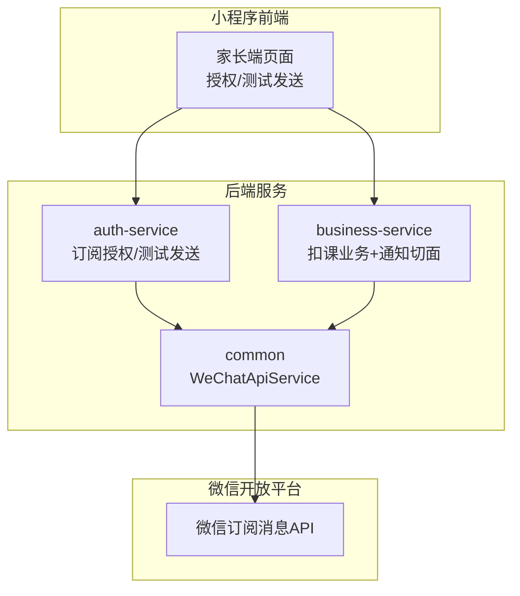
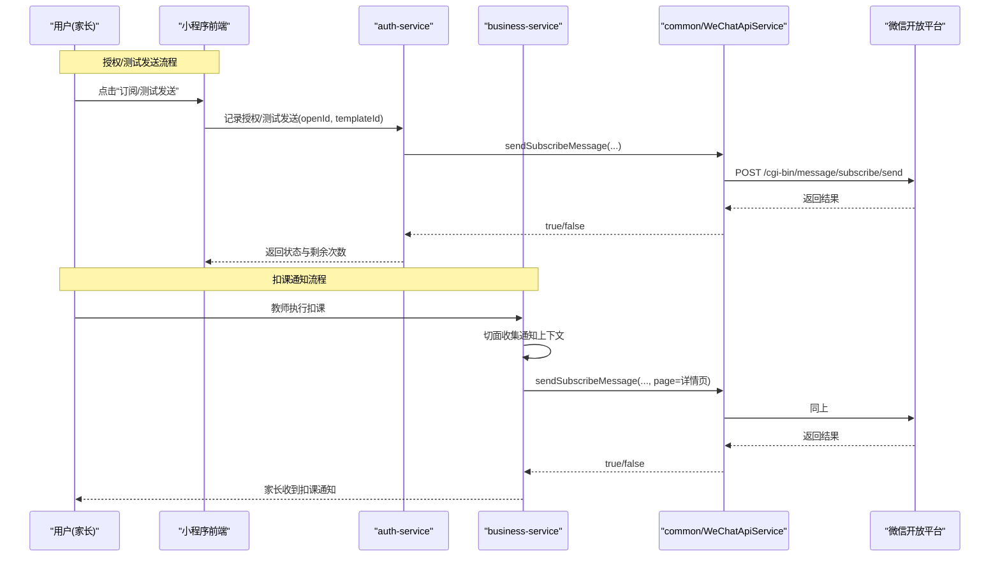
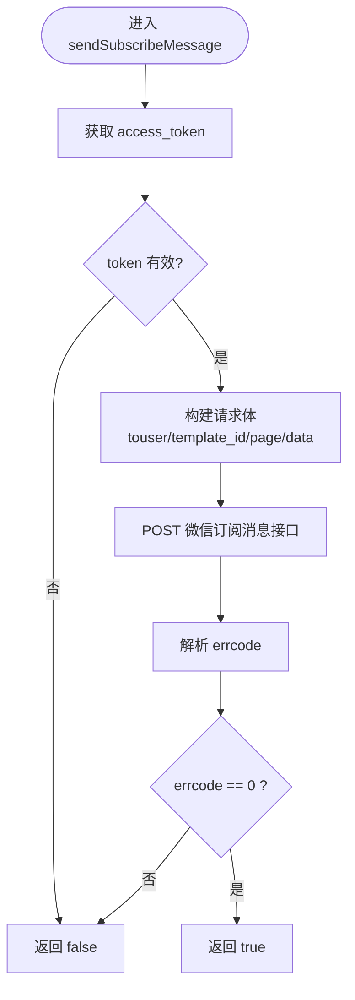
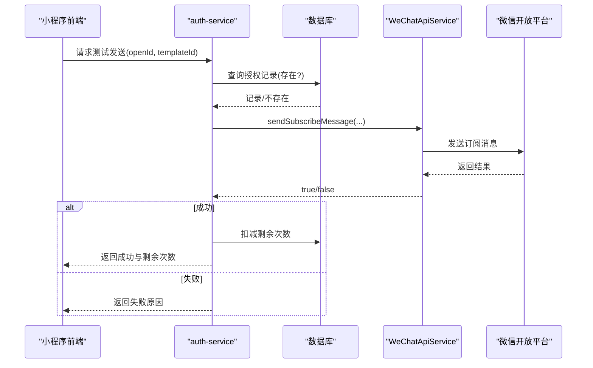
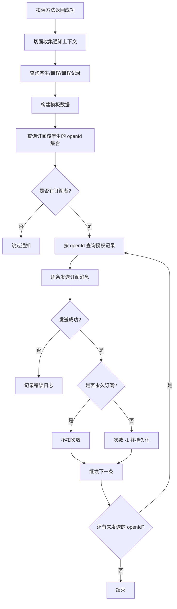
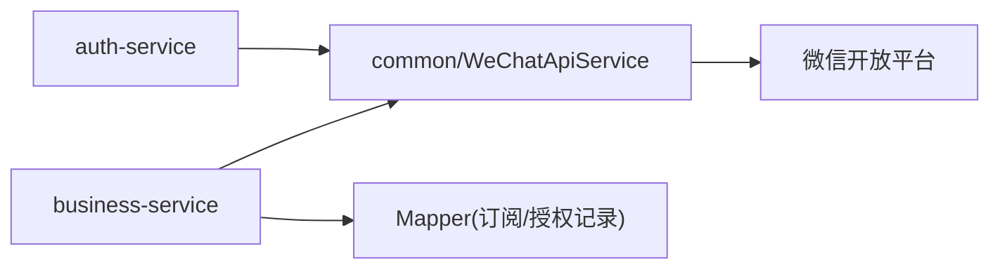

# 订阅消息推送

<cite>
**本文引用的文件**
- [WeChatApiService.java](file://class_times_record_back/common/src/main/java/com/shiroko/util/WeChatApiService.java)
- [AuthServiceImpl.java](file://class_times_record_back/auth-service/src/main/java/com/shiroko/service/impl/AuthServiceImpl.java)
- [DeductNotifyAspect.java](file://class_times_record_back/business-service/src/main/java/com/shiroko/aspect/DeductNotifyAspect.java)
- [common.ts](file://class_times_record/src/config/common.ts)
- [CLAUDE.md](file://CLAUDE.md)
</cite>

## 目录
1. [简介](#简介)
2. [项目结构](#项目结构)
3. [核心组件](#核心组件)
4. [架构总览](#架构总览)
5. [详细组件分析](#详细组件分析)
6. [依赖关系分析](#依赖关系分析)
7. [性能与可靠性](#性能与可靠性)
8. [故障排查指南](#故障排查指南)
9. [结论](#结论)
10. [附录](#附录)

## 简介
本文件面向开发者，系统化说明“微信订阅消息推送”在课时管理系统中的配置、管理与实现。内容覆盖：
- 模板消息申请与模板ID配置
- 用户授权管理（一次性授权、永久授权）
- 业务触发场景（扣课通知等）
- 发送流程与失败处理
- 记录管理与查询
- 接口定义与数据模型要点
- 扩展与监控告警建议

## 项目结构
后端采用微服务拆分：auth-service 负责鉴权与订阅授权记录；business-service 承载业务逻辑并通过切面触发通知；common 提供通用能力（如微信API封装）。前端小程序侧完成授权交互与状态展示。

图表来源
- [WeChatApiService.java:179-238](file://class_times_record_back/common/src/main/java/com/shiroko/util/WeChatApiService.java#L179-L238)
- [AuthServiceImpl.java:1200-1238](file://class_times_record_back/auth-service/src/main/java/com/shiroko/service/impl/AuthServiceImpl.java#L1200-L1238)
- [DeductNotifyAspect.java:1-211](file://class_times_record_back/business-service/src/main/java/com/shiroko/aspect/DeductNotifyAspect.java#L1-L211)

章节来源
- [WeChatApiService.java:1-240](file://class_times_record_back/common/src/main/java/com/shiroko/util/WeChatApiService.java#L1-L240)
- [AuthServiceImpl.java:1200-1238](file://class_times_record_back/auth-service/src/main/java/com/shiroko/service/impl/AuthServiceImpl.java#L1200-L1238)
- [DeductNotifyAspect.java:1-211](file://class_times_record_back/business-service/src/main/java/com/shiroko/aspect/DeductNotifyAspect.java#L1-L211)
- [common.ts:1-34](file://class_times_record/src/config/common.ts#L1-L34)

## 核心组件
- 微信API服务（common）
  - 统一封装 access_token 获取与缓存、小程序码生成、订阅消息发送。
- 订阅授权与测试发送（auth-service）
  - 记录授权次数、支持测试发送并扣减次数。
- 扣课通知切面（business-service）
  - 监听扣课成功事件，按学生维度聚合订阅者 openId，去重后逐条发送，并按是否永久订阅决定是否扣减次数。
- 前端常量与交互（小程序）
  - 模板ID集中配置，前端发起授权、查询状态、测试发送。

章节来源
- [WeChatApiService.java:179-238](file://class_times_record_back/common/src/main/java/com/shiroko/util/WeChatApiService.java#L179-L238)
- [AuthServiceImpl.java:1200-1238](file://class_times_record_back/auth-service/src/main/java/com/shiroko/service/impl/AuthServiceImpl.java#L1200-L1238)
- [DeductNotifyAspect.java:83-173](file://class_times_record_back/business-service/src/main/java/com/shiroko/aspect/DeductNotifyAspect.java#L83-L173)
- [common.ts:1-34](file://class_times_record/src/config/common.ts#L1-L34)

## 架构总览
整体流程分为两条主线：
- 授权与测试发送：小程序调用 auth-service 记录授权或测试发送，成功后更新剩余次数。
- 业务触发通知：business-service 在扣课成功后通过切面收集通知上下文，查询订阅者与授权记录，调用 common 的 WeChatApiService 发送消息。

图表来源
- [AuthServiceImpl.java:1200-1238](file://class_times_record_back/auth-service/src/main/java/com/shiroko/service/impl/AuthServiceImpl.java#L1200-L1238)
- [DeductNotifyAspect.java:143-173](file://class_times_record_back/business-service/src/main/java/com/shiroko/aspect/DeductNotifyAspect.java#L143-L173)
- [WeChatApiService.java:179-238](file://class_times_record_back/common/src/main/java/com/shiroko/util/WeChatApiService.java#L179-L238)

## 详细组件分析

### 微信API服务（WeChatApiService）
职责
- 获取并缓存 access_token（提前刷新避免过期）
- 生成小程序码（用于分享绑定/订阅入口）
- 发送订阅消息（构造请求体、解析响应）

关键行为
- access_token 缓存策略：本地 volatile 变量 + 时间戳控制，并发安全使用双重检查锁。
- 订阅消息发送：根据 openId、templateId、page、data 构建请求，errcode==0 视为成功。

图表来源
- [WeChatApiService.java:179-238](file://class_times_record_back/common/src/main/java/com/shiroko/util/WeChatApiService.java#L179-L238)

章节来源
- [WeChatApiService.java:58-95](file://class_times_record_back/common/src/main/java/com/shiroko/util/WeChatApiService.java#L58-L95)
- [WeChatApiService.java:179-238](file://class_times_record_back/common/src/main/java/com/shiroko/util/WeChatApiService.java#L179-L238)

### 订阅授权与测试发送（auth-service）
职责
- 记录设备维度的订阅授权（openId + templateId），维护剩余次数
- 支持测试发送，成功后扣减一次授权次数

关键行为
- 测试发送前校验当前设备是否存在授权记录
- 构造模板字段（示例：项目名称、学生名、剩余次数、消耗次数、到期时间等）
- 发送成功后更新剩余次数

图表来源
- [AuthServiceImpl.java:1200-1238](file://class_times_record_back/auth-service/src/main/java/com/shiroko/service/impl/AuthServiceImpl.java#L1200-L1238)

章节来源
- [AuthServiceImpl.java:1200-1238](file://class_times_record_back/auth-service/src/main/java/com/shiroko/service/impl/AuthServiceImpl.java#L1200-L1238)

### 扣课通知切面（DeductNotifyAspect）
职责
- 监听标记了特定注解的扣课方法，在返回成功后统一发送订阅通知
- 按学生维度聚合订阅者 openId，去重后逐条发送
- 根据是否永久订阅决定是否扣减次数

关键行为
- 从 wx_student_subscribe 表读取订阅该学生的所有 openId
- 从 wx_subscribe_record 表查询对应 openId 的授权记录（同模板ID）
- 发送成功后：非永久订阅则次数 -1；永久订阅不扣次
- 单条失败不影响其他 openId 的发送

图表来源
- [DeductNotifyAspect.java:83-173](file://class_times_record_back/business-service/src/main/java/com/shiroko/aspect/DeductNotifyAspect.java#L83-L173)

章节来源
- [DeductNotifyAspect.java:1-211](file://class_times_record_back/business-service/src/main/java/com/shiroko/aspect/DeductNotifyAspect.java#L1-L211)

### 前端配置与交互（小程序）
- 模板ID集中配置于前端常量，便于统一维护
- 家长端首页与绑定页均支持：
  - 发起订阅授权（一次性/永久）
  - 查询订阅状态与剩余次数
  - 测试发送订阅消息

章节来源
- [common.ts:1-34](file://class_times_record/src/config/common.ts#L1-L34)

## 依赖关系分析
- 组件耦合
  - auth-service 与 business-service 均依赖 common 的 WeChatApiService，形成稳定的基础设施层。
  - DeductNotifyAspect 通过 Mapper 访问订阅关系与授权记录，再调用 WeChatApiService 完成发送。
- 外部依赖
  - 微信开放平台 API（access_token、订阅消息发送）
- 潜在循环依赖
  - 无直接循环依赖；common 为纯工具类，被上层服务单向依赖。

图表来源
- [WeChatApiService.java:179-238](file://class_times_record_back/common/src/main/java/com/shiroko/util/WeChatApiService.java#L179-L238)
- [DeductNotifyAspect.java:1-211](file://class_times_record_back/business-service/src/main/java/com/shiroko/aspect/DeductNotifyAspect.java#L1-L211)

章节来源
- [WeChatApiService.java:1-240](file://class_times_record_back/common/src/main/java/com/shiroko/util/WeChatApiService.java#L1-L240)
- [DeductNotifyAspect.java:1-211](file://class_times_record_back/business-service/src/main/java/com/shiroko/aspect/DeductNotifyAspect.java#L1-L211)

## 性能与可靠性
- access_token 缓存
  - 本地缓存 + 提前刷新，降低频繁网络请求与限流风险。
- 幂等与去重
  - 同一 openId 在同一业务事件中仅发送一次，避免重复打扰。
- 失败隔离
  - 单条通知失败不影响其他 openId 的发送，提升整体成功率。
- 异步与重试
  - 当前实现为同步调用微信接口；如需更高吞吐与容错，可引入消息队列与重试策略（见“扩展建议”）。

[本节为通用指导，无需代码引用]

## 故障排查指南
常见问题与定位思路
- 无法获取 access_token
  - 检查 app-id/secret 配置是否正确；查看 WeChatApiService 中 token 获取日志。
- 订阅消息发送失败
  - 核对模板ID与模板字段是否一致；关注 WeChatApiService 返回的 errcode 与响应体。
- 授权次数异常
  - 确认是否为永久订阅；检查授权记录是否存在且未被误删。
- 未收到通知
  - 确认学生是否存在订阅 openId；检查切面是否捕获到扣课事件；查看发送日志。

章节来源
- [WeChatApiService.java:58-95](file://class_times_record_back/common/src/main/java/com/shiroko/util/WeChatApiService.java#L58-L95)
- [WeChatApiService.java:179-238](file://class_times_record_back/common/src/main/java/com/shiroko/util/WeChatApiService.java#L179-L238)
- [DeductNotifyAspect.java:143-173](file://class_times_record_back/business-service/src/main/java/com/shiroko/aspect/DeductNotifyAspect.java#L143-L173)

## 结论
本方案以 common 层统一封装微信能力，auth-service 管理授权与测试发送，business-service 通过切面将通知与业务解耦，实现了稳定、可扩展的订阅消息推送体系。结合前端授权与状态展示，形成了完整的闭环体验。后续可按需引入消息队列与重试机制，进一步提升高并发下的可靠性与可观测性。

[本节为总结，无需代码引用]

## 附录

### 配置与管理要点
- 模板消息申请
  - 在微信公众平台申请与业务匹配的订阅消息模板，并将模板ID配置到前端常量与后端切面常量中保持一致。
- 模板ID配置
  - 前端：统一存放于常量文件，供授权与测试发送使用。
  - 后端：切面与测试发送逻辑中使用相同模板ID。
- 用户授权管理
  - 一次性授权：每次发送扣减一次次数；次数为0时提示重新授权。
  - 永久授权：勾选“总是保持以上选择”，发送不扣次数。
  - 多设备独立计数：按 (parent_id, open_id, template_id) 维度跟踪。
- 取消订阅
  - 提供取消订阅接口，删除相关订阅与记录，确保不再推送。

章节来源
- [CLAUDE.md:280](file://CLAUDE.md#L280-L280)
- [common.ts:1-34](file://class_times_record/src/config/common.ts#L1-L34)
- [DeductNotifyAspect.java:155-171](file://class_times_record_back/business-service/src/main/java/com/shiroko/aspect/DeductNotifyAspect.java#L155-L171)

### 接口与数据模型要点
- 接口定义（概念性）
  - 记录订阅授权：传入 openId、templateId、是否永久授权，返回剩余次数。
  - 查询订阅状态：传入 openId、templateId，返回是否已授权与剩余次数。
  - 测试发送订阅消息：传入 openId、templateId，成功后扣减一次次数。
  - 取消订阅：删除订阅关系与授权记录。
- 数据模型（概念性）
  - 订阅关系表：按 (student_id, is_primary) 维度跟踪订阅关系，解耦 parent.userId 绑定链路。
  - 授权记录表：按 (parent_id, open_id, template_id) 维度跟踪授权次数与是否永久。
  - 模板字段：包含项目名称、学生姓名、消耗课时、剩余课时、到期时间等。

章节来源
- [CLAUDE.md:280](file://CLAUDE.md#L280-L280)
- [DeductNotifyAspect.java:175-209](file://class_times_record_back/business-service/src/main/java/com/shiroko/aspect/DeductNotifyAspect.java#L175-L209)

### 扩展与监控告警建议
- 异步化与重试
  - 引入消息队列（如 RabbitMQ/Kafka）将发送任务出队消费；对失败任务进行指数退避重试，达到阈值转入死信队列人工介入。
- 可观测性
  - 增加埋点：发送耗时、成功率、失败原因分布；接入日志与指标系统（Prometheus/Grafana）。
- 灰度与开关
  - 新增功能开关与灰度发布策略，逐步放量；支持按机构/班级维度开关通知。
- 容量规划
  - 评估峰值并发与微信接口限频，合理设置线程池与速率限制。

[本节为通用指导，无需代码引用]