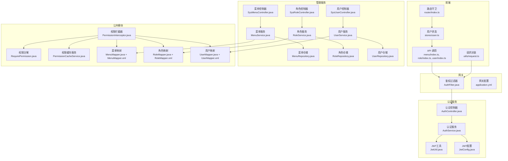
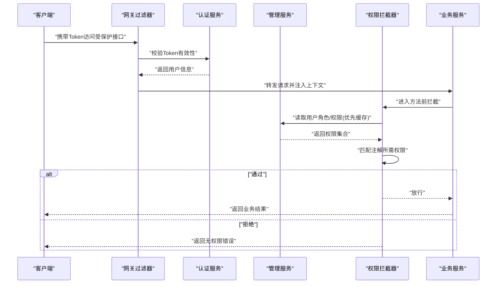
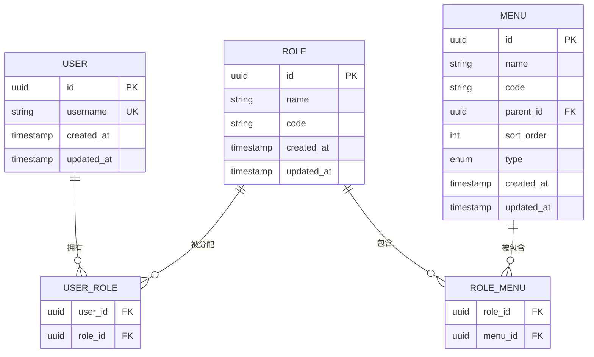
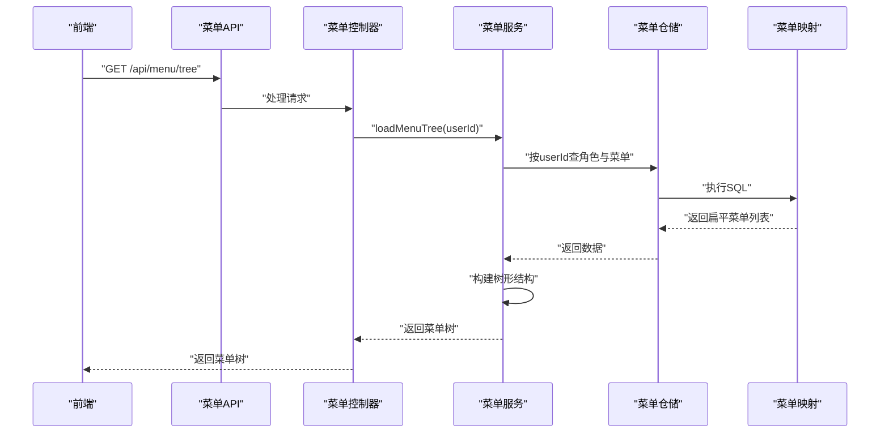
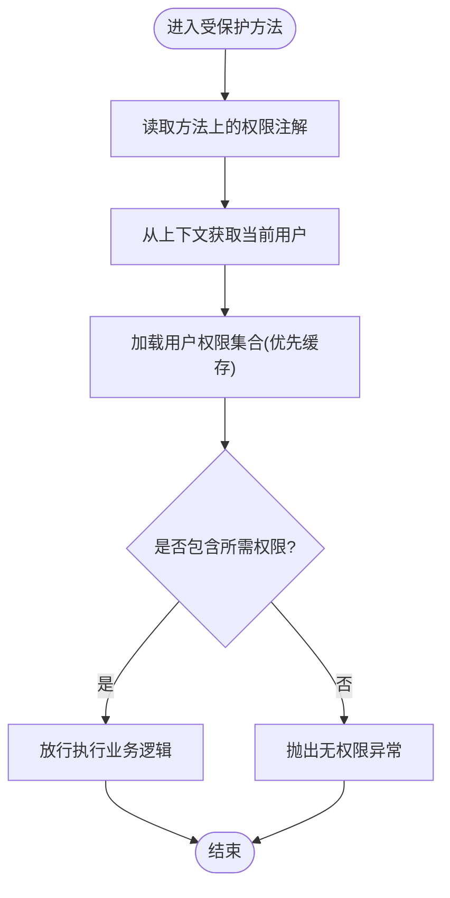
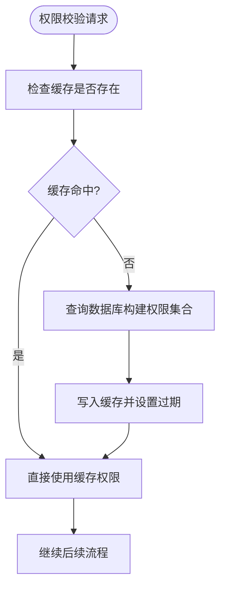
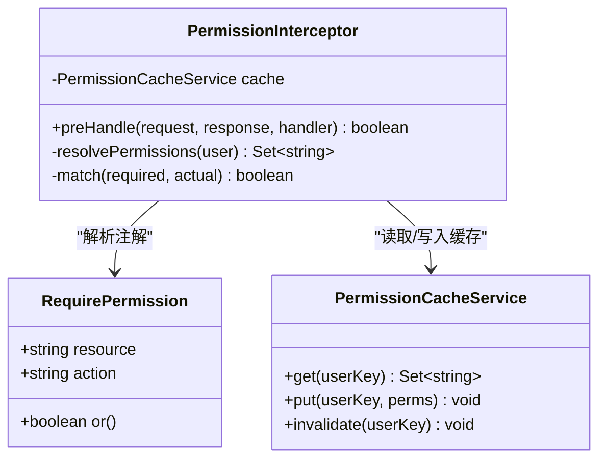
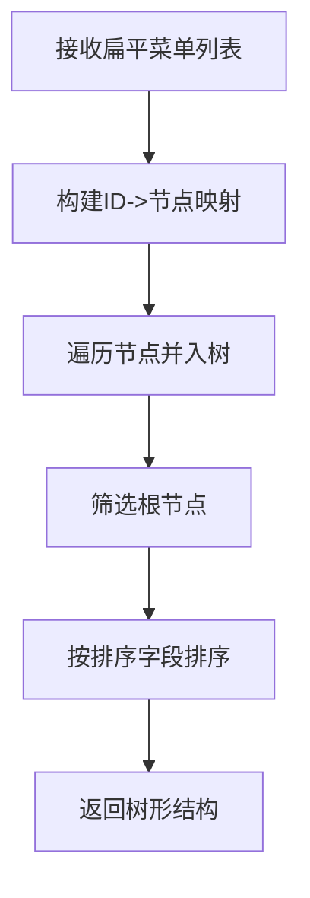
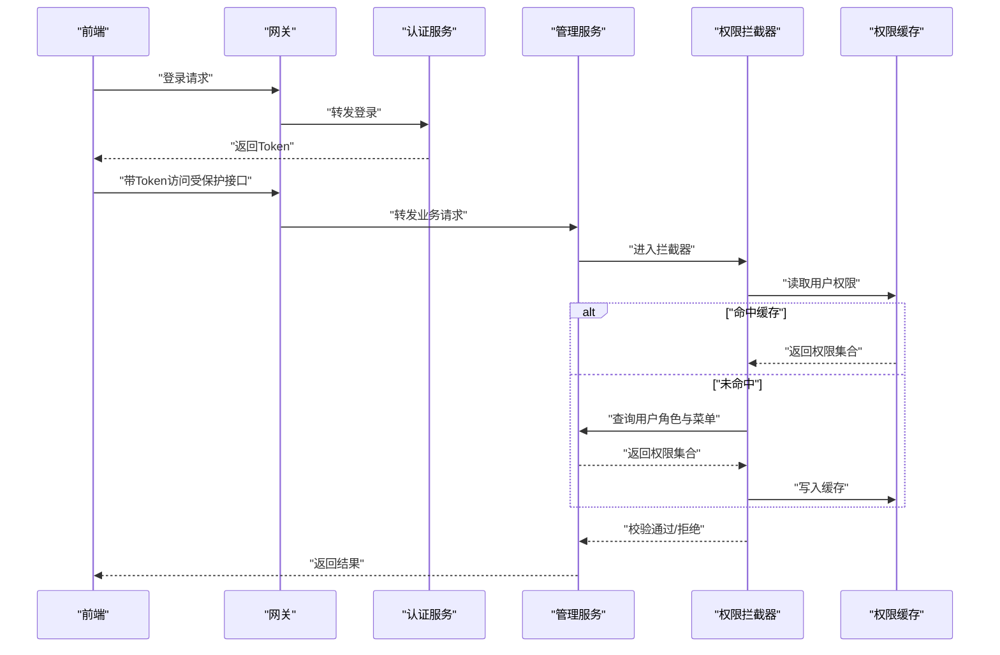
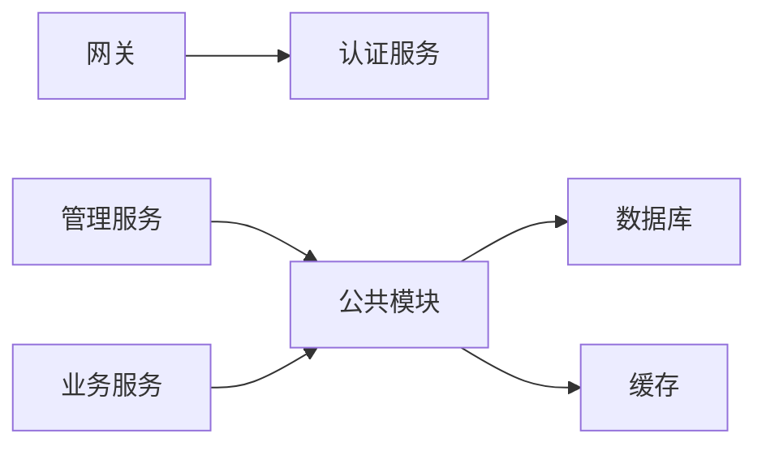

# 权限控制系统

<cite>
**本文引用的文件**   
- [admin-service/pom.xml](file://class_times_record_back/admin-service/pom.xml)
- [auth-service/pom.xml](file://class_times_record_back/auth-service/pom.xml)
- [business-service/pom.xml](file://class_times_record_back/business-service/pom.xml)
- [common/pom.xml](file://class_times_record_back/common/pom.xml)
- [gateway/src/main/java/com/shiroko/gateway/filter/AuthFilter.java](file://class_times_record_back/gateway/src/main/java/com/shiroko/gateway/filter/AuthFilter.java)
- [gateway/src/main/resources/application.yml](file://class_times_record_back/gateway/src/main/resources/application.yml)
- [admin-service/src/main/java/com/shiroko/controller/SysMenuController.java](file://class_times_record_back/admin-service/src/main/java/com/shiroko/controller/SysMenuController.java)
- [admin-service/src/main/java/com/shiroko/controller/SysRoleController.java](file://class_times_record_back/admin-service/src/main/java/com/shiroko/controller/SysRoleController.java)
- [admin-service/src/main/java/com/shiroko/controller/SysUserController.java](file://class_times_record_back/admin-service/src/main/java/com/shiroko/controller/SysUserController.java)
- [admin-service/src/main/java/com/shiroko/service/MenuService.java](file://class_times_record_back/admin-service/src/main/java/com/shiroko/service/MenuService.java)
- [admin-service/src/main/java/com/shiroko/service/RoleService.java](file://class_times_record_back/admin-service/src/main/java/com/shiroko/service/RoleService.java)
- [admin-service/src/main/java/com/shiroko/service/UserService.java](file://class_times_record_back/admin-service/src/main/java/com/shiroko/service/UserService.java)
- [admin-service/src/main/java/com/shiroko/repository/menu/MenuRepository.java](file://class_times_record_back/admin-service/src/main/java/com/shiroko/repository/menu/MenuRepository.java)
- [admin-service/src/main/java/com/shiroko/repository/role/RoleRepository.java](file://class_times_record_back/admin-service/src/main/java/com/shiroko/repository/role/RoleRepository.java)
- [admin-service/src/main/java/com/shiroko/repository/user/UserRepository.java](file://class_times_record_back/admin-service/src/main/java/com/shiroko/repository/user/UserRepository.java)
- [admin-service/src/main/java/com/shiroko/model/entity/MenuEntity.java](file://class_times_record_back/admin-service/src/main/java/com/shiroko/model/entity/MenuEntity.java)
- [admin-service/src/main/java/com/shiroko/model/entity/RoleEntity.java](file://class_times_record_back/admin-service/src/main/java/com/shiroko/model/entity/RoleEntity.java)
- [admin-service/src/main/java/com/shiroko/model/entity/UserEntity.java](file://class_times_record_back/admin-service/src/main/java/com/shiroko/model/entity/UserEntity.java)
- [admin-service/src/main/java/com/shiroko/model/dto/PermissionDTO.java](file://class_times_record_back/admin-service/src/main/java/com/shiroko/model/dto/PermissionDTO.java)
- [auth-service/src/main/java/com/shiroko/controller/AuthController.java](file://class_times_record_back/auth-service/src/main/java/com/shiroko/controller/AuthController.java)
- [auth-service/src/main/java/com/shiroko/service/AuthService.java](file://class_times_record_back/auth-service/src/main/java/com/shiroko/service/AuthService.java)
- [auth-service/src/main/java/com/shiroko/config/JwtConfig.java](file://class_times_record_back/auth-service/src/main/java/com/shiroko/config/JwtConfig.java)
- [auth-service/src/main/java/com/shiroko/util/JwtUtil.java](file://class_times_record_back/auth-service/src/main/java/com/shiroko/util/JwtUtil.java)
- [common/src/main/java/com/shiroko/annotation/RequirePermission.java](file://class_times_record_back/common/src/main/java/com/shiroko/annotation/RequirePermission.java)
- [common/src/main/java/com/shiroko/interceptor/PermissionInterceptor.java](file://class_times_record_back/common/src/main/java/com/shiroko/interceptor/PermissionInterceptor.java)
- [common/src/main/java/com/shiroko/service/PermissionCacheService.java](file://class_times_record_back/common/src/main/java/com/shiroko/service/PermissionCacheService.java)
- [common/src/main/java/com/shiroko/mapper/MenuMapper.java](file://class_times_record_back/common/src/main/java/com/shiroko/mapper/MenuMapper.java)
- [common/src/main/java/com/shiroko/mapper/RoleMapper.java](file://class_times_record_back/common/src/main/java/com/shiroko/mapper/RoleMapper.java)
- [common/src/main/java/com/shiroko/mapper/UserMapper.java](file://class_times_record_back/common/src/main/java/com/shiroko/mapper/UserMapper.java)
- [common/src/main/resources/com/shiroko/mapper/MenuMapper.xml](file://class_times_record_back/common/src/main/resources/com/shiroko/mapper/MenuMapper.xml)
- [common/src/main/resources/com/shiroko/mapper/RoleMapper.xml](file://class_times_record_back/common/src/main/resources/com/shiroko/mapper/RoleMapper.xml)
- [common/src/main/resources/com/shiroko/mapper/UserMapper.xml](file://class_times_record_back/common/src/main/resources/com/shiroko/mapper/UserMapper.xml)
- [class_record_admin_front/src/api/menu/index.ts](file://class_record_admin_front/src/api/menu/index.ts)
- [class_record_admin_front/src/api/role/index.ts](file://class_record_admin_front/src/api/role/index.ts)
- [class_record_admin_front/src/api/user/index.ts](file://class_record_admin_front/src/api/user/index.ts)
- [class_record_admin_front/src/router/index.ts](file://class_record_admin_front/src/router/index.ts)
- [class_record_admin_front/src/stores/user.ts](file://class_record_admin_front/src/stores/user.ts)
- [class_record_admin_front/src/utils/request.ts](file://class_record_admin_front/src/utils/request.ts)
- [class_times_record_back/docs/class_times_record.sql](file://class_times_record_back/docs/class_times_record.sql)
</cite>

## 目录
1. [简介](#简介)
2. [项目结构](#项目结构)
3. [核心组件](#核心组件)
4. [架构总览](#架构总览)
5. [详细组件分析](#详细组件分析)
6. [依赖分析](#依赖分析)
7. [性能考虑](#性能考虑)
8. [故障排查指南](#故障排查指南)
9. [结论](#结论)
10. [附录](#附录)

## 简介
本文件面向开发者，系统化阐述基于RBAC（用户-角色-权限）的权限控制体系。内容覆盖：
- 数据模型与多对多关系设计
- 菜单权限动态加载与按钮级权限控制
- 权限缓存策略与实时更新机制
- 权限注解与自定义验证器开发
- 权限树构建算法与验证流程图
- 扩展开发与性能优化建议

## 项目结构
后端采用微服务分层：网关、认证服务、管理服务、业务服务与公共模块；前端为管理后台与移动端。权限相关代码主要分布在：
- 网关层：鉴权过滤器
- 认证服务：登录、令牌签发与校验
- 管理服务：用户、角色、菜单与权限配置
- 公共模块：注解、拦截器、缓存服务、通用映射
- 前端：路由守卫、菜单渲染、按钮显隐控制、请求头注入

图表来源
- [gateway/src/main/java/com/shiroko/gateway/filter/AuthFilter.java](file://class_times_record_back/gateway/src/main/java/com/shiroko/gateway/filter/AuthFilter.java)
- [gateway/src/main/resources/application.yml](file://class_times_record_back/gateway/src/main/resources/application.yml)
- [auth-service/src/main/java/com/shiroko/controller/AuthController.java](file://class_times_record_back/auth-service/src/main/java/com/shiroko/controller/AuthController.java)
- [auth-service/src/main/java/com/shiroko/service/AuthService.java](file://class_times_record_back/auth-service/src/main/java/com/shiroko/service/AuthService.java)
- [auth-service/src/main/java/com/shiroko/config/JwtConfig.java](file://class_times_record_back/auth-service/src/main/java/com/shiroko/config/JwtConfig.java)
- [auth-service/src/main/java/com/shiroko/util/JwtUtil.java](file://class_times_record_back/auth-service/src/main/java/com/shiroko/util/JwtUtil.java)
- [admin-service/src/main/java/com/shiroko/controller/SysMenuController.java](file://class_times_record_back/admin-service/src/main/java/com/shiroko/controller/SysMenuController.java)
- [admin-service/src/main/java/com/shiroko/controller/SysRoleController.java](file://class_times_record_back/admin-service/src/main/java/com/shiroko/controller/SysRoleController.java)
- [admin-service/src/main/java/com/shiroko/controller/SysUserController.java](file://class_times_record_back/admin-service/src/main/java/com/shiroko/controller/SysUserController.java)
- [admin-service/src/main/java/com/shiroko/service/MenuService.java](file://class_times_record_back/admin-service/src/main/java/com/shiroko/service/MenuService.java)
- [admin-service/src/main/java/com/shiroko/service/RoleService.java](file://class_times_record_back/admin-service/src/main/java/com/shiroko/service/RoleService.java)
- [admin-service/src/main/java/com/shiroko/service/UserService.java](file://class_times_record_back/admin-service/src/main/java/com/shiroko/service/UserService.java)
- [admin-service/src/main/java/com/shiroko/repository/menu/MenuRepository.java](file://class_times_record_back/admin-service/src/main/java/com/shiroko/repository/menu/MenuRepository.java)
- [admin-service/src/main/java/com/shiroko/repository/role/RoleRepository.java](file://class_times_record_back/admin-service/src/main/java/com/shiroko/repository/role/RoleRepository.java)
- [admin-service/src/main/java/com/shiroko/repository/user/UserRepository.java](file://class_times_record_back/admin-service/src/main/java/com/shiroko/repository/user/UserRepository.java)
- [common/src/main/java/com/shiroko/annotation/RequirePermission.java](file://class_times_record_back/common/src/main/java/com/shiroko/annotation/RequirePermission.java)
- [common/src/main/java/com/shiroko/interceptor/PermissionInterceptor.java](file://class_times_record_back/common/src/main/java/com/shiroko/interceptor/PermissionInterceptor.java)
- [common/src/main/java/com/shiroko/service/PermissionCacheService.java](file://class_times_record_back/common/src/main/java/com/shiroko/service/PermissionCacheService.java)
- [common/src/main/java/com/shiroko/mapper/MenuMapper.java](file://class_times_record_back/common/src/main/java/com/shiroko/mapper/MenuMapper.java)
- [common/src/main/java/com/shiroko/mapper/RoleMapper.java](file://class_times_record_back/common/src/main/java/com/shiroko/mapper/RoleMapper.java)
- [common/src/main/java/com/shiroko/mapper/UserMapper.java](file://class_times_record_back/common/src/main/java/com/shiroko/mapper/UserMapper.java)
- [common/src/main/resources/com/shiroko/mapper/MenuMapper.xml](file://class_times_record_back/common/src/main/resources/com/shiroko/mapper/MenuMapper.xml)
- [common/src/main/resources/com/shiroko/mapper/RoleMapper.xml](file://class_times_record_back/common/src/main/resources/com/shiroko/mapper/RoleMapper.xml)
- [common/src/main/resources/com/shiroko/mapper/UserMapper.xml](file://class_times_record_back/common/src/main/resources/com/shiroko/mapper/UserMapper.xml)
- [class_record_admin_front/src/api/menu/index.ts](file://class_record_admin_front/src/api/menu/index.ts)
- [class_record_admin_front/src/api/role/index.ts](file://class_record_admin_front/src/api/role/index.ts)
- [class_record_admin_front/src/api/user/index.ts](file://class_record_admin_front/src/api/user/index.ts)
- [class_record_admin_front/src/router/index.ts](file://class_record_admin_front/src/router/index.ts)
- [class_record_admin_front/src/stores/user.ts](file://class_record_admin_front/src/stores/user.ts)
- [class_record_admin_front/src/utils/request.ts](file://class_record_admin_front/src/utils/request.ts)

章节来源
- [admin-service/pom.xml](file://class_times_record_back/admin-service/pom.xml)
- [auth-service/pom.xml](file://class_times_record_back/auth-service/pom.xml)
- [business-service/pom.xml](file://class_times_record_back/business-service/pom.xml)
- [common/pom.xml](file://class_times_record_back/common/pom.xml)

## 核心组件
- 权限注解 RequirePermission：用于声明式权限校验，支持资源标识与操作类型。
- 权限拦截器 PermissionInterceptor：解析注解、获取当前用户上下文、查询并缓存权限集合、执行匹配。
- 权限缓存服务 PermissionCacheService：提供按用户或角色的权限缓存读写与失效能力。
- 认证服务 AuthController/AuthService：负责登录、颁发与刷新令牌，并在令牌中携带必要用户信息。
- 网关过滤器 AuthFilter：统一鉴权入口，校验令牌有效性并透传用户上下文。
- 管理服务：用户、角色、菜单与权限的配置接口与服务实现，支撑RBAC数据维护。
- 前端：路由守卫根据用户权限动态生成可访问路由；页面内通过指令或函数控制按钮可见性。

章节来源
- [common/src/main/java/com/shiroko/annotation/RequirePermission.java](file://class_times_record_back/common/src/main/java/com/shiroko/annotation/RequirePermission.java)
- [common/src/main/java/com/shiroko/interceptor/PermissionInterceptor.java](file://class_times_record_back/common/src/main/java/com/shiroko/interceptor/PermissionInterceptor.java)
- [common/src/main/java/com/shiroko/service/PermissionCacheService.java](file://class_times_record_back/common/src/main/java/com/shiroko/service/PermissionCacheService.java)
- [auth-service/src/main/java/com/shiroko/controller/AuthController.java](file://class_times_record_back/auth-service/src/main/java/com/shiroko/controller/AuthController.java)
- [auth-service/src/main/java/com/shiroko/service/AuthService.java](file://class_times_record_back/auth-service/src/main/java/com/shiroko/service/AuthService.java)
- [gateway/src/main/java/com/shiroko/gateway/filter/AuthFilter.java](file://class_times_record_back/gateway/src/main/java/com/shiroko/gateway/filter/AuthFilter.java)
- [admin-service/src/main/java/com/shiroko/controller/SysMenuController.java](file://class_times_record_back/admin-service/src/main/java/com/shiroko/controller/SysMenuController.java)
- [admin-service/src/main/java/com/shiroko/controller/SysRoleController.java](file://class_times_record_back/admin-service/src/main/java/com/shiroko/controller/SysRoleController.java)
- [admin-service/src/main/java/com/shiroko/controller/SysUserController.java](file://class_times_record_back/admin-service/src/main/java/com/shiroko/controller/SysUserController.java)
- [class_record_admin_front/src/router/index.ts](file://class_record_admin_front/src/router/index.ts)
- [class_record_admin_front/src/stores/user.ts](file://class_record_admin_front/src/stores/user.ts)

## 架构总览
系统遵循“网关统一鉴权 + 服务内细粒度授权”的分层模式：
- 网关层：校验JWT、白名单放行、注入用户上下文。
- 认证服务：登录、令牌签发、刷新、注销。
- 管理服务：RBAC数据维护（用户、角色、菜单、权限）。
- 业务服务：使用注解+拦截器进行方法级权限校验。
- 前端：动态菜单、按钮级权限控制、请求头携带令牌。

图表来源
- [gateway/src/main/java/com/shiroko/gateway/filter/AuthFilter.java](file://class_times_record_back/gateway/src/main/java/com/shiroko/gateway/filter/AuthFilter.java)
- [auth-service/src/main/java/com/shiroko/controller/AuthController.java](file://class_times_record_back/auth-service/src/main/java/com/shiroko/controller/AuthController.java)
- [auth-service/src/main/java/com/shiroko/service/AuthService.java](file://class_times_record_back/auth-service/src/main/java/com/shiroko/service/AuthService.java)
- [common/src/main/java/com/shiroko/interceptor/PermissionInterceptor.java](file://class_times_record_back/common/src/main/java/com/shiroko/interceptor/PermissionInterceptor.java)
- [common/src/main/java/com/shiroko/service/PermissionCacheService.java](file://class_times_record_back/common/src/main/java/com/shiroko/service/PermissionCacheService.java)

## 详细组件分析

### RBAC 数据模型与多对多关系
- 实体：用户、角色、菜单（权限点）、以及关联表（用户-角色、角色-菜单）。
- 关系：用户与角色多对多，角色与菜单多对多。菜单节点包含层级字段以支持树形结构。
- 典型字段：用户ID、用户名、角色ID、角色名、菜单ID、菜单编码、菜单名称、父级ID、排序等。

图表来源
- [admin-service/src/main/java/com/shiroko/model/entity/UserEntity.java](file://class_times_record_back/admin-service/src/main/java/com/shiroko/model/entity/UserEntity.java)
- [admin-service/src/main/java/com/shiroko/model/entity/RoleEntity.java](file://class_times_record_back/admin-service/src/main/java/com/shiroko/model/entity/RoleEntity.java)
- [admin-service/src/main/java/com/shiroko/model/entity/MenuEntity.java](file://class_times_record_back/admin-service/src/main/java/com/shiroko/model/entity/MenuEntity.java)
- [class_times_record_back/docs/class_times_record.sql](file://class_times_record_back/docs/class_times_record.sql)

章节来源
- [admin-service/src/main/java/com/shiroko/model/entity/UserEntity.java](file://class_times_record_back/admin-service/src/main/java/com/shiroko/model/entity/UserEntity.java)
- [admin-service/src/main/java/com/shiroko/model/entity/RoleEntity.java](file://class_times_record_back/admin-service/src/main/java/com/shiroko/model/entity/RoleEntity.java)
- [admin-service/src/main/java/com/shiroko/model/entity/MenuEntity.java](file://class_times_record_back/admin-service/src/main/java/com/shiroko/model/entity/MenuEntity.java)
- [class_times_record_back/docs/class_times_record.sql](file://class_times_record_back/docs/class_times_record.sql)

### 菜单权限动态加载机制
- 后端：提供菜单树接口，按用户角色聚合菜单，过滤不可见项，返回树形结构。
- 前端：登录后拉取菜单，结合路由表生成可访问路由，未命中路由则重定向至403。
- 关键点：菜单编码作为权限标识，前后端保持一致约定。

图表来源
- [class_record_admin_front/src/api/menu/index.ts](file://class_record_admin_front/src/api/menu/index.ts)
- [admin-service/src/main/java/com/shiroko/controller/SysMenuController.java](file://class_times_record_back/admin-service/src/main/java/com/shiroko/controller/SysMenuController.java)
- [admin-service/src/main/java/com/shiroko/service/MenuService.java](file://class_times_record_back/admin-service/src/main/java/com/shiroko/service/MenuService.java)
- [admin-service/src/main/java/com/shiroko/repository/menu/MenuRepository.java](file://class_times_record_back/admin-service/src/main/java/com/shiroko/repository/menu/MenuRepository.java)
- [common/src/main/java/com/shiroko/mapper/MenuMapper.java](file://class_times_record_back/common/src/main/java/com/shiroko/mapper/MenuMapper.java)
- [common/src/main/resources/com/shiroko/mapper/MenuMapper.xml](file://class_times_record_back/common/src/main/resources/com/shiroko/mapper/MenuMapper.xml)

章节来源
- [class_record_admin_front/src/api/menu/index.ts](file://class_record_admin_front/src/api/menu/index.ts)
- [class_record_admin_front/src/router/index.ts](file://class_record_admin_front/src/router/index.ts)
- [admin-service/src/main/java/com/shiroko/controller/SysMenuController.java](file://class_times_record_back/admin-service/src/main/java/com/shiroko/controller/SysMenuController.java)
- [admin-service/src/main/java/com/shiroko/service/MenuService.java](file://class_times_record_back/admin-service/src/main/java/com/shiroko/service/MenuService.java)
- [admin-service/src/main/java/com/shiroko/repository/menu/MenuRepository.java](file://class_times_record_back/admin-service/src/main/java/com/shiroko/repository/menu/MenuRepository.java)
- [common/src/main/java/com/shiroko/mapper/MenuMapper.java](file://class_times_record_back/common/src/main/java/com/shiroko/mapper/MenuMapper.java)
- [common/src/main/resources/com/shiroko/mapper/MenuMapper.xml](file://class_times_record_back/common/src/main/resources/com/shiroko/mapper/MenuMapper.xml)

### 按钮级别的权限控制实现
- 后端：在方法上使用权限注解声明所需权限码，拦截器进行匹配。
- 前端：封装按钮显隐指令或函数，依据本地权限集合判断是否渲染。
- 一致性：按钮动作对应菜单编码或独立权限码，确保前后端一致。

图表来源
- [common/src/main/java/com/shiroko/annotation/RequirePermission.java](file://class_times_record_back/common/src/main/java/com/shiroko/annotation/RequirePermission.java)
- [common/src/main/java/com/shiroko/interceptor/PermissionInterceptor.java](file://class_times_record_back/common/src/main/java/com/shiroko/interceptor/PermissionInterceptor.java)
- [common/src/main/java/com/shiroko/service/PermissionCacheService.java](file://class_times_record_back/common/src/main/java/com/shiroko/service/PermissionCacheService.java)

章节来源
- [common/src/main/java/com/shiroko/annotation/RequirePermission.java](file://class_times_record_back/common/src/main/java/com/shiroko/annotation/RequirePermission.java)
- [common/src/main/java/com/shiroko/interceptor/PermissionInterceptor.java](file://class_times_record_back/common/src/main/java/com/shiroko/interceptor/PermissionInterceptor.java)

### 权限缓存策略与实时更新机制
- 缓存键：按用户ID或角色ID维度组织，存储权限码集合与过期时间。
- 写入时机：登录成功后、角色/菜单变更后主动失效或重建。
- 失效策略：变更事件触发时删除对应键；或设置TTL并结合懒加载。
- 并发安全：使用分布式锁或原子操作避免热点键击穿。

图表来源
- [common/src/main/java/com/shiroko/service/PermissionCacheService.java](file://class_times_record_back/common/src/main/java/com/shiroko/service/PermissionCacheService.java)
- [common/src/main/java/com/shiroko/interceptor/PermissionInterceptor.java](file://class_times_record_back/common/src/main/java/com/shiroko/interceptor/PermissionInterceptor.java)

章节来源
- [common/src/main/java/com/shiroko/service/PermissionCacheService.java](file://class_times_record_back/common/src/main/java/com/shiroko/service/PermissionCacheService.java)

### 权限注解使用方法与自定义验证器
- 注解定义：声明资源标识与操作类型，支持默认值与组合。
- 拦截器实现：解析注解、提取参数、比对权限集合。
- 自定义验证器：扩展注解处理器，实现复杂规则（如数据范围、租户隔离）。

图表来源
- [common/src/main/java/com/shiroko/annotation/RequirePermission.java](file://class_times_record_back/common/src/main/java/com/shiroko/annotation/RequirePermission.java)
- [common/src/main/java/com/shiroko/interceptor/PermissionInterceptor.java](file://class_times_record_back/common/src/main/java/com/shiroko/interceptor/PermissionInterceptor.java)
- [common/src/main/java/com/shiroko/service/PermissionCacheService.java](file://class_times_record_back/common/src/main/java/com/shiroko/service/PermissionCacheService.java)

章节来源
- [common/src/main/java/com/shiroko/annotation/RequirePermission.java](file://class_times_record_back/common/src/main/java/com/shiroko/annotation/RequirePermission.java)
- [common/src/main/java/com/shiroko/interceptor/PermissionInterceptor.java](file://class_times_record_back/common/src/main/java/com/shiroko/interceptor/PermissionInterceptor.java)
- [common/src/main/java/com/shiroko/service/PermissionCacheService.java](file://class_times_record_back/common/src/main/java/com/shiroko/service/PermissionCacheService.java)

### 权限树构建算法
- 输入：扁平菜单列表（含父级ID与排序）。
- 步骤：
  1) 建立ID到节点的映射。
  2) 遍历节点，将子节点加入父节点children。
  3) 收集根节点（parent_id为空或特定根标识）。
  4) 按sort_order排序。
- 复杂度：O(n) 时间与 O(n) 空间。

图表来源
- [admin-service/src/main/java/com/shiroko/service/MenuService.java](file://class_times_record_back/admin-service/src/main/java/com/shiroko/service/MenuService.java)
- [admin-service/src/main/java/com/shiroko/repository/menu/MenuRepository.java](file://class_times_record_back/admin-service/src/main/java/com/shiroko/repository/menu/MenuRepository.java)
- [common/src/main/java/com/shiroko/mapper/MenuMapper.java](file://class_times_record_back/common/src/main/java/com/shiroko/mapper/MenuMapper.java)
- [common/src/main/resources/com/shiroko/mapper/MenuMapper.xml](file://class_times_record_back/common/src/main/resources/com/shiroko/mapper/MenuMapper.xml)

章节来源
- [admin-service/src/main/java/com/shiroko/service/MenuService.java](file://class_times_record_back/admin-service/src/main/java/com/shiroko/service/MenuService.java)
- [admin-service/src/main/java/com/shiroko/repository/menu/MenuRepository.java](file://class_times_record_back/admin-service/src/main/java/com/shiroko/repository/menu/MenuRepository.java)
- [common/src/main/java/com/shiroko/mapper/MenuMapper.java](file://class_times_record_back/common/src/main/java/com/shiroko/mapper/MenuMapper.java)
- [common/src/main/resources/com/shiroko/mapper/MenuMapper.xml](file://class_times_record_back/common/src/main/resources/com/shiroko/mapper/MenuMapper.xml)

### 权限验证流程图（端到端）

图表来源
- [auth-service/src/main/java/com/shiroko/controller/AuthController.java](file://class_times_record_back/auth-service/src/main/java/com/shiroko/controller/AuthController.java)
- [auth-service/src/main/java/com/shiroko/service/AuthService.java](file://class_times_record_back/auth-service/src/main/java/com/shiroko/service/AuthService.java)
- [gateway/src/main/java/com/shiroko/gateway/filter/AuthFilter.java](file://class_times_record_back/gateway/src/main/java/com/shiroko/gateway/filter/AuthFilter.java)
- [common/src/main/java/com/shiroko/interceptor/PermissionInterceptor.java](file://class_times_record_back/common/src/main/java/com/shiroko/interceptor/PermissionInterceptor.java)
- [common/src/main/java/com/shiroko/service/PermissionCacheService.java](file://class_times_record_back/common/src/main/java/com/shiroko/service/PermissionCacheService.java)

## 依赖分析
- 模块耦合：
  - 网关依赖认证服务进行令牌校验。
  - 管理服务依赖仓储与映射完成RBAC数据访问。
  - 公共模块提供注解、拦截器与缓存服务，被各服务复用。
- 外部依赖：
  - JWT库用于令牌签发与校验。
  - 缓存中间件（如Redis）用于权限缓存。
  - 数据库驱动与ORM映射。

图表来源
- [gateway/src/main/java/com/shiroko/gateway/filter/AuthFilter.java](file://class_times_record_back/gateway/src/main/java/com/shiroko/gateway/filter/AuthFilter.java)
- [auth-service/src/main/java/com/shiroko/config/JwtConfig.java](file://class_times_record_back/auth-service/src/main/java/com/shiroko/config/JwtConfig.java)
- [auth-service/src/main/java/com/shiroko/util/JwtUtil.java](file://class_times_record_back/auth-service/src/main/java/com/shiroko/util/JwtUtil.java)
- [common/src/main/java/com/shiroko/service/PermissionCacheService.java](file://class_times_record_back/common/src/main/java/com/shiroko/service/PermissionCacheService.java)

章节来源
- [admin-service/pom.xml](file://class_times_record_back/admin-service/pom.xml)
- [auth-service/pom.xml](file://class_times_record_back/auth-service/pom.xml)
- [business-service/pom.xml](file://class_times_record_back/business-service/pom.xml)
- [common/pom.xml](file://class_times_record_back/common/pom.xml)

## 性能考虑
- 缓存优先：权限校验先读缓存，未命中再落库，降低DB压力。
- 批量查询：一次性加载用户全部角色与菜单，减少往返次数。
- 树构建优化：使用ID映射与一次遍历，避免递归深拷贝。
- 热点键保护：对高频用户权限加锁或预加载，防止缓存击穿。
- 前端优化：菜单与权限集合持久化到本地存储，缩短首屏渲染时间。

[本节为通用指导，不直接分析具体文件]

## 故障排查指南
- 登录失败：检查认证服务日志、JWT配置与密钥一致性。
- 403无权限：确认用户-角色-菜单关联是否正确，权限码命名是否一致。
- 菜单不显示：核对前端路由注册与后端菜单树返回结构。
- 缓存不一致：变更角色/菜单后，确认缓存失效逻辑是否触发。
- 网关拦截：检查白名单配置与过滤器链顺序。

章节来源
- [auth-service/src/main/java/com/shiroko/config/JwtConfig.java](file://class_times_record_back/auth-service/src/main/java/com/shiroko/config/JwtConfig.java)
- [auth-service/src/main/java/com/shiroko/util/JwtUtil.java](file://class_times_record_back/auth-service/src/main/java/com/shiroko/util/JwtUtil.java)
- [gateway/src/main/resources/application.yml](file://class_times_record_back/gateway/src/main/resources/application.yml)
- [gateway/src/main/java/com/shiroko/gateway/filter/AuthFilter.java](file://class_times_record_back/gateway/src/main/java/com/shiroko/gateway/filter/AuthFilter.java)

## 结论
本权限控制系统以RBAC为核心，通过网关统一鉴权与服务内注解+拦截器的细粒度授权，配合前端动态菜单与按钮级控制，形成完整闭环。借助权限缓存与合理的树构建算法，系统在可扩展性与性能之间取得平衡。建议在生产环境完善监控告警与审计日志，持续优化热点路径与缓存策略。

[本节为总结，不直接分析具体文件]

## 附录
- 前端权限相关API与路由：
  - [菜单API](file://class_record_admin_front/src/api/menu/index.ts)
  - [角色API](file://class_record_admin_front/src/api/role/index.ts)
  - [用户API](file://class_record_admin_front/src/api/user/index.ts)
  - [路由守卫](file://class_record_admin_front/src/router/index.ts)
  - [用户状态](file://class_record_admin_front/src/stores/user.ts)
  - [请求封装](file://class_record_admin_front/src/utils/request.ts)
- 后端RBAC数据模型参考：
  - [数据库脚本](file://class_times_record_back/docs/class_times_record.sql)