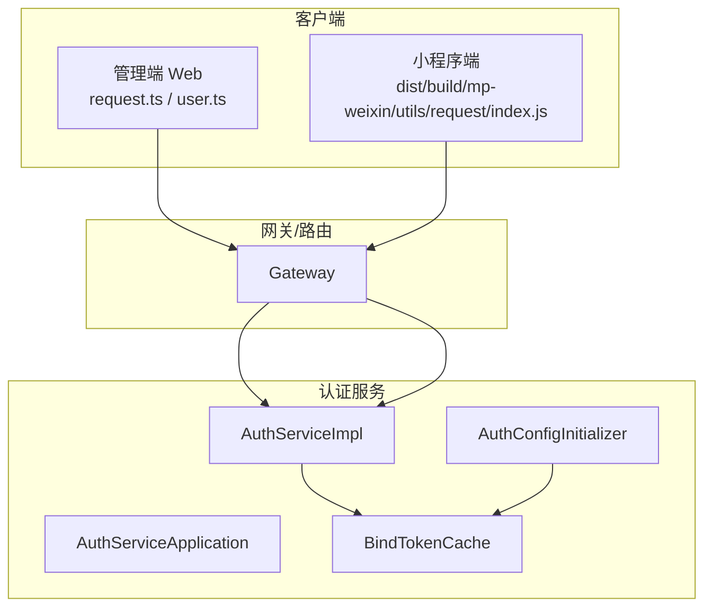
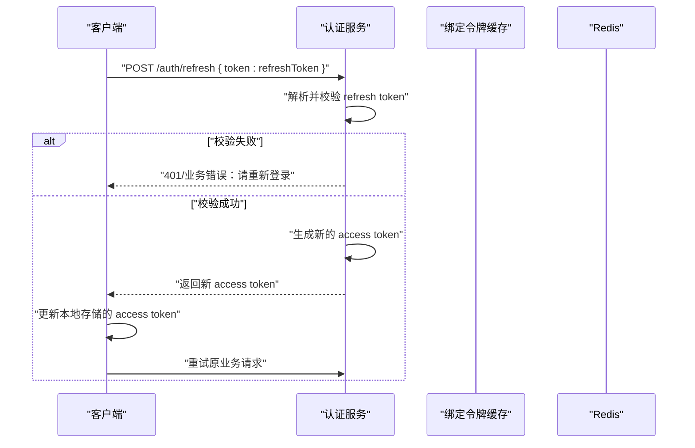
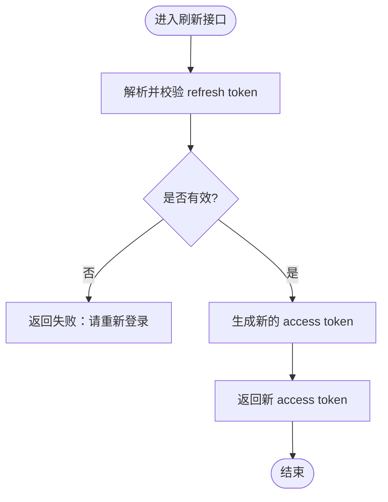
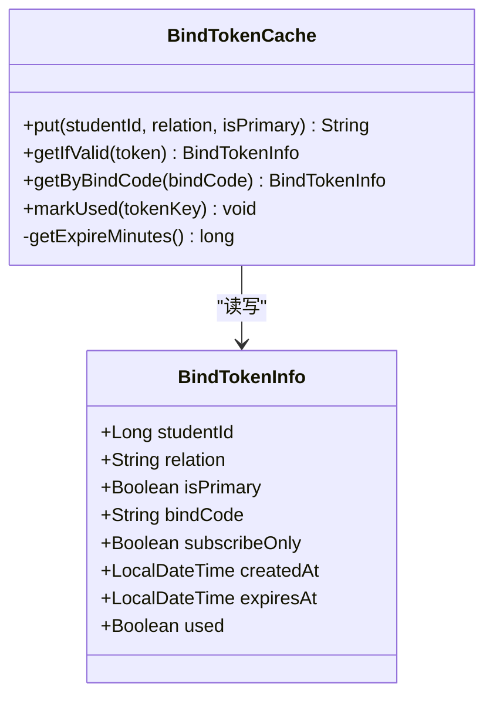
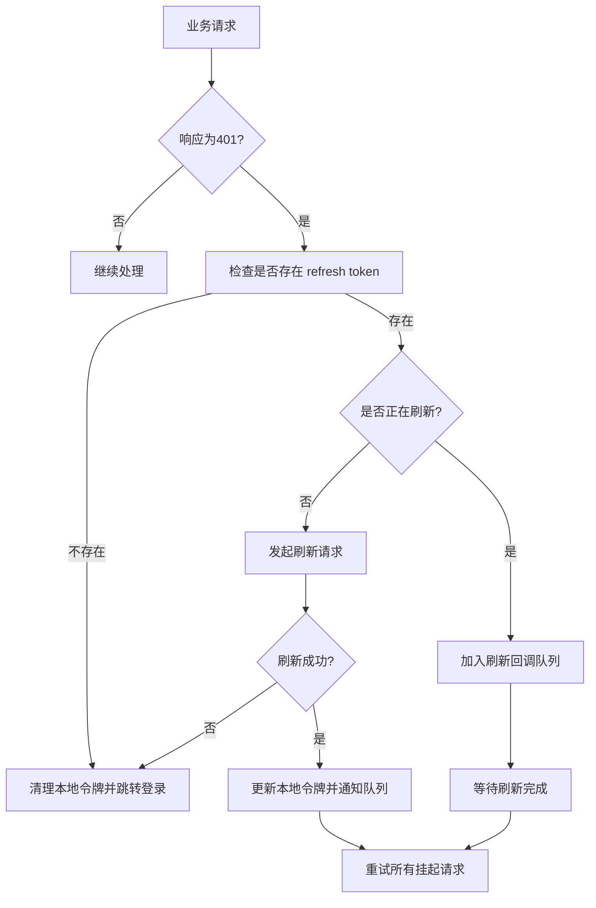
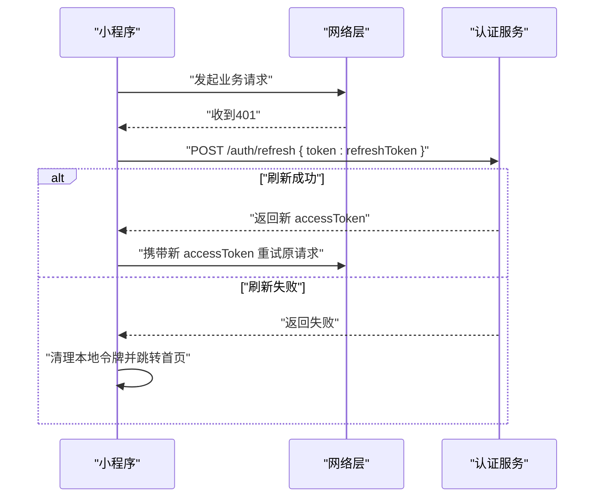
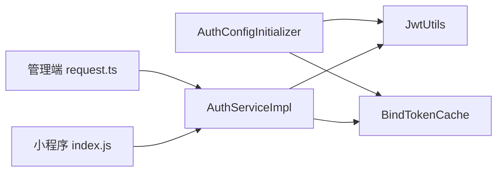

# JWT令牌刷新机制

<cite>
**本文引用的文件**   
- [AuthServiceApplication.java](file://class_times_record_back/auth-service/src/main/java/com/shiroko/AuthServiceApplication.java)
- [AuthConfigInitializer.java](file://class_times_record_back/auth-service/src/main/java/com/shiroko/config/AuthConfigInitializer.java)
- [BindTokenCache.java](file://class_times_record_back/auth-service/src/main/java/com/shiroko/service/cache/BindTokenCache.java)
- [AuthServiceImpl.java](file://class_times_record_back/auth-service/src/main/java/com/shiroko/service/impl/AuthServiceImpl.java)
- [request.ts（管理端）](file://class_record_admin_front/src/utils/request.ts)
- [user.ts（管理端）](file://class_record_admin_front/src/stores/user.ts)
- [index.js（小程序构建产物，含刷新逻辑）](file://class_times_record/dist/build/mp-weixin/utils/request/index.js)
- [architecture.md（架构文档片段）](file://class_times_record/docs/architecture.md)
</cite>

## 目录
1. [简介](#简介)
2. [项目结构](#项目结构)
3. [核心组件](#核心组件)
4. [架构总览](#架构总览)
5. [详细组件分析](#详细组件分析)
6. [依赖关系分析](#依赖关系分析)
7. [性能与并发特性](#性能与并发特性)
8. [安全机制](#安全机制)
9. [接口调用示例与错误处理](#接口调用示例与错误处理)
10. [故障排查指南](#故障排查指南)
11. [结论](#结论)

## 简介
本文件围绕JWT令牌刷新机制进行系统化说明，覆盖以下要点：
- Refresh Token的使用场景与刷新流程
- 无感续期、安全验证与旧令牌失效处理
- BindTokenCache绑定令牌缓存服务的作用（绑定关系管理、缓存策略、并发控制）
- 从客户端发起刷新请求到服务端返回新令牌的完整生命周期
- 防重放攻击、令牌劫持防护等安全机制
- 刷新接口调用示例与错误处理策略

## 项目结构
本项目采用前后端分离与多端接入的架构。后端认证服务负责签发与刷新JWT；前端与管理端在本地持久化令牌并在需要时触发刷新；小程序侧通过构建产物中的HTTP拦截器实现自动刷新。

图表来源
- [AuthServiceApplication.java:1-21](file://class_times_record_back/auth-service/src/main/java/com/shiroko/AuthServiceApplication.java#L1-L21)
- [AuthConfigInitializer.java:1-42](file://class_times_record_back/auth-service/src/main/java/com/shiroko/config/AuthConfigInitializer.java#L1-L42)
- [AuthServiceImpl.java:278-294](file://class_times_record_back/auth-service/src/main/java/com/shiroko/service/impl/AuthServiceImpl.java#L278-L294)
- [BindTokenCache.java:1-220](file://class_times_record_back/auth-service/src/main/java/com/shiroko/service/cache/BindTokenCache.java#L1-L220)
- [request.ts（管理端）](file://class_record_admin_front/src/utils/request.ts)
- [index.js（小程序构建产物，含刷新逻辑）](file://class_times_record/dist/build/mp-weixin/utils/request/index.js)

章节来源
- [AuthServiceApplication.java:1-21](file://class_times_record_back/auth-service/src/main/java/com/shiroko/AuthServiceApplication.java#L1-L21)
- [AuthConfigInitializer.java:1-42](file://class_times_record_back/auth-service/src/main/java/com/shiroko/config/AuthConfigInitializer.java#L1-L42)
- [AuthServiceImpl.java:278-294](file://class_times_record_back/auth-service/src/main/java/com/shiroko/service/impl/AuthServiceImpl.java#L278-L294)
- [BindTokenCache.java:1-220](file://class_times_record_back/auth-service/src/main/java/com/shiroko/service/cache/BindTokenCache.java#L1-L220)
- [request.ts（管理端）](file://class_record_admin_front/src/utils/request.ts)
- [index.js（小程序构建产物，含刷新逻辑）](file://class_times_record/dist/build/mp-weixin/utils/request/index.js)

## 核心组件
- 认证服务入口：应用启动类，注册服务与扫描Mapper
- 配置初始化器：将动态配置提供者注入至JWT工具与绑定令牌缓存，使过期时间可动态读取
- 认证服务实现：登录、刷新、登出、二维码绑定等核心业务
- 绑定令牌缓存：基于Redis的绑定令牌与绑定码映射，支持过期时间与使用状态管理
- 客户端刷新拦截器：管理端与小程序端在401时触发刷新并重试

章节来源
- [AuthServiceApplication.java:1-21](file://class_times_record_back/auth-service/src/main/java/com/shiroko/AuthServiceApplication.java#L1-L21)
- [AuthConfigInitializer.java:1-42](file://class_times_record_back/auth-service/src/main/java/com/shiroko/config/AuthConfigInitializer.java#L1-L42)
- [AuthServiceImpl.java:278-294](file://class_times_record_back/auth-service/src/main/java/com/shiroko/service/impl/AuthServiceImpl.java#L278-L294)
- [BindTokenCache.java:1-220](file://class_times_record_back/auth-service/src/main/java/com/shiroko/service/cache/BindTokenCache.java#L1-L220)
- [request.ts（管理端）](file://class_record_admin_front/src/utils/request.ts)
- [index.js（小程序构建产物，含刷新逻辑）](file://class_times_record/dist/build/mp-weixin/utils/request/index.js)

## 架构总览
下图展示一次完整的“Access Token 刷新”流程，包括客户端拦截、服务端校验与响应。

图表来源
- [AuthServiceImpl.java:278-294](file://class_times_record_back/auth-service/src/main/java/com/shiroko/service/impl/AuthServiceImpl.java#L278-L294)
- [AuthServiceImpl.java:296-312](file://class_times_record_back/auth-service/src/main/java/com/shiroko/service/impl/AuthServiceImpl.java#L296-L312)
- [request.ts（管理端）](file://class_record_admin_front/src/utils/request.ts)
- [index.js（小程序构建产物，含刷新逻辑）](file://class_times_record/dist/build/mp-weixin/utils/request/index.js)

## 详细组件分析

### 认证服务实现（刷新流程）
- 刷新接口：接收refresh token，校验通过后签发新的access token
- 登出处理：将当前token加入黑名单，确保立即失效
- 绑定相关：与BindTokenCache协作完成二维码绑定与订阅流程

图表来源
- [AuthServiceImpl.java:278-294](file://class_times_record_back/auth-service/src/main/java/com/shiroko/service/impl/AuthServiceImpl.java#L278-L294)

章节来源
- [AuthServiceImpl.java:278-294](file://class_times_record_back/auth-service/src/main/java/com/shiroko/service/impl/AuthServiceImpl.java#L278-L294)
- [AuthServiceImpl.java:296-312](file://class_times_record_back/auth-service/src/main/java/com/shiroko/service/impl/AuthServiceImpl.java#L296-L312)

### 绑定令牌缓存（BindTokenCache）
- 作用：维护“绑定token ↔ 绑定信息”的映射，以及“绑定码 ↔ token”的映射
- 缓存策略：基于Redis，TTL可配置（默认30分钟），支持used标记与清理
- 并发控制：通过Redis原子操作与幂等设计避免重复绑定

图表来源
- [BindTokenCache.java:1-220](file://class_times_record_back/auth-service/src/main/java/com/shiroko/service/cache/BindTokenCache.java#L1-L220)

章节来源
- [BindTokenCache.java:1-220](file://class_times_record_back/auth-service/src/main/java/com/shiroko/service/cache/BindTokenCache.java#L1-L220)
- [AuthConfigInitializer.java:1-42](file://class_times_record_back/auth-service/src/main/java/com/shiroko/config/AuthConfigInitializer.java#L1-L42)

### 客户端刷新拦截器（管理端）
- 触发条件：业务请求返回401时触发刷新
- 防抖与队列：维护刷新订阅者列表，避免并发多次刷新
- 结果处理：刷新成功后用新token重试所有挂起请求；失败则清理本地令牌并跳转登录页

图表来源
- [request.ts（管理端）](file://class_record_admin_front/src/utils/request.ts)
- [user.ts（管理端）](file://class_record_admin_front/src/stores/user.ts)

章节来源
- [request.ts（管理端）](file://class_record_admin_front/src/utils/request.ts)
- [user.ts（管理端）](file://class_record_admin_front/src/stores/user.ts)

### 客户端刷新拦截器（小程序端）
- 触发条件：业务请求返回401时触发刷新
- 行为：若刷新接口本身返回401或刷新失败，清理本地令牌并跳转首页
- 成功路径：更新本地accessToken后重试原请求

图表来源
- [index.js（小程序构建产物，含刷新逻辑）](file://class_times_record/dist/build/mp-weixin/utils/request/index.js)
- [AuthServiceImpl.java:278-294](file://class_times_record_back/auth-service/src/main/java/com/shiroko/service/impl/AuthServiceImpl.java#L278-L294)

章节来源
- [index.js（小程序构建产物，含刷新逻辑）](file://class_times_record/dist/build/mp-weixin/utils/request/index.js)
- [AuthServiceImpl.java:278-294](file://class_times_record_back/auth-service/src/main/java/com/shiroko/service/impl/AuthServiceImpl.java#L278-L294)

## 依赖关系分析
- 认证服务依赖JWT工具生成与解析令牌
- 配置初始化器将动态配置提供者注入JWT工具与绑定令牌缓存
- 客户端刷新拦截器依赖本地存储与网络层，统一处理401与刷新重试

图表来源
- [AuthConfigInitializer.java:1-42](file://class_times_record_back/auth-service/src/main/java/com/shiroko/config/AuthConfigInitializer.java#L1-L42)
- [AuthServiceImpl.java:278-294](file://class_times_record_back/auth-service/src/main/java/com/shiroko/service/impl/AuthServiceImpl.java#L278-L294)
- [BindTokenCache.java:1-220](file://class_times_record_back/auth-service/src/main/java/com/shiroko/service/cache/BindTokenCache.java#L1-L220)
- [request.ts（管理端）](file://class_record_admin_front/src/utils/request.ts)
- [index.js（小程序构建产物，含刷新逻辑）](file://class_times_record/dist/build/mp-weixin/utils/request/index.js)

章节来源
- [AuthConfigInitializer.java:1-42](file://class_times_record_back/auth-service/src/main/java/com/shiroko/config/AuthConfigInitializer.java#L1-L42)
- [AuthServiceImpl.java:278-294](file://class_times_record_back/auth-service/src/main/java/com/shiroko/service/impl/AuthServiceImpl.java#L278-L294)
- [BindTokenCache.java:1-220](file://class_times_record_back/auth-service/src/main/java/com/shiroko/service/cache/BindTokenCache.java#L1-L220)
- [request.ts（管理端）](file://class_record_admin_front/src/utils/request.ts)
- [index.js（小程序构建产物，含刷新逻辑）](file://class_times_record/dist/build/mp-weixin/utils/request/index.js)

## 性能与并发特性
- 刷新节流：管理端通过订阅者队列避免并发多次刷新
- 缓存一致性：绑定令牌缓存基于Redis，天然支持多实例共享与过期清理
- 幂等保护：绑定流程对重复绑定进行幂等判断，防止并发导致的数据不一致

章节来源
- [request.ts（管理端）](file://class_record_admin_front/src/utils/request.ts)
- [BindTokenCache.java:1-220](file://class_times_record_back/auth-service/src/main/java/com/shiroko/service/cache/BindTokenCache.java#L1-L220)

## 安全机制
- 令牌黑名单：登出时将当前token加入黑名单，即使未过期也拒绝访问
- 刷新校验：仅当refresh token有效时才允许刷新，否则要求重新登录
- 防重放：绑定码与绑定token具备一次性使用标记，使用后清理
- 传输安全：建议全站HTTPS，结合签名与时间戳参数增强完整性与时效性（参考小程序构建产物中签名逻辑）

章节来源
- [AuthServiceImpl.java:296-312](file://class_times_record_back/auth-service/src/main/java/com/shiroko/service/impl/AuthServiceImpl.java#L296-L312)
- [AuthServiceImpl.java:278-294](file://class_times_record_back/auth-service/src/main/java/com/shiroko/service/impl/AuthServiceImpl.java#L278-L294)
- [BindTokenCache.java:1-220](file://class_times_record_back/auth-service/src/main/java/com/shiroko/service/cache/BindTokenCache.java#L1-L220)
- [index.js（小程序构建产物，含刷新逻辑）](file://class_times_record/dist/build/mp-weixin/utils/request/index.js)

## 接口调用示例与错误处理
- 刷新接口
  - 方法：POST
  - 路径：/auth/refresh
  - 请求体：{ token: refreshToken }
  - 成功响应：返回新的access token
  - 失败响应：返回错误提示并要求重新登录
- 错误处理策略
  - 管理端：刷新失败清理本地令牌并跳转登录；刷新成功用新令牌重试所有挂起请求
  - 小程序端：刷新失败清理本地令牌并跳转首页；刷新成功更新本地令牌并重试原请求

章节来源
- [AuthServiceImpl.java:278-294](file://class_times_record_back/auth-service/src/main/java/com/shiroko/service/impl/AuthServiceImpl.java#L278-L294)
- [request.ts（管理端）](file://class_record_admin_front/src/utils/request.ts)
- [index.js（小程序构建产物，含刷新逻辑）](file://class_times_record/dist/build/mp-weixin/utils/request/index.js)
- [architecture.md（架构文档片段）](file://class_times_record/docs/architecture.md)

## 故障排查指南
- 现象：频繁401且无法刷新
  - 排查点：确认本地是否存在有效的refresh token；检查刷新接口是否被正确调用
- 现象：刷新成功但后续请求仍失败
  - 排查点：确认客户端是否正确更新本地access token并携带至重试请求
- 现象：绑定码重复使用
  - 排查点：确认BindTokenCache的used标记与清理逻辑是否生效

章节来源
- [AuthServiceImpl.java:278-294](file://class_times_record_back/auth-service/src/main/java/com/shiroko/service/impl/AuthServiceImpl.java#L278-L294)
- [BindTokenCache.java:1-220](file://class_times_record_back/auth-service/src/main/java/com/shiroko/service/cache/BindTokenCache.java#L1-L220)
- [request.ts（管理端）](file://class_record_admin_front/src/utils/request.ts)
- [index.js（小程序构建产物，含刷新逻辑）](file://class_times_record/dist/build/mp-weixin/utils/request/index.js)

## 结论
本方案通过“短效Access Token + 长效Refresh Token”的组合，配合客户端无感刷新拦截与服务端严格校验，实现了良好的用户体验与安全边界。同时，BindTokenCache以Redis为中心提供高可用、可配置的绑定令牌管理能力，并通过一次性使用与幂等设计保障绑定流程的可靠性。建议在部署中启用HTTPS、合理设置令牌过期时间，并结合日志与监控持续优化刷新成功率与异常定位效率。