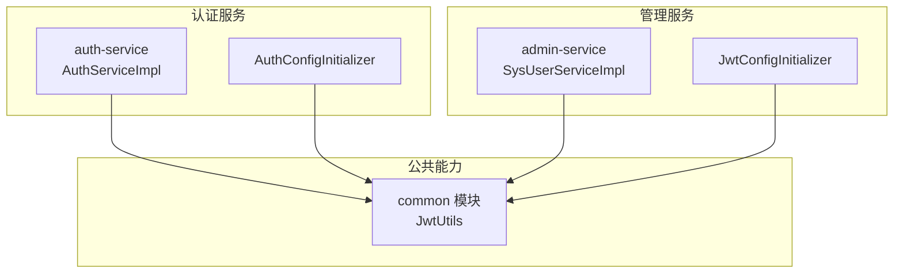
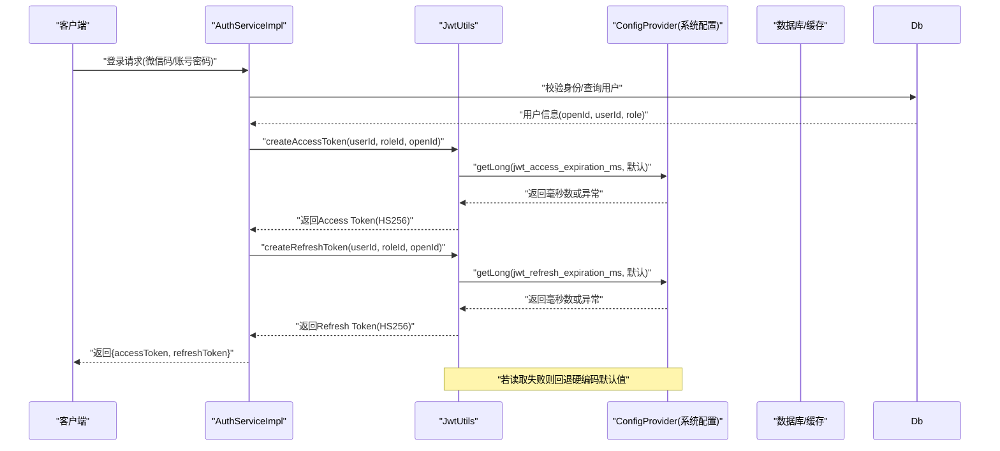
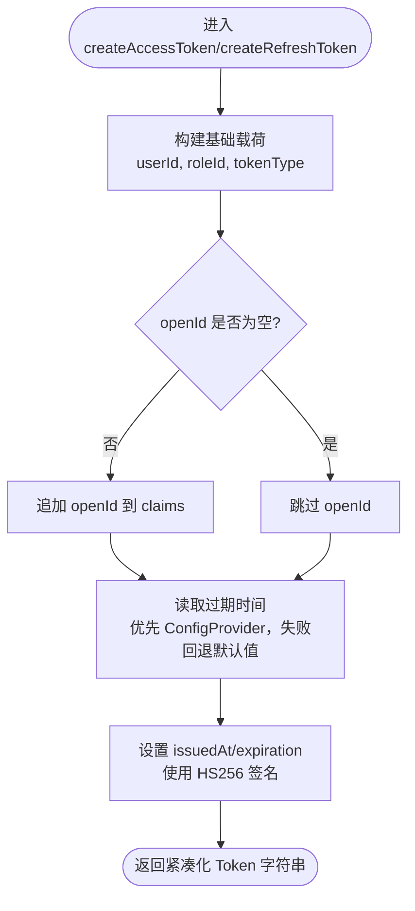
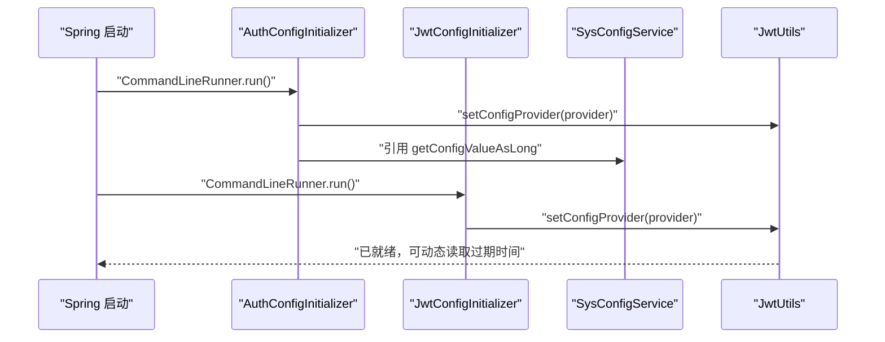
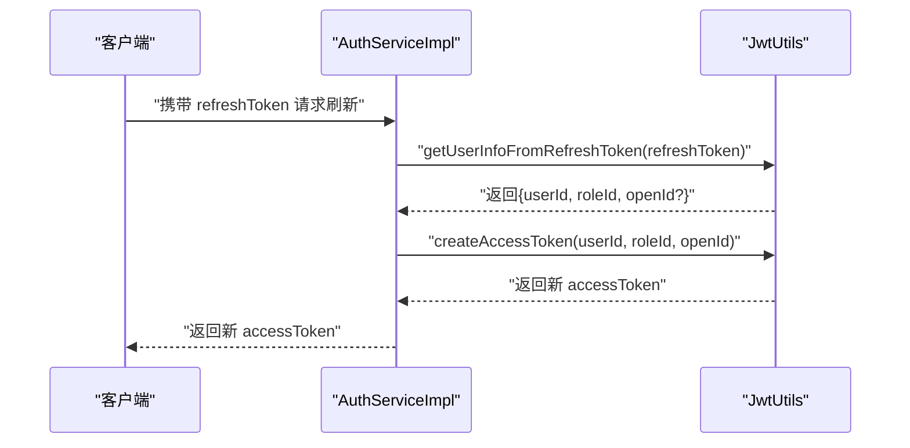
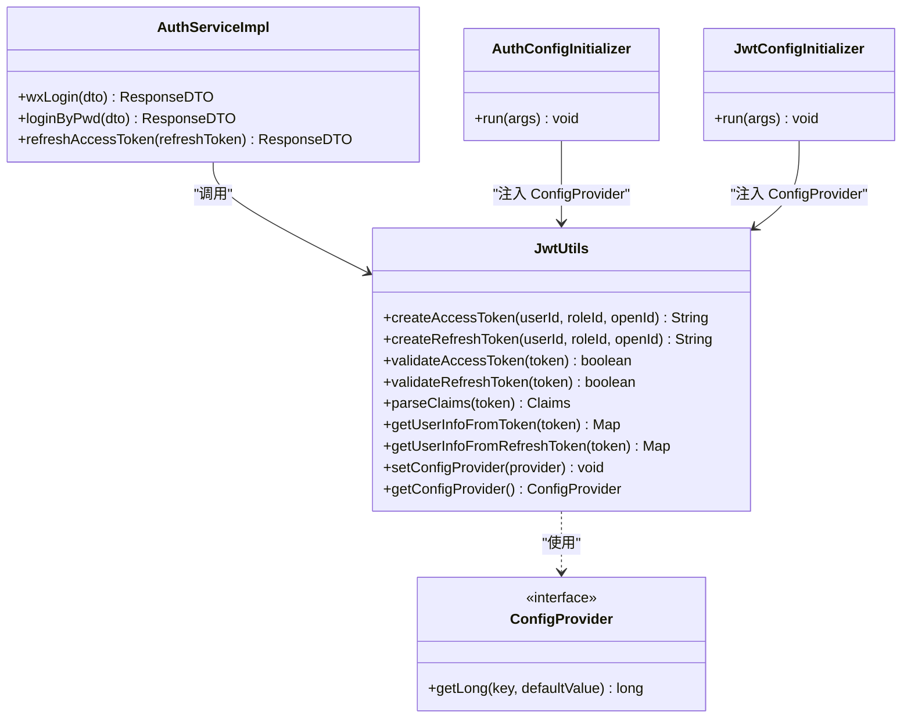

# JWT令牌生成机制

<cite>
**本文引用的文件**   
- [JwtUtils.java](file://class_times_record_back/common/src/main/java/com/shiroko/util/JwtUtils.java)
- [AuthServiceImpl.java](file://class_times_record_back/auth-service/src/main/java/com/shiroko/service/impl/AuthServiceImpl.java)
- [JwtConfigInitializer.java](file://class_times_record_back/admin-service/src/main/java/com/shiroko/config/JwtConfigInitializer.java)
- [AuthConfigInitializer.java](file://class_times_record_back/auth-service/src/main/java/com/shiroko/config/AuthConfigInitializer.java)
</cite>

## 目录
1. [简介](#简介)
2. [项目结构](#项目结构)
3. [核心组件](#核心组件)
4. [架构总览](#架构总览)
5. [详细组件分析](#详细组件分析)
6. [依赖关系分析](#依赖关系分析)
7. [性能与安全性考量](#性能与安全性考量)
8. [故障排查指南](#故障排查指南)
9. [结论](#结论)
10. [附录：令牌结构与配置示例](#附录令牌结构与配置示例)

## 简介
本文件围绕JWT令牌生成机制，系统性说明Access Token与Refresh Token的生成算法、签名机制与载荷结构设计；阐述双Token架构的设计原理（用途区分、过期时间配置与动态获取）；深入解析JwtUtils工具类中createAccessToken与createRefreshToken的实现细节（用户信息嵌入、openId处理、HMAC-SHA256签名过程）；并介绍ConfigProvider配置提供者的注入机制与默认值回退策略。文末给出完整的令牌结构示例与安全配置最佳实践。

## 项目结构
本项目采用多服务模块化架构，JWT相关实现集中在common模块的工具类中，并在各业务服务启动时通过初始化器将配置提供者注入到JwtUtils，从而支持运行时动态调整过期时间。

图表来源
- [JwtUtils.java:1-213](file://class_times_record_back/common/src/main/java/com/shiroko/util/JwtUtils.java#L1-L213)
- [AuthServiceImpl.java:100-115](file://class_times_record_back/auth-service/src/main/java/com/shiroko/service/impl/AuthServiceImpl.java#L100-L115)
- [AuthConfigInitializer.java:30-40](file://class_times_record_back/auth-service/src/main/java/com/shiroko/config/AuthConfigInitializer.java#L30-L40)
- [JwtConfigInitializer.java:29-34](file://class_times_record_back/admin-service/src/main/java/com/shiroko/config/JwtConfigInitializer.java#L29-L34)

章节来源
- [JwtUtils.java:1-213](file://class_times_record_back/common/src/main/java/com/shiroko/util/JwtUtils.java#L1-L213)
- [AuthServiceImpl.java:100-115](file://class_times_record_back/auth-service/src/main/java/com/shiroko/service/impl/AuthServiceImpl.java#L100-L115)
- [AuthConfigInitializer.java:30-40](file://class_times_record_back/auth-service/src/main/java/com/shiroko/config/AuthConfigInitializer.java#L30-L40)
- [JwtConfigInitializer.java:29-34](file://class_times_record_back/admin-service/src/main/java/com/shiroko/config/JwtConfigInitializer.java#L29-L34)

## 核心组件
- JwtUtils：封装JWT创建、校验与解析逻辑，内置双Token类型标识、HMAC-SHA256签名、过期时间动态读取与默认回退。
- ConfigProvider：在JwtUtils内部定义的函数式接口，用于解耦配置来源，由具体服务在启动时注入。
- 服务层调用方：AuthServiceImpl与AdminService中的用户登录流程均通过JwtUtils生成双Token。

章节来源
- [JwtUtils.java:27-104](file://class_times_record_back/common/src/main/java/com/shiroko/util/JwtUtils.java#L27-L104)
- [AuthServiceImpl.java:108-114](file://class_times_record_back/auth-service/src/main/java/com/shiroko/service/impl/AuthServiceImpl.java#L108-L114)

## 架构总览
下图展示双Token生成与刷新流程，以及配置提供者注入路径。

图表来源
- [AuthServiceImpl.java:108-114](file://class_times_record_back/auth-service/src/main/java/com/shiroko/service/impl/AuthServiceImpl.java#L108-L114)
- [JwtUtils.java:112-149](file://class_times_record_back/common/src/main/java/com/shiroko/util/JwtUtils.java#L112-L149)
- [JwtUtils.java:80-104](file://class_times_record_back/common/src/main/java/com/shiroko/util/JwtUtils.java#L80-L104)

## 详细组件分析

### JwtUtils 工具类
- 设计要点
  - 双Token类型：通过claims中的tokenType字段区分access与refresh。
  - 载荷结构：包含userId、roleId、tokenType，可选openId（当非空时加入）。
  - 签名算法：使用HMAC-SHA256（HS256），密钥为固定字符串经UTF-8编码后构造Key。
  - 过期时间：优先从ConfigProvider读取，失败回退默认值（Access 5分钟，Refresh 7天）。
  - 验证方法：validateAccessToken/validateRefreshToken仅校验类型是否匹配，不校验过期；parseClaims/getUserInfoFromToken等用于解析载荷。

- createAccessToken 实现要点
  - 设置subject为统一标识。
  - 写入userId、roleId、tokenType=access。
  - 若openId非空且非空白，写入openId。
  - 设置issuedAt与expiration（当前时间+Access过期时长）。
  - 使用HS256签名并compact输出。

- createRefreshToken 实现要点
  - 与Access类似，但tokenType=refresh，过期时长取自Refresh配置。

- 配置提供者与回退策略
  - getAccessExpiration/getRefreshExpiration：先尝试configProvider.getLong(key, defaultValue)，捕获异常记录警告日志并回退默认值。
  - setConfigProvider：由服务启动时注入，避免common模块对具体实现的耦合。

图表来源
- [JwtUtils.java:112-149](file://class_times_record_back/common/src/main/java/com/shiroko/util/JwtUtils.java#L112-L149)
- [JwtUtils.java:80-104](file://class_times_record_back/common/src/main/java/com/shiroko/util/JwtUtils.java#L80-L104)

章节来源
- [JwtUtils.java:27-104](file://class_times_record_back/common/src/main/java/com/shiroko/util/JwtUtils.java#L27-L104)
- [JwtUtils.java:112-149](file://class_times_record_back/common/src/main/java/com/shiroko/util/JwtUtils.java#L112-L149)
- [JwtUtils.java:151-211](file://class_times_record_back/common/src/main/java/com/shiroko/util/JwtUtils.java#L151-L211)

### 配置提供者注入机制（ConfigProvider）
- 注入位置
  - admin-service：JwtConfigInitializer 在应用启动后将 SysConfigService::getConfigValueAsLong 适配为 JwtUtils.ConfigProvider 并注入。
  - auth-service：AuthConfigInitializer 同样完成注入，并将同一 provider 共享给其他需要动态配置的组件（如绑定令牌缓存）。

- 作用
  - 使JWT过期时间可在管理端在线修改，无需重启服务。
  - 未注入或读取异常时，自动回退到硬编码默认值，保证可用性。

图表来源
- [AuthConfigInitializer.java:30-40](file://class_times_record_back/auth-service/src/main/java/com/shiroko/config/AuthConfigInitializer.java#L30-L40)
- [JwtConfigInitializer.java:29-34](file://class_times_record_back/admin-service/src/main/java/com/shiroko/config/JwtConfigInitializer.java#L29-L34)

章节来源
- [AuthConfigInitializer.java:30-40](file://class_times_record_back/auth-service/src/main/java/com/shiroko/config/AuthConfigInitializer.java#L30-L40)
- [JwtConfigInitializer.java:29-34](file://class_times_record_back/admin-service/src/main/java/com/shiroko/config/JwtConfigInitializer.java#L29-L34)

### 双Token架构设计与用法
- 用途区分
  - Access Token：短生命周期，用于访问受保护资源。
  - Refresh Token：长生命周期，用于无感刷新Access Token。
- 过期时间配置
  - 通过配置键jwt_access_expiration_ms与jwt_refresh_expiration_ms控制。
  - 读取失败时分别回退至5分钟与7天的默认值。
- 动态获取机制
  - 每次生成Token前都会尝试读取最新配置，确保管理端变更即时生效。
- 刷新流程
  - 服务端接收Refresh Token，解析出userId与roleId，再签发新的Access Token（保留openId以维持上下文一致性）。

图表来源
- [AuthServiceImpl.java:279-294](file://class_times_record_back/auth-service/src/main/java/com/shiroko/service/impl/AuthServiceImpl.java#L279-L294)
- [JwtUtils.java:197-211](file://class_times_record_back/common/src/main/java/com/shiroko/util/JwtUtils.java#L197-L211)
- [JwtUtils.java:112-127](file://class_times_record_back/common/src/main/java/com/shiroko/util/JwtUtils.java#L112-L127)

章节来源
- [AuthServiceImpl.java:279-294](file://class_times_record_back/auth-service/src/main/java/com/shiroko/service/impl/AuthServiceImpl.java#L279-L294)
- [JwtUtils.java:197-211](file://class_times_record_back/common/src/main/java/com/shiroko/util/JwtUtils.java#L197-L211)

## 依赖关系分析
- JwtUtils 依赖
  - JJWT库：Jwts.builder/parserBuilder、SignatureAlgorithm.HS256、Keys.hmacShaKeyFor。
  - 配置提供者：ConfigProvider接口，由外部服务注入。
- 服务层依赖
  - AuthServiceImpl/SysUserServiceImpl 调用 JwtUtils 生成双Token。
  - 初始化器在启动时将 SysConfigService 适配为 ConfigProvider 注入到 JwtUtils。

图表来源
- [JwtUtils.java:27-104](file://class_times_record_back/common/src/main/java/com/shiroko/util/JwtUtils.java#L27-L104)
- [AuthServiceImpl.java:100-115](file://class_times_record_back/auth-service/src/main/java/com/shiroko/service/impl/AuthServiceImpl.java#L100-L115)
- [AuthConfigInitializer.java:30-40](file://class_times_record_back/auth-service/src/main/java/com/shiroko/config/AuthConfigInitializer.java#L30-L40)
- [JwtConfigInitializer.java:29-34](file://class_times_record_back/admin-service/src/main/java/com/shiroko/config/JwtConfigInitializer.java#L29-L34)

章节来源
- [JwtUtils.java:27-104](file://class_times_record_back/common/src/main/java/com/shiroko/util/JwtUtils.java#L27-L104)
- [AuthServiceImpl.java:100-115](file://class_times_record_back/auth-service/src/main/java/com/shiroko/service/impl/AuthServiceImpl.java#L100-L115)
- [AuthConfigInitializer.java:30-40](file://class_times_record_back/auth-service/src/main/java/com/shiroko/config/AuthConfigInitializer.java#L30-L40)
- [JwtConfigInitializer.java:29-34](file://class_times_record_back/admin-service/src/main/java/com/shiroko/config/JwtConfigInitializer.java#L29-L34)

## 性能与安全性考量
- 性能
  - 每次生成Token前读取配置，若配置源响应慢或异常会触发回退逻辑并记录警告日志。建议配置源具备本地缓存以提升读取性能。
  - HS256签名计算开销较低，适合高频场景。
- 安全性
  - 密钥固定于代码中，生产环境应改为安全存储（如环境变量或密钥管理服务），避免泄露。
  - Access Token短时效降低泄露风险；Refresh Token长时效需配合黑名单/撤销机制（例如登出时将Access Token加入Redis黑名单）。
  - 载荷中包含敏感信息（userId、roleId、openId），应确保传输链路加密（HTTPS）与前端安全存储。

[本节为通用指导，不涉及具体文件分析]

## 故障排查指南
- 常见问题
  - 配置读取失败：检查SysConfigService是否成功注入，确认配置键是否存在且值为正整数。
  - Token无效：确认客户端传递的是正确的tokenType对应Token（Access/Refresh），并检查是否已被加入黑名单。
  - 重复绑定/权限问题：登录流程中涉及平台绑定与角色权限校验，需结合业务日志定位。
- 定位建议
  - 查看JwtUtils读取配置时的警告日志，确认是否回退默认值。
  - 检查AuthService中登录与刷新流程的返回值与错误码。

章节来源
- [JwtUtils.java:80-104](file://class_times_record_back/common/src/main/java/com/shiroko/util/JwtUtils.java#L80-L104)
- [AuthServiceImpl.java:279-294](file://class_times_record_back/auth-service/src/main/java/com/shiroko/service/impl/AuthServiceImpl.java#L279-L294)

## 结论
本方案通过JwtUtils集中实现双Token的生成与校验，结合ConfigProvider实现过期时间的动态配置与默认回退，兼顾灵活性与可用性。服务层在登录与刷新流程中清晰分离Access与Refresh Token的职责，满足高可用与安全的鉴权需求。生产部署时应关注密钥管理与配置源可靠性，并结合黑名单机制完善Token撤销能力。

[本节为总结性内容，不涉及具体文件分析]

## 附录：令牌结构与配置示例

- 载荷结构（claims）
  - 公共字段
    - sub：统一主题标识
    - userId：用户ID
    - roleId：角色ID
    - tokenType：access 或 refresh
  - 可选字段
    - openId：微信openId（仅在非空时加入）

- 示例（示意，非真实值）
  - Access Token 载荷示例
    - sub: "c_user_auth"
    - userId: 123456
    - roleId: 2
    - tokenType: "access"
    - openId: "oXxxxxx..."
    - iat: 当前时间戳
    - exp: 当前时间 + 5分钟
  - Refresh Token 载荷示例
    - sub: "c_user_auth"
    - userId: 123456
    - roleId: 2
    - tokenType: "refresh"
    - openId: "oXxxxxx..."
    - iat: 当前时间戳
    - exp: 当前时间 + 7天

- 配置键与默认值
  - jwt_access_expiration_ms：Access Token过期时间（毫秒），默认 5 分钟
  - jwt_refresh_expiration_ms：Refresh Token过期时间（毫秒），默认 7 天

- 安全配置最佳实践
  - 将签名密钥从代码常量迁移至环境变量或密钥管理服务。
  - 强制HTTPS传输，前端安全存储Token（避免持久化明文）。
  - 结合Redis黑名单实现登出即失效，缩短Access Token有效期。
  - 定期轮换密钥并建立灰度切换策略。

章节来源
- [JwtUtils.java:112-149](file://class_times_record_back/common/src/main/java/com/shiroko/util/JwtUtils.java#L112-L149)
- [JwtUtils.java:80-104](file://class_times_record_back/common/src/main/java/com/shiroko/util/JwtUtils.java#L80-L104)