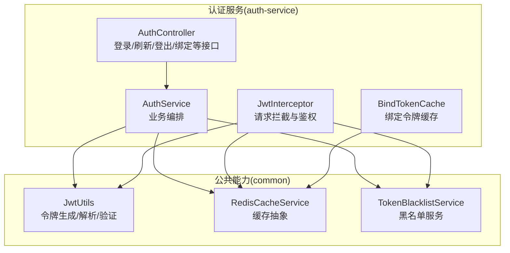
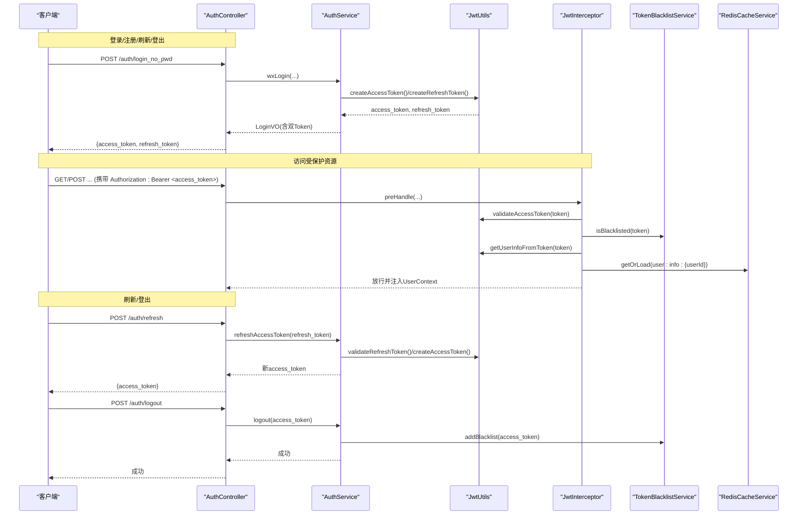
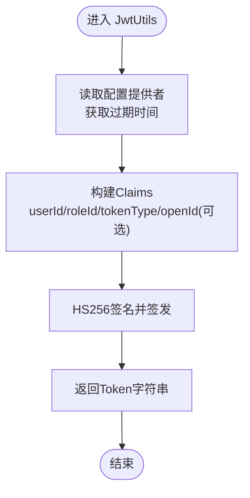
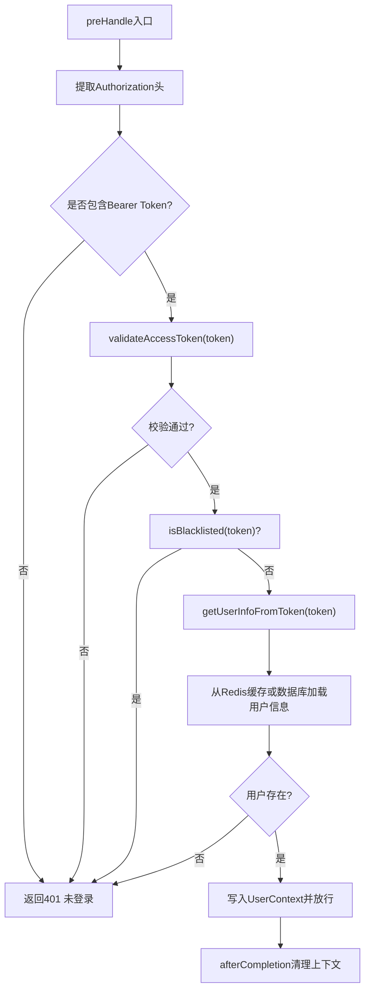
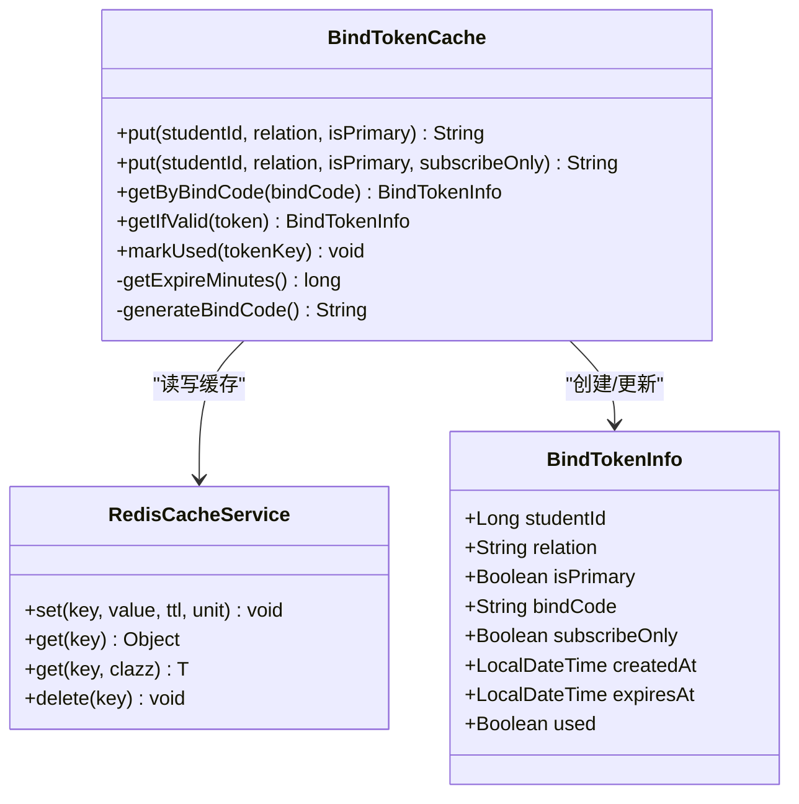
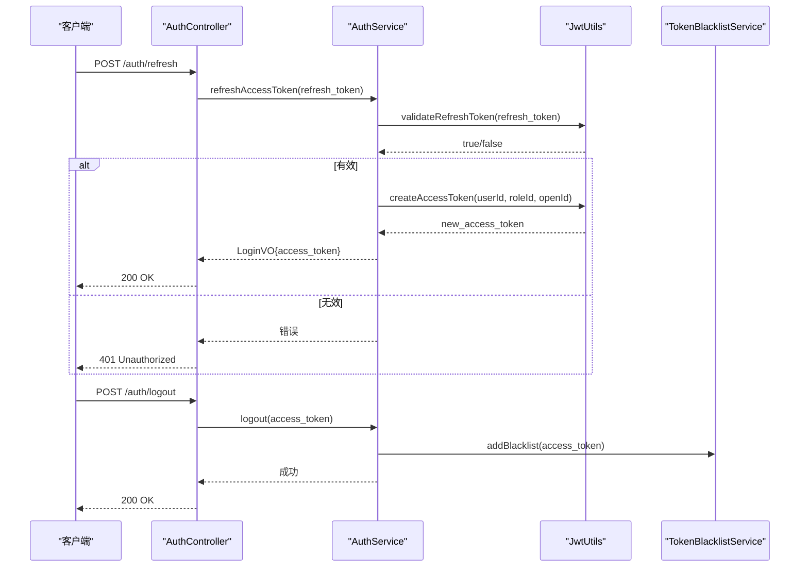
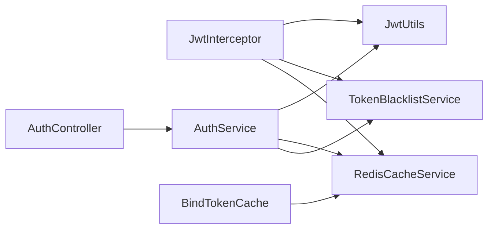
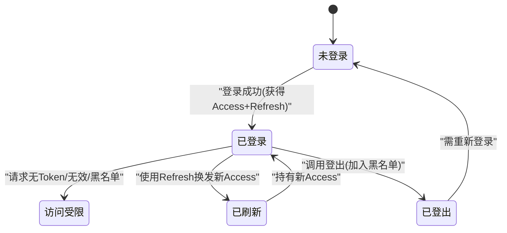

# JWT令牌管理

<cite>
**本文引用的文件**
- [JwtUtils.java](file://class_times_record_back/common/src/main/java/com/shiroko/util/JwtUtils.java)
- [JwtInterceptor.java](file://class_times_record_back/auth-service/src/main/java/com/shiroko/interceptor/JwtInterceptor.java)
- [BindTokenCache.java](file://class_times_record_back/auth-service/src/main/java/com/shiroko/service/cache/BindTokenCache.java)
- [AuthController.java](file://class_times_record_back/auth-service/src/main/java/com/shiroko/controller/AuthController.java)
- [AuthService.java](file://class_times_record_back/auth-service/src/main/java/com/shiroko/service/AuthService.java)
- [RedisCacheService.java](file://class_times_record_back/common/src/main/java/com/shiroko/service/cache/RedisCacheService.java)
- [TokenBlacklistService.java](file://class_times_record_back/common/src/main/java/com/shiroko/service/cache/TokenBlacklistService.java)
</cite>

## 目录
1. [简介](#简介)
2. [项目结构](#项目结构)
3. [核心组件](#核心组件)
4. [架构总览](#架构总览)
5. [详细组件分析](#详细组件分析)
6. [依赖关系分析](#依赖关系分析)
7. [性能考虑](#性能考虑)
8. [故障排查指南](#故障排查指南)
9. [结论](#结论)
10. [附录](#附录)

## 简介
本文件围绕JWT令牌管理进行系统化说明，覆盖令牌的生成、解析、验证与刷新机制；深入解释有效期管理、黑名单机制、缓存策略与安全配置；详解JwtInterceptor拦截器在请求拦截、Token校验、用户信息提取与权限前置校验中的工作原理；介绍BindTokenCache绑定令牌缓存服务的作用与实现；并提供完整的令牌生命周期图、安全配置选项、性能优化建议以及自定义令牌策略的扩展指南。

## 项目结构
后端采用多模块微服务架构，认证相关能力集中在auth-service，通用工具与缓存接口位于common模块：
- common模块提供JWT工具类、Redis缓存抽象、黑名单服务等基础能力
- auth-service提供认证控制器与服务，集成拦截器完成鉴权流程
- BindTokenCache用于二维码/绑定码场景的短期令牌管理

图表来源
- [JwtUtils.java:1-213](file://class_times_record_back/common/src/main/java/com/shiroko/util/JwtUtils.java#L1-L213)
- [JwtInterceptor.java:1-153](file://class_times_record_back/auth-service/src/main/java/com/shiroko/interceptor/JwtInterceptor.java#L1-L153)
- [BindTokenCache.java:1-220](file://class_times_record_back/auth-service/src/main/java/com/shiroko/service/cache/BindTokenCache.java#L1-L220)
- [AuthController.java:1-197](file://class_times_record_back/auth-service/src/main/java/com/shiroko/controller/AuthController.java#L1-L197)
- [RedisCacheService.java](file://class_times_record_back/common/src/main/java/com/shiroko/service/cache/RedisCacheService.java)
- [TokenBlacklistService.java](file://class_times_record_back/common/src/main/java/com/shiroko/service/cache/TokenBlacklistService.java)

章节来源
- [AuthController.java:1-197](file://class_times_record_back/auth-service/src/main/java/com/shiroko/controller/AuthController.java#L1-L197)
- [AuthService.java:1-116](file://class_times_record_back/auth-service/src/main/java/com/shiroko/service/AuthService.java#L1-L116)

## 核心组件
- JwtUtils：双Token（Access + Refresh）的生成、解析与类型校验；支持通过ConfigProvider动态读取过期时间，失败回退默认值；提供用户信息提取方法。
- JwtInterceptor：统一鉴权拦截器，从Authorization头提取Bearer Token，校验类型与签名，检查黑名单，加载并缓存用户信息，写入上下文供后续处理使用。
- RedisCacheService：统一的缓存读写封装，支持TTL设置与getOrLoad模式。
- TokenBlacklistService：令牌黑名单服务，用于登出后拒绝有效但已失效的Token。
- BindTokenCache：基于Redis的绑定令牌缓存，支持token与绑定码双向映射、一次性使用标记与过期清理。
- AuthController/AuthService：对外暴露登录、刷新、登出、绑定、订阅消息授权等接口，编排上述组件完成业务流程。

章节来源
- [JwtUtils.java:1-213](file://class_times_record_back/common/src/main/java/com/shiroko/util/JwtUtils.java#L1-L213)
- [JwtInterceptor.java:1-153](file://class_times_record_back/auth-service/src/main/java/com/shiroko/interceptor/JwtInterceptor.java#L1-L153)
- [BindTokenCache.java:1-220](file://class_times_record_back/auth-service/src/main/java/com/shiroko/service/cache/BindTokenCache.java#L1-L220)
- [AuthController.java:1-197](file://class_times_record_back/auth-service/src/main/java/com/shiroko/controller/AuthController.java#L1-L197)
- [AuthService.java:1-116](file://class_times_record_back/auth-service/src/main/java/com/shiroko/service/AuthService.java#L1-L116)

## 架构总览
下图展示了客户端到服务端的关键调用路径，包括登录获取双Token、访问受保护资源时的拦截器校验、刷新与登出流程。

图表来源
- [AuthController.java:58-81](file://class_times_record_back/auth-service/src/main/java/com/shiroko/controller/AuthController.java#L58-L81)
- [AuthService.java:29-39](file://class_times_record_back/auth-service/src/main/java/com/shiroko/service/AuthService.java#L29-L39)
- [JwtUtils.java:112-175](file://class_times_record_back/common/src/main/java/com/shiroko/util/JwtUtils.java#L112-L175)
- [JwtInterceptor.java:76-124](file://class_times_record_back/auth-service/src/main/java/com/shiroko/interceptor/JwtInterceptor.java#L76-L124)
- [TokenBlacklistService.java](file://class_times_record_back/common/src/main/java/com/shiroko/service/cache/TokenBlacklistService.java)
- [RedisCacheService.java](file://class_times_record_back/common/src/main/java/com/shiroko/service/cache/RedisCacheService.java)

## 详细组件分析

### JwtUtils：令牌生成、解析与验证
- 双Token设计：
  - Access Token：短时效，用于访问受保护资源
  - Refresh Token：长时效，用于换取新的Access Token
- 过期时间可配置：
  - 通过ConfigProvider动态读取jwt_access_expiration_ms与jwt_refresh_expiration_ms
  - 读取失败时回退默认值（Access 5分钟，Refresh 7天）
- 签名算法：HS256，固定密钥（生产环境应替换为安全配置）
- 主要方法：
  - createAccessToken/createRefreshToken：生成带claims的Token
  - validateAccessToken/validateRefreshToken：校验类型与签名
  - parseClaims/getUserInfoFromToken/getUserInfoFromRefreshToken：解析与提取用户信息

图表来源
- [JwtUtils.java:76-104](file://class_times_record_back/common/src/main/java/com/shiroko/util/JwtUtils.java#L76-L104)
- [JwtUtils.java:112-149](file://class_times_record_back/common/src/main/java/com/shiroko/util/JwtUtils.java#L112-L149)

章节来源
- [JwtUtils.java:1-213](file://class_times_record_back/common/src/main/java/com/shiroko/util/JwtUtils.java#L1-L213)

### JwtInterceptor：请求拦截与鉴权
- 请求拦截流程：
  - 从Authorization头提取Bearer Token
  - 校验是否为有效的Access Token
  - 检查是否在黑名单中（已登出）
  - 解析Token获取userId/roleId
  - 优先从Redis缓存加载用户信息，未命中则查库并缓存
  - 将用户DTO写入UserContext供后续处理器使用
- 响应处理：
  - 未登录/过期/黑名单/用户不存在均返回401及错误消息
- 线程隔离：
  - afterCompletion中清理UserContext，避免跨请求污染

图表来源
- [JwtInterceptor.java:76-133](file://class_times_record_back/auth-service/src/main/java/com/shiroko/interceptor/JwtInterceptor.java#L76-L133)
- [RedisCacheService.java](file://class_times_record_back/common/src/main/java/com/shiroko/service/cache/RedisCacheService.java)
- [TokenBlacklistService.java](file://class_times_record_back/common/src/main/java/com/shiroko/service/cache/TokenBlacklistService.java)

章节来源
- [JwtInterceptor.java:1-153](file://class_times_record_back/auth-service/src/main/java/com/shiroko/interceptor/JwtInterceptor.java#L1-L153)

### BindTokenCache：绑定令牌缓存服务
- 用途：为二维码/绑定码场景生成短期令牌，支持token与6位绑定码双向映射
- 特性：
  - 过期时间可配置（bind_token_expire_minutes），默认30分钟
  - 支持“仅订阅”模式（subscribeOnly=true）限制家长端行为
  - 一次性使用标记（used=true）后自动清理键值对
- 键设计：
  - bind:token:{token} → BindTokenInfo JSON
  - bind:code:{bindCode} → token
- 关键方法：
  - put：生成token与绑定码并写入Redis
  - getByBindCode/getIfValid：查询未过期且未使用的绑定信息
  - markUsed：标记已使用并清理对应键

图表来源
- [BindTokenCache.java:72-204](file://class_times_record_back/auth-service/src/main/java/com/shiroko/service/cache/BindTokenCache.java#L72-L204)
- [BindTokenCache.java:206-218](file://class_times_record_back/auth-service/src/main/java/com/shiroko/service/cache/BindTokenCache.java#L206-L218)
- [RedisCacheService.java](file://class_times_record_back/common/src/main/java/com/shiroko/service/cache/RedisCacheService.java)

章节来源
- [BindTokenCache.java:1-220](file://class_times_record_back/auth-service/src/main/java/com/shiroko/service/cache/BindTokenCache.java#L1-L220)

### 认证控制器与服务：登录、刷新、登出与绑定
- 登录：
  - 微信免密登录：/auth/login_no_pwd
  - 账号密码登录：/auth/login_by_pwd
  - 旧Token登录：/auth/login_by_token
- 刷新：/auth/refresh，使用Refresh Token换取新的Access Token
- 登出：/auth/logout，将当前Access Token加入黑名单
- 绑定与订阅：
  - 生成绑定二维码/订阅专用二维码
  - 查询绑定信息与状态
  - 确认绑定/通过绑定码绑定
  - 记录订阅消息授权与测试发送

图表来源
- [AuthController.java:68-81](file://class_times_record_back/auth-service/src/main/java/com/shiroko/controller/AuthController.java#L68-L81)
- [AuthService.java:35-39](file://class_times_record_back/auth-service/src/main/java/com/shiroko/service/AuthService.java#L35-L39)
- [JwtUtils.java:164-175](file://class_times_record_back/common/src/main/java/com/shiroko/util/JwtUtils.java#L164-L175)
- [TokenBlacklistService.java](file://class_times_record_back/common/src/main/java/com/shiroko/service/cache/TokenBlacklistService.java)

章节来源
- [AuthController.java:1-197](file://class_times_record_back/auth-service/src/main/java/com/shiroko/controller/AuthController.java#L1-L197)
- [AuthService.java:1-116](file://class_times_record_back/auth-service/src/main/java/com/shiroko/service/AuthService.java#L1-L116)

## 依赖关系分析
- JwtInterceptor强依赖：
  - JwtUtils：Token校验与解析
  - TokenBlacklistService：黑名单判断
  - RedisCacheService：用户信息缓存
- AuthService依赖：
  - JwtUtils：生成/校验Token
  - RedisCacheService：缓存与配置读取
  - TokenBlacklistService：登出加入黑名单
- BindTokenCache依赖：
  - RedisCacheService：存储绑定令牌与绑定码映射

图表来源
- [JwtInterceptor.java:1-153](file://class_times_record_back/auth-service/src/main/java/com/shiroko/interceptor/JwtInterceptor.java#L1-L153)
- [AuthController.java:1-197](file://class_times_record_back/auth-service/src/main/java/com/shiroko/controller/AuthController.java#L1-L197)
- [AuthService.java:1-116](file://class_times_record_back/auth-service/src/main/java/com/shiroko/service/AuthService.java#L1-L116)
- [BindTokenCache.java:1-220](file://class_times_record_back/auth-service/src/main/java/com/shiroko/service/cache/BindTokenCache.java#L1-L220)
- [JwtUtils.java:1-213](file://class_times_record_back/common/src/main/java/com/shiroko/util/JwtUtils.java#L1-L213)
- [RedisCacheService.java](file://class_times_record_back/common/src/main/java/com/shiroko/service/cache/RedisCacheService.java)
- [TokenBlacklistService.java](file://class_times_record_back/common/src/main/java/com/shiroko/service/cache/TokenBlacklistService.java)

章节来源
- [JwtInterceptor.java:1-153](file://class_times_record_back/auth-service/src/main/java/com/shiroko/interceptor/JwtInterceptor.java#L1-L153)
- [AuthController.java:1-197](file://class_times_record_back/auth-service/src/main/java/com/shiroko/controller/AuthController.java#L1-L197)
- [AuthService.java:1-116](file://class_times_record_back/auth-service/src/main/java/com/shiroko/service/AuthService.java#L1-L116)
- [BindTokenCache.java:1-220](file://class_times_record_back/auth-service/src/main/java/com/shiroko/service/cache/BindTokenCache.java#L1-L220)

## 性能考虑
- 用户信息缓存：
  - 使用Redis缓存用户信息，减少每次请求的数据库查询
  - 合理设置过期时间（如30分钟），平衡一致性与性能
- 黑名单查询：
  - 黑名单操作应为O(1)的Redis集合/字典操作，避免全表扫描
- Token刷新：
  - 刷新接口仅校验Refresh Token并签发新Access Token，避免重复鉴权开销
- 绑定令牌：
  - 绑定码与token双向映射，一次性使用后及时清理，降低内存占用
- 配置读取：
  - ConfigProvider读取失败时回退默认值，避免启动阻塞与运行时异常

[本节为通用性能建议，不直接分析具体文件]

## 故障排查指南
- 401未登录/登录过期：
  - 检查Authorization头是否正确携带Bearer Token
  - 确认Access Token未过期且未被加入黑名单
- 用户不存在：
  - 检查Redis中是否存在用户信息缓存，必要时清除缓存重试
- 绑定码无效/已过期：
  - 确认bind_token_expire_minutes配置是否合理
  - 检查绑定码是否已被使用（used=true）
- 刷新失败：
  - 确认Refresh Token有效且未被篡改
  - 检查服务端是否允许该用户刷新（业务规则）

章节来源
- [JwtInterceptor.java:141-151](file://class_times_record_back/auth-service/src/main/java/com/shiroko/interceptor/JwtInterceptor.java#L141-L151)
- [BindTokenCache.java:177-204](file://class_times_record_back/auth-service/src/main/java/com/shiroko/service/cache/BindTokenCache.java#L177-L204)

## 结论
本项目实现了完整的双Token机制与拦截器鉴权体系，结合Redis缓存与黑名单服务，兼顾安全性与性能。通过ConfigProvider动态配置过期时间，提升了系统灵活性。BindTokenCache为绑定与订阅场景提供了可靠的短期令牌管理能力。建议在部署时强化密钥管理与监控告警，持续优化缓存命中率与黑名单查询效率。

[本节为总结性内容，不直接分析具体文件]

## 附录

### 令牌生命周期图

[此图为概念性流程图，无需图表来源]

### 安全配置选项
- 密钥管理：
  - 生产环境替换硬编码密钥，建议使用环境变量或密钥管理服务
- 过期时间：
  - jwt_access_expiration_ms：Access Token过期时间（毫秒）
  - jwt_refresh_expiration_ms：Refresh Token过期时间（毫秒）
  - bind_token_expire_minutes：绑定令牌过期时间（分钟）
- 黑名单策略：
  - 登出时将Access Token加入黑名单，拦截器在鉴权前检查
- 传输安全：
  - 强制HTTPS，防止中间人攻击
- 最小化Claims：
  - 仅在Token中包含必要字段（userId、roleId、openId等）

章节来源
- [JwtUtils.java:76-104](file://class_times_record_back/common/src/main/java/com/shiroko/util/JwtUtils.java#L76-L104)
- [BindTokenCache.java:54-63](file://class_times_record_back/auth-service/src/main/java/com/shiroko/service/cache/BindTokenCache.java#L54-L63)

### 扩展指南：自定义令牌策略
- 自定义过期时间策略：
  - 实现JwtUtils.ConfigProvider，按角色/租户/设备类型返回不同过期时间
- 自定义黑名单策略：
  - 扩展TokenBlacklistService，支持分布式锁或持久化存储
- 自定义用户信息缓存：
  - 调整RedisCacheService的缓存键与过期策略，适配业务一致性要求
- 自定义拦截器：
  - 继承HandlerInterceptor，增加IP白名单、UA校验、频率限制等前置逻辑

章节来源
- [JwtUtils.java:42-74](file://class_times_record_back/common/src/main/java/com/shiroko/util/JwtUtils.java#L42-L74)
- [JwtInterceptor.java:76-124](file://class_times_record_back/auth-service/src/main/java/com/shiroko/interceptor/JwtInterceptor.java#L76-L124)