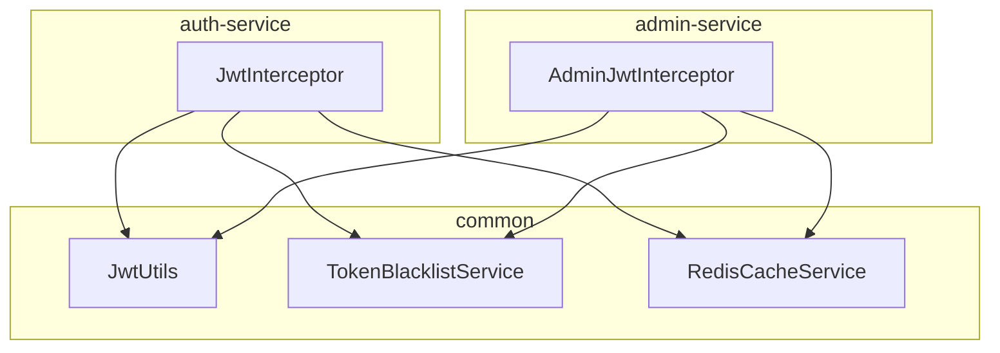
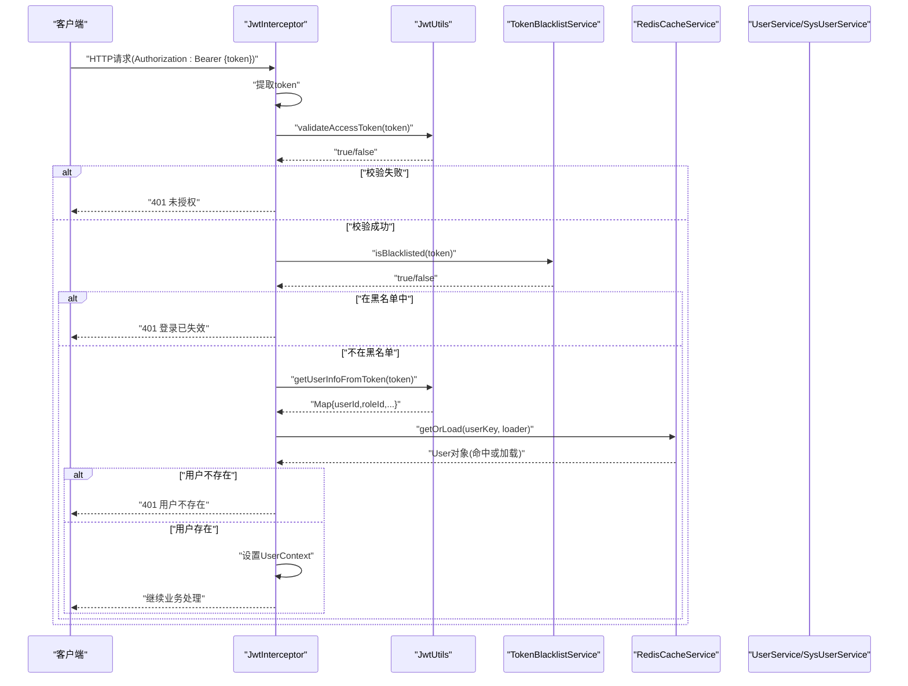
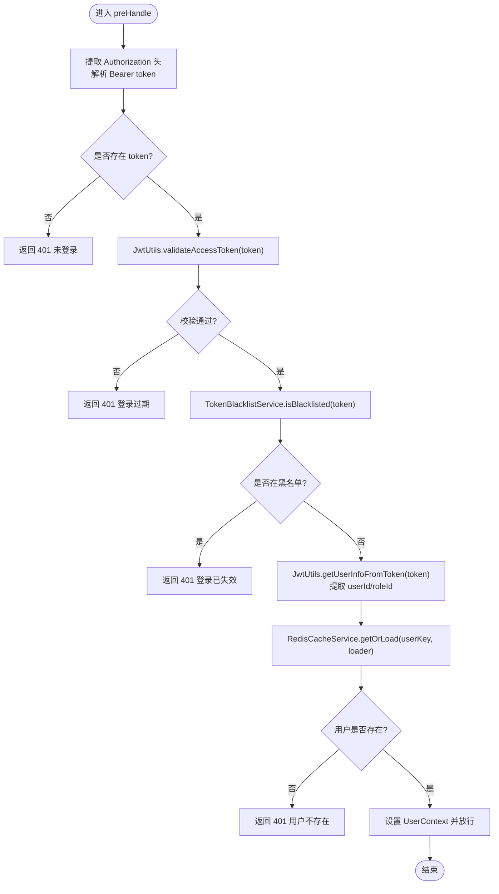
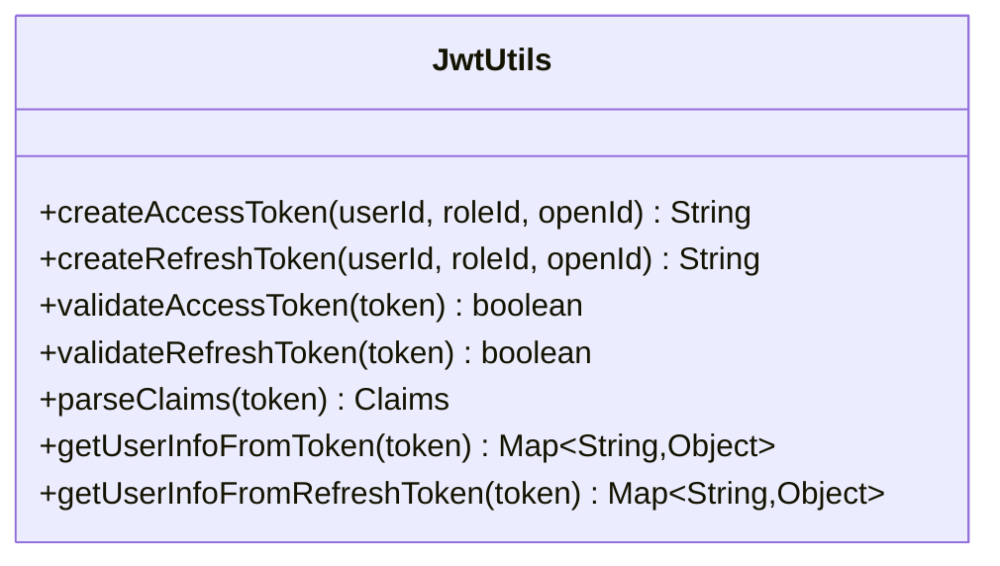
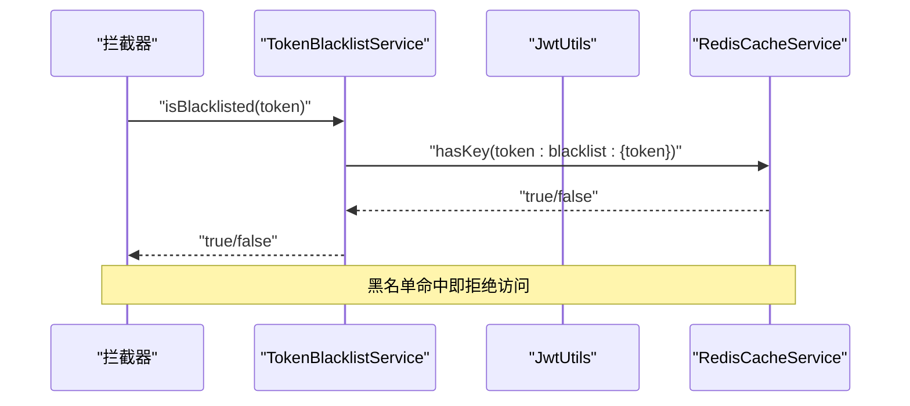
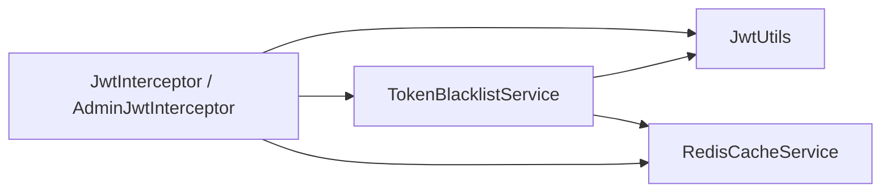
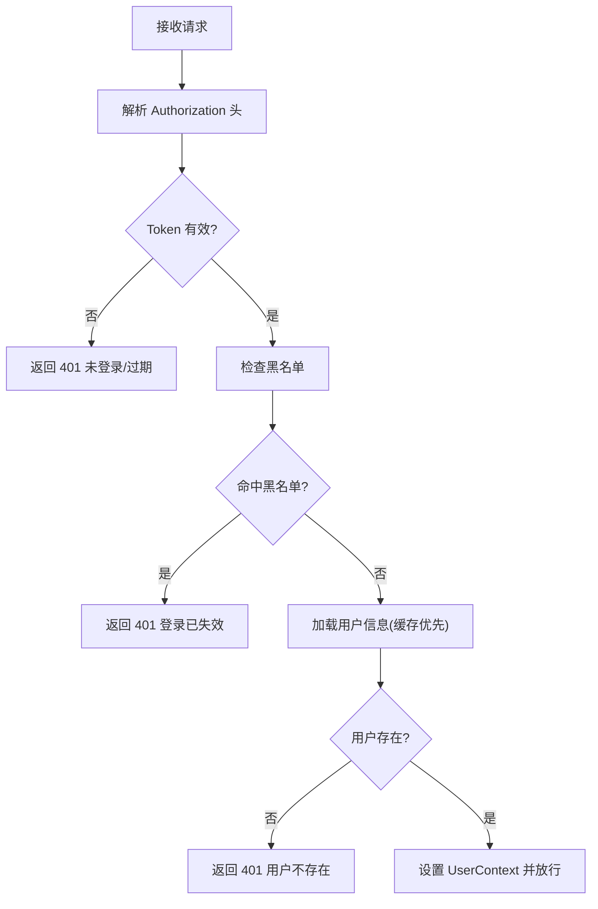

# JWT令牌验证流程

<cite>
**本文引用的文件**
- [JwtInterceptor.java](file://class_times_record_back/auth-service/src/main/java/com/shiroko/interceptor/JwtInterceptor.java)
- [AdminJwtInterceptor.java](file://class_times_record_back/admin-service/src/main/java/com/shiroko/interceptor/AdminJwtInterceptor.java)
- [JwtUtils.java](file://class_times_record_back/common/src/main/java/com/shiroko/util/JwtUtils.java)
- [TokenBlacklistService.java](file://class_times_record_back/common/src/main/java/com/shiroko/service/cache/TokenBlacklistService.java)
- [RedisCacheService.java](file://class_times_record_back/common/src/main/java/com/shiroko/service/cache/RedisCacheService.java)
</cite>

## 目录
1. [简介](#简介)
2. [项目结构](#项目结构)
3. [核心组件](#核心组件)
4. [架构总览](#架构总览)
5. [详细组件分析](#详细组件分析)
6. [依赖关系分析](#依赖关系分析)
7. [性能考量](#性能考量)
8. [故障排查指南](#故障排查指南)
9. [结论](#结论)
10. [附录](#附录)

## 简介
本文件围绕JWT令牌验证流程，深入解析拦截器与工具类的协作机制。重点包括：
- JwtInterceptor拦截器的请求拦截时机、Token提取逻辑与整体验证流程
- validateAccessToken与validateRefreshToken方法的签名验证、过期检查、类型校验与异常处理
- parseClaims方法对载荷的解析以及用户信息提取过程
- getUserInfoFromToken与getUserInfoFromRefreshToken的用户信息映射机制
- 完整的验证流程图、错误码定义与性能优化建议

## 项目结构
后端采用多模块微服务架构，认证相关代码主要分布在以下位置：
- auth-service：小程序端鉴权拦截器（JwtInterceptor）
- admin-service：管理后台鉴权拦截器（AdminJwtInterceptor）
- common：通用能力，包含JWT工具类（JwtUtils）、黑名单服务（TokenBlacklistService）、缓存服务（RedisCacheService）

图表来源
- [JwtInterceptor.java:1-153](file://class_times_record_back/auth-service/src/main/java/com/shiroko/interceptor/JwtInterceptor.java#L1-L153)
- [AdminJwtInterceptor.java:1-143](file://class_times_record_back/admin-service/src/main/java/com/shiroko/interceptor/AdminJwtInterceptor.java#L1-L143)
- [JwtUtils.java:1-213](file://class_times_record_back/common/src/main/java/com/shiroko/util/JwtUtils.java#L1-L213)
- [TokenBlacklistService.java:1-76](file://class_times_record_back/common/src/main/java/com/shiroko/service/cache/TokenBlacklistService.java#L1-L76)
- [RedisCacheService.java:1-158](file://class_times_record_back/common/src/main/java/com/shiroko/service/cache/RedisCacheService.java#L1-L158)

章节来源
- [JwtInterceptor.java:1-153](file://class_times_record_back/auth-service/src/main/java/com/shiroko/interceptor/JwtInterceptor.java#L1-L153)
- [AdminJwtInterceptor.java:1-143](file://class_times_record_back/admin-service/src/main/java/com/shiroko/interceptor/AdminJwtInterceptor.java#L1-L143)
- [JwtUtils.java:1-213](file://class_times_record_back/common/src/main/java/com/shiroko/util/JwtUtils.java#L1-L213)
- [TokenBlacklistService.java:1-76](file://class_times_record_back/common/src/main/java/com/shiroko/service/cache/TokenBlacklistService.java#L1-L76)
- [RedisCacheService.java:1-158](file://class_times_record_back/common/src/main/java/com/shiroko/service/cache/RedisCacheService.java#L1-L158)

## 核心组件
- JwtInterceptor：负责从请求头提取Authorization中的Bearer Token，调用JwtUtils进行Access Token校验，结合TokenBlacklistService做黑名单二次校验，再从缓存或数据库加载用户信息并写入UserContext。
- AdminJwtInterceptor：管理后台专用拦截器，职责与JwtInterceptor类似，但使用SysUserService查询管理员用户。
- JwtUtils：提供双Token（access/refresh）的生成、校验、载荷解析与用户信息提取；支持通过ConfigProvider动态读取过期时间配置。
- TokenBlacklistService：基于Redis实现Token黑名单，支持将已登出Token加入黑名单并在拦截器中快速判断是否失效。
- RedisCacheService：封装Redis操作，提供getOrLoad等常用方法，用于用户信息缓存与黑名单键存在性检查。

章节来源
- [JwtInterceptor.java:1-153](file://class_times_record_back/auth-service/src/main/java/com/shiroko/interceptor/JwtInterceptor.java#L1-L153)
- [AdminJwtInterceptor.java:1-143](file://class_times_record_back/admin-service/src/main/java/com/shiroko/interceptor/AdminJwtInterceptor.java#L1-L143)
- [JwtUtils.java:1-213](file://class_times_record_back/common/src/main/java/com/shiroko/util/JwtUtils.java#L1-L213)
- [TokenBlacklistService.java:1-76](file://class_times_record_back/common/src/main/java/com/shiroko/service/cache/TokenBlacklistService.java#L1-L76)
- [RedisCacheService.java:1-158](file://class_times_record_back/common/src/main/java/com/shiroko/service/cache/RedisCacheService.java#L1-L158)

## 架构总览
下图展示了请求进入后的完整鉴权链路：从请求头提取Token，到JWT校验、黑名单检查、用户信息加载与上下文设置。

图表来源
- [JwtInterceptor.java:75-124](file://class_times_record_back/auth-service/src/main/java/com/shiroko/interceptor/JwtInterceptor.java#L75-L124)
- [JwtUtils.java:151-195](file://class_times_record_back/common/src/main/java/com/shiroko/util/JwtUtils.java#L151-L195)
- [TokenBlacklistService.java:65-74](file://class_times_record_back/common/src/main/java/com/shiroko/service/cache/TokenBlacklistService.java#L65-L74)
- [RedisCacheService.java:109-122](file://class_times_record_back/common/src/main/java/com/shiroko/service/cache/RedisCacheService.java#L109-L122)

## 详细组件分析

### JwtInterceptor工作原理
- 请求拦截时机：在Handler执行前（preHandle），从请求头Authorization中提取Bearer Token。
- Token提取逻辑：若Header存在且以“Bearer ”开头，则截取其后内容作为token；否则视为未登录。
- 验证流程：
  - 调用JwtUtils.validateAccessToken进行签名与类型校验。
  - 调用TokenBlacklistService.isBlacklisted进行黑名单二次校验。
  - 调用JwtUtils.getUserInfoFromToken获取载荷中的userId与roleId。
  - 通过RedisCacheService.getOrLoad按用户ID加载用户信息（优先缓存，未命中查库）。
  - 将用户信息转换为DTO并写入UserContext，供后续业务使用。
- 清理上下文：afterCompletion中移除UserContext，避免线程复用导致的数据污染。

图表来源
- [JwtInterceptor.java:75-124](file://class_times_record_back/auth-service/src/main/java/com/shiroko/interceptor/JwtInterceptor.java#L75-L124)
- [JwtUtils.java:185-195](file://class_times_record_back/common/src/main/java/com/shiroko/util/JwtUtils.java#L185-L195)
- [TokenBlacklistService.java:65-74](file://class_times_record_back/common/src/main/java/com/shiroko/service/cache/TokenBlacklistService.java#L65-L74)
- [RedisCacheService.java:109-122](file://class_times_record_back/common/src/main/java/com/shiroko/service/cache/RedisCacheService.java#L109-L122)

章节来源
- [JwtInterceptor.java:75-133](file://class_times_record_back/auth-service/src/main/java/com/shiroko/interceptor/JwtInterceptor.java#L75-L133)

### AdminJwtInterceptor对比说明
- 与JwtInterceptor流程一致，差异在于：
  - 使用SysUserService查询管理员用户实体。
  - 构建UserDTO并写入UserContext。
  - 缓存键前缀不同，便于区分小程序与管理后台的用户缓存。

章节来源
- [AdminJwtInterceptor.java:58-113](file://class_times_record_back/admin-service/src/main/java/com/shiroko/interceptor/AdminJwtInterceptor.java#L58-L113)

### JwtUtils核心方法详解
- validateAccessToken(token)
  - 功能：解析并验证Access Token的签名与类型。
  - 关键点：使用HS256密钥解析JWS，校验成功后断言tokenType为“access”。
  - 异常处理：捕获所有异常并返回false，避免上层抛出异常。
- validateRefreshToken(token)
  - 功能：解析并验证Refresh Token的签名与类型。
  - 关键点：断言tokenType为“refresh”。
  - 异常处理：同Access Token，统一返回false。
- parseClaims(token)
  - 功能：直接解析并返回Claims对象，不做强类型校验。
  - 用途：常用于黑名单计算剩余有效期等场景。
- getUserInfoFromToken(token)
  - 功能：解析并返回载荷Map，供拦截器提取userId、roleId等信息。
  - 异常处理：异常时返回null，由调用方处理。
- getUserInfoFromRefreshToken(token)
  - 功能：仅当tokenType为“refresh”时返回Claims，否则返回null。
  - 用途：刷新令牌场景下安全地提取用户信息。

图表来源
- [JwtUtils.java:112-149](file://class_times_record_back/common/src/main/java/com/shiroko/util/JwtUtils.java#L112-L149)
- [JwtUtils.java:151-211](file://class_times_record_back/common/src/main/java/com/shiroko/util/JwtUtils.java#L151-L211)

章节来源
- [JwtUtils.java:151-211](file://class_times_record_back/common/src/main/java/com/shiroko/util/JwtUtils.java#L151-L211)

### TokenBlacklistService与RedisCacheService协作
- TokenBlacklistService.addToBlacklist(token)
  - 通过JwtUtils.parseClaims获取过期时间，计算剩余有效期后写入Redis，TTL自动清理。
- TokenBlacklistService.isBlacklisted(token)
  - 通过RedisCacheService.hasKey检查黑名单键是否存在。
- RedisCacheService.getOrLoad(key, clazz, loader, timeout, unit)
  - 先读缓存，未命中则调用loader加载数据并回写缓存，减少数据库压力。

图表来源
- [TokenBlacklistService.java:48-74](file://class_times_record_back/common/src/main/java/com/shiroko/service/cache/TokenBlacklistService.java#L48-L74)
- [RedisCacheService.java:154-156](file://class_times_record_back/common/src/main/java/com/shiroko/service/cache/RedisCacheService.java#L154-L156)

章节来源
- [TokenBlacklistService.java:48-74](file://class_times_record_back/common/src/main/java/com/shiroko/service/cache/TokenBlacklistService.java#L48-L74)
- [RedisCacheService.java:109-122](file://class_times_record_back/common/src/main/java/com/shiroko/service/cache/RedisCacheService.java#L109-L122)

## 依赖关系分析
- 耦合与内聚
  - JwtInterceptor与JwtUtils、TokenBlacklistService、RedisCacheService形成低耦合高内聚的鉴权链。
  - JwtUtils作为纯工具类，被多个服务复用，具备良好的可测试性与可替换性。
- 外部依赖
  - JJWT库用于JWT的创建与解析。
  - Redis用于黑名单与用户信息缓存。
- 潜在循环依赖
  - 当前设计无循环依赖，各层职责清晰。

图表来源
- [JwtInterceptor.java:1-153](file://class_times_record_back/auth-service/src/main/java/com/shiroko/interceptor/JwtInterceptor.java#L1-L153)
- [AdminJwtInterceptor.java:1-143](file://class_times_record_back/admin-service/src/main/java/com/shiroko/interceptor/AdminJwtInterceptor.java#L1-L143)
- [JwtUtils.java:1-213](file://class_times_record_back/common/src/main/java/com/shiroko/util/JwtUtils.java#L1-L213)
- [TokenBlacklistService.java:1-76](file://class_times_record_back/common/src/main/java/com/shiroko/service/cache/TokenBlacklistService.java#L1-L76)
- [RedisCacheService.java:1-158](file://class_times_record_back/common/src/main/java/com/shiroko/service/cache/RedisCacheService.java#L1-L158)

章节来源
- [JwtInterceptor.java:1-153](file://class_times_record_back/auth-service/src/main/java/com/shiroko/interceptor/JwtInterceptor.java#L1-L153)
- [AdminJwtInterceptor.java:1-143](file://class_times_record_back/admin-service/src/main/java/com/shiroko/interceptor/AdminJwtInterceptor.java#L1-L143)
- [JwtUtils.java:1-213](file://class_times_record_back/common/src/main/java/com/shiroko/util/JwtUtils.java#L1-L213)
- [TokenBlacklistService.java:1-76](file://class_times_record_back/common/src/main/java/com/shiroko/service/cache/TokenBlacklistService.java#L1-L76)
- [RedisCacheService.java:1-158](file://class_times_record_back/common/src/main/java/com/shiroko/service/cache/RedisCacheService.java#L1-L158)

## 性能考量
- 缓存策略
  - 用户信息采用Cache-Aside模式，优先从Redis读取，未命中再查库并回填缓存，显著降低数据库压力。
- 黑名单TTL
  - 黑名单键TTL设置为Token剩余有效期，过期自动清理，避免长期占用内存。
- 异常短路
  - JwtUtils在校验失败时快速返回false，避免异常传播带来的额外开销。
- 建议优化
  - 对高频热点用户可考虑本地缓存（如Caffeine）+分布式缓存双层策略。
  - 对黑名单键可引入布隆过滤器以减少误判时的Redis访问。
  - 合理调整用户信息缓存过期时间，平衡一致性与性能。

[本节为通用指导，无需源码引用]

## 故障排查指南
- 常见错误与定位
  - 未携带Authorization或格式不正确：检查请求头是否为“Authorization: Bearer <token>”。
  - 签名错误或Token篡改：确认服务端密钥与签发侧一致，避免中间人修改。
  - Token过期：关注Access Token默认较短过期时间，必要时使用Refresh Token续期。
  - 黑名单命中：确认登出接口是否正确将Token加入黑名单。
  - 用户不存在：检查用户ID与数据库一致性，确保用户未被删除或禁用。
- 响应与错误码
  - HTTP状态码：401未授权
  - 业务错误码：401
  - 消息示例：未登录、登录过期、登录已失效、用户不存在
- 日志与监控
  - 拦截器与黑名单服务均记录关键路径日志，便于问题追踪。
  - 建议增加指标统计：校验成功率、黑名单命中率、缓存命中率。

章节来源
- [JwtInterceptor.java:141-151](file://class_times_record_back/auth-service/src/main/java/com/shiroko/interceptor/JwtInterceptor.java#L141-L151)
- [AdminJwtInterceptor.java:130-141](file://class_times_record_back/admin-service/src/main/java/com/shiroko/interceptor/AdminJwtInterceptor.java#L130-L141)
- [TokenBlacklistService.java:48-63](file://class_times_record_back/common/src/main/java/com/shiroko/service/cache/TokenBlacklistService.java#L48-L63)

## 结论
该JWT验证流程通过拦截器前置校验、工具类统一解析与黑名单机制，实现了安全、高效、可扩展的鉴权方案。配合Redis缓存与动态配置，系统在安全性与性能之间取得良好平衡。建议在大规模场景下进一步引入双层缓存与更细粒度的监控指标，以提升稳定性与可观测性。

[本节为总结性内容，无需源码引用]

## 附录

### 验证流程图（端到端）

图表来源
- [JwtInterceptor.java:75-124](file://class_times_record_back/auth-service/src/main/java/com/shiroko/interceptor/JwtInterceptor.java#L75-L124)
- [AdminJwtInterceptor.java:58-113](file://class_times_record_back/admin-service/src/main/java/com/shiroko/interceptor/AdminJwtInterceptor.java#L58-L113)

### 错误码定义
- HTTP状态码：401
- 业务错误码：401
- 典型消息：
  - 未登录
  - 登录过期，请重新登录
  - 登录已失效，请重新登录
  - 用户不存在

章节来源
- [JwtInterceptor.java:141-151](file://class_times_record_back/auth-service/src/main/java/com/shiroko/interceptor/JwtInterceptor.java#L141-L151)
- [AdminJwtInterceptor.java:130-141](file://class_times_record_back/admin-service/src/main/java/com/shiroko/interceptor/AdminJwtInterceptor.java#L130-L141)