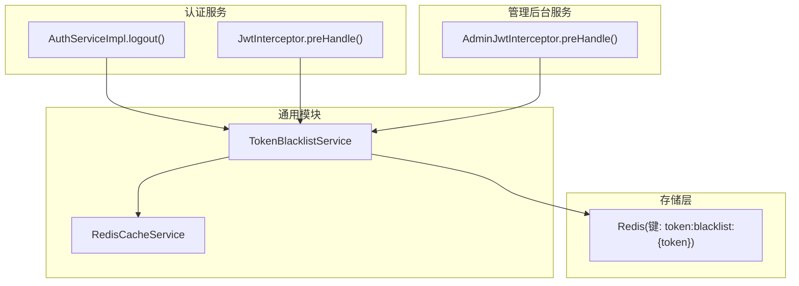
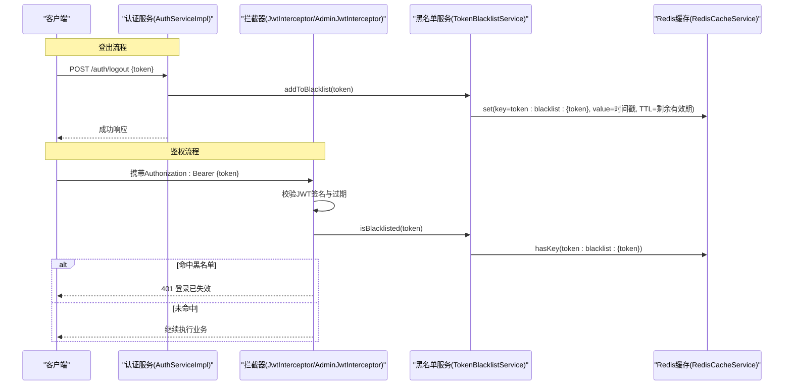
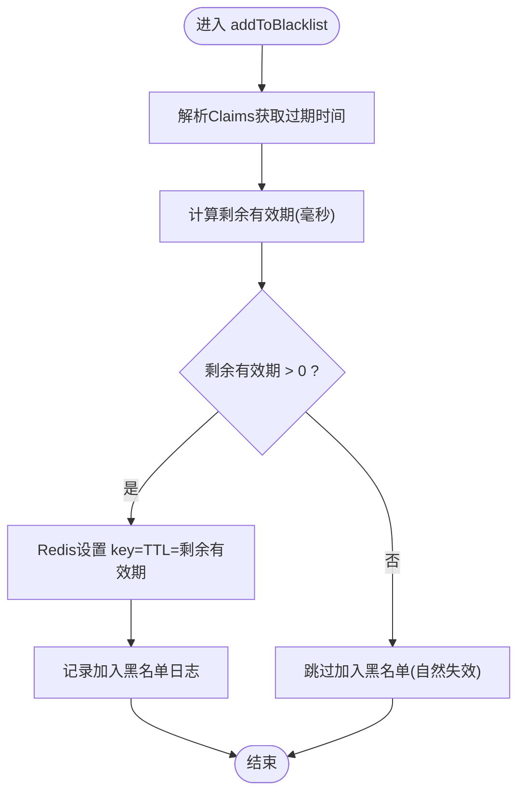
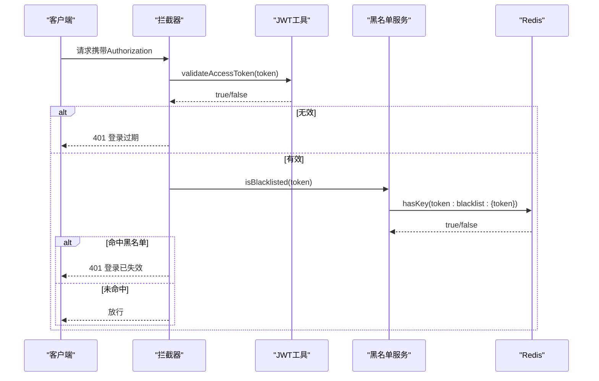
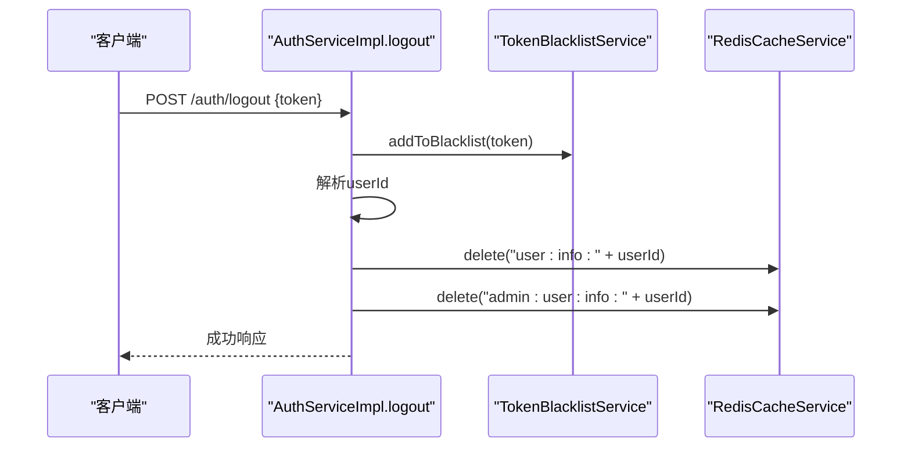
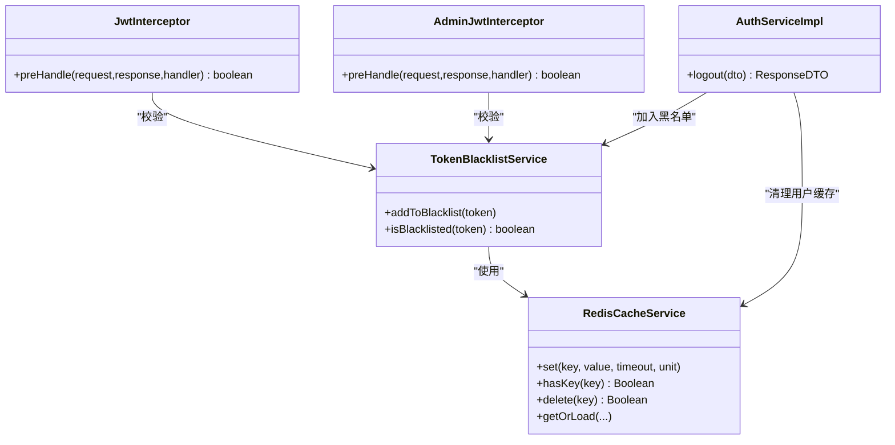

# JWT令牌黑名单管理

<cite>
**本文引用的文件**   
- [TokenBlacklistService.java](file://class_times_record_back/common/src/main/java/com/shiroko/service/cache/TokenBlacklistService.java)
- [RedisCacheService.java](file://class_times_record_back/common/src/main/java/com/shiroko/service/cache/RedisCacheService.java)
- [JwtInterceptor.java](file://class_times_record_back/auth-service/src/main/java/com/shiroko/interceptor/JwtInterceptor.java)
- [AdminJwtInterceptor.java](file://class_times_record_back/admin-service/src/main/java/com/shiroko/interceptor/AdminJwtInterceptor.java)
- [AuthServiceImpl.java](file://class_times_record_back/auth-service/src/main/java/com/shiroko/service/impl/AuthServiceImpl.java)
</cite>

## 目录
1. [引言](#引言)
2. [项目结构](#项目结构)
3. [核心组件](#核心组件)
4. [架构总览](#架构总览)
5. [详细组件分析](#详细组件分析)
6. [依赖关系分析](#依赖关系分析)
7. [性能与扩展性](#性能与扩展性)
8. [故障排查指南](#故障排查指南)
9. [结论](#结论)
10. [附录：API示例与监控指标](#附录api示例与监控指标)

## 引言
本文件围绕JWT令牌黑名单管理机制进行系统化说明，覆盖设计目的、使用场景、实现机制、拦截器校验流程、分布式同步策略、缓存设计与性能优化，并给出API调用示例与监控指标建议。该方案通过“签发即有效”的无状态JWT配合“登出即失效”的有状态黑名单，实现强制登出、安全退出和异常会话终止等关键能力。

## 项目结构
本项目采用微服务分层组织，黑名单相关代码位于通用模块与认证/管理后台服务中：
- 通用模块提供黑名单服务与Redis缓存封装
- 认证服务在登出时将Access Token加入黑名单，并在请求拦截器中检查黑名单
- 管理后台服务同样集成黑名单校验，保证多端一致的安全策略

图表来源
- [TokenBlacklistService.java:1-76](file://class_times_record_back/common/src/main/java/com/shiroko/service/cache/TokenBlacklistService.java#L1-L76)
- [RedisCacheService.java:1-158](file://class_times_record_back/common/src/main/java/com/shiroko/service/cache/RedisCacheService.java#L1-L158)
- [AuthServiceImpl.java:296-312](file://class_times_record_back/auth-service/src/main/java/com/shiroko/service/impl/AuthServiceImpl.java#L296-L312)
- [JwtInterceptor.java:75-124](file://class_times_record_back/auth-service/src/main/java/com/shiroko/interceptor/JwtInterceptor.java#L75-L124)
- [AdminJwtInterceptor.java:58-113](file://class_times_record_back/admin-service/src/main/java/com/shiroko/interceptor/AdminJwtInterceptor.java#L58-L113)

章节来源
- [TokenBlacklistService.java:1-76](file://class_times_record_back/common/src/main/java/com/shiroko/service/cache/TokenBlacklistService.java#L1-L76)
- [RedisCacheService.java:1-158](file://class_times_record_back/common/src/main/java/com/shiroko/service/cache/RedisCacheService.java#L1-L158)
- [AuthServiceImpl.java:296-312](file://class_times_record_back/auth-service/src/main/java/com/shiroko/service/impl/AuthServiceImpl.java#L296-L312)
- [JwtInterceptor.java:75-124](file://class_times_record_back/auth-service/src/main/java/com/shiroko/interceptor/JwtInterceptor.java#L75-L124)
- [AdminJwtInterceptor.java:58-113](file://class_times_record_back/admin-service/src/main/java/com/shiroko/interceptor/AdminJwtInterceptor.java#L58-L113)

## 核心组件
- TokenBlacklistService：基于Redis的令牌黑名单服务，负责将已失效或主动退出的Token加入黑名单，并提供黑名单存在性查询。
- RedisCacheService：对RedisTemplate的统一封装，提供get/set/hasKey/getOrLoad等常用操作，供黑名单服务复用。
- JwtInterceptor（小程序端）：在请求进入业务前校验JWT签名与黑名单状态，若命中黑名单则拒绝访问。
- AdminJwtInterceptor（管理后台）：与小程序端一致的黑名单校验逻辑，确保管理端安全策略统一。
- AuthServiceImpl.logout：登出时调用黑名单服务将当前Access Token加入黑名单，并清理用户信息缓存。

章节来源
- [TokenBlacklistService.java:1-76](file://class_times_record_back/common/src/main/java/com/shiroko/service/cache/TokenBlacklistService.java#L1-L76)
- [RedisCacheService.java:1-158](file://class_times_record_back/common/src/main/java/com/shiroko/service/cache/RedisCacheService.java#L1-L158)
- [JwtInterceptor.java:75-124](file://class_times_record_back/auth-service/src/main/java/com/shiroko/interceptor/JwtInterceptor.java#L75-L124)
- [AdminJwtInterceptor.java:58-113](file://class_times_record_back/admin-service/src/main/java/com/shiroko/interceptor/AdminJwtInterceptor.java#L58-L113)
- [AuthServiceImpl.java:296-312](file://class_times_record_back/auth-service/src/main/java/com/shiroko/service/impl/AuthServiceImpl.java#L296-L312)

## 架构总览
下图展示了从客户端发起请求到黑名单校验的完整链路，以及登出时将Token加入黑名单的流程。

图表来源
- [AuthServiceImpl.java:296-312](file://class_times_record_back/auth-service/src/main/java/com/shiroko/service/impl/AuthServiceImpl.java#L296-L312)
- [TokenBlacklistService.java:48-74](file://class_times_record_back/common/src/main/java/com/shiroko/service/cache/TokenBlacklistService.java#L48-L74)
- [RedisCacheService.java:93-95](file://class_times_record_back/common/src/main/java/com/shiroko/service/cache/RedisCacheService.java#L93-L95)
- [RedisCacheService.java:154-156](file://class_times_record_back/common/src/main/java/com/shiroko/service/cache/RedisCacheService.java#L154-L156)
- [JwtInterceptor.java:75-124](file://class_times_record_back/auth-service/src/main/java/com/shiroko/interceptor/JwtInterceptor.java#L75-L124)
- [AdminJwtInterceptor.java:58-113](file://class_times_record_back/admin-service/src/main/java/com/shiroko/interceptor/AdminJwtInterceptor.java#L58-L113)

## 详细组件分析

### 令牌黑名单服务（TokenBlacklistService）
- 设计目标
  - 解决JWT不可撤销的问题：通过Redis记录已登出或需强制失效的Token，在拦截器阶段二次校验。
  - 自动过期清理：TTL设置为Token剩余有效期，避免长期占用内存。
- 关键行为
  - 加入黑名单：解析Token获取过期时间，计算剩余毫秒数后写入Redis；若已过期则跳过。
  - 黑名单查询：判断对应key是否存在。
- 数据结构与复杂度
  - Key设计：token:blacklist:{token}
  - Value：登出时间戳（毫秒）
  - TTL：Token剩余有效期（毫秒）
  - 时间复杂度：O(1)（Redis SET/HASKEY）
  - 空间复杂度：O(N)，N为活跃黑名单条目数
- 错误处理
  - 解析失败或Token已过期时记录警告日志，不抛异常，保证登出接口稳定性。

图表来源
- [TokenBlacklistService.java:48-63](file://class_times_record_back/common/src/main/java/com/shiroko/service/cache/TokenBlacklistService.java#L48-L63)

章节来源
- [TokenBlacklistService.java:1-76](file://class_times_record_back/common/src/main/java/com/shiroko/service/cache/TokenBlacklistService.java#L1-L76)

### 拦截器黑名单校验（JwtInterceptor / AdminJwtInterceptor）
- 职责
  - 提取Authorization头中的Bearer Token
  - 校验JWT签名与过期
  - 二次校验黑名单：命中则返回401并提示重新登录
  - 加载用户信息至上下文（结合Redis缓存）
- 关键点
  - 黑名单校验发生在JWT签名校验之后，减少不必要的Redis访问
  - 用户信息缓存降低数据库压力，提升整体吞吐

图表来源
- [JwtInterceptor.java:75-124](file://class_times_record_back/auth-service/src/main/java/com/shiroko/interceptor/JwtInterceptor.java#L75-L124)
- [AdminJwtInterceptor.java:58-113](file://class_times_record_back/admin-service/src/main/java/com/shiroko/interceptor/AdminJwtInterceptor.java#L58-L113)
- [TokenBlacklistService.java:72-74](file://class_times_record_back/common/src/main/java/com/shiroko/service/cache/TokenBlacklistService.java#L72-L74)
- [RedisCacheService.java:154-156](file://class_times_record_back/common/src/main/java/com/shiroko/service/cache/RedisCacheService.java#L154-L156)

章节来源
- [JwtInterceptor.java:75-124](file://class_times_record_back/auth-service/src/main/java/com/shiroko/interceptor/JwtInterceptor.java#L75-L124)
- [AdminJwtInterceptor.java:58-113](file://class_times_record_back/admin-service/src/main/java/com/shiroko/interceptor/AdminJwtInterceptor.java#L58-L113)

### 登出流程与缓存清理（AuthServiceImpl.logout）
- 功能要点
  - 将当前Access Token加入黑名单，确保立即失效
  - 解析userId并删除用户信息缓存（小程序与管理后台两套缓存前缀），防止后续请求仍命中旧数据
- 事务与一致性
  - 黑名单写入与缓存清理属于轻量级操作，通常无需强事务；但登出接口本身处于事务边界内，便于与其他业务保持一致性

图表来源
- [AuthServiceImpl.java:296-312](file://class_times_record_back/auth-service/src/main/java/com/shiroko/service/impl/AuthServiceImpl.java#L296-L312)
- [TokenBlacklistService.java:48-63](file://class_times_record_back/common/src/main/java/com/shiroko/service/cache/TokenBlacklistService.java#L48-L63)
- [RedisCacheService.java:130-132](file://class_times_record_back/common/src/main/java/com/shiroko/service/cache/RedisCacheService.java#L130-L132)

章节来源
- [AuthServiceImpl.java:296-312](file://class_times_record_back/auth-service/src/main/java/com/shiroko/service/impl/AuthServiceImpl.java#L296-L312)

## 依赖关系分析
- 组件耦合
  - TokenBlacklistService依赖RedisCacheService与JwtUtils（用于解析过期时间）
  - 两个拦截器均依赖TokenBlacklistService与RedisCacheService
  - AuthServiceImpl在登出时调用TokenBlacklistService与RedisCacheService
- 外部依赖
  - Redis作为集中式共享存储，天然支持多实例间同步
- 潜在循环依赖
  - 当前实现无循环依赖，服务间单向调用清晰

图表来源
- [TokenBlacklistService.java:1-76](file://class_times_record_back/common/src/main/java/com/shiroko/service/cache/TokenBlacklistService.java#L1-L76)
- [RedisCacheService.java:1-158](file://class_times_record_back/common/src/main/java/com/shiroko/service/cache/RedisCacheService.java#L1-L158)
- [JwtInterceptor.java:75-124](file://class_times_record_back/auth-service/src/main/java/com/shiroko/interceptor/JwtInterceptor.java#L75-L124)
- [AdminJwtInterceptor.java:58-113](file://class_times_record_back/admin-service/src/main/java/com/shiroko/interceptor/AdminJwtInterceptor.java#L58-L113)
- [AuthServiceImpl.java:296-312](file://class_times_record_back/auth-service/src/main/java/com/shiroko/service/impl/AuthServiceImpl.java#L296-L312)

章节来源
- [TokenBlacklistService.java:1-76](file://class_times_record_back/common/src/main/java/com/shiroko/service/cache/TokenBlacklistService.java#L1-L76)
- [RedisCacheService.java:1-158](file://class_times_record_back/common/src/main/java/com/shiroko/service/cache/RedisCacheService.java#L1-L158)
- [JwtInterceptor.java:75-124](file://class_times_record_back/auth-service/src/main/java/com/shiroko/interceptor/JwtInterceptor.java#L75-L124)
- [AdminJwtInterceptor.java:58-113](file://class_times_record_back/admin-service/src/main/java/com/shiroko/interceptor/AdminJwtInterceptor.java#L58-L113)
- [AuthServiceImpl.java:296-312](file://class_times_record_back/auth-service/src/main/java/com/shiroko/service/impl/AuthServiceImpl.java#L296-L312)

## 性能与扩展性
- 存储策略
  - 使用Redis单键存储黑名单项，键为token:blacklist:{token}，值为登出时间戳，TTL为Token剩余有效期，实现自动清理，避免人工维护。
- 查询性能
  - 黑名单查询为O(1)的hasKey操作，延迟低，适合高频鉴权路径。
- 过期清理
  - 利用TTL自动过期，无需额外定时任务；当Token自然过期时，黑名单项随之移除。
- 分布式同步
  - 由于Redis为集中式共享存储，多实例部署天然具备一致性，无需额外同步机制。
- 缓存设计
  - 用户信息缓存采用Cache-Aside模式（getOrLoad），显著降低数据库压力；登出时主动清理用户缓存，保证一致性。
- 可扩展点
  - 可引入批量加入黑名单接口（如批量踢人）
  - 可增加按用户维度统计黑名单数量的聚合键，便于监控与告警

[本节为通用性能讨论，不直接分析具体文件]

## 故障排查指南
- 常见问题
  - 登出后仍可访问：确认拦截器是否执行了黑名单校验；检查Redis连接与键是否正确写入。
  - 频繁401：检查JWT签名是否被篡改或过期；确认黑名单是否误加入。
  - 用户信息未更新：确认登出时是否清理了对应用户的缓存键。
- 定位步骤
  - 查看拦截器日志输出（黑名单命中、401响应）
  - 检查Redis中是否存在对应黑名单键
  - 核对用户缓存键是否被删除
- 参考位置
  - 拦截器日志与响应写入逻辑
  - 黑名单服务日志与异常捕获
  - 登出流程中的缓存清理逻辑

章节来源
- [JwtInterceptor.java:141-151](file://class_times_record_back/auth-service/src/main/java/com/shiroko/interceptor/JwtInterceptor.java#L141-L151)
- [AdminJwtInterceptor.java:130-141](file://class_times_record_back/admin-service/src/main/java/com/shiroko/interceptor/AdminJwtInterceptor.java#L130-L141)
- [TokenBlacklistService.java:60-62](file://class_times_record_back/common/src/main/java/com/shiroko/service/cache/TokenBlacklistService.java#L60-L62)
- [AuthServiceImpl.java:302-312](file://class_times_record_back/auth-service/src/main/java/com/shiroko/service/impl/AuthServiceImpl.java#L302-L312)

## 结论
本方案以“JWT无状态+Redis有状态黑名单”的组合，实现了即时失效与安全退出能力。通过拦截器二次校验与用户缓存清理，兼顾安全性与性能。Redis作为共享存储，天然支持分布式一致性，且借助TTL实现自动清理，运维成本低。建议在关键路径增加监控指标，以便持续观测与优化。

[本节为总结性内容，不直接分析具体文件]

## 附录：API示例与监控指标

### API示例
- 退出登录（将当前Access Token加入黑名单）
  - 方法：POST
  - 路径：/auth/auth/logout
  - 请求体：{ "token": "<当前Access Token>" }
  - 预期结果：成功响应，随后所有使用该Token的请求将被拦截器拒绝
  - 参考实现位置：[AuthServiceImpl.logout:296-312](file://class_times_record_back/auth-service/src/main/java/com/shiroko/service/impl/AuthServiceImpl.java#L296-L312)

- 前端调用示例（小程序端）
  - 参考路径：[src/api/auth/index.ts:168-168](file://class_times_record/class_times_record/src/api/auth/index.ts#L168-L168)
  - 说明：前端在登出成功后会调用后端logout接口，并清除本地Token

章节来源
- [AuthServiceImpl.java:296-312](file://class_times_record_back/auth-service/src/main/java/com/shiroko/service/impl/AuthServiceImpl.java#L296-L312)
- [index.ts:168](file://class_times_record/class_times_record/src/api/auth/index.ts#L168-L168)

### 监控指标定义
- 黑名单命中率
  - 定义：单位时间内拦截器命中黑名单的请求占比
  - 用途：评估强制登出/安全退出的有效性
- 黑名单写入成功率
  - 定义：单位时间内成功写入黑名单的请求占比
  - 用途：监控Redis可用性与异常
- 黑名单键数量
  - 定义：当前Redis中黑名单键总数
  - 用途：评估内存占用与清理效果
- 用户缓存命中率
  - 定义：单位时间内用户信息缓存命中比例
  - 用途：评估缓存策略与数据库压力
- 401响应分布
  - 定义：按原因分类的401响应计数（未登录、登录过期、登录已失效）
  - 用途：快速定位问题与用户体验优化

[本节为概念性指标定义，不直接分析具体文件]