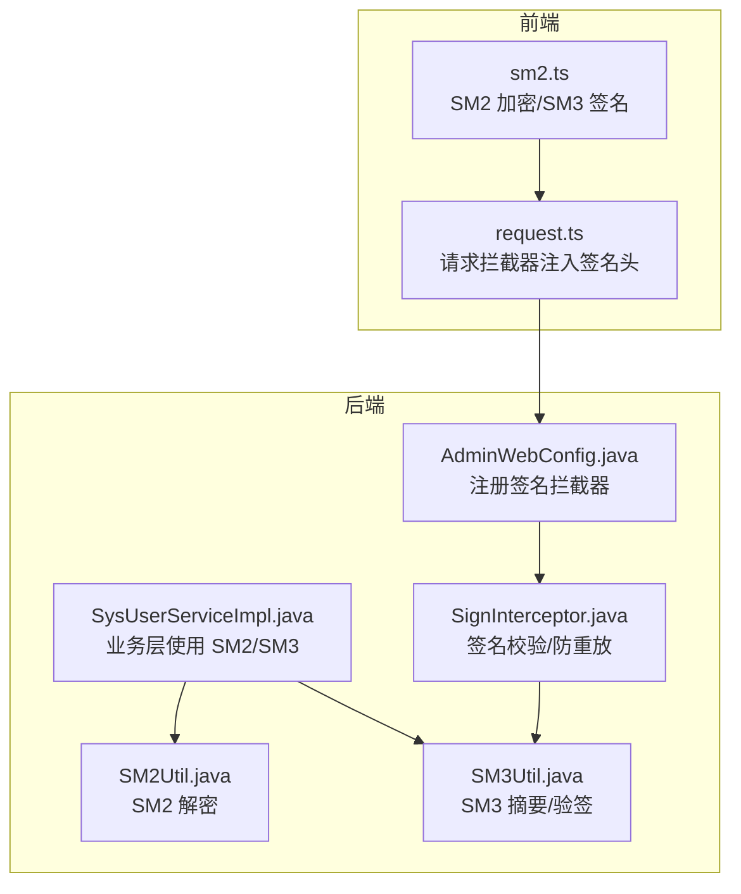
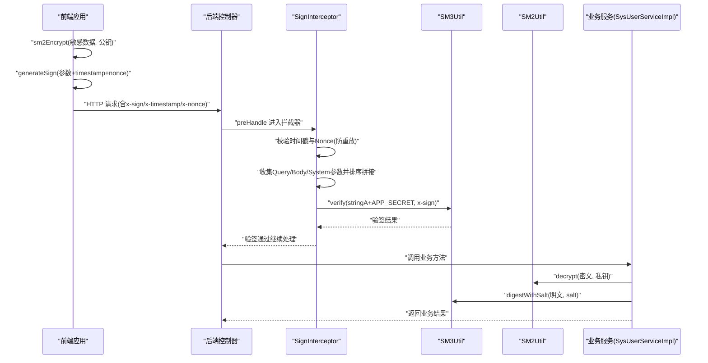
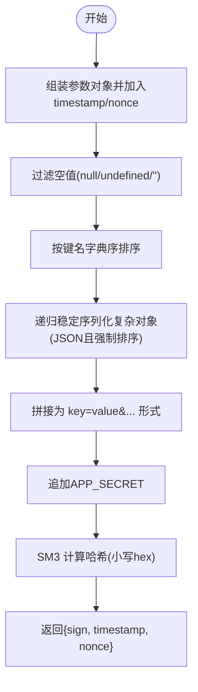
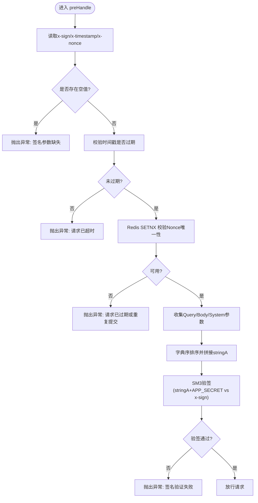
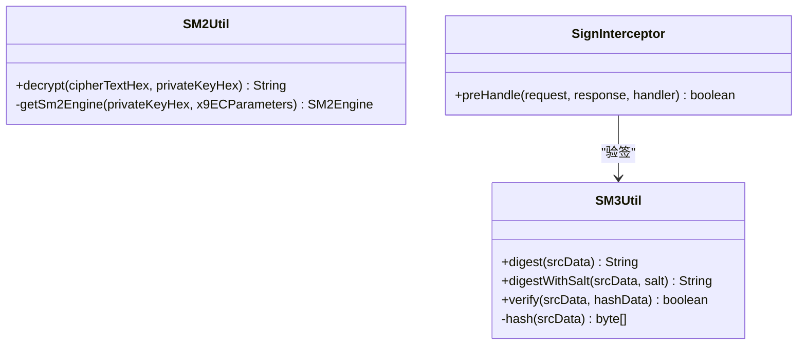
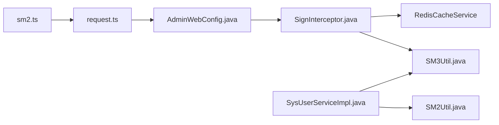

# 国密算法集成

<cite>
**本文引用的文件**
- [class_record_admin_front/src/utils/sm2.ts](file://class_record_admin_front/src/utils/sm2.ts)
- [class_record_admin_front/src/types/sm-crypto.d.ts](file://class_record_admin_front/src/types/sm-crypto.d.ts)
- [class_record_admin_front/src/utils/request.ts](file://class_record_admin_front/src/utils/request.ts)
- [class_times_record_back/common/src/main/java/com/shiroko/util/SM2Util.java](file://class_times_record_back/common/src/main/java/com/shiroko/util/SM2Util.java)
- [class_times_record_back/common/src/main/java/com/shiroko/util/SM3Util.java](file://class_times_record_back/common/src/main/java/com/shiroko/util/SM3Util.java)
- [class_times_record_back/common/src/main/java/com/shiroko/interceptor/SignInterceptor.java](file://class_times_record_back/common/src/main/java/com/shiroko/interceptor/SignInterceptor.java)
- [class_times_record_back/admin-service/src/main/java/com/shiroko/config/AdminWebConfig.java](file://class_times_record_back/admin-service/src/main/java/com/shiroko/config/AdminWebConfig.java)
- [class_times_record_back/admin-service/src/main/java/com/shiroko/service/impl/SysUserServiceImpl.java](file://class_times_record_back/admin-service/src/main/java/com/shiroko/service/impl/SysUserServiceImpl.java)
</cite>

## 目录
1. [简介](#简介)
2. [项目结构](#项目结构)
3. [核心组件](#核心组件)
4. [架构总览](#架构总览)
5. [详细组件分析](#详细组件分析)
6. [依赖关系分析](#依赖关系分析)
7. [性能考虑](#性能考虑)
8. [故障排查指南](#故障排查指南)
9. [结论](#结论)
10. [附录](#附录)

## 简介
本文件面向开发者，系统化说明本项目中“国密算法”的集成与落地方案，重点覆盖：
- SM2 非对称加密在前端用于敏感数据（如密码）的安全传输；后端使用私钥解密。
- SM3 哈希算法用于接口签名生成与校验，保障请求完整性与防篡改。
- 前端 TypeScript 与后端 Java 的对接规范、加解密方法、签名验证流程与数据完整性保证。
- SignInterceptor 签名拦截器的工作原理与安全防护机制（时间戳、Nonce 防重放）。
- 完整的加密与验签流程图、API 调用示例与性能优化建议。
- 自定义加密逻辑扩展指南与安全最佳实践。

## 项目结构
本项目采用前后端分离架构，涉及以下关键模块：
- 前端（Vue + TypeScript）：在请求前对参数进行 SM3 签名，并对敏感字段使用 SM2 公钥加密。
- 网关/管理后台服务：通过 Spring MVC 拦截器统一进行签名校验与防重放保护。
- 公共工具库：封装 SM2/SM3 算法能力，供业务服务复用。

图表来源
- [class_record_admin_front/src/utils/sm2.ts:1-88](file://class_record_admin_front/src/utils/sm2.ts#L1-L88)
- [class_record_admin_front/src/utils/request.ts:42-43](file://class_record_admin_front/src/utils/request.ts#L42-L43)
- [class_times_record_back/admin-service/src/main/java/com/shiroko/config/AdminWebConfig.java:19-42](file://class_times_record_back/admin-service/src/main/java/com/shiroko/config/AdminWebConfig.java#L19-L42)
- [class_times_record_back/common/src/main/java/com/shiroko/interceptor/SignInterceptor.java:50-149](file://class_times_record_back/common/src/main/java/com/shiroko/interceptor/SignInterceptor.java#L50-L149)
- [class_times_record_back/common/src/main/java/com/shiroko/util/SM2Util.java:28-42](file://class_times_record_back/common/src/main/java/com/shiroko/util/SM2Util.java#L28-L42)
- [class_times_record_back/common/src/main/java/com/shiroko/util/SM3Util.java:32-49](file://class_times_record_back/common/src/main/java/com/shiroko/util/SM3Util.java#L32-L49)
- [class_times_record_back/admin-service/src/main/java/com/shiroko/service/impl/SysUserServiceImpl.java:63-66](file://class_times_record_back/admin-service/src/main/java/com/shiroko/service/impl/SysUserServiceImpl.java#L63-L66)

章节来源
- [class_record_admin_front/src/utils/sm2.ts:1-88](file://class_record_admin_front/src/utils/sm2.ts#L1-L88)
- [class_record_admin_front/src/utils/request.ts:42-43](file://class_record_admin_front/src/utils/request.ts#L42-L43)
- [class_times_record_back/common/src/main/java/com/shiroko/interceptor/SignInterceptor.java:50-149](file://class_times_record_back/common/src/main/java/com/shiroko/interceptor/SignInterceptor.java#L50-L149)
- [class_times_record_back/common/src/main/java/com/shiroko/util/SM2Util.java:28-42](file://class_times_record_back/common/src/main/java/com/shiroko/util/SM2Util.java#L28-L42)
- [class_times_record_back/common/src/main/java/com/shiroko/util/SM3Util.java:32-49](file://class_times_record_back/common/src/main/java/com/shiroko/util/SM3Util.java#L32-L49)
- [class_times_record_back/admin-service/src/main/java/com/shiroko/config/AdminWebConfig.java:19-42](file://class_times_record_back/admin-service/src/main/java/com/shiroko/config/AdminWebConfig.java#L19-L42)
- [class_times_record_back/admin-service/src/main/java/com/shiroko/service/impl/SysUserServiceImpl.java:63-66](file://class_times_record_back/admin-service/src/main/java/com/shiroko/service/impl/SysUserServiceImpl.java#L63-L66)

## 核心组件
- 前端 SM2/SM3 工具
  - sm2Encrypt：基于 sm-crypto 的 SM2 公钥加密，输出带 04 前缀的十六进制密文。
  - generateSign：将请求参数按规则排序拼接后，使用 SM3 计算签名，并附带 timestamp、nonce。
- 后端签名拦截器
  - SignInterceptor：从请求头读取 x-sign/x-timestamp/x-nonce，校验时间窗口与 Nonce 唯一性，收集 Query/Body/System 参数，字典序拼接后使用 SM3 验签。
- 后端 SM2/SM3 工具
  - SM2Util.decrypt：使用 BouncyCastle 的 SM2Engine（C1C3C2 模式）解密前端密文。
  - SM3Util.digestWithSalt：提供带盐值的 SM3 摘要，常用于密码存储与校验。
- 业务层集成
  - SysUserServiceImpl：在用户相关操作中，先 SM2 解密明文，再 SM3 带盐值处理密码。

章节来源
- [class_record_admin_front/src/utils/sm2.ts:15-17](file://class_record_admin_front/src/utils/sm2.ts#L15-L17)
- [class_record_admin_front/src/utils/sm2.ts:52-87](file://class_record_admin_front/src/utils/sm2.ts#L52-L87)
- [class_times_record_back/common/src/main/java/com/shiroko/interceptor/SignInterceptor.java:50-149](file://class_times_record_back/common/src/main/java/com/shiroko/interceptor/SignInterceptor.java#L50-L149)
- [class_times_record_back/common/src/main/java/com/shiroko/util/SM2Util.java:28-42](file://class_times_record_back/common/src/main/java/com/shiroko/util/SM2Util.java#L28-L42)
- [class_times_record_back/common/src/main/java/com/shiroko/util/SM3Util.java:45-49](file://class_times_record_back/common/src/main/java/com/shiroko/util/SM3Util.java#L45-L49)
- [class_times_record_back/admin-service/src/main/java/com/shiroko/service/impl/SysUserServiceImpl.java:63-66](file://class_times_record_back/admin-service/src/main/java/com/shiroko/service/impl/SysUserServiceImpl.java#L63-L66)

## 架构总览
下图展示了前端到后端的完整安全链路：前端用 SM2 公钥加密敏感数据，用 SM3 生成签名；后端通过拦截器统一验签与防重放，并在业务层使用 SM2 私钥解密与 SM3 校验密码。

图表来源
- [class_record_admin_front/src/utils/sm2.ts:15-17](file://class_record_admin_front/src/utils/sm2.ts#L15-L17)
- [class_record_admin_front/src/utils/sm2.ts:52-87](file://class_record_admin_front/src/utils/sm2.ts#L52-L87)
- [class_times_record_back/common/src/main/java/com/shiroko/interceptor/SignInterceptor.java:50-149](file://class_times_record_back/common/src/main/java/com/shiroko/interceptor/SignInterceptor.java#L50-L149)
- [class_times_record_back/common/src/main/java/com/shiroko/util/SM3Util.java:68-72](file://class_times_record_back/common/src/main/java/com/shiroko/util/SM3Util.java#L68-L72)
- [class_times_record_back/common/src/main/java/com/shiroko/util/SM2Util.java:28-42](file://class_times_record_back/common/src/main/java/com/shiroko/util/SM2Util.java#L28-L42)
- [class_times_record_back/admin-service/src/main/java/com/shiroko/service/impl/SysUserServiceImpl.java:63-66](file://class_times_record_back/admin-service/src/main/java/com/shiroko/service/impl/SysUserServiceImpl.java#L63-L66)

## 详细组件分析

### 前端 SM2/SM3 工具（sm2.ts）
- SM2 加密
  - 输入：明文字符串、SM2 公钥（04 开头的 130 位 Hex）。
  - 输出：带 04 前缀的十六进制密文，与后端 C1C3C2 模式一致。
- SM3 签名
  - 步骤：组装参数对象 → 添加 timestamp、nonce → 过滤空值 → 键名排序 → 递归稳定序列化复杂对象 → 拼接为 key=value&key=value → 追加 APP_SECRET → SM3 哈希 → 小写 hex。
  - 注意：前端 stableStringify 模拟后端 FastJSON2 的 SortMapEntriesByKeys 行为，确保两端 stringA 一致。

图表来源
- [class_record_admin_front/src/utils/sm2.ts:23-45](file://class_record_admin_front/src/utils/sm2.ts#L23-L45)
- [class_record_admin_front/src/utils/sm2.ts:52-87](file://class_record_admin_front/src/utils/sm2.ts#L52-L87)

章节来源
- [class_record_admin_front/src/utils/sm2.ts:15-17](file://class_record_admin_front/src/utils/sm2.ts#L15-L17)
- [class_record_admin_front/src/utils/sm2.ts:52-87](file://class_record_admin_front/src/utils/sm2.ts#L52-L87)

### 前端请求拦截器（request.ts）
- 在发起请求前，调用 generateSign 生成签名，并将 x-sign、x-timestamp、x-nonce 写入请求头。
- 支持重试场景下的签名重新生成，确保每次请求具备独立的 timestamp 与 nonce。

章节来源
- [class_record_admin_front/src/utils/request.ts:42-43](file://class_record_admin_front/src/utils/request.ts#L42-L43)
- [class_record_admin_front/src/utils/request.ts:105-106](file://class_record_admin_front/src/utils/request.ts#L105-L106)
- [class_record_admin_front/src/utils/request.ts:144-145](file://class_record_admin_front/src/utils/request.ts#L144-L145)

### 后端签名拦截器（SignInterceptor）
- 职责
  - 从请求头读取 x-sign、x-timestamp、x-nonce。
  - 校验时间戳是否过期（默认 60 秒）。
  - 基于 Redis 的 Nonce 防重放：同一 nonce 在超时窗口内仅允许一次。
  - 收集所有参与签名的参数：URL Query、Body JSON、系统级参数（timestamp、nonce）。
  - 字典序排序并拼接 stringA，附加 APP_SECRET 后使用 SM3 验签。
- 关键点
  - 复杂对象必须使用 JSON 序列化且强制字段排序，以保证前后端 stringA 一致。
  - 若 Request 不是 RepeatedlyRequestWrapper，将无法正确读取 Body，需检查过滤器配置。

图表来源
- [class_times_record_back/common/src/main/java/com/shiroko/interceptor/SignInterceptor.java:50-149](file://class_times_record_back/common/src/main/java/com/shiroko/interceptor/SignInterceptor.java#L50-L149)

章节来源
- [class_times_record_back/common/src/main/java/com/shiroko/interceptor/SignInterceptor.java:50-149](file://class_times_record_back/common/src/main/java/com/shiroko/interceptor/SignInterceptor.java#L50-L149)

### 后端 SM2/SM3 工具类
- SM2Util
  - decrypt：使用 BouncyCastle 的 SM2Engine（C1C3C2 模式）对前端密文进行解密。
  - 要求：前端使用相同模式与公钥格式（04 前缀），否则解密会失败。
- SM3Util
  - digest/digestWithSalt：提供基础与带盐值的 SM3 摘要。
  - verify：比较明文与数据库中的哈希值是否一致。

图表来源
- [class_times_record_back/common/src/main/java/com/shiroko/util/SM2Util.java:28-42](file://class_times_record_back/common/src/main/java/com/shiroko/util/SM2Util.java#L28-L42)
- [class_times_record_back/common/src/main/java/com/shiroko/util/SM3Util.java:32-49](file://class_times_record_back/common/src/main/java/com/shiroko/util/SM3Util.java#L32-L49)
- [class_times_record_back/common/src/main/java/com/shiroko/interceptor/SignInterceptor.java:140-145](file://class_times_record_back/common/src/main/java/com/shiroko/interceptor/SignInterceptor.java#L140-L145)

章节来源
- [class_times_record_back/common/src/main/java/com/shiroko/util/SM2Util.java:28-42](file://class_times_record_back/common/src/main/java/com/shiroko/util/SM2Util.java#L28-L42)
- [class_times_record_back/common/src/main/java/com/shiroko/util/SM3Util.java:32-49](file://class_times_record_back/common/src/main/java/com/shiroko/util/SM3Util.java#L32-L49)

### 业务层集成（SysUserServiceImpl）
- 典型流程
  - 接收前端传来的 SM2 密文字段（如密码）。
  - 使用 SM2Util.decrypt 解密得到明文。
  - 使用 SM3Util.digestWithSalt 结合盐值进行哈希，完成密码存储或校验。
- 注意事项
  - 盐值应随机生成并持久化，避免固定盐导致彩虹表攻击风险。
  - 解密失败时应记录日志并返回通用错误信息，避免泄露内部细节。

章节来源
- [class_times_record_back/admin-service/src/main/java/com/shiroko/service/impl/SysUserServiceImpl.java:63-66](file://class_times_record_back/admin-service/src/main/java/com/shiroko/service/impl/SysUserServiceImpl.java#L63-L66)
- [class_times_record_back/admin-service/src/main/java/com/shiroko/service/impl/SysUserServiceImpl.java:147-150](file://class_times_record_back/admin-service/src/main/java/com/shiroko/service/impl/SysUserServiceImpl.java#L147-L150)
- [class_times_record_back/admin-service/src/main/java/com/shiroko/service/impl/SysUserServiceImpl.java:226-227](file://class_times_record_back/admin-service/src/main/java/com/shiroko/service/impl/SysUserServiceImpl.java#L226-L227)

### 类型定义（sm-crypto.d.ts）
- 声明了 sm-crypto 模块的接口，包括 SM2 密钥对、加密/解密方法与 SM3 函数签名，便于 TypeScript 编译期类型检查。

章节来源
- [class_record_admin_front/src/types/sm-crypto.d.ts:1-18](file://class_record_admin_front/src/types/sm-crypto.d.ts#L1-L18)

## 依赖关系分析
- 前端依赖
  - sm-crypto：提供 SM2/SM3 实现。
  - request.ts：在请求生命周期中注入签名头。
- 后端依赖
  - AdminWebConfig：注册 SignInterceptor，使所有受管请求经过签名校验。
  - SignInterceptor：依赖 RedisCacheService 实现 Nonce 防重放。
  - SM2Util/SM3Util：基于 BouncyCastle 提供国密算法能力。
  - SysUserServiceImpl：业务层组合使用 SM2/SM3。

图表来源
- [class_record_admin_front/src/utils/sm2.ts:1-88](file://class_record_admin_front/src/utils/sm2.ts#L1-L88)
- [class_record_admin_front/src/utils/request.ts:42-43](file://class_record_admin_front/src/utils/request.ts#L42-L43)
- [class_times_record_back/admin-service/src/main/java/com/shiroko/config/AdminWebConfig.java:19-42](file://class_times_record_back/admin-service/src/main/java/com/shiroko/config/AdminWebConfig.java#L19-L42)
- [class_times_record_back/common/src/main/java/com/shiroko/interceptor/SignInterceptor.java:50-149](file://class_times_record_back/common/src/main/java/com/shiroko/interceptor/SignInterceptor.java#L50-L149)
- [class_times_record_back/common/src/main/java/com/shiroko/util/SM2Util.java:28-42](file://class_times_record_back/common/src/main/java/com/shiroko/util/SM2Util.java#L28-L42)
- [class_times_record_back/common/src/main/java/com/shiroko/util/SM3Util.java:32-49](file://class_times_record_back/common/src/main/java/com/shiroko/util/SM3Util.java#L32-L49)
- [class_times_record_back/admin-service/src/main/java/com/shiroko/service/impl/SysUserServiceImpl.java:63-66](file://class_times_record_back/admin-service/src/main/java/com/shiroko/service/impl/SysUserServiceImpl.java#L63-L66)

章节来源
- [class_record_admin_front/src/utils/sm2.ts:1-88](file://class_record_admin_front/src/utils/sm2.ts#L1-L88)
- [class_record_admin_front/src/utils/request.ts:42-43](file://class_record_admin_front/src/utils/request.ts#L42-L43)
- [class_times_record_back/admin-service/src/main/java/com/shiroko/config/AdminWebConfig.java:19-42](file://class_times_record_back/admin-service/src/main/java/com/shiroko/config/AdminWebConfig.java#L19-L42)
- [class_times_record_back/common/src/main/java/com/shiroko/interceptor/SignInterceptor.java:50-149](file://class_times_record_back/common/src/main/java/com/shiroko/interceptor/SignInterceptor.java#L50-L149)
- [class_times_record_back/common/src/main/java/com/shiroko/util/SM2Util.java:28-42](file://class_times_record_back/common/src/main/java/com/shiroko/util/SM2Util.java#L28-L42)
- [class_times_record_back/common/src/main/java/com/shiroko/util/SM3Util.java:32-49](file://class_times_record_back/common/src/main/java/com/shiroko/util/SM3Util.java#L32-L49)
- [class_times_record_back/admin-service/src/main/java/com/shiroko/service/impl/SysUserServiceImpl.java:63-66](file://class_times_record_back/admin-service/src/main/java/com/shiroko/service/impl/SysUserServiceImpl.java#L63-L66)

## 性能考虑
- 减少不必要的序列化与排序开销
  - 仅在必要时对复杂对象进行 JSON 序列化与字段排序，避免对大对象频繁操作。
- 合理设置时间窗口与缓存 TTL
  - 时间戳过期阈值与 Nonce 缓存 TTL 需平衡安全性与可用性，避免过短导致误判。
- 批量签名与缓存策略
  - 对于高频接口，可考虑在网关层缓存热点资源响应，减少后端计算压力。
- 前端加密优化
  - 对大体积敏感数据分块加密或改用混合加密（SM2 仅加密会话密钥，数据由对称加密处理）。

[本节为通用指导，不直接分析具体文件]

## 故障排查指南
- 常见错误与定位
  - 签名参数缺失：检查请求头是否包含 x-sign、x-timestamp、x-nonce。
  - 请求已超时：核对客户端与服务端时间同步，调整 TIME_OUT。
  - 请求已过期或重复提交：确认 Nonce 是否被重复使用，检查 Redis 状态。
  - 签名验证失败：对比前后端 stringA 生成逻辑，确保排序与序列化一致。
  - Request 类型不符：确认过滤器是否正确包装为 RepeatedlyRequestWrapper。
- 调试建议
  - 在拦截器中打印 stringA 与 body 内容，快速定位差异。
  - 使用统一的日志格式记录签名相关的关键字段（脱敏）。

章节来源
- [class_times_record_back/common/src/main/java/com/shiroko/interceptor/SignInterceptor.java:50-149](file://class_times_record_back/common/src/main/java/com/shiroko/interceptor/SignInterceptor.java#L50-L149)

## 结论
本项目通过 SM2 与 SM3 的组合，实现了端到端的数据机密性与完整性保障：
- 前端使用 SM2 公钥加密敏感数据，防止中间人窃听。
- 前端使用 SM3 生成签名，后端通过拦截器统一验签与防重放，有效抵御篡改与重放攻击。
- 业务层在需要时进行 SM2 解密与 SM3 带盐值哈希，满足密码安全存储与校验需求。
建议在后续迭代中引入混合加密与更完善的密钥轮换策略，进一步提升整体安全性与可扩展性。

[本节为总结性内容，不直接分析具体文件]

## 附录

### API 调用示例（概念性）
- 登录接口
  - 请求体字段：username、password（SM2 公钥加密后的密文）。
  - 请求头：x-sign、x-timestamp、x-nonce。
  - 流程：前端 sm2Encrypt(password, publicKey) → generateSign(body) → 发送请求 → 后端拦截器验签 → 业务层 SM2 解密 → SM3 校验密码。
- 修改密码接口
  - 请求体字段：newPassword（SM2 公钥加密后的密文）、salt（服务端下发的盐值）。
  - 流程：同登录接口，业务层使用 SM3 带盐值哈希更新密码。

[本节为概念性示例，不直接分析具体文件]

### 自定义加密逻辑扩展指南
- 新增加密算法
  - 在前端 utils 下新增对应工具函数，保持与后端工具类一致的参数与输出格式。
  - 在后端 common 工具包中新增对应工具类，确保算法模式、编码方式一致。
- 扩展签名规则
  - 如需增加新的签名字段，请同时更新前端 generateSign 与后端 SignInterceptor 的参数收集与排序逻辑。
- 安全最佳实践
  - 严格管理公私钥，禁止硬编码在代码仓库中，建议使用配置中心或密钥管理服务。
  - 定期轮换盐值与密钥，建立密钥生命周期管理机制。
  - 对所有敏感接口启用签名校验与防重放保护。
  - 对异常信息进行脱敏处理，避免泄露内部实现细节。

[本节为通用指导，不直接分析具体文件]