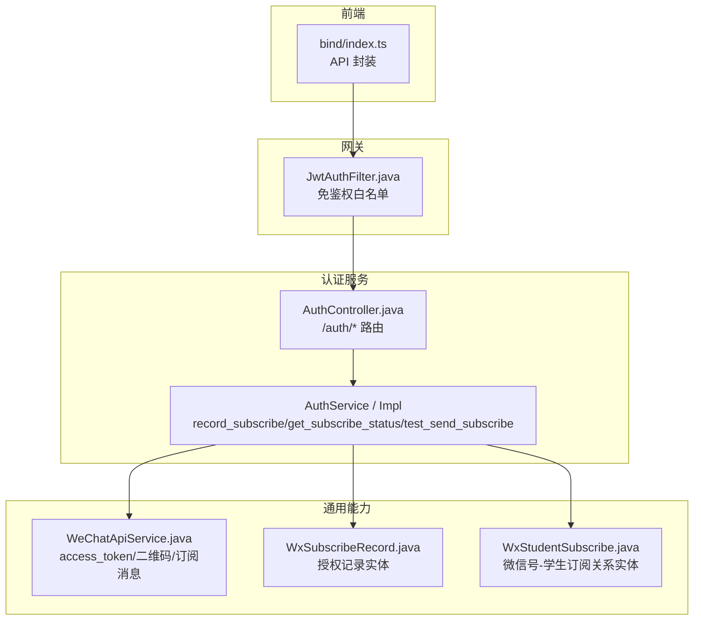
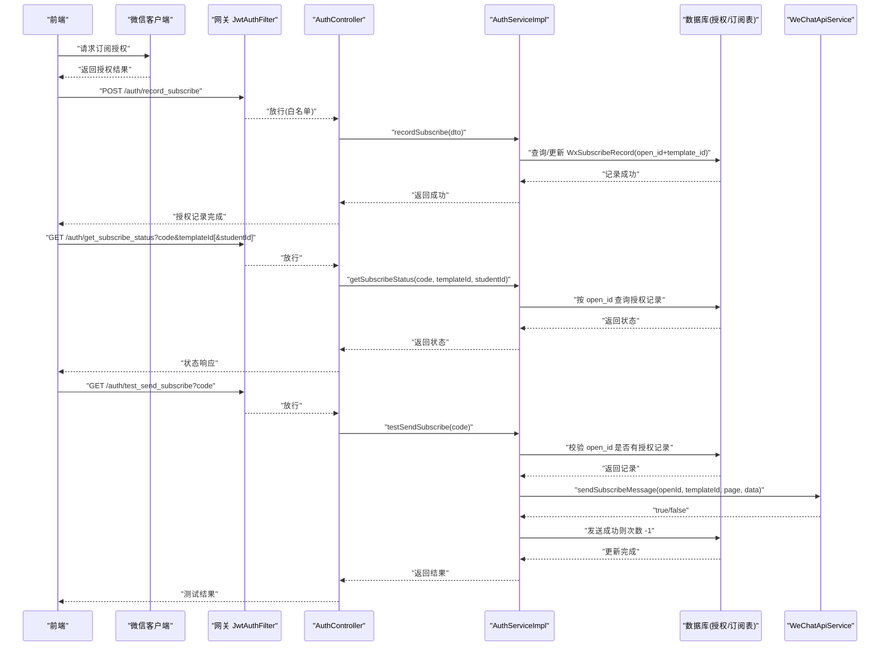
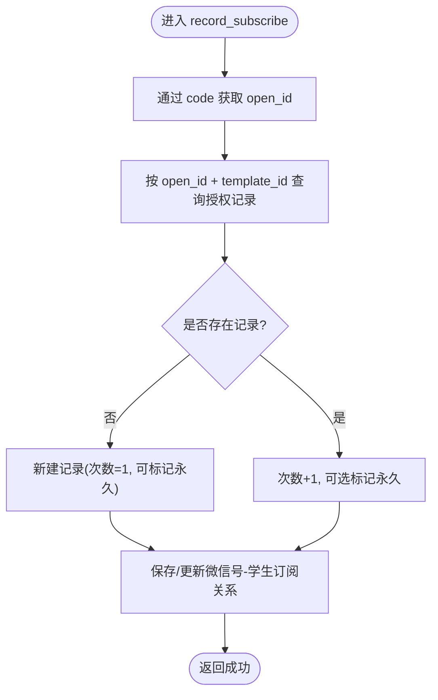
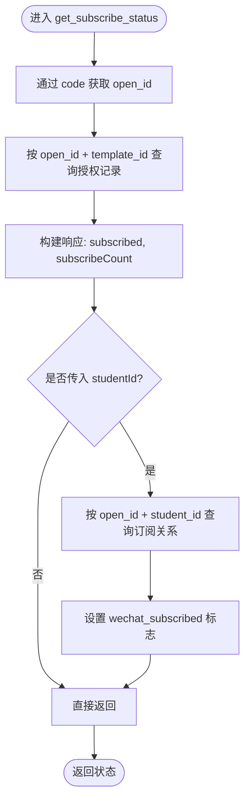
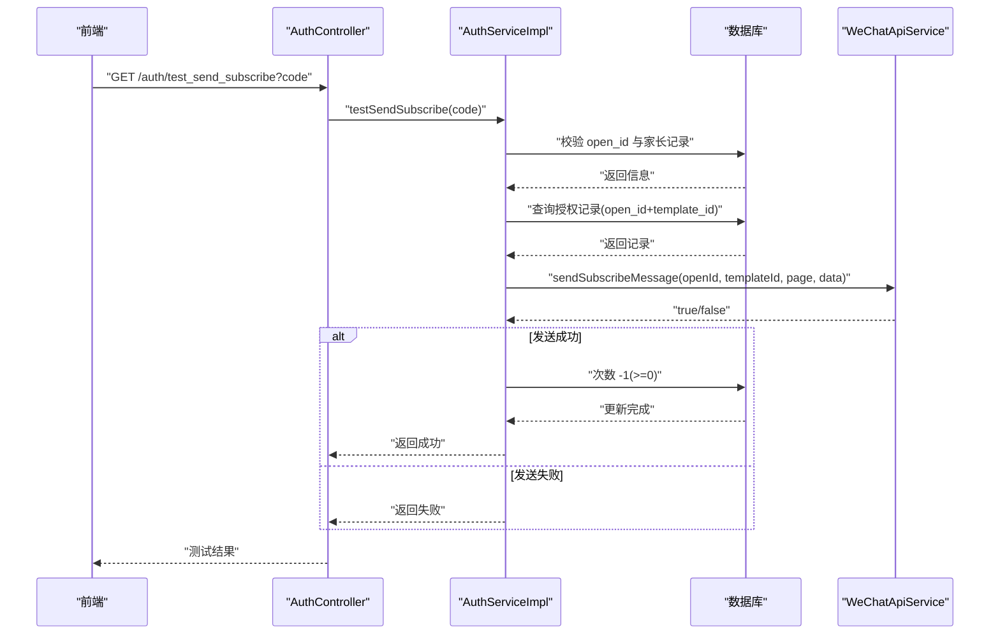
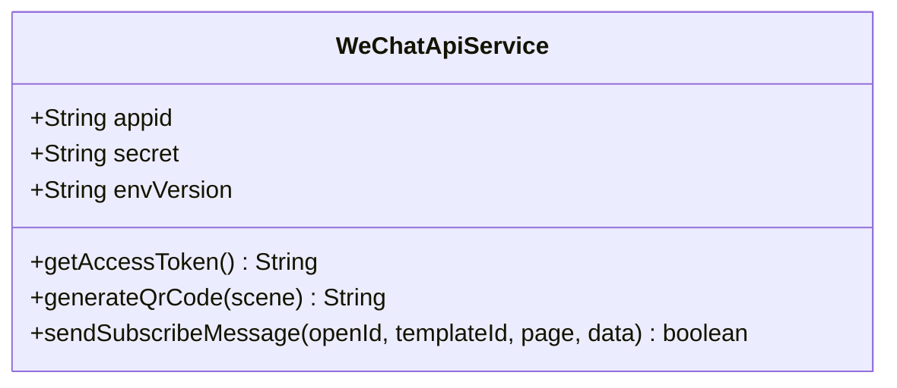
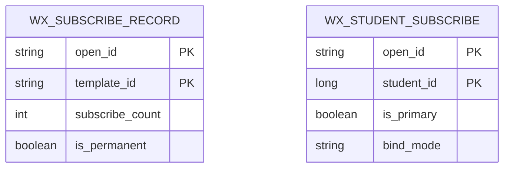
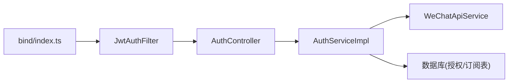

# 微信订阅消息

<cite>
**本文引用的文件**
- [AuthController.java](file://class_times_record_back/auth-service/src/main/java/com/shiroko/controller/AuthController.java)
- [AuthServiceImpl.java](file://class_times_record_back/auth-service/src/main/java/com/shiroko/service/impl/AuthServiceImpl.java)
- [WeChatApiService.java](file://class_times_record_back/common/src/main/java/com/shiroko/util/WeChatApiService.java)
- [WxSubscribeRecord.java](file://class_times_record_back/common/src/main/java/com/shiroko/repository/entity/WxSubscribeRecord.java)
- [WxStudentSubscribe.java](file://class_times_record_back/common/src/main/java/com/shiroko/repository/entity/WxStudentSubscribe.java)
- [JwtAuthFilter.java](file://class_times_record_back/gateway/src/main/java/com/shiroko/gateway/filter/JwtAuthFilter.java)
- [bind/index.ts](file://class_times_record/src/class_times_record/src/api/bind/index.ts)
- [CLAUDE.md](file://CLAUDE.md)
</cite>

## 目录
1. [简介](#简介)
2. [项目结构](#项目结构)
3. [核心组件](#核心组件)
4. [架构总览](#架构总览)
5. [详细组件分析](#详细组件分析)
6. [依赖关系分析](#依赖关系分析)
7. [性能考虑](#性能考虑)
8. [故障排查指南](#故障排查指南)
9. [结论](#结论)
10. [附录](#附录)

## 简介
本文件围绕“微信订阅消息”能力，系统化说明授权记录、状态查询与测试发送的完整实现。重点覆盖以下接口与流程：
- record_subscribe：授权记录机制（按 open_id + template_id 维度计数）
- get_subscribe_status：状态查询逻辑（仅查当前 open_id，不聚合多设备）
- test_send_subscribe：测试发送功能（向当前设备发送并扣减次数）

同时解释微信 OpenID 获取、模板消息配置、授权次数管理、订阅关系维护的核心业务逻辑，并给出 WeChatApiService 的封装与调用方式、流程图、错误处理策略与性能优化建议，以及自定义模板扩展与用户体验优化方案。

## 项目结构
后端采用微服务分层：auth-service 暴露认证与订阅相关接口；common 提供通用工具与实体；gateway 统一鉴权放行白名单；前端在 class_times_record 中通过 API 层调用后端。

图表来源
- [AuthController.java:38-197](file://class_times_record_back/auth-service/src/main/java/com/shiroko/controller/AuthController.java#L38-L197)
- [AuthServiceImpl.java:1050-1238](file://class_times_record_back/auth-service/src/main/java/com/shiroko/service/impl/AuthServiceImpl.java#L1050-L1238)
- [WeChatApiService.java:18-239](file://class_times_record_back/common/src/main/java/com/shiroko/util/WeChatApiService.java#L18-L239)
- [WxSubscribeRecord.java:15-39](file://class_times_record_back/common/src/main/java/com/shiroko/repository/entity/WxSubscribeRecord.java#L15-L39)
- [WxStudentSubscribe.java:23](file://class_times_record_back/common/src/main/java/com/shiroko/repository/entity/WxStudentSubscribe.java#L23)
- [JwtAuthFilter.java:38-40](file://class_times_record_back/gateway/src/main/java/com/shiroko/gateway/filter/JwtAuthFilter.java#L38-L40)
- [bind/index.ts:70-128](file://class_times_record/src/class_times_record/src/api/bind/index.ts#L70-L128)

章节来源
- [AuthController.java:38-197](file://class_times_record_back/auth-service/src/main/java/com/shiroko/controller/AuthController.java#L38-L197)
- [JwtAuthFilter.java:38-40](file://class_times_record_back/gateway/src/main/java/com/shiroko/gateway/filter/JwtAuthFilter.java#L38-L40)
- [bind/index.ts:70-128](file://class_times_record/src/class_times_record/src/api/bind/index.ts#L70-L128)

## 核心组件
- AuthController：对外暴露 /auth/record_subscribe、/auth/get_subscribe_status、/auth/test_send_subscribe 三个接口，均无需登录（网关白名单放行）。
- AuthServiceImpl：实现授权记录、状态查询、测试发送的业务逻辑，包含 OpenID 获取、授权记录读写、订阅关系维护与微信消息发送。
- WeChatApiService：封装 access_token 缓存、小程序码生成、订阅消息发送等微信基础能力。
- 数据模型：
  - WxSubscribeRecord：按 (open_id, template_id) 维度记录授权次数与是否永久订阅。
  - WxStudentSubscribe：维护 open_id 与学生订阅关系，支持主/次家长维度。

章节来源
- [AuthController.java:158-196](file://class_times_record_back/auth-service/src/main/java/com/shiroko/controller/AuthController.java#L158-L196)
- [AuthServiceImpl.java:1050-1238](file://class_times_record_back/auth-service/src/main/java/com/shiroko/service/impl/AuthServiceImpl.java#L1050-L1238)
- [WeChatApiService.java:18-239](file://class_times_record_back/common/src/main/java/com/shiroko/util/WeChatApiService.java#L18-L239)
- [WxSubscribeRecord.java:15-39](file://class_times_record_back/common/src/main/java/com/shiroko/repository/entity/WxSubscribeRecord.java#L15-L39)
- [WxStudentSubscribe.java:23](file://class_times_record_back/common/src/main/java/com/shiroko/repository/entity/WxStudentSubscribe.java#L23)

## 架构总览
整体链路：前端在用户点击同步栈中触发 wx.requestSubscribeMessage，成功后调用后端记录授权；查询状态时仅针对当前 open_id；测试发送则向当前 open_id 推送一条示例消息并扣减次数。

图表来源
- [AuthController.java:158-196](file://class_times_record_back/auth-service/src/main/java/com/shiroko/controller/AuthController.java#L158-L196)
- [AuthServiceImpl.java:1050-1238](file://class_times_record_back/auth-service/src/main/java/com/shiroko/service/impl/AuthServiceImpl.java#L1050-L1238)
- [WeChatApiService.java:180-239](file://class_times_record_back/common/src/main/java/com/shiroko/util/WeChatApiService.java#L180-L239)
- [JwtAuthFilter.java:38-40](file://class_times_record_back/gateway/src/main/java/com/shiroko/gateway/filter/JwtAuthFilter.java#L38-L40)

## 详细组件分析

### record_subscribe 授权记录机制
- 入口：POST /auth/record_subscribe
- 关键流程：
  - 通过 code 换取 open_id
  - 按 (open_id, template_id) 查询授权记录
  - 若不存在则新建并设置初始次数；若存在则次数 +1，并可标记为“永久订阅”
  - 同时维护微信号-学生订阅关系（c_wx_student_subscribe），以解耦 parent.userId 绑定链路
- 设计要点：
  - 同一家长多设备各自独立计数（按 open_id 维度）
  - 永久订阅仍记录次数，但发送时不扣减（业务约定）
  - 该接口无需登录，网关白名单放行

图表来源
- [AuthController.java:158-161](file://class_times_record_back/auth-service/src/main/java/com/shiroko/controller/AuthController.java#L158-L161)
- [AuthServiceImpl.java:1050-1095](file://class_times_record_back/auth-service/src/main/java/com/shiroko/service/impl/AuthServiceImpl.java#L1050-L1095)
- [WxSubscribeRecord.java:15-39](file://class_times_record_back/common/src/main/java/com/shiroko/repository/entity/WxSubscribeRecord.java#L15-L39)
- [WxStudentSubscribe.java:23](file://class_times_record_back/common/src/main/java/com/shiroko/repository/entity/WxStudentSubscribe.java#L23)

章节来源
- [AuthController.java:158-161](file://class_times_record_back/auth-service/src/main/java/com/shiroko/controller/AuthController.java#L158-L161)
- [AuthServiceImpl.java:1050-1095](file://class_times_record_back/auth-service/src/main/java/com/shiroko/service/impl/AuthServiceImpl.java#L1050-L1095)
- [WxSubscribeRecord.java:15-39](file://class_times_record_back/common/src/main/java/com/shiroko/repository/entity/WxSubscribeRecord.java#L15-L39)
- [WxStudentSubscribe.java:23](file://class_times_record_back/common/src/main/java/com/shiroko/repository/entity/WxStudentSubscribe.java#L23)

### get_subscribe_status 状态查询逻辑
- 入口：GET /auth/get_subscribe_status?code&templateId[&studentId]
- 关键流程：
  - 通过 code 获取 open_id
  - 仅查询当前 open_id 的授权记录（不聚合其他设备）
  - 若有记录则视为已授权，返回剩余次数；否则未授权且次数为 0
  - 可选：传入 studentId 时，查询该 open_id 是否已订阅指定学生
- 设计要点：
  - 查询范围严格限定于当前 open_id，避免跨设备聚合导致误判
  - 返回字段包含是否已授权、剩余次数、是否已订阅指定学生

图表来源
- [AuthController.java:175-181](file://class_times_record_back/auth-service/src/main/java/com/shiroko/controller/AuthController.java#L175-L181)
- [AuthServiceImpl.java:1108-1151](file://class_times_record_back/auth-service/src/main/java/com/shiroko/service/impl/AuthServiceImpl.java#L1108-L1151)

章节来源
- [AuthController.java:175-181](file://class_times_record_back/auth-service/src/main/java/com/shiroko/controller/AuthController.java#L175-L181)
- [AuthServiceImpl.java:1108-1151](file://class_times_record_back/auth-service/src/main/java/com/shiroko/service/impl/AuthServiceImpl.java#L1108-L1151)

### test_send_subscribe 测试发送功能
- 入口：GET /auth/test_send_subscribe?code
- 关键流程：
  - 通过 code 获取 open_id
  - 校验用户与家长记录存在性
  - 查询当前 open_id 对扣课通知模板的授权记录
  - 构造模板数据并调用 WeChatApiService.sendSubscribeMessage 发送
  - 发送成功后将当前设备的授权次数 -1（最小为 0）
- 设计要点：
  - 只发送到当前 open_id，不向家长的其他设备广播
  - 失败时不扣减次数，便于重试与排障

图表来源
- [AuthController.java:193-196](file://class_times_record_back/auth-service/src/main/java/com/shiroko/controller/AuthController.java#L193-L196)
- [AuthServiceImpl.java:1163-1235](file://class_times_record_back/auth-service/src/main/java/com/shiroko/service/impl/AuthServiceImpl.java#L1163-L1235)
- [WeChatApiService.java:180-239](file://class_times_record_back/common/src/main/java/com/shiroko/util/WeChatApiService.java#L180-L239)

章节来源
- [AuthController.java:193-196](file://class_times_record_back/auth-service/src/main/java/com/shiroko/controller/AuthController.java#L193-L196)
- [AuthServiceImpl.java:1163-1235](file://class_times_record_back/auth-service/src/main/java/com/shiroko/service/impl/AuthServiceImpl.java#L1163-L1235)
- [WeChatApiService.java:180-239](file://class_times_record_back/common/src/main/java/com/shiroko/util/WeChatApiService.java#L180-L239)

### WeChatApiService 微信 API 服务封装
- 职责：
  - access_token 获取与缓存（提前 5 分钟刷新，避免边界问题）
  - 小程序码生成（用于绑定/订阅场景）
  - 订阅消息发送（构造模板数据、调用微信接口）
- 关键点：
  - 使用 Java 内置 HttpClient，避免框架版本兼容问题
  - 发送订阅消息时，errcode==0 表示成功
  - 所有外部调用具备异常捕获与日志记录

图表来源
- [WeChatApiService.java:18-239](file://class_times_record_back/common/src/main/java/com/shiroko/util/WeChatApiService.java#L18-L239)

章节来源
- [WeChatApiService.java:18-239](file://class_times_record_back/common/src/main/java/com/shiroko/util/WeChatApiService.java#L18-L239)

### 数据模型与关系
- WxSubscribeRecord：按 (open_id, template_id) 唯一维度记录授权次数与是否永久订阅
- WxStudentSubscribe：维护 open_id 与学生订阅关系，支持 is_primary 与 bind_mode 字段

图表来源
- [WxSubscribeRecord.java:15-39](file://class_times_record_back/common/src/main/java/com/shiroko/repository/entity/WxSubscribeRecord.java#L15-L39)
- [WxStudentSubscribe.java:23](file://class_times_record_back/common/src/main/java/com/shiroko/repository/entity/WxStudentSubscribe.java#L23)

章节来源
- [WxSubscribeRecord.java:15-39](file://class_times_record_back/common/src/main/java/com/shiroko/repository/entity/WxSubscribeRecord.java#L15-L39)
- [WxStudentSubscribe.java:23](file://class_times_record_back/common/src/main/java/com/shiroko/repository/entity/WxStudentSubscribe.java#L23)

## 依赖关系分析
- 网关层：JwtAuthFilter 对 /auth/auth/record_subscribe、/auth/auth/get_subscribe_status、/auth/auth/test_send_subscribe 放行，无需 JWT 校验
- 控制器层：AuthController 将请求委派给 AuthServiceImpl
- 服务层：AuthServiceImpl 依赖 WeChatApiService 进行微信交互，依赖 Mapper 访问数据库
- 前端：bind/index.ts 封装了 record_subscribe、get_subscribe_status、test_send_subscribe 的调用

图表来源
- [JwtAuthFilter.java:38-40](file://class_times_record_back/gateway/src/main/java/com/shiroko/gateway/filter/JwtAuthFilter.java#L38-L40)
- [AuthController.java:158-196](file://class_times_record_back/auth-service/src/main/java/com/shiroko/controller/AuthController.java#L158-L196)
- [AuthServiceImpl.java:1050-1238](file://class_times_record_back/auth-service/src/main/java/com/shiroko/service/impl/AuthServiceImpl.java#L1050-L1238)
- [WeChatApiService.java:18-239](file://class_times_record_back/common/src/main/java/com/shiroko/util/WeChatApiService.java#L18-L239)
- [bind/index.ts:70-128](file://class_times_record/src/class_times_record/src/api/bind/index.ts#L70-L128)

章节来源
- [JwtAuthFilter.java:38-40](file://class_times_record_back/gateway/src/main/java/com/shiroko/gateway/filter/JwtAuthFilter.java#L38-L40)
- [bind/index.ts:70-128](file://class_times_record/src/class_times_record/src/api/bind/index.ts#L70-L128)

## 性能考虑
- access_token 缓存：WeChatApiService 内部缓存并提前 5 分钟刷新，减少频繁网络请求
- 并发安全：双重检查锁保证 token 刷新线程安全
- 查询范围控制：状态查询仅针对当前 open_id，避免跨设备聚合带来的额外开销
- 幂等保护：授权记录按 (open_id, template_id) 维度，避免重复授权导致的多次计数
- 超时与重试：HTTP 调用设置合理超时，异常路径快速失败，便于上层重试或降级

[本节为通用指导，不直接分析具体文件]

## 故障排查指南
- 常见错误定位：
  - 微信授权失败：检查 code 有效性及微信侧返回
  - 无订阅记录：确认前端是否在用户点击同步栈中调用 wx.requestSubscribeMessage 并成功回调后调用 record_subscribe
  - 发送失败：查看 WeChatApiService 日志中的 errcode 与响应体，核对模板字段与值类型
  - 唯一约束冲突：如 c_wx_student_subscribe 或 c_wx_subscribe_record 的唯一约束报错，需检查 open_id 与模板/学生组合是否重复
- 建议操作：
  - 优先使用 test_send_subscribe 验证配置与权限
  - 对比微信公众平台模板字段名与代码中 data key 的一致性
  - 关注全局异常处理器对数据库唯一约束的错误映射提示

章节来源
- [WeChatApiService.java:180-239](file://class_times_record_back/common/src/main/java/com/shiroko/util/WeChatApiService.java#L180-L239)
- [CLAUDE.md:280](file://CLAUDE.md#L280)

## 结论
本方案以 open_id 为核心维度，实现了微信订阅消息的一次性授权模型与精准推送。通过 record_subscribe 记录授权、get_subscribe_status 查询状态、test_send_subscribe 验证发送，结合 WeChatApiService 的基础能力封装，形成稳定可扩展的消息通道。配合合理的缓存、幂等与异常处理策略，可在保障用户体验的同时提升系统可靠性。

[本节为总结性内容，不直接分析具体文件]

## 附录

### 自定义消息模板扩展指南
- 新增模板步骤：
  - 在微信公众平台申请新模板并获取 template_id
  - 在业务侧定义新的模板常量（参考现有 SUBSCRIBE_TEMPLATE_ID 的使用位置）
  - 在 sendSubscribeMessage 调用处补充对应模板字段映射
  - 在前端增加相应模板的授权与状态展示逻辑
- 注意事项：
  - 确保模板字段名与 data key 一致
  - 注意不同模板的授权记录维度（open_id + template_id）天然隔离，互不影响

章节来源
- [AuthServiceImpl.java:1153-1154](file://class_times_record_back/auth-service/src/main/java/com/shiroko/service/impl/AuthServiceImpl.java#L1153-L1154)
- [WeChatApiService.java:180-239](file://class_times_record_back/common/src/main/java/com/shiroko/util/WeChatApiService.java#L180-L239)

### 用户体验优化方案
- 授权时机：在用户点击同步栈中触发 wx.requestSubscribeMessage，降低授权被拒概率
- 明确反馈：授权成功后立即提示“已授权”，并提供“测试发送”入口帮助验证
- 状态可视化：在页面显示剩余次数与是否已订阅指定学生，帮助用户理解当前状态
- 容错引导：当发送失败时，给出清晰错误原因与下一步操作建议（如检查后台配置）

[本节为通用指导，不直接分析具体文件]