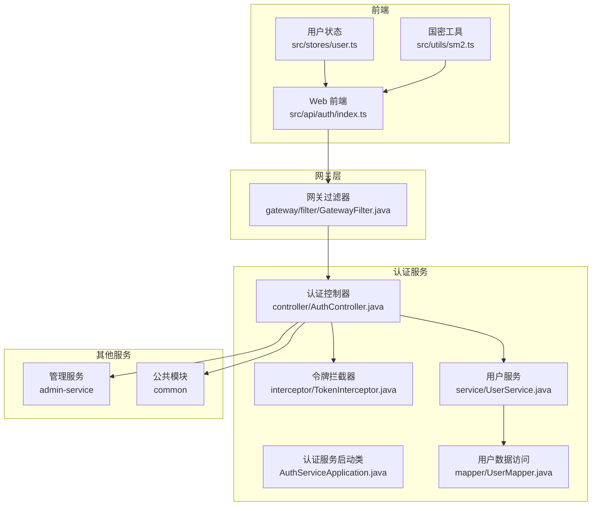
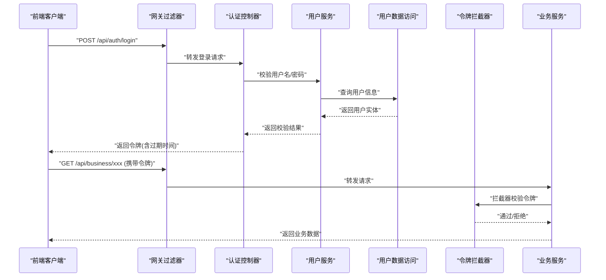
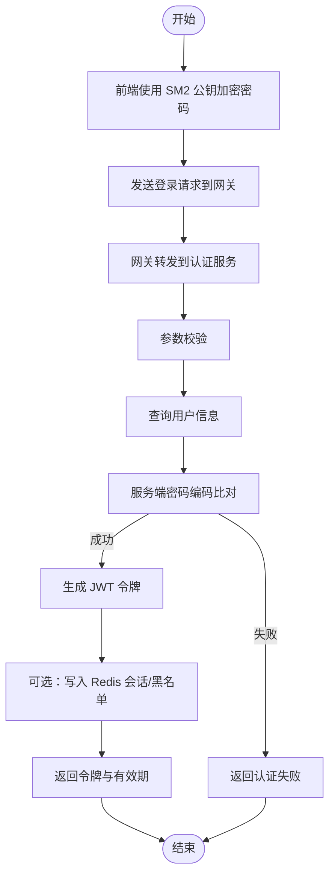
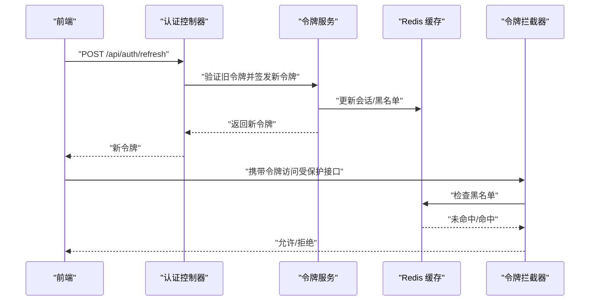
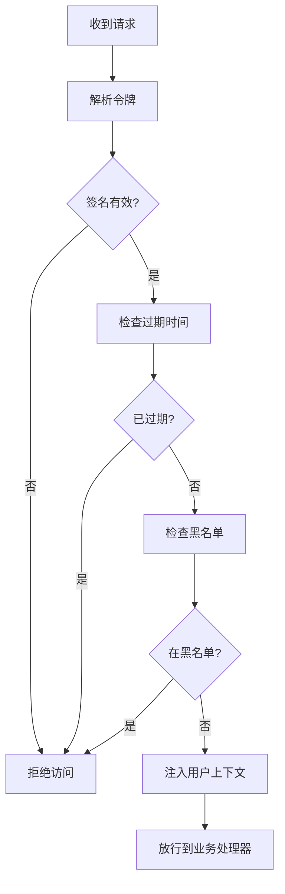
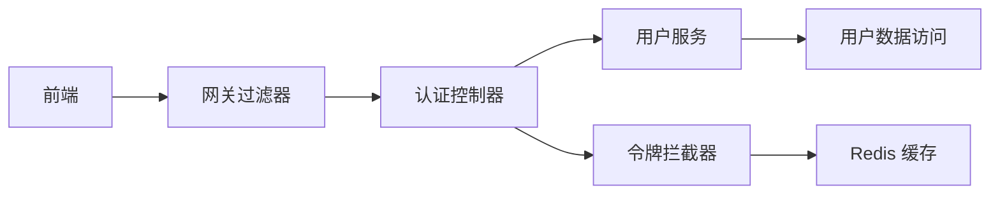

# 核心认证机制

<cite>
**本文引用的文件**   
- [AuthServiceApplication.java](file://class_times_record_back/auth-service/src/main/java/com/shiroko/AuthServiceApplication.java)
- [application.yml](file://class_times_record_back/auth-service/src/main/resources/application.yml)
- [application-dev.yml](file://class_times_record_back/auth-service/src/main/resources/application-dev.yml)
- [JwtUtilsTest.java](file://class_times_record_back/auth-service/src/test/java/com/shiroko/JwtUtilsTest.java)
- [AuthController.java](file://class_times_record_back/auth-service/src/main/java/com/shiroko/controller/AuthController.java)
- [TokenInterceptor.java](file://class_times_record_back/auth-service/src/main/java/com/shiroko/interceptor/TokenInterceptor.java)
- [UserMapper.java](file://class_times_record_back/auth-service/src/main/java/com/shiroko/mapper/UserMapper.java)
- [UserService.java](file://class_times_record_back/auth-service/src/main/java/com/shiroko/service/UserService.java)
- [PasswordEncoderUtil.java](file://class_times_record_back/admin-service/src/main/java/com/shiroko/PasswordEncoderUtil.java)
- [GatewayFilter.java](file://class_times_record_back/gateway/src/main/java/com/shiroko/gateway/filter/GatewayFilter.java)
- [sm2.ts](file://class_record_admin_front/src/utils/sm2.ts)
- [auth/index.ts（前端）](file://class_record_admin_front/src/api/auth/index.ts)
- [user.ts（前端状态）](file://class_record_admin_front/src/stores/user.ts)
</cite>

## 目录
1. [简介](#简介)
2. [项目结构](#项目结构)
3. [核心组件](#核心组件)
4. [架构总览](#架构总览)
5. [详细组件分析](#详细组件分析)
6. [依赖关系分析](#依赖关系分析)
7. [性能考虑](#性能考虑)
8. [故障排查指南](#故障排查指南)
9. [结论](#结论)
10. [附录](#附录)

## 简介
本文件围绕“课程记录”系统的核心认证机制进行系统化说明，覆盖用户登录注册、密码加密与校验、身份校验与会话管理、JWT 令牌生成/验证/刷新/黑名单、国密算法 SM2/SM3 在认证中的集成应用、认证拦截器与权限校验流程，并提供完整的认证流程图、API 调用示例与错误处理策略。同时给出自定义认证逻辑扩展指南与安全最佳实践，帮助开发者快速理解并安全地扩展系统能力。

## 项目结构
后端采用微服务架构，认证相关能力集中在 auth-service，网关 gateway 承担统一鉴权入口，admin-service 提供管理员侧业务接口，common 模块提供通用工具与配置。前端包含 Web 端与移动端两套客户端，均实现国密加解密与请求封装。

图表来源
- [AuthServiceApplication.java:1-21](file://class_times_record_back/auth-service/src/main/java/com/shiroko/AuthServiceApplication.java#L1-L21)
- [AuthController.java](file://class_times_record_back/auth-service/src/main/java/com/shiroko/controller/AuthController.java)
- [TokenInterceptor.java](file://class_times_record_back/auth-service/src/main/java/com/shiroko/interceptor/TokenInterceptor.java)
- [UserService.java](file://class_times_record_back/auth-service/src/main/java/com/shiroko/service/UserService.java)
- [UserMapper.java](file://class_times_record_back/auth-service/src/main/java/com/shiroko/mapper/UserMapper.java)
- [GatewayFilter.java](file://class_times_record_back/gateway/src/main/java/com/shiroko/gateway/filter/GatewayFilter.java)
- [sm2.ts](file://class_record_admin_front/src/utils/sm2.ts)
- [auth/index.ts（前端）](file://class_record_admin_front/src/api/auth/index.ts)
- [user.ts（前端状态）](file://class_record_admin_front/src/stores/user.ts)

章节来源
- [AuthServiceApplication.java:1-21](file://class_times_record_back/auth-service/src/main/java/com/shiroko/AuthServiceApplication.java#L1-L21)

## 核心组件
- 认证服务启动类：启用发现客户端、Feign 客户端、MyBatis Mapper 扫描等基础能力。
- 认证控制器：暴露登录、注册、登出、刷新令牌等 API。
- 令牌拦截器：对受保护接口进行 JWT 解析、签名校验、黑名单检查与上下文注入。
- 用户服务：负责用户信息查询、密码校验、会话与令牌生命周期管理。
- 用户数据访问：基于 MyBatis 的数据库访问层。
- 网关过滤器：统一入口校验，转发携带有效令牌的请求至下游服务。
- 前端认证 API 与状态管理：封装登录/注册/刷新等调用，维护本地令牌与用户信息。
- 国密工具：前端 SM2 加解密与 SM3 摘要计算工具。

章节来源
- [AuthServiceApplication.java:1-21](file://class_times_record_back/auth-service/src/main/java/com/shiroko/AuthServiceApplication.java#L1-L21)
- [AuthController.java](file://class_times_record_back/auth-service/src/main/java/com/shiroko/controller/AuthController.java)
- [TokenInterceptor.java](file://class_times_record_back/auth-service/src/main/java/com/shiroko/interceptor/TokenInterceptor.java)
- [UserService.java](file://class_times_record_back/auth-service/src/main/java/com/shiroko/service/UserService.java)
- [UserMapper.java](file://class_times_record_back/auth-service/src/main/java/com/shiroko/mapper/UserMapper.java)
- [GatewayFilter.java](file://class_times_record_back/gateway/src/main/java/com/shiroko/gateway/filter/GatewayFilter.java)
- [sm2.ts](file://class_record_admin_front/src/utils/sm2.ts)
- [auth/index.ts（前端）](file://class_record_admin_front/src/api/auth/index.ts)
- [user.ts（前端状态）](file://class_record_admin_front/src/stores/user.ts)

## 架构总览
整体认证链路从前端发起，经网关统一校验后进入认证服务完成登录/注册/刷新等操作；受保护的业务接口由拦截器进行令牌校验与权限判定。

图表来源
- [AuthController.java](file://class_times_record_back/auth-service/src/main/java/com/shiroko/controller/AuthController.java)
- [UserService.java](file://class_times_record_back/auth-service/src/main/java/com/shiroko/service/UserService.java)
- [UserMapper.java](file://class_times_record_back/auth-service/src/main/java/com/shiroko/mapper/UserMapper.java)
- [TokenInterceptor.java](file://class_times_record_back/auth-service/src/main/java/com/shiroko/interceptor/TokenInterceptor.java)
- [GatewayFilter.java](file://class_times_record_back/gateway/src/main/java/com/shiroko/gateway/filter/GatewayFilter.java)

## 详细组件分析

### 登录与注册流程
- 登录流程要点
  - 前端使用 SM2 公钥对敏感字段（如密码）进行加密传输，降低明文泄露风险。
  - 网关将请求转发到认证服务，认证控制器接收参数并进行格式校验。
  - 用户服务根据用户名查询用户实体，使用服务端密码编码器比对密码哈希值。
  - 校验通过后生成 JWT 令牌（包含用户标识、角色、过期时间等），必要时写入 Redis 会话或黑名单集合。
  - 响应中包含令牌及有效期，前端保存至本地存储与状态管理。
- 注册流程要点
  - 前端同样使用 SM2 加密提交注册信息。
  - 服务端对用户唯一性进行校验，使用强哈希算法（如 BCrypt 或 SM3 结合盐值）对密码进行加密存储。
  - 成功后返回必要信息，引导用户登录。

图表来源
- [sm2.ts](file://class_record_admin_front/src/utils/sm2.ts)
- [AuthController.java](file://class_times_record_back/auth-service/src/main/java/com/shiroko/controller/AuthController.java)
- [UserService.java](file://class_times_record_back/auth-service/src/main/java/com/shiroko/service/UserService.java)
- [UserMapper.java](file://class_times_record_back/auth-service/src/main/java/com/shiroko/mapper/UserMapper.java)
- [PasswordEncoderUtil.java](file://class_times_record_back/admin-service/src/main/java/com/shiroko/PasswordEncoderUtil.java)

章节来源
- [sm2.ts](file://class_record_admin_front/src/utils/sm2.ts)
- [AuthController.java](file://class_times_record_back/auth-service/src/main/java/com/shiroko/controller/AuthController.java)
- [UserService.java](file://class_times_record_back/auth-service/src/main/java/com/shiroko/service/UserService.java)
- [UserMapper.java](file://class_times_record_back/auth-service/src/main/java/com/shiroko/mapper/UserMapper.java)
- [PasswordEncoderUtil.java:1-200](file://class_times_record_back/admin-service/src/main/java/com/shiroko/PasswordEncoderUtil.java#L1-L200)

### 密码加密与验证
- 前端加密
  - 使用 SM2 公钥对密码进行非对称加密，确保传输过程不被窃听。
- 服务端校验
  - 使用密码编码器对输入密码进行哈希并与数据库中存储的哈希值比对。
  - 若系统采用 SM3 作为摘要算法，需配合盐值与迭代次数提升安全性。
- 建议
  - 优先使用业界成熟的密码哈希方案（如 BCrypt/Argon2），如需合规要求可引入 SM3 作为附加摘要。
  - 避免在前端直接存储明文密码，仅保存令牌与必要的用户信息。

章节来源
- [PasswordEncoderUtil.java:1-200](file://class_times_record_back/admin-service/src/main/java/com/shiroko/PasswordEncoderUtil.java#L1-L200)
- [sm2.ts](file://class_record_admin_front/src/utils/sm2.ts)

### JWT 令牌：生成、验证、刷新与黑名单
- 生成
  - 认证成功后签发 JWT，包含用户标识、角色、过期时间等载荷，并使用私钥签名。
- 验证
  - 拦截器解析请求头中的令牌，校验签名、过期时间与格式。
  - 可选：读取 Redis 中黑名单集合判断是否已注销或强制下线。
- 刷新
  - 提供刷新接口，使用旧令牌换取新令牌，支持滑动过期策略。
- 黑名单
  - 注销或强制下线时将令牌加入黑名单（Redis Set），设置 TTL 与过期时间一致。
  - 每次鉴权前检查黑名单，命中则拒绝访问。

图表来源
- [AuthController.java](file://class_times_record_back/auth-service/src/main/java/com/shiroko/controller/AuthController.java)
- [TokenInterceptor.java](file://class_times_record_back/auth-service/src/main/java/com/shiroko/interceptor/TokenInterceptor.java)

章节来源
- [JwtUtilsTest.java](file://class_times_record_back/auth-service/src/test/java/com/shiroko/JwtUtilsTest.java)
- [TokenInterceptor.java](file://class_times_record_back/auth-service/src/main/java/com/shiroko/interceptor/TokenInterceptor.java)

### 国密算法（SM2/SM3）集成应用
- SM2 数字签名与加密
  - 前端使用 SM2 公钥对敏感数据进行加密传输，服务端使用对应私钥解密。
  - 可使用 SM2 对关键请求体或令牌载荷进行签名，防止篡改。
- SM3 数据摘要
  - 用于密码哈希或数据完整性校验，结合盐值与多次迭代增强抗碰撞能力。
- 集成建议
  - 明确公私钥管理与轮换策略，避免硬编码密钥。
  - 对签名与加密分别使用不同密钥对，降低单点风险。
  - 在网关或服务端增加签名校验拦截，统一处理异常与日志。

章节来源
- [sm2.ts](file://class_record_admin_front/src/utils/sm2.ts)

### 认证拦截器与权限验证流程
- 拦截器职责
  - 解析请求头中的令牌，校验签名与过期时间。
  - 检查黑名单，决定是否放行。
  - 将用户上下文注入到线程局部变量，供后续业务使用。
- 权限验证
  - 基于注解或路径规则进行资源级权限控制。
  - 结合角色与菜单权限模型，动态校验访问权限。

图表来源
- [TokenInterceptor.java](file://class_times_record_back/auth-service/src/main/java/com/shiroko/interceptor/TokenInterceptor.java)

章节来源
- [TokenInterceptor.java](file://class_times_record_back/auth-service/src/main/java/com/shiroko/interceptor/TokenInterceptor.java)

### 网关过滤器与统一鉴权
- 网关过滤器职责
  - 统一校验请求头中的令牌，转发有效请求到下游服务。
  - 对匿名接口白名单放行，减少不必要的鉴权开销。
- 与认证服务协作
  - 对于复杂鉴权场景，网关可先做轻量校验，再委托认证服务进行深度校验。

章节来源
- [GatewayFilter.java](file://class_times_record_back/gateway/src/main/java/com/shiroko/gateway/filter/GatewayFilter.java)

### 前端认证 API 与状态管理
- 认证 API
  - 封装登录、注册、刷新、登出等接口调用，统一处理错误码与提示。
- 状态管理
  - 登录后将令牌与用户信息保存到本地存储与状态仓库，便于全局访问。
  - 监听令牌过期事件，自动触发刷新或跳转登录页。

章节来源
- [auth/index.ts（前端）](file://class_record_admin_front/src/api/auth/index.ts)
- [user.ts（前端状态）](file://class_record_admin_front/src/stores/user.ts)

## 依赖关系分析
- 组件耦合
  - 认证控制器依赖用户服务与令牌工具，用户服务依赖数据访问层。
  - 拦截器依赖令牌工具与缓存（Redis）。
  - 网关过滤器与认证服务解耦，通过标准 HTTP 协议交互。
- 外部依赖
  - Redis：用于会话与黑名单管理。
  - MyBatis：用户数据持久化。
  - 国密库：SM2/SM3 算法实现。

图表来源
- [AuthController.java](file://class_times_record_back/auth-service/src/main/java/com/shiroko/controller/AuthController.java)
- [UserService.java](file://class_times_record_back/auth-service/src/main/java/com/shiroko/service/UserService.java)
- [UserMapper.java](file://class_times_record_back/auth-service/src/main/java/com/shiroko/mapper/UserMapper.java)
- [TokenInterceptor.java](file://class_times_record_back/auth-service/src/main/java/com/shiroko/interceptor/TokenInterceptor.java)
- [GatewayFilter.java](file://class_times_record_back/gateway/src/main/java/com/shiroko/gateway/filter/GatewayFilter.java)

章节来源
- [AuthServiceApplication.java:1-21](file://class_times_record_back/auth-service/src/main/java/com/shiroko/AuthServiceApplication.java#L1-L21)

## 性能考虑
- 令牌校验优化
  - 在拦截器中对令牌进行快速校验，避免重复解析。
  - 使用本地缓存热点用户信息，减少数据库访问。
- 黑名单管理
  - 合理设置 Redis TTL，避免内存膨胀。
  - 批量清理过期黑名单条目，定期维护。
- 国密算法性能
  - SM2/SM3 计算开销较大，建议在网关或服务端异步处理签名校验。
  - 对频繁调用的接口，考虑缓存公钥与校验结果。

[本节为通用性能建议，不直接分析具体文件]

## 故障排查指南
- 常见问题
  - 令牌无效：检查签名、过期时间与黑名单状态。
  - 密码校验失败：确认前端加密方式与服务端解码一致，核对盐值与哈希算法。
  - 网关拒绝：检查白名单配置与请求头格式。
- 调试建议
  - 开启详细日志，记录令牌解析与校验步骤。
  - 使用测试用例验证 JWT 工具与国密算法实现。
  - 针对异常返回码进行统一处理与提示。

章节来源
- [JwtUtilsTest.java](file://class_times_record_back/auth-service/src/test/java/com/shiroko/JwtUtilsTest.java)

## 结论
本认证机制以 JWT 为核心，结合网关统一鉴权与拦截器细粒度校验，实现了安全的登录注册、密码加密、会话管理与黑名单控制。通过集成国密算法 SM2/SM3，提升了数据传输与完整性保障。建议在生产环境完善密钥管理、监控告警与审计日志，持续优化性能与安全性。

[本节为总结性内容，不直接分析具体文件]

## 附录

### API 调用示例（概念性）
- 登录
  - 方法：POST
  - 路径：/api/auth/login
  - 请求体：包含用户名与 SM2 加密后的密码
  - 响应：返回令牌与有效期
- 注册
  - 方法：POST
  - 路径：/api/auth/register
  - 请求体：包含用户名、邮箱与 SM2 加密后的密码
  - 响应：返回注册结果
- 刷新令牌
  - 方法：POST
  - 路径：/api/auth/refresh
  - 请求体：包含旧令牌
  - 响应：返回新令牌
- 登出
  - 方法：POST
  - 路径：/api/auth/logout
  - 请求体：包含当前令牌
  - 响应：返回登出结果

[本节为概念性示例，不直接分析具体文件]

### 错误处理策略
- 认证失败：返回统一错误码与提示信息，避免泄露敏感细节。
- 令牌过期：前端自动刷新或跳转登录页。
- 黑名单命中：返回强制下线提示，要求重新登录。
- 网络异常：重试与降级策略，保证用户体验。

[本节为通用策略，不直接分析具体文件]

### 自定义认证逻辑扩展指南
- 扩展点
  - 在认证控制器中添加新的认证方式（如短信验证码、第三方 OAuth）。
  - 在拦截器中增加自定义校验逻辑（如设备指纹、地理位置限制）。
  - 在用户服务中扩展权限模型（如基于资源的细粒度权限）。
- 安全最佳实践
  - 严格校验输入，防止注入攻击。
  - 最小权限原则，按需授予角色与资源访问。
  - 定期轮换密钥与令牌有效期，缩短攻击窗口。
  - 记录审计日志，追踪异常行为。

[本节为通用指导，不直接分析具体文件]