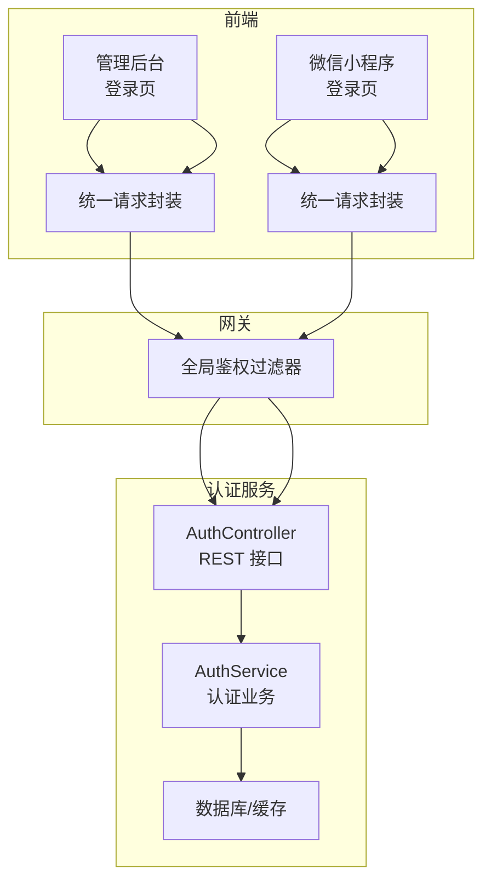
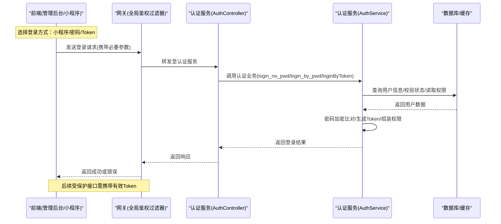
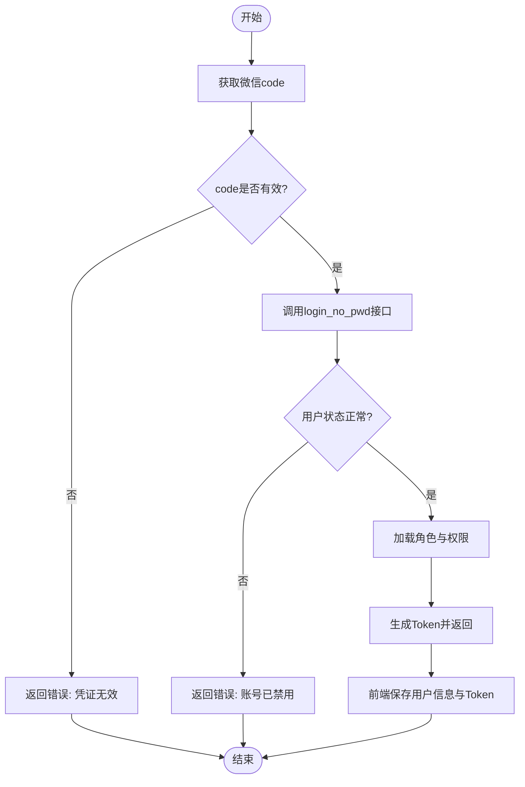
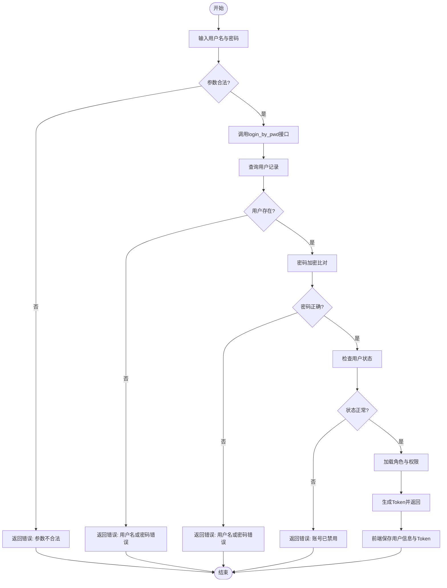
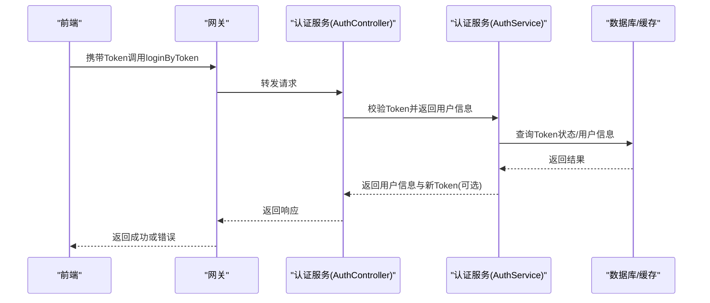
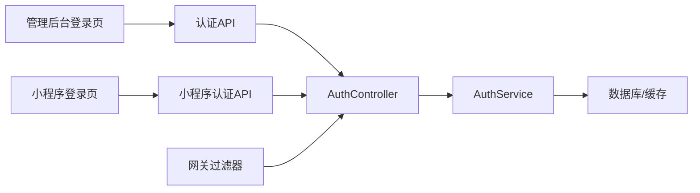

# 用户认证流程

<cite>
**本文引用的文件**   
- [class_record_admin_front/src/api/auth/index.ts](file://class_record_admin_front/src/api/auth/index.ts)
- [class_record_admin_front/src/views/login/index.vue](file://class_record_admin_front/src/views/login/index.vue)
- [class_record_admin_front/src/stores/user.ts](file://class_record_admin_front/src/stores/user.ts)
- [class_record_admin_front/src/utils/request.ts](file://class_record_admin_front/src/utils/request.ts)
- [class_times_record_back/auth-service/src/main/java/com/shiroko/controller/AuthController.java](file://class_times_record_back/auth-service/src/main/java/com/shiroko/controller/AuthController.java)
- [class_times_record_back/auth-service/src/main/java/com/shiroko/service/AuthService.java](file://class_times_record_back/auth-service/src/main/java/com/shiroko/service/AuthService.java)
- [class_times_record_back/auth-service/src/main/java/com/shiroko/dto/LoginRequest.java](file://class_times_record_back/auth-service/src/main/java/com/shiroko/dto/LoginRequest.java)
- [class_times_record_back/auth-service/src/main/java/com/shiroko/dto/LoginResponse.java](file://class_times_record_back/auth-service/src/main/java/com/shiroko/dto/LoginResponse.java)
- [class_times_record_back/common/src/main/java/com/shiroko/exception/BusinessException.java](file://class_times_record_back/common/src/main/java/com/shiroko/exception/BusinessException.java)
- [class_times_record_back/gateway/src/main/java/com/shiroko/gateway/filter/AuthGlobalFilter.java](file://class_times_record_back/gateway/src/main/java/com/shiroko/gateway/filter/AuthGlobalFilter.java)
- [class_times_record/src/pages/login/index.vue](file://class_times_record/src/pages/login/index.vue)
- [class_times_record/src/api/auth/index.ts](file://class_times_record/src/api/auth/index.ts)
- [class_times_record/src/stores/user.ts](file://class_times_record/src/stores/user.ts)
</cite>

## 目录
1. [简介](#简介)
2. [项目结构](#项目结构)
3. [核心组件](#核心组件)
4. [架构总览](#架构总览)
5. [详细组件分析](#详细组件分析)
6. [依赖分析](#依赖分析)
7. [性能考虑](#性能考虑)
8. [故障排查指南](#故障排查指南)
9. [结论](#结论)
10. [附录](#附录)

## 简介
本文件面向开发者，系统化梳理多端（管理后台与微信小程序）的用户认证流程，覆盖以下登录方式：
- 微信小程序登录（login_no_pwd）
- 密码登录（login_by_pwd）
- Token 登录（loginByToken）

文档从系统架构、数据流、处理逻辑、错误处理到扩展实践进行分层说明，并提供流程图与调用示例路径，帮助快速理解并安全地扩展自定义登录逻辑。

## 项目结构
本项目采用前后端分离与微服务架构：
- 前端（管理后台）：Vue + TypeScript，封装统一请求与状态管理，提供登录页面与 API 调用。
- 前端（微信小程序）：uni-app + TypeScript，提供小程序登录入口与本地状态持久化。
- 后端（auth-service）：Spring Boot 微服务，实现认证相关接口、业务校验、令牌签发与权限信息组装。
- 网关（gateway）：全局鉴权过滤器，负责 Token 校验与上下文注入。
- 公共模块（common）：异常定义、通用工具等。

图表来源
- [class_record_admin_front/src/views/login/index.vue](file://class_record_admin_front/src/views/login/index.vue)
- [class_record_admin_front/src/utils/request.ts](file://class_record_admin_front/src/utils/request.ts)
- [class_times_record/src/pages/login/index.vue](file://class_times_record/src/pages/login/index.vue)
- [class_times_record_back/gateway/src/main/java/com/shiroko/gateway/filter/AuthGlobalFilter.java](file://class_times_record_back/gateway/src/main/java/com/shiroko/gateway/filter/AuthGlobalFilter.java)
- [class_times_record_back/auth-service/src/main/java/com/shiroko/controller/AuthController.java](file://class_times_record_back/auth-service/src/main/java/com/shiroko/controller/AuthController.java)
- [class_times_record_back/auth-service/src/main/java/com/shiroko/service/AuthService.java](file://class_times_record_back/auth-service/src/main/java/com/shiroko/service/AuthService.java)

章节来源
- [class_record_admin_front/src/views/login/index.vue](file://class_record_admin_front/src/views/login/index.vue)
- [class_record_admin_front/src/utils/request.ts](file://class_record_admin_front/src/utils/request.ts)
- [class_times_record/src/pages/login/index.vue](file://class_times_record/src/pages/login/index.vue)
- [class_times_record_back/gateway/src/main/java/com/shiroko/gateway/filter/AuthGlobalFilter.java](file://class_times_record_back/gateway/src/main/java/com/shiroko/gateway/filter/AuthGlobalFilter.java)
- [class_times_record_back/auth-service/src/main/java/com/shiroko/controller/AuthController.java](file://class_times_record_back/auth-service/src/main/java/com/shiroko/controller/AuthController.java)
- [class_times_record_back/auth-service/src/main/java/com/shiroko/service/AuthService.java](file://class_times_record_back/auth-service/src/main/java/com/shiroko/service/AuthService.java)

## 核心组件
- 管理后台登录入口与 API 封装
  - 登录页面：触发不同登录方式，收集参数并调用 API。
  - API 层：将登录方法映射为 REST 调用，统一处理响应与错误。
  - 状态管理：保存用户信息与 Token，提供刷新与退出能力。
  - 请求封装：在请求头中携带 Token，并在响应拦截器中处理未授权跳转。
- 微信小程序登录入口与 API 封装
  - 登录页面：获取微信 code，发起 login_no_pwd 登录。
  - API 层：封装小程序登录接口。
  - 状态管理：存储用户信息与 Token，支持自动续期或重新登录。
- 认证服务（后端）
  - 控制器：暴露登录接口，接收请求参数并返回结果。
  - 服务层：执行身份验证、密码比对、状态检查、权限加载与 Token 签发。
  - DTO：定义登录请求与响应结构。
- 网关
  - 全局过滤器：校验 Token 有效性，注入用户上下文，拒绝非法访问。

章节来源
- [class_record_admin_front/src/api/auth/index.ts](file://class_record_admin_front/src/api/auth/index.ts)
- [class_record_admin_front/src/views/login/index.vue](file://class_record_admin_front/src/views/login/index.vue)
- [class_record_admin_front/src/stores/user.ts](file://class_record_admin_front/src/stores/user.ts)
- [class_record_admin_front/src/utils/request.ts](file://class_record_admin_front/src/utils/request.ts)
- [class_times_record/src/pages/login/index.vue](file://class_times_record/src/pages/login/index.vue)
- [class_times_record/src/api/auth/index.ts](file://class_times_record/src/api/auth/index.ts)
- [class_times_record/src/stores/user.ts](file://class_times_record/src/stores/user.ts)
- [class_times_record_back/auth-service/src/main/java/com/shiroko/controller/AuthController.java](file://class_times_record_back/auth-service/src/main/java/com/shiroko/controller/AuthController.java)
- [class_times_record_back/auth-service/src/main/java/com/shiroko/service/AuthService.java](file://class_times_record_back/auth-service/src/main/java/com/shiroko/service/AuthService.java)
- [class_times_record_back/auth-service/src/main/java/com/shiroko/dto/LoginRequest.java](file://class_times_record_back/auth-service/src/main/java/com/shiroko/dto/LoginRequest.java)
- [class_times_record_back/auth-service/src/main/java/com/shiroko/dto/LoginResponse.java](file://class_times_record_back/auth-service/src/main/java/com/shiroko/dto/LoginResponse.java)
- [class_times_record_back/gateway/src/main/java/com/shiroko/gateway/filter/AuthGlobalFilter.java](file://class_times_record_back/gateway/src/main/java/com/shiroko/gateway/filter/AuthGlobalFilter.java)

## 架构总览
下图展示三种登录方式的端到端调用链路与关键节点：

图表来源
- [class_record_admin_front/src/views/login/index.vue](file://class_record_admin_front/src/views/login/index.vue)
- [class_times_record/src/pages/login/index.vue](file://class_times_record/src/pages/login/index.vue)
- [class_times_record_back/gateway/src/main/java/com/shiroko/gateway/filter/AuthGlobalFilter.java](file://class_times_record_back/gateway/src/main/java/com/shiroko/gateway/filter/AuthGlobalFilter.java)
- [class_times_record_back/auth-service/src/main/java/com/shiroko/controller/AuthController.java](file://class_times_record_back/auth-service/src/main/java/com/shiroko/controller/AuthController.java)
- [class_times_record_back/auth-service/src/main/java/com/shiroko/service/AuthService.java](file://class_times_record_back/auth-service/src/main/java/com/shiroko/service/AuthService.java)

## 详细组件分析

### 微信小程序登录（login_no_pwd）
- 触发点
  - 小程序登录页调用登录 API，传入微信临时凭证 code。
- 参数校验规则
  - code 必填且非空；长度与格式由后端校验；重复使用限制由服务端控制。
- 认证流程
  - 控制器接收请求，服务层根据 code 换取用户标识，校验用户状态（启用/禁用），加载角色与权限，签发 Token 并返回。
- 前端处理
  - 成功后保存用户信息与 Token，跳转到主页；失败时提示错误码与消息。
- 错误处理策略
  - 网络异常：重试或提示网络错误。
  - 业务异常：根据错误类型给出友好提示（如“登录凭证无效”、“账号已禁用”）。
  - 未授权：引导重新登录。

图表来源
- [class_times_record/src/pages/login/index.vue](file://class_times_record/src/pages/login/index.vue)
- [class_times_record/src/api/auth/index.ts](file://class_times_record/src/api/auth/index.ts)
- [class_times_record_back/auth-service/src/main/java/com/shiroko/controller/AuthController.java](file://class_times_record_back/auth-service/src/main/java/com/shiroko/controller/AuthController.java)
- [class_times_record_back/auth-service/src/main/java/com/shiroko/service/AuthService.java](file://class_times_record_back/auth-service/src/main/java/com/shiroko/service/AuthService.java)

章节来源
- [class_times_record/src/pages/login/index.vue](file://class_times_record/src/pages/login/index.vue)
- [class_times_record/src/api/auth/index.ts](file://class_times_record/src/api/auth/index.ts)
- [class_times_record_back/auth-service/src/main/java/com/shiroko/controller/AuthController.java](file://class_times_record_back/auth-service/src/main/java/com/shiroko/controller/AuthController.java)
- [class_times_record_back/auth-service/src/main/java/com/shiroko/service/AuthService.java](file://class_times_record_back/auth-service/src/main/java/com/shiroko/service/AuthService.java)

### 密码登录（login_by_pwd）
- 触发点
  - 管理后台登录页输入用户名与密码，提交登录。
- 参数校验规则
  - 用户名必填；密码必填且满足最小长度；可配置最大尝试次数与锁定策略。
- 认证流程
  - 控制器接收请求，服务层查询用户，进行密码加密比对（与服务端存储的哈希值比较），校验账户状态，加载权限，签发 Token。
- 前端处理
  - 成功后持久化用户信息与 Token，进入系统；失败时显示具体错误原因。
- 错误处理策略
  - 密码错误：提示“用户名或密码错误”，累计失败计数。
  - 账号锁定：提示“账号已锁定，请稍后再试”。
  - 账号禁用：提示“账号已被禁用”。

图表来源
- [class_record_admin_front/src/views/login/index.vue](file://class_record_admin_front/src/views/login/index.vue)
- [class_record_admin_front/src/api/auth/index.ts](file://class_record_admin_front/src/api/auth/index.ts)
- [class_times_record_back/auth-service/src/main/java/com/shiroko/controller/AuthController.java](file://class_times_record_back/auth-service/src/main/java/com/shiroko/controller/AuthController.java)
- [class_times_record_back/auth-service/src/main/java/com/shiroko/service/AuthService.java](file://class_times_record_back/auth-service/src/main/java/com/shiroko/service/AuthService.java)

章节来源
- [class_record_admin_front/src/views/login/index.vue](file://class_record_admin_front/src/views/login/index.vue)
- [class_record_admin_front/src/api/auth/index.ts](file://class_record_admin_front/src/api/auth/index.ts)
- [class_times_record_back/auth-service/src/main/java/com/shiroko/controller/AuthController.java](file://class_times_record_back/auth-service/src/main/java/com/shiroko/controller/AuthController.java)
- [class_times_record_back/auth-service/src/main/java/com/shiroko/service/AuthService.java](file://class_times_record_back/auth-service/src/main/java/com/shiroko/service/AuthService.java)

### Token 登录（loginByToken）
- 触发点
  - 客户端持有有效 Token，通过该接口完成会话续期或跨设备免密登录。
- 参数校验规则
  - Token 必填且格式合法；过期时间由服务端校验；支持黑名单与撤销机制。
- 认证流程
  - 控制器接收 Token，服务层解析并校验有效性，若有效则返回最新用户信息与可选的新 Token。
- 前端处理
  - 使用现有 Token 刷新会话，更新本地状态；若失效则引导重新登录。
- 错误处理策略
  - Token 无效或过期：返回未授权，前端清理状态并跳转登录。
  - 服务器内部错误：统一错误响应，前端提示“服务异常”。

图表来源
- [class_record_admin_front/src/api/auth/index.ts](file://class_record_admin_front/src/api/auth/index.ts)
- [class_times_record_back/gateway/src/main/java/com/shiroko/gateway/filter/AuthGlobalFilter.java](file://class_times_record_back/gateway/src/main/java/com/shiroko/gateway/filter/AuthGlobalFilter.java)
- [class_times_record_back/auth-service/src/main/java/com/shiroko/controller/AuthController.java](file://class_times_record_back/auth-service/src/main/java/com/shiroko/controller/AuthController.java)
- [class_times_record_back/auth-service/src/main/java/com/shiroko/service/AuthService.java](file://class_times_record_back/auth-service/src/main/java/com/shiroko/service/AuthService.java)

章节来源
- [class_record_admin_front/src/api/auth/index.ts](file://class_record_admin_front/src/api/auth/index.ts)
- [class_times_record_back/gateway/src/main/java/com/shiroko/gateway/filter/AuthGlobalFilter.java](file://class_times_record_back/gateway/src/main/java/com/shiroko/gateway/filter/AuthGlobalFilter.java)
- [class_times_record_back/auth-service/src/main/java/com/shiroko/controller/AuthController.java](file://class_times_record_back/auth-service/src/main/java/com/shiroko/controller/AuthController.java)
- [class_times_record_back/auth-service/src/main/java/com/shiroko/service/AuthService.java](file://class_times_record_back/auth-service/src/main/java/com/shiroko/service/AuthService.java)

### 用户身份验证与权限获取
- 身份验证
  - 小程序登录：基于 code 换取用户标识，确保唯一性与时效性。
  - 密码登录：服务端对明文密码进行加密后与存储哈希比对，防止明文传输与存储。
  - Token 登录：校验签名、有效期与黑名单，保障会话安全。
- 用户状态检查
  - 校验账户是否启用、是否被锁定、是否过期。
- 权限获取
  - 根据用户角色加载菜单与操作权限，返回给前端用于动态路由与按钮级控制。
- 数据结构与复杂度
  - 登录请求/响应对象包含必要字段（如用户ID、角色列表、权限集合、Token等）。
  - 权限加载通常涉及角色-权限关联表查询，建议缓存热点权限以提升性能。

章节来源
- [class_times_record_back/auth-service/src/main/java/com/shiroko/dto/LoginRequest.java](file://class_times_record_back/auth-service/src/main/java/com/shiroko/dto/LoginRequest.java)
- [class_times_record_back/auth-service/src/main/java/com/shiroko/dto/LoginResponse.java](file://class_times_record_back/auth-service/src/main/java/com/shiroko/dto/LoginResponse.java)
- [class_times_record_back/auth-service/src/main/java/com/shiroko/service/AuthService.java](file://class_times_record_back/auth-service/src/main/java/com/shiroko/service/AuthService.java)

### 错误处理策略
- 统一异常
  - 业务异常类用于抛出明确错误码与消息，便于前端统一处理。
- 常见错误场景
  - 参数缺失或不合法：返回参数错误。
  - 凭证无效或过期：返回未授权。
  - 账号禁用或锁定：返回业务错误。
  - 服务异常：返回通用错误。
- 前端处理
  - 在请求拦截器中捕获未授权并跳转登录；其他错误提示友好消息。

章节来源
- [class_times_record_back/common/src/main/java/com/shiroko/exception/BusinessException.java](file://class_times_record_back/common/src/main/java/com/shiroko/exception/BusinessException.java)
- [class_record_admin_front/src/utils/request.ts](file://class_record_admin_front/src/utils/request.ts)

### 扩展指南与最佳实践
- 新增登录方式
  - 在控制器增加新接口，在服务层实现对应认证逻辑（如第三方 OAuth、短信验证码等）。
  - 复用统一的 Token 签发与权限加载流程，保持前后端一致。
- 安全建议
  - 密码必须加盐哈希存储；登录接口限频与防暴力破解；敏感参数走 HTTPS。
  - Token 短期有效，配合刷新机制；支持黑名单与撤销。
- 性能优化
  - 权限信息缓存；热点用户信息缓存；避免每次登录都全量查询。
- 可观测性
  - 记录登录审计日志（成功/失败、来源 IP、设备信息）；监控异常率与耗时。

[本节为概念性内容，无需列出具体文件来源]

## 依赖分析
- 组件耦合
  - 前端登录页依赖 API 层与状态管理；API 层依赖统一请求封装。
  - 认证服务控制器依赖服务层；服务层依赖数据访问与缓存。
  - 网关过滤器对所有受保护接口生效，形成横切关注点。
- 外部依赖
  - 数据库与缓存用于用户信息与权限数据存取。
  - 可能的第三方服务（如微信登录）用于小程序登录。

图表来源
- [class_record_admin_front/src/views/login/index.vue](file://class_record_admin_front/src/views/login/index.vue)
- [class_record_admin_front/src/api/auth/index.ts](file://class_record_admin_front/src/api/auth/index.ts)
- [class_times_record/src/pages/login/index.vue](file://class_times_record/src/pages/login/index.vue)
- [class_times_record/src/api/auth/index.ts](file://class_times_record/src/api/auth/index.ts)
- [class_times_record_back/auth-service/src/main/java/com/shiroko/controller/AuthController.java](file://class_times_record_back/auth-service/src/main/java/com/shiroko/controller/AuthController.java)
- [class_times_record_back/auth-service/src/main/java/com/shiroko/service/AuthService.java](file://class_times_record_back/auth-service/src/main/java/com/shiroko/service/AuthService.java)
- [class_times_record_back/gateway/src/main/java/com/shiroko/gateway/filter/AuthGlobalFilter.java](file://class_times_record_back/gateway/src/main/java/com/shiroko/gateway/filter/AuthGlobalFilter.java)

章节来源
- [class_record_admin_front/src/views/login/index.vue](file://class_record_admin_front/src/views/login/index.vue)
- [class_record_admin_front/src/api/auth/index.ts](file://class_record_admin_front/src/api/auth/index.ts)
- [class_times_record/src/pages/login/index.vue](file://class_times_record/src/pages/login/index.vue)
- [class_times_record/src/api/auth/index.ts](file://class_times_record/src/api/auth/index.ts)
- [class_times_record_back/auth-service/src/main/java/com/shiroko/controller/AuthController.java](file://class_times_record_back/auth-service/src/main/java/com/shiroko/controller/AuthController.java)
- [class_times_record_back/auth-service/src/main/java/com/shiroko/service/AuthService.java](file://class_times_record_back/auth-service/src/main/java/com/shiroko/service/AuthService.java)
- [class_times_record_back/gateway/src/main/java/com/shiroko/gateway/filter/AuthGlobalFilter.java](file://class_times_record_back/gateway/src/main/java/com/shiroko/gateway/filter/AuthGlobalFilter.java)

## 性能考虑
- 减少数据库压力：缓存用户基本信息与权限集合，设置合理 TTL。
- 登录接口限流：防止暴力破解与资源耗尽。
- 异步处理：权限加载与审计日志写入可异步化，缩短主链路耗时。
- 连接池与超时：合理配置数据库与缓存连接池，避免阻塞。

[本节为通用指导，无需列出具体文件来源]

## 故障排查指南
- 常见问题定位
  - 登录失败：检查前端参数是否正确、网络是否可达、后端日志是否有业务异常。
  - 未授权：确认 Token 是否存在且有效，网关过滤器是否放行。
  - 权限异常：核对用户角色与权限映射，检查权限缓存是否命中。
- 日志与监控
  - 查看认证服务日志，定位错误码与堆栈。
  - 监控登录成功率、平均耗时与异常分布。
- 前端调试
  - 在请求拦截器打印请求头与响应体（脱敏），确认 Token 传递情况。
  - 检查状态管理中的用户信息与 Token 是否正确持久化。

章节来源
- [class_record_admin_front/src/utils/request.ts](file://class_record_admin_front/src/utils/request.ts)
- [class_times_record_back/common/src/main/java/com/shiroko/exception/BusinessException.java](file://class_times_record_back/common/src/main/java/com/shiroko/exception/BusinessException.java)

## 结论
本认证体系通过统一的控制器与服务层实现多种登录方式，结合网关的全局鉴权与前端的状态管理，形成完整的安全闭环。建议在扩展新登录方式时遵循现有模式，强化安全与性能设计，完善可观测性与错误处理，以保障用户体验与系统稳定性。

[本节为总结性内容，无需列出具体文件来源]

## 附录
- API 调用示例路径
  - 管理后台登录 API：[class_record_admin_front/src/api/auth/index.ts](file://class_record_admin_front/src/api/auth/index.ts)
  - 小程序登录 API：[class_times_record/src/api/auth/index.ts](file://class_times_record/src/api/auth/index.ts)
- 登录页面示例路径
  - 管理后台登录页：[class_record_admin_front/src/views/login/index.vue](file://class_record_admin_front/src/views/login/index.vue)
  - 小程序登录页：[class_times_record/src/pages/login/index.vue](file://class_times_record/src/pages/login/index.vue)
- 状态管理与请求封装
  - 管理后台用户状态：[class_record_admin_front/src/stores/user.ts](file://class_record_admin_front/src/stores/user.ts)
  - 管理后台请求封装：[class_record_admin_front/src/utils/request.ts](file://class_record_admin_front/src/utils/request.ts)
  - 小程序用户状态：[class_times_record/src/stores/user.ts](file://class_times_record/src/stores/user.ts)
- 后端核心实现
  - 认证控制器：[class_times_record_back/auth-service/src/main/java/com/shiroko/controller/AuthController.java](file://class_times_record_back/auth-service/src/main/java/com/shiroko/controller/AuthController.java)
  - 认证服务：[class_times_record_back/auth-service/src/main/java/com/shiroko/service/AuthService.java](file://class_times_record_back/auth-service/src/main/java/com/shiroko/service/AuthService.java)
  - 登录请求/响应 DTO：[class_times_record_back/auth-service/src/main/java/com/shiroko/dto/LoginRequest.java](file://class_times_record_back/auth-service/src/main/java/com/shiroko/dto/LoginRequest.java)、[class_times_record_back/auth-service/src/main/java/com/shiroko/dto/LoginResponse.java](file://class_times_record_back/auth-service/src/main/java/com/shiroko/dto/LoginResponse.java)
  - 网关过滤器：[class_times_record_back/gateway/src/main/java/com/shiroko/gateway/filter/AuthGlobalFilter.java](file://class_times_record_back/gateway/src/main/java/com/shiroko/gateway/filter/AuthGlobalFilter.java)
  - 业务异常：[class_times_record_back/common/src/main/java/com/shiroko/exception/BusinessException.java](file://class_times_record_back/common/src/main/java/com/shiroko/exception/BusinessException.java)