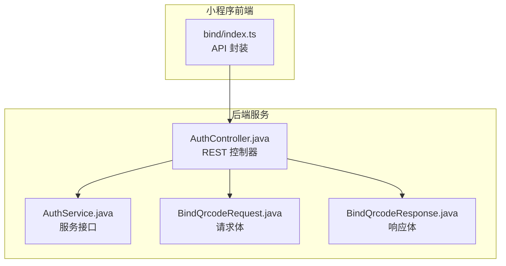
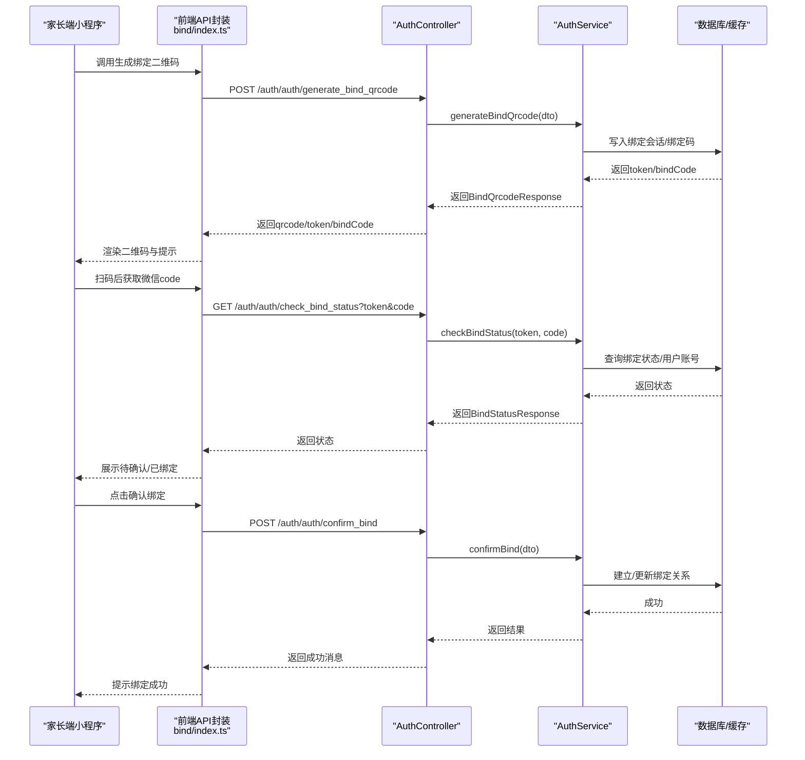
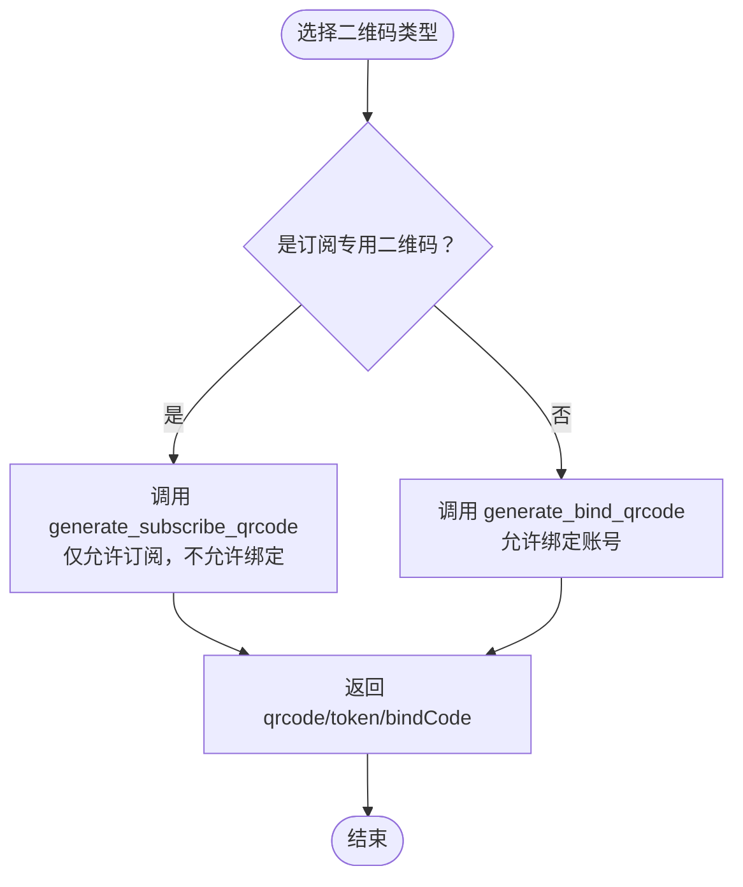
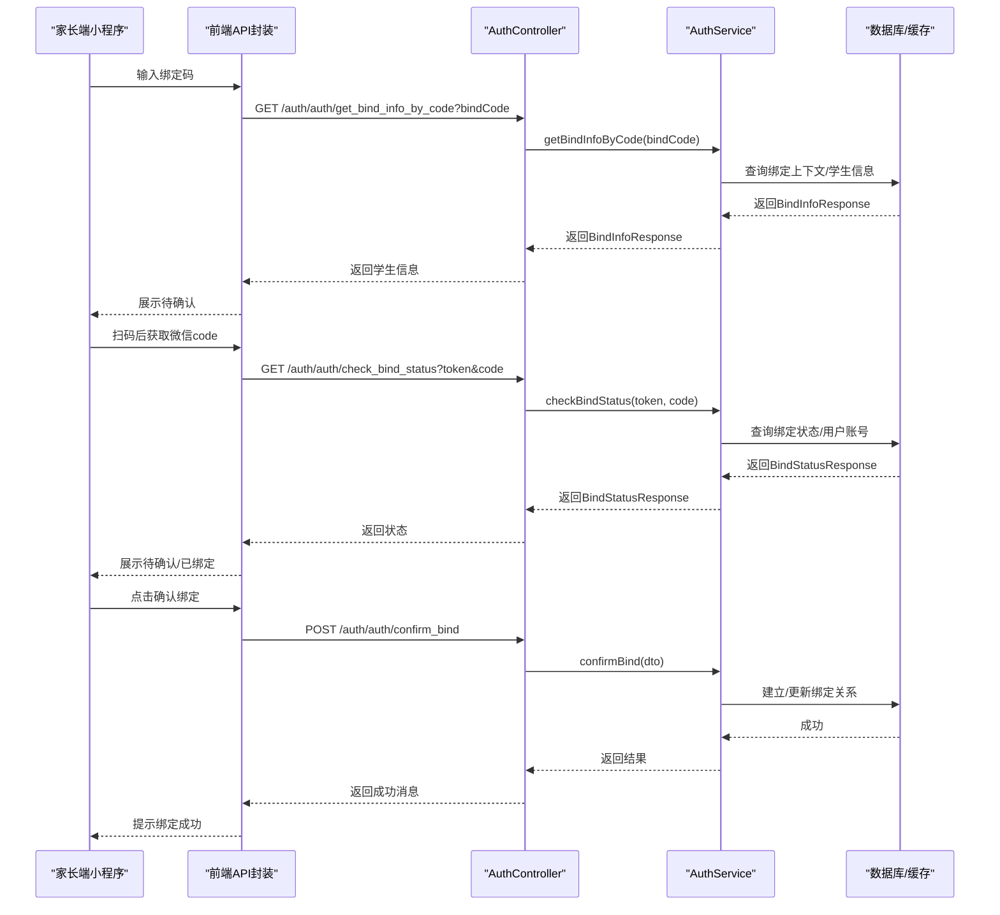
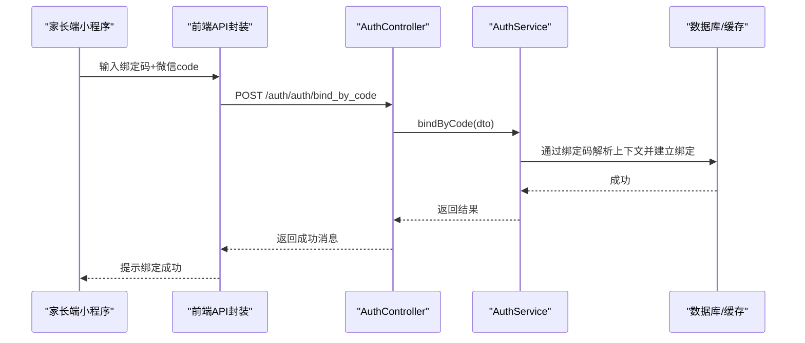
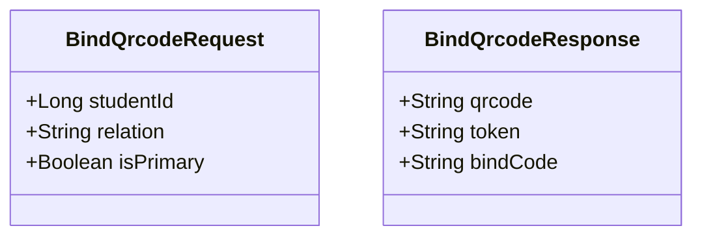
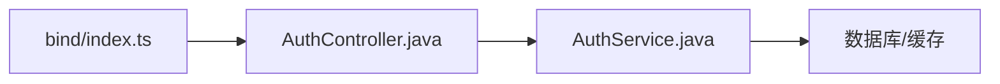

# 绑定二维码系统

<cite>
**本文引用的文件**   
- [AuthController.java](file://class_times_record_back/auth-service/src/main/java/com/shiroko/controller/AuthController.java)
- [AuthService.java](file://class_times_record_back/auth-service/src/main/java/com/shiroko/service/AuthService.java)
- [BindQrcodeRequest.java](file://class_times_record_back/common/src/main/java/com/shiroko/repository/dto/auth/BindQrcodeRequest.java)
- [BindQrcodeResponse.java](file://class_times_record_back/common/src/main/java/com/shiroko/repository/vo/auth/BindQrcodeResponse.java)
- [bind/index.ts](file://class_times_record/src/api/bind/index.ts)
</cite>

## 目录
1. [简介](#简介)
2. [项目结构](#项目结构)
3. [核心组件](#核心组件)
4. [架构总览](#架构总览)
5. [详细组件分析](#详细组件分析)
6. [依赖分析](#依赖分析)
7. [性能考虑](#性能考虑)
8. [故障排查指南](#故障排查指南)
9. [结论](#结论)
10. [附录](#附录)

## 简介
本文件面向“家长端与学生绑定”的完整业务流程，围绕二维码生成、绑定码管理、扫码绑定与手动绑定等路径进行系统化说明。重点解释 generate_bind_qrcode 与 generate_subscribe_qrcode 的区别与使用场景，并梳理绑定状态查询、确认绑定与绑定码验证的核心逻辑。文档同时给出绑定关系建立、更新与维护机制，提供流程图、数据结构设计与并发安全保障建议，以及扩展自定义绑定策略与用户体验优化建议。

## 项目结构
后端采用微服务分层：控制器层暴露 REST API，服务接口定义业务边界；前端（小程序）通过统一请求封装调用后端接口。与绑定相关的关键文件如下：
- 后端控制器：处理绑定相关 HTTP 请求
- 服务接口：定义绑定流程能力
- 请求/响应对象：承载二维码生成参数与返回数据
- 前端 API 封装：聚合绑定相关接口调用

图表来源
- [AuthController.java:92-107](file://class_times_record_back/auth-service/src/main/java/com/shiroko/controller/AuthController.java#L92-L107)
- [AuthService.java:45-53](file://class_times_record_back/auth-service/src/main/java/com/shiroko/service/AuthService.java#L45-L53)
- [BindQrcodeRequest.java:12-17](file://class_times_record_back/common/src/main/java/com/shiroko/repository/dto/auth/BindQrcodeRequest.java#L12-L17)
- [BindQrcodeResponse.java:13-20](file://class_times_record_back/common/src/main/java/com/shiroko/repository/vo/auth/BindQrcodeResponse.java#L13-L20)
- [bind/index.ts:9-24](file://class_times_record/src/api/bind/index.ts#L9-L24)

章节来源
- [AuthController.java:92-107](file://class_times_record_back/auth-service/src/main/java/com/shiroko/controller/AuthController.java#L92-L107)
- [AuthService.java:45-53](file://class_times_record_back/auth-service/src/main/java/com/shiroko/service/AuthService.java#L45-L53)
- [BindQrcodeRequest.java:12-17](file://class_times_record_back/common/src/main/java/com/shiroko/repository/dto/auth/BindQrcodeRequest.java#L12-L17)
- [BindQrcodeResponse.java:13-20](file://class_times_record_back/common/src/main/java/com/shiroko/repository/vo/auth/BindQrcodeResponse.java#L13-L20)
- [bind/index.ts:9-24](file://class_times_record/src/api/bind/index.ts#L9-L24)

## 核心组件
- 控制器层（AuthController）
  - 暴露绑定相关 REST 接口：生成绑定二维码、生成订阅专用二维码、查询绑定信息、检查绑定状态、确认绑定、按绑定码绑定、记录订阅授权、查询订阅状态、测试发送订阅消息等。
- 服务接口（AuthService）
  - 定义绑定流程的业务能力：生成二维码、查询绑定信息、校验绑定状态、确认绑定、按码绑定、订阅授权相关操作。
- 请求/响应对象
  - BindQrcodeRequest：包含学生ID、关系、是否主要联系人等上下文信息。
  - BindQrcodeResponse：返回二维码图片 base64、绑定 token、6位绑定码。
- 前端 API 封装（bind/index.ts）
  - 将后端接口封装为函数，供页面调用，包括生成绑定二维码、生成订阅二维码、查询绑定信息、检查绑定状态、确认绑定、按码绑定、订阅授权等。

章节来源
- [AuthController.java:92-146](file://class_times_record_back/auth-service/src/main/java/com/shiroko/controller/AuthController.java#L92-L146)
- [AuthService.java:45-78](file://class_times_record_back/auth-service/src/main/java/com/shiroko/service/AuthService.java#L45-L78)
- [BindQrcodeRequest.java:12-17](file://class_times_record_back/common/src/main/java/com/shiroko/repository/dto/auth/BindQrcodeRequest.java#L12-L17)
- [BindQrcodeResponse.java:13-20](file://class_times_record_back/common/src/main/java/com/shiroko/repository/vo/auth/BindQrcodeResponse.java#L13-L20)
- [bind/index.ts:9-96](file://class_times_record/src/api/bind/index.ts#L9-L96)

## 架构总览
下图展示家长端与学生绑定的端到端交互：从生成二维码到扫码或手动绑定，再到确认绑定与状态查询。

图表来源
- [AuthController.java:92-134](file://class_times_record_back/auth-service/src/main/java/com/shiroko/controller/AuthController.java#L92-L134)
- [AuthService.java:45-68](file://class_times_record_back/auth-service/src/main/java/com/shiroko/service/AuthService.java#L45-L68)
- [bind/index.ts:9-59](file://class_times_record/src/api/bind/index.ts#L9-L59)

## 详细组件分析

### 二维码生成接口对比：generate_bind_qrcode vs generate_subscribe_qrcode
- 共同点
  - 均接收 BindQrcodeRequest（studentId、relation、isPrimary），用于在绑定上下文中携带学生信息与关系标识。
  - 均返回 BindQrcodeResponse（qrcode、token、bindCode），其中 qrcode 为图片 base64，token 作为二维码场景参数，bindCode 为家长可手动输入的6位码。
- 差异点
  - generate_bind_qrcode：用于常规绑定流程，家长扫码后可完成账号绑定。
  - generate_subscribe_qrcode：仅用于订阅消息授权，家长扫码只能订阅通知，不能绑定账号。该接口由控制器注释明确其用途。

图表来源
- [AuthController.java:92-107](file://class_times_record_back/auth-service/src/main/java/com/shiroko/controller/AuthController.java#L92-L107)
- [AuthService.java:45-53](file://class_times_record_back/auth-service/src/main/java/com/shiroko/service/AuthService.java#L45-L53)
- [BindQrcodeRequest.java:12-17](file://class_times_record_back/common/src/main/java/com/shiroko/repository/dto/auth/BindQrcodeRequest.java#L12-L17)
- [BindQrcodeResponse.java:13-20](file://class_times_record_back/common/src/main/java/com/shiroko/repository/vo/auth/BindQrcodeResponse.java#L13-L20)

章节来源
- [AuthController.java:92-107](file://class_times_record_back/auth-service/src/main/java/com/shiroko/controller/AuthController.java#L92-L107)
- [AuthService.java:45-53](file://class_times_record_back/auth-service/src/main/java/com/shiroko/service/AuthService.java#L45-L53)
- [BindQrcodeRequest.java:12-17](file://class_times_record_back/common/src/main/java/com/shiroko/repository/dto/auth/BindQrcodeRequest.java#L12-L17)
- [BindQrcodeResponse.java:13-20](file://class_times_record_back/common/src/main/java/com/shiroko/repository/vo/auth/BindQrcodeResponse.java#L13-L20)

### 绑定码管理与扫码绑定流程
- 绑定码管理
  - 生成阶段：后端在生成二维码时同时产出 bindCode（6位），便于家长手动输入绑定。
  - 查询阶段：支持通过绑定码查询学生信息（不执行绑定），用于家长确认后再绑定。
- 扫码绑定
  - 家长扫码后，前端携带 token 与微信 code 调用检查绑定状态接口，服务端根据 token 解析绑定上下文并结合微信 openid 判断是否已有账号、是否已绑定。
  - 确认后调用确认绑定接口，建立或更新绑定关系。

图表来源
- [AuthController.java:121-134](file://class_times_record_back/auth-service/src/main/java/com/shiroko/controller/AuthController.java#L121-L134)
- [AuthService.java:55-68](file://class_times_record_back/auth-service/src/main/java/com/shiroko/service/AuthService.java#L55-L68)
- [bind/index.ts:31-59](file://class_times_record/src/api/bind/index.ts#L31-L59)

章节来源
- [AuthController.java:121-134](file://class_times_record_back/auth-service/src/main/java/com/shiroko/controller/AuthController.java#L121-L134)
- [AuthService.java:55-68](file://class_times_record_back/auth-service/src/main/java/com/shiroko/service/AuthService.java#L55-L68)
- [bind/index.ts:31-59](file://class_times_record/src/api/bind/index.ts#L31-L59)

### 手动绑定流程（按绑定码绑定）
- 家长手动输入6位绑定码，无需扫码。
- 前端调用 bind_by_code 接口，后端通过绑定码查找绑定上下文并完成绑定，逻辑与 confirmBind 一致但入口不同。

图表来源
- [AuthController.java:143-146](file://class_times_record_back/auth-service/src/main/java/com/shiroko/controller/AuthController.java#L143-L146)
- [AuthService.java:70-78](file://class_times_record_back/auth-service/src/main/java/com/shiroko/service/AuthService.java#L70-L78)
- [bind/index.ts:87-96](file://class_times_record/src/api/bind/index.ts#L87-L96)

章节来源
- [AuthController.java:143-146](file://class_times_record_back/auth-service/src/main/java/com/shiroko/controller/AuthController.java#L143-L146)
- [AuthService.java:70-78](file://class_times_record_back/auth-service/src/main/java/com/shiroko/service/AuthService.java#L70-L78)
- [bind/index.ts:87-96](file://class_times_record/src/api/bind/index.ts#L87-L96)

### 数据结构设计
- 请求对象：BindQrcodeRequest
  - studentId：学生ID
  - relation：与家长的关系标识
  - isPrimary：是否为主要联系人
- 响应对象：BindQrcodeResponse
  - qrcode：二维码图片 base64
  - token：绑定 token（二维码场景参数）
  - bindCode：6位绑定码，用于手动输入绑定

图表来源
- [BindQrcodeRequest.java:12-17](file://class_times_record_back/common/src/main/java/com/shiroko/repository/dto/auth/BindQrcodeRequest.java#L12-L17)
- [BindQrcodeResponse.java:13-20](file://class_times_record_back/common/src/main/java/com/shiroko/repository/vo/auth/BindQrcodeResponse.java#L13-L20)

章节来源
- [BindQrcodeRequest.java:12-17](file://class_times_record_back/common/src/main/java/com/shiroko/repository/dto/auth/BindQrcodeRequest.java#L12-L17)
- [BindQrcodeResponse.java:13-20](file://class_times_record_back/common/src/main/java/com/shiroko/repository/vo/auth/BindQrcodeResponse.java#L13-L20)

### 并发安全与幂等性建议
- 绑定码唯一性与防重放
  - 绑定码应全局唯一且具备有效期；同一绑定码在同一有效期内仅能成功绑定一次。
  - 建议在数据库层面增加唯一索引与状态字段，确保并发下只有一条记录被成功更新。
- Token 生命周期与一次性使用
  - 绑定 token 作为二维码场景参数，应在首次确认绑定后失效，防止重复提交。
- 幂等键设计
  - 以 (bindCode, wx_openid) 或 (token, wx_openid) 作为幂等键，避免重复绑定导致的数据不一致。
- 分布式锁
  - 在高并发场景下，对“确认绑定”关键路径加锁，保证原子性。
- 事务与回滚
  - 绑定关系的建立与更新应在事务中执行，失败时回滚，保证一致性。

[本节为通用建议，不涉及具体文件]

## 依赖分析
- 控制器与服务
  - AuthController 依赖 AuthService 实现绑定相关业务能力。
- 前后端契约
  - 前端 bind/index.ts 直接映射后端 REST 接口，形成稳定的契约。
- 外部依赖
  - 微信登录 code 用于换取 openid，参与绑定状态判定与订阅授权。

图表来源
- [bind/index.ts:9-96](file://class_times_record/src/api/bind/index.ts#L9-L96)
- [AuthController.java:92-146](file://class_times_record_back/auth-service/src/main/java/com/shiroko/controller/AuthController.java#L92-L146)
- [AuthService.java:45-78](file://class_times_record_back/auth-service/src/main/java/com/shiroko/service/AuthService.java#L45-L78)

章节来源
- [bind/index.ts:9-96](file://class_times_record/src/api/bind/index.ts#L9-L96)
- [AuthController.java:92-146](file://class_times_record_back/auth-service/src/main/java/com/shiroko/controller/AuthController.java#L92-L146)
- [AuthService.java:45-78](file://class_times_record_back/auth-service/src/main/java/com/shiroko/service/AuthService.java#L45-L78)

## 性能考虑
- 二维码生成
  - 建议异步生成二维码图片并缓存，减少实时计算开销。
- 绑定码查询
  - 高频读取绑定码对应的学生信息，建议使用缓存加速。
- 状态检查
  - check_bind_status 涉及微信 code 换 openid 与绑定上下文查询，需控制超时与重试策略。
- 批量绑定
  - 若出现批量导入或批量绑定场景，建议分批提交与限流，避免数据库压力过大。

[本节为通用建议，不涉及具体文件]

## 故障排查指南
- 常见问题定位
  - 二维码无效：检查 token 是否过期、二维码是否被篡改。
  - 绑定码错误：确认 bindCode 是否为6位且未过期。
  - 绑定状态异常：核对微信 code 是否有效、openid 是否正确、是否存在重复绑定。
- 日志与监控
  - 在确认绑定关键路径输出必要上下文（token、bindCode、wx_openid、studentId），便于问题追踪。
- 重试与补偿
  - 网络抖动导致的绑定失败，建议前端友好提示并提供重试入口；后端提供幂等保障。

[本节为通用建议，不涉及具体文件]

## 结论
本系统通过“生成二维码—扫码/手动绑定—状态查询—确认绑定”的闭环流程，实现了家长端与学生的高效绑定。generate_bind_qrcode 与 generate_subscribe_qrcode 在权限与用途上做了清晰区分，满足“绑定账号”和“仅订阅通知”两类场景。结合绑定码管理、状态查询与确认绑定，系统在易用性与安全性之间取得平衡。建议在生产环境完善并发安全、幂等与缓存策略，以提升稳定性与性能。

[本节为总结，不涉及具体文件]

## 附录
- 扩展指南：自定义绑定策略
  - 在 AuthService 新增方法以支持新的绑定策略（如企业微信、短信验证码等）。
  - 在 AuthController 新增对应接口，保持与前端契约一致。
  - 在 BindQrcodeRequest/BindQrcodeResponse 中扩展字段以承载新策略所需上下文。
- 用户体验优化建议
  - 在生成二维码时显示倒计时与刷新按钮，提升可用性。
  - 在绑定码输入界面提供格式校验与错误提示。
  - 在确认绑定前展示学生基本信息，增强信任感。

[本节为通用建议，不涉及具体文件]