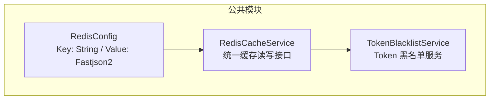
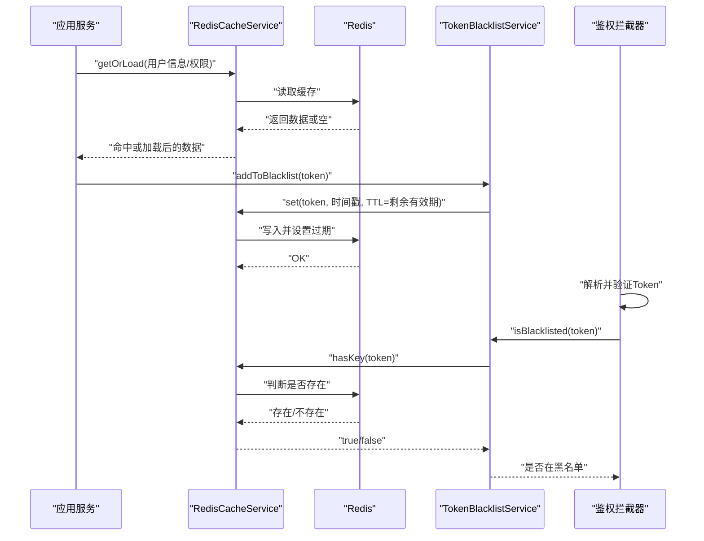
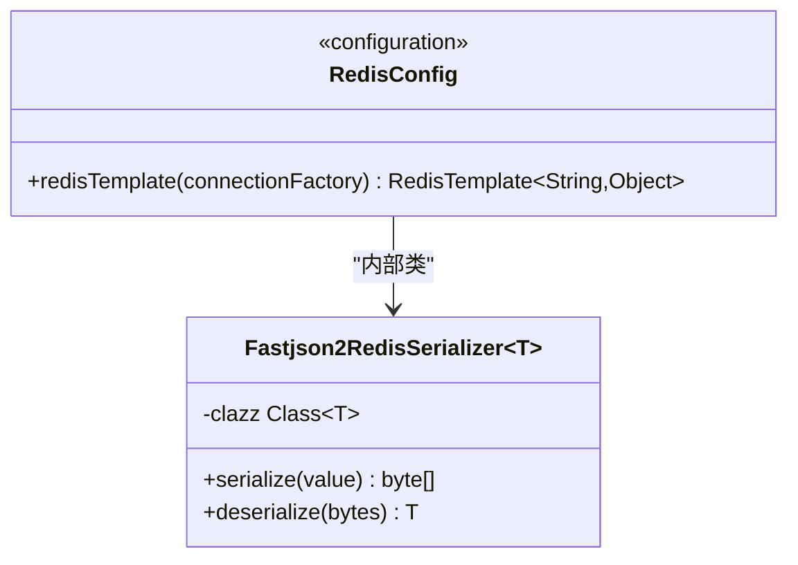
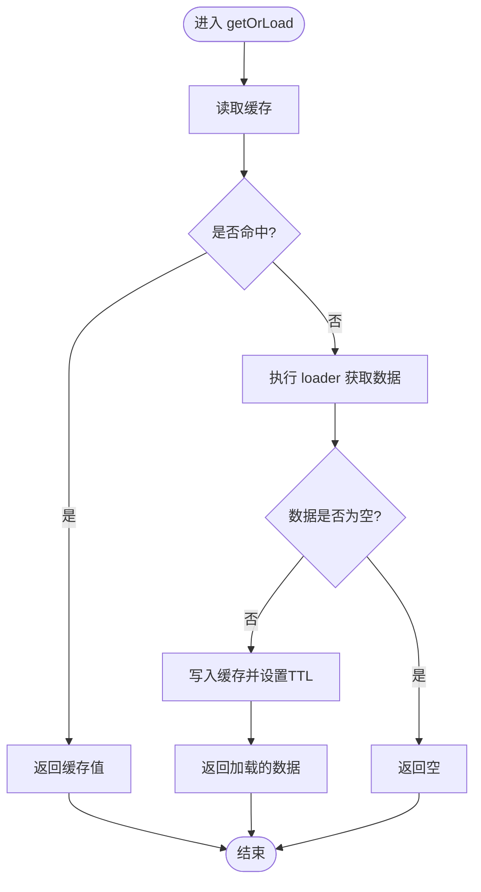
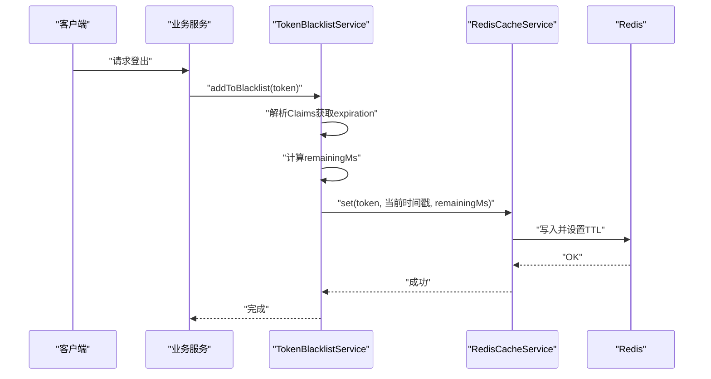
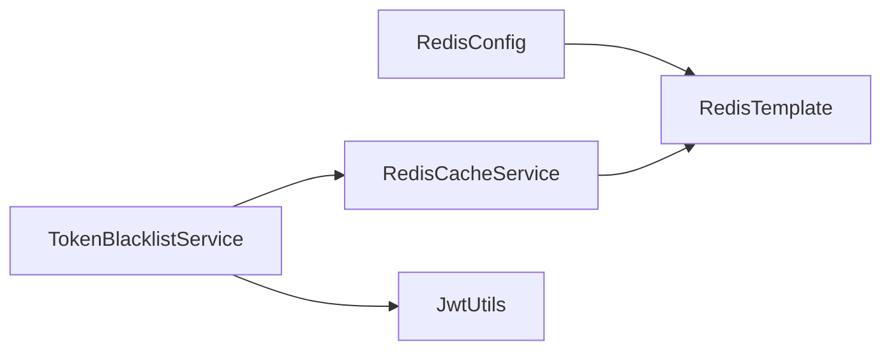

# 缓存策略与Token管理

<cite>
**本文引用的文件**   
- [RedisConfig.java](file://class_times_record_back/common/src/main/java/com/shiroko/config/RedisConfig.java)
- [RedisCacheService.java](file://class_times_record_back/common/src/main/java/com/shiroko/service/cache/RedisCacheService.java)
- [TokenBlacklistService.java](file://class_times_record_back/common/src/main/java/com/shiroko/service/cache/TokenBlacklistService.java)
</cite>

## 目录
1. [简介](#简介)
2. [项目结构](#项目结构)
3. [核心组件](#核心组件)
4. [架构总览](#架构总览)
5. [详细组件分析](#详细组件分析)
6. [依赖关系分析](#依赖关系分析)
7. [性能考量](#性能考量)
8. [故障排查指南](#故障排查指南)
9. [结论](#结论)
10. [附录](#附录)

## 简介
本文件围绕认证系统中的缓存策略与 Token 管理进行系统化说明，重点覆盖：
- Redis 在认证系统中的缓存策略设计（用户信息、权限数据、验证码等）
- Token 黑名单机制的实现原理（失效管理、分布式锁处理、内存泄漏防护）
- 绑定 Token 的临时存储机制与过期清理策略
- 缓存穿透、雪崩、热点数据的防护方案
- 缓存数据结构设计、序列化策略与监控指标
- 面向开发者的缓存优化与故障排查指南

## 项目结构
后端公共模块中提供了统一的 Redis 配置与缓存服务封装，以及基于 Redis 的 Token 黑名单服务。关键位置如下：
- Redis 配置与序列化：RedisConfig
- 统一缓存读写封装：RedisCacheService
- Token 黑名单服务：TokenBlacklistService

图表来源
- [RedisConfig.java:1-90](file://class_times_record_back/common/src/main/java/com/shiroko/config/RedisConfig.java#L1-L90)
- [RedisCacheService.java:1-158](file://class_times_record_back/common/src/main/java/com/shiroko/service/cache/RedisCacheService.java#L1-L158)
- [TokenBlacklistService.java:1-76](file://class_times_record_back/common/src/main/java/com/shiroko/service/cache/TokenBlacklistService.java#L1-L76)

章节来源
- [RedisConfig.java:1-90](file://class_times_record_back/common/src/main/java/com/shiroko/config/RedisConfig.java#L1-L90)
- [RedisCacheService.java:1-158](file://class_times_record_back/common/src/main/java/com/shiroko/service/cache/RedisCacheService.java#L1-L158)
- [TokenBlacklistService.java:1-76](file://class_times_record_back/common/src/main/java/com/shiroko/service/cache/TokenBlacklistService.java#L1-L76)

## 核心组件
- Redis 配置与序列化
  - Key 使用 String 序列化器，Value 使用自定义 Fastjson2 序列化器，支持 null 写入与 Map 键排序，保证与签名逻辑一致。
  - 提供可复用的 RedisTemplate Bean，供业务层直接使用或进一步封装。
- 统一缓存服务
  - 提供 get/set/getOrLoad/delete/setIfAbsent/hasKey 等常用操作，统一 key 前缀 cr:，降低业务直接操作 RedisTemplate 的复杂度。
  - getOrLoad 实现 Cache-Aside 模式，适用于读多写少的场景（如用户信息、菜单、权限等）。
- Token 黑名单服务
  - 将登出的 Token 加入 Redis，TTL 为 Token 剩余有效期，自动过期清理，避免内存泄漏。
  - 提供 isBlacklisted 方法用于二次校验拦截。

章节来源
- [RedisConfig.java:25-54](file://class_times_record_back/common/src/main/java/com/shiroko/config/RedisConfig.java#L25-L54)
- [RedisConfig.java:62-88](file://class_times_record_back/common/src/main/java/com/shiroko/config/RedisConfig.java#L62-L88)
- [RedisCacheService.java:24-158](file://class_times_record_back/common/src/main/java/com/shiroko/service/cache/RedisCacheService.java#L24-L158)
- [TokenBlacklistService.java:28-76](file://class_times_record_back/common/src/main/java/com/shiroko/service/cache/TokenBlacklistService.java#L28-L76)

## 架构总览
下图展示了认证相关缓存与 Token 管理的整体交互：应用通过统一缓存服务访问 Redis；登录成功后签发 Token，并在需要时将其加入黑名单；鉴权拦截器在解析 Token 后调用黑名单服务做二次检查。

图表来源
- [RedisCacheService.java:98-122](file://class_times_record_back/common/src/main/java/com/shiroko/service/cache/RedisCacheService.java#L98-L122)
- [TokenBlacklistService.java:48-63](file://class_times_record_back/common/src/main/java/com/shiroko/service/cache/TokenBlacklistService.java#L48-L63)
- [TokenBlacklistService.java:72-74](file://class_times_record_back/common/src/main/java/com/shiroko/service/cache/TokenBlacklistService.java#L72-L74)

## 详细组件分析

### 组件一：Redis 配置与序列化
- 设计要点
  - Key/HashKey 使用 String 序列化器，便于调试与跨语言兼容。
  - Value/HashValue 使用 Fastjson2 序列化器，开启 WriteNulls 与 SortMapEntriesByKeys，确保反序列化稳定且与签名算法一致。
  - 连接池参数由 spring.data.redis.lettuce.pool 控制（外部配置）。
- 复杂度与影响
  - 序列化开销取决于对象大小与字段数量；建议对热点大对象进行分片或裁剪。
  - 字符串 Key 可读性好，但需注意命名规范与前缀隔离。

图表来源
- [RedisConfig.java:37-54](file://class_times_record_back/common/src/main/java/com/shiroko/config/RedisConfig.java#L37-L54)
- [RedisConfig.java:62-88](file://class_times_record_back/common/src/main/java/com/shiroko/config/RedisConfig.java#L62-L88)

章节来源
- [RedisConfig.java:1-90](file://class_times_record_back/common/src/main/java/com/shiroko/config/RedisConfig.java#L1-L90)

### 组件二：统一缓存服务（RedisCacheService）
- 能力概览
  - 基础读写：get/set/delete/hasKey
  - 带过期时间的 set(key, value, timeout, unit)
  - Cache-Aside 模式：getOrLoad(key, clazz, loader, timeout, unit)
  - 原子性操作：setIfAbsent(key, value, timeout, unit)，可用于防重放、分布式锁等
- 典型用法
  - 用户信息缓存：以 userId 为维度，结合短 TTL 与主动失效策略
  - 权限数据缓存：以角色/资源为维度，配合事件或定时刷新
  - 验证码缓存：短 TTL + setIfAbsent 防重放
- 类型转换与健壮性
  - get(key, clazz) 在值类型不匹配时尝试二次转换，失败记录告警日志并返回 null，避免异常传播。

图表来源
- [RedisCacheService.java:98-122](file://class_times_record_back/common/src/main/java/com/shiroko/service/cache/RedisCacheService.java#L98-L122)

章节来源
- [RedisCacheService.java:24-158](file://class_times_record_back/common/src/main/java/com/shiroko/service/cache/RedisCacheService.java#L24-L158)

### 组件三：Token 黑名单服务（TokenBlacklistService）
- 设计目标
  - 解决 JWT 不可撤销问题：通过 Redis 黑名单实现“主动失效”
  - 自动清理：TTL 设置为 Token 剩余有效期，避免长期占用内存
- 键空间设计
  - Key 前缀：token:blacklist:
  - Key 示例：cr:token:blacklist:{token}
  - Value：登出时间戳
  - TTL：Token 剩余有效期（毫秒）
- 流程说明
  - 登出时：解析 Token 获取过期时间，计算剩余毫秒数，写入黑名单并设置 TTL
  - 鉴权时：先解析并校验 Token，再查询是否在黑名单中，若在则拒绝

图表来源
- [TokenBlacklistService.java:48-63](file://class_times_record_back/common/src/main/java/com/shiroko/service/cache/TokenBlacklistService.java#L48-L63)
- [RedisCacheService.java:93-95](file://class_times_record_back/common/src/main/java/com/shiroko/service/cache/RedisCacheService.java#L93-L95)

章节来源
- [TokenBlacklistService.java:28-76](file://class_times_record_back/common/src/main/java/com/shiroko/service/cache/TokenBlacklistService.java#L28-L76)

## 依赖关系分析
- 组件耦合
  - TokenBlacklistService 依赖 RedisCacheService 与 JwtUtils（后者用于解析 Claims）
  - RedisCacheService 依赖 Spring 提供的 RedisTemplate
  - RedisConfig 提供 RedisTemplate Bean 与自定义序列化器
- 外部依赖
  - Redis（Lettuce 连接池由外部配置）
  - Fastjson2（序列化/反序列化）
  - JJWT（Claims 解析）

图表来源
- [RedisConfig.java:37-54](file://class_times_record_back/common/src/main/java/com/shiroko/config/RedisConfig.java#L37-L54)
- [RedisCacheService.java:24-35](file://class_times_record_back/common/src/main/java/com/shiroko/service/cache/RedisCacheService.java#L24-L35)
- [TokenBlacklistService.java:28-36](file://class_times_record_back/common/src/main/java/com/shiroko/service/cache/TokenBlacklistService.java#L28-L36)

章节来源
- [RedisConfig.java:1-90](file://class_times_record_back/common/src/main/java/com/shiroko/config/RedisConfig.java#L1-L90)
- [RedisCacheService.java:1-158](file://class_times_record_back/common/src/main/java/com/shiroko/service/cache/RedisCacheService.java#L1-L158)
- [TokenBlacklistService.java:1-76](file://class_times_record_back/common/src/main/java/com/shiroko/service/cache/TokenBlacklistService.java#L1-L76)

## 性能考量
- 序列化与网络
  - 大对象序列化成本高，建议拆分热点字段、减少冗余字段
  - 合理设置 TTL，避免频繁重建缓存
- 并发与一致性
  - 使用 setIfAbsent 实现幂等与防重放
  - 对于强一致场景，采用“先更新数据库，再删除缓存”的策略，必要时加分布式锁
- 容量与内存
  - 黑名单 TTL 等于 Token 剩余有效期，天然防止内存泄漏
  - 定期统计 Redis 键数量与内存使用，评估是否需要扩容或分库分片

[本节为通用指导，无需源码引用]

## 故障排查指南
- 常见问题定位
  - 缓存未命中：检查 key 前缀与命名规范；确认 getOrLoad 的 loader 是否正确
  - 类型转换失败：关注日志中的“缓存类型转换失败”，核对实际存储结构与期望类型
  - Token 无法失效：确认 addToBlacklist 是否被调用、TTL 是否为正数、Redis 是否可达
- 诊断步骤
  - 查看 Redis 中对应 key 是否存在及 TTL 是否合理
  - 检查鉴权链路：解析 Token 是否成功、黑名单查询是否返回 true
  - 观察日志：序列化/反序列化异常、连接超时、重试次数等
- 恢复建议
  - 清理异常 key 或重置 TTL
  - 针对热点数据增加本地缓存或降级策略
  - 对高并发场景引入限流与熔断

章节来源
- [RedisCacheService.java:65-73](file://class_times_record_back/common/src/main/java/com/shiroko/service/cache/RedisCacheService.java#L65-L73)
- [TokenBlacklistService.java:60-63](file://class_times_record_back/common/src/main/java/com/shiroko/service/cache/TokenBlacklistService.java#L60-L63)

## 结论
本项目通过统一的 Redis 配置与缓存服务封装，结合 Token 黑名单机制，构建了可扩展、易维护的认证缓存体系。Fastjson2 序列化保证了对象稳定性与兼容性；基于 TTL 的黑名单设计有效避免了内存泄漏。建议在业务侧遵循统一的 key 命名规范、合理的 TTL 策略与完善的监控指标，进一步提升系统可靠性与可观测性。

[本节为总结性内容，无需源码引用]

## 附录

### 缓存数据结构设计建议
- 用户信息缓存
  - Key 前缀：cr:user:info:{userId}
  - 值：用户基本信息（JSON）
  - TTL：较短（如 5-15 分钟），配合变更事件主动失效
- 权限数据缓存
  - Key 前缀：cr:auth:perms:{role}:{resource}
  - 值：权限标识集合（JSON 数组）
  - TTL：中等（如 30-60 分钟），配合后台发布事件刷新
- 验证码缓存
  - Key 前缀：cr:code:login:{phoneOrEmail}
  - 值：验证码明文或哈希
  - TTL：极短（如 1-5 分钟），并使用 setIfAbsent 防重放
- Token 黑名单
  - Key 前缀：cr:token:blacklist:{token}
  - 值：登出时间戳
  - TTL：Token 剩余有效期

[本节为概念性设计，无需源码引用]

### 序列化策略
- Key：String（UTF-8）
- Value：Fastjson2 JSON（WriteNulls、SortMapEntriesByKeys）
- 注意：保持前后端签名与序列化顺序一致，避免校验失败

章节来源
- [RedisConfig.java:42-50](file://class_times_record_back/common/src/main/java/com/shiroko/config/RedisConfig.java#L42-L50)
- [RedisConfig.java:70-78](file://class_times_record_back/common/src/main/java/com/shiroko/config/RedisConfig.java#L70-L78)

### 监控指标建议
- 命中率：缓存命中次数 / 总请求次数
- 延迟：P95/P99 缓存读写耗时
- 错误率：序列化/反序列化异常、连接异常
- 容量：key 总数、内存使用量、TTL 分布
- 黑名单：新增/过期数量、命中率

[本节为通用建议，无需源码引用]