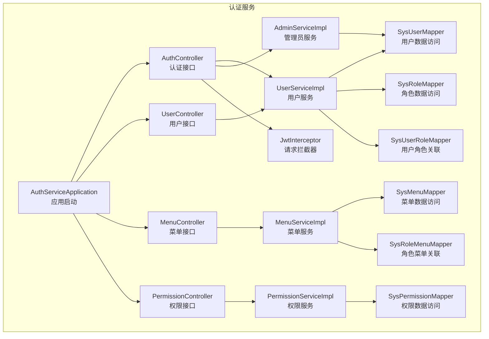
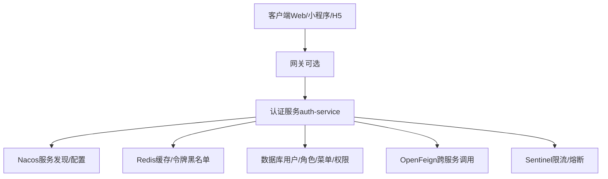
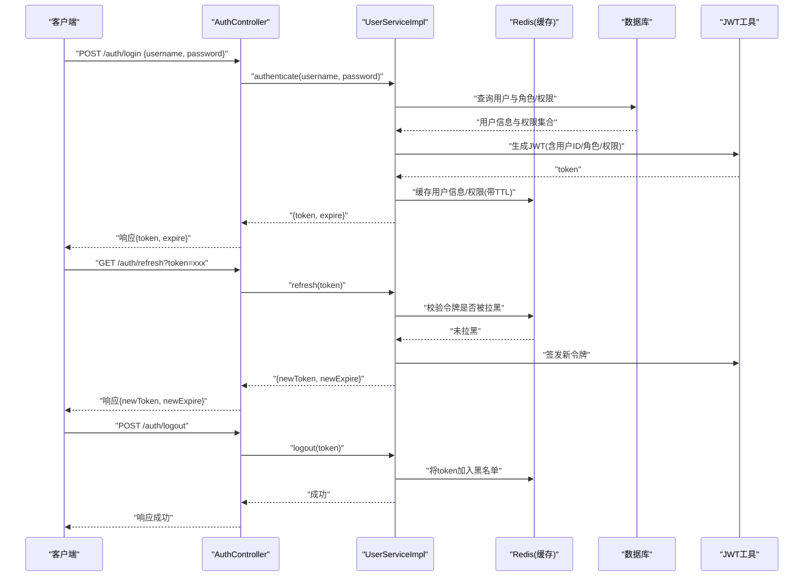
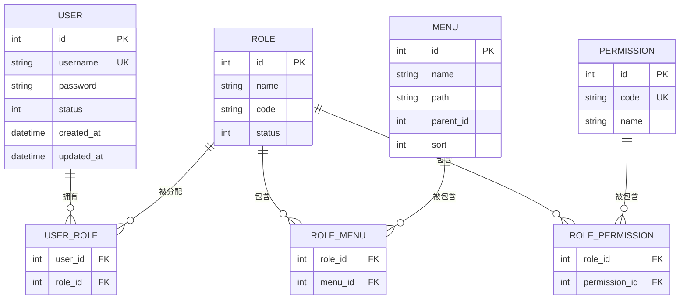
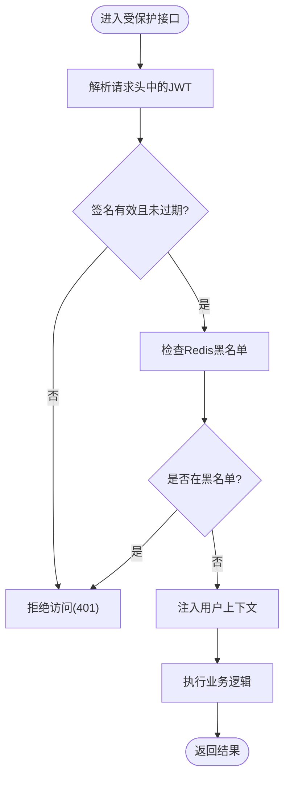
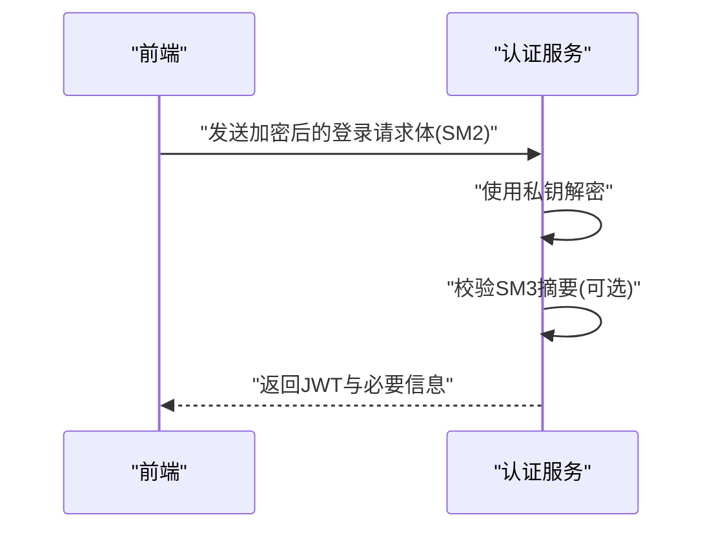
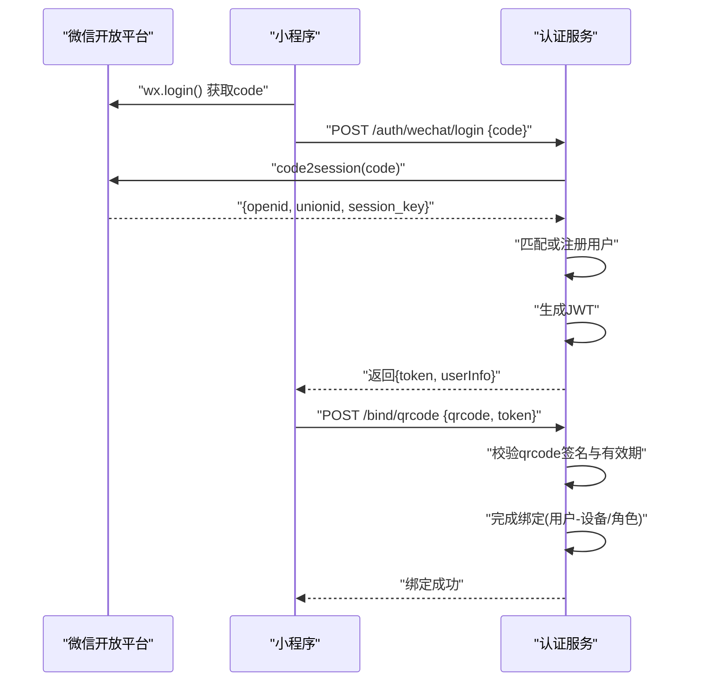
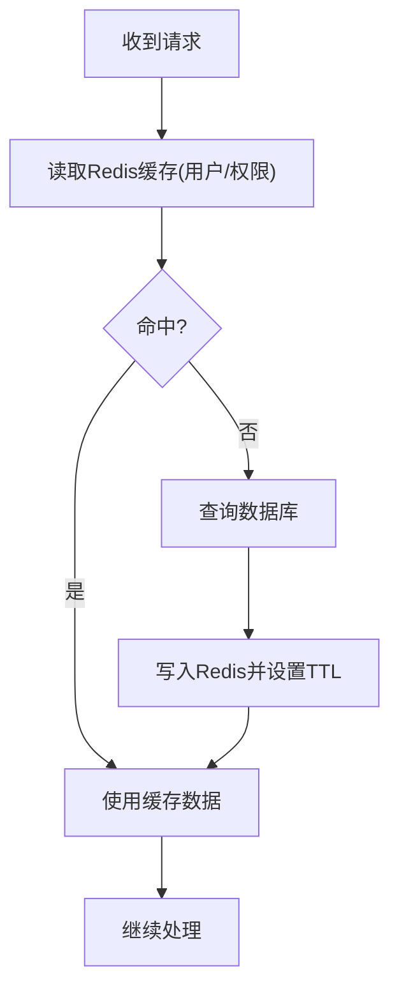
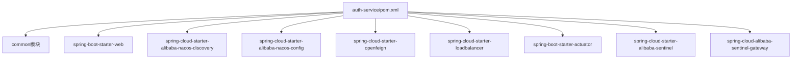

# 认证服务 (auth-service)

<cite>
**本文引用的文件**   
- [pom.xml](file://class_times_record_back/auth-service/pom.xml)
- [AuthServiceApplication.java](file://class_times_record_back/auth-service/src/main/java/com/shiroko/AuthServiceApplication.java)
- [application.yml](file://class_times_record_back/auth-service/src/main/resources/application.yml)
- [application-dev.yml](file://class_times_record_back/auth-service/src/main/resources/application-dev.yml)
- [AuthController.java](file://class_times_record_back/auth-service/src/main/java/com/shiroko/controller/AuthController.java)
- [UserController.java](file://class_times_record_back/auth-service/src/main/java/com/shiroko/controller/UserController.java)
- [MenuController.java](file://class_times_record_back/auth-service/src/main/java/com/shiroko/controller/MenuController.java)
- [PermissionController.java](file://class_times_record_back/auth-service/src/main/java/com/shiroko/controller/PermissionController.java)
- [JwtInterceptor.java](file://class_times_record_back/auth-service/src/main/java/com/shiroko/interceptor/JwtInterceptor.java)
- [UserServiceImpl.java](file://class_times_record_back/auth-service/src/main/java/com/shiroko/service/UserServiceImpl.java)
- [AdminServiceImpl.java](file://class_times_record_back/auth-service/src/main/java/com/shiroko/service/AdminServiceImpl.java)
- [MenuServiceImpl.java](file://class_times_record_back/auth-service/src/main/java/com/shiroko/service/MenuServiceImpl.java)
- [PermissionServiceImpl.java](file://class_times_record_back/auth-service/src/main/java/com/shiroko/service/PermissionServiceImpl.java)
- [SysUserMapper.java](file://class_times_record_back/auth-service/src/main/java/com/shiroko/mapper/SysUserMapper.java)
- [SysRoleMapper.java](file://class_times_record_back/auth-service/src/main/java/com/shiroko/mapper/SysRoleMapper.java)
- [SysMenuMapper.java](file://class_times_record_back/auth-service/src/main/java/com/shiroko/mapper/SysMenuMapper.java)
- [SysUserRoleMapper.java](file://class_times_record_back/auth-service/src/main/java/com/shiroko/mapper/SysUserRoleMapper.java)
- [SysRoleMenuMapper.java](file://class_times_record_back/auth-service/src/main/java/com/shiroko/mapper/SysRoleMenuMapper.java)
- [SysPermissionMapper.java](file://class_times_record_back/auth-service/src/main/java/com/shiroko/mapper/SysPermissionMapper.java)
- [nacos-common-redis.yaml](file://class_times_record_back/docs/nacos-common-redis.yaml)
</cite>

## 目录
1. [简介](#简介)
2. [项目结构](#项目结构)
3. [核心组件](#核心组件)
4. [架构总览](#架构总览)
5. [详细组件分析](#详细组件分析)
6. [依赖分析](#依赖分析)
7. [性能考虑](#性能考虑)
8. [故障排查指南](#故障排查指南)
9. [结论](#结论)
10. [附录](#附录)

## 简介
本文件面向开发者，系统化阐述认证服务（auth-service）的完整实现与扩展方式。内容覆盖：
- 用户认证授权体系：登录注册、JWT令牌管理、国密算法集成（SM2/SM3）、权限控制模型（RBAC）、会话管理策略
- 微信生态集成方案：小程序登录、二维码绑定等流程设计
- 缓存策略：基于Redis的令牌与权限缓存
- 认证流程图与API调用示例
- 自定义认证逻辑扩展指南与安全最佳实践

## 项目结构
认证服务采用Spring Boot微服务形态，通过Nacos完成服务发现与配置中心接入，使用OpenFeign进行跨服务调用，并引入Sentinel作为限流熔断组件。模块职责如下：
- 启动类：应用入口与基础配置加载
- 控制器层：暴露认证、用户、菜单、权限相关接口
- 拦截器：统一鉴权校验（如JWT解析与上下文注入）
- 服务层：业务编排（用户、管理员、菜单、权限）
- 数据访问层：MyBatis Mapper映射到数据库表
- 资源文件：应用配置与环境差异化配置

图表来源
- [AuthServiceApplication.java](file://class_times_record_back/auth-service/src/main/java/com/shiroko/AuthServiceApplication.java)
- [AuthController.java](file://class_times_record_back/auth-service/src/main/java/com/shiroko/controller/AuthController.java)
- [UserController.java](file://class_times_record_back/auth-service/src/main/java/com/shiroko/controller/UserController.java)
- [MenuController.java](file://class_times_record_back/auth-service/src/main/java/com/shiroko/controller/MenuController.java)
- [PermissionController.java](file://class_times_record_back/auth-service/src/main/java/com/shiroko/controller/PermissionController.java)
- [JwtInterceptor.java](file://class_times_record_back/auth-service/src/main/java/com/shiroko/interceptor/JwtInterceptor.java)
- [UserServiceImpl.java](file://class_times_record_back/auth-service/src/main/java/com/shiroko/service/UserServiceImpl.java)
- [AdminServiceImpl.java](file://class_times_record_back/auth-service/src/main/java/com/shiroko/service/AdminServiceImpl.java)
- [MenuServiceImpl.java](file://class_times_record_back/auth-service/src/main/java/com/shiroko/service/MenuServiceImpl.java)
- [PermissionServiceImpl.java](file://class_times_record_back/auth-service/src/main/java/com/shiroko/service/PermissionServiceImpl.java)
- [SysUserMapper.java](file://class_times_record_back/auth-service/src/main/java/com/shiroko/mapper/SysUserMapper.java)
- [SysRoleMapper.java](file://class_times_record_back/auth-service/src/main/java/com/shiroko/mapper/SysRoleMapper.java)
- [SysMenuMapper.java](file://class_times_record_back/auth-service/src/main/java/com/shiroko/mapper/SysMenuMapper.java)
- [SysUserRoleMapper.java](file://class_times_record_back/auth-service/src/main/java/com/shiroko/mapper/SysUserRoleMapper.java)
- [SysRoleMenuMapper.java](file://class_times_record_back/auth-service/src/main/java/com/shiroko/mapper/SysRoleMenuMapper.java)
- [SysPermissionMapper.java](file://class_times_record_back/auth-service/src/main/java/com/shiroko/mapper/SysPermissionMapper.java)

章节来源
- [pom.xml:1-80](file://class_times_record_back/auth-service/pom.xml#L1-L80)
- [AuthServiceApplication.java](file://class_times_record_back/auth-service/src/main/java/com/shiroko/AuthServiceApplication.java)
- [application.yml](file://class_times_record_back/auth-service/src/main/resources/application.yml)
- [application-dev.yml](file://class_times_record_back/auth-service/src/main/resources/application-dev.yml)

## 核心组件
- 认证控制器（AuthController）：提供登录、注册、刷新令牌、退出等接口；对接用户服务与管理员服务
- 用户控制器（UserController）：用户信息查询、修改、密码重置等
- 菜单控制器（MenuController）：菜单树查询、按角色过滤
- 权限控制器（PermissionController）：权限点查询、按用户或角色聚合
- JWT拦截器（JwtInterceptor）：解析请求头中的令牌，校验签名与有效期，注入当前用户上下文
- 用户服务（UserServiceImpl）：封装用户认证、密码校验、角色与权限加载、令牌生成与刷新
- 管理员服务（AdminServiceImpl）：管理员账号认证与权限加载
- 菜单服务（MenuServiceImpl）：菜单数据组装与缓存
- 权限服务（PermissionServiceImpl）：权限点计算与缓存
- 数据访问层（Sys*Mapper）：用户、角色、菜单、权限及其关联表的CRUD与查询

章节来源
- [AuthController.java](file://class_times_record_back/auth-service/src/main/java/com/shiroko/controller/AuthController.java)
- [UserController.java](file://class_times_record_back/auth-service/src/main/java/com/shiroko/controller/UserController.java)
- [MenuController.java](file://class_times_record_back/auth-service/src/main/java/com/shiroko/controller/MenuController.java)
- [PermissionController.java](file://class_times_record_back/auth-service/src/main/java/com/shiroko/controller/PermissionController.java)
- [JwtInterceptor.java](file://class_times_record_back/auth-service/src/main/java/com/shiroko/interceptor/JwtInterceptor.java)
- [UserServiceImpl.java](file://class_times_record_back/auth-service/src/main/java/com/shiroko/service/UserServiceImpl.java)
- [AdminServiceImpl.java](file://class_times_record_back/auth-service/src/main/java/com/shiroko/service/AdminServiceImpl.java)
- [MenuServiceImpl.java](file://class_times_record_back/auth-service/src/main/java/com/shiroko/service/MenuServiceImpl.java)
- [PermissionServiceImpl.java](file://class_times_record_back/auth-service/src/main/java/com/shiroko/service/PermissionServiceImpl.java)
- [SysUserMapper.java](file://class_times_record_back/auth-service/src/main/java/com/shiroko/mapper/SysUserMapper.java)
- [SysRoleMapper.java](file://class_times_record_back/auth-service/src/main/java/com/shiroko/mapper/SysRoleMapper.java)
- [SysMenuMapper.java](file://class_times_record_back/auth-service/src/main/java/com/shiroko/mapper/SysMenuMapper.java)
- [SysUserRoleMapper.java](file://class_times_record_back/auth-service/src/main/java/com/shiroko/mapper/SysUserRoleMapper.java)
- [SysRoleMenuMapper.java](file://class_times_record_back/auth-service/src/main/java/com/shiroko/mapper/SysRoleMenuMapper.java)
- [SysPermissionMapper.java](file://class_times_record_back/auth-service/src/main/java/com/shiroko/mapper/SysPermissionMapper.java)

## 架构总览
认证服务在微服务架构中承担身份认证与权限控制职责，对外暴露REST API，对内通过OpenFeign与其他服务通信。关键外部依赖包括：
- Nacos：服务注册与配置中心
- Redis：令牌黑名单、会话与权限缓存
- Sentinel：限流与熔断保护
- OpenFeign + LoadBalancer：服务间调用

图表来源
- [pom.xml:1-80](file://class_times_record_back/auth-service/pom.xml#L1-L80)
- [nacos-common-redis.yaml](file://class_times_record_back/docs/nacos-common-redis.yaml)

## 详细组件分析

### 认证流程（登录/注册/刷新/退出）
- 登录：客户端提交用户名与密码（可结合SM2加密传输），服务端验证用户存在性与密码正确性，生成JWT并返回；同时将必要信息写入Redis缓存（如用户基本信息、权限集合）
- 注册：校验唯一性后创建用户，默认分配基础角色与权限
- 刷新令牌：基于旧令牌签发新令牌，支持滑动过期策略
- 退出：将令牌加入Redis黑名单，前端清除本地存储

图表来源
- [AuthController.java](file://class_times_record_back/auth-service/src/main/java/com/shiroko/controller/AuthController.java)
- [UserServiceImpl.java](file://class_times_record_back/auth-service/src/main/java/com/shiroko/service/UserServiceImpl.java)
- [SysUserMapper.java](file://class_times_record_back/auth-service/src/main/java/com/shiroko/mapper/SysUserMapper.java)
- [SysRoleMapper.java](file://class_times_record_back/auth-service/src/main/java/com/shiroko/mapper/SysRoleMapper.java)
- [SysMenuMapper.java](file://class_times_record_back/auth-service/src/main/java/com/shiroko/mapper/SysMenuMapper.java)
- [SysUserRoleMapper.java](file://class_times_record_back/auth-service/src/main/java/com/shiroko/mapper/SysUserRoleMapper.java)
- [SysRoleMenuMapper.java](file://class_times_record_back/auth-service/src/main/java/com/shiroko/mapper/SysRoleMenuMapper.java)
- [SysPermissionMapper.java](file://class_times_record_back/auth-service/src/main/java/com/shiroko/mapper/SysPermissionMapper.java)

章节来源
- [AuthController.java](file://class_times_record_back/auth-service/src/main/java/com/shiroko/controller/AuthController.java)
- [UserServiceImpl.java](file://class_times_record_back/auth-service/src/main/java/com/shiroko/service/UserServiceImpl.java)

### 权限控制模型（RBAC）
- 角色-权限关系：角色包含多个权限点，用户拥有多个角色
- 菜单-权限关系：菜单项与权限点关联，用于前端动态渲染
- 用户-角色-菜单-权限四表联动，形成细粒度访问控制

图表来源
- [SysUserMapper.java](file://class_times_record_back/auth-service/src/main/java/com/shiroko/mapper/SysUserMapper.java)
- [SysRoleMapper.java](file://class_times_record_back/auth-service/src/main/java/com/shiroko/mapper/SysRoleMapper.java)
- [SysMenuMapper.java](file://class_times_record_back/auth-service/src/main/java/com/shiroko/mapper/SysMenuMapper.java)
- [SysPermissionMapper.java](file://class_times_record_back/auth-service/src/main/java/com/shiroko/mapper/SysPermissionMapper.java)
- [SysUserRoleMapper.java](file://class_times_record_back/auth-service/src/main/java/com/shiroko/mapper/SysUserRoleMapper.java)
- [SysRoleMenuMapper.java](file://class_times_record_back/auth-service/src/main/java/com/shiroko/mapper/SysRoleMenuMapper.java)

章节来源
- [MenuController.java](file://class_times_record_back/auth-service/src/main/java/com/shiroko/controller/MenuController.java)
- [PermissionController.java](file://class_times_record_back/auth-service/src/main/java/com/shiroko/controller/PermissionController.java)
- [MenuServiceImpl.java](file://class_times_record_back/auth-service/src/main/java/com/shiroko/service/MenuServiceImpl.java)
- [PermissionServiceImpl.java](file://class_times_record_back/auth-service/src/main/java/com/shiroko/service/PermissionServiceImpl.java)

### 会话管理与JWT策略
- 无状态会话：服务端不持久化会话，仅通过JWT携带用户标识与权限
- 令牌生命周期：短期有效+刷新机制；支持滑动过期
- 令牌黑名单：登出时将令牌加入Redis黑名单，防止重放
- 上下文注入：拦截器解析JWT并注入当前用户上下文，供后续业务使用

图表来源
- [JwtInterceptor.java](file://class_times_record_back/auth-service/src/main/java/com/shiroko/interceptor/JwtInterceptor.java)
- [UserServiceImpl.java](file://class_times_record_back/auth-service/src/main/java/com/shiroko/service/UserServiceImpl.java)

章节来源
- [JwtInterceptor.java](file://class_times_record_back/auth-service/src/main/java/com/shiroko/interceptor/JwtInterceptor.java)

### 国密算法集成（SM2/SM3）
- SM2：用于敏感数据传输加密（如密码、短信验证码等），前端使用公钥加密，后端使用私钥解密
- SM3：用于密码摘要与完整性校验，建议与盐值组合使用
- 集成要点：
  - 前后端约定统一的加解密参数与编码格式
  - 私钥安全存储于服务端配置或密钥管理服务
  - 对日志脱敏，避免泄露明文

图表来源
- [AuthController.java](file://class_times_record_back/auth-service/src/main/java/com/shiroko/controller/AuthController.java)
- [UserServiceImpl.java](file://class_times_record_back/auth-service/src/main/java/com/shiroko/service/UserServiceImpl.java)

章节来源
- [AuthController.java](file://class_times_record_back/auth-service/src/main/java/com/shiroko/controller/AuthController.java)
- [UserServiceImpl.java](file://class_times_record_back/auth-service/src/main/java/com/shiroko/service/UserServiceImpl.java)

### 微信生态集成（小程序登录/二维码绑定）
- 小程序登录：
  - 前端调用微信获取code
  - 后端以code换取openid与unionid
  - 根据openid匹配系统用户或自动注册，生成JWT返回
- 二维码绑定：
  - 生成一次性绑定码（带时间戳与签名）
  - 小程序扫码后携带绑定码与用户凭证发起绑定
  - 后端校验绑定码有效性并完成用户与设备/角色的关联

图表来源
- [AuthController.java](file://class_times_record_back/auth-service/src/main/java/com/shiroko/controller/AuthController.java)
- [UserServiceImpl.java](file://class_times_record_back/auth-service/src/main/java/com/shiroko/service/UserServiceImpl.java)

章节来源
- [AuthController.java](file://class_times_record_back/auth-service/src/main/java/com/shiroko/controller/AuthController.java)
- [UserServiceImpl.java](file://class_times_record_back/auth-service/src/main/java/com/shiroko/service/UserServiceImpl.java)

### 缓存策略（Redis）
- 缓存目标：
  - 用户基本信息与权限集合（减少重复查询）
  - 令牌黑名单（防重放）
  - 登录态与会话信息（可选）
- 缓存键设计：
  - 用户信息：user:info:{userId}
  - 权限集合：user:perms:{userId}
  - 令牌黑名单：jwt:blacklist:{token}
- TTL策略：
  - 用户信息/权限：与JWT过期时间一致或略长
  - 令牌黑名单：与JWT剩余有效期一致
- 一致性保障：
  - 更新用户权限后主动失效对应缓存
  - 登出时写入黑名单并清理相关缓存

图表来源
- [UserServiceImpl.java](file://class_times_record_back/auth-service/src/main/java/com/shiroko/service/UserServiceImpl.java)
- [MenuServiceImpl.java](file://class_times_record_back/auth-service/src/main/java/com/shiroko/service/MenuServiceImpl.java)
- [PermissionServiceImpl.java](file://class_times_record_back/auth-service/src/main/java/com/shiroko/service/PermissionServiceImpl.java)

章节来源
- [UserServiceImpl.java](file://class_times_record_back/auth-service/src/main/java/com/shiroko/service/UserServiceImpl.java)
- [MenuServiceImpl.java](file://class_times_record_back/auth-service/src/main/java/com/shiroko/service/MenuServiceImpl.java)
- [PermissionServiceImpl.java](file://class_times_record_back/auth-service/src/main/java/com/shiroko/service/PermissionServiceImpl.java)

### API定义与调用示例
以下为认证相关接口的概览（方法、路径、说明）。具体请求/响应字段请参考各控制器与服务实现。

- 认证
  - POST /auth/login：用户名密码登录
  - POST /auth/register：用户注册
  - GET /auth/refresh：刷新令牌
  - POST /auth/logout：退出登录
  - POST /auth/wechat/login：微信小程序登录
  - POST /bind/qrcode：二维码绑定

- 用户
  - GET /user/info：获取当前用户信息
  - PUT /user/password：修改密码
  - PUT /user/profile：更新个人资料

- 菜单
  - GET /menu/tree：获取菜单树
  - GET /menu/by-role/{roleId}：按角色获取菜单

- 权限
  - GET /permission/by-user/{userId}：按用户获取权限
  - GET /permission/by-role/{roleId}：按角色获取权限

调用示例（概念性）：
- 登录：POST /auth/login，请求体包含用户名与密码（若启用SM2，则为加密串）
- 刷新：GET /auth/refresh?token=xxx
- 退出：POST /auth/logout，请求头携带Authorization: Bearer xxx
- 小程序登录：POST /auth/wechat/login，请求体包含code

章节来源
- [AuthController.java](file://class_times_record_back/auth-service/src/main/java/com/shiroko/controller/AuthController.java)
- [UserController.java](file://class_times_record_back/auth-service/src/main/java/com/shiroko/controller/UserController.java)
- [MenuController.java](file://class_times_record_back/auth-service/src/main/java/com/shiroko/controller/MenuController.java)
- [PermissionController.java](file://class_times_record_back/auth-service/src/main/java/com/shiroko/controller/PermissionController.java)

### 自定义认证逻辑扩展指南
- 扩展点
  - 自定义认证处理器：在认证服务中新增认证策略（如短信验证码、企业微信、LDAP等）
  - 自定义权限决策器：在权限校验阶段插入额外规则（如IP白名单、设备指纹）
  - 自定义令牌增强：在JWT中附加租户、环境等声明
- 步骤建议
  - 新增控制器或服务方法，遵循现有接口契约
  - 在服务层实现业务逻辑，复用用户/角色/权限服务
  - 在拦截器中增加校验逻辑（如签名、黑白名单）
  - 为新增逻辑编写单元测试与集成测试
- 注意事项
  - 保持幂等与可重试
  - 记录审计日志（登录、授权失败、异常）
  - 严格校验输入，防范注入与越权

章节来源
- [JwtInterceptor.java](file://class_times_record_back/auth-service/src/main/java/com/shiroko/interceptor/JwtInterceptor.java)
- [UserServiceImpl.java](file://class_times_record_back/auth-service/src/main/java/com/shiroko/service/UserServiceImpl.java)
- [PermissionServiceImpl.java](file://class_times_record_back/auth-service/src/main/java/com/shiroko/service/PermissionServiceImpl.java)

### 安全最佳实践
- 传输安全：全站HTTPS，敏感字段使用SM2加密
- 密码安全：服务端使用强哈希（如BCrypt/SM3+盐），禁止明文存储
- 令牌安全：短有效期+刷新机制，服务端维护黑名单，防重放
- 最小权限：默认拒绝，显式授权；菜单与权限分离
- 输入校验：严格校验与白名单过滤，防止注入
- 审计与监控：记录关键操作与异常，接入告警
- 密钥管理：私钥与敏感配置集中管理，定期轮换

[本节为通用指导，无需代码引用]

## 依赖分析
认证服务依赖内部common模块与Spring Cloud生态组件，关键依赖如下：
- Spring Boot Web：提供HTTP能力
- Nacos Discovery/Config：服务注册与配置中心
- OpenFeign + LoadBalancer：服务间调用与负载均衡
- Actuator：健康检查与指标
- Sentinel + Sentinel Gateway：限流与熔断

图表来源
- [pom.xml:1-80](file://class_times_record_back/auth-service/pom.xml#L1-L80)

章节来源
- [pom.xml:1-80](file://class_times_record_back/auth-service/pom.xml#L1-L80)

## 性能考虑
- 缓存优先：用户信息、权限集合、菜单树均走Redis缓存，降低数据库压力
- 令牌刷新优化：滑动过期策略减少频繁登录
- 批量查询：角色-菜单、角色-权限关联尽量批量加载
- 连接池与超时：合理配置数据库与Redis连接池，避免阻塞
- 限流与降级：对登录、刷新等热点接口配置限流阈值，异常快速失败

[本节为通用指导，无需代码引用]

## 故障排查指南
- 常见问题
  - 401未认证：检查请求头是否携带有效JWT，确认拦截器是否生效
  - 403无权限：检查用户角色与权限是否已正确加载与缓存
  - 令牌无效：检查签名、过期时间与黑名单状态
  - 登录失败：核对密码哈希算法与盐值，确认用户状态
- 定位手段
  - 查看应用日志与审计日志
  - 检查Redis中缓存键是否存在与TTL是否正确
  - 使用Actuator端点检查服务健康与指标
  - 复现请求并抓包，确认SM2加解密与SM3校验

章节来源
- [JwtInterceptor.java](file://class_times_record_back/auth-service/src/main/java/com/shiroko/interceptor/JwtInterceptor.java)
- [UserServiceImpl.java](file://class_times_record_back/auth-service/src/main/java/com/shiroko/service/UserServiceImpl.java)

## 结论
认证服务围绕JWT与RBAC构建了完整的身份认证与权限控制体系，结合Redis缓存提升性能与可用性，并通过Nacos与Sentinel实现高可用与弹性治理。在此基础上，可平滑扩展多种认证方式（如微信生态），并以国密算法强化数据安全。建议在生产环境中严格遵循安全最佳实践，完善监控与审计，持续优化性能与稳定性。

[本节为总结性内容，无需代码引用]

## 附录
- 配置参考
  - 应用主配置：application.yml
  - 开发环境配置：application-dev.yml
  - Nacos公共Redis配置：nacos-common-redis.yaml

章节来源
- [application.yml](file://class_times_record_back/auth-service/src/main/resources/application.yml)
- [application-dev.yml](file://class_times_record_back/auth-service/src/main/resources/application-dev.yml)
- [nacos-common-redis.yaml](file://class_times_record_back/docs/nacos-common-redis.yaml)