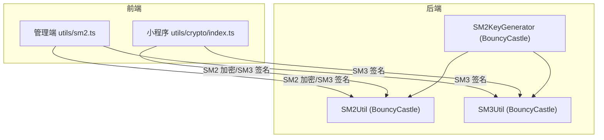
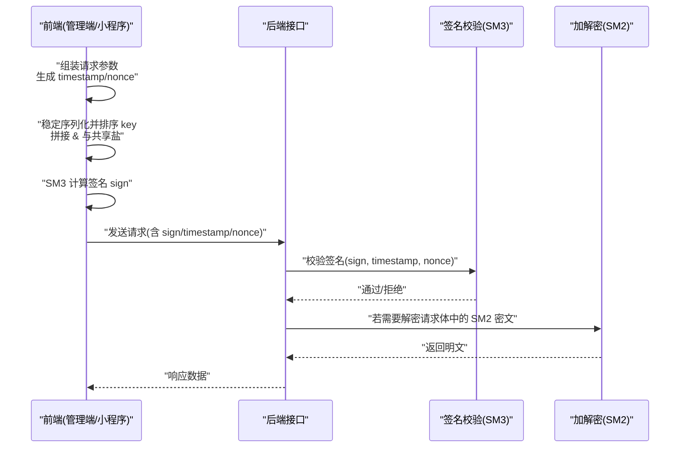
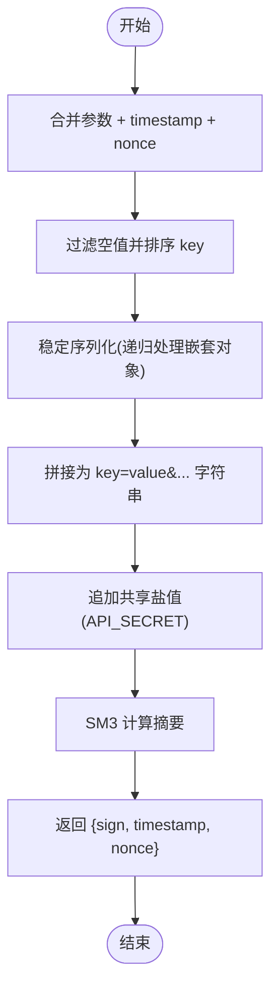
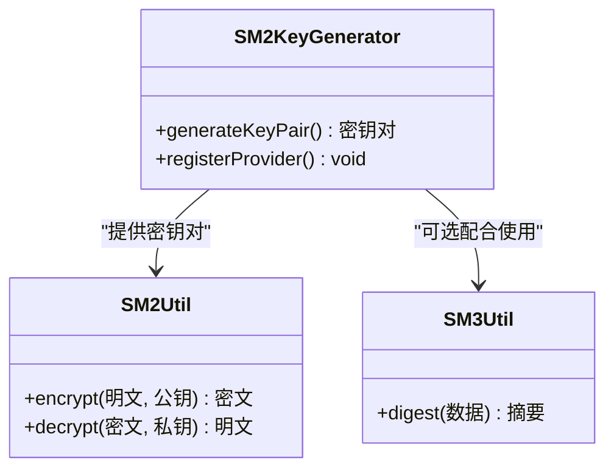
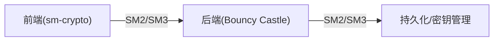

# 国密算法实现

<cite>
**本文引用的文件**   
- [class_record_admin_front/src/utils/sm2.ts](file://class_record_admin_front/src/utils/sm2.ts)
- [class_times_record/src/utils/crypto/index.ts](file://class_times_record/src/utils/crypto/index.ts)
- [class_times_record_back/common/src/main/java/com/shiroko/util/SM2Util.java](file://class_times_record_back/common/src/main/java/com/shiroko/util/SM2Util.java)
- [class_times_record_back/common/src/main/java/com/shiroko/util/SM3Util.java](file://class_times_record_back/common/src/main/java/com/shiroko/util/SM3Util.java)
- [class_times_record_back/common/src/main/java/com/shiroko/util/SM2KeyGenerator.java](file://class_times_record_back/common/src/main/java/com/shiroko/util/SM2KeyGenerator.java)
- [class_times_record_back/docs/architecture.md](file://class_times_record_back/docs/architecture.md)
- [class_times_record_back/README.md](file://class_times_record_back/README.md)
</cite>

## 目录
1. [简介](#简介)
2. [项目结构](#项目结构)
3. [核心组件](#核心组件)
4. [架构总览](#架构总览)
5. [详细组件分析](#详细组件分析)
6. [依赖分析](#依赖分析)
7. [性能考虑](#性能考虑)
8. [故障排查指南](#故障排查指南)
9. [结论](#结论)
10. [附录](#附录)

## 简介
本文件面向前后端双端，系统化梳理本项目中国密算法（SM2、SM3）的实现与使用方式，重点覆盖：
- SM2 非对称加密在前端（sm-crypto）与后端（Bouncy Castle）的对接方案，包括公钥生成、数据加解密流程。
- SM3 哈希在接口签名中的应用，包括参数排序拼接、时间戳与随机数防重放、签名生成与验证。
- 双端密钥管理机制与安全策略建议（公钥分发、私钥存储）。
- C1C3C2 加密模式的选择原因与安全性考量。
- 常见问题排查方法与性能优化建议。

## 项目结构
本项目包含前端管理端、移动端小程序以及后端多服务模块。涉及国密相关的关键位置如下：
- 前端管理端（Vue）：utils/sm2.ts 提供 SM2 加密与 SM3 签名工具。
- 移动端小程序（uni-app）：utils/crypto/index.ts 提供 SM2 加密与 SM3 签名工具。
- 后端通用工具：SM2Util、SM3Util、SM2KeyGenerator 基于 Bouncy Castle 实现 SM2/SM3。

图表来源
- [class_record_admin_front/src/utils/sm2.ts:1-88](file://class_record_admin_front/src/utils/sm2.ts#L1-L88)
- [class_times_record/src/utils/crypto/index.ts:1-99](file://class_times_record/src/utils/crypto/index.ts#L1-L99)
- [class_times_record_back/common/src/main/java/com/shiroko/util/SM2Util.java](file://class_times_record_back/common/src/main/java/com/shiroko/util/SM2Util.java)
- [class_times_record_back/common/src/main/java/com/shiroko/util/SM3Util.java](file://class_times_record_back/common/src/main/java/com/shiroko/util/SM3Util.java)
- [class_times_record_back/common/src/main/java/com/shiroko/util/SM2KeyGenerator.java](file://class_times_record_back/common/src/main/java/com/shiroko/util/SM2KeyGenerator.java)

章节来源
- [class_record_admin_front/src/utils/sm2.ts:1-88](file://class_record_admin_front/src/utils/sm2.ts#L1-L88)
- [class_times_record/src/utils/crypto/index.ts:1-99](file://class_times_record/src/utils/crypto/index.ts#L1-L99)
- [class_times_record_back/common/src/main/java/com/shiroko/util/SM2Util.java](file://class_times_record_back/common/src/main/java/com/shiroko/util/SM2Util.java)
- [class_times_record_back/common/src/main/java/com/shiroko/util/SM3Util.java](file://class_times_record_back/common/src/main/java/com/shiroko/util/SM3Util.java)
- [class_times_record_back/common/src/main/java/com/shiroko/util/SM2KeyGenerator.java](file://class_times_record_back/common/src/main/java/com/shiroko/util/SM2KeyGenerator.java)

## 核心组件
- 前端管理端 sm2.ts
  - 提供 SM2 公钥加密函数，固定使用 C1C3C2 模式（cipherMode=1），并在密文前添加“04”前缀。
  - 提供 SM3 签名生成函数，对请求参数进行稳定序列化、排序拼接，附加时间戳与随机串，再与共享盐值拼接后计算 SM3 摘要。
- 移动端小程序 crypto/index.ts
  - 提供与前端一致的 SM2 加密与 SM3 签名能力，确保跨端一致性。
- 后端 SM2Util/SM3Util/SM2KeyGenerator
  - 基于 Bouncy Castle 提供 SM2 加解密与 SM3 摘要能力；SM2KeyGenerator 负责密钥对生成与提供者注册。

章节来源
- [class_record_admin_front/src/utils/sm2.ts:1-88](file://class_record_admin_front/src/utils/sm2.ts#L1-L88)
- [class_times_record/src/utils/crypto/index.ts:1-99](file://class_times_record/src/utils/crypto/index.ts#L1-L99)
- [class_times_record_back/common/src/main/java/com/shiroko/util/SM2Util.java](file://class_times_record_back/common/src/main/java/com/shiroko/util/SM2Util.java)
- [class_times_record_back/common/src/main/java/com/shiroko/util/SM3Util.java](file://class_times_record_back/common/src/main/java/com/shiroko/util/SM3Util.java)
- [class_times_record_back/common/src/main/java/com/shiroko/util/SM2KeyGenerator.java](file://class_times_record_back/common/src/main/java/com/shiroko/util/SM2KeyGenerator.java)

## 架构总览
下图展示前端到后端的 SM2/SM3 交互流程，涵盖加密、签名、验签与解密的关键步骤。

图表来源
- [class_record_admin_front/src/utils/sm2.ts:1-88](file://class_record_admin_front/src/utils/sm2.ts#L1-L88)
- [class_times_record/src/utils/crypto/index.ts:1-99](file://class_times_record/src/utils/crypto/index.ts#L1-L99)
- [class_times_record_back/common/src/main/java/com/shiroko/util/SM2Util.java](file://class_times_record_back/common/src/main/java/com/shiroko/util/SM2Util.java)
- [class_times_record_back/common/src/main/java/com/shiroko/util/SM3Util.java](file://class_times_record_back/common/src/main/java/com/shiroko/util/SM3Util.java)

## 详细组件分析

### 前端管理端 SM2/SM3 工具（sm2.ts）
- SM2 加密
  - 使用 sm-crypto 的 sm2.doEncrypt，指定 cipherMode=1（C1C3C2），并在结果前追加“04”前缀，保证与后端一致。
- SM3 签名
  - 将请求参数对象与 timestamp、nonce 合并，仅对第一层 key 进行过滤空值与排序，嵌套对象采用自定义 stableStringify 递归处理，保持与后端 JSON 序列化行为一致。
  - 拼接为 key=value&key=value... 形式，末尾追加共享盐值，计算 SM3 摘要作为 sign。

图表来源
- [class_record_admin_front/src/utils/sm2.ts:1-88](file://class_record_admin_front/src/utils/sm2.ts#L1-L88)

章节来源
- [class_record_admin_front/src/utils/sm2.ts:1-88](file://class_record_admin_front/src/utils/sm2.ts#L1-L88)

### 移动端小程序 SM2/SM3 工具（crypto/index.ts）
- 与前端管理端保持一致的 SM2 加密与 SM3 签名逻辑，确保跨端统一。
- 同样使用 cipherMode=1（C1C3C2），并在密文前添加“04”前缀。
- 签名过程采用相同的稳定序列化与排序策略，避免前后端签名不一致。

章节来源
- [class_times_record/src/utils/crypto/index.ts:1-99](file://class_times_record/src/utils/crypto/index.ts#L1-L99)

### 后端 SM2/SM3 工具（Bouncy Castle）
- SM2Util
  - 提供 SM2 加解密能力，需与前端的 cipherMode 与“04”前缀约定一致。
- SM3Util
  - 提供 SM3 摘要计算，用于接口签名校验。
- SM2KeyGenerator
  - 注册 BouncyCastle 提供者，生成 SM2 密钥对，供系统初始化或密钥管理服务使用。

图表来源
- [class_times_record_back/common/src/main/java/com/shiroko/util/SM2Util.java](file://class_times_record_back/common/src/main/java/com/shiroko/util/SM2Util.java)
- [class_times_record_back/common/src/main/java/com/shiroko/util/SM3Util.java](file://class_times_record_back/common/src/main/java/com/shiroko/util/SM3Util.java)
- [class_times_record_back/common/src/main/java/com/shiroko/util/SM2KeyGenerator.java](file://class_times_record_back/common/src/main/java/com/shiroko/util/SM2KeyGenerator.java)

章节来源
- [class_times_record_back/common/src/main/java/com/shiroko/util/SM2Util.java](file://class_times_record_back/common/src/main/java/com/shiroko/util/SM2Util.java)
- [class_times_record_back/common/src/main/java/com/shiroko/util/SM3Util.java](file://class_times_record_back/common/src/main/java/com/shiroko/util/SM3Util.java)
- [class_times_record_back/common/src/main/java/com/shiroko/util/SM2KeyGenerator.java](file://class_times_record_back/common/src/main/java/com/shiroko/util/SM2KeyGenerator.java)

### 双端密钥管理与安全策略
- 公钥分发
  - 公钥由后端生成并通过安全渠道下发至前端（管理端/小程序），前端以 Hex 字符串形式保存并使用。
- 私钥存储
  - 私钥应仅保存在后端受保护环境（如密钥管理系统、硬件安全模块 HSM），严禁泄露到前端或客户端。
- 密钥轮换
  - 定期轮换密钥对，更新前端公钥缓存，确保历史密文可解密策略明确（例如保留旧私钥一段时间）。
- 传输安全
  - 结合 HTTPS 使用，防止中间人攻击；签名中包含 timestamp 与 nonce，降低重放风险。

章节来源
- [class_times_record_back/common/src/main/java/com/shiroko/util/SM2KeyGenerator.java](file://class_times_record_back/common/src/main/java/com/shiroko/util/SM2KeyGenerator.java)
- [class_times_record_back/docs/architecture.md:82](file://class_times_record_back/docs/architecture.md#L82)
- [class_times_record_back/README.md:31](file://class_times_record_back/README.md#L31)

### C1C3C2 加密模式选择与安全性
- 选择原因
  - 前后端均显式设置 cipherMode=1（C1C3C2），并与“04”前缀约定一致，确保兼容性与互操作性。
- 安全性考量
  - C1C3C2 为早期标准模式，当前新标准为 C1C2C3。若未来升级，需同步调整前后端配置与协议版本。
  - 无论哪种模式，都应配合随机化与非确定性随机源，避免重复 nonce 导致的安全问题。

章节来源
- [class_record_admin_front/src/utils/sm2.ts:7](file://class_record_admin_front/src/utils/sm2.ts#L7)
- [class_times_record/src/utils/crypto/index.ts:16-18](file://class_times_record/src/utils/crypto/index.ts#L16-L18)
- [class_times_record_back/docs/architecture.md:82](file://class_times_record_back/docs/architecture.md#L82)

## 依赖分析
- 前端依赖
  - sm-crypto：提供 SM2 与 SM3 的原生 JS 实现，便于浏览器与小程序环境使用。
- 后端依赖
  - Bouncy Castle：Java 密码学扩展库，提供 SM2/SM3 等算法支持。

图表来源
- [class_record_admin_front/src/utils/sm2.ts:1-2](file://class_record_admin_front/src/utils/sm2.ts#L1-L2)
- [class_times_record/src/utils/crypto/index.ts:1-2](file://class_times_record/src/utils/crypto/index.ts#L1-L2)
- [class_times_record_back/common/src/main/java/com/shiroko/util/SM2Util.java](file://class_times_record_back/common/src/main/java/com/shiroko/util/SM2Util.java)
- [class_times_record_back/common/src/main/java/com/shiroko/util/SM3Util.java](file://class_times_record_back/common/src/main/java/com/shiroko/util/SM3Util.java)

章节来源
- [class_record_admin_front/src/utils/sm2.ts:1-2](file://class_record_admin_front/src/utils/sm2.ts#L1-L2)
- [class_times_record/src/utils/crypto/index.ts:1-2](file://class_times_record/src/utils/crypto/index.ts#L1-L2)
- [class_times_record_back/common/src/main/java/com/shiroko/util/SM2Util.java](file://class_times_record_back/common/src/main/java/com/shiroko/util/SM2Util.java)
- [class_times_record_back/common/src/main/java/com/shiroko/util/SM3Util.java](file://class_times_record_back/common/src/main/java/com/shiroko/util/SM3Util.java)

## 性能考虑
- 前端
  - 避免频繁调用 SM2 加密大文本，优先在后端进行批量处理。
  - 合理缓存公钥，减少网络获取开销。
- 后端
  - 复用 Bouncy Castle Provider 实例，避免重复注册带来的开销。
  - 对高频签名场景，考虑预计算与缓存策略（注意时效性）。
- 网络
  - 启用 HTTP 压缩与连接池，减少加解密带来的额外体积影响。

[本节为通用指导，不直接分析具体文件]

## 故障排查指南
- 签名不一致
  - 检查前后端是否采用相同的稳定序列化与排序规则，确认空值过滤与嵌套对象处理方式一致。
  - 核对共享盐值（API_SECRET）是否一致。
- 解密失败
  - 确认前端使用的公钥与后端私钥匹配，且 cipherMode 与“04”前缀一致。
  - 检查密文是否为 Hex 格式，是否存在大小写差异或多余字符。
- 重放攻击
  - 校验 timestamp 是否在允许的时间窗口内，nonce 是否唯一。
- 依赖缺失
  - 后端确保已正确引入 Bouncy Castle 并提供器注册。

章节来源
- [class_record_admin_front/src/utils/sm2.ts:1-88](file://class_record_admin_front/src/utils/sm2.ts#L1-L88)
- [class_times_record/src/utils/crypto/index.ts:1-99](file://class_times_record/src/utils/crypto/index.ts#L1-L99)
- [class_times_record_back/common/src/main/java/com/shiroko/util/SM2KeyGenerator.java](file://class_times_record_back/common/src/main/java/com/shiroko/util/SM2KeyGenerator.java)

## 结论
本项目在前端与后端分别采用 sm-crypto 与 Bouncy Castle 实现了 SM2/SM3 国密算法，保证了跨端一致性与安全性。通过统一的签名机制与密钥管理策略，有效提升了数据传输的机密性与完整性。后续可在必要时评估向 C1C2C3 模式迁移，并持续完善密钥轮换与审计机制。

[本节为总结性内容，不直接分析具体文件]

## 附录
- 代码示例路径（不含具体代码内容）
  - 前端管理端 SM2 加密与 SM3 签名：[class_record_admin_front/src/utils/sm2.ts](file://class_record_admin_front/src/utils/sm2.ts)
  - 移动端小程序 SM2 加密与 SM3 签名：[class_times_record/src/utils/crypto/index.ts](file://class_times_record/src/utils/crypto/index.ts)
  - 后端 SM2/SM3 工具类：
    - [class_times_record_back/common/src/main/java/com/shiroko/util/SM2Util.java](file://class_times_record_back/common/src/main/java/com/shiroko/util/SM2Util.java)
    - [class_times_record_back/common/src/main/java/com/shiroko/util/SM3Util.java](file://class_times_record_back/common/src/main/java/com/shiroko/util/SM3Util.java)
    - [class_times_record_back/common/src/main/java/com/shiroko/util/SM2KeyGenerator.java](file://class_times_record_back/common/src/main/java/com/shiroko/util/SM2KeyGenerator.java)

[本节为参考指引，不直接分析具体文件]