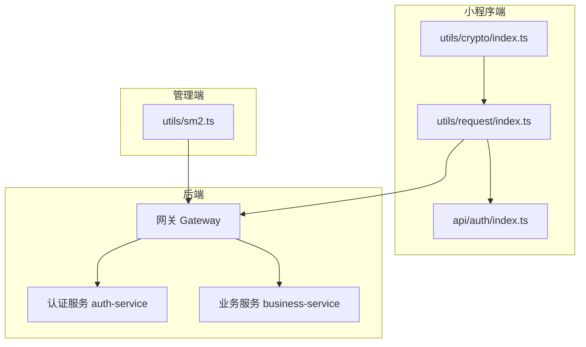
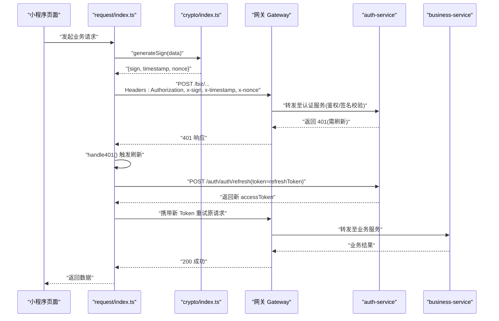
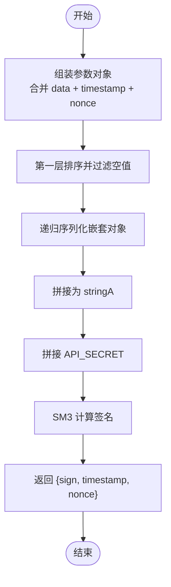
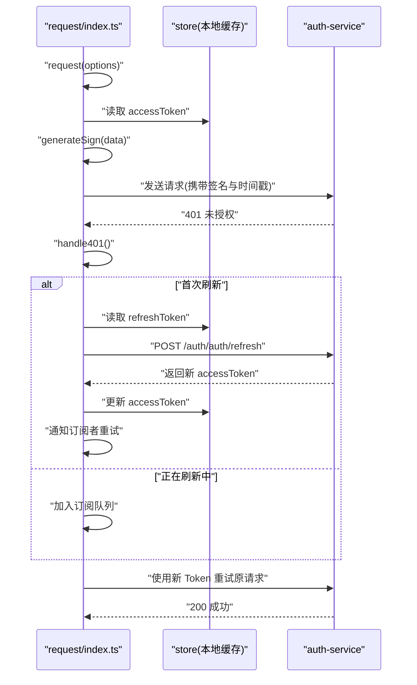
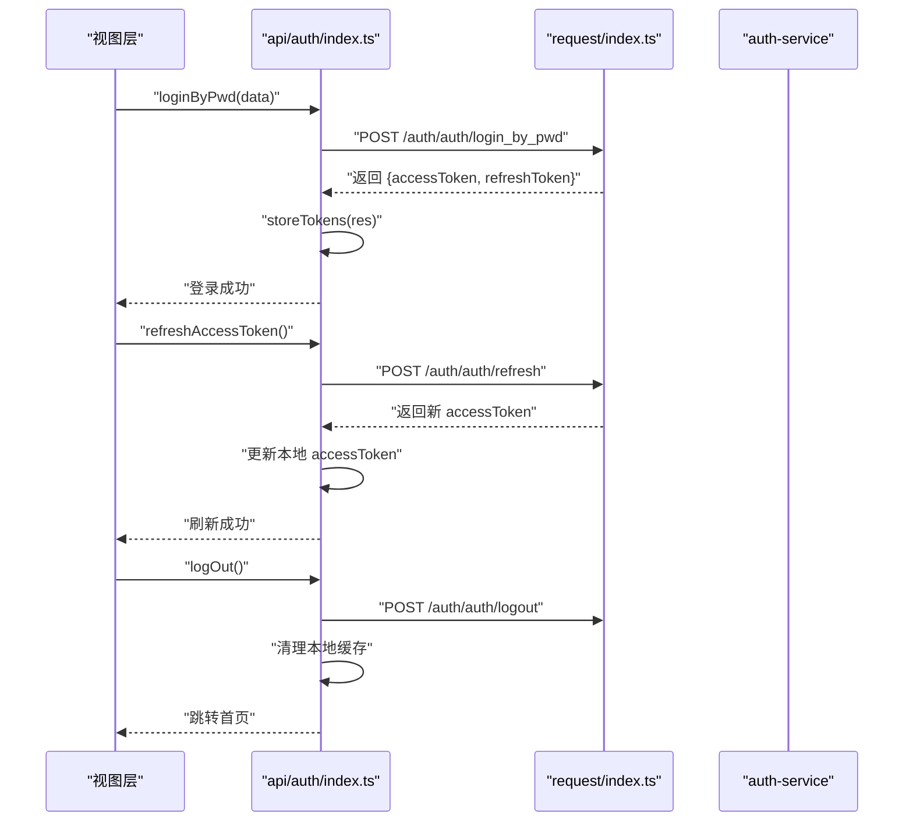
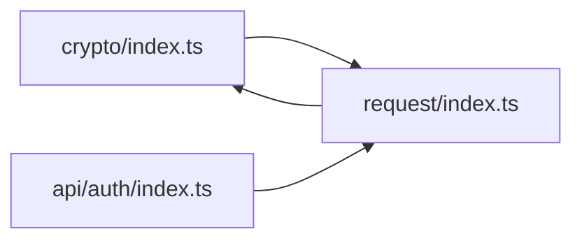

# 安全设计

<cite>
**本文引用的文件**   
- [class_times_record/src/utils/crypto/index.ts](file://class_times_record/src/utils/crypto/index.ts)
- [class_times_record/src/utils/request/index.ts](file://class_times_record/src/utils/request/index.ts)
- [class_times_record/src/api/auth/index.ts](file://class_times_record/src/api/auth/index.ts)
- [class_record_admin_front/src/utils/sm2.ts](file://class_record_admin_front/src/utils/sm2.ts)
</cite>

## 目录
1. [引言](#引言)
2. [项目结构](#项目结构)
3. [核心组件](#核心组件)
4. [架构总览](#架构总览)
5. [详细组件分析](#详细组件分析)
6. [依赖分析](#依赖分析)
7. [性能考虑](#性能考虑)
8. [故障排查指南](#故障排查指南)
9. [结论](#结论)
10. [附录](#附录)

## 引言
本文件围绕系统安全设计展开，聚焦以下目标：
- 国密算法体系实现：SM2 非对称加密用于密码传输、SM3 哈希用于数据完整性校验。
- 双端认证流程差异：小程序端采用 SM2 加密 + SM3 签名；管理端采用 HTTPS 明文传输 + BCrypt 存储（说明性内容）。
- JWT 令牌机制：生成、验证、刷新与黑名单策略（说明性内容）。
- 细粒度权限控制：菜单、按钮、数据权限方案（说明性内容）。
- 请求拦截器安全校验：签名验证、时间戳防重放、Nonce 随机数验证等（结合前端代码分析）。
- 安全配置最佳实践与常见漏洞防护（说明性内容）。

## 项目结构
本项目包含多端与多服务：
- 小程序端：基于 uni-app，提供登录、业务接口调用、请求拦截与国密工具。
- 管理端：基于 Vue 的后台管理系统，提供 SM2/SM3 工具能力。
- 后端服务：网关与各业务服务（此处文档不直接分析后端源码，仅做概念性说明）。

图表来源
- [class_times_record/src/utils/crypto/index.ts:1-99](file://class_times_record/src/utils/crypto/index.ts#L1-L99)
- [class_times_record/src/utils/request/index.ts:1-413](file://class_times_record/src/utils/request/index.ts#L1-L413)
- [class_times_record/src/api/auth/index.ts:1-213](file://class_times_record/src/api/auth/index.ts#L1-L213)
- [class_record_admin_front/src/utils/sm2.ts:1-88](file://class_record_admin_front/src/utils/sm2.ts#L1-L88)

章节来源
- [class_times_record/src/utils/crypto/index.ts:1-99](file://class_times_record/src/utils/crypto/index.ts#L1-L99)
- [class_times_record/src/utils/request/index.ts:1-413](file://class_times_record/src/utils/request/index.ts#L1-L413)
- [class_times_record/src/api/auth/index.ts:1-213](file://class_times_record/src/api/auth/index.ts#L1-L213)
- [class_record_admin_front/src/utils/sm2.ts:1-88](file://class_record_admin_front/src/utils/sm2.ts#L1-L88)

## 核心组件
- 国密工具库（小程序端）
  - SM2 公钥加密：使用固定公钥对敏感字段进行加密，模式为 C1C3C2，输出带“04”前缀。
  - SM3 签名：对请求参数进行稳定序列化、排序、拼接密钥后计算 SM3 摘要，返回 sign、timestamp、nonce。
- 请求拦截器（小程序端）
  - 自动注入 Authorization、x-sign、x-timestamp、x-nonce 等请求头。
  - 统一处理 200/401/404/500 等状态码，支持 Token 静默刷新与重试。
- 认证 API（小程序端）
  - 提供登录、免密登录、Token 刷新、登出等封装方法，并负责本地缓存存取。
- 国密工具库（管理端）
  - 提供 SM2 加密与 SM3 签名生成，供管理端在需要时使用。

章节来源
- [class_times_record/src/utils/crypto/index.ts:1-99](file://class_times_record/src/utils/crypto/index.ts#L1-L99)
- [class_times_record/src/utils/request/index.ts:1-413](file://class_times_record/src/utils/request/index.ts#L1-L413)
- [class_times_record/src/api/auth/index.ts:1-213](file://class_times_record/src/api/auth/index.ts#L1-L213)
- [class_record_admin_front/src/utils/sm2.ts:1-88](file://class_record_admin_front/src/utils/sm2.ts#L1-L88)

## 架构总览
下图展示了小程序端从发起请求到后端鉴权与路由的整体流程，包括签名注入、401 自动刷新与重试。

图表来源
- [class_times_record/src/utils/request/index.ts:79-179](file://class_times_record/src/utils/request/index.ts#L79-L179)
- [class_times_record/src/utils/request/index.ts:192-278](file://class_times_record/src/utils/request/index.ts#L192-L278)
- [class_times_record/src/utils/crypto/index.ts:60-98](file://class_times_record/src/utils/crypto/index.ts#L60-L98)
- [class_times_record/src/api/auth/index.ts:133-155](file://class_times_record/src/api/auth/index.ts#L133-L155)

## 详细组件分析

### 小程序端：SM2 加密与 SM3 签名
- SM2 加密
  - 使用固定公钥与 C1C3C2 模式进行加密，输出以“04”开头，便于后端识别。
- SM3 签名
  - 将请求体对象进行稳定序列化（递归排序键、过滤空值），按 key=value&key=value 拼接，再追加盐值，最后计算 SM3 摘要。
  - 同时生成 timestamp 与 nonce，作为防重放与唯一性保障。

图表来源
- [class_times_record/src/utils/crypto/index.ts:27-53](file://class_times_record/src/utils/crypto/index.ts#L27-L53)
- [class_times_record/src/utils/crypto/index.ts:60-98](file://class_times_record/src/utils/crypto/index.ts#L60-L98)

章节来源
- [class_times_record/src/utils/crypto/index.ts:1-99](file://class_times_record/src/utils/crypto/index.ts#L1-L99)

### 小程序端：请求拦截器与安全校验
- 请求头注入
  - 自动附加 Authorization、x-sign、x-timestamp、x-nonce。
- 统一错误处理
  - 200 且 code=200 视为成功；401 进入刷新流程；404/500 提示失败。
- Token 刷新与重试
  - 防止并发刷新，维护订阅队列；刷新成功后用新 Token 重试所有等待中的请求。

图表来源
- [class_times_record/src/utils/request/index.ts:79-179](file://class_times_record/src/utils/request/index.ts#L79-L179)
- [class_times_record/src/utils/request/index.ts:192-278](file://class_times_record/src/utils/request/index.ts#L192-L278)
- [class_times_record/src/utils/request/index.ts:290-334](file://class_times_record/src/utils/request/index.ts#L290-L334)

章节来源
- [class_times_record/src/utils/request/index.ts:1-413](file://class_times_record/src/utils/request/index.ts#L1-L413)

### 小程序端：认证 API 封装
- 登录相关
  - 账号密码登录、免密登录、Token 登录均通过统一 post 封装调用。
- Token 刷新
  - 独立 refreshAccessToken 方法，成功则更新本地 accessToken。
- 登出
  - 清理本地缓存并调用后端登出接口，随后跳转首页或指定路由。

图表来源
- [class_times_record/src/api/auth/index.ts:59-77](file://class_times_record/src/api/auth/index.ts#L59-L77)
- [class_times_record/src/api/auth/index.ts:133-155](file://class_times_record/src/api/auth/index.ts#L133-L155)
- [class_times_record/src/api/auth/index.ts:163-188](file://class_times_record/src/api/auth/index.ts#L163-L188)

章节来源
- [class_times_record/src/api/auth/index.ts:1-213](file://class_times_record/src/api/auth/index.ts#L1-L213)

### 管理端：SM2/SM3 工具
- SM2 加密
  - 使用 sm-crypto 的 doEncrypt，模式与小程序端一致，输出带“04”前缀。
- SM3 签名
  - 与小程序端一致的稳定序列化与签名流程，确保前后端签名一致性。

章节来源
- [class_record_admin_front/src/utils/sm2.ts:1-88](file://class_record_admin_front/src/utils/sm2.ts#L1-L88)

### 双端认证流程对比（说明性）
- 小程序端
  - 密码传输：SM2 公钥加密，避免明文泄露。
  - 请求签名：SM3 签名 + 时间戳 + Nonce，防篡改与防重放。
- 管理端
  - 传输层：HTTPS 明文传输（由 TLS 保障机密性与完整性）。
  - 存储层：BCrypt 存储用户口令（不可逆、抗碰撞）。
- 注意：以上为通用安全设计建议，具体实现以后端与前端实际代码为准。

[本节为概念性说明，不涉及具体文件分析]

### JWT 令牌管理机制（说明性）
- 生成
  - 服务端签发包含用户标识、角色、过期时间的 JWT。
- 验证
  - 网关或服务端中间件校验签名、有效期、黑名单。
- 刷新
  - 使用 refreshToken 换取新的 accessToken，减少频繁登录。
- 黑名单
  - 登出或异常时，将旧 token 加入黑名单，拒绝后续使用。
- 注意：上述为通用机制说明，当前仓库前端已实现刷新与重试逻辑，后端细节不在本文范围内。

[本节为概念性说明，不涉及具体文件分析]

### 细粒度权限控制模型（说明性）
- 菜单权限
  - 根据用户角色动态渲染菜单树。
- 按钮权限
  - 基于指令或守卫控制按钮显示/禁用。
- 数据权限
  - 基于租户、部门、角色等维度限制数据可见范围。
- 注意：该部分为通用方案说明，具体实现需结合后端 RBAC/ABAC 设计与前端路由守卫。

[本节为概念性说明，不涉及具体文件分析]

## 依赖分析
- 模块耦合
  - request/index.ts 依赖 crypto/index.ts 生成签名，依赖 api/auth/index.ts 完成刷新与登出。
  - api/auth/index.ts 依赖 request/index.ts 进行网络请求。
- 外部依赖
  - 使用 sm-crypto 提供 SM2/SM3 能力。
  - 使用 uni.request 作为底层 HTTP 客户端。

图表来源
- [class_times_record/src/utils/crypto/index.ts:1-99](file://class_times_record/src/utils/crypto/index.ts#L1-L99)
- [class_times_record/src/utils/request/index.ts:1-413](file://class_times_record/src/utils/request/index.ts#L1-L413)
- [class_times_record/src/api/auth/index.ts:1-213](file://class_times_record/src/api/auth/index.ts#L1-L213)

章节来源
- [class_times_record/src/utils/crypto/index.ts:1-99](file://class_times_record/src/utils/crypto/index.ts#L1-L99)
- [class_times_record/src/utils/request/index.ts:1-413](file://class_times_record/src/utils/request/index.ts#L1-L413)
- [class_times_record/src/api/auth/index.ts:1-213](file://class_times_record/src/api/auth/index.ts#L1-L213)

## 性能考虑
- 签名计算开销
  - SM3 计算轻量，但应避免在高频循环中重复构造大对象；建议在必要处缓存稳定序列化结果。
- 并发刷新
  - 使用订阅队列避免多次并发刷新，降低网络与 CPU 压力。
- 超时与重试
  - 合理设置超时时间与重试次数，避免雪崩效应。

[本节为通用指导，不涉及具体文件分析]

## 故障排查指南
- 签名不一致
  - 检查是否使用相同序列化规则（排序、过滤空值）、相同盐值与相同模式（C1C3C2）。
- 401 无法刷新
  - 确认 refreshToken 是否存在；检查 /auth/auth/refresh 接口返回值；观察 isRefreshing 状态与订阅队列。
- 时间戳过期
  - 检查设备时间是否与服务器同步；调整允许的时间窗口。
- Nonce 冲突
  - 确保每次请求生成唯一 nonce；必要时增加长度或引入序列号。

章节来源
- [class_times_record/src/utils/request/index.ts:192-278](file://class_times_record/src/utils/request/index.ts#L192-L278)
- [class_times_record/src/utils/crypto/index.ts:60-98](file://class_times_record/src/utils/crypto/index.ts#L60-L98)

## 结论
- 小程序端实现了基于 SM2/SM3 的安全传输与签名校验，并通过请求拦截器完成统一的鉴权与刷新流程。
- 管理端提供了与小程序端一致的 SM2/SM3 工具，便于在需要时复用。
- 建议在后端配合实现严格的签名校验、时间戳窗口与 Nonce 去重、JWT 黑名单与刷新策略，形成端到端的安全闭环。

[本节为总结性内容，不涉及具体文件分析]

## 附录
- 安全配置最佳实践（说明性）
  - 最小权限原则：仅授予必要的菜单与按钮权限。
  - 输入校验与输出编码：防止注入与 XSS。
  - 日志脱敏：避免记录敏感信息。
  - 证书与密钥管理：定期轮换公私钥与盐值。
  - 速率限制与风控：针对登录与刷新接口实施限流。
- 常见漏洞防护（说明性）
  - CSRF：使用 SameSite Cookie 与自定义 Header 校验。
  - 重放攻击：时间戳 + Nonce + 服务端去重。
  - 中间人攻击：强制 HTTPS，启用 HSTS。
  - 越权访问：服务端二次校验资源归属与角色。

[本节为通用指导，不涉及具体文件分析]