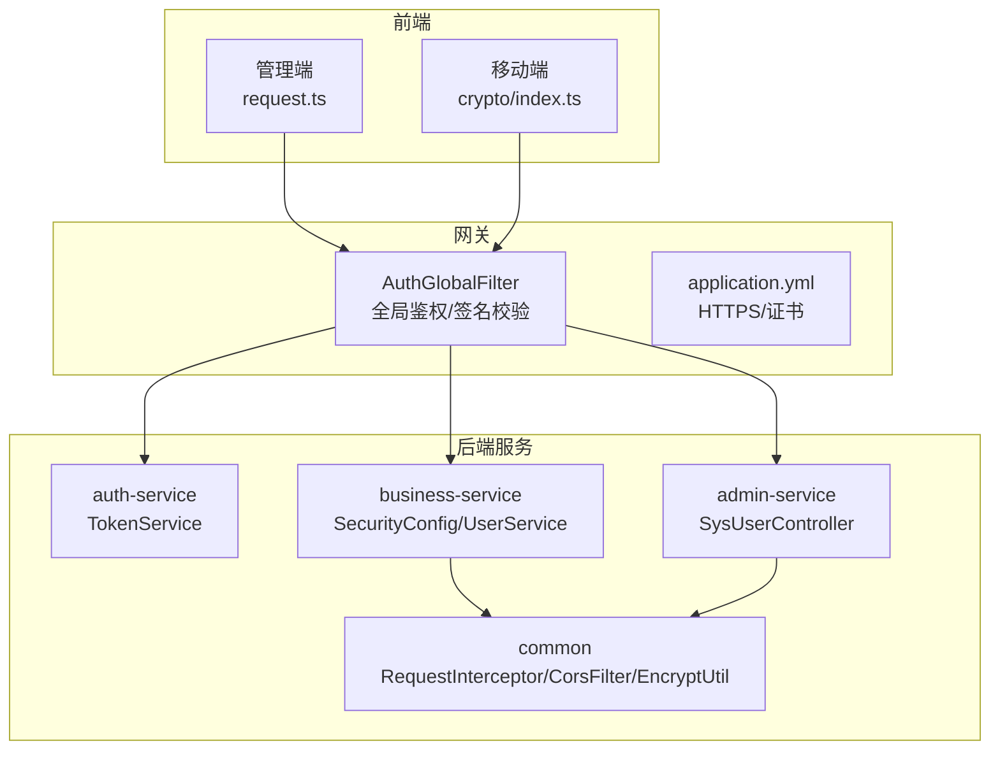
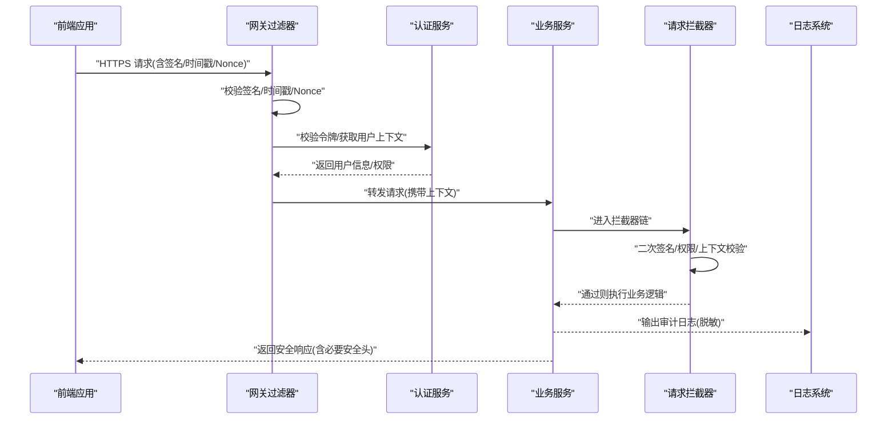
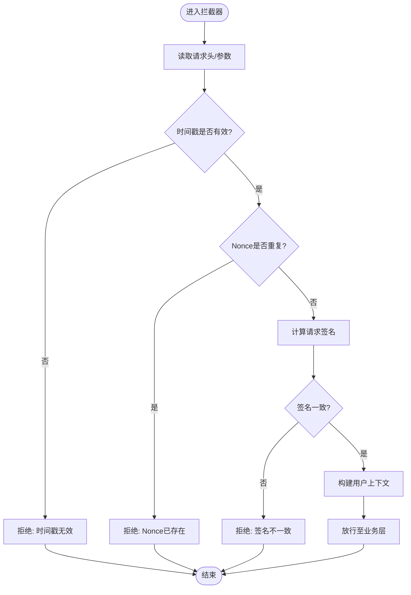
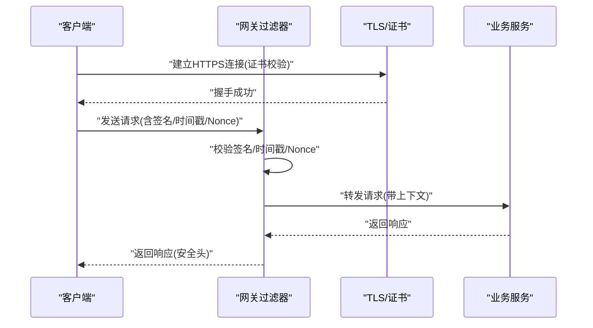
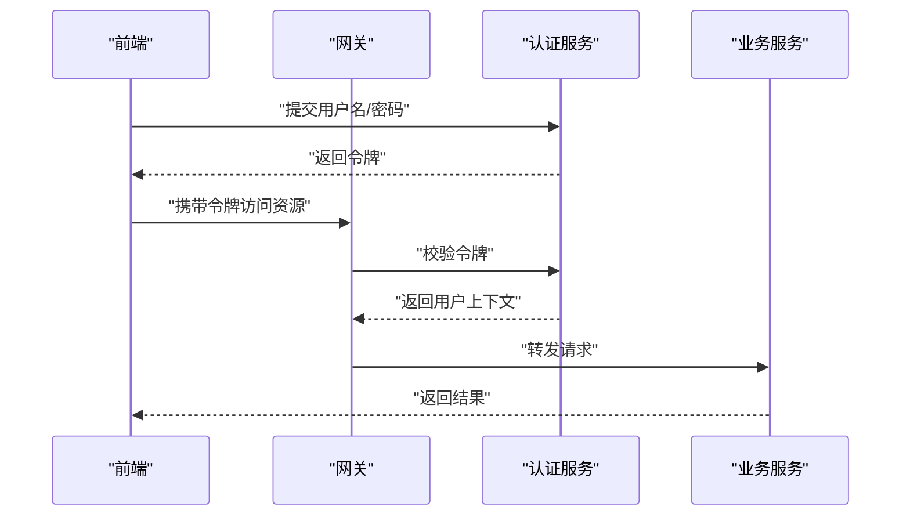
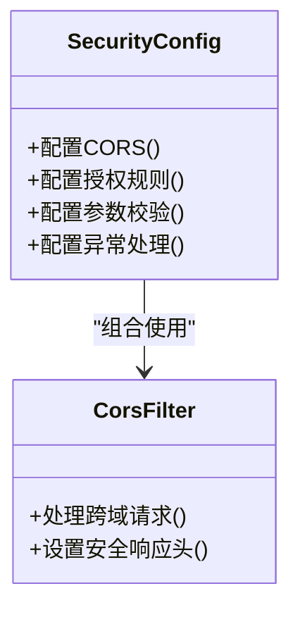
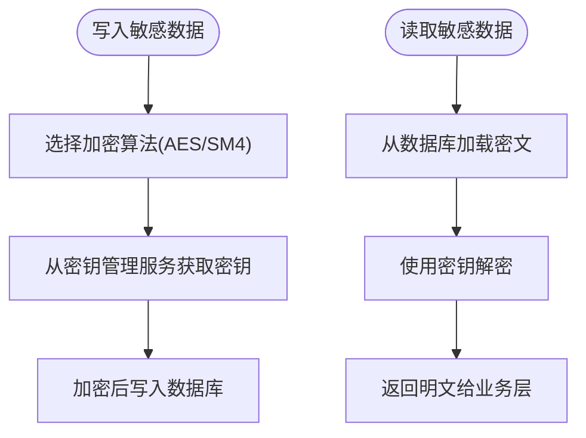
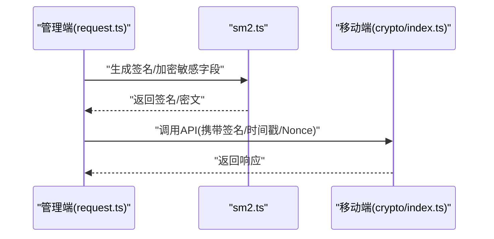
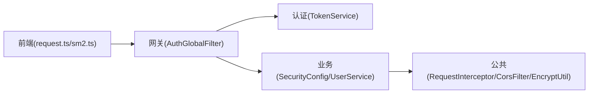

# 数据安全保护

<cite>
**本文引用的文件**   
- [class_times_record_back/common/src/main/java/com/shiroko/interceptor/RequestInterceptor.java](file://class_times_record_back/common/src/main/java/com/shiroko/interceptor/RequestInterceptor.java)
- [class_times_record_back/common/src/main/java/com/shiroko/filter/CorsFilter.java](file://class_times_record_back/common/src/main/java/com/shiroko/filter/CorsFilter.java)
- [class_times_record_back/gateway/src/main/java/com/shiroko/gateway/filter/AuthGlobalFilter.java](file://class_times_record_back/gateway/src/main/java/com/shiroko/gateway/filter/AuthGlobalFilter.java)
- [class_times_record_back/auth-service/src/main/java/com/shiroko/service/TokenService.java](file://class_times_record_back/auth-service/src/main/java/com/shiroko/service/TokenService.java)
- [class_times_record_back/business-service/src/main/java/com/shiroko/config/SecurityConfig.java](file://class_times_record_back/business-service/src/main/java/com/shiroko/config/SecurityConfig.java)
- [class_times_record_back/admin-service/src/main/java/com/shiroko/controller/SysUserController.java](file://class_times_record_back/admin-service/src/main/java/com/shiroko/controller/SysUserController.java)
- [class_times_record_back/business-service/src/main/java/com/shiroko/service/UserService.java](file://class_times_record_back/business-service/src/main/java/com/shiroko/service/UserService.java)
- [class_times_record_back/common/src/main/java/com/shiroko/util/EncryptUtil.java](file://class_times_record_back/common/src/main/java/com/shiroko/util/EncryptUtil.java)
- [class_times_record_back/common/src/main/resources/logback-spring.xml](file://class_times_record_back/common/src/main/resources/logback-spring.xml)
- [class_times_record_back/gateway/src/main/resources/application.yml](file://class_times_record_back/gateway/src/main/resources/application.yml)
- [class_times_record_back/business-service/src/main/resources/application-dev.yml](file://class_times_record_back/business-service/src/main/resources/application-dev.yml)
- [class_times_record_back/docs/class_times_record.sql](file://class_times_record_back/docs/class_times_record.sql)
- [class_record_admin_front/src/utils/request.ts](file://class_record_admin_front/src/utils/request.ts)
- [class_record_admin_front/src/types/sm-crypto.d.ts](file://class_record_admin_front/src/types/sm-crypto.d.ts)
- [class_record_admin_front/src/utils/sm2.ts](file://class_record_admin_front/src/utils/sm2.ts)
- [class_times_record/src/utils/crypto/index.ts](file://class_times_record/src/utils/crypto/index.ts)
</cite>

## 目录
1. [引言](#引言)
2. [项目结构](#项目结构)
3. [核心组件](#核心组件)
4. [架构总览](#架构总览)
5. [详细组件分析](#详细组件分析)
6. [依赖关系分析](#依赖关系分析)
7. [性能考虑](#性能考虑)
8. [故障排查指南](#故障排查指南)
9. [结论](#结论)
10. [附录](#附录)

## 引言
本文件围绕“数据安全保护”目标，系统化梳理请求拦截器的安全校验流程（签名验证、时间戳防重放、Nonce随机数）、敏感数据加密存储方案（数据库字段、配置文件、日志脱敏）、数据传输安全机制（HTTPS、证书管理、中间人攻击防护）、Web安全最佳实践（SQL注入、XSS、CSRF防护），并提供安全配置检查清单、漏洞扫描方案以及安全事件监控告警与应急响应流程。文档以代码级事实为依据，结合可视化图示帮助读者快速理解并落地实施。

## 项目结构
本项目采用前后端分离与微服务架构：
- 前端：管理端（Vue）与移动端（UniApp）分别实现请求封装与国密算法调用。
- 网关：统一鉴权、跨域与安全头控制。
- 业务服务：用户、课程、记录等核心业务。
- 认证服务：令牌签发与校验。
- 公共模块：通用拦截器、过滤器、工具类、日志配置等。

图表来源
- [class_record_admin_front/src/utils/request.ts](file://class_record_admin_front/src/utils/request.ts)
- [class_times_record/src/utils/crypto/index.ts](file://class_times_record/src/utils/crypto/index.ts)
- [class_times_record_back/gateway/src/main/java/com/shiroko/gateway/filter/AuthGlobalFilter.java](file://class_times_record_back/gateway/src/main/java/com/shiroko/gateway/filter/AuthGlobalFilter.java)
- [class_times_record_back/gateway/src/main/resources/application.yml](file://class_times_record_back/gateway/src/main/resources/application.yml)
- [class_times_record_back/auth-service/src/main/java/com/shiroko/service/TokenService.java](file://class_times_record_back/auth-service/src/main/java/com/shiroko/service/TokenService.java)
- [class_times_record_back/business-service/src/main/java/com/shiroko/config/SecurityConfig.java](file://class_times_record_back/business-service/src/main/java/com/shiroko/config/SecurityConfig.java)
- [class_times_record_back/admin-service/src/main/java/com/shiroko/controller/SysUserController.java](file://class_times_record_back/admin-service/src/main/java/com/shiroko/controller/SysUserController.java)
- [class_times_record_back/common/src/main/java/com/shiroko/interceptor/RequestInterceptor.java](file://class_times_record_back/common/src/main/java/com/shiroko/interceptor/RequestInterceptor.java)
- [class_times_record_back/common/src/main/java/com/shiroko/filter/CorsFilter.java](file://class_times_record_back/common/src/main/java/com/shiroko/filter/CorsFilter.java)

章节来源
- [class_record_admin_front/src/utils/request.ts](file://class_record_admin_front/src/utils/request.ts)
- [class_times_record/src/utils/crypto/index.ts](file://class_times_record/src/utils/crypto/index.ts)
- [class_times_record_back/gateway/src/main/java/com/shiroko/gateway/filter/AuthGlobalFilter.java](file://class_times_record_back/gateway/src/main/java/com/shiroko/gateway/filter/AuthGlobalFilter.java)
- [class_times_record_back/gateway/src/main/resources/application.yml](file://class_times_record_back/gateway/src/main/resources/application.yml)
- [class_times_record_back/auth-service/src/main/java/com/shiroko/service/TokenService.java](file://class_times_record_back/auth-service/src/main/java/com/shiroko/service/TokenService.java)
- [class_times_record_back/business-service/src/main/java/com/shiroko/config/SecurityConfig.java](file://class_times_record_back/business-service/src/main/java/com/shiroko/config/SecurityConfig.java)
- [class_times_record_back/admin-service/src/main/java/com/shiroko/controller/SysUserController.java](file://class_times_record_back/admin-service/src/main/java/com/shiroko/controller/SysUserController.java)
- [class_times_record_back/common/src/main/java/com/shiroko/interceptor/RequestInterceptor.java](file://class_times_record_back/common/src/main/java/com/shiroko/interceptor/RequestInterceptor.java)
- [class_times_record_back/common/src/main/java/com/shiroko/filter/CorsFilter.java](file://class_times_record_back/common/src/main/java/com/shiroko/filter/CorsFilter.java)

## 核心组件
- 请求拦截器（服务端）：在业务控制器之前执行，完成签名校验、时间戳与Nonce校验、权限上下文装配等。
- 网关全局过滤器：统一入口，负责鉴权、签名校验、限流、黑白名单、跨域与安全响应头等。
- 认证服务：负责令牌签发、刷新与校验，提供用户会话上下文。
- 安全配置：CORS、方法级授权、参数校验、异常处理等。
- 加密工具：对称/非对称加解密、哈希、SM2/SM3/SM4等算法封装。
- 日志配置：统一脱敏策略、敏感字段过滤、审计日志输出。

章节来源
- [class_times_record_back/common/src/main/java/com/shiroko/interceptor/RequestInterceptor.java](file://class_times_record_back/common/src/main/java/com/shiroko/interceptor/RequestInterceptor.java)
- [class_times_record_back/gateway/src/main/java/com/shiroko/gateway/filter/AuthGlobalFilter.java](file://class_times_record_back/gateway/src/main/java/com/shiroko/gateway/filter/AuthGlobalFilter.java)
- [class_times_record_back/auth-service/src/main/java/com/shiroko/service/TokenService.java](file://class_times_record_back/auth-service/src/main/java/com/shiroko/service/TokenService.java)
- [class_times_record_back/business-service/src/main/java/com/shiroko/config/SecurityConfig.java](file://class_times_record_back/business-service/src/main/java/com/shiroko/config/SecurityConfig.java)
- [class_times_record_back/common/src/main/java/com/shiroko/util/EncryptUtil.java](file://class_times_record_back/common/src/main/java/com/shiroko/util/EncryptUtil.java)
- [class_times_record_back/common/src/main/resources/logback-spring.xml](file://class_times_record_back/common/src/main/resources/logback-spring.xml)

## 架构总览
下图展示从前端到后端的端到端安全链路，包括签名、时间戳、Nonce、令牌校验、CORS、HTTPS与证书校验。

图表来源
- [class_times_record_back/gateway/src/main/java/com/shiroko/gateway/filter/AuthGlobalFilter.java](file://class_times_record_back/gateway/src/main/java/com/shiroko/gateway/filter/AuthGlobalFilter.java)
- [class_times_record_back/auth-service/src/main/java/com/shiroko/service/TokenService.java](file://class_times_record_back/auth-service/src/main/java/com/shiroko/service/TokenService.java)
- [class_times_record_back/common/src/main/java/com/shiroko/interceptor/RequestInterceptor.java](file://class_times_record_back/common/src/main/java/com/shiroko/interceptor/RequestInterceptor.java)
- [class_times_record_back/common/src/main/resources/logback-spring.xml](file://class_times_record_back/common/src/main/resources/logback-spring.xml)

## 详细组件分析

### 请求拦截器安全校验流程
- 签名验证：对关键请求参数进行排序拼接，使用约定密钥与算法生成签名，服务端按相同规则复算比对。
- 时间戳防重放：客户端附带当前时间戳，服务端校验时间窗口（如±5分钟），过期拒绝。
- Nonce随机数：每次请求携带唯一随机串，服务端基于Redis或内存缓存去重，防止重放。
- 上下文装配：校验通过后注入用户ID、角色、权限等信息至线程上下文，供后续业务使用。

图表来源
- [class_times_record_back/common/src/main/java/com/shiroko/interceptor/RequestInterceptor.java](file://class_times_record_back/common/src/main/java/com/shiroko/interceptor/RequestInterceptor.java)

章节来源
- [class_times_record_back/common/src/main/java/com/shiroko/interceptor/RequestInterceptor.java](file://class_times_record_back/common/src/main/java/com/shiroko/interceptor/RequestInterceptor.java)

### 网关全局鉴权与传输安全
- 全局鉴权：在网关层统一校验令牌、签名、时间戳与Nonce，减少业务服务负担。
- HTTPS与证书：启用HTTPS，配置证书路径与密码，强制TLS版本与套件，关闭不安全协议。
- 中间人攻击防护：严格证书校验、启用HSTS、限制CORS白名单、设置安全响应头（X-Frame-Options、Content-Security-Policy等）。
- 跨域控制：仅允许受信任域名，限制方法与头部。

图表来源
- [class_times_record_back/gateway/src/main/java/com/shiroko/gateway/filter/AuthGlobalFilter.java](file://class_times_record_back/gateway/src/main/java/com/shiroko/gateway/filter/AuthGlobalFilter.java)
- [class_times_record_back/gateway/src/main/resources/application.yml](file://class_times_record_back/gateway/src/main/resources/application.yml)

章节来源
- [class_times_record_back/gateway/src/main/java/com/shiroko/gateway/filter/AuthGlobalFilter.java](file://class_times_record_back/gateway/src/main/java/com/shiroko/gateway/filter/AuthGlobalFilter.java)
- [class_times_record_back/gateway/src/main/resources/application.yml](file://class_times_record_back/gateway/src/main/resources/application.yml)

### 认证服务与令牌管理
- 令牌签发：登录成功后颁发JWT或自定义令牌，包含用户标识与权限集。
- 令牌校验：网关与服务端均校验令牌有效性、过期时间与签名。
- 会话上下文：将用户信息注入上下文，便于权限判断与审计。

图表来源
- [class_times_record_back/auth-service/src/main/java/com/shiroko/service/TokenService.java](file://class_times_record_back/auth-service/src/main/java/com/shiroko/service/TokenService.java)
- [class_times_record_back/gateway/src/main/java/com/shiroko/gateway/filter/AuthGlobalFilter.java](file://class_times_record_back/gateway/src/main/java/com/shiroko/gateway/filter/AuthGlobalFilter.java)

章节来源
- [class_times_record_back/auth-service/src/main/java/com/shiroko/service/TokenService.java](file://class_times_record_back/auth-service/src/main/java/com/shiroko/service/TokenService.java)
- [class_times_record_back/gateway/src/main/java/com/shiroko/gateway/filter/AuthGlobalFilter.java](file://class_times_record_back/gateway/src/main/java/com/shiroko/gateway/filter/AuthGlobalFilter.java)

### 安全配置与跨域控制
- CORS策略：限定来源、方法与头部，避免任意站点跨域访问。
- 方法级授权：基于注解或配置控制接口访问权限。
- 参数校验：统一校验框架，拒绝非法输入。
- 异常处理：标准化错误码与消息，避免泄露内部细节。

图表来源
- [class_times_record_back/business-service/src/main/java/com/shiroko/config/SecurityConfig.java](file://class_times_record_back/business-service/src/main/java/com/shiroko/config/SecurityConfig.java)
- [class_times_record_back/common/src/main/java/com/shiroko/filter/CorsFilter.java](file://class_times_record_back/common/src/main/java/com/shiroko/filter/CorsFilter.java)

章节来源
- [class_times_record_back/business-service/src/main/java/com/shiroko/config/SecurityConfig.java](file://class_times_record_back/business-service/src/main/java/com/shiroko/config/SecurityConfig.java)
- [class_times_record_back/common/src/main/java/com/shiroko/filter/CorsFilter.java](file://class_times_record_back/common/src/main/java/com/shiroko/filter/CorsFilter.java)

### 敏感数据加密存储方案
- 数据库字段加密：对手机号、身份证号、银行卡号等敏感字段使用对称加密（如AES-GCM或SM4）存储，密钥由KMS或环境变量管理。
- 配置文件加密：敏感配置（数据库密码、第三方密钥）使用加密格式存储，启动时动态解密。
- 日志脱敏：统一日志框架中配置脱敏规则，屏蔽敏感字段，保留审计所需最小信息。

图表来源
- [class_times_record_back/common/src/main/java/com/shiroko/util/EncryptUtil.java](file://class_times_record_back/common/src/main/java/com/shiroko/util/EncryptUtil.java)
- [class_times_record_back/business-service/src/main/resources/application-dev.yml](file://class_times_record_back/business-service/src/main/resources/application-dev.yml)
- [class_times_record_back/common/src/main/resources/logback-spring.xml](file://class_times_record_back/common/src/main/resources/logback-spring.xml)
- [class_times_record_back/docs/class_times_record.sql](file://class_times_record_back/docs/class_times_record.sql)

章节来源
- [class_times_record_back/common/src/main/java/com/shiroko/util/EncryptUtil.java](file://class_times_record_back/common/src/main/java/com/shiroko/util/EncryptUtil.java)
- [class_times_record_back/business-service/src/main/resources/application-dev.yml](file://class_times_record_back/business-service/src/main/resources/application-dev.yml)
- [class_times_record_back/common/src/main/resources/logback-spring.xml](file://class_times_record_back/common/src/main/resources/logback-spring.xml)
- [class_times_record_back/docs/class_times_record.sql](file://class_times_record_back/docs/class_times_record.sql)

### 数据传输安全机制（HTTPS、证书、中间人防护）
- HTTPS配置：启用HTTPS，指定证书路径与密码，强制TLS版本与套件。
- 证书管理：定期轮换证书，使用可信CA，禁用弱套件与旧协议。
- 中间人攻击防护：严格证书校验、启用HSTS、限制CORS白名单、设置安全响应头。

章节来源
- [class_times_record_back/gateway/src/main/resources/application.yml](file://class_times_record_back/gateway/src/main/resources/application.yml)

### Web安全最佳实践（SQL注入、XSS、CSRF）
- SQL注入防护：使用参数化查询与ORM映射，禁止拼接SQL；对输入进行类型与长度校验。
- XSS防护：对用户输入进行HTML转义与内容安全策略（CSP）限制；避免内联脚本与危险属性。
- CSRF防护：使用同源策略、SameSite Cookie、双重提交令牌或自定义请求头校验。

章节来源
- [class_times_record_back/business-service/src/main/java/com/shiroko/config/SecurityConfig.java](file://class_times_record_back/business-service/src/main/java/com/shiroko/config/SecurityConfig.java)
- [class_times_record_back/common/src/main/java/com/shiroko/filter/CorsFilter.java](file://class_times_record_back/common/src/main/java/com/shiroko/filter/CorsFilter.java)

### 前端安全与国密算法集成
- 管理端请求封装：统一添加签名、时间戳、Nonce与令牌，集中处理错误与重试。
- 国密算法：支持SM2/SM3/SM4，用于敏感数据加解密与签名。
- 移动端加密：在移动端侧进行数据加解密，降低明文传输风险。

图表来源
- [class_record_admin_front/src/utils/request.ts](file://class_record_admin_front/src/utils/request.ts)
- [class_record_admin_front/src/utils/sm2.ts](file://class_record_admin_front/src/utils/sm2.ts)
- [class_record_admin_front/src/types/sm-crypto.d.ts](file://class_record_admin_front/src/types/sm-crypto.d.ts)
- [class_times_record/src/utils/crypto/index.ts](file://class_times_record/src/utils/crypto/index.ts)

章节来源
- [class_record_admin_front/src/utils/request.ts](file://class_record_admin_front/src/utils/request.ts)
- [class_record_admin_front/src/utils/sm2.ts](file://class_record_admin_front/src/utils/sm2.ts)
- [class_record_admin_front/src/types/sm-crypto.d.ts](file://class_record_admin_front/src/types/sm-crypto.d.ts)
- [class_times_record/src/utils/crypto/index.ts](file://class_times_record/src/utils/crypto/index.ts)

## 依赖关系分析
- 网关过滤器依赖认证服务与业务服务，承担统一鉴权与传输安全职责。
- 业务服务依赖公共模块的拦截器、过滤器与加密工具，确保一致的校验与加密策略。
- 前端依赖国密库与请求封装，保证签名与加解密的正确性。

图表来源
- [class_record_admin_front/src/utils/request.ts](file://class_record_admin_front/src/utils/request.ts)
- [class_record_admin_front/src/utils/sm2.ts](file://class_record_admin_front/src/utils/sm2.ts)
- [class_times_record_back/gateway/src/main/java/com/shiroko/gateway/filter/AuthGlobalFilter.java](file://class_times_record_back/gateway/src/main/java/com/shiroko/gateway/filter/AuthGlobalFilter.java)
- [class_times_record_back/auth-service/src/main/java/com/shiroko/service/TokenService.java](file://class_times_record_back/auth-service/src/main/java/com/shiroko/service/TokenService.java)
- [class_times_record_back/business-service/src/main/java/com/shiroko/config/SecurityConfig.java](file://class_times_record_back/business-service/src/main/java/com/shiroko/config/SecurityConfig.java)
- [class_times_record_back/business-service/src/main/java/com/shiroko/service/UserService.java](file://class_times_record_back/business-service/src/main/java/com/shiroko/service/UserService.java)
- [class_times_record_back/common/src/main/java/com/shiroko/interceptor/RequestInterceptor.java](file://class_times_record_back/common/src/main/java/com/shiroko/interceptor/RequestInterceptor.java)
- [class_times_record_back/common/src/main/java/com/shiroko/filter/CorsFilter.java](file://class_times_record_back/common/src/main/java/com/shiroko/filter/CorsFilter.java)
- [class_times_record_back/common/src/main/java/com/shiroko/util/EncryptUtil.java](file://class_times_record_back/common/src/main/java/com/shiroko/util/EncryptUtil.java)

章节来源
- [class_record_admin_front/src/utils/request.ts](file://class_record_admin_front/src/utils/request.ts)
- [class_record_admin_front/src/utils/sm2.ts](file://class_record_admin_front/src/utils/sm2.ts)
- [class_times_record_back/gateway/src/main/java/com/shiroko/gateway/filter/AuthGlobalFilter.java](file://class_times_record_back/gateway/src/main/java/com/shiroko/gateway/filter/AuthGlobalFilter.java)
- [class_times_record_back/auth-service/src/main/java/com/shiroko/service/TokenService.java](file://class_times_record_back/auth-service/src/main/java/com/shiroko/service/TokenService.java)
- [class_times_record_back/business-service/src/main/java/com/shiroko/config/SecurityConfig.java](file://class_times_record_back/business-service/src/main/java/com/shiroko/config/SecurityConfig.java)
- [class_times_record_back/business-service/src/main/java/com/shiroko/service/UserService.java](file://class_times_record_back/business-service/src/main/java/com/shiroko/service/UserService.java)
- [class_times_record_back/common/src/main/java/com/shiroko/interceptor/RequestInterceptor.java](file://class_times_record_back/common/src/main/java/com/shiroko/interceptor/RequestInterceptor.java)
- [class_times_record_back/common/src/main/java/com/shiroko/filter/CorsFilter.java](file://class_times_record_back/common/src/main/java/com/shiroko/filter/CorsFilter.java)
- [class_times_record_back/common/src/main/java/com/shiroko/util/EncryptUtil.java](file://class_times_record_back/common/src/main/java/com/shiroko/util/EncryptUtil.java)

## 性能考虑
- 签名与加解密开销：在高并发场景下，合理选择算法与密钥长度，必要时引入硬件加速或异步签名。
- 缓存Nonce：使用高性能缓存（如Redis）存储短期Nonce，注意过期策略与容量规划。
- 令牌校验：在网关层缓存令牌黑名单与白名单，减少认证服务压力。
- 日志脱敏：避免在高频路径中进行复杂正则替换，采用轻量脱敏规则。

[本节为通用指导，不直接分析具体文件]

## 故障排查指南
- 签名失败：核对客户端与服务端签名算法、参数顺序、密钥一致性；检查时间戳是否在允许窗口内。
- Nonce重复：确认客户端是否每次生成唯一随机串；检查服务端缓存是否生效与过期时间是否合理。
- 证书错误：检查证书路径、密码、域名匹配与有效期；查看TLS版本与套件兼容性。
- CORS拒绝：确认请求来源与方法是否在白名单内；检查响应头是否正确设置。
- 日志未脱敏：核查日志配置中的脱敏规则与字段名匹配。

章节来源
- [class_times_record_back/common/src/main/java/com/shiroko/interceptor/RequestInterceptor.java](file://class_times_record_back/common/src/main/java/com/shiroko/interceptor/RequestInterceptor.java)
- [class_times_record_back/gateway/src/main/java/com/shiroko/gateway/filter/AuthGlobalFilter.java](file://class_times_record_back/gateway/src/main/java/com/shiroko/gateway/filter/AuthGlobalFilter.java)
- [class_times_record_back/common/src/main/resources/logback-spring.xml](file://class_times_record_back/common/src/main/resources/logback-spring.xml)

## 结论
通过在网关与业务层协同实现签名、时间戳与Nonce校验，并结合HTTPS与证书管理，可有效抵御重放与中间人攻击。配合数据库字段加密、配置文件加密与日志脱敏，形成覆盖“传输—存储—审计”的全链路数据安全体系。建议持续完善监控告警与应急响应流程，定期进行漏洞扫描与安全演练，保障系统长期稳定与安全。

[本节为总结性内容，不直接分析具体文件]

## 附录

### 安全配置检查清单
- 传输安全
  - 启用HTTPS，配置证书路径与密码
  - 强制TLS版本与套件，禁用不安全协议
  - 启用HSTS与安全响应头
- 鉴权与校验
  - 网关层统一校验签名、时间戳、Nonce
  - 令牌签发与校验策略明确，过期时间合理
  - CORS白名单精确，限制方法与头部
- 数据存储
  - 敏感字段加密存储，密钥由KMS或环境变量管理
  - 配置文件敏感项加密，启动时动态解密
- 日志与审计
  - 统一脱敏规则，屏蔽敏感字段
  - 审计日志记录关键操作与上下文
- 前端安全
  - 统一请求封装，自动添加签名与时间戳
  - 国密算法集成，确保签名与加解密正确性

章节来源
- [class_times_record_back/gateway/src/main/resources/application.yml](file://class_times_record_back/gateway/src/main/resources/application.yml)
- [class_times_record_back/business-service/src/main/resources/application-dev.yml](file://class_times_record_back/business-service/src/main/resources/application-dev.yml)
- [class_record_admin_front/src/utils/request.ts](file://class_record_admin_front/src/utils/request.ts)
- [class_record_admin_front/src/utils/sm2.ts](file://class_record_admin_front/src/utils/sm2.ts)
- [class_times_record/src/utils/crypto/index.ts](file://class_times_record/src/utils/crypto/index.ts)
- [class_times_record_back/common/src/main/resources/logback-spring.xml](file://class_times_record_back/common/src/main/resources/logback-spring.xml)

### 漏洞扫描方案
- 静态扫描：对前端与后端代码进行SAST扫描，识别常见漏洞（SQL注入、XSS、硬编码密钥等）。
- 动态扫描：对运行环境进行DAST扫描，模拟攻击路径检测运行时漏洞。
- 依赖扫描：对第三方库进行SCA扫描，及时修复已知CVE。
- 渗透测试：定期开展人工渗透测试，覆盖关键业务流程与边界条件。

[本节为通用指导，不直接分析具体文件]

### 安全事件监控告警与应急响应流程
- 监控指标
  - 鉴权失败率、签名校验失败率、Nonce重复率
  - HTTPS证书过期预警、TLS握手失败率
  - 敏感操作审计日志异常阈值
- 告警策略
  - 阈值触发即时告警（短信/邮件/IM）
  - 趋势分析与基线对比，降低误报
- 应急响应
  - 分级响应（P0-P3），明确处置时限
  - 隔离受影响服务，回滚变更，修复漏洞
  - 复盘与改进，更新策略与配置

[本节为通用指导，不直接分析具体文件]