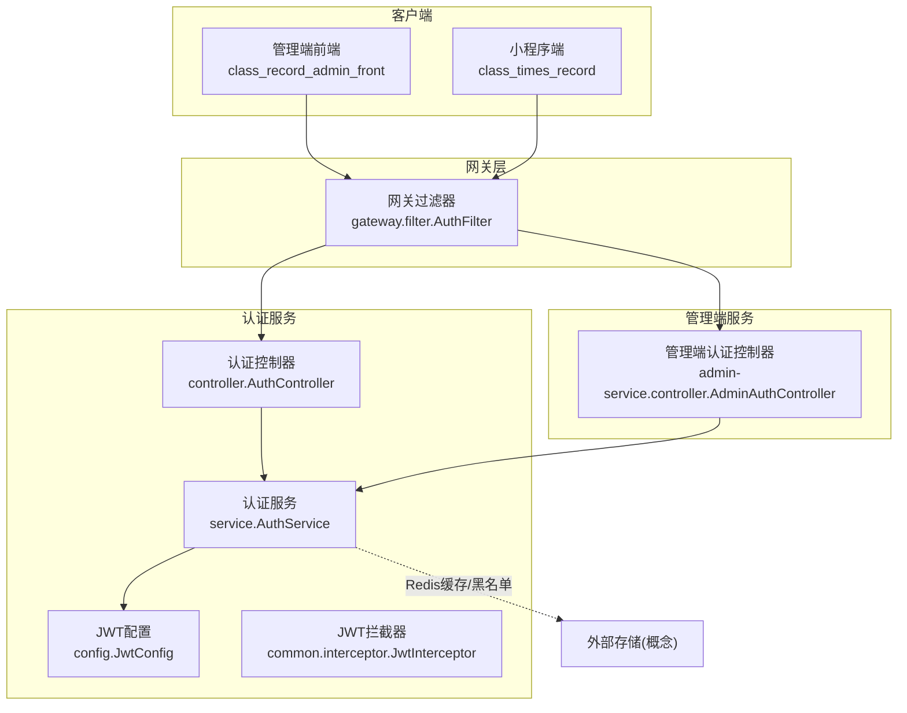
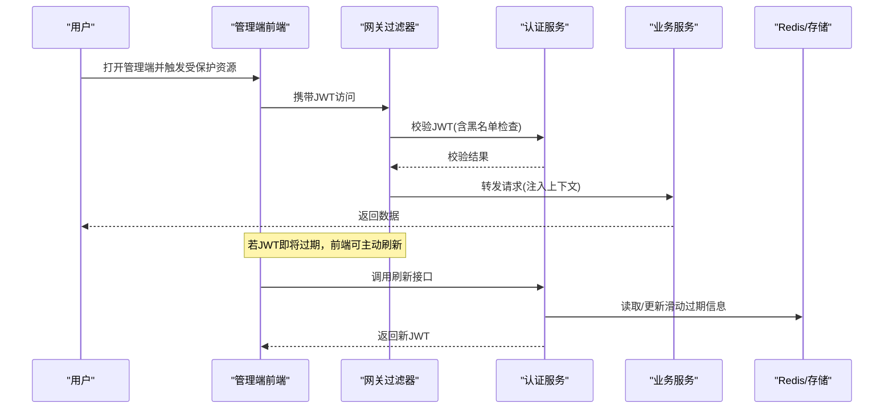
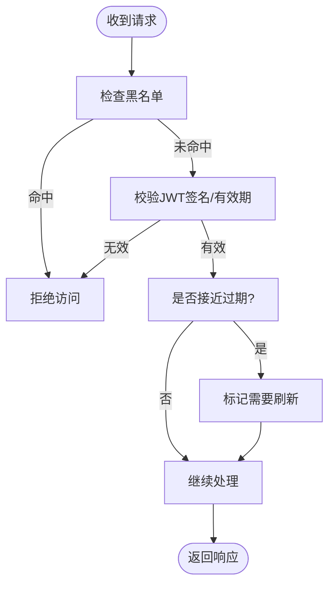
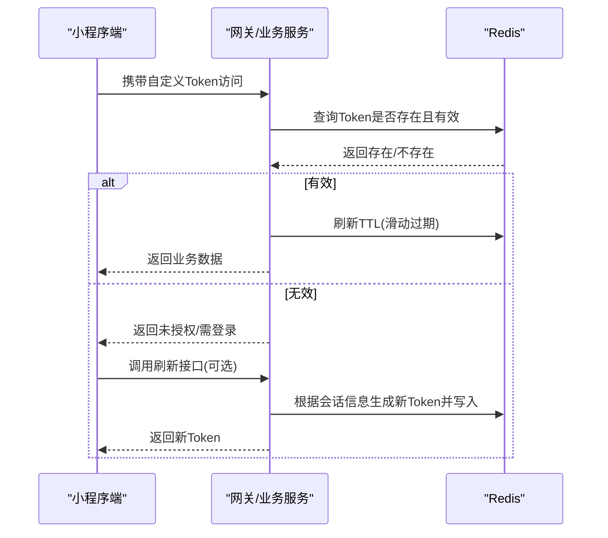
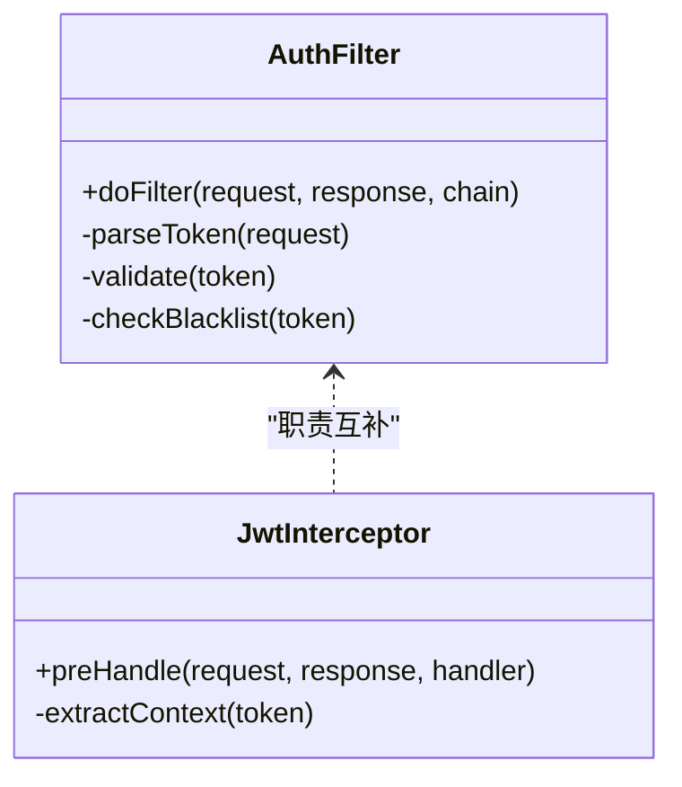
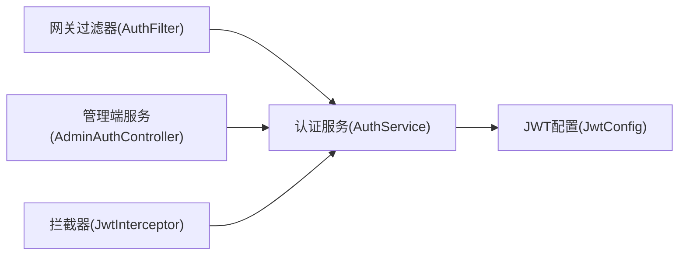
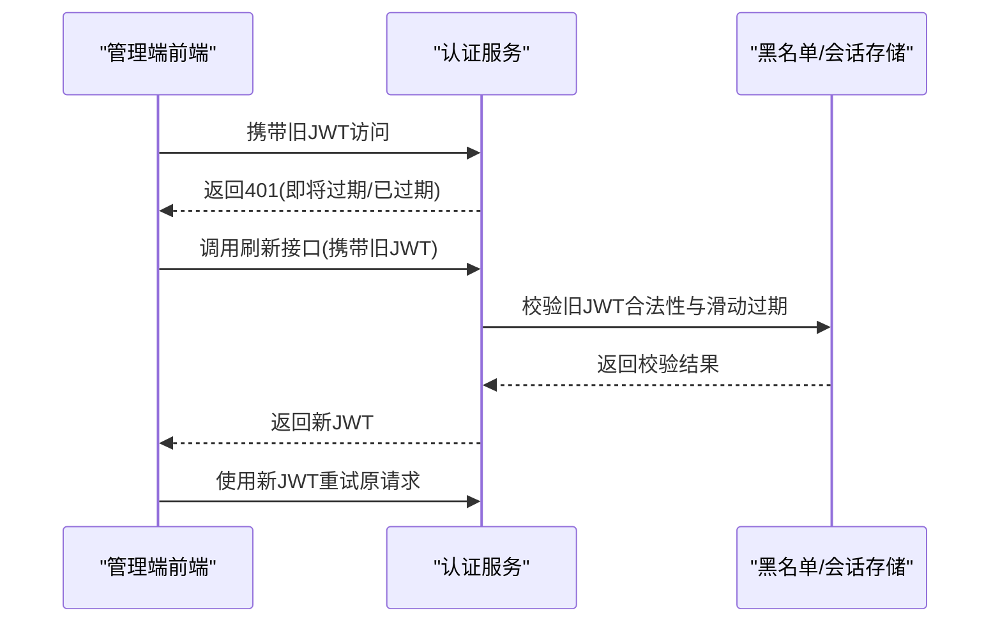
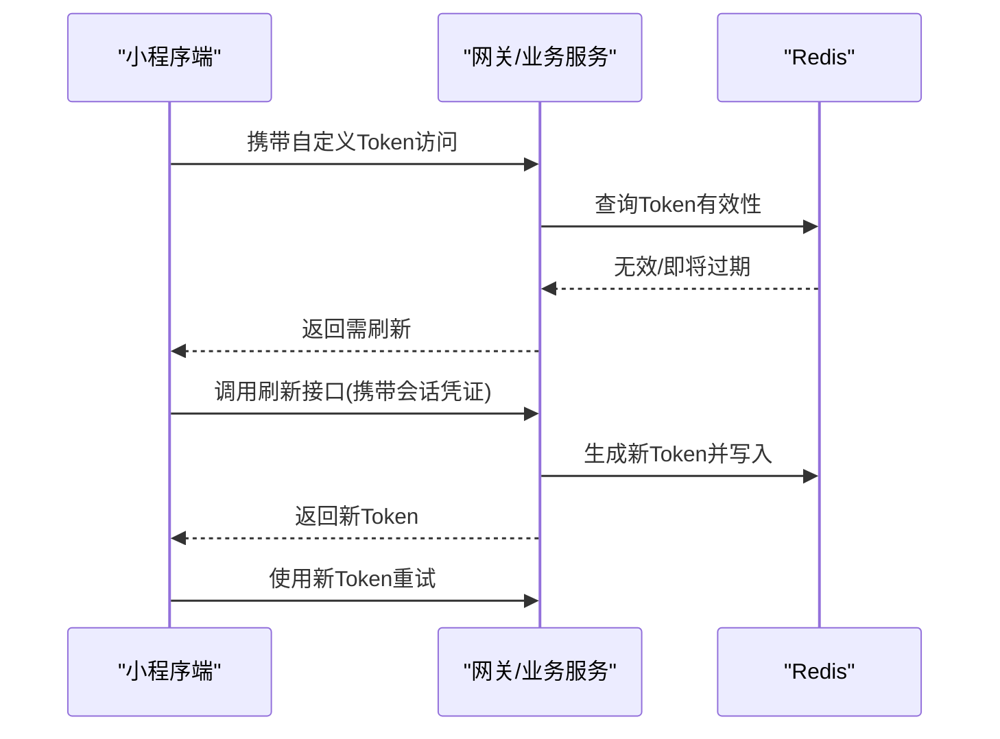

# JWT令牌管理

<cite>
**本文引用的文件**   
- [auth-service/src/main/java/com/shiroko/config/JwtConfig.java](file://class_times_record_back/auth-service/src/main/java/com/shiroko/config/JwtConfig.java)
- [auth-service/src/main/java/com/shiroko/service/AuthService.java](file://class_times_record_back/auth-service/src/main/java/com/shiroko/service/AuthService.java)
- [auth-service/src/main/java/com/shiroko/controller/AuthController.java](file://class_times_record_back/auth-service/src/main/java/com/shiroko/controller/AuthController.java)
- [common/src/main/java/com/shiroko/interceptor/JwtInterceptor.java](file://class_times_record_back/common/src/main/java/com/shiroko/interceptor/JwtInterceptor.java)
- [gateway/src/main/java/com/shiroko/gateway/filter/AuthFilter.java](file://class_times_record_back/gateway/src/main/java/com/shiroko/gateway/filter/AuthFilter.java)
- [admin-service/src/main/java/com/shiroko/controller/AdminAuthController.java](file://class_times_record_back/admin-service/src/main/java/com/shiroko/controller/AdminAuthController.java)
- [class_record_admin_front/src/api/auth/index.ts](file://class_record_admin_front/src/api/auth/index.ts)
- [class_record_admin_front/src/utils/request.ts](file://class_record_admin_front/src/utils/request.ts)
- [class_times_record/src/api/auth/index.ts](file://class_times_record/src/api/auth/index.ts)
- [class_times_record/src/utils/request/index.ts](file://class_times_record/src/utils/request/index.ts)
</cite>

## 目录
1. [简介](#简介)
2. [项目结构](#项目结构)
3. [核心组件](#核心组件)
4. [架构总览](#架构总览)
5. [详细组件分析](#详细组件分析)
6. [依赖关系分析](#依赖关系分析)
7. [性能考虑](#性能考虑)
8. [故障排查指南](#故障排查指南)
9. [结论](#结论)
10. [附录](#附录)

## 简介
本文件围绕JWT令牌的完整生命周期，系统化阐述在该项目中的实现与策略：
- 小程序端：采用“自定义Token + Redis缓存”的会话式方案，强调无状态校验与集中式失效控制。
- 管理端：采用“标准JWT + 黑名单机制”，支持滑动过期与无感续期。
- 安全与算法：说明HS256/RS256的选择、载荷设计、有效期配置及跨域、防重放等最佳实践。
- 刷新流程：给出滑动过期与无感续期的实现细节与流程图。
- 排障与优化：提供常见问题定位方法与性能调优建议。

## 项目结构
后端采用微服务分层：认证服务负责签发与验证；网关统一鉴权拦截；业务服务承载具体功能；前端包含管理端与小程序端两套客户端。

图示来源
- [gateway/src/main/java/com/shiroko/gateway/filter/AuthFilter.java](file://class_times_record_back/gateway/src/main/java/com/shiroko/gateway/filter/AuthFilter.java)
- [auth-service/src/main/java/com/shiroko/controller/AuthController.java](file://class_times_record_back/auth-service/src/main/java/com/shiroko/controller/AuthController.java)
- [auth-service/src/main/java/com/shiroko/service/AuthService.java](file://class_times_record_back/auth-service/src/main/java/com/shiroko/service/AuthService.java)
- [auth-service/src/main/java/com/shiroko/config/JwtConfig.java](file://class_times_record_back/auth-service/src/main/java/com/shiroko/config/JwtConfig.java)
- [common/src/main/java/com/shiroko/interceptor/JwtInterceptor.java](file://class_times_record_back/common/src/main/java/com/shiroko/interceptor/JwtInterceptor.java)
- [admin-service/src/main/java/com/shiroko/controller/AdminAuthController.java](file://class_times_record_back/admin-service/src/main/java/com/shiroko/controller/AdminAuthController.java)

章节来源
- [auth-service/src/main/java/com/shiroko/controller/AuthController.java](file://class_times_record_back/auth-service/src/main/java/com/shiroko/controller/AuthController.java)
- [auth-service/src/main/java/com/shiroko/service/AuthService.java](file://class_times_record_back/auth-service/src/main/java/com/shiroko/service/AuthService.java)
- [auth-service/src/main/java/com/shiroko/config/JwtConfig.java](file://class_times_record_back/auth-service/src/main/java/com/shiroko/config/JwtConfig.java)
- [common/src/main/java/com/shiroko/interceptor/JwtInterceptor.java](file://class_times_record_back/common/src/main/java/com/shiroko/interceptor/JwtInterceptor.java)
- [gateway/src/main/java/com/shiroko/gateway/filter/AuthFilter.java](file://class_times_record_back/gateway/src/main/java/com/shiroko/gateway/filter/AuthFilter.java)
- [admin-service/src/main/java/com/shiroko/controller/AdminAuthController.java](file://class_times_record_back/admin-service/src/main/java/com/shiroko/controller/AdminAuthController.java)

## 核心组件
- 认证控制器（AuthController）：暴露登录、登出、刷新等接口，协调AuthService完成令牌生成与校验。
- 认证服务（AuthService）：封装令牌签发、校验、刷新、黑名单管理等核心逻辑。
- JWT配置（JwtConfig）：集中管理签名算法、密钥、过期时间等参数。
- 网关过滤器（AuthFilter）：统一对请求进行令牌解析与权限前置校验。
- 拦截器（JwtInterceptor）：在业务服务内部二次校验或注入上下文（可选）。
- 管理端认证控制器（AdminAuthController）：面向管理端的专用认证入口，可复用AuthService能力。

章节来源
- [auth-service/src/main/java/com/shiroko/controller/AuthController.java](file://class_times_record_back/auth-service/src/main/java/com/shiroko/controller/AuthController.java)
- [auth-service/src/main/java/com/shiroko/service/AuthService.java](file://class_times_record_back/auth-service/src/main/java/com/shiroko/service/AuthService.java)
- [auth-service/src/main/java/com/shiroko/config/JwtConfig.java](file://class_times_record_back/auth-service/src/main/java/com/shiroko/config/JwtConfig.java)
- [common/src/main/java/com/shiroko/interceptor/JwtInterceptor.java](file://class_times_record_back/common/src/main/java/com/shiroko/interceptor/JwtInterceptor.java)
- [gateway/src/main/java/com/shiroko/gateway/filter/AuthFilter.java](file://class_times_record_back/gateway/src/main/java/com/shiroko/gateway/filter/AuthFilter.java)
- [admin-service/src/main/java/com/shiroko/controller/AdminAuthController.java](file://class_times_record_back/admin-service/src/main/java/com/shiroko/controller/AdminAuthController.java)

## 架构总览
整体认证链路分为两条路径：
- 管理端：浏览器访问管理端页面，通过网关进入管理端服务或直接调用认证服务，使用标准JWT，配合黑名单与滑动过期。
- 小程序端：移动端发起请求，携带自定义Token，由网关或业务服务结合Redis进行校验与续期。

图示来源
- [gateway/src/main/java/com/shiroko/gateway/filter/AuthFilter.java](file://class_times_record_back/gateway/src/main/java/com/shiroko/gateway/filter/AuthFilter.java)
- [auth-service/src/main/java/com/shiroko/service/AuthService.java](file://class_times_record_back/auth-service/src/main/java/com/shiroko/service/AuthService.java)
- [auth-service/src/main/java/com/shiroko/controller/AuthController.java](file://class_times_record_back/auth-service/src/main/java/com/shiroko/controller/AuthController.java)

## 详细组件分析

### 管理端：标准JWT + 黑名单 + 滑动过期
- 令牌生成与签名
  - 使用对称或非对称算法（HS256/RS256），由配置中心统一管理密钥与算法选择。
  - 载荷包含最小必要信息（如用户标识、角色/权限集合、签发时间、过期时间等），避免敏感信息入载。
- 令牌验证
  - 网关层优先校验签名与基础有效性，必要时再调用认证服务进行黑名单检查。
  - 业务服务可通过拦截器二次校验或从上下文获取用户信息。
- 黑名单机制
  - 用户登出或强制下线时，将当前令牌加入黑名单，设置TTL等于剩余有效期。
  - 校验阶段先查黑名单，命中则拒绝。
- 滑动过期与无感续期
  - 滑动过期：每次成功访问均刷新“最后活跃时间”，当距上次活跃超过阈值则要求重新登录。
  - 无感续期：前端在检测到旧令牌即将过期时，静默调用刷新接口，用新令牌替换本地存储，不中断用户操作。

图示来源
- [auth-service/src/main/java/com/shiroko/service/AuthService.java](file://class_times_record_back/auth-service/src/main/java/com/shiroko/service/AuthService.java)
- [gateway/src/main/java/com/shiroko/gateway/filter/AuthFilter.java](file://class_times_record_back/gateway/src/main/java/com/shiroko/gateway/filter/AuthFilter.java)
- [auth-service/src/main/java/com/shiroko/config/JwtConfig.java](file://class_times_record_back/auth-service/src/main/java/com/shiroko/config/JwtConfig.java)

章节来源
- [auth-service/src/main/java/com/shiroko/service/AuthService.java](file://class_times_record_back/auth-service/src/main/java/com/shiroko/service/AuthService.java)
- [auth-service/src/main/java/com/shiroko/config/JwtConfig.java](file://class_times_record_back/auth-service/src/main/java/com/shiroko/config/JwtConfig.java)
- [gateway/src/main/java/com/shiroko/gateway/filter/AuthFilter.java](file://class_times_record_back/gateway/src/main/java/com/shiroko/gateway/filter/AuthFilter.java)
- [admin-service/src/main/java/com/shiroko/controller/AdminAuthController.java](file://class_times_record_back/admin-service/src/main/java/com/shiroko/controller/AdminAuthController.java)

### 小程序端：自定义Token + Redis缓存
- 令牌形式
  - 服务端生成随机字符串作为会话ID（自定义Token），将其与用户身份、权限、设备指纹等信息以键值形式存入Redis。
- 令牌校验
  - 网关或业务服务在请求头中解析自定义Token，查询Redis判断是否存在且未过期。
- 刷新与续期
  - 每次访问成功后，刷新对应Key的TTL，实现滑动过期。
  - 小程序端可在网络层检测401或特定错误码后，自动调用刷新接口，拿到新的自定义Token并更新本地存储。
- 登出与失效
  - 登出即删除Redis中对应Key；强制下线时按用户维度批量清理。

图示来源
- [auth-service/src/main/java/com/shiroko/service/AuthService.java](file://class_times_record_back/auth-service/src/main/java/com/shiroko/service/AuthService.java)
- [auth-service/src/main/java/com/shiroko/controller/AuthController.java](file://class_times_record_back/auth-service/src/main/java/com/shiroko/controller/AuthController.java)

章节来源
- [auth-service/src/main/java/com/shiroko/service/AuthService.java](file://class_times_record_back/auth-service/src/main/java/com/shiroko/service/AuthService.java)
- [auth-service/src/main/java/com/shiroko/controller/AuthController.java](file://class_times_record_back/auth-service/src/main/java/com/shiroko/controller/AuthController.java)

### 网关与拦截器
- 网关过滤器（AuthFilter）
  - 统一解析请求头中的令牌，执行签名校验、黑名单检查与路由放行。
  - 对无需鉴权的白名单路径直接放行。
- 拦截器（JwtInterceptor）
  - 在业务服务内对关键接口做二次校验，或将用户上下文注入到线程局部变量中供后续处理使用。

图示来源
- [gateway/src/main/java/com/shiroko/gateway/filter/AuthFilter.java](file://class_times_record_back/gateway/src/main/java/com/shiroko/gateway/filter/AuthFilter.java)
- [common/src/main/java/com/shiroko/interceptor/JwtInterceptor.java](file://class_times_record_back/common/src/main/java/com/shiroko/interceptor/JwtInterceptor.java)

章节来源
- [gateway/src/main/java/com/shiroko/gateway/filter/AuthFilter.java](file://class_times_record_back/gateway/src/main/java/com/shiroko/gateway/filter/AuthFilter.java)
- [common/src/main/java/com/shiroko/interceptor/JwtInterceptor.java](file://class_times_record_back/common/src/main/java/com/shiroko/interceptor/JwtInterceptor.java)

### 前端集成要点
- 管理端
  - 在HTTP请求拦截器中统一附加Authorization头，并在401时尝试刷新令牌。
  - 刷新成功后重试原请求，保证无感续期体验。
- 小程序端
  - 在请求封装中统一附加自定义Token，并在失败回调中触发刷新流程。
  - 注意本地存储的安全性与跨域限制。

章节来源
- [class_record_admin_front/src/api/auth/index.ts](file://class_record_admin_front/src/api/auth/index.ts)
- [class_record_admin_front/src/utils/request.ts](file://class_record_admin_front/src/utils/request.ts)
- [class_times_record/src/api/auth/index.ts](file://class_times_record/src/api/auth/index.ts)
- [class_times_record/src/utils/request/index.ts](file://class_times_record/src/utils/request/index.ts)

## 依赖关系分析
- 组件耦合
  - 认证服务为所有令牌的权威来源，被网关与管理端服务共同依赖。
  - 网关过滤器与业务拦截器形成双重校验，提升安全性与可观测性。
- 外部依赖
  - Redis用于会话与黑名单存储，需关注高可用与持久化策略。
  - 配置中心用于动态下发签名算法与密钥轮换策略。

图示来源
- [auth-service/src/main/java/com/shiroko/service/AuthService.java](file://class_times_record_back/auth-service/src/main/java/com/shiroko/service/AuthService.java)
- [auth-service/src/main/java/com/shiroko/config/JwtConfig.java](file://class_times_record_back/auth-service/src/main/java/com/shiroko/config/JwtConfig.java)
- [gateway/src/main/java/com/shiroko/gateway/filter/AuthFilter.java](file://class_times_record_back/gateway/src/main/java/com/shiroko/gateway/filter/AuthFilter.java)
- [admin-service/src/main/java/com/shiroko/controller/AdminAuthController.java](file://class_times_record_back/admin-service/src/main/java/com/shiroko/controller/AdminAuthController.java)
- [common/src/main/java/com/shiroko/interceptor/JwtInterceptor.java](file://class_times_record_back/common/src/main/java/com/shiroko/interceptor/JwtInterceptor.java)

章节来源
- [auth-service/src/main/java/com/shiroko/service/AuthService.java](file://class_times_record_back/auth-service/src/main/java/com/shiroko/service/AuthService.java)
- [auth-service/src/main/java/com/shiroko/config/JwtConfig.java](file://class_times_record_back/auth-service/src/main/java/com/shiroko/config/JwtConfig.java)
- [gateway/src/main/java/com/shiroko/gateway/filter/AuthFilter.java](file://class_times_record_back/gateway/src/main/java/com/shiroko/gateway/filter/AuthFilter.java)
- [admin-service/src/main/java/com/shiroko/controller/AdminAuthController.java](file://class_times_record_back/admin-service/src/main/java/com/shiroko/controller/AdminAuthController.java)
- [common/src/main/java/com/shiroko/interceptor/JwtInterceptor.java](file://class_times_record_back/common/src/main/java/com/shiroko/interceptor/JwtInterceptor.java)

## 性能考虑
- 令牌校验路径尽量短：网关层只做轻量校验，复杂逻辑下沉至认证服务。
- 减少Redis热点：对高频访问的用户令牌采用本地缓存+异步落盘策略（需权衡一致性）。
- 合理设置过期时间：短生命周期的JWT配合无感续期，降低黑名单规模与校验压力。
- 批量操作优化：强制下线时使用管道或批量命令清理黑名单/会话。
- 连接池与超时：确保Redis、数据库、配置中心的连接池与超时参数合理，避免雪崩。

## 故障排查指南
- 常见现象与定位
  - 401未授权：检查请求头是否携带正确令牌；确认网关是否放行白名单；查看认证服务日志。
  - 频繁刷新：检查滑动过期阈值与前端刷新时机；确认Redis TTL是否被正常刷新。
  - 登出后仍可访问：确认黑名单是否写入成功；检查网关校验是否命中黑名单分支。
- 快速自检清单
  - 密钥与算法配置一致（HS256/RS256）。
  - 服务器时钟同步（NTP），避免时间漂移导致提前过期。
  - Redis连通性与容量监控。
  - 前端网络层是否正确重试与刷新。
- 日志与指标
  - 记录令牌签发、校验、刷新、黑名单命中等关键事件。
  - 监控校验耗时、失败率、刷新成功率与Redis命中率。

## 结论
本项目针对两类客户端采用差异化令牌策略：管理端以标准JWT为核心，结合黑名单与滑动过期实现强一致与无感续期；小程序端以自定义Token配合Redis实现灵活可控的会话管理。通过网关与拦截器的双层校验、合理的过期策略与安全最佳实践，系统在安全性、可用性与性能之间取得平衡。

## 附录

### 安全最佳实践
- 算法与密钥
  - 对外部不可信环境优先使用非对称算法（RS256），内部可信环境可使用对称算法（HS256）以获得更高吞吐。
  - 密钥定期轮换，支持灰度切换与回滚。
- 载荷设计
  - 仅包含必要字段，避免敏感信息入载；使用子声明区分不同客户端类型。
- 有效期与刷新
  - 短生命周期JWT（如5-15分钟）+ 滑动过期（如30分钟）+ 无感续期。
- 防重放攻击
  - 关键接口增加nonce与时间戳，服务端去重窗口校验。
- 令牌泄露防护
  - 禁止将令牌放入URL或日志；HTTPS传输；HttpOnly Cookie（如适用）；前端最小权限原则。
- 跨域安全
  - 严格CORS白名单；SameSite策略；CSRF防护（如使用Cookie场景）。

### 令牌刷新流程（管理端）

图示来源
- [auth-service/src/main/java/com/shiroko/service/AuthService.java](file://class_times_record_back/auth-service/src/main/java/com/shiroko/service/AuthService.java)
- [auth-service/src/main/java/com/shiroko/controller/AuthController.java](file://class_times_record_back/auth-service/src/main/java/com/shiroko/controller/AuthController.java)

### 令牌刷新流程（小程序端）

图示来源
- [auth-service/src/main/java/com/shiroko/service/AuthService.java](file://class_times_record_back/auth-service/src/main/java/com/shiroko/service/AuthService.java)
- [auth-service/src/main/java/com/shiroko/controller/AuthController.java](file://class_times_record_back/auth-service/src/main/java/com/shiroko/controller/AuthController.java)