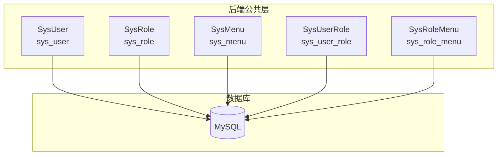
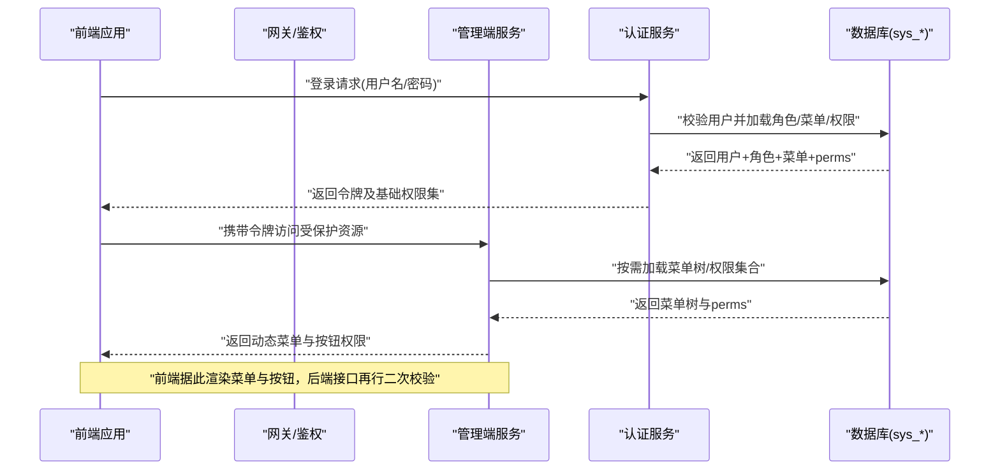
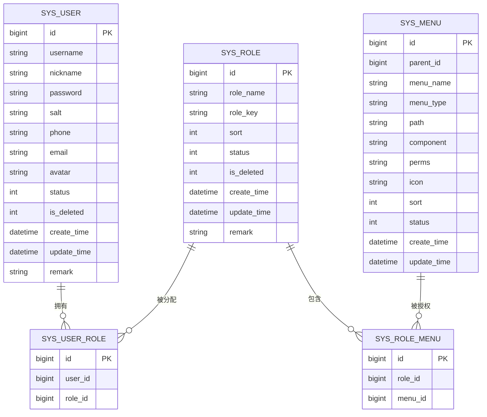
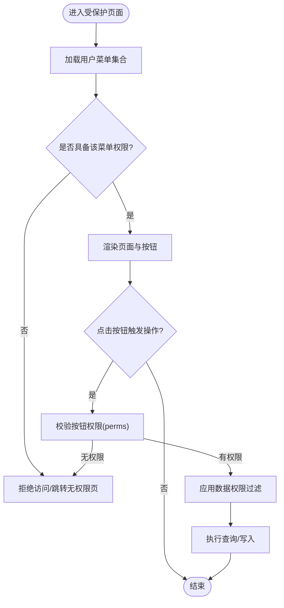
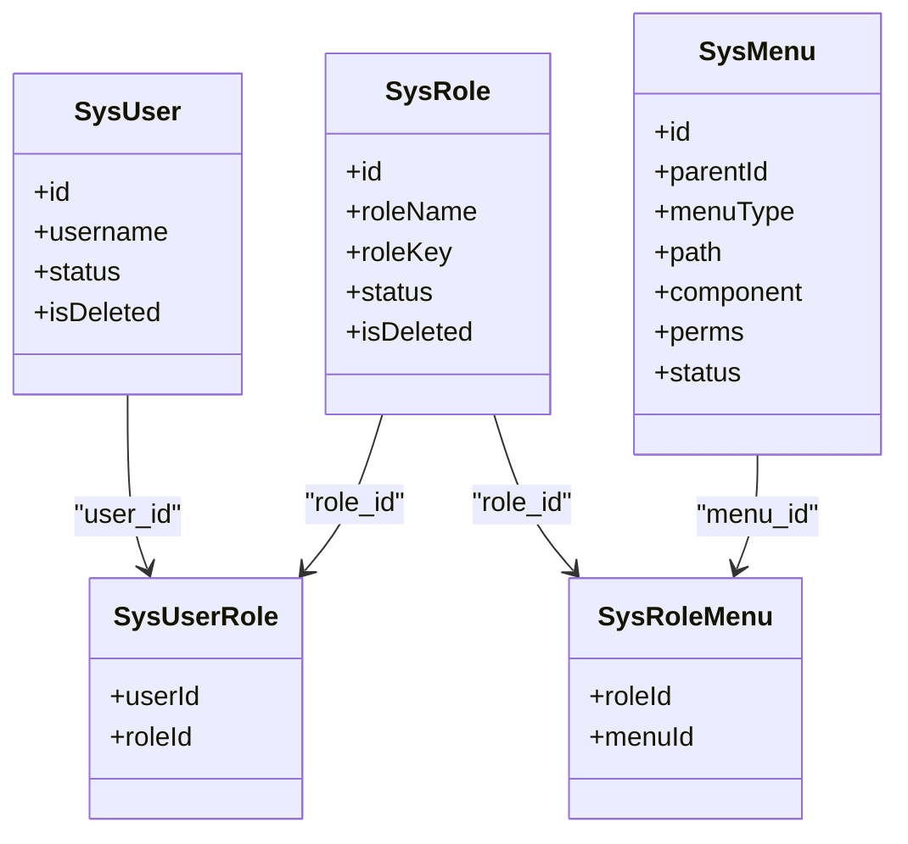

# 权限控制模型

<cite>
**本文引用的文件**   
- [SysUser.java](file://class_times_record_back/common/src/main/java/com/shiroko/repository/entity/SysUser.java)
- [SysRole.java](file://class_times_record_back/common/src/main/java/com/shiroko/repository/entity/SysRole.java)
- [SysMenu.java](file://class_times_record_back/common/src/main/java/com/shiroko/repository/entity/SysMenu.java)
- [SysUserRole.java](file://class_times_record_back/common/src/main/java/com/shiroko/repository/entity/SysUserRole.java)
- [SysRoleMenu.java](file://class_times_record_back/common/src/main/java/com/shiroko/repository/entity/SysRoleMenu.java)
- [architecture.md](file://class_times_record_back/docs/architecture.md)
- [class_times_record.sql](file://class_times_record_back/docs/class_times_record.sql)
- [CLAUDE.md](file://CLAUDE.md)
</cite>

## 目录
1. [简介](#简介)
2. [项目结构](#项目结构)
3. [核心组件](#核心组件)
4. [架构总览](#架构总览)
5. [详细组件分析](#详细组件分析)
6. [依赖关系分析](#依赖关系分析)
7. [性能考虑](#性能考虑)
8. [故障排查指南](#故障排查指南)
9. [结论](#结论)
10. [附录](#附录)

## 简介
本文件围绕基于 RBAC（基于角色的访问控制）的权限体系进行系统化说明，覆盖用户-角色-权限的多对多关系、三级权限控制（菜单权限、按钮权限、数据权限）、权限数据存储结构、校验机制与前端联动、配置维护流程以及扩展点设计。文档以仓库中已实现的实体与数据库定义为依据，并结合通用工程实践给出可落地的实现建议。

## 项目结构
后端采用微服务分层，权限相关实体集中在 common 模块的 repository.entity 包下；系统管理相关的表结构与说明在 docs 目录下提供。前端包含 admin 与移动端两个客户端，均通过 API 获取菜单与权限信息以实现动态渲染与操作控制。

图表来源
- [SysUser.java:1-50](file://class_times_record_back/common/src/main/java/com/shiroko/repository/entity/SysUser.java#L1-L50)
- [SysRole.java:1-42](file://class_times_record_back/common/src/main/java/com/shiroko/repository/entity/SysRole.java#L1-L42)
- [SysMenu.java:1-46](file://class_times_record_back/common/src/main/java/com/shiroko/repository/entity/SysMenu.java#L1-L46)
- [SysUserRole.java:1-28](file://class_times_record_back/common/src/main/java/com/shiroko/repository/entity/SysUserRole.java#L1-L28)
- [SysRoleMenu.java:1-25](file://class_times_record_back/common/src/main/java/com/shiroko/repository/entity/SysRoleMenu.java#L1-L25)

章节来源
- [architecture.md:413-417](file://class_times_record_back/docs/architecture.md#L413-L417)
- [CLAUDE.md:75-113](file://CLAUDE.md#L75-L113)

## 核心组件
- 用户实体：承载管理员账号基本信息与状态字段，用于登录认证与上下文构建。
- 角色实体：承载角色标识与排序、状态等元信息，作为权限聚合单元。
- 菜单实体：承载菜单树节点、路由路径、组件映射、权限标识 perms 等，支撑菜单与按钮级权限。
- 用户-角色关联：实现用户到角色的多对多映射。
- 角色-菜单关联：实现角色到菜单/按钮的多对多映射。

上述实体与表名一一对应，构成 RBAC 的核心骨架。

章节来源
- [SysUser.java:14-49](file://class_times_record_back/common/src/main/java/com/shiroko/repository/entity/SysUser.java#L14-L49)
- [SysRole.java:14-41](file://class_times_record_back/common/src/main/java/com/shiroko/repository/entity/SysRole.java#L14-L41)
- [SysMenu.java:13-45](file://class_times_record_back/common/src/main/java/com/shiroko/repository/entity/SysMenu.java#L13-L45)
- [SysUserRole.java:12-27](file://class_times_record_back/common/src/main/java/com/shiroko/repository/entity/SysUserRole.java#L12-L27)
- [SysRoleMenu.java:11-24](file://class_times_record_back/common/src/main/java/com/shiroko/repository/entity/SysRoleMenu.java#L11-L24)

## 架构总览
RBAC 三层权限控制在本系统中的落地方式如下：
- 菜单权限：由 sys_menu 的 menuType/path/component 决定页面是否可见并可路由。
- 按钮权限：由 sys_menu.perms 标识具体操作，前端根据 perms 集合控制按钮显隐，后端接口使用注解或拦截器校验。
- 数据权限：通过业务层按租户/机构/部门/个人维度过滤数据范围，可在查询时注入条件或在 SQL 层面拼接。

图表来源
- [SysMenu.java:20-31](file://class_times_record_back/common/src/main/java/com/shiroko/repository/entity/SysMenu.java#L20-L31)
- [SysRoleMenu.java:18-21](file://class_times_record_back/common/src/main/java/com/shiroko/repository/entity/SysRoleMenu.java#L18-L21)
- [SysUserRole.java:19-23](file://class_times_record_back/common/src/main/java/com/shiroko/repository/entity/SysUserRole.java#L19-L23)

## 详细组件分析

### 实体与表结构设计
- sys_user：管理员用户主表，含用户名、昵称、密码、盐、联系方式、头像、状态、逻辑删除、时间戳等。
- sys_role：角色主表，含角色名、角色键、排序、状态、逻辑删除、时间戳等。
- sys_menu：菜单/按钮主表，含父节点、名称、类型、路径、组件、权限标识 perms、图标、排序、状态、时间戳等。
- sys_user_role：用户-角色关联表，记录 user_id 与 role_id。
- sys_role_menu：角色-菜单关联表，记录 role_id 与 menu_id。

图表来源
- [SysUser.java:14-49](file://class_times_record_back/common/src/main/java/com/shiroko/repository/entity/SysUser.java#L14-L49)
- [SysRole.java:14-41](file://class_times_record_back/common/src/main/java/com/shiroko/repository/entity/SysRole.java#L14-L41)
- [SysMenu.java:13-45](file://class_times_record_back/common/src/main/java/com/shiroko/repository/entity/SysMenu.java#L13-L45)
- [SysUserRole.java:12-27](file://class_times_record_back/common/src/main/java/com/shiroko/repository/entity/SysUserRole.java#L12-L27)
- [SysRoleMenu.java:11-24](file://class_times_record_back/common/src/main/java/com/shiroko/repository/entity/SysRoleMenu.java#L11-L24)
- [class_times_record.sql:318-366](file://class_times_record_back/docs/class_times_record.sql#L318-L366)

章节来源
- [architecture.md:413-417](file://class_times_record_back/docs/architecture.md#L413-L417)
- [class_times_record.sql:318-366](file://class_times_record_back/docs/class_times_record.sql#L318-L366)
- [CLAUDE.md:108-113](file://CLAUDE.md#L108-L113)

### 三级权限控制详解
- 菜单权限（页面访问控制）
  - 依据 sys_menu.menuType/path/component 构建菜单树，前端根据当前用户拥有的菜单集合渲染导航与路由守卫。
  - 后端路由层结合用户权限集合进行二次校验，防止直接 URL 访问越权。
- 按钮权限（操作按钮显示控制）
  - 依据 sys_menu.perms 标识细粒度操作（如“新增/编辑/删除/导出”）。
  - 前端根据 perms 集合控制按钮显隐；后端接口通过注解式或拦截器校验 perms。
- 数据权限（数据范围控制）
  - 在业务查询层按组织/部门/个人维度注入过滤条件，确保仅返回用户有权访问的数据范围。
  - 可通过 MyBatis 拦截器或统一查询封装注入 WHERE 子句。

图表来源
- [SysMenu.java:20-31](file://class_times_record_back/common/src/main/java/com/shiroko/repository/entity/SysMenu.java#L20-L31)
- [SysRoleMenu.java:18-21](file://class_times_record_back/common/src/main/java/com/shiroko/repository/entity/SysRoleMenu.java#L18-L21)
- [SysUserRole.java:19-23](file://class_times_record_back/common/src/main/java/com/shiroko/repository/entity/SysUserRole.java#L19-L23)

### 权限校验实现机制
- 注解式权限控制
  - 在控制器方法上标注权限标识，由统一拦截器/切面解析当前用户 perms 集合进行匹配。
  - 未命中则抛出统一异常，前端统一处理提示。
- 动态菜单加载
  - 登录后从服务端拉取菜单树与 perms 集合，缓存至本地存储，用于路由生成与按钮显隐。
- 前端权限指令
  - 自定义指令或组合式函数，根据 perms 集合控制元素 v-if/v-show 或禁用态。
- 数据权限注入
  - 在 Service 层或 DAO 层统一注入数据范围条件，避免在各业务方法重复编写过滤逻辑。

章节来源
- [SysMenu.java:20-31](file://class_times_record_back/common/src/main/java/com/shiroko/repository/entity/SysMenu.java#L20-L31)
- [SysRoleMenu.java:18-21](file://class_times_record_back/common/src/main/java/com/shiroko/repository/entity/SysRoleMenu.java#L18-L21)
- [SysUserRole.java:19-23](file://class_times_record_back/common/src/main/java/com/shiroko/repository/entity/SysUserRole.java#L19-L23)

### 权限配置维护流程
- 角色与菜单授权
  - 在系统管理中创建/编辑角色，勾选对应菜单与按钮（perms），保存后更新 sys_role_menu。
- 用户角色分配
  - 为用户分配一个或多个角色，更新 sys_user_role。
- 实时生效方案
  - 变更完成后清理当前用户的权限缓存（若存在），前端重新拉取菜单与 perms，或推送事件强制刷新。
  - 后端可在热点场景引入 Redis 缓存用户权限集合，并提供失效接口。

章节来源
- [SysUserRole.java:19-23](file://class_times_record_back/common/src/main/java/com/shiroko/repository/entity/SysUserRole.java#L19-L23)
- [SysRoleMenu.java:18-21](file://class_times_record_back/common/src/main/java/com/shiroko/repository/entity/SysRoleMenu.java#L18-L21)
- [SysMenu.java:20-31](file://class_times_record_back/common/src/main/java/com/shiroko/repository/entity/SysMenu.java#L20-L31)

### 扩展点与自定义权限规则
- 扩展点
  - 自定义权限注解：在统一切面中扩展新的注解解析逻辑。
  - 数据权限策略：定义数据范围策略接口，按租户/组织/项目等维度注入过滤条件。
  - 权限缓存策略：支持多级缓存（本地+分布式）与失效策略。
- 自定义规则示例
  - 基于资源的复杂规则：如“仅本人或本部门负责人可编辑”。
  - 动态表达式：将规则参数化，通过表达式引擎评估。
  - 审计与告警：对越权尝试进行日志记录与告警。

章节来源
- [SysMenu.java:20-31](file://class_times_record_back/common/src/main/java/com/shiroko/repository/entity/SysMenu.java#L20-L31)
- [SysRoleMenu.java:18-21](file://class_times_record_back/common/src/main/java/com/shiroko/repository/entity/SysRoleMenu.java#L18-L21)
- [SysUserRole.java:19-23](file://class_times_record_back/common/src/main/java/com/shiroko/repository/entity/SysUserRole.java#L19-L23)

## 依赖关系分析
- 实体耦合
  - SysUser 与 SysUserRole 通过 user_id 关联。
  - SysRole 与 SysUserRole、SysRoleMenu 分别通过 role_id 关联。
  - SysMenu 与 SysRoleMenu 通过 menu_id 关联。
- 外部依赖
  - 使用 MyBatis-Plus 注解进行表映射与逻辑删除。
  - 数据库约束保证外键一致性（参考 SQL 脚本中的外键定义）。

图表来源
- [SysUser.java:14-49](file://class_times_record_back/common/src/main/java/com/shiroko/repository/entity/SysUser.java#L14-L49)
- [SysRole.java:14-41](file://class_times_record_back/common/src/main/java/com/shiroko/repository/entity/SysRole.java#L14-L41)
- [SysMenu.java:13-45](file://class_times_record_back/common/src/main/java/com/shiroko/repository/entity/SysMenu.java#L13-L45)
- [SysUserRole.java:12-27](file://class_times_record_back/common/src/main/java/com/shiroko/repository/entity/SysUserRole.java#L12-L27)
- [SysRoleMenu.java:11-24](file://class_times_record_back/common/src/main/java/com/shiroko/repository/entity/SysRoleMenu.java#L11-L24)

章节来源
- [class_times_record.sql:356-366](file://class_times_record_back/docs/class_times_record.sql#L356-L366)

## 性能考虑
- 权限集合缓存
  - 将用户角色、菜单树与 perms 集合缓存至 Redis，降低频繁查询压力。
- 懒加载与增量更新
  - 菜单树可按需加载，权限变更时仅失效受影响用户的缓存。
- 批量查询
  - 一次性加载用户所有角色与菜单，减少 N+1 查询。
- 索引优化
  - 为 sys_user_role(user_id)、sys_role_menu(role_id)、sys_menu(id) 建立合适索引以提升关联查询效率。

## 故障排查指南
- 无法看到菜单
  - 检查用户是否已分配角色，角色是否已绑定对应菜单，确认前端是否正确拉取并缓存菜单树。
- 按钮不可见
  - 核对菜单项 perms 是否与前端指令使用的标识一致，确认后端接口是否放行。
- 数据越权
  - 检查数据权限过滤条件是否正确注入，确认查询是否遗漏了组织/部门维度。
- 权限变更后未生效
  - 确认是否清除了用户权限缓存，前端是否重新拉取菜单与 perms。

章节来源
- [SysMenu.java:20-31](file://class_times_record_back/common/src/main/java/com/shiroko/repository/entity/SysMenu.java#L20-L31)
- [SysRoleMenu.java:18-21](file://class_times_record_back/common/src/main/java/com/shiroko/repository/entity/SysRoleMenu.java#L18-L21)
- [SysUserRole.java:19-23](file://class_times_record_back/common/src/main/java/com/shiroko/repository/entity/SysUserRole.java#L19-L23)

## 结论
本项目以 sys_user/sys_role/sys_menu 为核心，配合 sys_user_role/sys_role_menu 完成 RBAC 多对多建模，并通过 perms 实现按钮级细粒度控制。结合前端动态菜单与指令、后端注解式校验与数据权限注入，形成端到端的权限闭环。建议在现有基础上完善缓存与审计能力，提升性能与可观测性。

## 附录
- 命名约定与表前缀
  - 业务表使用 c_ 前缀，系统管理表使用 sys_ 前缀，便于区分与治理。
- 关键表清单
  - sys_user、sys_role、sys_menu、sys_user_role、sys_role_menu、sys_operation_log、sys_config 等。

章节来源
- [CLAUDE.md:75-113](file://CLAUDE.md#L75-L113)