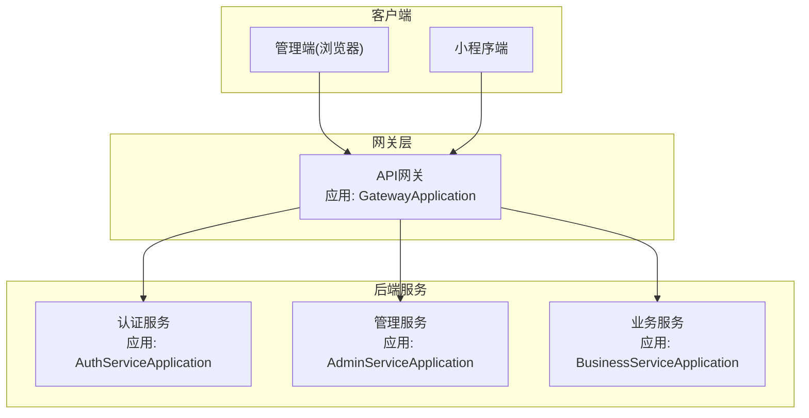
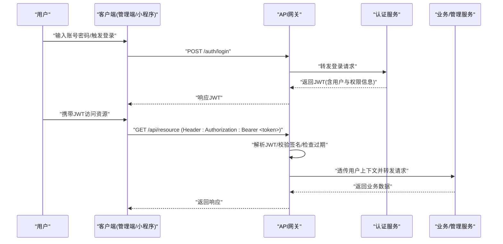
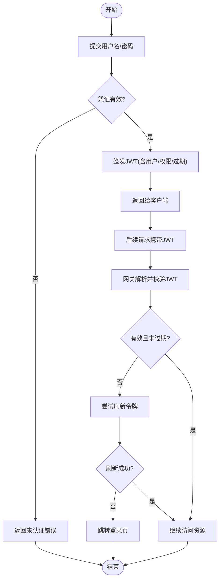
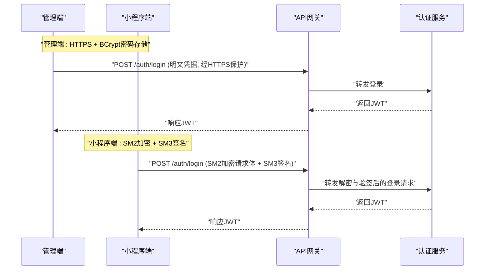
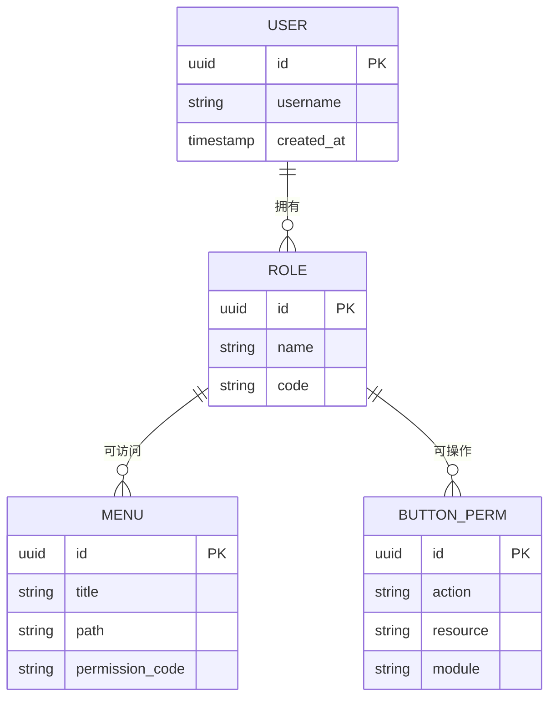
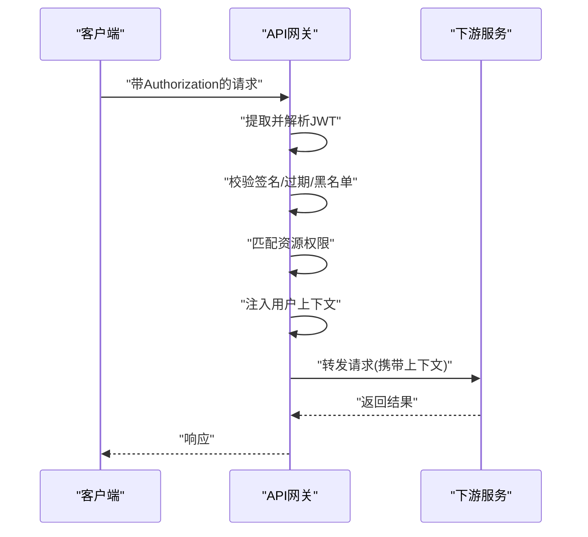
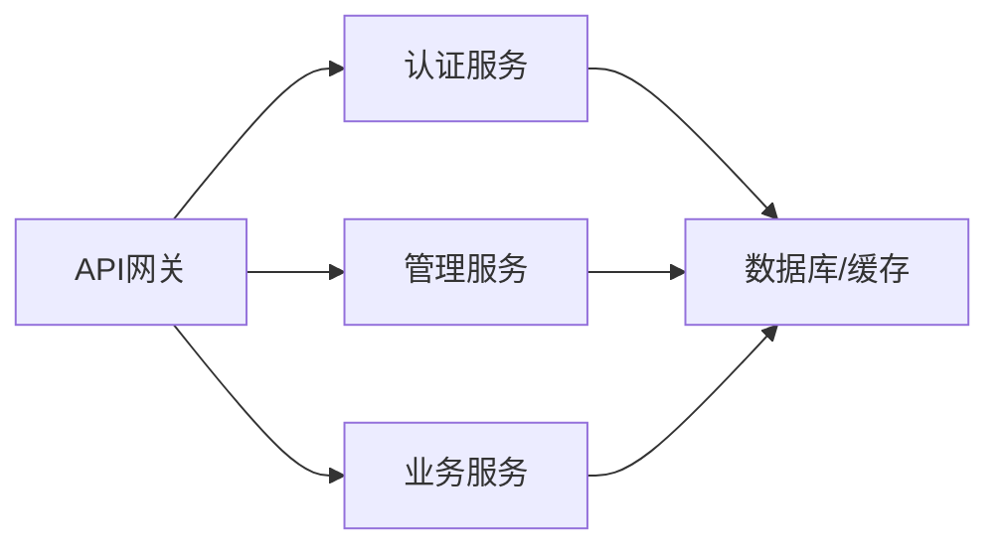

# 认证授权机制

<cite>
**本文引用的文件**   
- [AuthServiceApplication.java](file://class_times_record_back/auth-service/src/main/java/com/shiroko/AuthServiceApplication.java)
- [AdminServiceApplication.java](file://class_times_record_back/admin-service/src/main/java/com/shiroko/AdminServiceApplication.java)
- [BusinessServiceApplication.java](file://class_times_record_back/business-service/src/main/java/com/shiroko/BusinessServiceApplication.java)
- [GatewayApplication.java](file://class_times_record_back/gateway/src/main/java/com/shiroko/gateway/GatewayApplication.java)
</cite>

## 目录
1. [引言](#引言)
2. [项目结构](#项目结构)
3. [核心组件](#核心组件)
4. [架构总览](#架构总览)
5. [详细组件分析](#详细组件分析)
6. [依赖关系分析](#依赖关系分析)
7. [性能考量](#性能考量)
8. [故障排查指南](#故障排查指南)
9. [结论](#结论)
10. [附录](#附录)

## 引言
本文件围绕“认证与授权”主题，系统化阐述基于JWT的令牌生命周期管理（生成、验证、刷新、过期处理），并对比双端不同的认证流程：小程序端采用SM2加密传输与SM3签名校验，管理端采用HTTPS明文传输与BCrypt密码存储。同时说明权限控制模型（角色、菜单、按钮级细粒度控制）以及网关层JWT过滤器的解析、校验与用户信息注入流程。最后给出权限配置最佳实践、安全加固方案、常见攻击防护策略与会话管理建议。

## 项目结构
后端采用微服务架构，包含认证服务、管理服务、业务服务与API网关；前端包含管理端与小程序端两套客户端。各服务通过注册中心发现彼此，网关统一入口承载鉴权与路由。

**图示来源** 
- [GatewayApplication.java:1-17](file://class_times_record_back/gateway/src/main/java/com/shiroko/gateway/GatewayApplication.java#L1-L17)
- [AuthServiceApplication.java:1-21](file://class_times_record_back/auth-service/src/main/java/com/shiroko/AuthServiceApplication.java#L1-L17)
- [AdminServiceApplication.java:1-21](file://class_times_record_back/admin-service/src/main/java/com/shiroko/AdminServiceApplication.java#L1-L21)
- [BusinessServiceApplication.java:1-16](file://class_times_record_back/business-service/src/main/java/com/shiroko/BusinessServiceApplication.java#L1-L16)

**章节来源**
- [GatewayApplication.java:1-17](file://class_times_record_back/gateway/src/main/java/com/shiroko/gateway/GatewayApplication.java#L1-L17)
- [AuthServiceApplication.java:1-21](file://class_times_record_back/auth-service/src/main/java/com/shiroko/AuthServiceApplication.java#L1-L21)
- [AdminServiceApplication.java:1-21](file://class_times_record_back/admin-service/src/main/java/com/shiroko/AdminServiceApplication.java#L1-L21)
- [BusinessServiceApplication.java:1-16](file://class_times_record_back/business-service/src/main/java/com/shiroko/BusinessServiceApplication.java#L1-L16)

## 核心组件
- 认证服务：负责用户登录、令牌签发、刷新与注销等认证相关能力。
- 管理服务：面向管理员的权限与系统管理能力（角色、菜单、用户等）。
- 业务服务：承载具体业务逻辑，受网关鉴权保护。
- API网关：统一入口，执行JWT校验、权限判定与上下文注入，并将请求转发到对应服务。

上述四个服务的启动类已明确各自职责边界与运行入口，为后续认证授权流程提供基础支撑。

**章节来源**
- [AuthServiceApplication.java:1-21](file://class_times_record_back/auth-service/src/main/java/com/shiroko/AuthServiceApplication.java#L1-21)
- [AdminServiceApplication.java:1-21](file://class_times_record_back/admin-service/src/main/java/com/shiroko/AdminServiceApplication.java#L1-21)
- [BusinessServiceApplication.java:1-16](file://class_times_record_back/business-service/src/main/java/com/shiroko/BusinessServiceApplication.java#L1-16)
- [GatewayApplication.java:1-17](file://class_times_record_back/gateway/src/main/java/com/shiroko/gateway/GatewayApplication.java#L1-17)

## 架构总览
下图展示从客户端到网关再到各服务的整体调用路径，以及认证与授权在链路中的落点。

[此图为概念性流程图，不直接映射具体源码文件，故不提供图示来源]

## 详细组件分析

### JWT令牌生命周期管理
- 令牌生成
  - 登录成功后由认证服务签发JWT，载荷通常包含用户标识、角色与权限集合、签发时间、过期时间等。
  - 签名密钥应安全存储于服务端配置或密钥管理系统中，避免泄露。
- 令牌验证
  - 网关层对每个受保护请求进行JWT解析与签名校验，拒绝非法或篡改的令牌。
  - 校验失败时返回未认证或未授权错误码。
- 令牌刷新
  - 提供独立的刷新接口，使用短期有效的刷新令牌换取新的访问令牌，降低主令牌暴露风险。
  - 刷新需校验原令牌有效性、用户状态与服务端黑名单/撤销列表。
- 过期处理
  - 访问令牌设置较短有效期，刷新令牌设置较长有效期。
  - 前端在收到过期响应后自动调用刷新接口，若刷新失败则引导重新登录。
- 令牌撤销与登出
  - 支持将特定令牌加入黑名单或失效缓存，实现强制登出与敏感操作后的主动失效。

[此图为概念性流程图，不直接映射具体源码文件，故不提供图示来源]

### 双端认证流程差异
- 管理端（浏览器）
  - 传输层：HTTPS保障通道安全。
  - 密码存储：服务端使用BCrypt对密码进行加盐哈希存储，登录时比对哈希值。
  - 交互：登录成功后返回JWT，后续请求通过Authorization头携带。
- 小程序端
  - 传输层：同样走HTTPS。
  - 数据安全：请求体使用SM2公钥加密，防止中间人窃听；关键参数附加SM3签名，确保完整性与抗抵赖。
  - 交互：登录成功后同样返回JWT，后续请求携带JWT并进行必要的签名校验。

[此图为概念性流程图，不直接映射具体源码文件，故不提供图示来源]

### 权限控制模型（角色-菜单-按钮）
- 角色权限
  - 用户关联一个或多个角色，角色定义一组可访问的资源与操作。
- 菜单权限
  - 菜单项绑定角色或权限标识，前端根据用户权限动态渲染可见菜单。
- 按钮权限
  - 页面内按钮级别的控制，通过权限标识在前端条件渲染，在后端接口再次校验，形成前后端双重防护。
- 实现要点
  - 权限标识建议采用“模块:资源:动作”形式，便于细粒度控制。
  - 网关层可根据JWT中的权限集合做粗粒度拦截，业务层再做细粒度校验。

[此图为概念性ER图，不直接映射具体源码文件，故不提供图示来源]

### 网关层JWT过滤器工作原理
- Token解析
  - 从请求头提取Bearer Token，解析头部与载荷，校验签名与过期时间。
- 权限校验
  - 根据目标资源的权限要求与JWT中的权限集合进行匹配，不满足则拒绝。
- 用户信息注入
  - 将解析出的用户标识、角色与权限写入请求上下文，供下游服务消费。
- 白名单与灰度
  - 对登录、健康检查等接口放行；对敏感接口增强校验。

[此图为概念性流程图，不直接映射具体源码文件，故不提供图示来源]

## 依赖关系分析
- 服务间依赖
  - 网关作为统一入口，依赖认证服务完成鉴权，再路由至业务或服务端。
  - 认证服务依赖用户与权限数据源（数据库/缓存），用于签发与校验令牌。
- 外部依赖
  - 注册中心用于服务发现。
  - 缓存用于令牌黑名单与高频权限查询。
  - 密钥管理与证书用于签名与TLS。

[此图为概念性依赖图，不直接映射具体源码文件，故不提供图示来源]

## 性能考量
- 令牌体积与载荷
  - 避免在JWT中存放过多敏感或大对象数据，必要时仅存ID并在服务端缓存完整信息。
- 校验开销
  - 网关层集中校验，减少重复计算；对热点接口启用本地缓存与布隆过滤器加速黑名单判断。
- 刷新风暴
  - 限制刷新频率与并发，结合滑动过期策略降低频繁刷新带来的压力。
- 连接与超时
  - 合理设置网关与下游服务的连接池与超时，避免雪崩。

[本节为通用指导，不涉及具体源码文件]

## 故障排查指南
- 常见问题定位
  - 未认证：检查Authorization头是否存在、格式是否正确、是否被代理层移除。
  - 未授权：核对JWT中权限集合与目标资源权限要求是否匹配。
  - 令牌过期：确认过期时间配置与客户端刷新逻辑是否生效。
  - 签名失败：检查签名密钥一致性、时间同步与网络时钟漂移。
- 日志与追踪
  - 在网关层记录请求ID、JWT摘要、校验结果与拒绝原因，便于快速定位。
- 回滚与降级
  - 当鉴权异常时，网关可降级为宽松模式并告警，避免大面积不可用。

[本节为通用指导，不涉及具体源码文件]

## 结论
本项目以JWT为核心构建无状态认证体系，配合网关层的集中式校验与权限判定，实现了跨端一致的鉴权体验。管理端侧重HTTPS与BCrypt密码存储，小程序端引入SM2/SM3增强数据机密性与完整性。通过角色-菜单-按钮三级权限模型，达成细粒度控制。建议在部署中强化密钥管理、令牌黑名单与刷新风暴治理，并结合监控与审计完善安全闭环。

[本节为总结性内容，不涉及具体源码文件]

## 附录

### 权限配置最佳实践
- 采用最小权限原则，按功能域划分权限标识，避免过度授权。
- 将权限变更纳入发布流程，变更后及时清理无效缓存与令牌。
- 对高敏操作增加二次确认与审计日志。

### 安全加固方案
- 密钥管理：使用专用密钥管理系统，定期轮换签名密钥。
- 传输安全：全站HTTPS，启用HSTS与强加密套件。
- 防重放：对关键接口引入一次性随机数与时间戳校验。
- 限流与风控：对登录与刷新接口实施速率限制与异常行为检测。

### 常见攻击防护策略
- 暴力破解：账户锁定、验证码、IP封禁与多因素认证。
- 令牌劫持：短有效期+刷新令牌+设备指纹+同域Cookie策略。
- CSRF/XSS：严格同源策略、CSP、输出编码与CSRF Token。
- 越权访问：水平与垂直权限双重校验，服务端强制校验资源归属。

### 会话管理最佳实践
- 无状态优先：以JWT为主，辅以黑名单/撤销机制。
- 滑动过期：每次活跃请求刷新过期时间，提升用户体验。
- 登出即失效：登出时将当前令牌加入黑名单，并通知其他设备下线。

[本节为通用指导，不涉及具体源码文件]