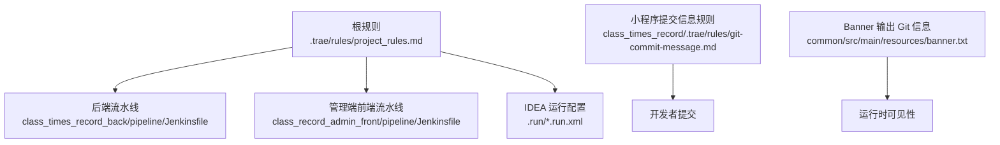
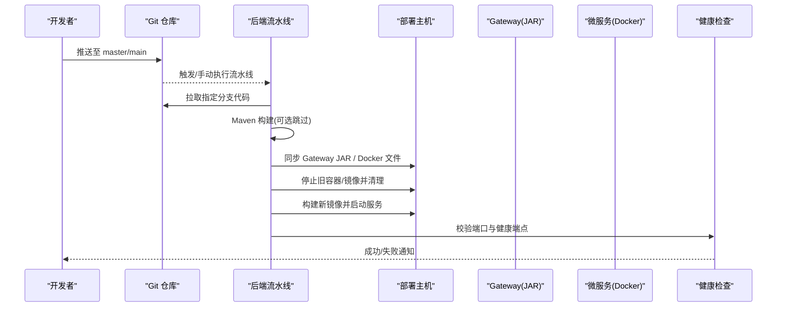
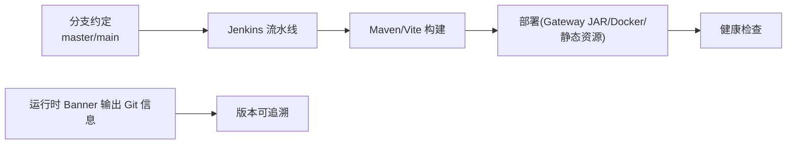

# Git工作流

<cite>
**本文引用的文件**
- [项目规则](file://.trae/rules/project_rules.md)
- [Git 提交信息规范（AI 场景）](file://class_times_record/.trae/rules/git-commit-message.md)
- [后端 Jenkins 流水线](file://class_times_record_back/pipeline/Jenkinsfile)
- [管理端前端 Jenkins 流水线](file://class_record_admin_front/pipeline/Jenkinsfile)
- [Gateway 启动配置](file://class_times_record_back/.run/GatewayApplication.run.xml)
- [AdminService 启动配置](file://class_times_record_back/.run/AdminServiceApplication.run.xml)
- [AuthService 启动配置](file://class_times_record_back/.run/AuthServiceApplication.run.xml)
- [BusinessService 启动配置](file://class_times_record_back/.run/BusinessServiceApplication.run.xml)
- [应用启动横幅（含 Git 信息）](file://class_times_record_back/common/src/main/resources/banner.txt)
</cite>

## 目录
1. [简介](#简介)
2. [项目结构](#项目结构)
3. [核心组件](#核心组件)
4. [架构总览](#架构总览)
5. [详细组件分析](#详细组件分析)
6. [依赖关系分析](#依赖关系分析)
7. [性能与稳定性考虑](#性能与稳定性考虑)
8. [故障排查指南](#故障排查指南)
9. [结论](#结论)
10. [附录：操作示例与常见问题](#附录操作示例与常见问题)

## 简介
本文件面向课程记录项目的研发与运维团队，系统化说明 Git 工作流、分支策略、提交规范、代码审查与合并策略、版本发布与回滚流程，以及本地开发环境配置要点。文档同时结合仓库中已有的规则与流水线配置，给出可落地的操作步骤与排障建议。

## 项目结构
本项目为多模块工程，包含后端微服务、网关、小程序前端与管理端前端等子项目。与 Git 工作流直接相关的配置集中在以下位置：
- 项目级规则与分支约定：根目录 .trae/rules/project_rules.md
- 小程序侧 AI 生成提交信息规则：class_times_record/.trae/rules/git-commit-message.md
- 后端构建与部署流水线：class_times_record_back/pipeline/Jenkinsfile
- 管理端前端构建与部署流水线：class_record_admin_front/pipeline/Jenkinsfile
- IDEA 运行配置（dev profile）：class_times_record_back/.run/*.run.xml
- 应用启动横幅（打印 Git 分支/提交信息）：class_times_record_back/common/src/main/resources/banner.txt

图表来源
- [项目规则](file://.trae/rules/project_rules.md)
- [后端 Jenkins 流水线](file://class_times_record_back/pipeline/Jenkinsfile)
- [管理端前端 Jenkins 流水线](file://class_record_admin_front/pipeline/Jenkinsfile)
- [Gateway 启动配置](file://class_times_record_back/.run/GatewayApplication.run.xml)
- [AdminService 启动配置](file://class_times_record_back/.run/AdminServiceApplication.run.xml)
- [AuthService 启动配置](file://class_times_record_back/.run/AuthServiceApplication.run.xml)
- [BusinessService 启动配置](file://class_times_record_back/.run/BusinessServiceApplication.run.xml)
- [应用启动横幅（含 Git 信息）](file://class_times_record_back/common/src/main/resources/banner.txt)

章节来源
- [项目规则](file://.trae/rules/project_rules.md)
- [Git 提交信息规范（AI 场景）](file://class_times_record/.trae/rules/git-commit-message.md)
- [后端 Jenkins 流水线](file://class_times_record_back/pipeline/Jenkinsfile)
- [管理端前端 Jenkins 流水线](file://class_record_admin_front/pipeline/Jenkinsfile)
- [Gateway 启动配置](file://class_times_record_back/.run/GatewayApplication.run.xml)
- [AdminService 启动配置](file://class_times_record_back/.run/AdminServiceApplication.run.xml)
- [AuthService 启动配置](file://class_times_record_back/.run/AuthServiceApplication.run.xml)
- [BusinessService 启动配置](file://class_times_record_back/.run/BusinessServiceApplication.run.xml)
- [应用启动横幅（含 Git 信息）](file://class_times_record_back/common/src/main/resources/banner.txt)

## 核心组件
- 分支与主分支约定
  - 后端主分支：master
  - 小程序前端主分支：main
  - 管理端前端主分支：main
  - Jenkinsfile 中的 GIT_BRANCH 必须与当前主分支保持一致
- 提交前文档同步要求
  - 每次 commit/push 前需更新 class_times_record_back/docs 下相关文档及 CLAUDE.md 等，确保文档与代码一致
- 本地开发环境关键项
  - Java 21；Gateway 本地需激活 dev profile，使用 localhost 直连路由覆盖 Nacos lb:// 路由
  - 小程序开发模式 API 指向本地 Gateway，生产/预览指向远程域名
- 构建与部署
  - 后端：Jenkins 拉取指定分支 → Maven 构建 → 部署 Gateway（JAR 直跑）+ 微服务（Docker Compose），支持按范围部署与回滚
  - 管理端前端：pnpm 安装依赖 → 类型检查/Lint → 单元测试 → Vite 构建 → 静态资源复制到宿主机目录

章节来源
- [项目规则](file://.trae/rules/project_rules.md)
- [后端 Jenkins 流水线](file://class_times_record_back/pipeline/Jenkinsfile)
- [管理端前端 Jenkins 流水线](file://class_record_admin_front/pipeline/Jenkinsfile)
- [Gateway 启动配置](file://class_times_record_back/.run/GatewayApplication.run.xml)

## 架构总览
下图展示从“开发者提交”到“线上验证”的端到端流程，涵盖分支、流水线、部署与验证环节。

图表来源
- [后端 Jenkins 流水线](file://class_times_record_back/pipeline/Jenkinsfile)
- [管理端前端 Jenkins 流水线](file://class_record_admin_front/pipeline/Jenkinsfile)

## 详细组件分析

### 分支管理策略
- 主分支
  - 后端：master
  - 小程序前端：main
  - 管理端前端：main
- 功能分支
  - 仓库未显式定义功能分支命名规范，建议在 PR/MR 创建时采用短横线分隔的语义化命名（如 feat/xxx、fix/xxx、chore/xxx），并在提交信息中标注变更类型
- 合并策略
  - 通过流水线将代码部署到目标环境，部署成功后再合并至主分支；或先合并主分支再由流水线触发部署
- 一致性约束
  - Jenkinsfile 中的 GIT_BRANCH 必须与当前主分支保持一致，避免拉错分支

章节来源
- [项目规则](file://.trae/rules/project_rules.md)
- [后端 Jenkins 流水线](file://class_times_record_back/pipeline/Jenkinsfile)
- [管理端前端 Jenkins 流水线](file://class_record_admin_front/pipeline/Jenkinsfile)

### 提交信息规范
- 语言与风格
  - 使用中文描述变更
- 变更类型标识
  - 建议使用常见前缀：feat、fix、docs、style、refactor、perf、test、build、ci、chore、revert 等
- 描述要求
  - 简明扼要地说明“做了什么”和“为什么”，必要时关联需求/缺陷编号
- AI 辅助
  - 小程序侧提供 git-commit-message.md 用于定制 AI 生成提交信息的风格（alwaysApply=true）

章节来源
- [项目规则](file://.trae/rules/project_rules.md)
- [Git 提交信息规范（AI 场景）](file://class_times_record/.trae/rules/git-commit-message.md)

### 代码审查与合并策略
- 审查入口
  - 在平台创建 Pull Request/Merge Request，关联任务/问题单
- 审查标准
  - 代码符合注释与命名规范；新增/修改接口有文档；前后端联调通过；测试用例覆盖关键路径
- 合并策略
  - 建议采用“先合入主分支，再触发流水线部署”或“流水线通过后自动合并”的策略；合并后由流水线完成构建与部署

[本节为通用流程说明，不直接分析具体文件]

### 版本发布与回滚
- 版本号管理
  - 后端 banner 会输出 Git 分支、提交 ID、完整提交信息与构建时间，便于定位版本
- 发布标签
  - 可在主分支打 tag 标记稳定版本（例如 v1.2.3），配合流水线产物归档进行追溯
- 回滚策略
  - 后端流水线内置回滚能力：支持 ROLLBACK=true 参数，将镜像恢复为 backup 标签并重启服务
  - 管理端前端可通过重新部署上一个构建产物实现快速回退

章节来源
- [应用启动横幅（含 Git 信息）](file://class_times_record_back/common/src/main/resources/banner.txt)
- [后端 Jenkins 流水线](file://class_times_record_back/pipeline/Jenkinsfile)
- [管理端前端 Jenkins 流水线](file://class_record_admin_front/pipeline/Jenkinsfile)

### 本地开发环境配置
- Java 与编译
  - JDK 21；设置 JAVA_HOME 指向本地 JDK 路径
- Gateway 本地调试
  - 必须激活 dev profile（-Dspring.profiles.active=dev），使路由走 localhost 直连而非 Nacos lb://
  - IDEA 已提供 GatewayApplication.run.xml 预设该参数
- 其他服务
  - AdminService、AuthService、BusinessService 均提供对应 .run.xml，默认激活 dev profile
- 小程序前端
  - 开发模式 API 指向本地 Gateway；生产/预览模式指向远程域名
  - openId 存储于 uni.getStorageSync("openId")

章节来源
- [项目规则](file://.trae/rules/project_rules.md)
- [Gateway 启动配置](file://class_times_record_back/.run/GatewayApplication.run.xml)
- [AdminService 启动配置](file://class_times_record_back/.run/AdminServiceApplication.run.xml)
- [AuthService 启动配置](file://class_times_record_back/.run/AuthServiceApplication.run.xml)
- [BusinessService 启动配置](file://class_times_record_back/.run/BusinessServiceApplication.run.xml)

## 依赖关系分析
- 分支与流水线耦合
  - 后端与前端流水线分别绑定各自的主分支（master/main），GIT_BRANCH 必须与主分支一致
- 部署目标与环境
  - 后端：Gateway 以 JAR 直跑，微服务以 Docker Compose 部署；端口映射固定
  - 管理端前端：构建产物复制到宿主机静态目录
- 运行时可见性
  - Banner 输出 Git 分支与提交信息，便于确认实际运行的版本

图表来源
- [项目规则](file://.trae/rules/project_rules.md)
- [后端 Jenkins 流水线](file://class_times_record_back/pipeline/Jenkinsfile)
- [管理端前端 Jenkins 流水线](file://class_record_admin_front/pipeline/Jenkinsfile)
- [应用启动横幅（含 Git 信息）](file://class_times_record_back/common/src/main/resources/banner.txt)

章节来源
- [项目规则](file://.trae/rules/project_rules.md)
- [后端 Jenkins 流水线](file://class_times_record_back/pipeline/Jenkinsfile)
- [管理端前端 Jenkins 流水线](file://class_record_admin_front/pipeline/Jenkinsfile)
- [应用启动横幅（含 Git 信息）](file://class_times_record_back/common/src/main/resources/banner.txt)

## 性能与稳定性考虑
- 构建优化
  - 后端流水线支持 SKIP_BUILD=true 跳过构建，仅部署已有制品，适合紧急修复
- 部署原子性
  - 微服务部署前备份 latest 为 backup，失败时可一键回滚
- 资源清理
  - 部署完成后清理悬空镜像与停止的容器，释放磁盘空间
- 健康检查
  - 对 Gateway 与各微服务端口进行健康端点探测，超时则告警

[本节为通用指导，不直接分析具体文件]

## 故障排查指南
- 构建失败
  - 后端：查看 Maven 构建日志；确认依赖与 JDK 版本
  - 前端：检查 pnpm 安装与构建脚本，关注类型检查与 Lint 警告
- 部署失败
  - 后端：核对 SSH 凭据、目标主机可达性与端口占用；查看 Gateway 日志与 Docker 容器日志
  - 前端：确认部署目录权限与写入成功
- 回滚失败
  - 检查是否存在 backup 镜像；若不存在，需先正常部署一次以生成备份
- 本地无法访问
  - 确认 Gateway 是否以 dev profile 启动；小程序前端是否指向正确的本地/远程地址

章节来源
- [后端 Jenkins 流水线](file://class_times_record_back/pipeline/Jenkinsfile)
- [管理端前端 Jenkins 流水线](file://class_record_admin_front/pipeline/Jenkinsfile)
- [Gateway 启动配置](file://class_times_record_back/.run/GatewayApplication.run.xml)

## 结论
本项目围绕“明确的主分支约定 + 自动化流水线 + 可回滚的部署策略”构建了稳定的交付链路。配合提交前文档同步与统一的提交信息规范，可有效提升协作效率与版本可追溯性。建议后续补充更细粒度的分支命名与 PR 模板，进一步固化代码审查标准。

[本节为总结性内容，不直接分析具体文件]

## 附录：操作示例与常见问题

### 常用命令示例
- 克隆与切换主分支
  - 后端：git clone ... && git checkout master
  - 前端：git clone ... && git checkout main
- 提交与推送
  - git add . && git commit -m "feat: 新增课程记录查询接口" && git push origin <分支名>
- 本地启动 Gateway（IDEA）
  - 使用 GatewayApplication.run.xml 运行，确保 VM 参数包含 -Dspring.profiles.active=dev
- 触发后端流水线
  - 在 Jenkins 选择分支（默认 master）、部署范围（all/gateway/auth-service/business-service/admin-service）、是否跳过构建与是否回滚
- 触发管理端前端流水线
  - 默认拉取 main 分支，执行安装依赖、类型检查、Lint、单元测试、Vite 构建与部署

章节来源
- [项目规则](file://.trae/rules/project_rules.md)
- [后端 Jenkins 流水线](file://class_times_record_back/pipeline/Jenkinsfile)
- [管理端前端 Jenkins 流水线](file://class_record_admin_front/pipeline/Jenkinsfile)
- [Gateway 启动配置](file://class_times_record_back/.run/GatewayApplication.run.xml)

### 常见问题与解决
- 问题：本地请求远程服务器而非本地 Gateway
  - 解决：确保以 dev profile 启动 Gateway，IDEA 运行配置已预设该参数
- 问题：Jenkins 拉错分支
  - 解决：核对 Jenkinsfile 的 GIT_BRANCH 与当前主分支一致；或在触发流水线时传入正确的分支参数
- 问题：部署后服务不可用
  - 解决：查看健康检查输出与容器日志；必要时启用回滚参数 ROLLBACK=true
- 问题：前端构建产物缺失
  - 解决：检查 dist 目录是否存在；确认构建步骤是否被跳过或失败

章节来源
- [后端 Jenkins 流水线](file://class_times_record_back/pipeline/Jenkinsfile)
- [管理端前端 Jenkins 流水线](file://class_record_admin_front/pipeline/Jenkinsfile)
- [Gateway 启动配置](file://class_times_record_back/.run/GatewayApplication.run.xml)