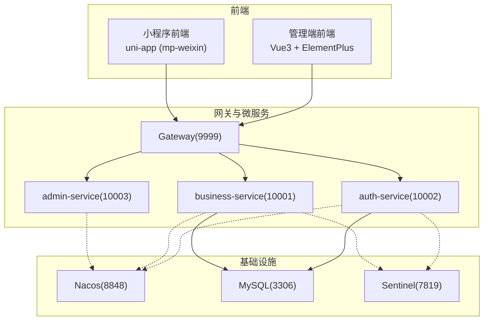
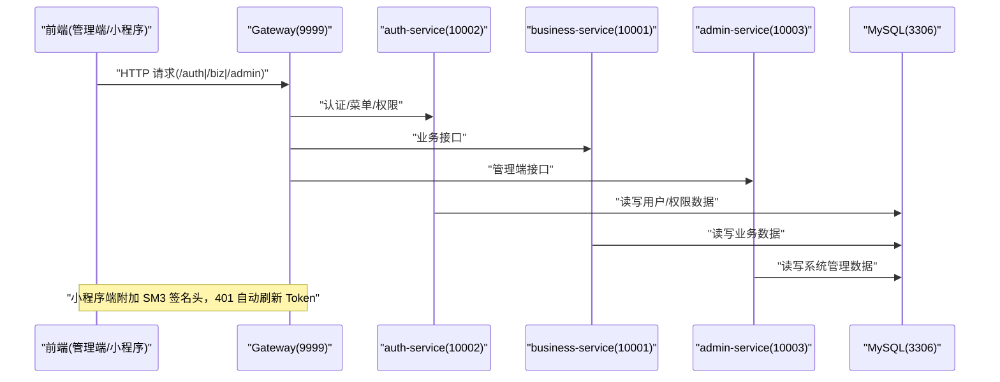
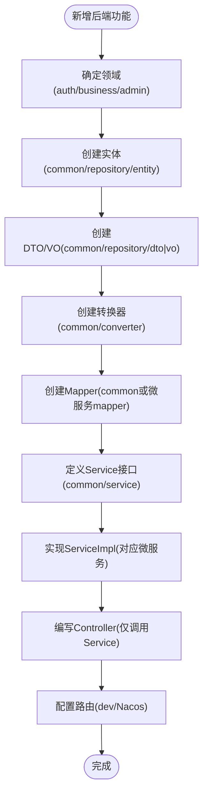
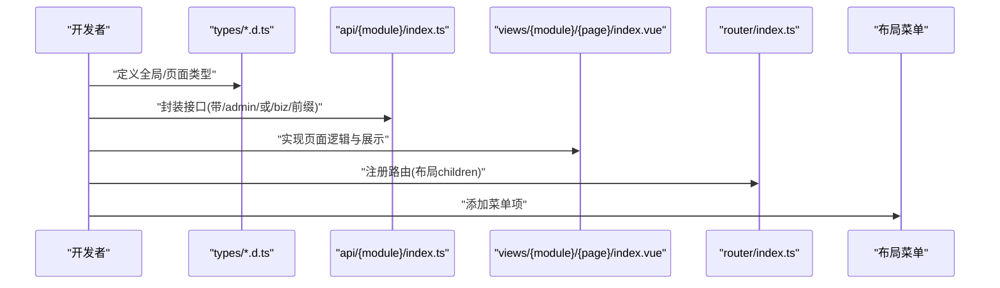
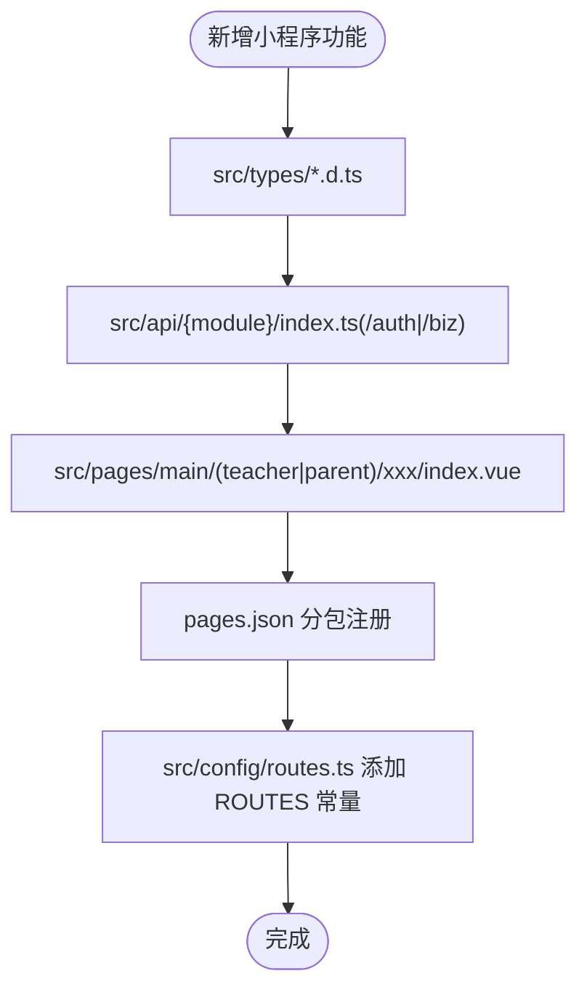
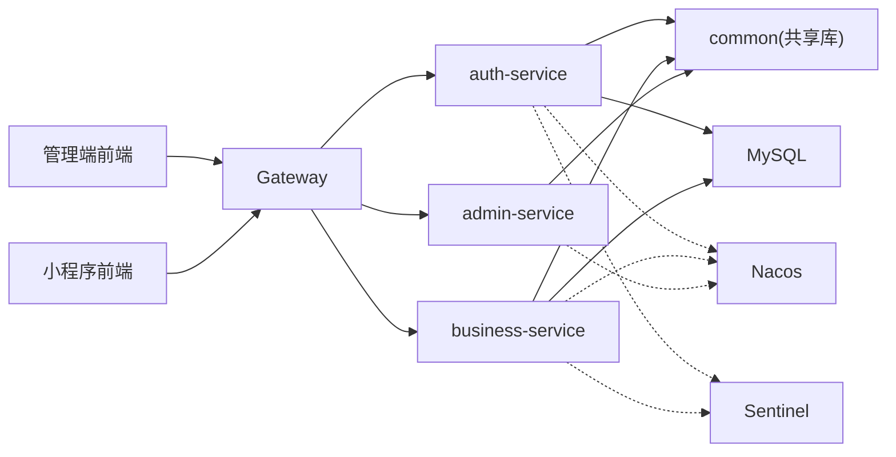

# 开发指南

<cite>
**本文引用的文件**
- [CLAUDE.md](file://CLAUDE.md)
- [项目规则.md](file://.trae\rules\project_rules.md)
- [Git 提交信息规范.md](file://class_times_record\.trae\rules\git-commit-message.md)
- [课时管理 Admin 前端 README.md](file://class_record_admin_front\README.md)
- [课时管理 KA - 前端 README.md](file://class_times_record\README.md)
</cite>

## 目录
1. [引言](#引言)
2. [项目结构](#项目结构)
3. [核心组件](#核心组件)
4. [架构总览](#架构总览)
5. [详细组件分析](#详细组件分析)
6. [依赖分析](#依赖分析)
7. [性能考虑](#性能考虑)
8. [故障排查指南](#故障排查指南)
9. [结论](#结论)
10. [附录](#附录)

## 引言
本指南面向后端（Java/Spring Cloud Alibaba）、前端（Vue 3/Element Plus 管理端、uni-app 微信小程序）与运维协作，统一编码规范、分支与发布流程、测试策略、质量工具链与调试优化方法，确保团队协作一致性与交付质量。

## 项目结构
仓库为多模块 monorepo，包含四个子模块：
- 管理端前端：class_record_admin_front（Vue 3 + Element Plus + Vite + TypeScript）
- 小程序前端：class_times_record（uni-app + Vue 3 + TypeScript）
- 后端微服务：class_times_record_back（Spring Cloud Alibaba，Maven 多模块）
- MCP 运维服务：course_record_mcp_server（Node.js + TypeScript）

图表来源
- [CLAUDE.md:25-70](file://CLAUDE.md#L25-L70)
- [课时管理 KA - 前端 README.md:5-27](file://class_times_record\README.md#L5-L27)

章节来源
- [CLAUDE.md:1-20](file://CLAUDE.md#L1-L20)
- [课时管理 Admin 前端 README.md:30-62](file://class_record_admin_front\README.md#L30-L62)
- [课时管理 KA - 前端 README.md:28-56](file://class_times_record\README.md#L28-L56)

## 核心组件
- 后端分层与约定
  - 调用链：Controller → Service（接口在 common）→ ServiceImpl（微服务内实现）→ Mapper。禁止 Controller 直接注入 Mapper。
  - DTO/VO 按实体分目录存放；Admin 相关 DTO 以 Admin 前缀命名。
  - Entity 继承 BaseEntity，教师/家长继承 RoleBaseEntity；Class 使用 clazz 包名规避关键字冲突。
- 网关路由与安全
  - 请求经 Gateway 进入，按 /auth/**、/biz/**、/admin/** 分发并 StripPrefix=1。
  - 小程序端采用 SM2 加密密码、SM3 签名头；管理端采用 BCrypt 存储密码，JWT 会话。
- 前端约定
  - 管理端：视图按 views/{module}/{page}/index.vue + index.scss + index.d.ts 组织；图标、空值格式化等工具集中复用。
  - 小程序端：强制组件化（FormPage/FormGroup/PageFooter/SearchFilterBar/FloatingActionButton/EmptyState），禁止手写原生表单控件；常量使用 ROLE 枚举；跳转通过 ROUTES 常量与 usePageData/useEventChannel。

章节来源
- [CLAUDE.md:25-136](file://CLAUDE.md#L25-L136)
- [CLAUDE.md:139-217](file://CLAUDE.md#L139-L217)
- [课时管理 Admin 前端 README.md:64-126](file://class_record_admin_front\README.md#L64-L126)
- [课时管理 KA - 前端 README.md:58-126](file://class_times_record\README.md#L58-L126)

## 架构总览
系统采用前后端分离与微服务架构，统一由 Gateway 进行鉴权与路由转发，业务服务通过 Nacos 注册发现，数据库为 MySQL，流量治理与熔断降级由 Sentinel 提供。

图表来源
- [CLAUDE.md:41-68](file://CLAUDE.md#L41-L68)
- [课时管理 KA - 前端 README.md:5-27](file://class_times_record\README.md#L5-L27)

## 详细组件分析

### 后端（Spring Cloud Alibaba）
- 模块职责
  - common：共享实体、DTO/VO、转换器、通用服务接口、工具类（SM2/SM3/JWT）。
  - gateway：统一 JWT 校验、签名拦截、用户上下文注入、路由转发。
  - auth-service：认证、菜单、权限。
  - business-service：核心业务 CRUD。
  - admin-service：管理员、角色、菜单管理。
- 安全与拦截器
  - auth-service：JwtInterceptor + SignInterceptor + UserInterceptor。
  - admin-service：AdminJwtInterceptor + UserInterceptor。
  - business-service：SignInterceptor + UserInterceptor。
  - gateway：JwtAuthFilter + GatewayUserFilter。
- 数据库与表命名
  - 业务表 c_ 前缀，系统表 sys_ 前缀；DDL 需 allow_ddl=true，禁止 DROP/TRUNCATE/GRANT/REVOKE。
- 新增功能步骤
  - 确定领域 → 实体 → DTO/VO → Converter → Mapper → Service 接口 → ServiceImpl → Controller → 路由配置。

图表来源
- [CLAUDE.md:116-126](file://CLAUDE.md#L116-L126)

章节来源
- [CLAUDE.md:25-136](file://CLAUDE.md#L25-L136)

### 管理端前端（Vue 3 + Element Plus）
- 结构与约定
  - 页面：views/{module}/{page}/index.vue + index.scss + index.d.ts。
  - 样式：统一使用独立 .scss 文件并通过 scoped 引入，禁止行内样式。
  - 类型：全局 .d.ts 声明，避免 any。
  - 登录：滑块验证码通过后发起登录请求；Token 存 localStorage，401 自动刷新。
- API 模块
  - src/api/{module}/index.ts，路径以 /admin/ 或 /biz/ 开头。
- 新增页面流程
  - 类型 → API → 页面 → 路由 → 菜单。

图表来源
- [CLAUDE.md:139-171](file://CLAUDE.md#L139-L171)
- [课时管理 Admin 前端 README.md:64-126](file://class_record_admin_front\README.md#L64-L126)

章节来源
- [CLAUDE.md:139-171](file://CLAUDE.md#L139-L171)
- [课时管理 Admin 前端 README.md:30-62](file://class_record_admin_front\README.md#L30-L62)

### 小程序前端（uni-app）
- 关键约定
  - 参数传递：usePageData<T>() 接收，jump(ROUTES.XXX, data) 发送。
  - 路由：使用 ROUTES 常量，禁止硬编码路径。
  - 分包：主包 ≤ 2MB，业务页放入分包。
  - 安全：SM2 cipherMode=1（C1C3C2，“04”前缀）；请求签名 x-sign/x-timestamp/x-nonce；401 静默刷新。
  - 组件优先：必须使用 FormPage/FormGroup/PageFooter/SearchFilterBar/FloatingActionButton/EmptyState，禁止手写原生表单控件。
- 新增功能流程
  - 类型 → API → 页面（main/teacher 或 parent）→ pages.json 分包注册 → routes.ts 常量。

图表来源
- [CLAUDE.md:174-217](file://CLAUDE.md#L174-L217)
- [课时管理 KA - 前端 README.md:58-126](file://class_times_record\README.md#L58-L126)

章节来源
- [CLAUDE.md:174-217](file://CLAUDE.md#L174-L217)
- [课时管理 KA - 前端 README.md:28-56](file://class_times_record\README.md#L28-L56)

## 依赖分析
- 前端到后端
  - 管理端与小程序均通过 Gateway 访问后端服务，遵循统一前缀与鉴权机制。
- 后端内部
  - common 被各微服务依赖，承载实体、DTO/VO、转换器与服务接口，降低耦合。
- 外部依赖
  - Nacos 用于服务注册与配置中心；Sentinel 提供限流与熔断；MySQL 持久化数据。

图表来源
- [CLAUDE.md:25-70](file://CLAUDE.md#L25-L70)

章节来源
- [CLAUDE.md:25-70](file://CLAUDE.md#L25-L70)

## 性能考虑
- 后端
  - 合理分页与索引设计，避免大对象返回；对热点查询增加缓存（结合 Nacos 配置）。
  - 使用 Sentinel 配置限流与熔断规则，保护下游服务与数据库。
- 前端
  - 管理端按需加载路由与组件，减少首屏体积；列表分页与虚拟滚动结合大数据量场景。
  - 小程序分包加载，图片资源压缩与懒加载；避免频繁重绘与过度渲染。
- 网络
  - 启用 gzip/br 压缩；合理设置缓存头；批量接口合并减少往返次数。

[本节为通用建议，不直接分析具体文件]

## 故障排查指南
- 本地开发环境
  - Java 版本要求 JDK 21；Gateway 本地需激活 dev profile，否则将走远程 lb 路由。
  - 小程序开发模式 baseUrl 指向本地 Gateway，生产/预览指向线上域名。
- 常见问题定位
  - 401 未授权：检查 Token 是否过期及刷新逻辑；确认签名头是否正确。
  - 路由异常：核对 Gateway 路由前缀与 StripPrefix 配置。
  - 数据库变更失败：确认 allow_ddl 开关与 SQL 合法性。
- 文档同步
  - 每次 commit/push 前更新 docs 与 CLAUDE.md，保证文档与代码一致。

章节来源
- [项目规则.md:81-123](file://.trae\rules\project_rules.md#L81-L123)
- [CLAUDE.md:240-276](file://CLAUDE.md#L240-L276)

## 结论
通过统一的架构与编码约定、严格的 Git 工作流与质量门禁、完善的测试与监控体系，团队可高效协作并稳定交付。建议在迭代中持续完善自动化测试覆盖率与性能基线，保障系统长期健康演进。

[本节为总结性内容，不直接分析具体文件]

## 附录

### 编码规范与约定
- 注释要求
  - 函数/方法、复杂逻辑、类型定义、组件、API 接口均需详细注释。
- 命名与目录
  - DTO/VO 按实体分目录；Admin 专用 DTO 加 Admin 前缀；Class 使用 clazz 包名。
- 前端样式与类型
  - 管理端样式独立 .scss 文件且 scoped；全局类型集中在 types/*.d.ts，避免 any。
- 小程序组件化
  - 强制使用 FormPage/FormGroup/PageFooter/SearchFilterBar/FloatingActionButton/EmptyState；常量使用 ROLE 枚举。

章节来源
- [项目规则.md:3-73](file://.trae\rules\project_rules.md#L3-L73)
- [CLAUDE.md:139-217](file://CLAUDE.md#L139-L217)

### Git 工作流与分支管理
- 分支策略
  - 后端主分支 master；小程序与管理端主分支 main；Jenkinsfile 的 GIT_BRANCH 需与主分支一致。
- 提交信息
  - 使用中文；可在 AI 辅助下生成风格一致的提交信息。
- 推送前检查清单
  - 更新 class_times_record_back/docs 下文档与 CLAUDE.md；如有 AGENTS.md 也需同步。

章节来源
- [项目规则.md:64-80](file://.trae\rules\project_rules.md#L64-L80)
- [Git 提交信息规范.md:1-7](file://class_times_record\.trae\rules\git-commit-message.md#L1-L7)

### 新功能开发全流程（端到端）
- 需求分析与设计
  - 明确领域边界（auth/business/admin），评估影响范围与数据模型变化。
- 后端实现
  - 实体 → DTO/VO → Converter → Mapper → Service 接口 → ServiceImpl → Controller → 路由配置。
- 前端实现
  - 管理端：类型 → API → 页面 → 路由 → 菜单。
  - 小程序：类型 → API → 页面 → pages.json 分包注册 → routes.ts 常量。
- 联调与自测
  - 本地启动 Gateway 与各服务，验证鉴权、签名与路由；覆盖正常与异常路径。
- 提交流程
  - 提交前执行检查清单，更新文档；提交信息遵循中文规范。
- 评审与发布
  - 代码审查通过后进入 CI 构建与部署流水线。

章节来源
- [CLAUDE.md:116-136](file://CLAUDE.md#L116-L136)
- [CLAUDE.md:139-217](file://CLAUDE.md#L139-L217)
- [项目规则.md:64-80](file://.trae\rules\project_rules.md#L64-L80)

### 测试策略与用例规范
- 单元测试
  - 后端针对 Service 层与工具类编写单测，覆盖边界条件与异常分支。
- 集成测试
  - 基于 Mock 或 TestContainer 验证 Controller → Service → Mapper 链路；校验鉴权与签名拦截。
- 端到端测试
  - 管理端可使用 Playwright/Vitest 进行 UI 流程断言；小程序可通过真机/模拟器进行关键路径回归。
- 用例编写规范
  - 每个用例描述前置条件、输入、期望结果与后置清理；失败时保留日志与快照。

[本节为通用指导，不直接分析具体文件]

### 代码质量工具链
- ESLint/Prettier/Oxlint
  - 管理端已集成 ESLint 与 Prettier；小程序侧可按需接入 Oxlint 与 Prettier 统一格式。
- SonarQube
  - 建议在 CI 中集成 SonarQube 扫描，设定质量门禁（重复率、复杂度、漏洞、覆盖率阈值）。
- 配置建议
  - 统一缩进、引号、分号、换行规则；开启严格类型检查；禁用 any；限制圈复杂度与函数长度。

[本节为通用指导，不直接分析具体文件]

### 调试技巧与性能优化
- 后端
  - 使用 dev profile 直连本地服务；结合 Nacos 动态调整日志级别；利用 Sentinel 控制台观察 QPS 与异常。
- 前端
  - 管理端使用浏览器 Network/Performance 面板；小程序使用微信开发者工具的 Performance 与 Memory 面板。
- 数据库
  - 慢查询分析、索引优化；避免 N+1 查询与大事务。

[本节为通用指导，不直接分析具体文件]