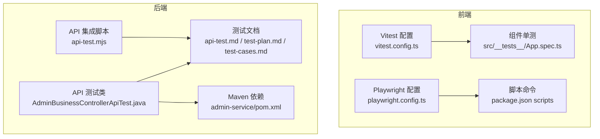
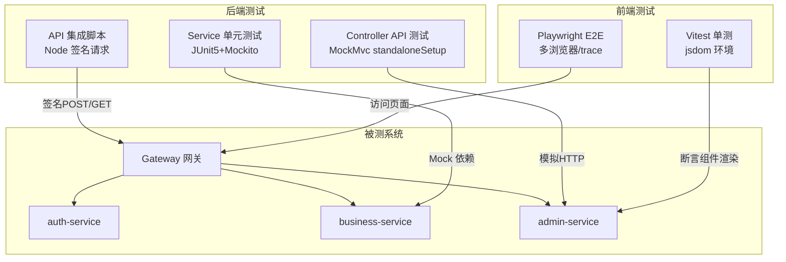
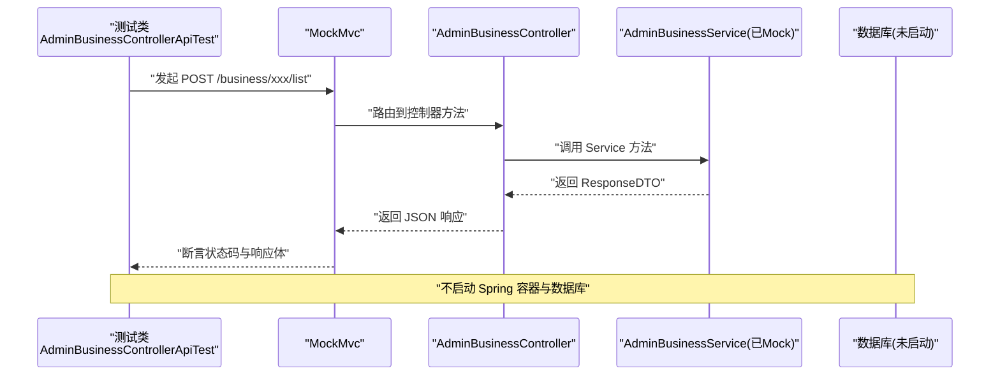
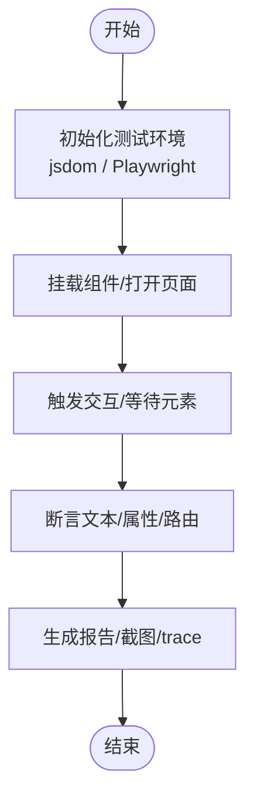
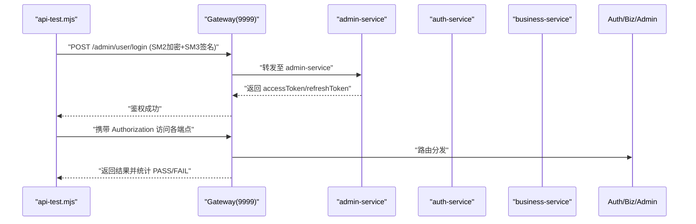
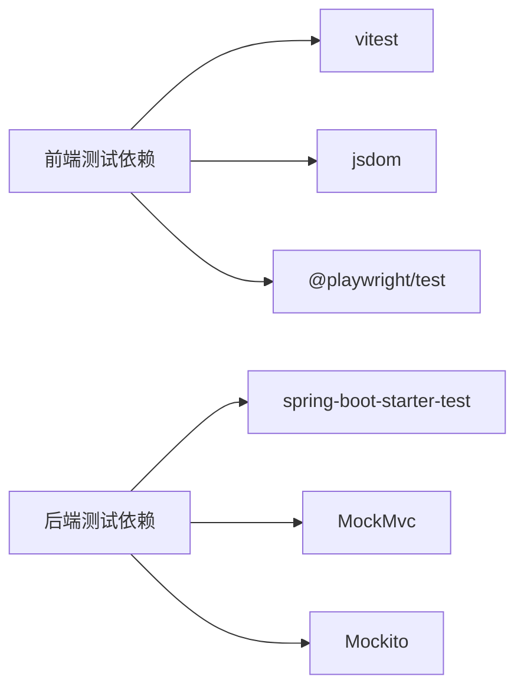

# 测试策略

<cite>
**本文引用的文件**
- [vitest.config.ts](file://class_record_admin_front/vitest.config.ts)
- [playwright.config.ts](file://class_record_admin_front/playwright.config.ts)
- [App.spec.ts](file://class_record_admin_front/src/__tests__/App.spec.ts)
- [vue.spec.ts](file://class_record_admin_front/e2e/vue.spec.ts)
- [package.json](file://class_record_admin_front/package.json)
- [AdminBusinessControllerApiTest.java](file://class_times_record_back/admin-service/src/test/java/com/shiroko/controller/AdminBusinessControllerApiTest.java)
- [api-test.md](file://class_times_record_back/docs/api-test.md)
- [test-plan.md](file://class_times_record_back/docs/test-plan.md)
- [test-cases.md](file://class_times_record_back/docs/test-cases.md)
- [api-test.mjs](file://class_times_record_back/docs/api-test.mjs)
- [pom.xml](file://class_times_record_back/admin-service/pom.xml)
</cite>

## 目录
1. [引言](#引言)
2. [项目结构](#项目结构)
3. [核心组件](#核心组件)
4. [架构总览](#架构总览)
5. [详细组件分析](#详细组件分析)
6. [依赖分析](#依赖分析)
7. [性能考虑](#性能考虑)
8. [故障排查指南](#故障排查指南)
9. [结论](#结论)
10. [附录](#附录)

## 引言
本测试策略文档面向课程记录系统（前后端分离、微服务架构）的测试体系建设，覆盖以下目标：
- 明确测试分层与职责边界：单元测试、集成测试、端到端测试
- 后端测试规范：基于 JUnit 5 + Mockito + MockMvc 的 Controller API 测试与 Service 层单元测试
- 前端测试策略：Vitest 单元测试与 Playwright 端到端测试的编写方法与最佳实践
- API 接口测试方案：自动化脚本与 Postman 集合的组织方式
- 覆盖率要求与持续集成执行策略
- 提供具体用例示例与调试技巧

## 项目结构
本项目包含多个子模块，测试相关的关键位置如下：
- 管理端前端（Vue3 + Vite）：Vitest 单元测试、Playwright E2E
- 后端微服务（Spring Boot 4.x）：JUnit 5 + Mockito + MockMvc 的 API 测试与 Service 单元测试
- 文档与脚本：API 测试说明、测试计划、测试用例清单、Node 自动化脚本

图表来源
- [vitest.config.ts:1-15](file://class_record_admin_front/vitest.config.ts#L1-L15)
- [playwright.config.ts:1-111](file://class_record_admin_front/playwright.config.ts#L1-L111)
- [App.spec.ts:1-15](file://class_record_admin_front/src/__tests__/App.spec.ts#L1-L15)
- [package.json:1-63](file://class_record_admin_front/package.json#L1-L63)
- [AdminBusinessControllerApiTest.java:1-620](file://class_times_record_back/admin-service/src/test/java/com/shiroko/controller/AdminBusinessControllerApiTest.java#L1-L620)
- [api-test.md:1-167](file://class_times_record_back/docs/api-test.md#L1-L167)
- [test-plan.md:1-248](file://class_times_record_back/docs/test-plan.md#L1-L248)
- [test-cases.md:1-306](file://class_times_record_back/docs/test-cases.md#L1-L306)
- [api-test.mjs:1-356](file://class_times_record_back/docs/api-test.mjs#L1-L356)
- [pom.xml:1-95](file://class_times_record_back/admin-service/pom.xml#L1-L95)

章节来源
- [vitest.config.ts:1-15](file://class_record_admin_front/vitest.config.ts#L1-L15)
- [playwright.config.ts:1-111](file://class_record_admin_front/playwright.config.ts#L1-L111)
- [App.spec.ts:1-15](file://class_record_admin_front/src/__tests__/App.spec.ts#L1-L15)
- [package.json:1-63](file://class_record_admin_front/package.json#L1-L63)
- [AdminBusinessControllerApiTest.java:1-620](file://class_times_record_back/admin-service/src/test/java/com/shiroko/controller/AdminBusinessControllerApiTest.java#L1-L620)
- [api-test.md:1-167](file://class_times_record_back/docs/api-test.md#L1-L167)
- [test-plan.md:1-248](file://class_times_record_back/docs/test-plan.md#L1-L248)
- [test-cases.md:1-306](file://class_times_record_back/docs/test-cases.md#L1-L306)
- [api-test.mjs:1-356](file://class_times_record_back/docs/api-test.mjs#L1-L356)
- [pom.xml:1-95](file://class_times_record_back/admin-service/pom.xml#L1-L95)

## 核心组件
- 前端测试栈
  - Vitest：基于 jsdom 环境的 Vue 组件单元测试，配合 @vue/test-utils 挂载组件断言渲染
  - Playwright：跨浏览器 E2E 测试，支持本地开发服务器或 CI 预览服务器，自动收集 trace
- 后端测试栈
  - JUnit 5 + MockitoExtension：Service 层单元测试，Mock Mapper/Converter/UserContext 等外部依赖
  - MockMvc standaloneSetup：不启动 Spring 容器，仅测试 Controller → Service 调用链路与参数校验、响应格式
  - Node 自动化脚本：通过 Gateway 端口对多服务进行签名请求与路由验证
- 测试文档与用例
  - api-test.md：API 测试概览、端点清单、运行方式
  - test-plan.md：测试层次、范围、Mock 策略、运行命令、后续计划
  - test-cases.md：按方法维度组织的具体用例表（含输入、预期、验证点）

章节来源
- [vitest.config.ts:1-15](file://class_record_admin_front/vitest.config.ts#L1-L15)
- [playwright.config.ts:1-111](file://class_record_admin_front/playwright.config.ts#L1-L111)
- [App.spec.ts:1-15](file://class_record_admin_front/src/__tests__/App.spec.ts#L1-L15)
- [api-test.md:1-167](file://class_times_record_back/docs/api-test.md#L1-L167)
- [test-plan.md:1-248](file://class_times_record_back/docs/test-plan.md#L1-L248)
- [test-cases.md:1-306](file://class_times_record_back/docs/test-cases.md#L1-L306)

## 架构总览
下图展示测试在系统中的分层与交互关系。

图表来源
- [playwright.config.ts:1-111](file://class_record_admin_front/playwright.config.ts#L1-L111)
- [AdminBusinessControllerApiTest.java:1-620](file://class_times_record_back/admin-service/src/test/java/com/shiroko/controller/AdminBusinessControllerApiTest.java#L1-L620)
- [api-test.mjs:1-356](file://class_times_record_back/docs/api-test.mjs#L1-L356)

## 详细组件分析

### 后端单元测试与 API 测试规范
- 分层与职责
  - Service 层单元测试：聚焦业务逻辑、事务、异常处理；使用 Mockito 隔离 Mapper/Converter/UserContext
  - Controller API 测试：聚焦路由映射、参数绑定、@Valid/@Validated 分组校验、JSON 序列化/反序列化、响应结构
- 关键实现要点
  - 使用 @ExtendWith(MockitoExtension.class) 启用 Mockito
  - 使用 @Mock 注入 Service 依赖，@InjectMocks 注入 Controller
  - 使用 MockMvcBuilders.standaloneSetup() 构建独立测试环境，避免加载完整 Spring 上下文
  - 使用 ObjectMapper 注册 JavaTimeModule 以正确序列化时间类型
  - 使用 jsonPath 断言响应体字段，使用 verify 验证 Service 是否被调用
- 参考路径
  - [AdminBusinessControllerApiTest.java:1-620](file://class_times_record_back/admin-service/src/test/java/com/shiroko/controller/AdminBusinessControllerApiTest.java#L1-L620)
  - [api-test.md:1-167](file://class_times_record_back/docs/api-test.md#L1-L167)
  - [test-plan.md:1-248](file://class_times_record_back/docs/test-plan.md#L1-L248)
  - [test-cases.md:1-306](file://class_times_record_back/docs/test-cases.md#L1-L306)

图表来源
- [AdminBusinessControllerApiTest.java:1-620](file://class_times_record_back/admin-service/src/test/java/com/shiroko/controller/AdminBusinessControllerApiTest.java#L1-L620)

章节来源
- [AdminBusinessControllerApiTest.java:1-620](file://class_times_record_back/admin-service/src/test/java/com/shiroko/controller/AdminBusinessControllerApiTest.java#L1-L620)
- [api-test.md:1-167](file://class_times_record_back/docs/api-test.md#L1-L167)
- [test-plan.md:1-248](file://class_times_record_back/docs/test-plan.md#L1-L248)
- [test-cases.md:1-306](file://class_times_record_back/docs/test-cases.md#L1-L306)

### 前端测试策略（Vitest 与 Playwright）
- Vitest 单元测试
  - 环境：jsdom，适合 DOM 操作与 Vue 组件渲染断言
  - 工具：@vue/test-utils 的 mount 挂载组件，断言文本/属性/事件
  - 配置：合并 Vite 配置，排除 e2e 目录
- Playwright 端到端测试
  - 项目：chromium/firefox/webkit 桌面浏览器
  - 基地址：本地 dev 或 CI preview 服务器
  - 行为：失败重试、trace 收集、headless 模式
  - 启动：webServer 自动拉起 dev/preview 服务
- 参考路径
  - [vitest.config.ts:1-15](file://class_record_admin_front/vitest.config.ts#L1-L15)
  - [playwright.config.ts:1-111](file://class_record_admin_front/playwright.config.ts#L1-L111)
  - [App.spec.ts:1-15](file://class_record_admin_front/src/__tests__/App.spec.ts#L1-L15)
  - [vue.spec.ts:1-9](file://class_record_admin_front/e2e/vue.spec.ts#L1-L9)
  - [package.json:1-63](file://class_record_admin_front/package.json#L1-L63)

图表来源
- [vitest.config.ts:1-15](file://class_record_admin_front/vitest.config.ts#L1-L15)
- [playwright.config.ts:1-111](file://class_record_admin_front/playwright.config.ts#L1-L111)
- [App.spec.ts:1-15](file://class_record_admin_front/src/__tests__/App.spec.ts#L1-L15)
- [vue.spec.ts:1-9](file://class_record_admin_front/e2e/vue.spec.ts#L1-L9)

章节来源
- [vitest.config.ts:1-15](file://class_record_admin_front/vitest.config.ts#L1-L15)
- [playwright.config.ts:1-111](file://class_record_admin_front/playwright.config.ts#L1-L111)
- [App.spec.ts:1-15](file://class_record_admin_front/src/__tests__/App.spec.ts#L1-L15)
- [vue.spec.ts:1-9](file://class_record_admin_front/e2e/vue.spec.ts#L1-L9)
- [package.json:1-63](file://class_record_admin_front/package.json#L1-L63)

### API 接口测试方案（自动化脚本与 Postman）
- Node 自动化脚本
  - 通过 Gateway 统一入口发送带 SM2 加密密码与 SM3 签名的请求
  - 覆盖 Gateway 路由、认证登录、用户/角色/菜单/仪表盘/日志、业务管理等端点
  - 统计 PASS/FAIL 并输出错误详情
- Postman 集合建议
  - 将脚本中的端点整理为集合，按模块分组（认证、管理端、业务端）
  - 使用环境变量保存 Token、公钥、签名盐值
  - 添加断言：状态码、响应体字段、签名头存在性
- 参考路径
  - [api-test.mjs:1-356](file://class_times_record_back/docs/api-test.mjs#L1-L356)
  - [api-test.md:1-167](file://class_times_record_back/docs/api-test.md#L1-L167)

图表来源
- [api-test.mjs:1-356](file://class_times_record_back/docs/api-test.mjs#L1-L356)

章节来源
- [api-test.mjs:1-356](file://class_times_record_back/docs/api-test.mjs#L1-L356)
- [api-test.md:1-167](file://class_times_record_back/docs/api-test.md#L1-L167)

### 测试数据准备与 Mock 策略
- 后端
  - 使用 @Mock 模拟所有 Mapper/Converter，避免真实数据库
  - 使用 UserContext 模拟当前登录用户上下文
  - 使用 ArgumentCaptor 验证更新字段（如课时变更）
- 前端
  - 使用 @vue/test-utils 的 global.stubs 替换 router-view 等全局组件
  - 使用 jsdom 环境模拟 DOM API
- 参考路径
  - [AdminBusinessControllerApiTest.java:1-620](file://class_times_record_back/admin-service/src/test/java/com/shiroko/controller/AdminBusinessControllerApiTest.java#L1-L620)
  - [App.spec.ts:1-15](file://class_record_admin_front/src/__tests__/App.spec.ts#L1-L15)
  - [test-cases.md:1-306](file://class_times_record_back/docs/test-cases.md#L1-L306)

章节来源
- [AdminBusinessControllerApiTest.java:1-620](file://class_times_record_back/admin-service/src/test/java/com/shiroko/controller/AdminBusinessControllerApiTest.java#L1-L620)
- [App.spec.ts:1-15](file://class_record_admin_front/src/__tests__/App.spec.ts#L1-L15)
- [test-cases.md:1-306](file://class_times_record_back/docs/test-cases.md#L1-L306)

## 依赖分析
- 前端
  - Vitest 与 jsdom 作为测试运行时
  - Playwright 作为 E2E 驱动，支持多浏览器设备
  - package.json 中定义 test:unit 与 test:e2e 脚本
- 后端
  - spring-boot-starter-test 提供 JUnit 5、Mockito、MockMvc 等测试能力
  - admin-service 的 pom.xml 引入测试依赖
- 参考路径
  - [package.json:1-63](file://class_record_admin_front/package.json#L1-L63)
  - [pom.xml:1-95](file://class_times_record_back/admin-service/pom.xml#L1-L95)

图表来源
- [package.json:1-63](file://class_record_admin_front/package.json#L1-L63)
- [pom.xml:1-95](file://class_times_record_back/admin-service/pom.xml#L1-L95)

章节来源
- [package.json:1-63](file://class_record_admin_front/package.json#L1-L63)
- [pom.xml:1-95](file://class_times_record_back/admin-service/pom.xml#L1-L95)

## 性能考虑
- 前端
  - 合理拆分单测，避免重型组件全量挂载
  - 使用 stubs/mocks 减少第三方库开销
  - Playwright 在 CI 使用 headless 与有限 workers 提升稳定性
- 后端
  - 使用 standaloneSetup 避免加载完整应用上下文，缩短测试启动时间
  - 批量插入/查询用例注意 Mock 返回数据规模，避免内存压力
- 参考路径
  - [playwright.config.ts:1-111](file://class_record_admin_front/playwright.config.ts#L1-L111)
  - [api-test.md:1-167](file://class_times_record_back/docs/api-test.md#L1-L167)

章节来源
- [playwright.config.ts:1-111](file://class_record_admin_front/playwright.config.ts#L1-L111)
- [api-test.md:1-167](file://class_times_record_back/docs/api-test.md#L1-L167)

## 故障排查指南
- 前端
  - Vitest 无法解析模块：检查 vite.config 合并与别名配置
  - Playwright 超时：调整 expect/actionTimeout，必要时增加 retries
  - 页面元素未出现：确认 webServer 启动成功与 baseURL 正确
- 后端
  - 参数校验失败：构造缺失必填字段的 JSON，断言 400
  - 时间字段序列化异常：确保 ObjectMapper 注册 JavaTimeModule
  - 鉴权失败：核对签名算法、时间戳、nonce 与 APP_SECRET
- 参考路径
  - [playwright.config.ts:1-111](file://class_record_admin_front/playwright.config.ts#L1-L111)
  - [AdminBusinessControllerApiTest.java:1-620](file://class_times_record_back/admin-service/src/test/java/com/shiroko/controller/AdminBusinessControllerApiTest.java#L1-L620)
  - [api-test.mjs:1-356](file://class_times_record_back/docs/api-test.mjs#L1-L356)

章节来源
- [playwright.config.ts:1-111](file://class_record_admin_front/playwright.config.ts#L1-L111)
- [AdminBusinessControllerApiTest.java:1-620](file://class_times_record_back/admin-service/src/test/java/com/shiroko/controller/AdminBusinessControllerApiTest.java#L1-L620)
- [api-test.mjs:1-356](file://class_times_record_back/docs/api-test.mjs#L1-L356)

## 结论
本测试策略围绕“快速反馈、稳定回归、可观测”的目标，构建了前端 Vitest/Playwright 与后端 JUnit/Mockito/MockMvc 的分层测试体系，并通过 Node 自动化脚本完成跨服务的 API 连通性验证。建议在后续迭代中补充集成测试与覆盖率门禁，完善未覆盖的控制器与复杂 SQL 场景，持续提升质量保障能力。

## 附录
- 运行命令
  - 前端
    - 单元测试：npm run test:unit
    - 端到端：npm run test:e2e
  - 后端
    - 全部测试：mvn test
    - 指定模块：mvn test -pl auth-service | business-service | admin-service
    - 指定类/方法：mvn test -Dtest=...
- 覆盖率建议
  - 行覆盖率 ≥ 80%，分支覆盖率 ≥ 70%
  - 新增功能需同步补充单测与 API 测试
- 持续集成
  - 并行执行前端单测与后端测试
  - Playwright 在 CI 使用 headless 与重试策略
  - 失败时保留 trace 与 HTML 报告以便定位问题
- 参考路径
  - [package.json:1-63](file://class_record_admin_front/package.json#L1-L63)
  - [test-plan.md:1-248](file://class_times_record_back/docs/test-plan.md#L1-L248)