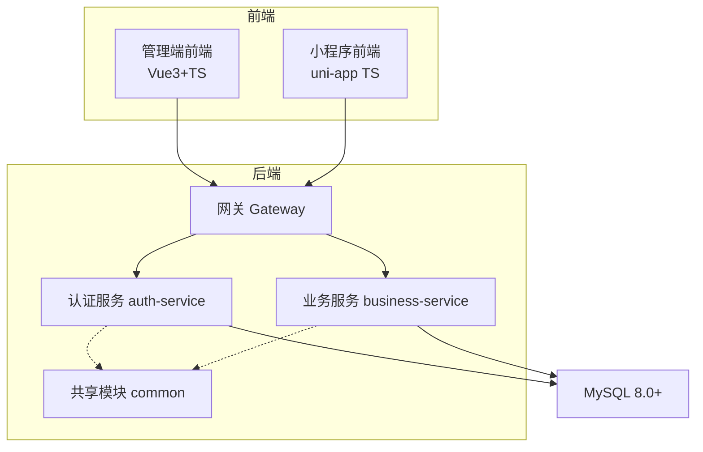
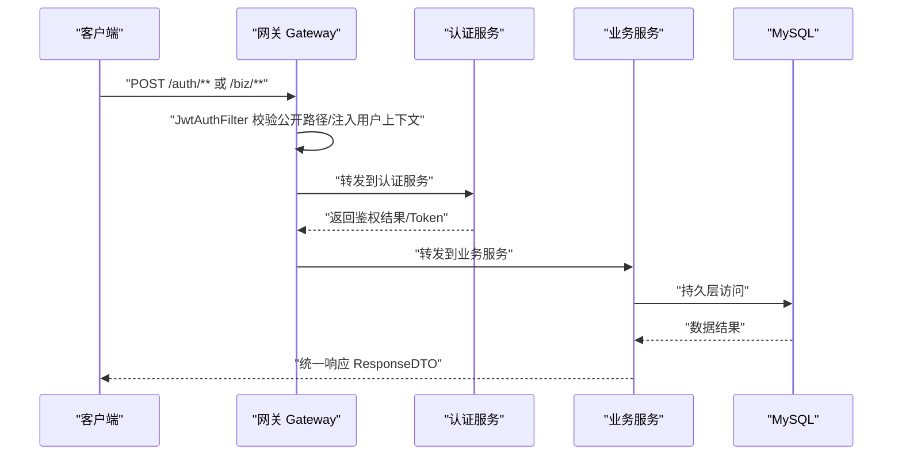
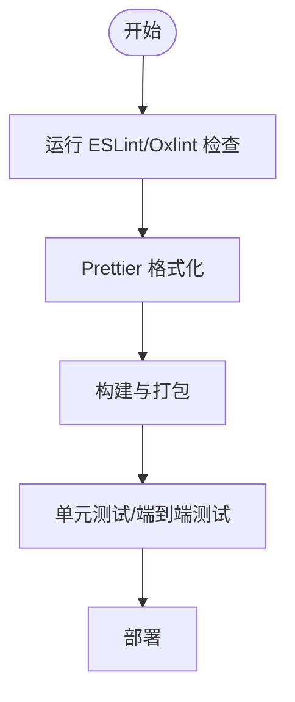
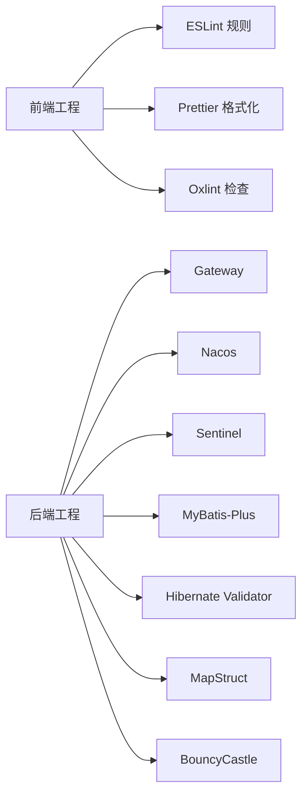

# 编码规范

<cite>
**本文引用的文件**   
- [class_record_admin_front/.prettierrc.json](file://class_record_admin_front/.prettierrc.json)
- [class_record_admin_front/eslint.config.ts](file://class_record_admin_front/eslint.config.ts)
- [class_record_admin_front/.editorconfig](file://class_record_admin_front/.editorconfig)
- [class_record_admin_front/.oxlintrc.json](file://class_record_admin_front/.oxlintrc.json)
- [class_times_record_back/docs/architecture.md](file://class_times_record_back/docs/architecture.md)
- [class_times_record_back/docs/class_times_record.sql](file://class_times_record_back/docs/class_times_record.sql)
</cite>

## 目录
1. [引言](#引言)
2. [项目结构](#项目结构)
3. [核心组件](#核心组件)
4. [架构总览](#架构总览)
5. [详细组件分析](#详细组件分析)
6. [依赖分析](#依赖分析)
7. [性能考虑](#性能考虑)
8. [故障排查指南](#故障排查指南)
9. [结论](#结论)
10. [附录](#附录)

## 引言
本编码规范面向课程记录系统的全栈团队，覆盖以下方面：
- Java 后端编码规范（类/方法命名、包结构、注释与异常处理、接口风格）
- TypeScript 前端编码规范（Vue 3 组件开发、类型定义、API 接口定义）
- SQL 编写规范（表结构设计、索引优化、查询性能）
- 代码质量检查工具配置与使用（ESLint、Prettier、Oxlint、SonarQube 建议）
- 最佳实践与示例路径，确保团队一致性

## 项目结构
仓库包含多个子模块：
- class_record_admin_front：管理端前端（Vue 3 + TypeScript），提供 ESLint/Prettier/Oxlint 配置
- class_times_record_back：后端微服务（Spring Cloud Alibaba），含网关、认证、业务服务及共享模块
- class_times_record：uni-app 微信小程序前端（TypeScript/Vue）
- course_record_mcp_server：MCP 服务端（TypeScript）



图表来源
- [class_times_record_back/docs/architecture.md:10-45](file://class_times_record_back/docs/architecture.md#L10-L45)

章节来源
- [class_times_record_back/docs/architecture.md:10-45](file://class_times_record_back/docs/architecture.md#L10-L45)

## 核心组件
本节聚焦于各层编码规范要点与落地位置。

- Java 后端
  - 分层与包职责：controller/service/impl/mapper/repository/entity/dto/vo/converter/config/interceptor/filter/aspect/exception/util/annotation/context/support
  - 数据流转：Controller 接收 DTO → Service 调用 Mapper → 返回 VO 统一包装 ResponseDTO<T>
  - 接口风格：统一 POST + @RequestBody；统一响应格式 {code,message,data}
  - 安全与签名：Gateway JwtAuthFilter 全局校验；Service 层拦截器链二次校验；SM3 请求签名与防重放
  - 主键策略：雪花算法 ASSIGN_ID
  - 逻辑删除：isDeleted 字段全局生效
  - 虚拟线程：JDK 21 虚拟线程启用，适合 I/O 密集型
  - 统一异常处理：GlobalExceptionHandler 分类处理参数校验、业务异常、SQL 异常等

- TypeScript 前端（管理端）
  - 代码风格：EditorConfig 统一缩进/换行/行宽；Prettier 单引号、无分号、行宽 100
  - 静态检查：ESLint Flat 配置（Vue/TS/Playwright/Vitest/Oxlint 集成）
  - Oxlint：correctness 级别 error，插件集包含 eslint/typescript/unicorn/oxc/vue/vitest
  - Vue 3 组件：多词组件名规则关闭（vue/multi-word-component-names: off）
  - API 接口：按业务域分包（auth/class/course-record 等），集中导出

- SQL 数据库
  - ER 关系与关键约束：唯一索引保证业务唯一性（如用户-课程记录权限、班级-学生、家长-学生等）
  - 索引设计：常用查询列建立 BTREE 索引，复合唯一索引用于去重
  - 字符集：utf8mb4，排序规则 utf8mb4_general_ci / utf8mb4_0900_ai_ci

章节来源
- [class_times_record_back/docs/architecture.md:265-324](file://class_times_record_back/docs/architecture.md#L265-L324)
- [class_times_record_back/docs/architecture.md:473-579](file://class_times_record_back/docs/architecture.md#L473-L579)
- [class_record_admin_front/eslint.config.ts:14-46](file://class_record_admin_front/eslint.config.ts#L14-L46)
- [class_record_admin_front/.prettierrc.json:1-7](file://class_record_admin_front/.prettierrc.json#L1-L7)
- [class_record_admin_front/.editorconfig:1-9](file://class_record_admin_front/.editorconfig#L1-L9)
- [class_record_admin_front/.oxlintrc.json:1-11](file://class_record_admin_front/.oxlintrc.json#L1-L11)
- [class_times_record_back/docs/class_times_record.sql:459-493](file://class_times_record_back/docs/class_times_record.sql#L459-L493)

## 架构总览
后端采用 Spring Cloud Gateway 作为统一入口，Nacos 注册发现，Sentinel 限流熔断；业务分为认证域与核心业务域，公共能力下沉至 common 模块。



图表来源
- [class_times_record_back/docs/architecture.md:10-45](file://class_times_record_back/docs/architecture.md#L10-L45)
- [class_times_record_back/docs/architecture.md:92-147](file://class_times_record_back/docs/architecture.md#L92-L147)

## 详细组件分析

### Java 后端编码规范
- 包结构与职责
  - controller：接入层，负责参数校验与组装响应
  - service/impl：业务实现，调用 mapper
  - repository/entity/dto/vo：实体、入参、出参分离
  - converter：MapStruct 对象转换
  - config/interceptor/filter/aspect：横切关注点
  - exception：全局异常处理与自定义异常
  - util/annotation/context/support：通用工具与上下文
- 命名约定
  - 类名：大驼峰，语义清晰（如 CourseRecordServiceImpl）
  - 方法名：小驼峰，动词开头（如 addStudentToClass）
  - 常量：全大写加下划线（如 MAX_STUDENT_COUNT）
  - 包名：全小写，按领域划分（如 com.shiroko.service.impl）
- 注释标准
  - 类与方法需说明职责、入参出参、异常与副作用
  - 复杂业务逻辑在关键分支添加行内注释
- 接口风格
  - 统一 POST + @RequestBody
  - 统一响应体 {code,message,data}
- 安全与签名
  - Gateway 层 JWT 校验与上下文注入
  - Service 层拦截器链二次校验
  - SM3 签名与时间戳/随机数防重放
- 异常处理
  - GlobalExceptionHandler 分类捕获并返回统一错误码与消息
- 数据模型与主键
  - 统一雪花算法 ASSIGN_ID
  - 逻辑删除 isDeleted 全局生效

章节来源
- [class_times_record_back/docs/architecture.md:265-324](file://class_times_record_back/docs/architecture.md#L265-L324)
- [class_times_record_back/docs/architecture.md:473-579](file://class_times_record_back/docs/architecture.md#L473-L579)
- [class_times_record_back/docs/architecture.md:250-263](file://class_times_record_back/docs/architecture.md#L250-L263)
- [class_times_record_back/docs/architecture.md:242-249](file://class_times_record_back/docs/architecture.md#L242-L249)
- [class_times_record_back/docs/architecture.md:216-233](file://class_times_record_back/docs/architecture.md#L216-L233)

### TypeScript 前端编码规范（管理端）
- EditorConfig 基础
  - 缩进 2 空格、LF 换行、末尾换行、去除尾部空白、最大行宽 100
- Prettier 格式化
  - 单引号、无分号、行宽 100
- ESLint 规则
  - 基于 flat 配置，启用 Vue/TS/Playwright/Vitest 插件
  - 关闭 vue/multi-word-component-names 强制多词组件名限制
  - @typescript-eslint/no-explicit-any 为 warn
- Oxlint 集成
  - correctness 级别 error，插件集包含 eslint/typescript/unicorn/oxc/vue/vitest
- Vue 3 组件开发
  - 组件文件组织：index.vue + index.d.ts + index.scss（业务页面常见）
  - 类型定义：优先使用 .d.ts 或 ts 类型文件，避免 any
- API 接口定义
  - 按业务域分包（如 api/auth/index.ts、api/class/index.ts）
  - 统一封装 request 工具，统一错误处理与重试策略



图表来源
- [class_record_admin_front/eslint.config.ts:14-46](file://class_record_admin_front/eslint.config.ts#L14-L46)
- [class_record_admin_front/.prettierrc.json:1-7](file://class_record_admin_front/.prettierrc.json#L1-L7)
- [class_record_admin_front/.editorconfig:1-9](file://class_record_admin_front/.editorconfig#L1-L9)
- [class_record_admin_front/.oxlintrc.json:1-11](file://class_record_admin_front/.oxlintrc.json#L1-L11)

章节来源
- [class_record_admin_front/.editorconfig:1-9](file://class_record_admin_front/.editorconfig#L1-L9)
- [class_record_admin_front/.prettierrc.json:1-7](file://class_record_admin_front/.prettierrc.json#L1-L7)
- [class_record_admin_front/eslint.config.ts:14-46](file://class_record_admin_front/eslint.config.ts#L14-L46)
- [class_record_admin_front/.oxlintrc.json:1-11](file://class_record_admin_front/.oxlintrc.json#L1-L11)

### SQL 编写规范
- 表结构设计
  - 使用 utf8mb4 字符集，合理选择排序规则
  - 所有表包含创建/更新时间字段，便于审计
  - 逻辑删除字段 isDeleted/is_delete 统一使用
- 索引优化
  - 外键关联列建立 BTREE 索引
  - 高频查询条件列建立索引
  - 复合唯一索引保障业务唯一性（如 course_record_id + user_id、class_id + student_id）
- 查询性能
  - 避免 SELECT *，按需取列
  - 分页查询使用 LIMIT/OFFSET 或游标
  - 避免深层嵌套子查询，必要时拆分为多次查询或视图
  - 合理使用联合索引，遵循最左前缀原则

```mermaid
erDiagram
USER ||--o{ USER_AUTH : "拥有"
USER ||--o{ USER_PLATFORM : "平台绑定"
PERMISSION ||--o{ USER_AUTH : "角色"
PERMISSION ||--o{ ROLE_MENU : "菜单权限"
MENU ||--o{ ROLE_MENU : "被授权"
INSTITUTION ||--o{ TEACHER : "所属机构"
INSTITUTION ||--o{ STUDENT : "所属机构"
COURSE ||--o{ CLASS : "开设班级"
COURSE ||--o{ COURSE_RECORD : "购买记录"
TEACHER ||--o{ TEACHER_COURSE : "教授课程"
CLASS ||--o{ CLASS_SCHEDULE : "排课"
CLASS ||--o{ CLASS_STUDENT : "学生关联"
STUDENT ||--o{ COURSE_RECORD : "购课记录"
COURSE_RECORD ||--o{ RECORD : "课时记录"
COURSE_RECORD ||--o{ PERMISSION_RECORD : "权限记录"
```

图表来源
- [class_times_record_back/docs/class_times_record.sql:24-493](file://class_times_record_back/docs/class_times_record.sql#L24-L493)

章节来源
- [class_times_record_back/docs/class_times_record.sql:459-493](file://class_times_record_back/docs/class_times_record.sql#L459-L493)

## 依赖分析
- 前端质量工具链
  - ESLint 通过 flat 配置聚合 Vue/TS/Playwright/Vitest 规则
  - Prettier 负责统一格式化
  - Oxlint 以 correctness:error 提升代码正确性
- 后端依赖
  - Spring Cloud Gateway/Nacos/Sentinel
  - MyBatis-Plus/Hibernate Validator/MapStruct/Fastjson2/BouncyCastle/Hutool/hashids
  - JDK 21 虚拟线程



图表来源
- [class_record_admin_front/eslint.config.ts:14-46](file://class_record_admin_front/eslint.config.ts#L14-L46)
- [class_record_admin_front/.prettierrc.json:1-7](file://class_record_admin_front/.prettierrc.json#L1-L7)
- [class_record_admin_front/.oxlintrc.json:1-11](file://class_record_admin_front/.oxlintrc.json#L1-L11)
- [class_times_record_back/docs/architecture.md:66-89](file://class_times_record_back/docs/architecture.md#L66-L89)

章节来源
- [class_record_admin_front/eslint.config.ts:14-46](file://class_record_admin_front/eslint.config.ts#L14-L46)
- [class_record_admin_front/.prettierrc.json:1-7](file://class_record_admin_front/.prettierrc.json#L1-L7)
- [class_record_admin_front/.oxlintrc.json:1-11](file://class_record_admin_front/.oxlintrc.json#L1-L11)
- [class_times_record_back/docs/architecture.md:66-89](file://class_times_record_back/docs/architecture.md#L66-L89)

## 性能考虑
- 后端
  - 开启虚拟线程，降低 I/O 阻塞带来的线程开销
  - 合理使用索引与分页，避免全表扫描与大结果集
  - 统一响应体减少序列化开销
- 前端
  - 控制单文件体积，按需引入第三方库
  - 列表分页加载，避免一次性渲染大量节点
  - 图片资源压缩与懒加载

## 故障排查指南
- 后端
  - 统一异常处理器会捕获参数校验失败、业务异常、SQL 异常等，返回统一错误码与消息
  - 若出现签名失败，检查 x-sign/x-timestamp/x-nonce 是否正确且未过期
- 前端
  - ESLint/Oxlint 报错时，根据提示修复语法与类型问题
  - Prettier 格式化不一致时，执行统一格式化命令

章节来源
- [class_times_record_back/docs/architecture.md:250-263](file://class_times_record_back/docs/architecture.md#L250-L263)
- [class_times_record_back/docs/architecture.md:149-176](file://class_times_record_back/docs/architecture.md#L149-L176)
- [class_record_admin_front/eslint.config.ts:14-46](file://class_record_admin_front/eslint.config.ts#L14-L46)
- [class_record_admin_front/.prettierrc.json:1-7](file://class_record_admin_front/.prettierrc.json#L1-L7)

## 结论
本规范从前后端与数据库三个维度明确了命名、结构、注释、接口与安全等要求，并结合现有工程中的 ESLint/Prettier/Oxlint 与后端统一异常、签名机制进行落地。遵循本规范可显著提升代码一致性与可维护性。

## 附录

### 工具配置与使用指南
- ESLint（Flat 配置）
  - 启用 Vue/TS/Playwright/Vitest 插件
  - 自定义规则：关闭多词组件名强制、any 类型告警
  - 参考路径：[eslint.config.ts](file://class_record_admin_front/eslint.config.ts)
- Prettier
  - 单引号、无分号、行宽 100
  - 参考路径：[.prettierrc.json](file://class_record_admin_front/.prettierrc.json)
- EditorConfig
  - 缩进 2 空格、LF、末尾换行、行宽 100
  - 参考路径：[.editorconfig](file://class_record_admin_front/.editorconfig)
- Oxlint
  - correctness:error，插件集包含 eslint/typescript/unicorn/oxc/vue/vitest
  - 参考路径：[.oxlintrc.json](file://class_record_admin_front/.oxlintrc.json)
- SonarQube（建议）
  - 在 CI 中集成 SonarScanner，设置项目 key、服务器地址与 token
  - 结合 ESLint/Prettier 输出报告，统一质量门禁
  - 注意：当前仓库未提供 SonarQube 配置文件，可按上述建议补充

章节来源
- [class_record_admin_front/eslint.config.ts:14-46](file://class_record_admin_front/eslint.config.ts#L14-L46)
- [class_record_admin_front/.prettierrc.json:1-7](file://class_record_admin_front/.prettierrc.json#L1-L7)
- [class_record_admin_front/.editorconfig:1-9](file://class_record_admin_front/.editorconfig#L1-L9)
- [class_record_admin_front/.oxlintrc.json:1-11](file://class_record_admin_front/.oxlintrc.json#L1-L11)