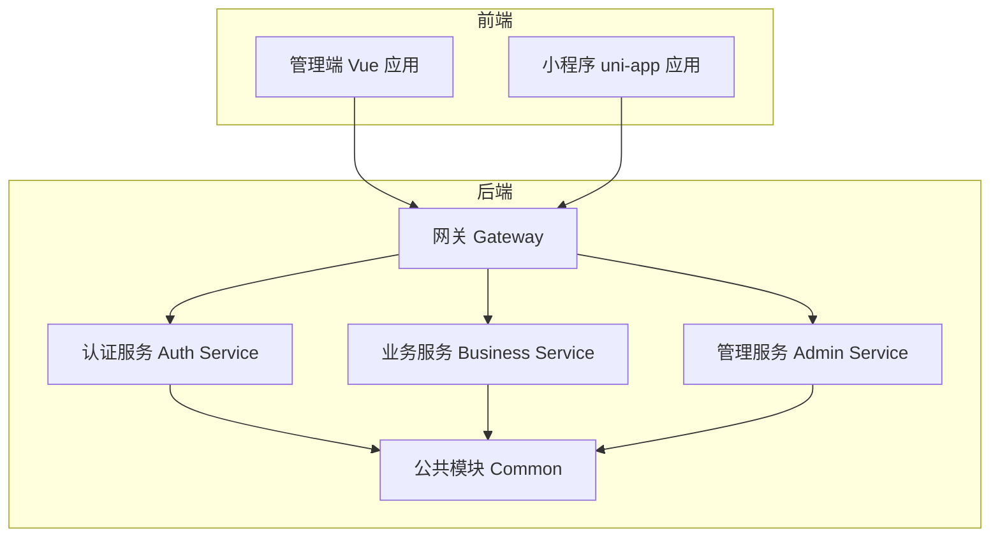
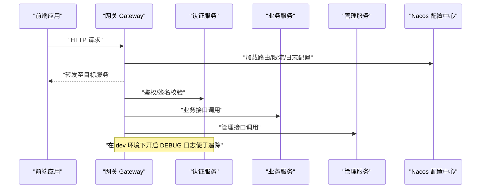
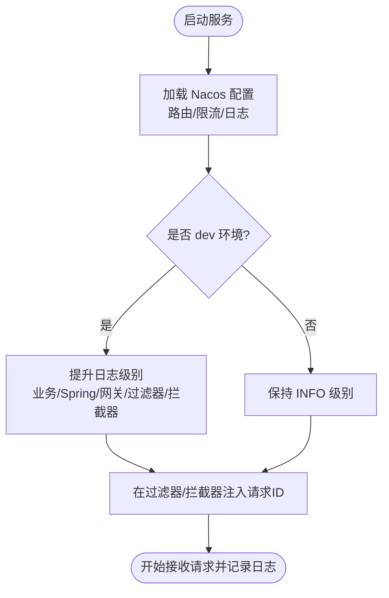
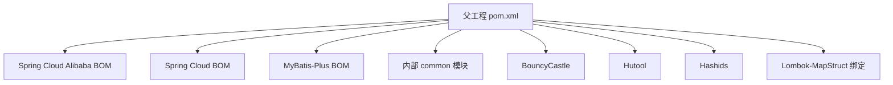

# 调试指南

<cite>
**本文引用的文件**   
- [pom.xml](file://class_times_record_back/pom.xml)
- [application.yml](file://class_times_record_back/gateway/src/main/resources/application.yml)
- [logback-spring.xml](file://class_times_record_back/common/src/main/resources/logback-spring.xml)
- [AdminServiceApplication.run.xml](file://class_times_record_back/.run/AdminServiceApplication.run.xml)
- [AuthServiceApplication.run.xml](file://class_times_record_back/.run/AuthServiceApplication.run.xml)
- [BusinessServiceApplication.run.xml](file://class_times_record_back/.run/BusinessServiceApplication.run.xml)
- [GatewayApplication.run.xml](file://class_times_record_back/.run/GatewayApplication.run.xml)
</cite>

## 目录
1. [简介](#简介)
2. [项目结构](#项目结构)
3. [核心组件](#核心组件)
4. [架构总览](#架构总览)
5. [详细组件分析](#详细组件分析)
6. [依赖分析](#依赖分析)
7. [性能考虑](#性能考虑)
8. [故障排查指南](#故障排查指南)
9. [结论](#结论)
10. [附录](#附录)

## 简介
本调试指南面向课程记录系统的后端与前端，覆盖以下主题：
- 后端服务调试：IDEA 远程调试、日志级别调整、性能分析工具使用
- 前端应用调试：浏览器开发者工具、Vue DevTools、小程序调试模式
- 微服务间调试：网关请求追踪、服务间调用链路分析、分布式事务调试
- 常见问题定位：连接超时、权限验证失败、数据库连接异常等
- 性能监控与瓶颈分析：JProfiler、Arthas 等工具的配置与使用
- 典型调试场景与解决步骤

## 项目结构
后端采用 Spring Cloud Alibaba 微服务架构，包含网关、认证、业务、管理以及公共模块；前端包含管理端（Vue）与小程序端（uni-app）。

[此图为概念性结构图，不直接映射具体源码文件]

## 核心组件
- 网关配置与动态配置中心集成：通过 Nacos 导入路由、限流与日志配置。
- 统一日志框架：基于 Logback，提供异步控制台输出与环境化日志级别控制。
- IDEA 运行配置：为各服务提供 dev 环境启动模板，便于本地快速调试。

章节来源
- [application.yml:1-19](file://class_times_record_back/gateway/src/main/resources/application.yml#L1-L19)
- [logback-spring.xml:1-83](file://class_times_record_back/common/src/main/resources/logback-spring.xml#L1-L83)
- [AdminServiceApplication.run.xml:1-10](file://class_times_record_back/.run/AdminServiceApplication.run.xml#L1-L10)
- [AuthServiceApplication.run.xml:1-10](file://class_times_record_back/.run/AuthServiceApplication.run.xml#L1-L10)
- [BusinessServiceApplication.run.xml:1-11](file://class_times_record_back/.run/BusinessServiceApplication.run.xml#L1-L11)
- [GatewayApplication.run.xml:1-18](file://class_times_record_back/.run/GatewayApplication.run.xml#L1-L18)

## 架构总览
下图展示了从前端到网关再到各微服务的请求路径，并标注了可观测点（日志、过滤器/拦截器、Nacos 配置）。

图表来源
- [application.yml:1-19](file://class_times_record_back/gateway/src/main/resources/application.yml#L1-L19)
- [logback-spring.xml:46-78](file://class_times_record_back/common/src/main/resources/logback-spring.xml#L46-L78)

## 详细组件分析

### 后端服务调试（IDEA 远程调试）
- 本地开发建议直接使用已提供的 Spring Boot 运行配置，默认启用 dev 环境与调试开关。
- 如需远程调试：
  - 在服务启动参数中增加 JVM 远程调试选项（例如监听端口），并在 IDEA 中添加 Remote JVM Debug 配置指向该端口。
  - 确保防火墙允许调试端口访问，且服务进程以非守护方式运行以便断点生效。
  - 结合 dev 环境的 DEBUG 日志，可在关键入口与过滤器处设置断点，逐步跟踪请求处理流程。

章节来源
- [BusinessServiceApplication.run.xml:1-11](file://class_times_record_back/.run/BusinessServiceApplication.run.xml#L1-L11)
- [AdminServiceApplication.run.xml:1-10](file://class_times_record_back/.run/AdminServiceApplication.run.xml#L1-L10)
- [AuthServiceApplication.run.xml:1-10](file://class_times_record_back/.run/AuthServiceApplication.run.xml#L1-L10)
- [GatewayApplication.run.xml:1-18](file://class_times_record_back/.run/GatewayApplication.run.xml#L1-L18)

### 日志级别调整与请求追踪
- 日志框架：Logback 异步控制台输出，避免阻塞业务线程。
- 环境化日志：
  - dev 环境：将业务包、Spring 框架、网关路由、过滤器/拦截器、Sentinel 日志提升至 DEBUG/INFO，便于问题定位。
  - 生产环境：根级别 INFO，屏蔽高频心跳与冗余信息。
- 请求追踪：
  - 建议在网关或过滤器中生成并透传唯一请求 ID，并在日志中打印，便于跨服务关联。
  - 在 dev 环境下开启网关路由与过滤器/拦截器的 DEBUG 日志，有助于观察路由匹配与鉴权流程。

图表来源
- [logback-spring.xml:1-83](file://class_times_record_back/common/src/main/resources/logback-spring.xml#L1-L83)
- [application.yml:1-19](file://class_times_record_back/gateway/src/main/resources/application.yml#L1-L19)

章节来源
- [logback-spring.xml:1-83](file://class_times_record_back/common/src/main/resources/logback-spring.xml#L1-L83)
- [application.yml:1-19](file://class_times_record_back/gateway/src/main/resources/application.yml#L1-L19)

### 前端应用调试技巧
- 管理端（Vue）：
  - 使用浏览器开发者工具进行网络面板抓包、控制台错误排查、元素与样式检查。
  - 安装并使用 Vue DevTools 查看组件树、状态与事件。
  - 若使用 Vite 开发服务器，可利用热重载与 Source Map 提高调试效率。
- 小程序（uni-app）：
  - 使用微信开发者工具或其他平台对应 IDE 的调试功能，开启“调试模式”与“显示调试信息”。
  - 关注网络请求、控制台日志与存储数据，必要时在关键逻辑处添加临时日志输出。

[本节为通用指导，不直接分析具体源码文件]

### 微服务间调试方法
- 网关请求追踪：
  - 在 dev 环境下开启网关路由与过滤器/拦截器的 DEBUG 日志，观察请求进入、路由匹配与转发过程。
  - 结合 Nacos 动态配置，实时调整路由规则与限流策略，验证变更效果。
- 服务间调用链路分析：
  - 在各服务的关键入口与出口打印请求 ID，配合日志聚合系统实现端到端链路追踪。
  - 对 Feign/OpenFeign 调用增加日志级别（如 BASIC 或 FULL）以观察入参与响应摘要。
- 分布式事务调试：
  - 若引入 Seata，需在 Nacos 中配置事务组与全局事务相关参数，并在业务方法上启用事务注解。
  - 通过事务日志与回滚原因定位不一致问题。

章节来源
- [application.yml:1-19](file://class_times_record_back/gateway/src/main/resources/application.yml#L1-L19)
- [logback-spring.xml:46-78](file://class_times_record_back/common/src/main/resources/logback-spring.xml#L46-L78)

### 常见问题的排查方法
- 连接超时：
  - 检查 Nacos 地址与命名空间是否正确，确认服务注册与发现正常。
  - 在 dev 环境下开启网关与服务 DEBUG 日志，观察连接建立与重试行为。
- 权限验证失败：
  - 核对网关鉴权过滤器与签名拦截器的日志，确认令牌、签名与权限规则。
  - 在认证服务中增加关键分支的 DEBUG 日志，定位校验失败的具体环节。
- 数据库连接异常：
  - 检查数据库连接参数、驱动版本与网络连通性。
  - 在 MyBatis Mapper 日志级别设置为 DEBUG，观察 SQL 执行与异常堆栈。

章节来源
- [logback-spring.xml:21-37](file://class_times_record_back/common/src/main/resources/logback-spring.xml#L21-L37)
- [logback-spring.xml:46-78](file://class_times_record_back/common/src/main/resources/logback-spring.xml#L46-L78)
- [application.yml:1-19](file://class_times_record_back/gateway/src/main/resources/application.yml#L1-L19)

### 性能监控与瓶颈分析工具
- JProfiler：
  - 在 JVM 启动参数中附加 JProfiler 代理，IDEA 中创建 Remote JProfiler 配置连接目标进程。
  - 采集 CPU 热点、内存分配与锁竞争，结合日志定位慢调用与资源泄漏。
- Arthas：
  - 通过 attach 方式接入运行中的 Java 进程，使用 dashboard、thread、trace、profiler 等命令进行在线诊断。
  - 针对热点方法使用 trace 观察调用链耗时，结合日志输出定位瓶颈。

[本节为通用指导，不直接分析具体源码文件]

### 典型调试场景与解决步骤
- 场景一：网关无法路由到目标服务
  - 步骤：
    - 检查 Nacos 配置与命名空间，确认服务已注册。
    - 在 dev 环境下开启网关路由 DEBUG 日志，观察路由匹配结果。
    - 使用浏览器或 curl 测试直连目标服务，排除网络与鉴权问题。
- 场景二：鉴权失败导致 401/403
  - 步骤：
    - 在网关过滤器与认证服务中开启 DEBUG 日志，核对令牌与权限规则。
    - 在 IDEA 中对鉴权关键分支设置断点，逐步验证逻辑。
- 场景三：数据库查询缓慢
  - 步骤：
    - 将 MyBatis Mapper 日志级别设为 DEBUG，捕获慢 SQL。
    - 使用 JProfiler/Arthas 分析热点方法与锁等待，结合索引与分页优化。

[本节为通用指导，不直接分析具体源码文件]

## 依赖分析
后端父工程统一管理 Spring Boot、Spring Cloud、MyBatis-Plus 等依赖版本，并通过 BOM 集中管理第三方库版本，保证依赖一致性。

图表来源
- [pom.xml:48-103](file://class_times_record_back/pom.xml#L48-L103)

章节来源
- [pom.xml:1-162](file://class_times_record_back/pom.xml#L1-L162)

## 性能考虑
- 日志异步输出：使用异步 Appender 减少 I/O 对业务线程的影响。
- 日志级别按需调整：仅在 dev 环境开启高粒度日志，生产保持 INFO 以降低开销。
- 网关与过滤器日志：在 dev 环境开启 DEBUG，生产关闭或降级，避免高频日志影响吞吐。
- 热点方法分析：结合 JProfiler/Arthas 定位 CPU 与内存热点，针对性优化。

章节来源
- [logback-spring.xml:6-12](file://class_times_record_back/common/src/main/resources/logback-spring.xml#L6-L12)
- [logback-spring.xml:46-78](file://class_times_record_back/common/src/main/resources/logback-spring.xml#L46-L78)

## 故障排查指南
- 连接超时：
  - 检查 Nacos 地址、命名空间与网络连通性。
  - 在 dev 环境开启网关与服务 DEBUG 日志，观察连接建立与重试。
- 权限验证失败：
  - 核对网关鉴权过滤器与签名拦截器日志，确认令牌与权限规则。
  - 在认证服务中增加关键分支的 DEBUG 日志，定位校验失败环节。
- 数据库连接异常：
  - 检查数据库连接参数、驱动版本与网络连通性。
  - 将 MyBatis Mapper 日志级别设为 DEBUG，观察 SQL 执行与异常堆栈。

章节来源
- [application.yml:1-19](file://class_times_record_back/gateway/src/main/resources/application.yml#L1-L19)
- [logback-spring.xml:21-37](file://class_times_record_back/common/src/main/resources/logback-spring.xml#L21-L37)
- [logback-spring.xml:46-78](file://class_times_record_back/common/src/main/resources/logback-spring.xml#L46-L78)

## 结论
通过合理的日志级别管理、网关请求追踪与性能分析工具的使用，可以高效定位前后端与微服务间的各类问题。建议在 dev 环境充分利用 DEBUG 日志与断点调试，在生产环境保持精简日志并结合 APM 工具进行持续监控。

## 附录
- 常用命令与配置要点：
  - 在 JVM 启动参数中追加远程调试选项，并在 IDEA 中配置 Remote 调试。
  - 在 Nacos 中维护路由、限流与日志配置，支持动态刷新。
  - 在 dev 环境开启网关与过滤器的 DEBUG 日志，便于端到端追踪。

[本节为通用指导，不直接分析具体源码文件]