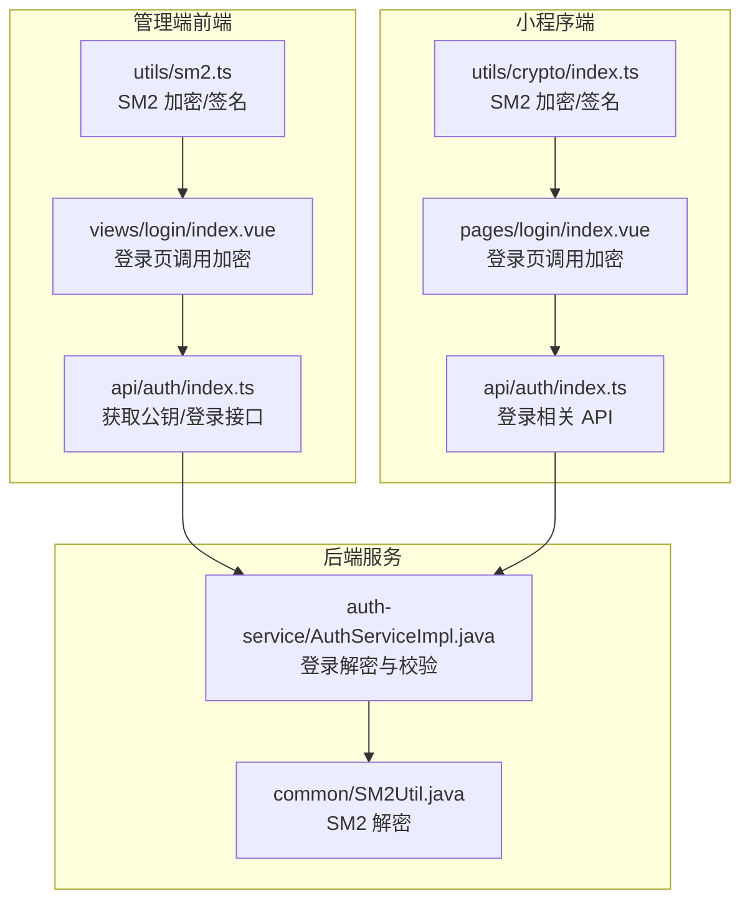
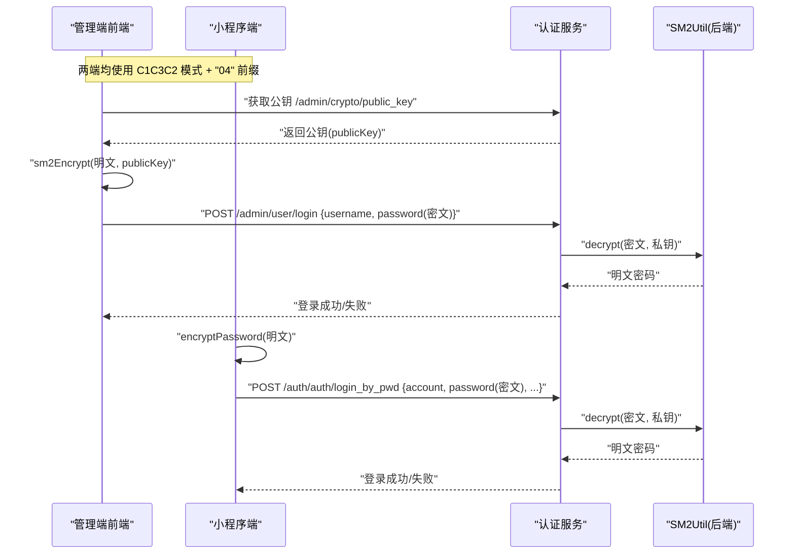
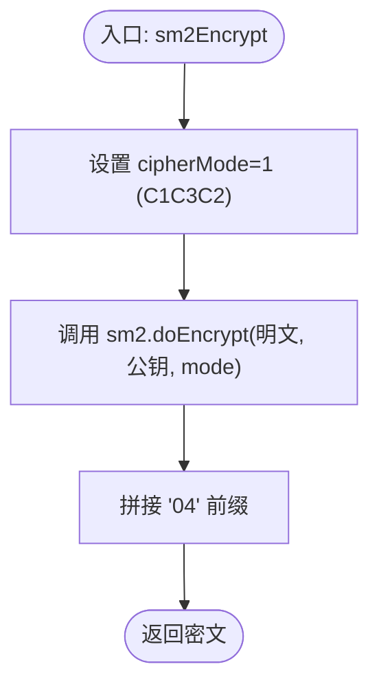
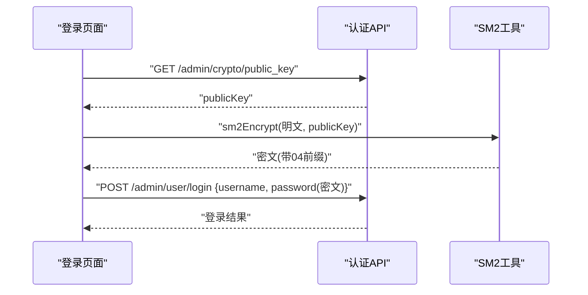
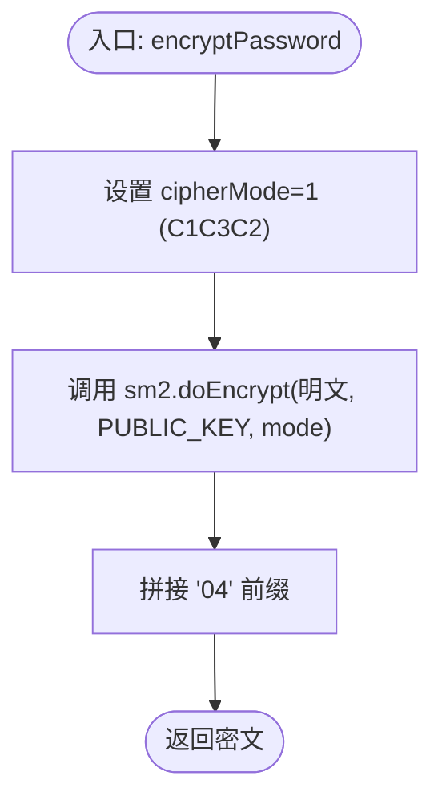
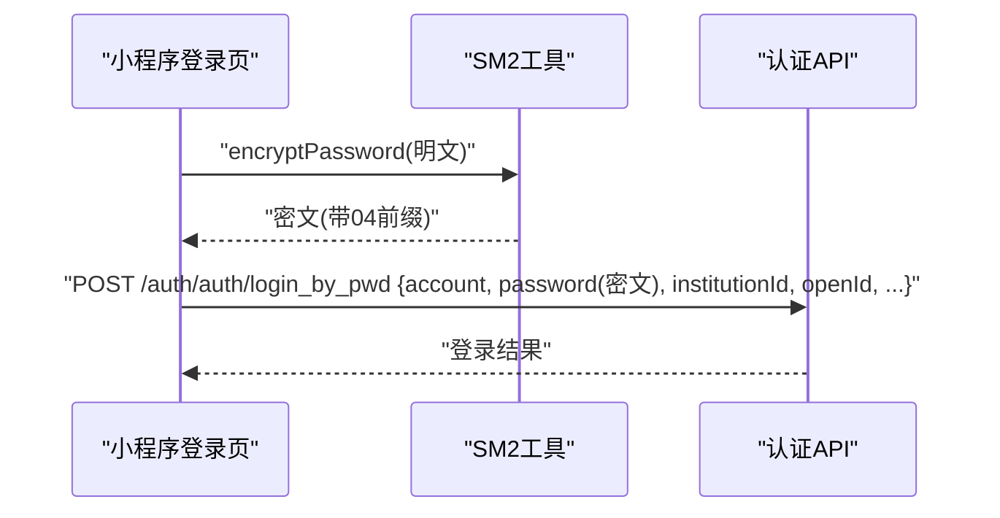
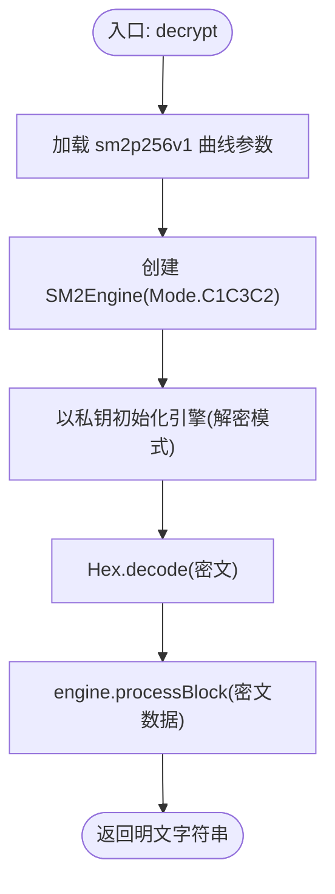
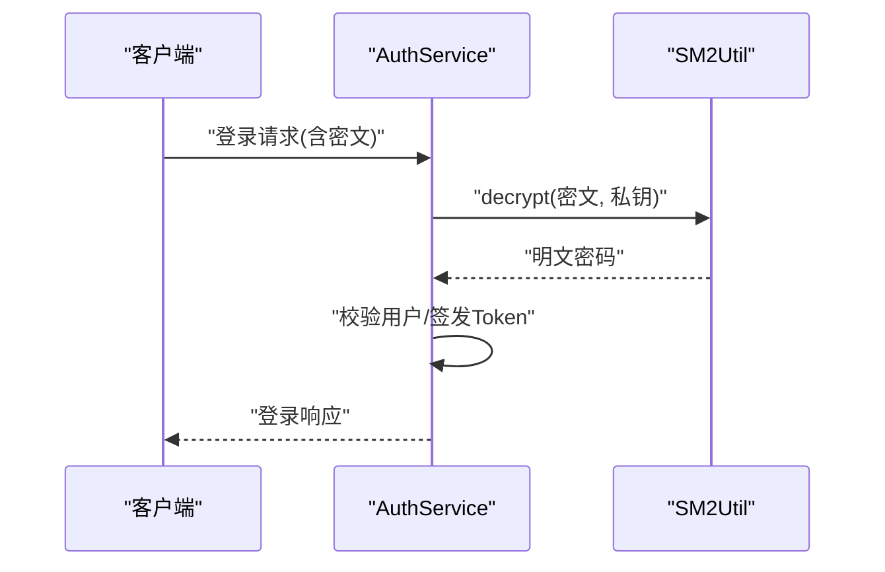
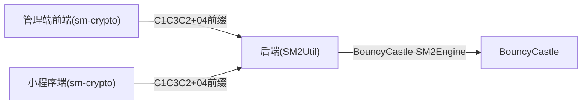

# SM2非对称加密实现

<cite>
**本文引用的文件**
- [class_record_admin_front/src/utils/sm2.ts](file://class_record_admin_front/src/utils/sm2.ts)
- [class_record_admin_front/src/views/login/index.vue](file://class_record_admin_front/src/views/login/index.vue)
- [class_record_admin_front/src/api/auth/index.ts](file://class_record_admin_front/src/api/auth/index.ts)
- [class_times_record/src/utils/crypto/index.ts](file://class_times_record/src/utils/crypto/index.ts)
- [class_times_record/src/pages/login/index.vue](file://class_times_record/src/pages/login/index.vue)
- [class_times_record/src/api/auth/index.ts](file://class_times_record/src/api/auth/index.ts)
- [class_times_record_back/common/src/main/java/com/shiroko/util/SM2Util.java](file://class_times_record_back/common/src/main/java/com/shiroko/util/SM2Util.java)
- [class_times_record_back/auth-service/src/main/java/com/shiroko/service/impl/AuthServiceImpl.java](file://class_times_record_back/auth-service/src/main/java/com/shiroko/service/impl/AuthServiceImpl.java)
</cite>

## 目录
1. [简介](#简介)
2. [项目结构](#项目结构)
3. [核心组件](#核心组件)
4. [架构总览](#架构总览)
5. [详细组件分析](#详细组件分析)
6. [依赖关系分析](#依赖关系分析)
7. [性能与兼容性](#性能与兼容性)
8. [故障排查指南](#故障排查指南)
9. [结论](#结论)
10. [附录：使用示例与最佳实践](#附录使用示例与最佳实践)

## 简介
本文件围绕项目中 SM2 非对称加密的完整落地进行系统化说明，覆盖小程序端与管理端的公钥配置、加密模式选择（C1C3C2 vs C1C2C3）、密文格式处理、密码加密流程、前后端兼容性与版本适配策略，以及密钥管理与安全注意事项。文档以代码级事实为依据，提供可视化图示与可操作的实践建议，帮助读者快速理解并正确集成 SM2 能力。

## 项目结构
本项目包含三条关键路径：
- 管理端前端（Vue）：负责获取后端公钥、对密码进行 SM2 加密，并在登录等敏感场景传输密文。
- 小程序端（uni-app）：在登录时通过内置工具库对密码进行 SM2 加密后提交。
- 后端服务（Java）：统一使用 SM2 解密工具类对前端传来的密文进行解密，再进行后续认证或业务处理。

图表来源
- [class_record_admin_front/src/utils/sm2.ts:1-88](file://class_record_admin_front/src/utils/sm2.ts#L1-L88)
- [class_record_admin_front/src/views/login/index.vue:69-112](file://class_record_admin_front/src/views/login/index.vue#L69-L112)
- [class_record_admin_front/src/api/auth/index.ts:1-14](file://class_record_admin_front/src/api/auth/index.ts#L1-L14)
- [class_times_record/src/utils/crypto/index.ts:1-99](file://class_times_record/src/utils/crypto/index.ts#L1-L99)
- [class_times_record/src/pages/login/index.vue:295-340](file://class_times_record/src/pages/login/index.vue#L295-L340)
- [class_times_record/src/api/auth/index.ts:59-77](file://class_times_record/src/api/auth/index.ts#L59-L77)
- [class_times_record_back/common/src/main/java/com/shiroko/util/SM2Util.java:28-42](file://class_times_record_back/common/src/main/java/com/shiroko/util/SM2Util.java#L28-L42)
- [class_times_record_back/auth-service/src/main/java/com/shiroko/service/impl/AuthServiceImpl.java:142-142](file://class_times_record_back/auth-service/src/main/java/com/shiroko/service/impl/AuthServiceImpl.java#L142-L142)

章节来源
- [class_record_admin_front/src/utils/sm2.ts:1-88](file://class_record_admin_front/src/utils/sm2.ts#L1-L88)
- [class_times_record/src/utils/crypto/index.ts:1-99](file://class_times_record/src/utils/crypto/index.ts#L1-L99)
- [class_times_record_back/common/src/main/java/com/shiroko/util/SM2Util.java:28-42](file://class_times_record_back/common/src/main/java/com/shiroko/util/SM2Util.java#L28-L42)

## 核心组件
- 管理端 SM2 工具
  - 提供 SM2 公钥加密函数，固定使用 C1C3C2 模式，并在密文前追加“04”前缀，确保与后端一致。
  - 同时提供基于 SM3 的请求签名生成器，用于防篡改。
- 小程序端 SM2 工具
  - 提供 SM2 加密函数，同样采用 C1C3C2 模式，并以“04”前缀输出密文。
  - 提供请求签名生成逻辑，与后端保持一致的排序与过滤规则。
- 后端 SM2 解密工具
  - 基于 BouncyCastle 的 SM2Engine，明确指定 Mode.C1C3C2，完成从 Hex 密文到明文的还原。

章节来源
- [class_record_admin_front/src/utils/sm2.ts:15-17](file://class_record_admin_front/src/utils/sm2.ts#L15-L17)
- [class_times_record/src/utils/crypto/index.ts:15-19](file://class_times_record/src/utils/crypto/index.ts#L15-L19)
- [class_times_record_back/common/src/main/java/com/shiroko/util/SM2Util.java:54-58](file://class_times_record_back/common/src/main/java/com/shiroko/util/SM2Util.java#L54-L58)

## 架构总览
下图展示了从前端输入明文到后端解密的端到端流程，涵盖管理端与小程序端两条链路。

图表来源
- [class_record_admin_front/src/api/auth/index.ts:3-8](file://class_record_admin_front/src/api/auth/index.ts#L3-L8)
- [class_record_admin_front/src/views/login/index.vue:72-85](file://class_record_admin_front/src/views/login/index.vue#L72-L85)
- [class_times_record/src/pages/login/index.vue:318-325](file://class_times_record/src/pages/login/index.vue#L318-L325)
- [class_times_record_back/auth-service/src/main/java/com/shiroko/service/impl/AuthServiceImpl.java:142-142](file://class_times_record_back/auth-service/src/main/java/com/shiroko/service/impl/AuthServiceImpl.java#L142-L142)
- [class_times_record_back/common/src/main/java/com/shiroko/util/SM2Util.java:28-42](file://class_times_record_back/common/src/main/java/com/shiroko/util/SM2Util.java#L28-L42)

## 详细组件分析

### 管理端前端 SM2 工具（utils/sm2.ts）
- 功能要点
  - 使用 sm-crypto 的 SM2 加密，cipherMode=1（C1C3C2），并在结果前拼接“04”。
  - 提供 generateSign 方法，按后端期望的键值顺序与空值过滤规则生成 SM3 签名。
- 关键实现位置
  - 加密函数：[sm2Encrypt:15-17](file://class_record_admin_front/src/utils/sm2.ts#L15-L17)
  - 签名生成：[generateSign:52-87](file://class_record_admin_front/src/utils/sm2.ts#L52-L87)

图表来源
- [class_record_admin_front/src/utils/sm2.ts:15-17](file://class_record_admin_front/src/utils/sm2.ts#L15-L17)

章节来源
- [class_record_admin_front/src/utils/sm2.ts:1-88](file://class_record_admin_front/src/utils/sm2.ts#L1-L88)

### 管理端登录流程（views/login/index.vue）
- 流程要点
  - 先调用 getPublicKey 获取后端公钥。
  - 使用 sm2Encrypt 对密码进行加密。
  - 将密文随用户名一起提交至登录接口。
- 关键实现位置
  - 获取公钥与加密：[getPublicKey 与 sm2Encrypt 调用:72-85](file://class_record_admin_front/src/views/login/index.vue#L72-L85)
  - 登录接口定义：[login:7-9](file://class_record_admin_front/src/api/auth/index.ts#L7-L9)

图表来源
- [class_record_admin_front/src/views/login/index.vue:72-85](file://class_record_admin_front/src/views/login/index.vue#L72-L85)
- [class_record_admin_front/src/api/auth/index.ts:3-8](file://class_record_admin_front/src/api/auth/index.ts#L3-L8)

章节来源
- [class_record_admin_front/src/views/login/index.vue:69-112](file://class_record_admin_front/src/views/login/index.vue#L69-L112)
- [class_record_admin_front/src/api/auth/index.ts:1-14](file://class_record_admin_front/src/api/auth/index.ts#L1-L14)

### 小程序端 SM2 工具（utils/crypto/index.ts）
- 功能要点
  - 使用 sm-crypto 的 SM2 加密，cipherMode=1（C1C3C2），并在结果前拼接“04”。
  - 提供 generateSign 方法，模拟后端 JSON 序列化时的排序与空值过滤行为，保证签名一致性。
- 关键实现位置
  - 加密函数：[encryptPassword:15-19](file://class_times_record/src/utils/crypto/index.ts#L15-L19)
  - 签名生成：[generateSign:60-98](file://class_times_record/src/utils/crypto/index.ts#L60-L98)

图表来源
- [class_times_record/src/utils/crypto/index.ts:15-19](file://class_times_record/src/utils/crypto/index.ts#L15-L19)

章节来源
- [class_times_record/src/utils/crypto/index.ts:1-99](file://class_times_record/src/utils/crypto/index.ts#L1-L99)

### 小程序端登录流程（pages/login/index.vue）
- 流程要点
  - 表单校验通过后，直接调用 encryptPassword 对密码进行加密。
  - 将密文随账号、机构信息、OpenID 等参数提交至登录接口。
- 关键实现位置
  - 加密与提交：[login 函数:295-340](file://class_times_record/src/pages/login/index.vue#L295-L340)
  - 登录 API：[loginByPwd:59-77](file://class_times_record/src/api/auth/index.ts#L59-L77)

图表来源
- [class_times_record/src/pages/login/index.vue:318-325](file://class_times_record/src/pages/login/index.vue#L318-L325)
- [class_times_record/src/api/auth/index.ts:59-77](file://class_times_record/src/api/auth/index.ts#L59-L77)

章节来源
- [class_times_record/src/pages/login/index.vue:295-340](file://class_times_record/src/pages/login/index.vue#L295-L340)
- [class_times_record/src/api/auth/index.ts:59-77](file://class_times_record/src/api/auth/index.ts#L59-L77)

### 后端 SM2 解密（SM2Util.java）
- 功能要点
  - 使用 BouncyCastle 的 SM2Engine，显式指定 Mode.C1C3C2，与前端保持一致。
  - 接收 Hex 密文字符串，解码为字节数组后进行解密，返回明文。
- 关键实现位置
  - 解密主流程：[decrypt:28-42](file://class_times_record_back/common/src/main/java/com/shiroko/util/SM2Util.java#L28-L42)
  - 引擎初始化与模式设置：[getSm2Engine:44-59](file://class_times_record_back/common/src/main/java/com/shiroko/util/SM2Util.java#L44-L59)

图表来源
- [class_times_record_back/common/src/main/java/com/shiroko/util/SM2Util.java:28-42](file://class_times_record_back/common/src/main/java/com/shiroko/util/SM2Util.java#L28-L42)
- [class_times_record_back/common/src/main/java/com/shiroko/util/SM2Util.java:44-59](file://class_times_record_back/common/src/main/java/com/shiroko/util/SM2Util.java#L44-L59)

章节来源
- [class_times_record_back/common/src/main/java/com/shiroko/util/SM2Util.java:1-61](file://class_times_record_back/common/src/main/java/com/shiroko/util/SM2Util.java#L1-L61)

### 后端登录解密（AuthServiceImpl.java）
- 功能要点
  - 在登录流程中调用 SM2Util.decrypt 对前端提交的密文进行解密，得到明文后再进行用户校验与令牌签发。
- 关键实现位置
  - 解密调用点：[decrypt 调用:142-142](file://class_times_record_back/auth-service/src/main/java/com/shiroko/service/impl/AuthServiceImpl.java#L142-L142)

图表来源
- [class_times_record_back/auth-service/src/main/java/com/shiroko/service/impl/AuthServiceImpl.java:142-142](file://class_times_record_back/auth-service/src/main/java/com/shiroko/service/impl/AuthServiceImpl.java#L142-L142)
- [class_times_record_back/common/src/main/java/com/shiroko/util/SM2Util.java:28-42](file://class_times_record_back/common/src/main/java/com/shiroko/util/SM2Util.java#L28-L42)

章节来源
- [class_times_record_back/auth-service/src/main/java/com/shiroko/service/impl/AuthServiceImpl.java:142-142](file://class_times_record_back/auth-service/src/main/java/com/shiroko/service/impl/AuthServiceImpl.java#L142-L142)

## 依赖关系分析
- 前端依赖
  - 管理端与小程序端均依赖 sm-crypto 库进行 SM2 加密与 SM3 签名。
  - 管理端通过 /admin/crypto/public_key 动态获取公钥；小程序端使用内置公钥常量。
- 后端依赖
  - 使用 BouncyCastle 提供的 SM2Engine，严格匹配 C1C3C2 模式。
- 耦合与内聚
  - 加密/解密模式与密文格式（“04”前缀）是前后端强耦合点，需保持严格一致。
  - 签名算法与序列化规则（键排序、空值过滤）也是易错点，需前后端对齐。

图表来源
- [class_record_admin_front/src/utils/sm2.ts:15-17](file://class_record_admin_front/src/utils/sm2.ts#L15-L17)
- [class_times_record/src/utils/crypto/index.ts:15-19](file://class_times_record/src/utils/crypto/index.ts#L15-L19)
- [class_times_record_back/common/src/main/java/com/shiroko/util/SM2Util.java:54-58](file://class_times_record_back/common/src/main/java/com/shiroko/util/SM2Util.java#L54-L58)

章节来源
- [class_record_admin_front/src/utils/sm2.ts:1-88](file://class_record_admin_front/src/utils/sm2.ts#L1-L88)
- [class_times_record/src/utils/crypto/index.ts:1-99](file://class_times_record/src/utils/crypto/index.ts#L1-L99)
- [class_times_record_back/common/src/main/java/com/shiroko/util/SM2Util.java:1-61](file://class_times_record_back/common/src/main/java/com/shiroko/util/SM2Util.java#L1-L61)

## 性能与兼容性
- 性能特性
  - SM2 为非对称加密，适合小数据量（如密码、短文本）加解密；大数据应结合对称加密（如 AES）进行混合加密。
  - 前端加密与后端解密均为 CPU 密集型操作，应避免在主线程阻塞 UI。
- 兼容性处理
  - 模式选择：当前统一使用 C1C3C2（cipherMode=1）。若未来升级至新标准（C1C2C3），需同步调整前后端模式与测试用例。
  - 密文格式：统一以“04”前缀标识未压缩公钥/密文形式，避免解析歧义。
  - 签名一致性：前后端对对象序列化时的键排序与空值过滤必须一致，否则签名校验失败。

## 故障排查指南
- 常见问题
  - 解密失败：检查前后端是否同为 C1C3C2 模式；确认密文是否为 Hex 且带有“04”前缀。
  - 签名不一致：核对签名拼接顺序、空值过滤规则与盐值是否一致。
  - 公钥不匹配：管理端应从后端动态获取公钥；小程序端需确保内置公钥与后端一致。
- 定位步骤
  - 在前端打印加密前后的密文，确认长度与格式。
  - 在后端记录解密异常堆栈，定位是模式错误还是数据格式问题。
  - 对比签名原始字符串与最终哈希，验证序列化差异。

章节来源
- [class_record_admin_front/src/utils/sm2.ts:52-87](file://class_record_admin_front/src/utils/sm2.ts#L52-L87)
- [class_times_record/src/utils/crypto/index.ts:60-98](file://class_times_record/src/utils/crypto/index.ts#L60-L98)
- [class_times_record_back/common/src/main/java/com/shiroko/util/SM2Util.java:28-42](file://class_times_record_back/common/src/main/java/com/shiroko/util/SM2Util.java#L28-L42)

## 结论
本项目在管理端与小程序端均采用 SM2 C1C3C2 模式与“04”前缀的密文格式，后端通过统一的 SM2Util 进行解密，整体链路清晰、一致性良好。为确保长期稳定，建议持续对齐序列化与签名规则，关注模式升级带来的兼容变更，并完善密钥轮换与审计机制。

## 附录：使用示例与最佳实践
- 典型场景
  - 登录密码加密：管理端与小程序端均在登录前对密码进行 SM2 加密后提交。
  - 敏感数据传输：对身份证号、手机号等敏感字段进行 SM2 加密传输。
- 参考实现路径
  - 管理端登录加密：[登录页调用 sm2Encrypt:72-85](file://class_record_admin_front/src/views/login/index.vue#L72-L85)
  - 小程序端登录加密：[登录页调用 encryptPassword:318-325](file://class_times_record/src/pages/login/index.vue#L318-L325)
  - 后端解密入口：[SM2Util.decrypt:28-42](file://class_times_record_back/common/src/main/java/com/shiroko/util/SM2Util.java#L28-L42)
- 密钥管理策略
  - 公钥分发：管理端通过 /admin/crypto/public_key 动态获取；小程序端使用受控的内置公钥。
  - 私钥保护：后端私钥应存储于安全配置中心或硬件安全模块，禁止硬编码与泄露。
  - 密钥轮换：建立公钥版本管理机制，支持平滑过渡与回滚。
- 安全注意事项
  - 仅对小数据使用 SM2；大数据采用混合加密（SM2 加密对称密钥，再用对称密钥加密数据）。
  - 防止重放攻击：结合时间戳、随机数与签名校验。
  - 日志脱敏：严禁在日志中输出明文密码或私钥。

章节来源
- [class_record_admin_front/src/views/login/index.vue:72-85](file://class_record_admin_front/src/views/login/index.vue#L72-L85)
- [class_times_record/src/pages/login/index.vue:318-325](file://class_times_record/src/pages/login/index.vue#L318-L325)
- [class_times_record_back/common/src/main/java/com/shiroko/util/SM2Util.java:28-42](file://class_times_record_back/common/src/main/java/com/shiroko/util/SM2Util.java#L28-L42)