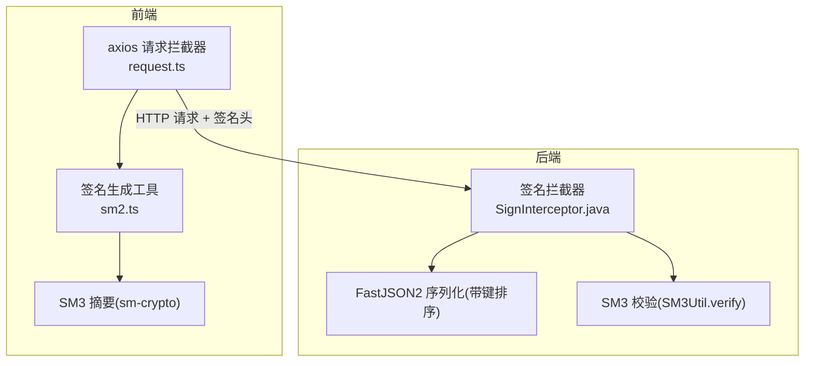
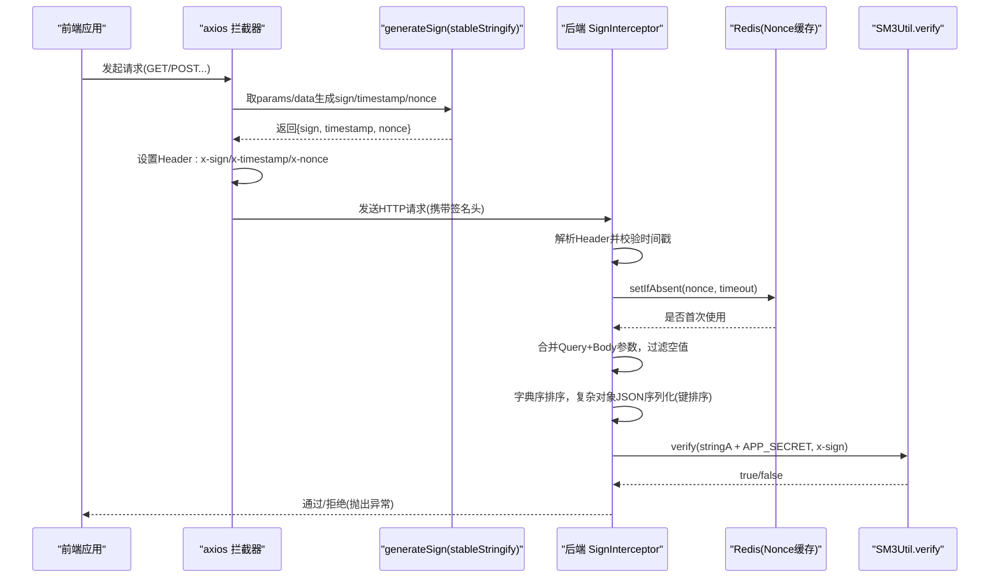
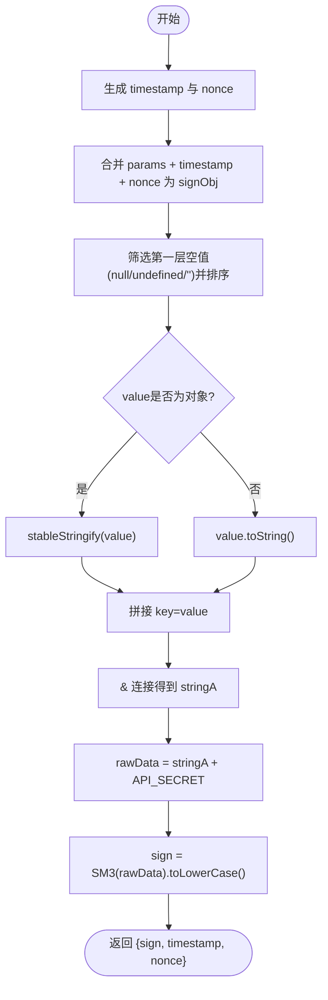
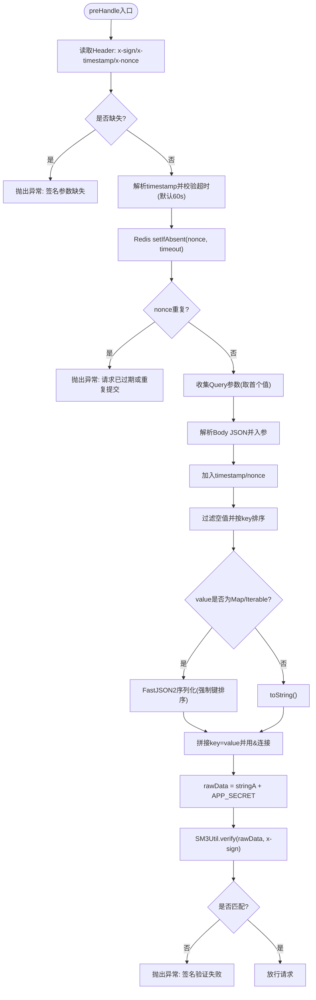
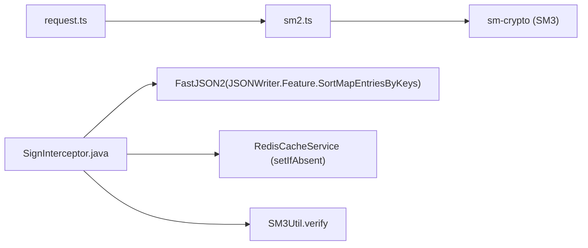

# SM3签名验证机制

<cite>
**本文引用的文件**
- [class_record_admin_front/src/utils/sm2.ts](file://class_record_admin_front/src/utils/sm2.ts)
- [class_record_admin_front/src/utils/request.ts](file://class_record_admin_front/src/utils/request.ts)
- [class_times_record_back/common/src/main/java/com/shiroko/interceptor/SignInterceptor.java](file://class_times_record_back/common/src/main/java/com/shiroko/interceptor/SignInterceptor.java)
- [class_times_record_back/common/src/main/java/com/shiroko/util/SM3Util.java](file://class_times_record_back/common/src/main/java/com/shiroko/util/SM3Util.java)
</cite>

## 目录
1. [简介](#简介)
2. [项目结构](#项目结构)
3. [核心组件](#核心组件)
4. [架构总览](#架构总览)
5. [详细组件分析](#详细组件分析)
6. [依赖关系分析](#依赖关系分析)
7. [性能与一致性考量](#性能与一致性考量)
8. [故障排查指南](#故障排查指南)
9. [结论](#结论)

## 简介
本文件面向前后端开发者，系统化阐述接口请求的 SM3 签名生成与验证机制。内容覆盖：
- 参数排序算法、空值过滤规则、字符串拼接格式
- 前端 stableStringify 递归排序逻辑及其与后端 Jackson/FastJSON2 序列化的一致性保障
- 时间戳防重放攻击机制与随机数 nonce 的作用
- 签名生成的具体步骤与复杂对象参数的处理要点
- 签名验证失败的处理策略与错误码定义

## 项目结构
本项目采用前后端分离架构，签名相关实现分别位于前端工具库与后端拦截器中：
- 前端：在 HTTP 请求拦截器中统一注入 x-sign、x-timestamp、x-nonce 三个签名头；使用稳定化的 JSON 序列化确保与后端一致
- 后端：通过全局拦截器收集 Query 与 Body 参数，进行字典序排序、空值过滤、复杂对象序列化、拼接盐值并执行 SM3 校验



图表来源
- [class_record_admin_front/src/utils/request.ts:34-49](file://class_record_admin_front/src/utils/request.ts#L34-L49)
- [class_record_admin_front/src/utils/sm2.ts:52-87](file://class_record_admin_front/src/utils/sm2.ts#L52-L87)
- [class_times_record_back/common/src/main/java/com/shiroko/interceptor/SignInterceptor.java:50-148](file://class_times_record_back/common/src/main/java/com/shiroko/interceptor/SignInterceptor.java#L50-L148)
- [class_times_record_back/common/src/main/java/com/shiroko/util/SM3Util.java:68-72](file://class_times_record_back/common/src/main/java/com/shiroko/util/SM3Util.java#L68-L72)

章节来源
- [class_record_admin_front/src/utils/request.ts:34-49](file://class_record_admin_front/src/utils/request.ts#L34-L49)
- [class_record_admin_front/src/utils/sm2.ts:52-87](file://class_record_admin_front/src/utils/sm2.ts#L52-L87)
- [class_times_record_back/common/src/main/java/com/shiroko/interceptor/SignInterceptor.java:50-148](file://class_times_record_back/common/src/main/java/com/shiroko/interceptor/SignInterceptor.java#L50-L148)
- [class_times_record_back/common/src/main/java/com/shiroko/util/SM3Util.java:68-72](file://class_times_record_back/common/src/main/java/com/shiroko/util/SM3Util.java#L68-L72)

## 核心组件
- 前端签名生成与注入
  - 在 axios 请求拦截器中，根据请求方法选择 params 或 data 作为签名源，调用 generateSign 生成 sign、timestamp、nonce，并写入响应头 x-sign、x-timestamp、x-nonce
  - 续签重试时重新计算签名，保证时间戳与随机串更新
- 前端稳定化序列化
  - stableStringify 对对象递归排序 key，剔除 null/undefined/""，数组逐项递归，最终输出稳定的 JSON 字符串，用于复杂对象参与签名
- 后端签名校验
  - 从 Header 读取 x-sign、x-timestamp、x-nonce
  - 校验时间戳有效期（默认 60 秒）
  - 基于 Redis 的 SETNX 做 nonce 唯一性校验，防止重放
  - 合并 URL Query 与 Body JSON 为 Map，按 key 字典序排序，空值过滤，复杂对象使用 FastJSON2 强制字段排序序列化
  - 拼接 APP_SECRET 后调用 SM3Util.verify 完成验签

章节来源
- [class_record_admin_front/src/utils/request.ts:34-49](file://class_record_admin_front/src/utils/request.ts#L34-L49)
- [class_record_admin_front/src/utils/request.ts:102-110](file://class_record_admin_front/src/utils/request.ts#L102-L110)
- [class_record_admin_front/src/utils/request.ts:141-149](file://class_record_admin_front/src/utils/request.ts#L141-L149)
- [class_record_admin_front/src/utils/sm2.ts:22-45](file://class_record_admin_front/src/utils/sm2.ts#L22-L45)
- [class_record_admin_front/src/utils/sm2.ts:52-87](file://class_record_admin_front/src/utils/sm2.ts#L52-L87)
- [class_times_record_back/common/src/main/java/com/shiroko/interceptor/SignInterceptor.java:50-148](file://class_times_record_back/common/src/main/java/com/shiroko/interceptor/SignInterceptor.java#L50-L148)
- [class_times_record_back/common/src/main/java/com/shiroko/util/SM3Util.java:68-72](file://class_times_record_back/common/src/main/java/com/shiroko/util/SM3Util.java#L68-L72)

## 架构总览
下图展示了从前端发起请求到后端验签的完整流程，包括签名头注入、时间戳与 nonce 校验、参数收集与序列化、SM3 比对等关键步骤。



图表来源
- [class_record_admin_front/src/utils/request.ts:34-49](file://class_record_admin_front/src/utils/request.ts#L34-L49)
- [class_record_admin_front/src/utils/sm2.ts:52-87](file://class_record_admin_front/src/utils/sm2.ts#L52-L87)
- [class_times_record_back/common/src/main/java/com/shiroko/interceptor/SignInterceptor.java:50-148](file://class_times_record_back/common/src/main/java/com/shiroko/interceptor/SignInterceptor.java#L50-L148)
- [class_times_record_back/common/src/main/java/com/shiroko/util/SM3Util.java:68-72](file://class_times_record_back/common/src/main/java/com/shiroko/util/SM3Util.java#L68-L72)

## 详细组件分析

### 前端签名生成与注入
- 触发点：axios 请求拦截器
- 行为：
  - GET 请求使用 config.params，非 GET 使用 config.data
  - 调用 generateSign 生成 sign、timestamp、nonce
  - 将三个值写入请求头 x-sign、x-timestamp、x-nonce
- 续签重试：
  - 当发生 401 且成功刷新 token 后，会重新解析原始数据并再次生成签名头，确保时间戳与 nonce 新鲜

章节来源
- [class_record_admin_front/src/utils/request.ts:34-49](file://class_record_admin_front/src/utils/request.ts#L34-L49)
- [class_record_admin_front/src/utils/request.ts:102-110](file://class_record_admin_front/src/utils/request.ts#L102-L110)
- [class_record_admin_front/src/utils/request.ts:141-149](file://class_record_admin_front/src/utils/request.ts#L141-L149)

### 稳定化序列化 stableStringify
- 目标：确保复杂对象参与签名时的序列化结果稳定且与后端一致
- 规则：
  - 递归遍历对象与数组
  - 剔除值为 null、undefined 的键
  - 对对象键按字典序排序
  - 数组元素逐项递归处理
  - 输出标准 JSON 字符串
- 作用域：
  - 仅第一层参与签名的键进行“过滤空串”和“排序”，其下的复杂对象则通过 stableStringify 递归序列化

```mermaid
flowchart TD
Start(["进入 stableStringify"]) --> CheckType{"是否为基本类型/null/undefined?"}
CheckType --> |是| ReturnBasic["直接 JSON.stringify 返回"]
CheckType --> |否| IsArray{"是否为数组?"}
IsArray --> |是| MapArray["逐项递归处理并拼接为 [...]"]
IsArray --> |否| SortKeys["获取所有key -> 过滤null/undefined -> 字典序排序"]
SortKeys --> BuildKV["对每个key递归处理value -> 拼接为 \"key\":value"]
BuildKV --> JoinObj["拼接为 {...}"]
MapArray --> End(["返回稳定字符串"])
JoinObj --> End
ReturnBasic --> End
```

图表来源
- [class_record_admin_front/src/utils/sm2.ts:22-45](file://class_record_admin_front/src/utils/sm2.ts#L22-L45)

章节来源
- [class_record_admin_front/src/utils/sm2.ts:22-45](file://class_record_admin_front/src/utils/sm2.ts#L22-L45)

### 签名生成算法 generateSign
- 输入：请求参数对象（GET 为 params，POST/PUT/DELETE 为 data）
- 步骤：
  1) 生成 timestamp（毫秒时间戳）与 nonce（随机串）
  2) 组装 signObj = { ...params, timestamp, nonce }
  3) 对 signObj 的第一层键进行“空串过滤”与“字典序排序”
  4) 拼接 stringA：
     - 若值为对象，先经 stableStringify 转为稳定字符串
     - 否则直接 toString
     - 以 key=value 形式用 & 连接
  5) rawData = stringA + API_SECRET
  6) sign = SM3(rawData).toLowerCase()
- 输出：{ sign, timestamp, nonce }



图表来源
- [class_record_admin_front/src/utils/sm2.ts:52-87](file://class_record_admin_front/src/utils/sm2.ts#L52-L87)

章节来源
- [class_record_admin_front/src/utils/sm2.ts:52-87](file://class_record_admin_front/src/utils/sm2.ts#L52-L87)

### 后端签名校验流程 SignInterceptor
- 前置条件：
  - 请求必须携带 x-sign、x-timestamp、x-nonce 三个头部
- 校验顺序：
  1) 缺失检查：任一为空则拒绝
  2) 时间戳校验：当前时间与 timestamp 差值超过阈值（默认 60 秒）则拒绝
  3) Nonce 防重放：基于 Redis 的 setIfAbsent 保证同一 nonce 在窗口期内仅能使用一次
  4) 参数收集：
     - 合并 URL Query 参数（取第一个值）
     - 解析 Body JSON 为 Map 并入参（支持对象；若为数组需特殊处理）
     - 加入系统级参数 timestamp、nonce
  5) 排序与拼接：
     - 过滤空值（null 或空白字符串）
     - 按 key 字典序排序
     - 复杂对象（Map/Iterable）使用 FastJSON2 的 SortMapEntriesByKeys 强制字段排序
     - 拼接为 key=value 并以 & 连接
  6) 验签：
     - rawData = stringA + APP_SECRET
     - 调用 SM3Util.verify 比较 clientSign



图表来源
- [class_times_record_back/common/src/main/java/com/shiroko/interceptor/SignInterceptor.java:50-148](file://class_times_record_back/common/src/main/java/com/shiroko/interceptor/SignInterceptor.java#L50-L148)
- [class_times_record_back/common/src/main/java/com/shiroko/util/SM3Util.java:68-72](file://class_times_record_back/common/src/main/java/com/shiroko/util/SM3Util.java#L68-L72)

章节来源
- [class_times_record_back/common/src/main/java/com/shiroko/interceptor/SignInterceptor.java:50-148](file://class_times_record_back/common/src/main/java/com/shiroko/interceptor/SignInterceptor.java#L50-L148)
- [class_times_record_back/common/src/main/java/com/shiroko/util/SM3Util.java:68-72](file://class_times_record_back/common/src/main/java/com/shiroko/util/SM3Util.java#L68-L72)

### 复杂对象参数的签名处理
- 前端：
  - 第一层键参与排序与空串过滤
  - 嵌套对象通过 stableStringify 递归序列化，保证键排序与空值剔除
- 后端：
  - 对 Map/Iterable 类型的值使用 FastJSON2 的 SortMapEntriesByKeys 特性进行序列化，确保字段顺序稳定
- 一致性要点：
  - 两端均遵循“键字典序排序 + 空值过滤 + 稳定序列化”的原则
  - 注意：前端 stableStringify 不保留 undefined 字段，后端也过滤空值，避免差异

章节来源
- [class_record_admin_front/src/utils/sm2.ts:22-45](file://class_record_admin_front/src/utils/sm2.ts#L22-L45)
- [class_record_admin_front/src/utils/sm2.ts:52-87](file://class_record_admin_front/src/utils/sm2.ts#L52-L87)
- [class_times_record_back/common/src/main/java/com/shiroko/interceptor/SignInterceptor.java:120-136](file://class_times_record_back/common/src/main/java/com/shiroko/interceptor/SignInterceptor.java#L120-L136)

### 时间戳与 nonce 防重放机制
- 时间戳：
  - 前端生成毫秒时间戳，后端校验与当前时间的差值，默认 60 秒过期
- nonce：
  - 前端每次请求生成随机串
  - 后端基于 Redis 的 setIfAbsent 保证同一 nonce 在过期窗口内不可重复使用，有效抵御重放攻击

章节来源
- [class_record_admin_front/src/utils/sm2.ts:52-55](file://class_record_admin_front/src/utils/sm2.ts#L52-L55)
- [class_times_record_back/common/src/main/java/com/shiroko/interceptor/SignInterceptor.java:66-79](file://class_times_record_back/common/src/main/java/com/shiroko/interceptor/SignInterceptor.java#L66-L79)

### 签名生成步骤与示例说明
- 步骤概览：
  1) 准备请求参数对象（GET 为 params，其他为 data）
  2) 生成 timestamp 与 nonce
  3) 合并为 signObj，并对第一层键进行空串过滤与排序
  4) 对每个 value：
     - 若为对象，调用 stableStringify 转为稳定字符串
     - 否则直接 toString
  5) 拼接成 stringA（key=value 用 & 连接）
  6) rawData = stringA + API_SECRET
  7) sign = SM3(rawData).toLowerCase()
- 示例路径（不含代码内容）：
  - 简单对象参数签名：[class_record_admin_front/src/utils/sm2.ts:52-87](file://class_record_admin_front/src/utils/sm2.ts#L52-L87)
  - 复杂对象参数签名（嵌套对象/数组）：[class_record_admin_front/src/utils/sm2.ts:22-45](file://class_record_admin_front/src/utils/sm2.ts#L22-L45)
  - 请求头注入与续签重试：[class_record_admin_front/src/utils/request.ts:34-49](file://class_record_admin_front/src/utils/request.ts#L34-L49), [class_record_admin_front/src/utils/request.ts:102-110](file://class_record_admin_front/src/utils/request.ts#L102-L110), [class_record_admin_front/src/utils/request.ts:141-149](file://class_record_admin_front/src/utils/request.ts#L141-L149)

章节来源
- [class_record_admin_front/src/utils/sm2.ts:22-45](file://class_record_admin_front/src/utils/sm2.ts#L22-L45)
- [class_record_admin_front/src/utils/sm2.ts:52-87](file://class_record_admin_front/src/utils/sm2.ts#L52-L87)
- [class_record_admin_front/src/utils/request.ts:34-49](file://class_record_admin_front/src/utils/request.ts#L34-L49)
- [class_record_admin_front/src/utils/request.ts:102-110](file://class_record_admin_front/src/utils/request.ts#L102-L110)
- [class_record_admin_front/src/utils/request.ts:141-149](file://class_record_admin_front/src/utils/request.ts#L141-L149)

### 签名验证失败处理策略与错误码
- 后端抛出的运行时异常（未封装业务错误码）：
  - 签名参数缺失：当 x-sign/x-timestamp/x-nonce 任一为空时抛出
  - 请求已超时：timestamp 与当前时间差超过阈值
  - 请求已过期或重复提交：nonce 重复或已被使用
  - 签名验证失败：stringA + APP_SECRET 的 SM3 与 x-sign 不一致
- 前端处理：
  - 401 场景下自动刷新 token 并重试，同时重新生成签名头
  - 其他错误信息通过消息提示展示

章节来源
- [class_times_record_back/common/src/main/java/com/shiroko/interceptor/SignInterceptor.java:62-79](file://class_times_record_back/common/src/main/java/com/shiroko/interceptor/SignInterceptor.java#L62-L79)
- [class_times_record_back/common/src/main/java/com/shiroko/interceptor/SignInterceptor.java:143-145](file://class_times_record_back/common/src/main/java/com/shiroko/interceptor/SignInterceptor.java#L143-L145)
- [class_record_admin_front/src/utils/request.ts:66-180](file://class_record_admin_front/src/utils/request.ts#L66-L180)

## 依赖关系分析
- 前端依赖：
  - axios 拦截器负责注入签名头
  - sm-crypto 提供 SM3 摘要能力
  - stableStringify 保证序列化一致性
- 后端依赖：
  - FastJSON2 的 SortMapEntriesByKeys 保证复杂对象字段顺序稳定
  - Redis 用于 nonce 去重与防重放
  - BouncyCastle 提供 SM3 算法实现



图表来源
- [class_record_admin_front/src/utils/request.ts:34-49](file://class_record_admin_front/src/utils/request.ts#L34-L49)
- [class_record_admin_front/src/utils/sm2.ts:52-87](file://class_record_admin_front/src/utils/sm2.ts#L52-L87)
- [class_times_record_back/common/src/main/java/com/shiroko/interceptor/SignInterceptor.java:120-148](file://class_times_record_back/common/src/main/java/com/shiroko/interceptor/SignInterceptor.java#L120-L148)
- [class_times_record_back/common/src/main/java/com/shiroko/util/SM3Util.java:68-72](file://class_times_record_back/common/src/main/java/com/shiroko/util/SM3Util.java#L68-L72)

章节来源
- [class_record_admin_front/src/utils/request.ts:34-49](file://class_record_admin_front/src/utils/request.ts#L34-L49)
- [class_record_admin_front/src/utils/sm2.ts:52-87](file://class_record_admin_front/src/utils/sm2.ts#L52-L87)
- [class_times_record_back/common/src/main/java/com/shiroko/interceptor/SignInterceptor.java:120-148](file://class_times_record_back/common/src/main/java/com/shiroko/interceptor/SignInterceptor.java#L120-L148)
- [class_times_record_back/common/src/main/java/com/shiroko/util/SM3Util.java:68-72](file://class_times_record_back/common/src/main/java/com/shiroko/util/SM3Util.java#L68-L72)

## 性能与一致性考量
- 性能
  - 签名计算复杂度与参数规模线性相关，建议控制单次请求体大小
  - Redis 操作为 O(1)，在高并发下应关注 Redis 集群与网络延迟
- 一致性
  - 两端均需严格遵循“键排序 + 空值过滤 + 稳定序列化”的规则
  - 注意：前端 stableStringify 不保留 undefined 字段，后端也过滤空值，避免差异
  - 对于数组参数，前后端序列化顺序需保持一致（前端逐项递归，后端按原序序列化）

[本节为通用指导，不直接分析具体文件]

## 故障排查指南
- 常见错误与定位
  - 签名参数缺失：检查请求头是否包含 x-sign、x-timestamp、x-nonce
  - 请求已超时：确认客户端与服务端时间同步，必要时调整 TIME_OUT
  - 请求已过期或重复提交：检查 Redis 连通性与 nonce 生成逻辑
  - 签名验证失败：核对 stringA 拼接顺序、空值过滤规则、复杂对象序列化方式
- 调试建议
  - 在后端日志中打印 stringA，便于对比前后端拼接结果
  - 在前端续签重试时，确保重新生成签名头，避免使用旧的时间戳与 nonce

章节来源
- [class_times_record_back/common/src/main/java/com/shiroko/interceptor/SignInterceptor.java:62-79](file://class_times_record_back/common/src/main/java/com/shiroko/interceptor/SignInterceptor.java#L62-L79)
- [class_times_record_back/common/src/main/java/com/shiroko/interceptor/SignInterceptor.java:143-145](file://class_times_record_back/common/src/main/java/com/shiroko/interceptor/SignInterceptor.java#L143-L145)
- [class_record_admin_front/src/utils/request.ts:102-110](file://class_record_admin_front/src/utils/request.ts#L102-L110)
- [class_record_admin_front/src/utils/request.ts:141-149](file://class_record_admin_front/src/utils/request.ts#L141-L149)

## 结论
本方案通过严格的参数排序、空值过滤与稳定序列化，结合时间戳与 nonce 双重防护，实现了高可靠性的接口请求签名机制。前后端在序列化与拼接规则上保持一致，确保了跨语言环境下的签名可复现与可验证。建议在后续迭代中持续监控 Redis 性能与时间同步问题，并在必要情况下优化请求体大小与序列化策略。