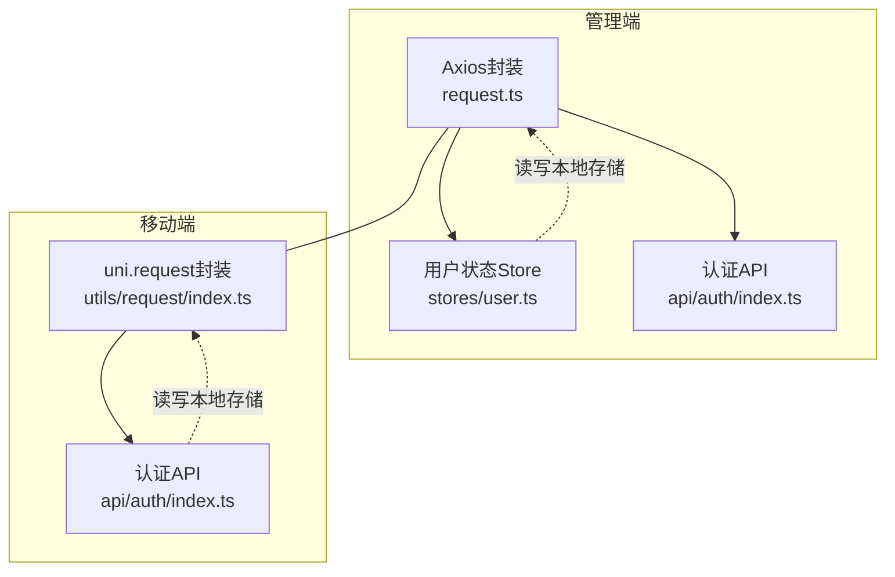
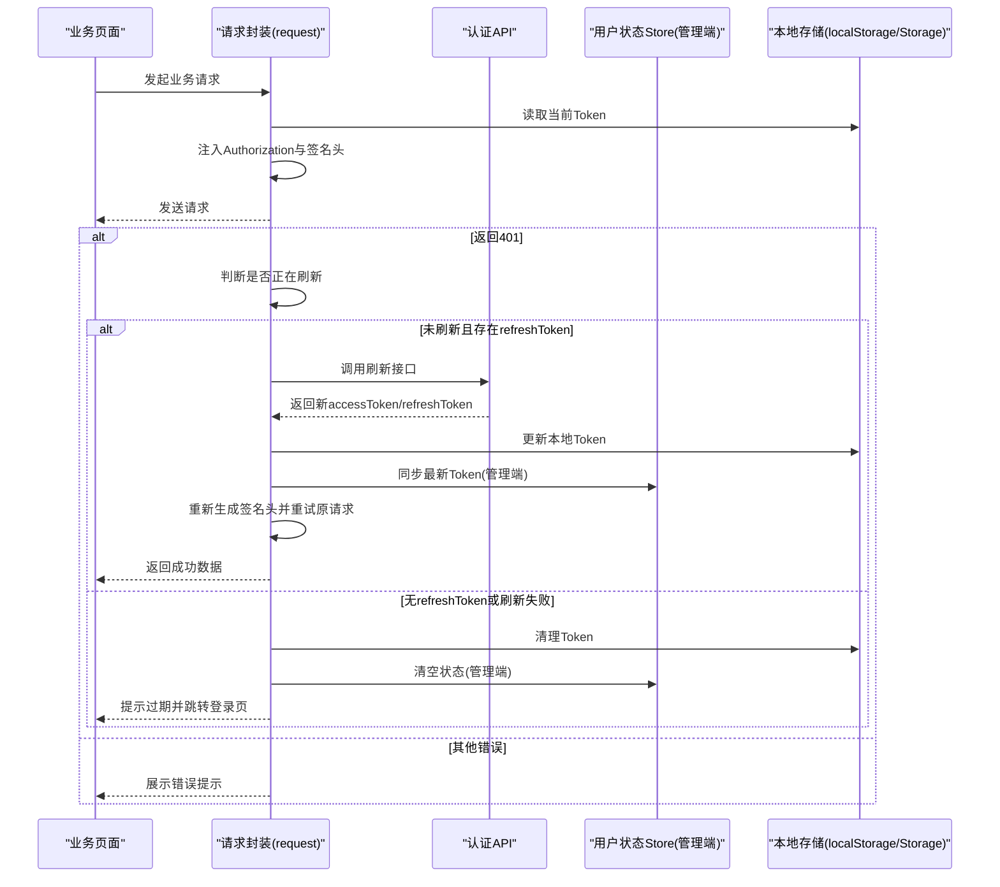
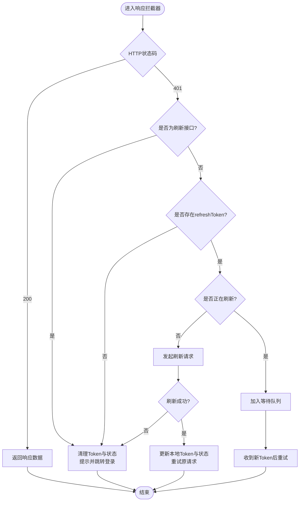
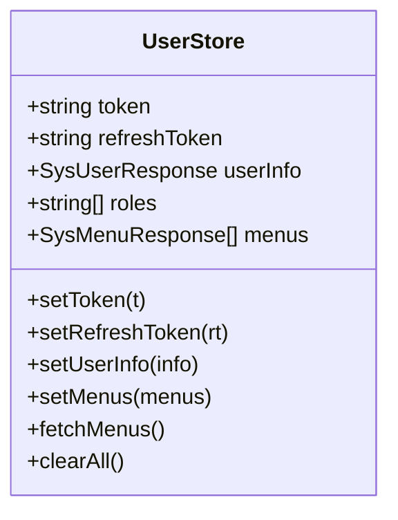
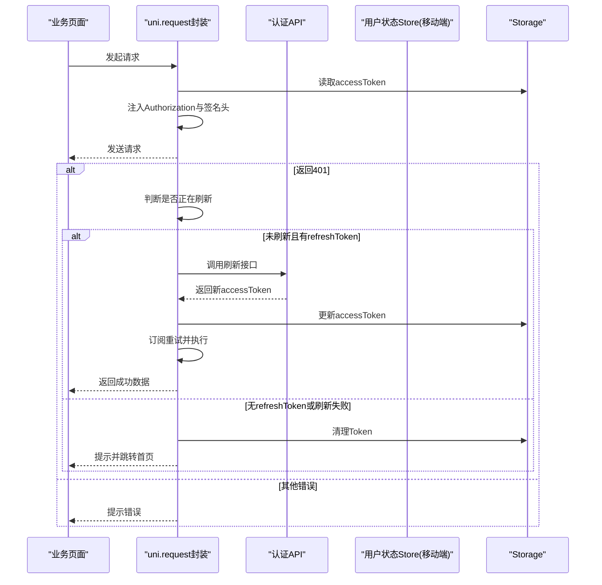
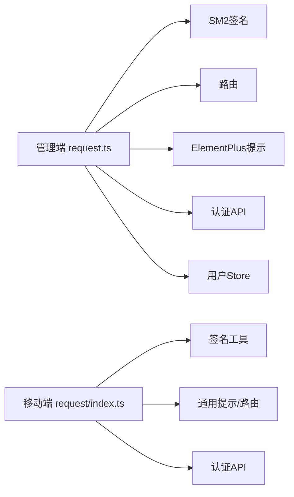

# Token管理机制

<cite>
**本文引用的文件**
- [class_record_admin_front/src/utils/request.ts](file://class_record_admin_front/src/utils/request.ts)
- [class_record_admin_front/src/stores/user.ts](file://class_record_admin_front/src/stores/user.ts)
- [class_record_admin_front/src/api/auth/index.ts](file://class_record_admin_front/src/api/auth/index.ts)
- [class_times_record/src/utils/request/index.ts](file://class_times_record/src/utils/request/index.ts)
- [class_times_record/src/api/auth/index.ts](file://class_times_record/src/api/auth/index.ts)
</cite>

## 目录
1. [引言](#引言)
2. [项目结构](#项目结构)
3. [核心组件](#核心组件)
4. [架构总览](#架构总览)
5. [详细组件分析](#详细组件分析)
6. [依赖分析](#依赖分析)
7. [性能考虑](#性能考虑)
8. [故障排查指南](#故障排查指南)
9. [结论](#结论)
10. [附录](#附录)

## 引言
本文件围绕前端两个客户端（管理端与移动端）的Token管理机制进行系统化说明，覆盖JWT令牌的获取、存储、刷新与失效处理；解释本地存储策略与安全要点；阐述自动刷新机制的实现原理、并发控制与网络异常处理；详细说明请求拦截器的实现细节（请求头注入、响应状态处理）；并给出多角色Token的管理策略与权限切换建议。文末提供安全最佳实践与常见问题解决方案，帮助读者快速定位与解决问题。

## 项目结构
本项目包含两套前端：
- 管理端（Vue + Element Plus + Axios）：位于 class_record_admin_front
- 移动端（uni-app）：位于 class_times_record

两者均实现了统一的HTTP请求封装，内置签名头注入、Token注入、401自动刷新与重试、以及失败提示与路由跳转等能力。

图表来源
- [class_record_admin_front/src/utils/request.ts:1-222](file://class_record_admin_front/src/utils/request.ts#L1-L222)
- [class_record_admin_front/src/stores/user.ts:1-49](file://class_record_admin_front/src/stores/user.ts#L1-L49)
- [class_record_admin_front/src/api/auth/index.ts:1-14](file://class_record_admin_front/src/api/auth/index.ts#L1-L14)
- [class_times_record/src/utils/request/index.ts:1-413](file://class_times_record/src/utils/request/index.ts#L1-L413)
- [class_times_record/src/api/auth/index.ts:1-213](file://class_times_record/src/api/auth/index.ts#L1-L213)

章节来源
- [class_record_admin_front/src/utils/request.ts:1-222](file://class_record_admin_front/src/utils/request.ts#L1-L222)
- [class_times_record/src/utils/request/index.ts:1-413](file://class_times_record/src/utils/request/index.ts#L1-L413)

## 核心组件
- 管理端
  - Axios请求封装：负责请求/响应拦截、签名头注入、401自动刷新与重试、错误提示与路由跳转。
  - 用户状态Store：集中管理token、refreshToken、用户信息、菜单与角色等，并提供持久化到localStorage的方法。
  - 认证API：封装登录、公钥获取、刷新接口调用。
- 移动端
  - uni.request封装：统一请求入口，负责签名头注入、401自动刷新与重试、错误提示与页面跳转。
  - 认证API：封装登录、免密登录、Token登录、刷新、登出等流程，并负责本地缓存存取。

章节来源
- [class_record_admin_front/src/utils/request.ts:1-222](file://class_record_admin_front/src/utils/request.ts#L1-L222)
- [class_record_admin_front/src/stores/user.ts:1-49](file://class_record_admin_front/src/stores/user.ts#L1-L49)
- [class_record_admin_front/src/api/auth/index.ts:1-14](file://class_record_admin_front/src/api/auth/index.ts#L1-L14)
- [class_times_record/src/utils/request/index.ts:1-413](file://class_times_record/src/utils/request/index.ts#L1-L413)
- [class_times_record/src/api/auth/index.ts:1-213](file://class_times_record/src/api/auth/index.ts#L1-L213)

## 架构总览
下图展示了从发起业务请求到自动刷新并重试的整体流程，涵盖管理端与移动端的差异点。

图表来源
- [class_record_admin_front/src/utils/request.ts:33-190](file://class_record_admin_front/src/utils/request.ts#L33-L190)
- [class_record_admin_front/src/stores/user.ts:12-45](file://class_record_admin_front/src/stores/user.ts#L12-L45)
- [class_record_admin_front/src/api/auth/index.ts:11-13](file://class_record_admin_front/src/api/auth/index.ts#L11-L13)
- [class_times_record/src/utils/request/index.ts:192-278](file://class_times_record/src/utils/request/index.ts#L192-L278)
- [class_times_record/src/api/auth/index.ts:133-155](file://class_times_record/src/api/auth/index.ts#L133-L155)

## 详细组件分析

### 管理端：Axios请求封装与自动刷新
- 请求拦截器
  - 从本地存储读取admin_token，若存在则注入Authorization头。
  - 使用SM2工具为请求参数生成签名，并注入x-sign、x-timestamp、x-nonce三个自定义头。
- 响应拦截器
  - 对200响应直接返回data。
  - 对401响应：
    - 若本次是刷新接口本身返回401，清理本地Token与用户状态，提示并跳转登录页。
    - 若不存在refreshToken，清理Token与用户状态，提示并跳转登录页。
    - 若正在刷新，将当前请求加入等待队列，刷新成功后用新Token与新的签名头重试。
    - 否则发起刷新请求，成功后更新本地Token与用户状态，重试原请求。
    - 刷新失败或二次重试仍401，清理状态并跳转登录页。
  - 非401错误统一提示消息；网络异常提示检查网络。
- 便捷方法
  - 提供get/post/put/del封装，便于业务调用。

图表来源
- [class_record_admin_front/src/utils/request.ts:55-190](file://class_record_admin_front/src/utils/request.ts#L55-L190)

章节来源
- [class_record_admin_front/src/utils/request.ts:1-222](file://class_record_admin_front/src/utils/request.ts#L1-L222)

### 管理端：用户状态Store
- 职责
  - 维护token、refreshToken、userInfo、roles、menus等状态。
  - 提供setToken/setRefreshToken/setUserInfo等方法，同步写入localStorage。
  - clearAll用于退出登录时清理所有状态与本地存储。
- 与请求封装协作
  - 刷新成功后通过store同步最新Token，确保全局状态一致。

图表来源
- [class_record_admin_front/src/stores/user.ts:1-49](file://class_record_admin_front/src/stores/user.ts#L1-L49)

章节来源
- [class_record_admin_front/src/stores/user.ts:1-49](file://class_record_admin_front/src/stores/user.ts#L1-L49)

### 管理端：认证API
- 提供公钥获取、登录、刷新接口封装，供请求封装与业务层调用。
- 刷新接口路径与参数由请求封装在401流程中调用。

章节来源
- [class_record_admin_front/src/api/auth/index.ts:1-14](file://class_record_admin_front/src/api/auth/index.ts#L1-L14)

### 移动端：uni.request封装与自动刷新
- 基础配置
  - 根据环境变量设置baseUrl，默认指向网关地址。
  - 统一超时时间、加载提示开关。
- 请求拦截
  - 从Storage读取accessToken，注入Authorization头。
  - 使用签名工具生成x-sign、x-timestamp、x-nonce并注入。
- 响应处理
  - 200且业务code=200时返回数据；否则提示业务错误。
  - 401处理：
    - 若为刷新接口自身返回401，清理Token并跳转首页。
    - 若无refreshToken，清理Token并跳转首页。
    - 若未刷新，发起刷新请求；成功后更新accessToken，通知等待队列重试。
    - 刷新失败或无refreshToken，清理Token并跳转首页。
    - 已刷新过但仍401，清理Token并跳转首页。
  - 404/500与其他错误统一提示。
  - fail分支区分timeout等网络异常并提示。
- 重试逻辑
  - 使用订阅者模式收集等待中的请求，刷新成功后逐个重试，并重新计算签名头。

图表来源
- [class_times_record/src/utils/request/index.ts:79-179](file://class_times_record/src/utils/request/index.ts#L79-L179)
- [class_times_record/src/utils/request/index.ts:192-278](file://class_times_record/src/utils/request/index.ts#L192-L278)
- [class_times_record/src/api/auth/index.ts:133-155](file://class_times_record/src/api/auth/index.ts#L133-L155)

章节来源
- [class_times_record/src/utils/request/index.ts:1-413](file://class_times_record/src/utils/request/index.ts#L1-L413)
- [class_times_record/src/api/auth/index.ts:1-213](file://class_times_record/src/api/auth/index.ts#L1-L213)

### 移动端：认证API与Token存储
- 登录流程
  - 支持密码登录、免密登录、Token登录三种方式，最终统一调用storeTokens将accessToken与refreshToken写入Storage。
- 刷新流程
  - 提供refreshAccessToken方法，内部调用刷新接口并更新accessToken。
- 登出流程
  - 清除本地用户信息与Token，调用后端登出接口，再跳转目标页面。

章节来源
- [class_times_record/src/api/auth/index.ts:1-213](file://class_times_record/src/api/auth/index.ts#L1-L213)

## 依赖分析
- 管理端
  - request.ts依赖sm2签名工具、router、ElementPlus提示、auth API与user store。
  - user.ts依赖menu API以拉取菜单树。
- 移动端
  - utils/request/index.ts依赖crypto签名、common提示与路由常量。
  - api/auth/index.ts依赖request封装、user store、routes与common提示。

图表来源
- [class_record_admin_front/src/utils/request.ts:1-12](file://class_record_admin_front/src/utils/request.ts#L1-L12)
- [class_record_admin_front/src/stores/user.ts:1-10](file://class_record_admin_front/src/stores/user.ts#L1-L10)
- [class_times_record/src/utils/request/index.ts:1-24](file://class_times_record/src/utils/request/index.ts#L1-L24)
- [class_times_record/src/api/auth/index.ts:1-6](file://class_times_record/src/api/auth/index.ts#L1-L6)

章节来源
- [class_record_admin_front/src/utils/request.ts:1-222](file://class_record_admin_front/src/utils/request.ts#L1-L222)
- [class_record_admin_front/src/stores/user.ts:1-49](file://class_record_admin_front/src/stores/user.ts#L1-L49)
- [class_times_record/src/utils/request/index.ts:1-413](file://class_times_record/src/utils/request/index.ts#L1-L413)
- [class_times_record/src/api/auth/index.ts:1-213](file://class_times_record/src/api/auth/index.ts#L1-L213)

## 性能考虑
- 并发刷新控制
  - 两端均采用“是否正在刷新”标志位与订阅者队列，避免重复刷新与风暴式重试。
- 重试成本
  - 仅在401场景触发刷新与重试，减少不必要的网络开销。
- 签名计算
  - 每次重试前重新计算签名头，保证参数一致性，避免服务端校验失败导致的额外往返。
- 提示与交互
  - 刷新过程不展示提示，降低用户干扰；仅失败或需要重新登录时提示。

[本节为通用指导，无需源码引用]

## 故障排查指南
- 现象：频繁弹出“登录已过期”
  - 可能原因：refreshToken缺失或刷新接口返回异常；刷新接口自身返回401。
  - 排查步骤：
    - 确认本地是否存在refreshToken。
    - 检查刷新接口路径与参数是否正确。
    - 查看刷新失败时的清理与跳转逻辑是否被触发。
- 现象：刷新成功但业务请求仍失败
  - 可能原因：重试前未重新生成签名头；原请求参数类型不一致导致签名不同。
  - 排查步骤：
    - 确认重试前是否按GET/POST分别解析params/data并重新计算签名。
- 现象：移动端刷新后未重试
  - 可能原因：订阅者队列未正确注册或回调未执行。
  - 排查步骤：
    - 检查401分支中是否先加入订阅者再发起刷新请求。
    - 确认onRefreshed是否遍历执行回调。
- 现象：管理端刷新后状态不一致
  - 可能原因：仅更新了localStorage而未同步Pinia状态。
  - 排查步骤：
    - 确认刷新成功后是否调用store.setToken/setRefreshToken/setUserInfo。

章节来源
- [class_record_admin_front/src/utils/request.ts:66-190](file://class_record_admin_front/src/utils/request.ts#L66-L190)
- [class_times_record/src/utils/request/index.ts:192-278](file://class_times_record/src/utils/request/index.ts#L192-L278)

## 结论
本项目在管理端与移动端均实现了健壮的Token生命周期管理：统一的请求封装、自动刷新与重试、完善的错误提示与路由跳转。通过订阅者模式解决并发刷新问题，结合签名头保障请求完整性。建议在后续版本中引入本地过期时间管理与更细粒度的权限切换策略，进一步提升安全性与用户体验。

[本节为总结性内容，无需源码引用]

## 附录

### 本地存储策略与过期时间管理
- 管理端
  - 存储键名：admin_token、admin_refresh_token
  - 存储位置：localStorage
  - 过期时间：当前未实现基于时间的主动过期检测，依赖服务端401驱动刷新与失效。
- 移动端
  - 存储键名：accessToken、refreshToken
  - 存储位置：uni.Storage
  - 过期时间：同上，依赖服务端401驱动刷新与失效。
- 建议
  - 在服务端返回的Token中携带过期时间，前端据此计算剩余有效期，并在接近过期时主动刷新。
  - 可引入内存级短期缓存与持久化双写策略，提升刷新成功率与一致性。

章节来源
- [class_record_admin_front/src/utils/request.ts:34-49](file://class_record_admin_front/src/utils/request.ts#L34-L49)
- [class_record_admin_front/src/stores/user.ts:6-20](file://class_record_admin_front/src/stores/user.ts#L6-L20)
- [class_times_record/src/utils/request/index.ts:98-112](file://class_times_record/src/utils/request/index.ts#L98-L112)
- [class_times_record/src/api/auth/index.ts:12-19](file://class_times_record/src/api/auth/index.ts#L12-L19)

### 自动刷新机制与网络异常处理
- 刷新时机
  - 仅在业务请求返回401时触发；刷新接口自身返回401视为彻底过期。
- 并发控制
  - 使用isRefreshing标志与订阅者队列，避免重复刷新与竞态条件。
- 网络异常
  - 管理端：无响应或网络异常时提示检查网络。
  - 移动端：区分timeout等错误并提示。
- 重试策略
  - 刷新成功后，使用新Token与重新计算的签名头重试原请求。

章节来源
- [class_record_admin_front/src/utils/request.ts:98-167](file://class_record_admin_front/src/utils/request.ts#L98-L167)
- [class_times_record/src/utils/request/index.ts:213-278](file://class_times_record/src/utils/request/index.ts#L213-L278)

### Token拦截器实现细节
- 请求头注入
  - Authorization：Bearer <token>
  - 签名头：x-sign、x-timestamp、x-nonce
- 响应状态处理
  - 200：返回data
  - 401：自动刷新与重试或清理状态并跳转
  - 404/500：提示错误
  - 网络异常：提示检查网络

章节来源
- [class_record_admin_front/src/utils/request.ts:34-53](file://class_record_admin_front/src/utils/request.ts#L34-L53)
- [class_record_admin_front/src/utils/request.ts:55-190](file://class_record_admin_front/src/utils/request.ts#L55-L190)
- [class_times_record/src/utils/request/index.ts:91-112](file://class_times_record/src/utils/request/index.ts#L91-L112)
- [class_times_record/src/utils/request/index.ts:114-178](file://class_times_record/src/utils/request/index.ts#L114-L178)

### 多角色Token管理与权限切换机制
- 现状
  - 管理端Store中包含roles字段，但未在请求拦截器中体现多角色Token隔离。
  - 移动端登录流程支持传入role参数，但Token存储为单一accessToken。
- 建议方案
  - 多角色Token映射：以角色为键存储多个Token（如token_role_xxx），切换角色时更新当前使用的Token键名。
  - 请求拦截器动态选择：根据当前激活角色读取对应Token并注入。
  - 刷新策略扩展：刷新接口返回新Token时，按角色维度更新对应条目。
  - 权限切换：切换角色时同时更新用户信息、菜单与权限缓存，必要时强制刷新受保护资源。

章节来源
- [class_record_admin_front/src/stores/user.ts:9-10](file://class_record_admin_front/src/stores/user.ts#L9-L10)
- [class_times_record/src/api/auth/index.ts:83-102](file://class_times_record/src/api/auth/index.ts#L83-L102)

### Token安全最佳实践
- 传输安全
  - 生产环境强制HTTPS，避免中间人攻击。
- 存储安全
  - 敏感Token尽量使用HttpOnly Cookie（服务端可控）或平台安全存储；当前实现使用localStorage/Storage，需注意XSS防护。
- 最小权限
  - 按需下发最小必要权限，避免Token中包含过多敏感信息。
- 刷新策略
  - 短时效Access Token配合长时效Refresh Token；Refresh Token定期轮换。
- 防重放
  - 保持签名头（x-sign/x-timestamp/x-nonce）机制，防止请求篡改与重放。
- 会话管理
  - 服务端支持黑名单或撤销机制，配合前端清理与跳转，确保强一致。

[本节为通用指导，无需源码引用]