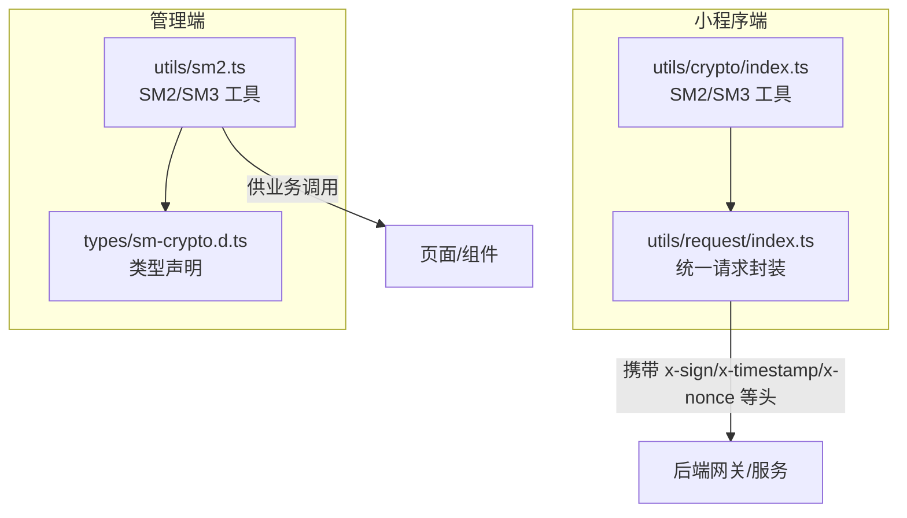
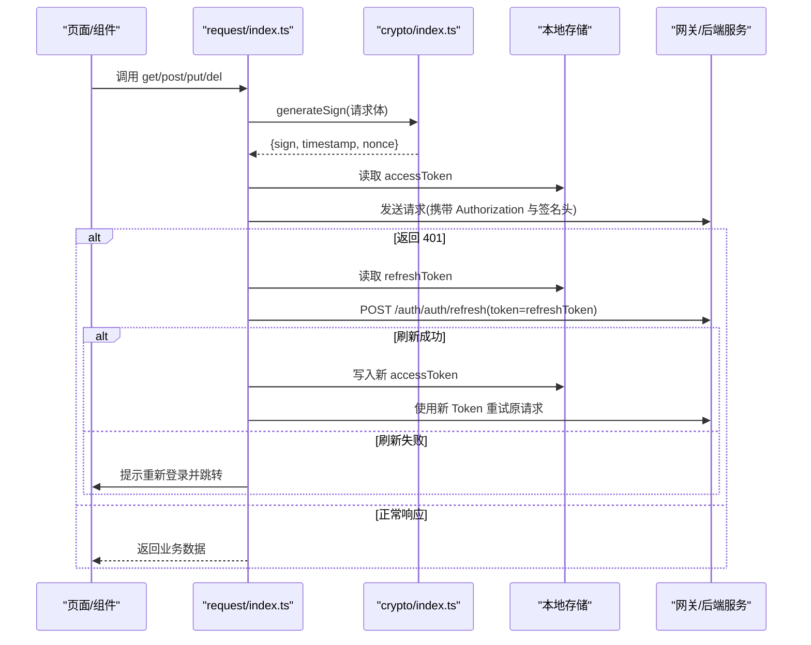
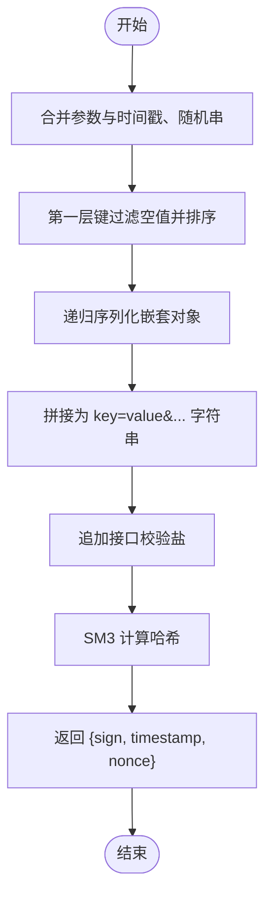
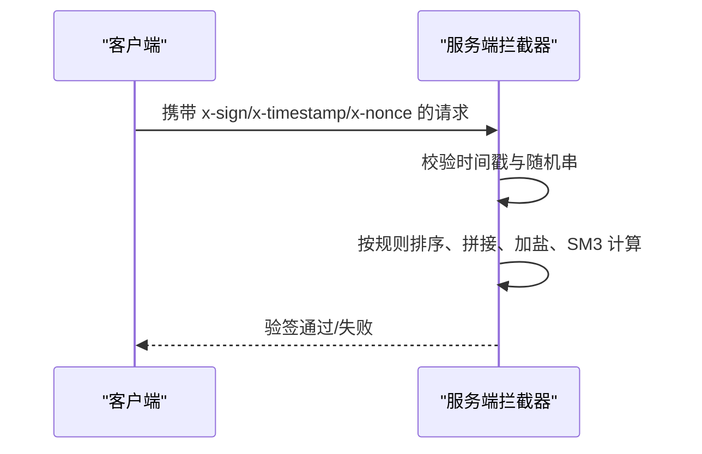
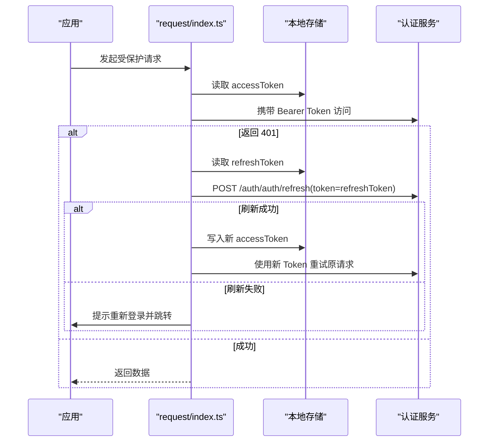
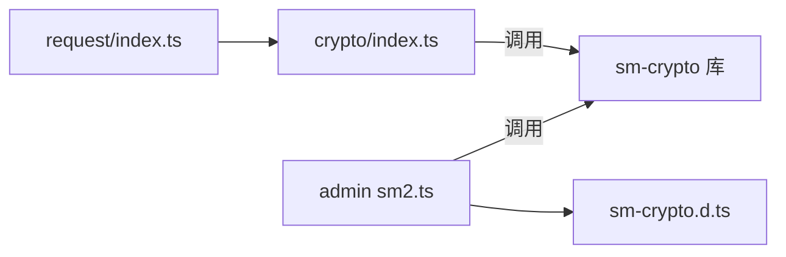

# 安全机制实现

<cite>
**本文引用的文件**
- [class_times_record/src/utils/crypto/index.ts](file://class_times_record/src/utils/crypto/index.ts)
- [class_times_record/src/utils/request/index.ts](file://class_times_record/src/utils/request/index.ts)
- [class_record_admin_front/src/utils/sm2.ts](file://class_record_admin_front/src/utils/sm2.ts)
- [class_record_admin_front/src/types/sm-crypto.d.ts](file://class_record_admin_front/src/types/sm-crypto.d.ts)
</cite>

## 目录
1. [简介](#简介)
2. [项目结构](#项目结构)
3. [核心组件](#核心组件)
4. [架构总览](#架构总览)
5. [详细组件分析](#详细组件分析)
6. [依赖分析](#依赖分析)
7. [性能考虑](#性能考虑)
8. [故障排查指南](#故障排查指南)
9. [结论](#结论)
10. [附录](#附录)

## 简介
本文件面向小程序端的安全机制实现，聚焦以下目标：
- 国密算法在前端的完整落地：SM2 非对称加密用于密码传输、SM3 哈希用于请求签名与数据完整性校验。
- 请求签名验证流程：参数排序、拼接、签名生成与验签要点。
- Token 管理机制：JWT 的存储、刷新与安全策略。
- 敏感数据的本地加密存储方案建议。
- 跨域请求（CORS）的安全处理与配置建议。
- 常见漏洞防护最佳实践：XSS、SQL 注入、CSRF。
- 安全审计与日志记录策略。

## 项目结构
本项目包含两个前端工程：
- class_times_record：小程序端（uni-app），实现了完整的 SM2/SM3 工具与统一请求封装（含签名、Token 自动刷新）。
- class_record_admin_front：管理后台前端，提供 SM2 加密与签名工具，类型声明完善。

图表来源
- [class_times_record/src/utils/crypto/index.ts:1-99](file://class_times_record/src/utils/crypto/index.ts#L1-L99)
- [class_times_record/src/utils/request/index.ts:1-413](file://class_times_record/src/utils/request/index.ts#L1-L413)
- [class_record_admin_front/src/utils/sm2.ts:1-88](file://class_record_admin_front/src/utils/sm2.ts#L1-L88)
- [class_record_admin_front/src/types/sm-crypto.d.ts:1-18](file://class_record_admin_front/src/types/sm-crypto.d.ts#L1-L18)

章节来源
- [class_times_record/src/utils/crypto/index.ts:1-99](file://class_times_record/src/utils/crypto/index.ts#L1-L99)
- [class_times_record/src/utils/request/index.ts:1-413](file://class_times_record/src/utils/request/index.ts#L1-L413)
- [class_record_admin_front/src/utils/sm2.ts:1-88](file://class_record_admin_front/src/utils/sm2.ts#L1-L88)
- [class_record_admin_front/src/types/sm-crypto.d.ts:1-18](file://class_record_admin_front/src/types/sm-crypto.d.ts#L1-L18)

## 核心组件
- 国密工具库（小程序端）
  - SM2 公钥加密：对明文进行加密，输出带前缀的密文，模式需与后端一致。
  - SM3 签名：对请求参数按规则排序、拼接后计算哈希，附带时间戳与随机串，防止篡改与重放。
- 统一请求封装（小程序端）
  - 自动附加签名头（x-sign、x-timestamp、x-nonce）。
  - 自动附加 Authorization 头（Bearer Token）。
  - 401 自动刷新 Token 并重试，失败则引导重新登录。
- 管理端工具
  - 提供 SM2 加密与签名能力，类型声明完备，便于在管理端复用。

章节来源
- [class_times_record/src/utils/crypto/index.ts:1-99](file://class_times_record/src/utils/crypto/index.ts#L1-L99)
- [class_times_record/src/utils/request/index.ts:1-413](file://class_times_record/src/utils/request/index.ts#L1-L413)
- [class_record_admin_front/src/utils/sm2.ts:1-88](file://class_record_admin_front/src/utils/sm2.ts#L1-L88)
- [class_record_admin_front/src/types/sm-crypto.d.ts:1-18](file://class_record_admin_front/src/types/sm-crypto.d.ts#L1-L18)

## 架构总览
下图展示了小程序端从发起请求到后端验签、鉴权的整体流程，包括签名生成、Token 刷新与重试。

图表来源
- [class_times_record/src/utils/request/index.ts:79-179](file://class_times_record/src/utils/request/index.ts#L79-L179)
- [class_times_record/src/utils/request/index.ts:192-278](file://class_times_record/src/utils/request/index.ts#L192-L278)
- [class_times_record/src/utils/request/index.ts:290-334](file://class_times_record/src/utils/request/index.ts#L290-L334)
- [class_times_record/src/utils/crypto/index.ts:60-98](file://class_times_record/src/utils/crypto/index.ts#L60-L98)

## 详细组件分析

### 国密算法（SM2/SM3）实现
- SM2 加密
  - 用途：对敏感字段（如密码）进行公钥加密后再传输。
  - 关键点：加密模式需与后端一致；输出密文通常带有固定前缀。
- SM3 签名
  - 用途：对请求参数进行完整性校验，防止篡改与重放。
  - 关键步骤：
    - 将请求体对象与 timestamp、nonce 合并为 signObj。
    - 第一层 key 过滤空值并按字母序排序。
    - 对嵌套对象采用稳定序列化（递归排序 key、剔除空值）。
    - 拼接成 key=value&key=value... 形式，再追加接口校验盐。
    - 使用 SM3 计算哈希得到 sign。
  - 防重放：服务端应校验 timestamp 与 nonce 的有效性。

图表来源
- [class_times_record/src/utils/crypto/index.ts:27-53](file://class_times_record/src/utils/crypto/index.ts#L27-L53)
- [class_times_record/src/utils/crypto/index.ts:60-98](file://class_times_record/src/utils/crypto/index.ts#L60-L98)
- [class_record_admin_front/src/utils/sm2.ts:23-45](file://class_record_admin_front/src/utils/sm2.ts#L23-L45)
- [class_record_admin_front/src/utils/sm2.ts:52-87](file://class_record_admin_front/src/utils/sm2.ts#L52-L87)

章节来源
- [class_times_record/src/utils/crypto/index.ts:1-99](file://class_times_record/src/utils/crypto/index.ts#L1-L99)
- [class_record_admin_front/src/utils/sm2.ts:1-88](file://class_record_admin_front/src/utils/sm2.ts#L1-L88)

### 请求签名与验签流程
- 请求侧
  - 在每次请求前调用签名函数，生成 sign、timestamp、nonce。
  - 通过请求头 x-sign、x-timestamp、x-nonce 传递给后端。
- 验签侧（建议）
  - 服务端收到请求后，提取上述三个头。
  - 校验时间戳是否在允许窗口内（防重放）。
  - 按相同规则对请求体进行排序、拼接、加盐、SM3 计算，对比 sign。
  - 校验通过后继续业务逻辑。

图表来源
- [class_times_record/src/utils/request/index.ts:91-112](file://class_times_record/src/utils/request/index.ts#L91-L112)
- [class_times_record/src/utils/crypto/index.ts:60-98](file://class_times_record/src/utils/crypto/index.ts#L60-L98)

章节来源
- [class_times_record/src/utils/request/index.ts:79-179](file://class_times_record/src/utils/request/index.ts#L79-L179)
- [class_times_record/src/utils/crypto/index.ts:60-98](file://class_times_record/src/utils/crypto/index.ts#L60-L98)

### Token 管理机制（JWT）
- 存储位置
  - accessToken、refreshToken 均存储在本地存储中，请求时自动附加 Authorization 头。
- 刷新策略
  - 当收到 401 时，若当前未处于刷新状态，则发起刷新请求。
  - 刷新成功后更新 accessToken，并通过回调队列让等待中的请求使用新 Token 重试。
  - 刷新失败或 refresh 接口本身返回 401，则清理本地凭证并引导重新登录。
- 并发控制
  - 使用 isRefreshing 标志与订阅者队列避免重复刷新与竞态问题。

图表来源
- [class_times_record/src/utils/request/index.ts:97-179](file://class_times_record/src/utils/request/index.ts#L97-L179)
- [class_times_record/src/utils/request/index.ts:192-278](file://class_times_record/src/utils/request/index.ts#L192-L278)
- [class_times_record/src/utils/request/index.ts:290-334](file://class_times_record/src/utils/request/index.ts#L290-L334)

章节来源
- [class_times_record/src/utils/request/index.ts:79-179](file://class_times_record/src/utils/request/index.ts#L79-L179)
- [class_times_record/src/utils/request/index.ts:192-278](file://class_times_record/src/utils/request/index.ts#L192-L278)
- [class_times_record/src/utils/request/index.ts:290-334](file://class_times_record/src/utils/request/index.ts#L290-L334)

### 敏感数据的本地加密存储方案
- 现状
  - 当前代码将 accessToken、refreshToken 以明文形式保存在本地存储中。
- 建议方案
  - 使用设备安全的密钥派生（如基于用户生物特征或系统凭据）派生 AES 密钥。
  - 对敏感数据进行 AES-GCM 加密后存储，仅保存密文与必要元数据（IV、tag）。
  - 定期轮换密钥，并在检测到调试环境或越狱/Root 风险时拒绝加载敏感数据。
  - 注意：该方案为通用建议，未在仓库中直接实现。

[本节为通用建议，不直接分析具体文件]

### 跨域请求（CORS）的安全处理与配置
- 现状
  - 小程序端通过 uni.request 发起网络请求，域名由环境变量决定。
- 建议配置
  - 在服务端严格限定允许的 Origin、方法、头部与路径。
  - 禁止 Access-Control-Allow-Origin 为通配符，按需白名单。
  - 启用 HTTPS，禁用 HTTP 明文通道。
  - 针对 Cookie 场景设置 SameSite 与 Secure 属性（若使用）。
  - 注意：该部分为通用建议，未在仓库中直接实现。

[本节为通用建议，不直接分析具体文件]

### 安全漏洞防护最佳实践
- XSS 防护
  - 对用户输入进行转义与上下文编码，避免直接插入 DOM。
  - 使用框架提供的安全渲染能力，谨慎使用 v-html 等危险 API。
- SQL 注入防护
  - 后端使用参数化查询或 ORM，禁止拼接 SQL。
  - 对输入进行严格的类型与格式校验。
- CSRF 防护
  - 使用自定义请求头（如 x-sign）作为额外校验维度。
  - 对于表单提交场景，引入一次性令牌（nonce）与时间戳校验。
  - 结合 Token 刷新与短时效策略降低风险。

[本节为通用建议，不直接分析具体文件]

### 安全审计与日志记录策略
- 建议内容
  - 记录关键操作的时间、用户标识、IP、请求路径与结果码（脱敏）。
  - 对异常与错误堆栈进行分级上报，避免泄露敏感信息。
  - 对签名失败、Token 刷新失败、权限拒绝等事件进行告警。
  - 日志集中采集与留存，满足合规要求。
- 注意
  - 不要在日志中输出密码、密钥、完整 Token 等敏感信息。

[本节为通用建议，不直接分析具体文件]

## 依赖分析
- 模块耦合
  - request/index.ts 依赖 crypto/index.ts 的签名能力，形成“请求层→安全层”的单向依赖。
  - 管理端 sm2.ts 独立提供加密与签名能力，类型声明位于 sm-crypto.d.ts。
- 外部依赖
  - 使用 sm-crypto 提供 SM2/SM3 能力。
- 潜在风险
  - 硬编码公钥与盐值：生产环境建议通过安全渠道下发或动态获取，避免源码泄露导致风险。
  - 时间戳与随机串：需与服务端保持一致的生成与校验策略，避免重放攻击。

图表来源
- [class_times_record/src/utils/request/index.ts:1-10](file://class_times_record/src/utils/request/index.ts#L1-L10)
- [class_times_record/src/utils/crypto/index.ts:1-10](file://class_times_record/src/utils/crypto/index.ts#L1-L10)
- [class_record_admin_front/src/utils/sm2.ts:1-10](file://class_record_admin_front/src/utils/sm2.ts#L1-L10)
- [class_record_admin_front/src/types/sm-crypto.d.ts:1-18](file://class_record_admin_front/src/types/sm-crypto.d.ts#L1-L18)

章节来源
- [class_times_record/src/utils/request/index.ts:1-10](file://class_times_record/src/utils/request/index.ts#L1-L10)
- [class_times_record/src/utils/crypto/index.ts:1-10](file://class_times_record/src/utils/crypto/index.ts#L1-L10)
- [class_record_admin_front/src/utils/sm2.ts:1-10](file://class_record_admin_front/src/utils/sm2.ts#L1-L10)
- [class_record_admin_front/src/types/sm-crypto.d.ts:1-18](file://class_record_admin_front/src/types/sm-crypto.d.ts#L1-L18)

## 性能考虑
- 签名计算
  - SM3 计算开销较小，但应避免在高频循环中重复构造大对象；必要时缓存稳定序列化的中间结果。
- 请求重试
  - 401 刷新与重试会增加一次往返，建议在业务层减少不必要的并发请求，或在刷新期间合并重试。
- 超时与降级
  - 合理设置超时时间，在网络不稳定时快速失败，避免长时间阻塞。

[本节为通用建议，不直接分析具体文件]

## 故障排查指南
- 常见问题
  - 签名不一致：检查参数排序、空值过滤、嵌套对象序列化是否与后端一致。
  - 时间戳过期：确保客户端时间准确，服务端校验窗口合理。
  - Token 刷新失败：确认 refreshToken 存在且有效，刷新接口路径正确。
  - 401 循环：避免在刷新接口上再次触发刷新逻辑，已做特殊判断。
- 定位手段
  - 打印 stringA 与最终 sign，比对前后端生成的原始字符串是否一致。
  - 检查请求头是否包含 x-sign、x-timestamp、x-nonce 与 Authorization。
  - 观察刷新流程是否进入 isRefreshing 分支，避免并发刷新。

章节来源
- [class_times_record/src/utils/crypto/index.ts:91-98](file://class_times_record/src/utils/crypto/index.ts#L91-L98)
- [class_times_record/src/utils/request/index.ts:192-278](file://class_times_record/src/utils/request/index.ts#L192-L278)

## 结论
- 小程序端已实现基于 SM2/SM3 的前端安全能力，并通过统一请求封装完成签名与 Token 管理的自动化。
- 建议在生产环境中优化密钥与盐值的分发方式，完善时间戳与随机串的防重放策略。
- 针对敏感数据本地存储、CORS 配置与漏洞防护，建议遵循本文给出的最佳实践，逐步补齐。

[本节为总结性内容，不直接分析具体文件]

## 附录
- 术语
  - SM2：国家密码管理局发布的椭圆曲线公钥密码算法。
  - SM3：国家密码管理局发布的密码杂凑算法。
  - JWT：JSON Web Token，常用于无状态身份认证。
- 参考实现路径
  - 小程序端签名与请求封装：见 [class_times_record/src/utils/crypto/index.ts](file://class_times_record/src/utils/crypto/index.ts)、[class_times_record/src/utils/request/index.ts](file://class_times_record/src/utils/request/index.ts)。
  - 管理端 SM2/SM3 工具与类型声明：见 [class_record_admin_front/src/utils/sm2.ts](file://class_record_admin_front/src/utils/sm2.ts)、[class_record_admin_front/src/types/sm-crypto.d.ts](file://class_record_admin_front/src/types/sm-crypto.d.ts)。